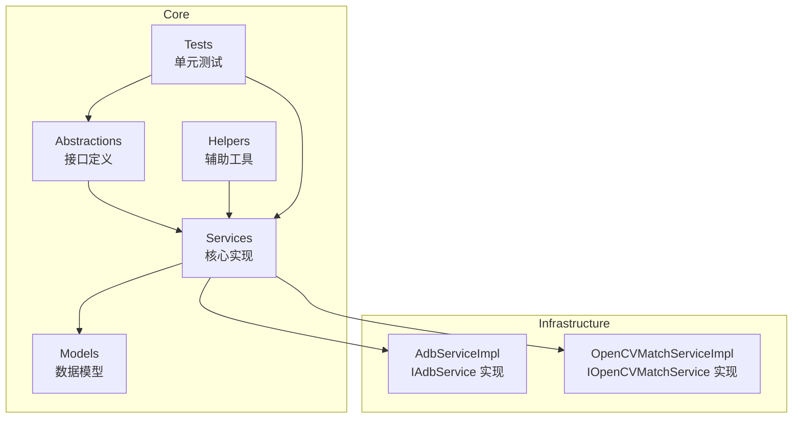
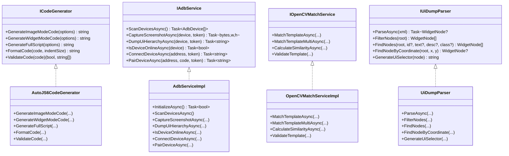
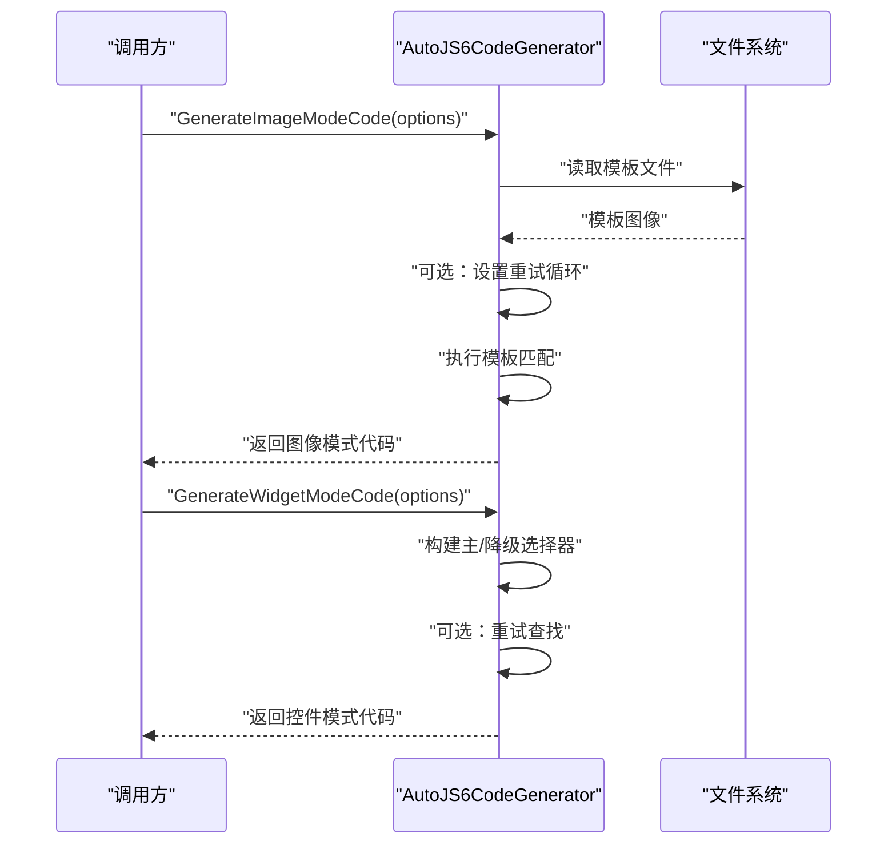
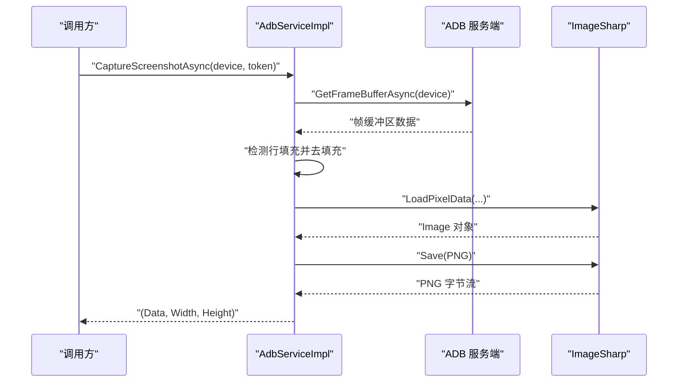
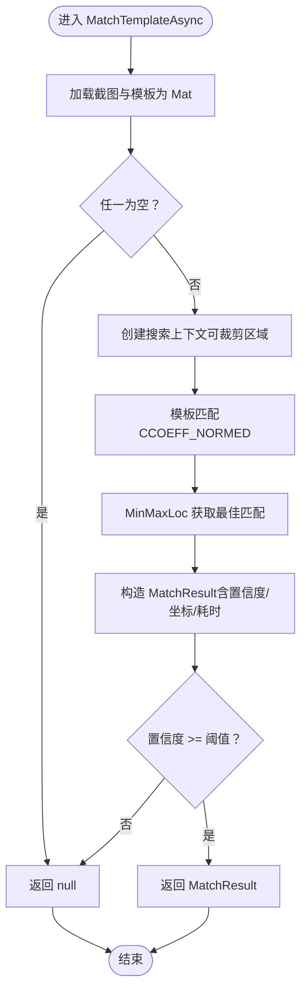
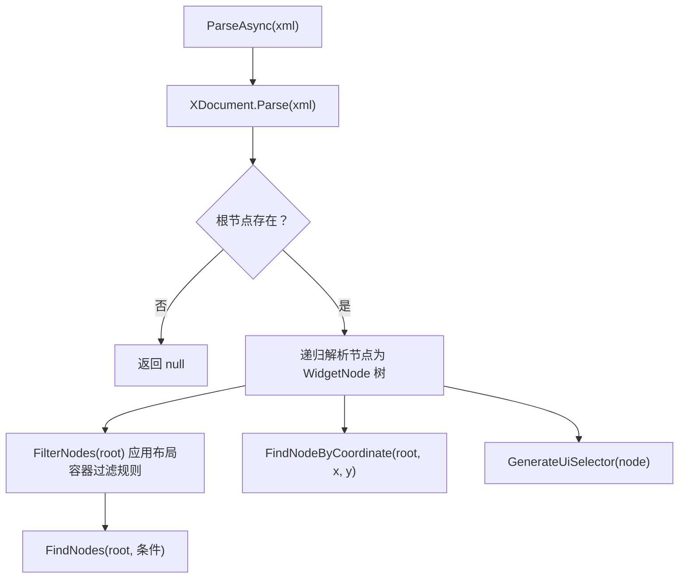
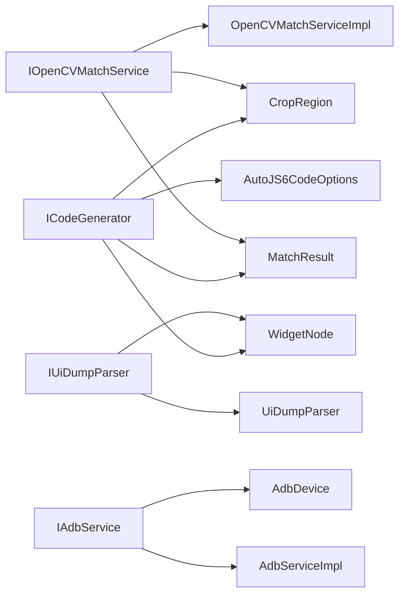
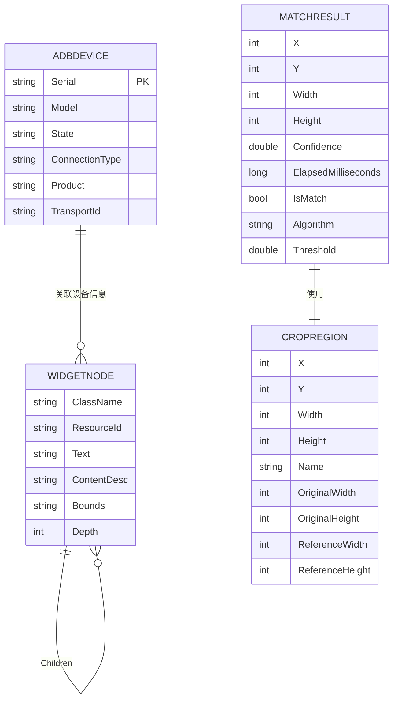

# API 参考

<cite>
**本文引用的文件**
- [ICodeGenerator.cs](file://Core/Abstractions/ICodeGenerator.cs)
- [IAdbService.cs](file://Core/Abstractions/IAdbService.cs)
- [IOpenCVMatchService.cs](file://Core/Abstractions/IOpenCVMatchService.cs)
- [IUiDumpParser.cs](file://Core/Abstractions/IUiDumpParser.cs)
- [AutoJS6CodeGenerator.cs](file://Core/Services/AutoJS6CodeGenerator.cs)
- [AdbServiceImpl.cs](file://Infrastructure/Adb/AdbServiceImpl.cs)
- [OpenCVMatchServiceImpl.cs](file://Infrastructure/Imaging/OpenCVMatchServiceImpl.cs)
- [UiDumpParser.cs](file://Core/Services/UiDumpParser.cs)
- [AutoJS6CodeOptions.cs](file://Core/Models/AutoJS6CodeOptions.cs)
- [AdbDevice.cs](file://Core/Models/AdbDevice.cs)
- [MatchResult.cs](file://Core/Models/MatchResult.cs)
- [WidgetNode.cs](file://Core/Models/WidgetNode.cs)
- [CropRegion.cs](file://Core/Models/CropRegion.cs)
- [ImageMatchRegionCalculator.cs](file://Core/Helpers/ImageMatchRegionCalculator.cs)
- [AutoJS6CodeGeneratorTests.cs](file://Core.Tests/AutoJS6CodeGeneratorTests.cs)
- [UiDumpParserTests.cs](file://Core.Tests/UiDumpParserTests.cs)
- [ImageMatchRegionCalculatorTests.cs](file://Core.Tests/ImageMatchRegionCalculatorTests.cs)
</cite>

## 目录
1. [简介](#简介)
2. [项目结构](#项目结构)
3. [核心组件](#核心组件)
4. [架构总览](#架构总览)
5. [详细组件分析](#详细组件分析)
6. [依赖分析](#依赖分析)
7. [性能考虑](#性能考虑)
8. [故障排除指南](#故障排除指南)
9. [结论](#结论)
10. [附录](#附录)

## 简介
本文件为 AutoJS6 开发工具的 API 参考文档，覆盖以下关键接口与其具体实现：
- ICodeGenerator：AutoJS6 代码生成器接口，负责生成图像模式与控件模式的 JavaScript 代码，并提供代码格式化与校验能力。
- IAdbService：ADB 设备管理接口，提供设备扫描、截图捕获、UI Dump 获取、设备连接与配对等能力。
- IOpenCVMatchService：OpenCV 模板匹配服务接口，提供单/多模板匹配、相似度计算与模板有效性验证。
- IUiDumpParser：UI Dump 解析器接口，负责解析 Android UI 层次 XML，过滤冗余布局容器，查找控件节点并生成 UiSelector。

文档同时给出各接口的继承关系、实现类映射、方法签名、参数说明、返回值类型、异常处理与使用示例，并提供最佳实践与常见错误避免指南。

## 项目结构
该仓库采用分层架构：
- Core/Abstractions：定义领域接口（Abstractions），隔离业务契约。
- Core/Services：实现核心业务逻辑（Services），如代码生成器、UI 解析器。
- Infrastructure：基础设施实现（如 ADB、图像处理），对接第三方库。
- Core/Models：跨层共享的数据模型。
- Core/Helpers：辅助工具类。
- Core.Tests：单元测试，验证接口行为与实现细节。

**图表来源**
- [ICodeGenerator.cs:8-45](file://Core/Abstractions/ICodeGenerator.cs#L8-L45)
- [IAdbService.cs:8-56](file://Core/Abstractions/IAdbService.cs#L8-L56)
- [IOpenCVMatchService.cs:8-56](file://Core/Abstractions/IOpenCVMatchService.cs#L8-L56)
- [IUiDumpParser.cs:8-55](file://Core/Abstractions/IUiDumpParser.cs#L8-L55)
- [AutoJS6CodeGenerator.cs:11-356](file://Core/Services/AutoJS6CodeGenerator.cs#L11-L356)
- [AdbServiceImpl.cs:17-237](file://Infrastructure/Adb/AdbServiceImpl.cs#L17-L237)
- [OpenCVMatchServiceImpl.cs:11-203](file://Infrastructure/Imaging/OpenCVMatchServiceImpl.cs#L11-L203)
- [UiDumpParser.cs:12-262](file://Core/Services/UiDumpParser.cs#L12-L262)

**章节来源**
- [ICodeGenerator.cs:1-46](file://Core/Abstractions/ICodeGenerator.cs#L1-L46)
- [IAdbService.cs:1-57](file://Core/Abstractions/IAdbService.cs#L1-L57)
- [IOpenCVMatchService.cs:1-57](file://Core/Abstractions/IOpenCVMatchService.cs#L1-L57)
- [IUiDumpParser.cs:1-56](file://Core/Abstractions/IUiDumpParser.cs#L1-L56)

## 核心组件
本节概述四个核心接口及其职责：
- ICodeGenerator：面向 AutoJS6 的代码生成器，支持图像模式（images.findImage）、控件模式（UiSelector）、完整脚本生成、代码格式化与校验。
- IAdbService：设备生命周期与设备侧数据采集，包括设备扫描、截图、UI Dump、在线状态检查、网络设备连接与配对。
- IOpenCVMatchService：图像模板匹配，支持单/多匹配、相似度计算与模板校验。
- IUiDumpParser：UI Dump XML 解析与控件树构建，支持节点过滤、条件查找、坐标定位与 UiSelector 生成。

**章节来源**
- [ICodeGenerator.cs:8-45](file://Core/Abstractions/ICodeGenerator.cs#L8-L45)
- [IAdbService.cs:8-56](file://Core/Abstractions/IAdbService.cs#L8-L56)
- [IOpenCVMatchService.cs:8-56](file://Core/Abstractions/IOpenCVMatchService.cs#L8-L56)
- [IUiDumpParser.cs:8-55](file://Core/Abstractions/IUiDumpParser.cs#L8-L55)

## 架构总览
下图展示接口与实现之间的关系及典型调用链：

**图表来源**
- [ICodeGenerator.cs:8-45](file://Core/Abstractions/ICodeGenerator.cs#L8-L45)
- [AutoJS6CodeGenerator.cs:11-356](file://Core/Services/AutoJS6CodeGenerator.cs#L11-L356)
- [IAdbService.cs:8-56](file://Core/Abstractions/IAdbService.cs#L8-L56)
- [AdbServiceImpl.cs:17-237](file://Infrastructure/Adb/AdbServiceImpl.cs#L17-L237)
- [IOpenCVMatchService.cs:8-56](file://Core/Abstractions/IOpenCVMatchService.cs#L8-L56)
- [OpenCVMatchServiceImpl.cs:11-203](file://Infrastructure/Imaging/OpenCVMatchServiceImpl.cs#L11-L203)
- [IUiDumpParser.cs:8-55](file://Core/Abstractions/IUiDumpParser.cs#L8-L55)
- [UiDumpParser.cs:12-262](file://Core/Services/UiDumpParser.cs#L12-L262)

## 详细组件分析

### ICodeGenerator 接口与 AutoJS6CodeGenerator 实现
- GenerateImageModeCode(options): 生成图像模式代码（基于 images.findImage）。支持阈值、区域裁剪、重试逻辑与模板回收。
- GenerateWidgetModeCode(options): 生成控件模式代码（基于 UiSelector）。支持主选择器与降级选择器（id/text/desc/className/bounds），可选重试与点击。
- GenerateFullScript(options): 生成完整脚本（含头注释与模式标识）。
- FormatCode(code, indentSize): 简单的代码缩进格式化。
- ValidateCode(code): 对 Rhino 引擎约束进行校验（循环体内禁止 const/let）。

参数与返回值要点：
- AutoJS6CodeOptions：包含模式、阈值、重试次数、超时、变量前缀、模板路径、裁剪区域、控件节点、是否生成重试/超时/日志/图像回收、横竖屏方向等。
- 返回值类型：字符串（代码）、元组（是否有效, 错误列表）。

异常处理与边界：
- 控件模式缺少 WidgetNode 时抛出参数异常。
- 格式化与校验逻辑对输入有明确要求，需确保传入合法配置。

使用示例（路径参考）：
- 图像模式生成与模板回收：[AutoJS6CodeGeneratorTests.cs:10-39](file://Core.Tests/AutoJS6CodeGeneratorTests.cs#L10-L39)
- 控件模式选择器降级顺序与 boundsInside：[AutoJS6CodeGeneratorTests.cs:41-78](file://Core.Tests/AutoJS6CodeGeneratorTests.cs#L41-L78)

最佳实践：
- 图像模式建议开启模板回收以释放内存。
- 控件模式优先使用资源 ID，其次文本，再内容描述，最后类名与边界限定。
- 在循环中避免使用 const/let，遵循 ValidateCode 的约束。

**章节来源**
- [ICodeGenerator.cs:8-45](file://Core/Abstractions/ICodeGenerator.cs#L8-L45)
- [AutoJS6CodeGenerator.cs:11-356](file://Core/Services/AutoJS6CodeGenerator.cs#L11-L356)
- [AutoJS6CodeOptions.cs:6-88](file://Core/Models/AutoJS6CodeOptions.cs#L6-L88)
- [AutoJS6CodeGeneratorTests.cs:10-78](file://Core.Tests/AutoJS6CodeGeneratorTests.cs#L10-L78)

#### ICodeGenerator 方法调用序列

**图表来源**
- [AutoJS6CodeGenerator.cs:13-163](file://Core/Services/AutoJS6CodeGenerator.cs#L13-L163)
- [AutoJS6CodeOptions.cs:6-88](file://Core/Models/AutoJS6CodeOptions.cs#L6-L88)

### IAdbService 接口与 AdbServiceImpl 实现
- ScanDevicesAsync(): 扫描连接的设备，返回设备列表。
- CaptureScreenshotAsync(device, token): 拉取设备截图（PNG 字节流、宽、高），内部处理帧缓冲区行填充与像素格式转换。
- DumpUiHierarchyAsync(device, token): 拉取 UI 层次 XML。
- IsDeviceOnlineAsync(device): 检查设备在线状态。
- ConnectDeviceAsync(address, token): TCP/IP 连接网络设备。
- PairDeviceAsync(address, code, token): 使用配对码配对网络设备。

参数与返回值要点：
- AdbDevice：包含序列号、型号、状态、连接类型、产品、传输 ID 等字段。
- 截图返回三元组（字节流, 宽, 高）。

异常处理与边界：
- 设备不存在或命令失败时抛出无效操作异常。
- 连接/配对异常会被包装为无效操作异常并携带原始错误消息。

使用示例（路径参考）：
- 设备扫描与状态判断：[AdbServiceImpl.cs:51-70](file://Infrastructure/Adb/AdbServiceImpl.cs#L51-L70)
- 截图与 PNG 编码：[AdbServiceImpl.cs:72-118](file://Infrastructure/Adb/AdbServiceImpl.cs#L72-L118)
- UI Dump 获取与异常处理：[AdbServiceImpl.cs:120-138](file://Infrastructure/Adb/AdbServiceImpl.cs#L120-L138)
- 连接/配对异常包装：[AdbServiceImpl.cs:150-179](file://Infrastructure/Adb/AdbServiceImpl.cs#L150-L179)

最佳实践：
- 先调用 InitializeAsync 初始化 ADB 服务端。
- 使用 CancellationToken 支持取消操作。
- 注意网络设备连接前先配对。

**章节来源**
- [IAdbService.cs:8-56](file://Core/Abstractions/IAdbService.cs#L8-L56)
- [AdbServiceImpl.cs:17-237](file://Infrastructure/Adb/AdbServiceImpl.cs#L17-L237)
- [AdbDevice.cs:6-37](file://Core/Models/AdbDevice.cs#L6-L37)

#### IAdbService 调用流程（截图）

**图表来源**
- [AdbServiceImpl.cs:72-118](file://Infrastructure/Adb/AdbServiceImpl.cs#L72-L118)

### IOpenCVMatchService 接口与 OpenCVMatchServiceImpl 实现
- MatchTemplateAsync(screenshot, template, threshold, region, token): 单模板匹配，返回最佳匹配结果（含置信度、坐标、耗时、算法、阈值）。
- MatchTemplateMultiAsync(screenshot, template, threshold, region, token): 多模板匹配，返回所有超过阈值的匹配。
- CalculateSimilarityAsync(image1, image2): 计算两张图片的相似度。
- ValidateTemplate(template): 验证模板是否有效（非空且尺寸大于零）。

参数与返回值要点：
- MatchResult：包含 X/Y、Width/Height、Confidence、ElapsedMilliseconds、ClickX/ClickY、IsMatch、Algorithm、Threshold。
- CropRegion：支持 X/Y/Width/Height、名称、原图尺寸与参考分辨率。

异常处理与边界：
- 匹含空图像或匹配失败时返回空/空列表/0.0。
- 搜索区域会进行安全裁剪与坐标偏移。

使用示例（路径参考）：
- 单/多模板匹配与结果结构：[OpenCVMatchServiceImpl.cs:13-122](file://Infrastructure/Imaging/OpenCVMatchServiceImpl.cs#L13-L122)
- 相似度计算与模板校验：[OpenCVMatchServiceImpl.cs:124-161](file://Infrastructure/Imaging/OpenCVMatchServiceImpl.cs#L124-L161)

最佳实践：
- 合理设置阈值（默认 0.8），过高易漏检，过低易误检。
- 使用 CropRegion 限定搜索区域以提升性能与准确性。
- 模板尺寸与截图分辨率不一致时，建议先做预处理或使用 regionRef。

**章节来源**
- [IOpenCVMatchService.cs:8-56](file://Core/Abstractions/IOpenCVMatchService.cs#L8-L56)
- [OpenCVMatchServiceImpl.cs:11-203](file://Infrastructure/Imaging/OpenCVMatchServiceImpl.cs#L11-L203)
- [MatchResult.cs:6-62](file://Core/Models/MatchResult.cs#L6-L62)
- [CropRegion.cs:6-52](file://Core/Models/CropRegion.cs#L6-L52)

#### IOpenCVMatchService 匹配流程（单模板）

**图表来源**
- [OpenCVMatchServiceImpl.cs:13-60](file://Infrastructure/Imaging/OpenCVMatchServiceImpl.cs#L13-L60)

### IUiDumpParser 接口与 UiDumpParser 实现
- ParseAsync(xml): 解析 UI Dump XML，返回控件树根节点；解析失败返回空。
- FilterNodes(root): 过滤布局容器（仅包含类名含 Layout 且无资源 ID/文本/内容描述/可点击的节点）。
- FindNodes(root, id?, text?, desc?, class?): 条件查找控件节点。
- FindNodeByCoordinate(root, x, y): 基于坐标查找最深层匹配控件。
- GenerateUiSelector(node): 生成 UiSelector 代码字符串（优先资源 ID，其次文本/内容描述/类名，补充边界限定）。

参数与返回值要点：
- WidgetNode：包含类名、资源 ID、文本、内容描述、边界、属性集合、子节点列表等。
- 生成的 UiSelector 以“.”拼接并以 findOne() 结尾。

异常处理与边界：
- XML 解析异常返回空；坐标不在节点内返回空。
- 布局容器过滤规则来自 MVP2 最佳实践。

使用示例（路径参考）：
- XML 解析与布局容器过滤：[UiDumpParserTests.cs:9-36](file://Core.Tests/UiDumpParserTests.cs#L9-L36)
- 坐标定位与边界匹配：[UiDumpParserTests.cs:38-62](file://Core.Tests/UiDumpParserTests.cs#L38-L62)
- 无效 XML 返回空：[UiDumpParserTests.cs:64-72](file://Core.Tests/UiDumpParserTests.cs#L64-L72)

最佳实践：
- 优先使用资源 ID 生成选择器，其次文本与内容描述，最后类名与边界。
- 坐标定位适合快速定位，但需注意层级关系与边界重叠。

**章节来源**
- [IUiDumpParser.cs:8-55](file://Core/Abstractions/IUiDumpParser.cs#L8-L55)
- [UiDumpParser.cs:12-262](file://Core/Services/UiDumpParser.cs#L12-L262)
- [WidgetNode.cs:6-92](file://Core/Models/WidgetNode.cs#L6-L92)
- [UiDumpParserTests.cs:9-72](file://Core.Tests/UiDumpParserTests.cs#L9-L72)

#### IUiDumpParser 解析与查找流程

**图表来源**
- [UiDumpParser.cs:14-97](file://Core/Services/UiDumpParser.cs#L14-L97)

## 依赖分析
- ICodeGenerator 依赖 AutoJS6CodeOptions 与 CropRegion/WidgetNode/MatcResult 等模型。
- IAdbService 依赖 AdbDevice 与 AdvancedSharpAdbClient、ImageSharp。
- IOpenCVMatchService 依赖 OpenCvSharp 与 MatchResult/CropRegion。
- IUiDumpParser 依赖 WidgetNode 与 LINQ to XML。

**图表来源**
- [ICodeGenerator.cs:8-45](file://Core/Abstractions/ICodeGenerator.cs#L8-L45)
- [IAdbService.cs:8-56](file://Core/Abstractions/IAdbService.cs#L8-L56)
- [IOpenCVMatchService.cs:8-56](file://Core/Abstractions/IOpenCVMatchService.cs#L8-L56)
- [IUiDumpParser.cs:8-55](file://Core/Abstractions/IUiDumpParser.cs#L8-L55)
- [AutoJS6CodeOptions.cs:6-88](file://Core/Models/AutoJS6CodeOptions.cs#L6-L88)
- [AdbDevice.cs:6-37](file://Core/Models/AdbDevice.cs#L6-L37)
- [MatchResult.cs:6-62](file://Core/Models/MatchResult.cs#L6-L62)
- [WidgetNode.cs:6-92](file://Core/Models/WidgetNode.cs#L6-L92)
- [CropRegion.cs:6-52](file://Core/Models/CropRegion.cs#L6-L52)

**章节来源**
- [AutoJS6CodeOptions.cs:6-88](file://Core/Models/AutoJS6CodeOptions.cs#L6-L88)
- [AdbDevice.cs:6-37](file://Core/Models/AdbDevice.cs#L6-L37)
- [MatchResult.cs:6-62](file://Core/Models/MatchResult.cs#L6-L62)
- [WidgetNode.cs:6-92](file://Core/Models/WidgetNode.cs#L6-L92)
- [CropRegion.cs:6-52](file://Core/Models/CropRegion.cs#L6-L52)

## 性能考虑
- 图像匹配
  - 使用 CropRegion 限制搜索区域，显著降低计算量。
  - 合理设置阈值与重试间隔，避免频繁截图与匹配。
  - 模板回收与内存管理：图像模式建议启用模板回收。
- ADB 截图
  - 帧缓冲区可能包含行填充，实现中已处理去填充逻辑，避免额外解码成本。
  - PNG 编码在内存中完成，注意大图内存占用。
- UI 解析
  - XML 解析为一次性任务，建议缓存解析结果或增量更新。
  - 坐标查找采用自顶向下递归，建议先过滤节点减少遍历范围。
- 代码生成
  - ValidateCode 会在循环体内检测 const/let，避免运行时错误与性能问题。

[本节为通用指导，无需特定文件引用]

## 故障排除指南
- ICodeGenerator
  - 控件模式缺少 WidgetNode：抛出参数异常。请确保传入有效 WidgetNode。
  - Rhino 引擎约束：循环体内禁止 const/let。请使用 ValidateCode 校验生成代码。
  - 示例参考：[AutoJS6CodeGeneratorTests.cs:10-78](file://Core.Tests/AutoJS6CodeGeneratorTests.cs#L10-L78)
- IAdbService
  - 设备未找到或命令失败：抛出无效操作异常。检查设备序列号与连接状态。
  - 连接/配对异常：包装为无效操作异常并包含原始消息。请核对地址与配对码。
  - 示例参考：[AdbServiceImpl.cs:72-179](file://Infrastructure/Adb/AdbServiceImpl.cs#L72-L179)
- IOpenCVMatchService
  - 匹配返回空：可能是模板为空、图像为空或阈值过高。调整阈值或检查输入。
  - 相似度为 0：图像尺寸不一致或为空。请确保尺寸一致且非空。
  - 示例参考：[OpenCVMatchServiceImpl.cs:13-161](file://Infrastructure/Imaging/OpenCVMatchServiceImpl.cs#L13-L161)
- IUiDumpParser
  - XML 解析失败：返回空。请检查 UI Dump 来源与完整性。
  - 坐标不在节点内：返回空。请确认坐标与边界。
  - 示例参考：[UiDumpParserTests.cs:64-72](file://Core.Tests/UiDumpParserTests.cs#L64-L72)

**章节来源**
- [AutoJS6CodeGeneratorTests.cs:10-78](file://Core.Tests/AutoJS6CodeGeneratorTests.cs#L10-L78)
- [AdbServiceImpl.cs:72-179](file://Infrastructure/Adb/AdbServiceImpl.cs#L72-L179)
- [OpenCVMatchServiceImpl.cs:13-161](file://Infrastructure/Imaging/OpenCVMatchServiceImpl.cs#L13-L161)
- [UiDumpParserTests.cs:64-72](file://Core.Tests/UiDumpParserTests.cs#L64-L72)

## 结论
本文档系统梳理了 ICodeGenerator、IAdbService、IOpenCVMatchService、IUiDumpParser 四个核心接口及其在 Core/Infrastructure 中的具体实现，给出了方法签名、参数说明、返回值类型、异常处理与使用示例，并提供了最佳实践与故障排除建议。通过接口与实现分离的设计，开发者可以灵活替换实现或扩展功能，同时保持 API 的稳定性与一致性。

[本节为总结性内容，无需特定文件引用]

## 附录

### 数据模型概览

**图表来源**
- [AdbDevice.cs:6-37](file://Core/Models/AdbDevice.cs#L6-L37)
- [WidgetNode.cs:6-92](file://Core/Models/WidgetNode.cs#L6-L92)
- [MatchResult.cs:6-62](file://Core/Models/MatchResult.cs#L6-L62)
- [CropRegion.cs:6-52](file://Core/Models/CropRegion.cs#L6-L52)

### 图像匹配区域计算器（辅助工具）
- 功能：基于参考矩形与内边距生成搜索区域与 regionRef 数组，并确定横竖屏方向。
- 输入：CropRegion（包含原始宽高、参考分辨率）与 padding。
- 输出：ImageMatchRegionContext（包含参考边界、搜索区域、regionRef、方向）。
- 示例参考：[ImageMatchRegionCalculatorTests.cs:10-58](file://Core.Tests/ImageMatchRegionCalculatorTests.cs#L10-L58)

**章节来源**
- [ImageMatchRegionCalculator.cs:35-97](file://Core/Helpers/ImageMatchRegionCalculator.cs#L35-L97)
- [ImageMatchRegionCalculatorTests.cs:10-58](file://Core.Tests/ImageMatchRegionCalculatorTests.cs#L10-L58)