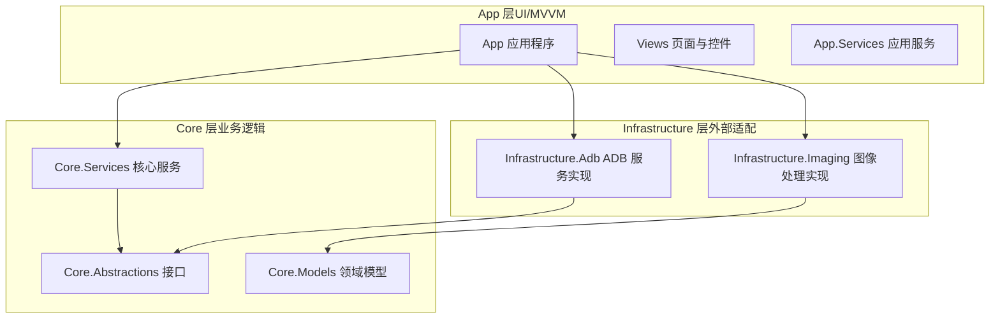
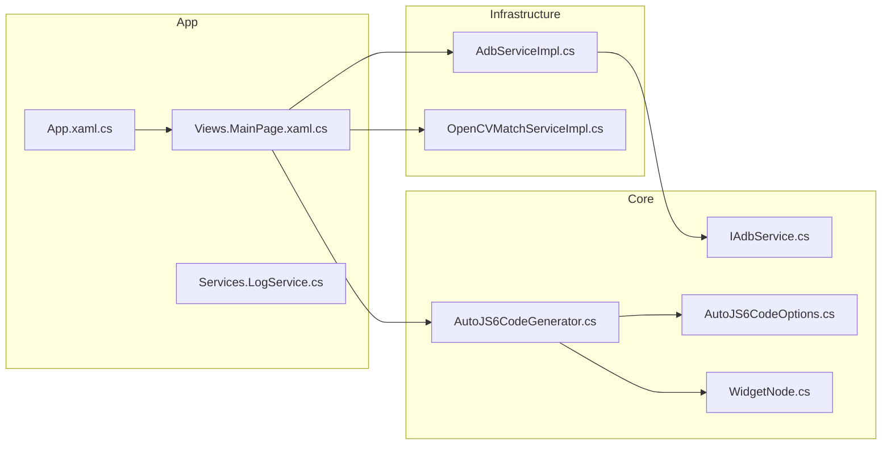
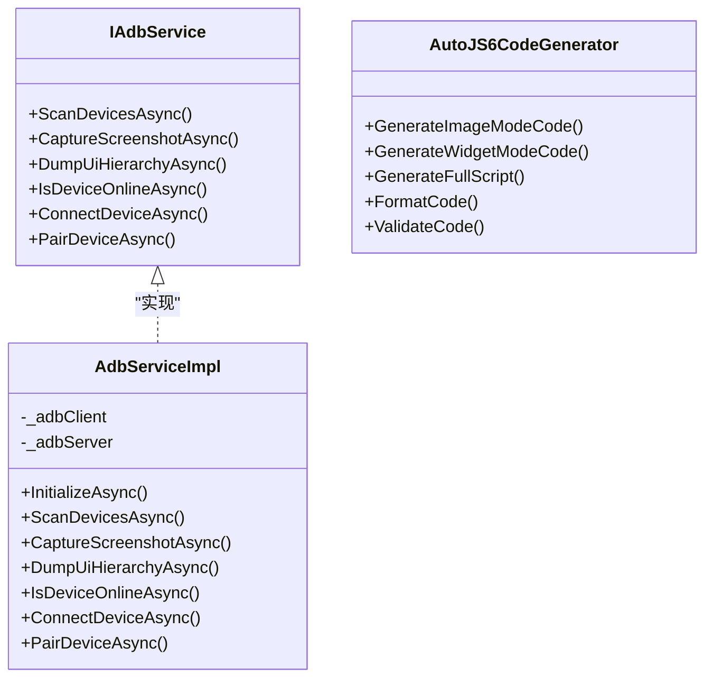
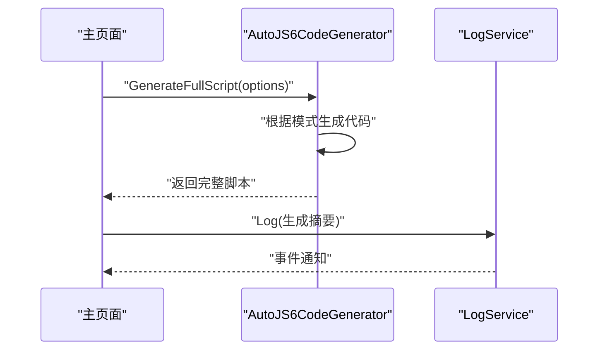
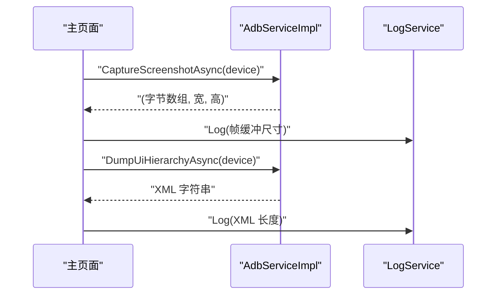
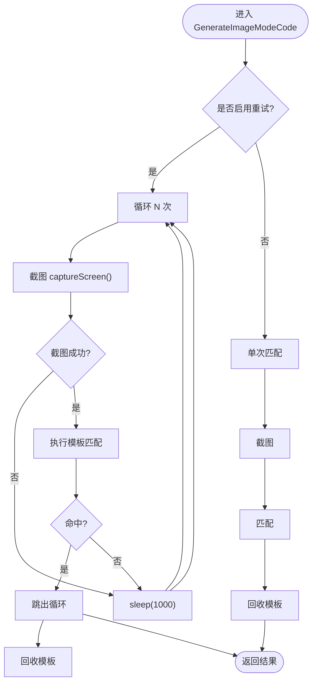
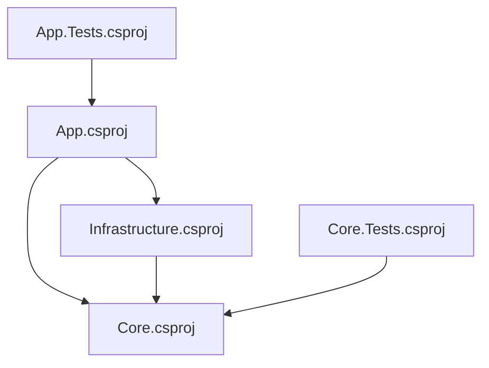

# 代码规范与约定

<cite>
**本文引用的文件**
- [README.md](file://README.md)
- [DEVELOPMENT.md](file://DEVELOPMENT.md)
- [checklist.md](file://checklist.md)
- [App.xaml.cs](file://App/App.xaml.cs)
- [App.xaml](file://App/App.xaml)
- [App.csproj](file://App/App.csproj)
- [Services\LogService.cs](file://App/Services/LogService.cs)
- [Views\MainPage.xaml.cs](file://App/Views/MainPage.xaml.cs)
- [Core.csproj](file://Core/Core.csproj)
- [Core\Abstractions\IAdbService.cs](file://Core/Abstractions/IAdbService.cs)
- [Core\Services\AutoJS6CodeGenerator.cs](file://Core/Services/AutoJS6CodeGenerator.cs)
- [Core\Models\AutoJS6CodeOptions.cs](file://Core/Models/AutoJS6CodeOptions.cs)
- [Core\Models\WidgetNode.cs](file://Core/Models/WidgetNode.cs)
- [Infrastructure\Infrastructure.csproj](file://Infrastructure/Infrastructure.csproj)
- [Infrastructure\Adb\AdbServiceImpl.cs](file://Infrastructure/Adb/AdbServiceImpl.cs)
- [App.Tests\App.Tests.csproj](file://App.Tests/App.Tests.csproj)
- [Core.Tests\Core.Tests.csproj](file://Core.Tests/Core.Tests.csproj)
</cite>

## 目录
1. [引言](#引言)
2. [项目结构](#项目结构)
3. [核心组件](#核心组件)
4. [架构总览](#架构总览)
5. [详细组件分析](#详细组件分析)
6. [依赖关系分析](#依赖关系分析)
7. [性能考虑](#性能考虑)
8. [故障排查指南](#故障排查指南)
9. [结论](#结论)
10. [附录](#附录)

## 引言
本文件旨在制定 AutoJS6 开发工具项目的代码规范与约定标准，覆盖文件命名、代码组织、注释与文档、Clean Architecture 实践以及代码审查与质量保障。规范以现有仓库为基础提炼，并结合项目 README、开发指南与测试清单，形成统一、可执行的工程准则。

## 项目结构
项目采用 Clean Architecture 分层与 WinUI 3 应用结构，分为三层：
- Core：纯业务逻辑层，无 UI 依赖，独立可测试
- Infrastructure：外部依赖适配层（ADB、图像处理）
- App：UI 与 MVVM 层（WinUI 3）

图表来源
- [README.md:230-287](file://README.md#L230-L287)
- [App\App.csproj](file://App/App.csproj)
- [Core\Core.csproj](file://Core/Core.csproj)
- [Infrastructure\Infrastructure.csproj](file://Infrastructure/Infrastructure.csproj)

章节来源
- [README.md:230-287](file://README.md#L230-L287)

## 核心组件
- 应用入口与资源
  - 应用入口类负责初始化主窗口与导航；资源字典集中管理样式与主题。
- 日志服务
  - 单例日志服务统一输出，支持 UI 订阅事件，便于调试与用户反馈。
- 主页面与交互
  - 主页面协调设备、截图、UI 解析、裁剪与代码生成流程，贯穿异步与状态管理。
- 核心服务与模型
  - 代码生成器实现 AutoJS6 代码生成与校验；领域模型承载配置与控件信息。
- ADB 服务实现
  - 提供设备扫描、截图捕获、UI 层级导出、连接与配对等能力。

章节来源
- [App\App.xaml.cs:22-56](file://App/App.xaml.cs#L22-L56)
- [App\App.xaml:7-78](file://App/App.xaml#L7-L78)
- [App\Services\LogService.cs:9-50](file://App/Services/LogService.cs#L9-L50)
- [App\Views\MainPage.xaml.cs:14-60](file://App/Views/MainPage.xaml.cs#L14-L60)
- [Core\Services\AutoJS6CodeGenerator.cs:11-357](file://Core/Services/AutoJS6CodeGenerator.cs#L11-L357)
- [Core\Models\AutoJS6CodeOptions.cs:6-89](file://Core/Models/AutoJS6CodeOptions.cs#L6-L89)
- [Core\Models\WidgetNode.cs:6-93](file://Core/Models/WidgetNode.cs#L6-L93)
- [Infrastructure\Adb\AdbServiceImpl.cs:17-238](file://Infrastructure/Adb/AdbServiceImpl.cs#L17-L238)

## 架构总览
Clean Architecture 在本项目中的落地要点：
- 依赖方向：App → Infrastructure → Core；Core 不依赖 UI
- 接口优先：Core.Abstractions 定义服务契约，Infrastructure 实现具体适配
- 异步优先：所有 I/O 操作采用 async/await，避免阻塞 UI 线程
- 双引擎隔离：图像引擎与 UI 引擎数据源、处理管线、渲染与代码生成完全解耦

图表来源
- [README.md:264-287](file://README.md#L264-L287)
- [App\App.xaml.cs:22-56](file://App/App.xaml.cs#L22-L56)
- [App\Views\MainPage.xaml.cs:14-60](file://App/Views/MainPage.xaml.cs#L14-L60)
- [Infrastructure\Adb\AdbServiceImpl.cs:17-238](file://Infrastructure/Adb/AdbServiceImpl.cs#L17-L238)
- [Core\Services\AutoJS6CodeGenerator.cs:11-357](file://Core/Services/AutoJS6CodeGenerator.cs#L11-L357)
- [Core\Models\AutoJS6CodeOptions.cs:6-89](file://Core/Models/AutoJS6CodeOptions.cs#L6-L89)
- [Core\Models\WidgetNode.cs:6-93](file://Core/Models/WidgetNode.cs#L6-L93)

## 详细组件分析

### 文件命名约定
- 项目文件
  - 解决方案文件：autojs6-dev-tools.slnx
  - 项目文件：*.csproj
- 源代码文件
  - 类文件：CamelCase.cs（如 AdbServiceImpl.cs、AutoJS6CodeGenerator.cs）
  - 接口文件：I命名前缀 + CamelCase.cs（如 IAdbService.cs）
  - 枚举/模型：CamelCase.cs（如 AutoJS6CodeOptions.cs、WidgetNode.cs）
- 资源文件
  - XAML 资源字典与样式：App.xaml 中集中定义
  - 代码模板：App/CodeTemplates/ 下存放 AutoJS6 代码模板文件
- 测试项目
  - App.Tests 与 Core.Tests 使用 MSTest 配置，命名与项目一一对应

章节来源
- [App\App.xaml:1-79](file://App/App.xaml#L1-L79)
- [App\App.csproj](file://App/App.csproj)
- [Core\Core.csproj](file://Core/Core.csproj)
- [Infrastructure\Infrastructure.csproj](file://Infrastructure/Infrastructure.csproj)
- [App.Tests\App.Tests.csproj:1-17](file://App.Tests/App.Tests.csproj#L1-L17)
- [Core.Tests\Core.Tests.csproj:1-21](file://Core.Tests/Core.Tests.csproj#L1-L21)

### 代码组织结构与职责划分
- 命名空间设计
  - App、Core、Infrastructure 对应三层命名空间，避免跨层引用
- 文件夹结构
  - App：Views、ViewModels、Services、Models、Resources、Assets、CodeTemplates
  - Core：Abstractions、Models、Services、Helpers
  - Infrastructure：Adb、Imaging
- 类的职责
  - 服务类：单一职责，如 AdbServiceImpl、AutoJS6CodeGenerator
  - 模型类：只承载数据与简单转换，如 AutoJS6CodeOptions、WidgetNode
  - 视图类：仅处理 UI 事件与状态呈现，业务逻辑委托给服务层

章节来源
- [README.md:230-260](file://README.md#L230-L260)
- [App\App.csproj](file://App/App.csproj)
- [Core\Core.csproj](file://Core/Core.csproj)
- [Infrastructure\Infrastructure.csproj](file://Infrastructure/Infrastructure.csproj)

### 注释标准与文档编写规范
- XML 注释
  - 类与成员使用 XML 注释，说明用途、参数、返回值与异常
  - 示例：IAdbService、AutoJS6CodeGenerator、AdbServiceImpl
- 代码块注释
  - 关键算法与复杂流程添加行内注释，解释决策依据与边界条件
  - 示例：代码生成器中的匹配与重试逻辑
- TODO 标记
  - 使用 TODO 标识临时实现或待优化点，配合任务跟踪
- 文档编写
  - README 提供高层架构与特性说明
  - DEVELOPMENT.md 提供开发与发布流程
  - checklist.md 作为发布验证清单

章节来源
- [Core\Abstractions\IAdbService.cs:5-56](file://Core/Abstractions/IAdbService.cs#L5-L56)
- [Core\Services\AutoJS6CodeGenerator.cs:7-102](file://Core/Services/AutoJS6CodeGenerator.cs#L7-L102)
- [Infrastructure\Adb\AdbServiceImpl.cs:13-17](file://Infrastructure/Adb/AdbServiceImpl.cs#L13-L17)
- [README.md:1-100](file://README.md#L1-L100)
- [DEVELOPMENT.md:1-60](file://DEVELOPMENT.md#L1-L60)
- [checklist.md:1-40](file://checklist.md#L1-L40)

### Clean Architecture 实现约定
- 接口定义
  - Core.Abstractions 定义服务契约，App 与 Infrastructure 仅依赖接口
- 依赖注入
  - 通过构造函数注入实现依赖反转，避免硬编码具体实现
- 分层编码规范
  - App：UI 事件与状态，不直接访问外部库
  - Infrastructure：封装外部依赖（ADB、OpenCV），向 Core 暴露抽象
  - Core：纯业务逻辑，独立于 UI 与外部依赖

图表来源
- [Core\Abstractions\IAdbService.cs:8-56](file://Core/Abstractions/IAdbService.cs#L8-L56)
- [Infrastructure\Adb\AdbServiceImpl.cs:17-238](file://Infrastructure/Adb/AdbServiceImpl.cs#L17-L238)
- [Core\Services\AutoJS6CodeGenerator.cs:11-357](file://Core/Services/AutoJS6CodeGenerator.cs#L11-L357)

章节来源
- [README.md:264-287](file://README.md#L264-L287)
- [Core\Abstractions\IAdbService.cs:8-56](file://Core/Abstractions/IAdbService.cs#L8-L56)
- [Infrastructure\Adb\AdbServiceImpl.cs:17-238](file://Infrastructure/Adb/AdbServiceImpl.cs#L17-L238)
- [Core\Services\AutoJS6CodeGenerator.cs:11-357](file://Core/Services/AutoJS6CodeGenerator.cs#L11-L357)

### 代码生成与校验流程

图表来源
- [App\Views\MainPage.xaml.cs:14-60](file://App/Views/MainPage.xaml.cs#L14-L60)
- [Core\Services\AutoJS6CodeGenerator.cs:166-189](file://Core/Services/AutoJS6CodeGenerator.cs#L166-L189)
- [App\Services\LogService.cs:39-49](file://App/Services/LogService.cs#L39-L49)

### ADB 截图与 UI 解析流程

图表来源
- [App\Views\MainPage.xaml.cs:147-178](file://App/Views/MainPage.xaml.cs#L147-L178)
- [App\Views\MainPage.xaml.cs:180-248](file://App/Views/MainPage.xaml.cs#L180-L248)
- [Infrastructure\Adb\AdbServiceImpl.cs:72-138](file://Infrastructure/Adb/AdbServiceImpl.cs#L72-L138)
- [App\Services\LogService.cs:39-49](file://App/Services/LogService.cs#L39-L49)

### 代码生成器算法流程

图表来源
- [Core\Services\AutoJS6CodeGenerator.cs:13-102](file://Core/Services/AutoJS6CodeGenerator.cs#L13-L102)

## 依赖关系分析
- 项目引用
  - Infrastructure 依赖 Core
  - App 依赖 Infrastructure 与 Core
- 外部依赖
  - Infrastructure 引入 ADB 与图像处理相关包
- 测试项目
  - App.Tests 与 Core.Tests 分别针对 UI 层与核心层进行单元测试

图表来源
- [Infrastructure\Infrastructure.csproj:9-11](file://Infrastructure/Infrastructure.csproj#L9-L11)
- [App.Tests\App.Tests.csproj](file://App.Tests/App.Tests.csproj)
- [Core.Tests\Core.Tests.csproj](file://Core.Tests/Core.Tests.csproj)

章节来源
- [Infrastructure\Infrastructure.csproj:9-11](file://Infrastructure/Infrastructure.csproj#L9-L11)
- [App.Tests\App.Tests.csproj:1-17](file://App.Tests/App.Tests.csproj#L1-L17)
- [Core.Tests\Core.Tests.csproj:1-21](file://Core.Tests/Core.Tests.csproj#L1-L21)

## 性能考虑
- 异步与取消令牌
  - 所有 I/O 操作使用 async/await 并支持 CancellationToken，避免 UI 卡顿
- 渲染与资源
  - 采用 GPU 加速渲染与合理释放图像资源，降低内存占用
- 代码生成约束
  - 遵循 AutoJS6 运行时限制，避免循环体内使用 const/let，防止变量绑定问题

章节来源
- [README.md:282-287](file://README.md#L282-L287)
- [README.md:342-374](file://README.md#L342-L374)
- [Core\Services\AutoJS6CodeGenerator.cs:226-258](file://Core/Services/AutoJS6CodeGenerator.cs#L226-L258)

## 故障排查指南
- 发布验证清单
  - 使用 checklist.md 的 P0/P1 条目逐项验证安装、启动、ADB 连接、截图、匹配与代码生成等关键路径
- 开发与打包流程
  - 参考 DEVELOPMENT.md 的本地验证顺序与测试打包流程，定位构建与签名问题
- 常见问题定位
  - ADB 服务冷启动、不同分辨率坐标对齐、连续匹配内存增长、失败重试后按钮状态卡死等风险点需重点关注

章节来源
- [checklist.md:1-186](file://checklist.md#L1-L186)
- [DEVELOPMENT.md:47-131](file://DEVELOPMENT.md#L47-L131)
- [checklist.md:146-153](file://checklist.md#L146-L153)

## 结论
本规范以 Clean Architecture 为核心，结合项目现有实现，明确了命名、组织、注释、架构与质量保障的统一标准。建议团队在日常开发中严格遵循，确保一致性与可维护性。

## 附录
- 术语
  - Clean Architecture：分层架构，强调关注点分离与依赖倒置
  - 双引擎：图像引擎（像素级）与 UI 引擎（控件级）相互独立
- 参考
  - 项目 README、DEVELOPMENT.md、checklist.md