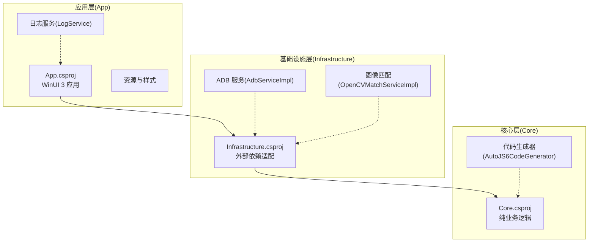
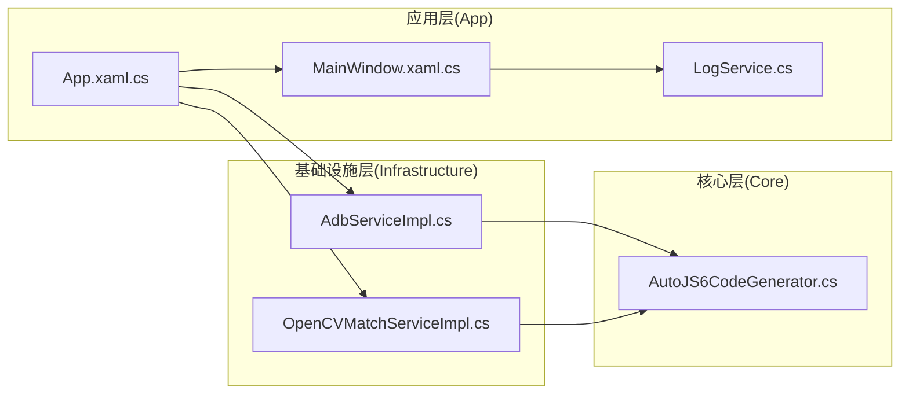
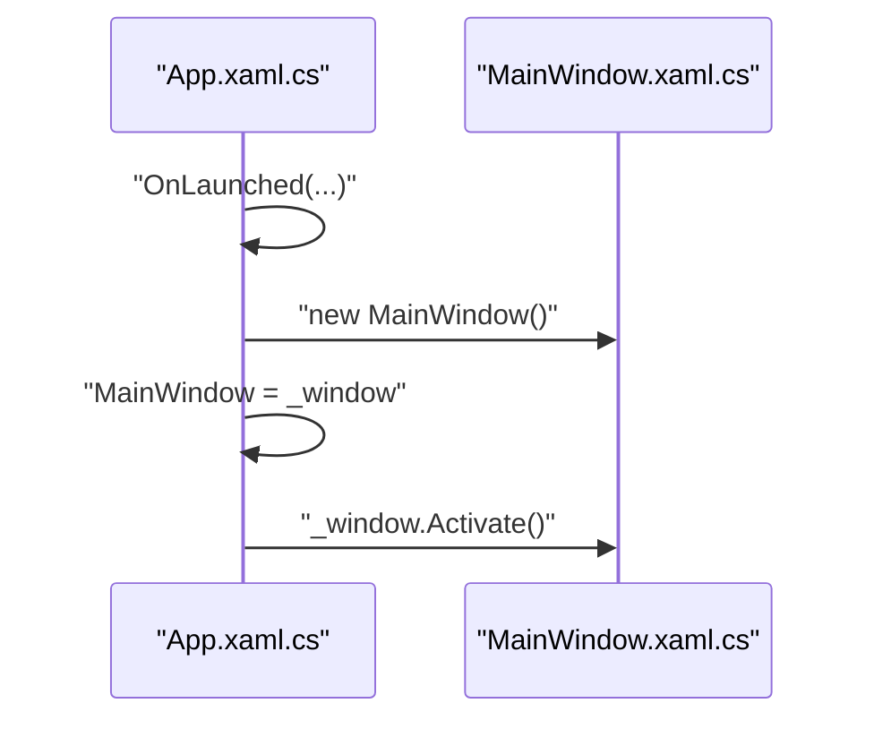
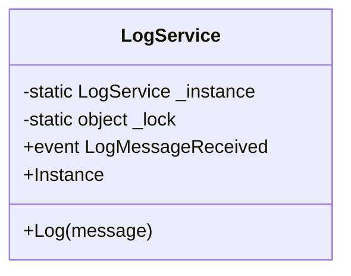
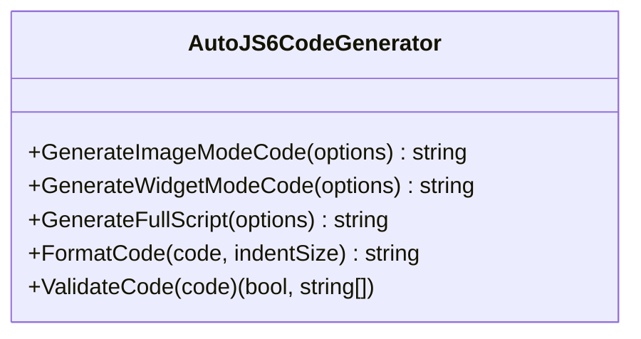
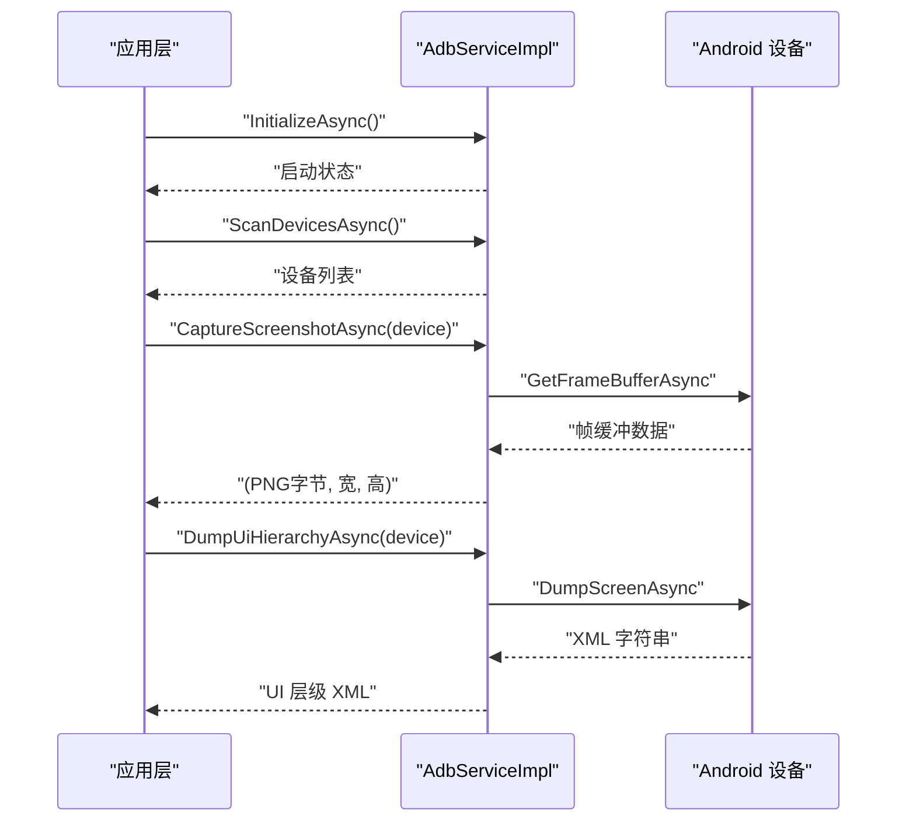
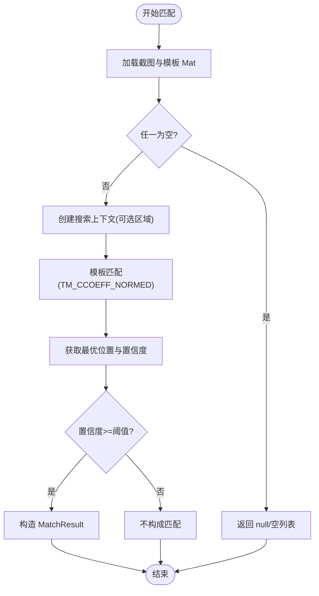
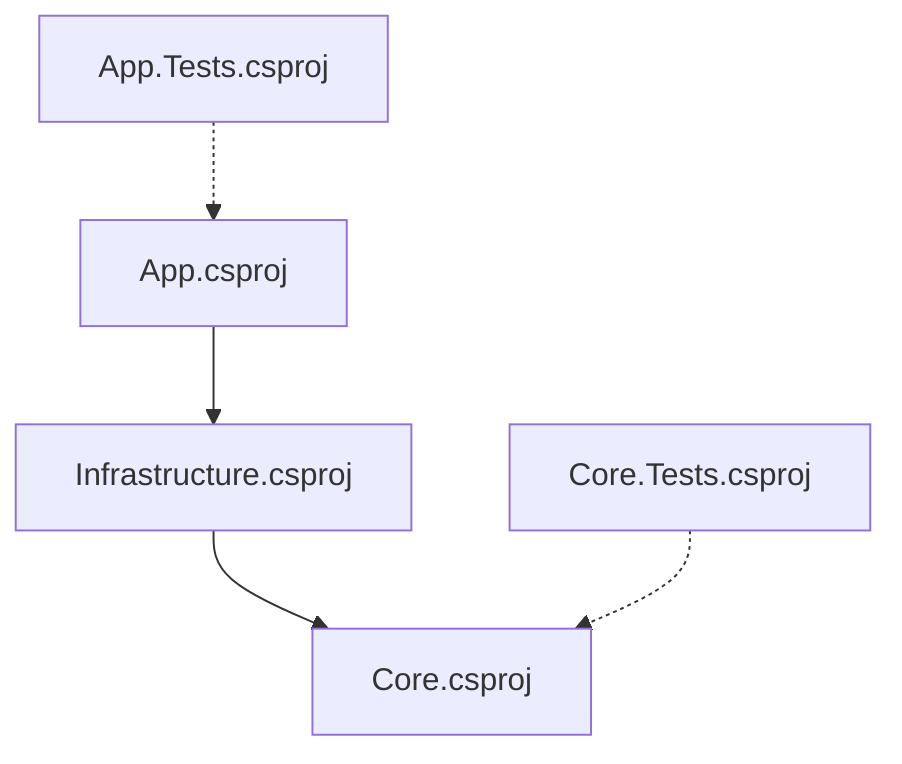
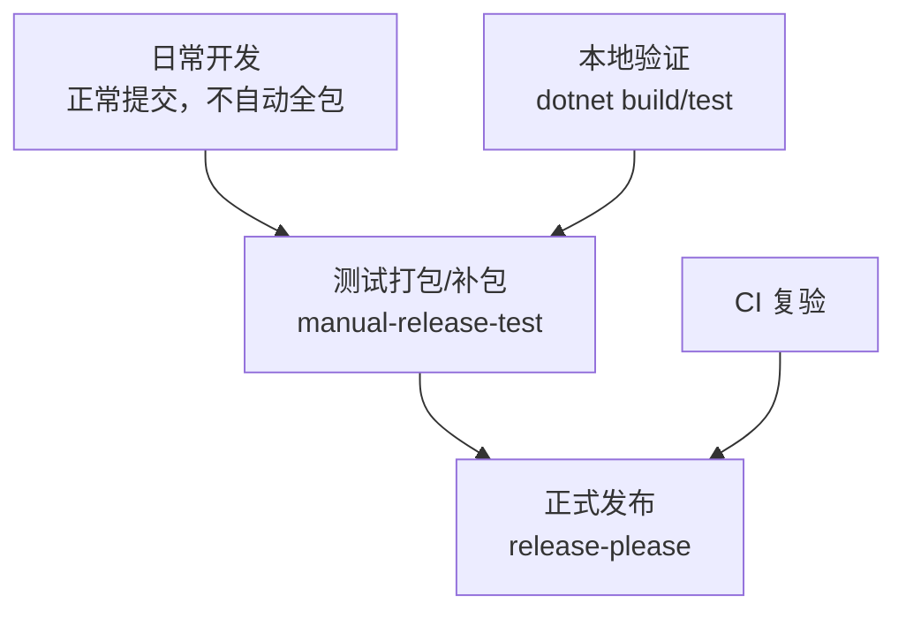

# 开发指南

<cite>
**本文引用的文件**
- [DEVELOPMENT.md](file://DEVELOPMENT.md)
- [DEVELOPMENT_zh_CN.md](file://DEVELOPMENT_zh_CN.md)
- [README.md](file://README.md)
- [README_zh_CN.md](file://README_zh_CN.md)
- [RELEASE_TEST.md](file://RELEASE_TEST.md)
- [RELEASE_TEST_zh_CN.md](file://RELEASE_TEST_zh_CN.md)
- [manual.md](file://manual.md)
- [checklist.md](file://checklist.md)
- [PROXY.md](file://PROXY.md)
- [PROXY_zh_CN.md](file://PROXY_zh_CN.md)
- [App.csproj](file://App/App.csproj)
- [Core.csproj](file://Core/Core.csproj)
- [Infrastructure.csproj](file://Infrastructure/Infrastructure.csproj)
- [App.Tests.csproj](file://App.Tests/App.Tests.csproj)
- [Core.Tests.csproj](file://Core.Tests/Core.Tests.csproj)
- [launchSettings.json](file://App/Properties/launchSettings.json)
- [App.xaml.cs](file://App/App.xaml.cs)
- [App.xaml](file://App/App.xaml)
- [MainWindow.xaml.cs](file://App/MainWindow.xaml.cs)
- [MainWindow.xaml](file://App/MainWindow.xaml)
- [LogService.cs](file://App/Services/LogService.cs)
- [AutoJS6CodeGenerator.cs](file://Core/Services/AutoJS6CodeGenerator.cs)
- [AdbServiceImpl.cs](file://Infrastructure/Adb/AdbServiceImpl.cs)
- [OpenCVMatchServiceImpl.cs](file://Infrastructure/Imaging/OpenCVMatchServiceImpl.cs)
</cite>

## 更新摘要
**变更内容**
- 新增全面的开发指南文档体系，包括英文和中文版本的 DEVELOPMENT.md 和 DEVELOPMENT_zh_CN.md
- 建立了三阶段发布工作流模型：日常开发、测试打包/补包、正式发布
- 增强了开发环境设置和本地验证流程的文档化
- 完善了发布测试文档入口章节，显著改善了文档导航体验
- 新增了详细的 GitHub Actions 使用手册和验证清单
- README文档重组，移除了旧的Documentation Entry部分，新增了Release Test Documentation Entry部分
- 更新了捐赠图片和赞助商信息

## 目录
1. [简介](#简介)
2. [项目结构](#项目结构)
3. [核心组件](#核心组件)
4. [架构总览](#架构总览)
5. [详细组件分析](#详细组件分析)
6. [依赖关系分析](#依赖关系分析)
7. [性能考虑](#性能考虑)
8. [故障排查指南](#故障排查指南)
9. [发布测试文档入口](#发布测试文档入口)
10. [三阶段发布工作流](#三阶段发布工作流)
11. [结论](#结论)
12. [附录](#附录)

## 简介
本开发指南面向 AutoJS6 开发工具的贡献者与维护者，系统性阐述开发环境搭建、项目构建与运行、代码规范与约定、调试与性能优化、测试策略与质量保障、以及部署与发布流程。该工具采用 WinUI 3 构建桌面应用，结合 Core 层纯业务逻辑与 Infrastructure 层外部依赖适配，形成清晰分层与可测试的架构。

**更新** 新增了全面的开发指南文档体系，包括英文和中文版本的 DEVELOPMENT.md 和 DEVELOPMENT_zh_CN.md，建立了三阶段发布工作流模型，显著改善了开发者在发布测试相关的文档导航体验，使从发布测试入口到具体操作文档的路径更加清晰直观。README文档重组后，新增了专门的发布测试文档入口，进一步优化了文档结构。

## 项目结构
项目采用多项目解决方案，按关注点分层组织：
- App：WinUI 3 应用层，包含视图、视图模型、服务与资源
- Core：纯业务逻辑层，无 UI 依赖，独立可测试
- Infrastructure：外部依赖适配层，封装 ADB 通信与图像处理
- App.Tests / Core.Tests：应用层与核心层测试项目

**图表来源**
- [App.csproj:1-84](file://App/App.csproj#L1-L84)
- [Core.csproj:1-10](file://Core/Core.csproj#L1-L10)
- [Infrastructure.csproj:1-19](file://Infrastructure/Infrastructure.csproj#L1-L19)

**章节来源**
- [README.md: 项目结构与架构原则:261-291](file://README.md#L261-L291)
- [App.csproj:1-84](file://App/App.csproj#L1-L84)
- [Core.csproj:1-10](file://Core/Core.csproj#L1-L10)
- [Infrastructure.csproj:1-19](file://Infrastructure/Infrastructure.csproj#L1-L19)

## 核心组件
- 应用入口与窗口
  - 应用程序类负责初始化与主窗口激活
  - 主窗口启动时最大化，提升工作台体验
- 日志服务
  - 单例日志服务，统一输出到调试控制台与 UI 事件
- 代码生成器
  - 支持图像模式与控件模式的 AutoJS6 脚本生成
  - 提供代码校验与格式化能力
- ADB 服务
  - 设备扫描、截图捕获、UI 层级转储、网络设备连接与配对
- 图像匹配服务
  - 基于 OpenCV 的模板匹配与相似度计算，支持区域限定与多结果返回

**章节来源**
- [App.xaml.cs:27-55](file://App/App.xaml.cs#L27-L55)
- [MainWindow.xaml.cs:26-51](file://App/MainWindow.xaml.cs#L26-L51)
- [LogService.cs:9-50](file://App/Services/LogService.cs#L9-L50)
- [AutoJS6CodeGenerator.cs:11-357](file://Core/Services/AutoJS6CodeGenerator.cs#L11-L357)
- [AdbServiceImpl.cs:17-238](file://Infrastructure/Adb/AdbServiceImpl.cs#L17-L238)
- [OpenCVMatchServiceImpl.cs:11-204](file://Infrastructure/Imaging/OpenCVMatchServiceImpl.cs#L11-L204)

## 架构总览
系统采用 Clean Architecture 分层，严格解耦：
- App → Infrastructure → Core：单向依赖
- 双引擎独立：图像引擎与 UI 引擎数据流与渲染逻辑完全隔离
- 异步优先：所有 I/O 操作使用 async/await，避免阻塞 UI 线程

**图表来源**
- [App.xaml.cs:27-55](file://App/App.xaml.cs#L27-L55)
- [MainWindow.xaml.cs:26-51](file://App/MainWindow.xaml.cs#L26-L51)
- [LogService.cs:9-50](file://App/Services/LogService.cs#L9-L50)
- [AdbServiceImpl.cs:17-238](file://Infrastructure/Adb/AdbServiceImpl.cs#L17-L238)
- [OpenCVMatchServiceImpl.cs:11-204](file://Infrastructure/Imaging/OpenCVMatchServiceImpl.cs#L11-L204)
- [AutoJS6CodeGenerator.cs:11-357](file://Core/Services/AutoJS6CodeGenerator.cs#L11-L357)

## 详细组件分析

### 应用入口与窗口生命周期
- 应用启动时创建主窗口并激活
- 主窗口启动即最大化，确保工作台空间充分利用

**图表来源**
- [App.xaml.cs:49-54](file://App/App.xaml.cs#L49-L54)
- [MainWindow.xaml.cs:28-50](file://App/MainWindow.xaml.cs#L28-L50)

**章节来源**
- [App.xaml.cs:27-55](file://App/App.xaml.cs#L27-L55)
- [MainWindow.xaml.cs:26-51](file://App/MainWindow.xaml.cs#L26-L51)

### 日志服务设计
- 单例模式，线程安全
- 统一事件接口，便于 UI 订阅展示
- 自动添加时间戳，便于问题定位

**图表来源**
- [LogService.cs:9-50](file://App/Services/LogService.cs#L9-L50)

**章节来源**
- [LogService.cs:9-50](file://App/Services/LogService.cs#L9-L50)

### 代码生成器（AutoJS6）
- 图像模式：生成基于 images.findImage 的脚本，支持重试与模板回收
- 控件模式：生成基于 UiSelector 的脚本，支持主备选择器链
- 代码校验：检测 Rhino 引擎循环体内 const/let 约束
- 代码格式化：简单缩进格式化

**图表来源**
- [AutoJS6CodeGenerator.cs:11-357](file://Core/Services/AutoJS6CodeGenerator.cs#L11-L357)

**章节来源**
- [AutoJS6CodeGenerator.cs:11-357](file://Core/Services/AutoJS6CodeGenerator.cs#L11-L357)

### ADB 服务（设备管理与截图）
- 初始化 ADB 服务器
- 扫描设备、连接/配对网络设备
- 截图捕获（帧缓冲解析、行填充处理、PNG 编码）
- UI 层级转储（XML）

**图表来源**
- [AdbServiceImpl.cs:33-138](file://Infrastructure/Adb/AdbServiceImpl.cs#L33-L138)

**章节来源**
- [AdbServiceImpl.cs:17-238](file://Infrastructure/Adb/AdbServiceImpl.cs#L17-L238)

### 图像匹配服务（OpenCV）
- 单点匹配：返回最高置信度位置与结果
- 多点匹配：返回所有高于阈值的结果
- 相似度计算：基于 CCoeffNormed
- 区域限定：支持指定搜索区域并保持坐标偏移

**图表来源**
- [OpenCVMatchServiceImpl.cs:13-122](file://Infrastructure/Imaging/OpenCVMatchServiceImpl.cs#L13-L122)

**章节来源**
- [OpenCVMatchServiceImpl.cs:11-204](file://Infrastructure/Imaging/OpenCVMatchServiceImpl.cs#L11-L204)

## 依赖关系分析
- App 依赖 Infrastructure，Infrastructure 依赖 Core
- App 项目启用 Msix 打包与 WinUI 3，引用 WinAppSDK 与社区工具包
- 测试项目分别针对 App 与 Core 层，使用 MSTest

**图表来源**
- [App.csproj:67-68](file://App/App.csproj#L67-L68)
- [Infrastructure.csproj:10-11](file://Infrastructure/Infrastructure.csproj#L10-L11)
- [App.Tests.csproj:1-17](file://App.Tests/App.Tests.csproj#L1-L17)
- [Core.Tests.csproj:1-21](file://Core.Tests/Core.Tests.csproj#L1-L21)

**章节来源**
- [App.csproj:1-84](file://App/App.csproj#L1-L84)
- [Infrastructure.csproj:1-19](file://Infrastructure/Infrastructure.csproj#L1-L19)
- [Core.csproj:1-10](file://Core/Core.csproj#L1-L10)
- [App.Tests.csproj:1-17](file://App.Tests/App.Tests.csproj#L1-L17)
- [Core.Tests.csproj:1-21](file://Core.Tests/Core.Tests.csproj#L1-L21)

## 性能考虑
- 渲染性能
  - Win2D GPU 加速双层画布，目标 60 FPS；建议避免在 UI 线程进行重型计算
- I/O 与异步
  - 所有外部 I/O（ADB、OpenCV、XML 解析、纹理上传）使用 async/await，配合取消令牌
- 内存与对象复用
  - 截图与模板图像及时回收，减少 GC 压力
- 匹配效率
  - 优先使用区域匹配，缩小搜索范围；避免在循环中重复截图
- 构建与发布
  - 发布构建禁用 ReadyToRun/Trim，确保兼容性优先

**章节来源**
- [README.md: 架构原则与异步优先:295-318](file://README.md#L295-L318)
- [README.md: AutoJS6 代码生成约束:373-404](file://README.md#L373-L404)
- [App.csproj: 发布配置:79-82](file://App/App.csproj#L79-L82)

## 故障排查指南
- 本地 dotnet build Release 失败
  - 检查平台目标是否明确（非 AnyCPU），避免默认 Trim/R2R
- MSIX 签名失败
  - 确认证书 Subject 与清单 Publisher 完全一致，Signtool 可用，证书导入受信任存储
- EXE 安装器失败
  - 确认 Inno Setup 6 的 ISCC.exe 可用，输出目录可写，发布产物存在
- 测试打包流程失败
  - 先修复代码与打包配置，再进行生产发布
- 生产发布缺失文件
  - 基于已有标签重建并重新上传至同一 Release，避免版本号污染

**章节来源**
- [DEVELOPMENT.md: 常见问题与修复建议:182-250](file://DEVELOPMENT.md#L182-L250)

## 发布测试文档入口

**更新** 新增专门的发布测试文档入口，显著改善了开发者在发布测试相关的文档导航体验。README文档重组后，新增了专门的Release Test Documentation Entry部分，提供了更清晰的文档入口结构。

### 发布测试文档入口概述

为了提升开发者在发布测试相关工作时的文档可发现性，项目新增了专门的发布测试文档入口。这些入口提供了从发布测试到具体操作文档的清晰导航路径，确保开发者能够快速找到所需的发布测试相关信息。

### 英文发布测试入口

- **主入口文档**：`RELEASE_TEST.md`
  - 作用：发布测试工作的起点，提供完整的发布测试文档导航
  - 适合：英文优先的开发者工作流
  - 内容：包含操作手册、验证清单、代理配置和开发指南的链接

### 中文发布测试入口

- **主入口文档**：`RELEASE_TEST_zh_CN.md`
  - 作用：发布测试工作的起点，提供完整的发布测试文档导航
  - 适合：中文优先的开发者工作流
  - 内容：包含操作手册、验证清单、代理配置和开发指南的链接

### 发布测试文档导航路径

从发布测试入口文档到具体操作文档的推荐路径：

#### 路径一：发布测试工作流
1. **`RELEASE_TEST.md`** 或 **`RELEASE_TEST_zh_CN.md`**（主入口）
2. **`manual.md`**（操作手册）
3. **`checklist.md`**（验证清单）

#### 路径二：GitHub Actions 配置问题
1. **`RELEASE_TEST.md`** 或 **`RELEASE_TEST_zh_CN.md`**（主入口）
2. **`PROXY.md`** 或 **`PROXY_zh_CN.md`**（代理配置）
3. **`manual.md`**（操作手册）

#### 路径三：工作流脚本修改
1. **`RELEASE_TEST.md`** 或 **`RELEASE_TEST_zh_CN.md`**（主入口）
2. **`DEVELOPMENT.md`** 或 **`DEVELOPMENT_zh_CN.md`**（开发指南）

### 发布测试文档内容结构

#### 操作手册 (`manual.md`)
- 详细说明如何运行 `manual-release-test` 和 `release-please`
- 每一步操作的检查要点
- 成功判断标准

#### 验证清单 (`checklist.md`)
- 从最终用户视角判断包是否可发布的标准
- 包含 P0/P1 严重级别的分类
- 条件项的执行标准

#### 代理配置 (`PROXY.md`/`PROXY_zh_CN.md`)
- 解决 GitHub 推送/代理导致的工作流可见性问题
- 详细的代理配置步骤和验证方法

#### 开发指南 (`DEVELOPMENT.md`/`DEVELOPMENT_zh_CN.md`)
- 项目发布路径和工作流职责说明
- 发布测试的最佳实践和注意事项

### 发布测试工作流场景

#### 仅测试打包场景
1. 阅读 `manual.md`
2. 阅读 `checklist.md`
3. 执行 `manual-release-test` 工作流
4. 验证产物完整性

#### 测试上传到 GitHub Release 场景
1. 阅读 `manual.md`
2. 阅读 `checklist.md`
3. 执行 `manual-release-test` 工作流（开启上传）
4. 验证 Release 页面资产完整性

#### GitHub Push/Actions 不显示问题
1. 阅读 `PROXY_zh_CN.md` 或 `PROXY.md`
2. 阅读 `manual.md`
3. 解决代理配置问题
4. 验证 GitHub Actions 可见性

### 发布测试文档的优势

**更新** 发布测试文档入口的增强带来了以下优势：

1. **清晰的导航路径**：从发布测试入口到具体操作文档的路径更加直观
2. **多语言支持**：同时提供英文和中文版本，满足不同语言需求
3. **场景化设计**：针对不同的发布测试场景提供专门的导航路径
4. **入职体验改善**：新开发者可以更快找到相关的发布测试文档
5. **工作效率提升**：减少了在文档中寻找相关信息的时间成本

**章节来源**
- [RELEASE_TEST.md:1-63](file://RELEASE_TEST.md#L1-L63)
- [RELEASE_TEST_zh_CN.md:1-59](file://RELEASE_TEST_zh_CN.md#L1-L59)
- [manual.md:1-224](file://manual.md#L1-L224)
- [checklist.md:1-186](file://checklist.md#L1-L186)
- [PROXY.md:1-150](file://PROXY.md#L1-L150)
- [PROXY_zh_CN.md:1-323](file://PROXY_zh_CN.md#L1-L323)

## 三阶段发布工作流

**更新** 新增了完整的三阶段发布工作流模型，为项目发布提供了清晰的指导框架。

### 日常开发阶段

日常开发阶段遵循"不浪费构建资源"的原则：
- 正常开发和提交，不自动构建完整发布包
- 避免频繁开发产生大量低价值构建
- 大多数提交不需要立即产出完整安装包
- 保持简单：正常提交，无自动全包构建

当确实需要验证包的可用性时，再主动触发测试打包流程。

### 测试打包/补包阶段

测试打包和补包使用统一的工作流：
- **工作流名称**：`manual-release-test`
- **覆盖场景**：
  1. 验证包是否仍可使用（工作流/脚本变更后）
  2. 修复现有 Release 缺失文件的问题

#### 验证包可用性场景
- 工作流刚改过
- 打包脚本刚改过  
- 发布前需要确认 ZIP/EXE/MSIX 可用性

#### 补包场景
- 正式 Release 页面已存在
- ZIP/EXE/MSIX 缺文件
- 上传中途失败

### 正式发布阶段

正式发布由 `release-please` 工作流处理：
- 推荐顺序：merge → 等待 PR → 不急合并 → 运行测试打包 → 确认可用 → 合并 PR → 自动发布
- 优势：版本号稳定、tag 不被污染、问题追溯更准确

### 三阶段工作流的核心原则

1. **日常开发不浪费资源**：避免不必要的全包构建
2. **验证阶段独立进行**：不污染公共发布页面  
3. **正式发布只处理已确认版本**：确保发布质量

**图表来源**
- [DEVELOPMENT.md: 三阶段发布工作流:5-16](file://DEVELOPMENT.md#L5-L16)
- [DEVELOPMENT_zh_CN.md: 三阶段发布工作流:5-16](file://DEVELOPMENT_zh_CN.md#L5-L16)

**章节来源**
- [DEVELOPMENT.md: 日常开发:19-32](file://DEVELOPMENT.md#L19-L32)
- [DEVELOPMENT.md: 测试打包/补包:164-232](file://DEVELOPMENT.md#L164-L232)
- [DEVELOPMENT.md: 正式发布:235-263](file://DEVELOPMENT.md#L235-L263)
- [DEVELOPMENT_zh_CN.md: 日常开发:19-32](file://DEVELOPMENT_zh_CN.md#L19-L32)
- [DEVELOPMENT_zh_CN.md: 测试打包/补包:164-232](file://DEVELOPMENT_zh_CN.md#L164-L232)
- [DEVELOPMENT_zh_CN.md: 正式发布:235-263](file://DEVELOPMENT_zh_CN.md#L235-L263)

## 结论
本指南提供了从环境搭建到发布运维的全流程指引。通过严格的分层架构、异步 I/O、统一日志与测试体系，以及清晰的发布策略，可高效迭代并稳定交付高质量的开发工具。

**更新** 新增的全面开发指南文档体系进一步完善了文档结构，显著改善了开发者在发布测试相关工作时的文档导航体验。通过专门的发布测试文档入口、三阶段发布工作流模型、详细的 GitHub Actions 使用手册和验证清单，开发者可以更高效地找到所需的发布测试相关信息，提升了整体的开发和发布效率。README文档重组后，新增的Release Test Documentation Entry部分进一步优化了文档结构，使发布测试相关的文档入口更加清晰明确。

## 附录

### 开发环境搭建
- 必需组件
  - .NET 8 SDK
  - Visual Studio 2022/2026 或构建工具（含 MSBuild 与 Windows SDK）
  - WinUI 3 工作负载
  - ADB 工具（置于 PATH）
  - 可选：Inno Setup 6（用于 EXE 安装器构建）
- 推荐验证顺序
  - dotnet restore → dotnet build -c Release → dotnet test -c Release → 本地打包与烟测

**章节来源**
- [README.md: 快速开始与前置条件:125-139](file://README.md#L125-L139)
- [DEVELOPMENT.md: 本地发布前置条件与推荐序列:35-61](file://DEVELOPMENT.md#L35-L61)

### 项目构建与运行
- 包恢复与构建
  - dotnet restore autojs6-dev-tools.slnx
  - dotnet build autojs6-dev-tools.slnx -c Release
- 运行应用
  - dotnet run --project App/App.csproj
  - 或在 VS 中直接启动（F5）
- 启动配置
  - launchSettings.json 提供"应用"、"解包应用"、"打包应用"三种启动配置

**章节来源**
- [README.md: 构建与运行步骤:180-193](file://README.md#L180-L193)
- [launchSettings.json:1-14](file://App/Properties/launchSettings.json#L1-L14)

### 文档导航与发布测试
**更新** 新增专门的发布测试文档入口，改善了文档导航结构：

- **发布测试入口**：`RELEASE_TEST.md`（英文）和 `RELEASE_TEST_zh_CN.md`（中文）
- **操作手册**：`manual.md` - 详细说明如何运行 `manual-release-test` 和 `release-please`
- **验证清单**：`checklist.md` - 定义从最终用户视角判断包是否可发布的标准
- **代理配置**：`PROXY.md`/`PROXY_zh_CN.md` - 解决 GitHub 推送/代理导致的工作流可见性问题
- **开发指南**：`DEVELOPMENT.md`/`DEVELOPMENT_zh_CN.md` - 项目发布路径、工作流职责说明

**最短路径**：
1. 需要运行 `manual-release-test` → 先读 `manual.md`，再读 `checklist.md`
2. 需要解决 GitHub Push/Actions 不显示 → 先读 `PROXY.md`/`PROXY_zh_CN.md`，再读 `manual.md`
3. 需要修改 workflow token/secret/env → 先读 `DEVELOPMENT.md`/`DEVELOPMENT_zh_CN.md`

**章节来源**
- [RELEASE_TEST.md:1-63](file://RELEASE_TEST.md#L1-L63)
- [RELEASE_TEST_zh_CN.md:1-59](file://RELEASE_TEST_zh_CN.md#L1-L59)

### 代码规范与约定
- 文件命名与组织
  - App/Views、ViewModels、Services、Resources、Models 分层清晰
  - Core 与 Infrastructure 保持纯逻辑与适配职责
- 注释与可读性
  - 关键算法与外部依赖调用处提供注释说明
- 最佳实践
  - 保持模块规模（建议不超过 512 行）
  - 严格异步架构，避免阻塞 UI
  - 双引擎解耦，数据与渲染路径分离

**章节来源**
- [README.md: 开发工作流与检查清单:334-370](file://README.md#L334-L370)

### 调试技巧与性能优化
- 断点调试
  - 在 App、Infrastructure、Core 的边界处设置断点，观察数据流
- 日志记录
  - 使用 LogService 统一输出，结合 UI 实时查看
- 性能分析
  - 关注 OpenCV 匹配耗时与 UI 渲染帧率，必要时引入轻量计时
- 优化要点
  - 减少全屏匹配范围，使用区域裁剪
  - 控制模板数量与循环次数，避免重复截图

**章节来源**
- [LogService.cs:9-50](file://App/Services/LogService.cs#L9-L50)
- [OpenCVMatchServiceImpl.cs:13-60](file://Infrastructure/Imaging/OpenCVMatchServiceImpl.cs#L13-L60)

### 测试策略与质量保证
- 单元测试
  - Core.Tests 针对核心逻辑（如代码生成、匹配服务）
- 集成测试
  - App.Tests 验证应用层交互与 UI 场景
- 手动测试
  - 本地打包后在干净系统上进行 EXE 与 ZIP 启动验证
- 质量门禁
  - Release 构建与测试必须通过，再进行 CI 验证

**章节来源**
- [Core.Tests.csproj:1-21](file://Core.Tests/Core.Tests.csproj#L1-L21)
- [App.Tests.csproj:1-17](file://App.Tests/App.Tests.csproj#L1-L17)
- [README.md: 发布前质量检查:359-370](file://README.md#L359-L370)

### 部署与发布
- 产物优先级
  - EXE（最熟悉的安装体验）、ZIP（直接解压运行）
- 发布流程
  - routine：常规开发不自动全量打包
  - test packaging：需要验证时触发手动测试工作流
  - production：由 release-please 处理正式发布
- 修复策略
  - 若发布后文件缺失，基于既有标签重建并回传至同一 Release

**更新** 发布测试文档入口的添加使得发布流程更加规范化，开发者可以按照明确的文档路径进行发布前的验证和测试。

**章节来源**
- [DEVELOPMENT.md: 发布路径与流程:5-162](file://DEVELOPMENT.md#L5-L162)
- [DEVELOPMENT.md: 当前发布身份与排查清单:252-276](file://DEVELOPMENT.md#L252-L276)

### GitHub Actions 使用手册

**更新** 新增详细的 GitHub Actions 使用手册，涵盖 `manual-release-test` 和 `release-please` 工作流的完整使用指南。

#### manual-release-test 工作流
- **用途**：按指定代码来源打包并产出文件
- **可选动作**：上传到 GitHub Release
- **使用场景**：
  1. 只想测试打包
  2. 想测试上传到 GitHub Release

#### release-please 工作流
- **用途**：正式发版
- **使用场景**：要把版本正式发布到 `main`
- **监听分支**：`main`

#### 字段配置说明
| 字段 | 填写规则 |
|---|---|
| `source_ref` | 填这次要打包的**真实代码来源**。可以是分支名，也可以是 tag。 |
| `version` | 填这次要验证的**真实版本号**。格式必须是 `x.y.z`。不要填 `-test`、`-rc`、`v` 前缀。 |
| `publish_to_release` | 只测试打包填 `false`；要上传到 GitHub Release 才填 `true`。 |
| `release_tag` | 只有上传到 GitHub Release 时才填写。填这次上传要使用的真实 tag 名。普通打包测试留空。 |
| `release_name` | 只有上传到 GitHub Release 时才填写。填这次上传要显示的真实标题。普通打包测试留空。 |
| `prerelease` | 只在创建 GitHub Release 时生效。预演发布通常填 `true`。 |

**章节来源**
- [manual.md:1-224](file://manual.md#L1-L224)

### 发布测试验证清单

**更新** 新增详细的发布测试验证清单，定义了从最终用户视角判断包是否可发布的标准。

#### P0 必过项（阻塞项）
- **安装与启动**：便携包和安装包的启动、卸载验证
- **ADB 与设备连接**：设备发现、连接、截图功能验证
- **截图与画布基础能力**：画布加载、缩放、平移功能验证
- **图像模式主闭环**：裁剪、匹配、代码生成完整流程验证
- **控件模式主闭环**：UI 树解析、控件选择、代码生成验证
- **基础稳定性**：连续操作的稳定性验证

#### P1 建议通过项（可带问题发布）
- **组合路径验证**：多种模板/截图组合的匹配验证
- **反馈与可用性**：提示信息、日志、代码预览等功能验证
- **体验底线**：界面状态、Toast 提示、模式切换等体验验证

#### 条件项（仅当本次发布包含对应产物时执行）
- **ARM64 产物**：ARM64 便携包和安装包的启动、安装、卸载验证
- **MSIX 产物**：MSIX 安装包的安装、启动验证和证书说明

**章节来源**
- [checklist.md:1-186](file://checklist.md#L1-L186)

### 代理配置指南

**更新** 新增详细的代理配置指南，解决 GitHub 推送/代理导致的工作流可见性问题。

#### 适用场景
- 无法直接访问 GitHub 的网络环境
- `git clone`、`git fetch/pull/push`、浏览器访问 GitHub 失败
- 推送 `.github/workflows/*` 后 Actions 页面无工作流

#### 推荐默认方案
**改为 HTTPS 远端 + Git 代理**（最省事的方案）
- 配置最简单，最容易排查
- 对大多数本地代理软件最友好
- 不依赖额外 SSH 代理工具

#### 代理配置验证顺序
1. `curl.exe --proxy ... https://github.com`（网页连通性测试）
2. `git remote -v`（确认远端类型）
3. `git ls-remote origin`（验证远程仓库访问）
4. `git fetch origin`（验证拉取）
5. `git push origin <branch>`（验证推送）
6. 到 GitHub 网页确认分支更新
7. 再查看 Actions 页面是否出现工作流

**章节来源**
- [PROXY.md:1-150](file://PROXY.md#L1-L150)
- [PROXY_zh_CN.md:1-323](file://PROXY_zh_CN.md#L1-L323)

### 捐赠与赞助信息

**更新** README文档重组后，捐赠图片和赞助商信息得到了更新和优化。

#### 支持方式
项目提供多种支持方式，包括微信支付、支付宝和爱发电（afdian）：

- **微信支付**：扫描二维码进行赞助
- **支付宝**：扫描二维码进行赞助  
- **爱发电**：月度赞助计划

#### 赞助者权益
- 项目致谢名单
- 直接沟通渠道
- 新功能抢先体验

#### 赞助者名单
目前赞助者名单处于等待状态，欢迎社区成员的支持。

**章节来源**
- [README.md: 捐赠与赞助信息:463-510](file://README.md#L463-L510)
- [README_zh_CN.md: 捐赠与赞助信息:463-510](file://README_zh_CN.md#L463-L510)