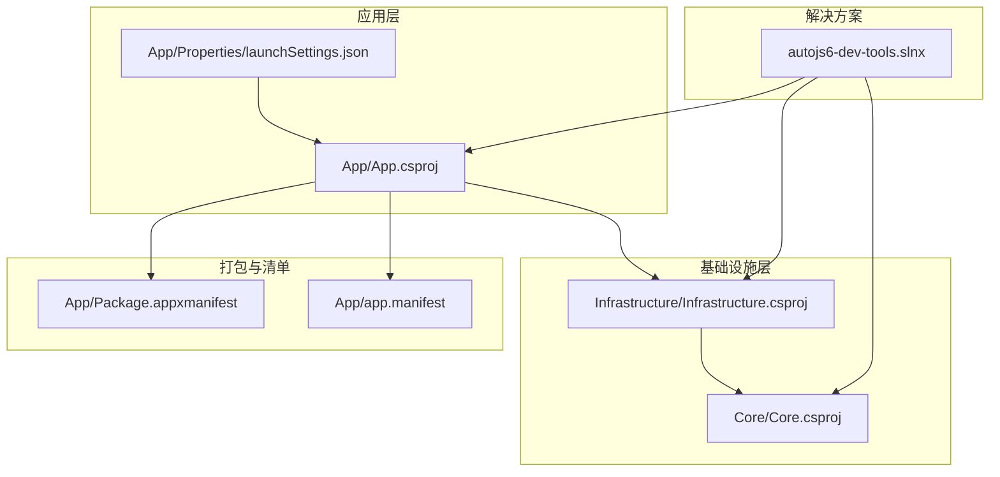
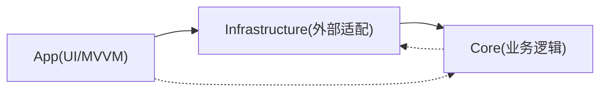
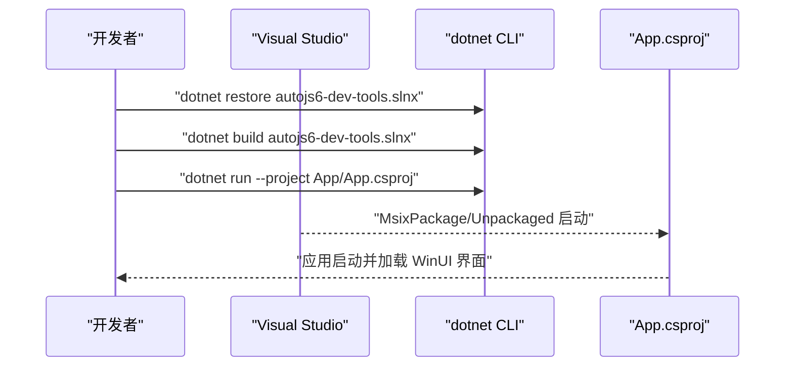
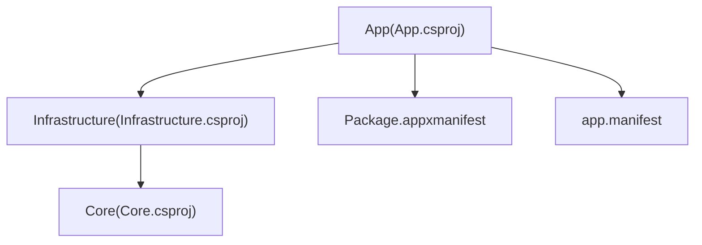

# 开发环境搭建

<cite>
**本文引用的文件**
- [README.md](file://README.md)
- [README_zh_CN.md](file://README_zh_CN.md)
- [DEVELOPMENT.md](file://DEVELOPMENT.md)
- [AGENTS.md](file://AGENTS.md)
- [App.csproj](file://App/App.csproj)
- [Infrastructure.csproj](file://Infrastructure/Infrastructure.csproj)
- [Core.csproj](file://Core/Core.csproj)
- [Package.appxmanifest](file://App/Package.appxmanifest)
- [app.manifest](file://App/app.manifest)
- [launchSettings.json](file://App/Properties/launchSettings.json)
- [autojs6-dev-tools.slnx](file://autojs6-dev-tools.slnx)
- [checklist.md](file://checklist.md)
- [manual.md](file://manual.md)
</cite>

## 目录
1. [简介](#简介)
2. [项目结构](#项目结构)
3. [核心组件](#核心组件)
4. [架构总览](#架构总览)
5. [详细组件分析](#详细组件分析)
6. [依赖关系分析](#依赖关系分析)
7. [性能考量](#性能考量)
8. [故障排查指南](#故障排查指南)
9. [结论](#结论)
10. [附录](#附录)

## 简介
本指南面向 AutoJS6 开发工具的本地开发与发布环境搭建，聚焦以下关键点：
- .NET 8 SDK 的安装与配置要求（版本兼容性、最低系统版本、平台目标）
- Visual Studio 2022/2026 的安装与 WinUI 3 工作负载配置
- ADB 工具链的安装与配置（Android SDK、平台工具、PATH）
- 依赖项检查清单（MSBuild、Windows SDK、SignTool、Inno Setup）
- 常见环境问题排查（路径配置错误、SDK 版本不匹配、签名与打包问题）

本指南严格依据仓库中的官方文档与项目文件，确保读者能够按步骤完成从零到可运行的开发环境。

## 项目结构
该项目采用分层架构与 WinUI 3 桌面应用，核心结构如下：
- App：WinUI 3 应用项目，负责 UI 与 MVVM
- Core：纯业务逻辑层，无 UI 依赖
- Infrastructure：封装外部依赖（ADB、OpenCV、ImageSharp），供 Core 使用
- Tests：应用与核心单元测试
- Packaging：Windows 平台打包脚本与安装器配置
- Docs：项目文档与图片资源

图表来源
- [autojs6-dev-tools.slnx:1-30](file://autojs6-dev-tools.slnx#L1-L30)
- [App.csproj:1-84](file://App/App.csproj#L1-L84)
- [Infrastructure.csproj:1-19](file://Infrastructure/Infrastructure.csproj#L1-L19)
- [Core.csproj:1-10](file://Core/Core.csproj#L1-L10)
- [Package.appxmanifest:1-54](file://App/Package.appxmanifest#L1-L54)
- [app.manifest:1-20](file://App/app.manifest#L1-L20)
- [launchSettings.json:1-14](file://App/Properties/launchSettings.json#L1-L14)

章节来源
- [README.md:230-260](file://README.md#L230-L260)
- [autojs6-dev-tools.slnx:1-30](file://autojs6-dev-tools.slnx#L1-L30)

## 核心组件
- 应用层（App）：WinUI 3 + Windows App SDK，目标框架 net8.0-windows10.0.19041.0，支持 x86/x64/ARM64，启用 MSIX 打包与 WinUI 支持。
- 基础设施层（Infrastructure）：封装 ADB、OpenCV、ImageSharp，供 Core 使用。
- 核心层（Core）：纯业务逻辑，无 UI 依赖，独立可测试。
- 打包清单：Package.appxmanifest 定义应用标识、发布者、目标设备家族；app.manifest 声明 DPI 与兼容性。

章节来源
- [App.csproj:1-84](file://App/App.csproj#L1-L84)
- [Infrastructure.csproj:1-19](file://Infrastructure/Infrastructure.csproj#L1-L19)
- [Core.csproj:1-10](file://Core/Core.csproj#L1-L10)
- [Package.appxmanifest:1-54](file://App/Package.appxmanifest#L1-L54)
- [app.manifest:1-20](file://App/app.manifest#L1-L20)

## 架构总览
应用采用 Clean Architecture 分层，依赖方向为 App → Infrastructure → Core，基础设施层隔离外部依赖，核心层保持纯净业务逻辑。

图表来源
- [App.csproj:67-68](file://App/App.csproj#L67-L68)
- [Infrastructure.csproj:9-11](file://Infrastructure/Infrastructure.csproj#L9-L11)

章节来源
- [README.md:264-287](file://README.md#L264-L287)

## 详细组件分析

### .NET 8 SDK 与 Windows 目标版本
- 目标框架：net8.0-windows10.0.19041.0（Windows 10 19041 最低版本）
- 最小平台版本：10.0.17763.0
- 平台目标：x86/x64/ARM64（通过 RuntimeIdentifiers 与 PlatformTarget 控制）
- Windows App SDK：启用自包含打包，支持 MSIX 打包与发布菜单

建议
- 安装 .NET 8 SDK（包含 dotnet CLI）
- 确认 Windows 10/11 版本满足最低要求（Build ≥ 17763）
- 若使用 Visual Studio，确保安装对应 .NET 8 工作负载

章节来源
- [App.csproj:2-32](file://App/App.csproj#L2-L32)
- [README.md:112-117](file://README.md#L112-L117)
- [README_zh_CN.md:112-117](file://README_zh_CN.md#L112-L117)

### Visual Studio 2022/2026 与 WinUI 3 工作负载
- IDE 要求：Visual Studio 2022/2026（含 WinUI 3 工作负载）
- 项目类型：单项目 MSIX 打包（EnableMsixTooling=true）
- 运行配置：launchSettings.json 提供“App/Unpackaged/MsixPackage”三种启动方式

建议
- 安装 Visual Studio 2022/2026
- 安装 WinUI 3 工作负载（含 Windows App SDK）
- 打开解决方案后，选择“App/Unpackaged”或“MsixPackage”运行

章节来源
- [README.md:112-117](file://README.md#L112-L117)
- [README_zh_CN.md:112-117](file://README_zh_CN.md#L112-L117)
- [App.csproj:20-24](file://App/App.csproj#L20-L24)
- [App.csproj:75-77](file://App/App.csproj#L75-L77)
- [launchSettings.json:1-14](file://App/Properties/launchSettings.json#L1-L14)

### ADB 工具链与 Android SDK
- ADB 必须在 PATH 中，以便应用与设备通信
- 项目使用 AdvancedSharpAdbClient 封装 ADB 功能
- 建议安装 Android SDK 平台工具与平台版本，确保 ADB 与 uiautomator dump 可用

建议
- 安装 Android SDK（含 platform-tools 与平台版本）
- 将 platform-tools 添加至 PATH
- 使用“adb devices”验证设备连接

章节来源
- [README.md:112-117](file://README.md#L112-L117)
- [README_zh_CN.md:112-117](file://README_zh_CN.md#L112-L117)
- [Infrastructure.csproj:13-17](file://Infrastructure/Infrastructure.csproj#L13-L17)

### 本地发布依赖项与验证清单
- MSBuild + SignTool：Visual Studio 2022/2026 或带 Windows 10/11 SDK 的 Build Tools
- Inno Setup 6：生成 EXE 安装器（ISCC.exe）
- 本地脚本会自动检测上述工具，缺失时给出明确提示

建议
- 安装 Visual Studio 2022/2026 或 Build Tools（含 Windows SDK）
- 安装 Inno Setup 6（确保 ISCC.exe 可用）
- 使用 dotnet restore/build/test 验证构建链路

章节来源
- [README.md:119-123](file://README.md#L119-L123)
- [README_zh_CN.md:119-123](file://README_zh_CN.md#L119-L123)
- [DEVELOPMENT.md:35-44](file://DEVELOPMENT.md#L35-L44)

### 项目构建与运行流程

图表来源
- [README.md:149-162](file://README.md#L149-L162)
- [launchSettings.json:1-14](file://App/Properties/launchSettings.json#L1-L14)

章节来源
- [README.md:149-162](file://README.md#L149-L162)
- [autojs6-dev-tools.slnx:1-30](file://autojs6-dev-tools.slnx#L1-L30)

## 依赖关系分析
- App 依赖 Infrastructure，Infrastructure 依赖 Core
- App 引用 Package.appxmanifest 与 app.manifest
- 项目文件声明 Windows App SDK、Win2D、CommunityToolkit.Mvvm 等依赖

图表来源
- [App.csproj:67-68](file://App/App.csproj#L67-L68)
- [Infrastructure.csproj:9-11](file://Infrastructure/Infrastructure.csproj#L9-L11)
- [Package.appxmanifest:1-54](file://App/Package.appxmanifest#L1-L54)
- [app.manifest:1-20](file://App/app.manifest#L1-L20)

章节来源
- [App.csproj:1-84](file://App/App.csproj#L1-L84)
- [Infrastructure.csproj:1-19](file://Infrastructure/Infrastructure.csproj#L1-L19)
- [Core.csproj:1-10](file://Core/Core.csproj#L1-L10)

## 性能考量
- 异步优先：所有 I/O 操作（ADB、OpenCV、XML 解析、纹理上传）使用 async/await，避免 UI 阻塞
- 渲染性能：Win2D GPU 加速、分层渲染、60 FPS 目标
- 内存优化：CanvasBitmap 缓存池、阈值滑动仅重算匹配层、控件树虚拟化

章节来源
- [README.md:282-287](file://README.md#L282-L287)
- [AGENTS.md:229-248](file://AGENTS.md#L229-L248)

## 故障排查指南

### 1) .NET 8 SDK 与 Windows 版本不匹配
现象
- dotnet build 报告目标框架不兼容或找不到 Windows SDK

排查步骤
- 确认已安装 .NET 8 SDK
- 确认 Windows 10/11 版本满足最低要求（平台最小版本 10.0.17763.0）
- 确认 App.csproj 的 TargetFramework 与 TargetPlatformMinVersion 与系统匹配

章节来源
- [App.csproj:2-32](file://App/App.csproj#L2-L32)
- [README.md:112-117](file://README.md#L112-L117)

### 2) Visual Studio 缺少 WinUI 3 工作负载
现象
- 无法打开解决方案或缺少 WinUI/Windows App SDK 支持

排查步骤
- 安装 Visual Studio 2022/2026
- 安装 WinUI 3 工作负载与 Windows App SDK
- 重新打开解决方案，选择 MsixPackage/Unpackaged 启动

章节来源
- [README.md:112-117](file://README.md#L112-L117)
- [App.csproj:20-24](file://App/App.csproj#L20-L24)

### 3) ADB 不在 PATH 或设备未识别
现象
- 截图失败或设备列表为空

排查步骤
- 安装 Android SDK 平台工具
- 将 platform-tools 添加至 PATH
- 使用 adb devices 验证设备连接
- 在应用中选择设备并重试截图

章节来源
- [README.md:112-117](file://README.md#L112-L117)
- [Infrastructure.csproj:13-17](file://Infrastructure/Infrastructure.csproj#L13-L17)

### 4) 本地发布失败（MSBuild/SignTool/Inno Setup）
现象
- 手动打包或本地脚本报错，提示工具缺失

排查步骤
- 安装 Visual Studio 2022/2026 或 Build Tools（含 Windows 10/11 SDK）
- 安装 Inno Setup 6（确保 ISCC.exe 可用）
- 使用 dotnet restore/build/test 验证构建链路
- 若失败，根据脚本提示定位具体缺失工具

章节来源
- [README.md:119-123](file://README.md#L119-L123)
- [DEVELOPMENT.md:35-44](file://DEVELOPMENT.md#L35-L44)

### 5) MSIX 签名与证书问题
现象
- MSIX 构建成功但签名失败或安装时报证书错误

排查步骤
- 确认 Package.appxmanifest 中 Publisher 与证书 Subject 一致
- 确认 signtool.exe 可用且路径正确
- 将生成的 .cer 导入当前用户的“受信任的人”和“受信任的根证书颁发机构”

章节来源
- [DEVELOPMENT.md:232-241](file://DEVELOPMENT.md#L232-L241)
- [Package.appxmanifest:11-14](file://App/Package.appxmanifest#L11-L14)

### 6) EXE 安装器构建失败
现象
- Inno Setup 无法找到 ISCC.exe 或输出目录不可写

排查步骤
- 确认 Inno Setup 6 已安装
- 确认 SourceDirectory 中包含构建产物
- 确认输出路径具有写权限

章节来源
- [DEVELOPMENT.md:242-249](file://DEVELOPMENT.md#L242-L249)

### 7) 构建基线与平台目标问题
现象
- dotnet build -c Release 失败或生成 AnyCPU

排查步骤
- 确认 App.csproj 的 PlatformTarget 与 RuntimeIdentifiers 设置
- 确认未默认启用 Trim/ReadyToRun（项目中已禁用）
- 明确指定 RID（win-x64/win-x86/win-arm64）

章节来源
- [App.csproj:27-32](file://App/App.csproj#L27-L32)
- [App.csproj:13-19](file://App/App.csproj#L13-L19)
- [DEVELOPMENT.md:224-231](file://DEVELOPMENT.md#L224-L231)

## 结论
按照本指南完成 .NET 8 SDK、Visual Studio（含 WinUI 3 工作负载）、ADB 工具链与本地发布工具的安装与配置，即可顺利构建、运行与打包 AutoJS6 开发工具。遇到问题时，优先检查目标框架与系统版本、WinUI 工作负载、ADB PATH、以及 MSBuild/SignTool/Inno Setup 的可用性。

## 附录

### 依赖项检查清单（建议）
- ✅ .NET 8 SDK 已安装
- ✅ Visual Studio 2022/2026（含 WinUI 3 工作负载）
- ✅ Windows 10/11（Build ≥ 17763）
- ✅ ADB 在 PATH 中（platform-tools）
- ✅ Android SDK 平台与平台工具已安装
- ✅ MSBuild + SignTool（VS 2022/2026 或 Build Tools + Windows SDK）
- ✅ Inno Setup 6（ISCC.exe 可用）
- ✅ dotnet restore/build/test 通过
- ✅ App/Unpackaged 或 MsixPackage 可正常运行

章节来源
- [README.md:112-123](file://README.md#L112-L123)
- [DEVELOPMENT.md:35-44](file://DEVELOPMENT.md#L35-L44)