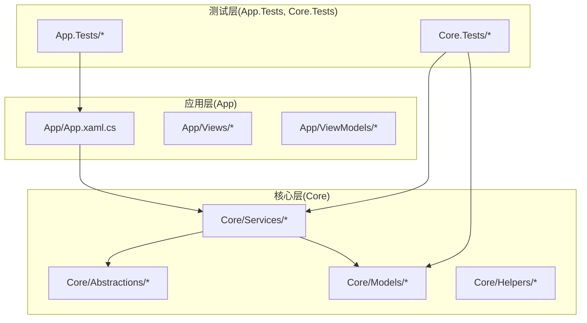
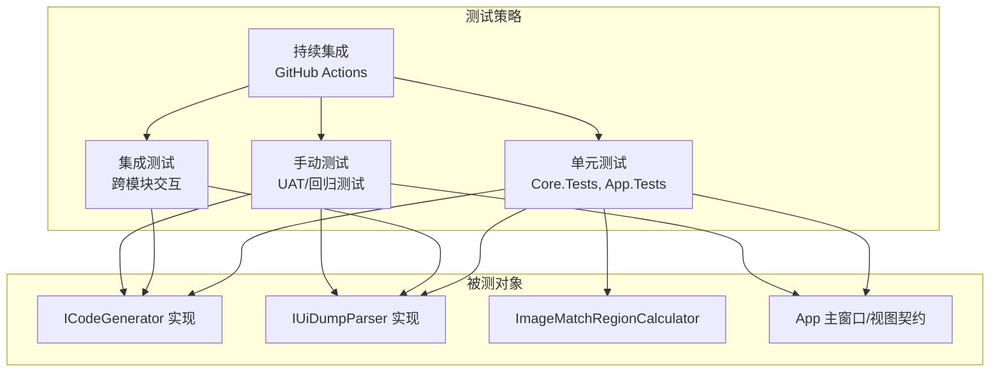
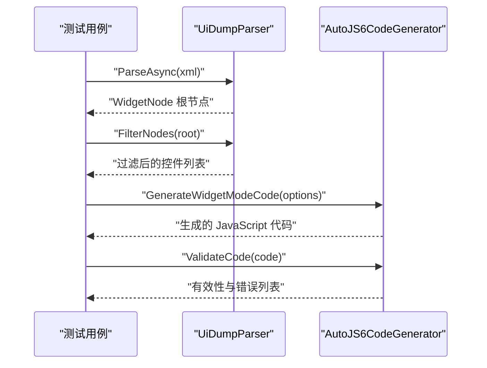
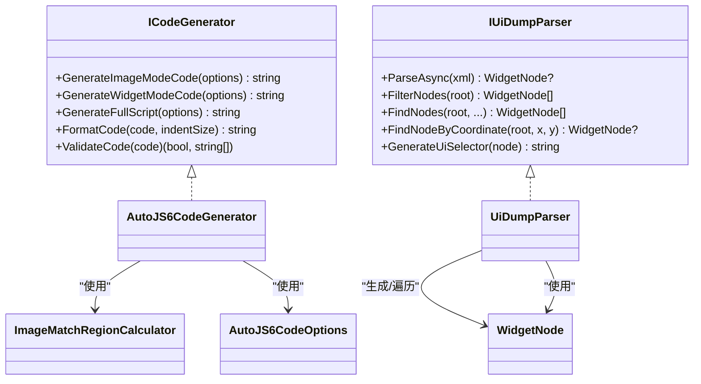

# 测试策略与质量保证

<cite>
**本文引用的文件**
- [App.Tests/UnitTests.cs](file://App.Tests/UnitTests.cs)
- [App.Tests/App.Tests.csproj](file://App.Tests/App.Tests.csproj)
- [Core.Tests/AutoJS6CodeGeneratorTests.cs](file://Core.Tests/AutoJS6CodeGeneratorTests.cs)
- [Core.Tests/UiDumpParserTests.cs](file://Core.Tests/UiDumpParserTests.cs)
- [Core.Tests/ImageMatchRegionCalculatorTests.cs](file://Core.Tests/ImageMatchRegionCalculatorTests.cs)
- [Core.Tests/Core.Tests.csproj](file://Core.Tests/Core.Tests.csproj)
- [Core/Services/AutoJS6CodeGenerator.cs](file://Core/Services/AutoJS6CodeGenerator.cs)
- [Core/Services/UiDumpParser.cs](file://Core/Services/UiDumpParser.cs)
- [Core/Helpers/ImageMatchRegionCalculator.cs](file://Core/Helpers/ImageMatchRegionCalculator.cs)
- [Core/Models/AutoJS6CodeOptions.cs](file://Core/Models/AutoJS6CodeOptions.cs)
- [Core/Models/WidgetNode.cs](file://Core/Models/WidgetNode.cs)
- [Core/Models/CropRegion.cs](file://Core/Models/CropRegion.cs)
- [Core/Abstractions/ICodeGenerator.cs](file://Core/Abstractions/ICodeGenerator.cs)
- [Core/Abstractions/IUiDumpParser.cs](file://Core/Abstractions/IUiDumpParser.cs)
- [App/App.xaml.cs](file://App/App.xaml.cs)
</cite>

## 目录
1. [引言](#引言)
2. [项目结构](#项目结构)
3. [核心组件](#核心组件)
4. [架构总览](#架构总览)
5. [详细组件分析](#详细组件分析)
6. [依赖关系分析](#依赖关系分析)
7. [性能考虑](#性能考虑)
8. [故障排查指南](#故障排查指南)
9. [结论](#结论)
10. [附录](#附录)

## 引言
本文件面向 AutoJS6 开发工具，系统性地建立测试策略与质量保证体系，覆盖单元测试、集成测试、手动测试以及持续集成自动化。文档以现有代码库为基础，结合接口契约与实现细节，给出设计原则、测试用例编写规范、测试数据准备方法、覆盖率要求与度量方式，并提供 GitHub Actions 工作流的配置建议与测试结果分析方法。

## 项目结构
项目采用分层与模块化组织，核心逻辑位于 Core 层，包含接口抽象、模型与服务；应用层位于 App 层，负责 UI 与宿主生命周期；测试层分别对应各模块，使用 MSTest 进行单元测试。

图表来源
- [App/App.xaml.cs:1-57](file://App/App.xaml.cs#L1-L57)
- [Core/Services/AutoJS6CodeGenerator.cs:1-357](file://Core/Services/AutoJS6CodeGenerator.cs#L1-L357)
- [Core/Services/UiDumpParser.cs:1-263](file://Core/Services/UiDumpParser.cs#L1-L263)
- [Core/Helpers/ImageMatchRegionCalculator.cs:1-99](file://Core/Helpers/ImageMatchRegionCalculator.cs#L1-L99)
- [Core/Abstractions/ICodeGenerator.cs:1-46](file://Core/Abstractions/ICodeGenerator.cs#L1-L46)
- [Core/Abstractions/IUiDumpParser.cs:1-56](file://Core/Abstractions/IUiDumpParser.cs#L1-L56)

章节来源
- [App/App.xaml.cs:1-57](file://App/App.xaml.cs#L1-L57)
- [Core/Services/AutoJS6CodeGenerator.cs:1-357](file://Core/Services/AutoJS6CodeGenerator.cs#L1-L357)
- [Core/Services/UiDumpParser.cs:1-263](file://Core/Services/UiDumpParser.cs#L1-L263)
- [Core/Helpers/ImageMatchRegionCalculator.cs:1-99](file://Core/Helpers/ImageMatchRegionCalculator.cs#L1-L99)
- [Core/Abstractions/ICodeGenerator.cs:1-46](file://Core/Abstractions/ICodeGenerator.cs#L1-L46)
- [Core/Abstractions/IUiDumpParser.cs:1-56](file://Core/Abstractions/IUiDumpParser.cs#L1-L56)

## 核心组件
- 接口契约
  - ICodeGenerator：定义图像模式与控件模式的代码生成、脚本拼装、格式化与约束校验能力。
  - IUiDumpParser：定义 UI Dump 解析、节点过滤、坐标定位与 UiSelector 生成能力。
- 服务实现
  - AutoJS6CodeGenerator：实现代码生成、重试/超时/回收等工程化特性，满足 Rhino 引擎约束。
  - UiDumpParser：实现 XML 解析、布局容器过滤、坐标命中查找与选择器生成。
  - ImageMatchRegionCalculator：根据参考区域计算搜索区域与 regionRef，支持横竖屏归一化。
- 模型
  - AutoJS6CodeOptions：统一的代码生成参数集合。
  - WidgetNode：控件节点树模型，包含属性、边界与层级。
  - CropRegion：裁剪区域与参考分辨率信息。

章节来源
- [Core/Abstractions/ICodeGenerator.cs:1-46](file://Core/Abstractions/ICodeGenerator.cs#L1-L46)
- [Core/Abstractions/IUiDumpParser.cs:1-56](file://Core/Abstractions/IUiDumpParser.cs#L1-L56)
- [Core/Services/AutoJS6CodeGenerator.cs:1-357](file://Core/Services/AutoJS6CodeGenerator.cs#L1-L357)
- [Core/Services/UiDumpParser.cs:1-263](file://Core/Services/UiDumpParser.cs#L1-L263)
- [Core/Helpers/ImageMatchRegionCalculator.cs:1-99](file://Core/Helpers/ImageMatchRegionCalculator.cs#L1-L99)
- [Core/Models/AutoJS6CodeOptions.cs:1-89](file://Core/Models/AutoJS6CodeOptions.cs#L1-L89)
- [Core/Models/WidgetNode.cs:1-93](file://Core/Models/WidgetNode.cs#L1-L93)
- [Core/Models/CropRegion.cs:1-53](file://Core/Models/CropRegion.cs#L1-L53)

## 架构总览
下图展示测试策略与质量保证的关键交互：单元测试覆盖接口契约与具体实现；集成测试关注跨模块协作；手动测试保障用户体验与验收；CI 自动化贯穿全链路。

图表来源
- [Core/Abstractions/ICodeGenerator.cs:1-46](file://Core/Abstractions/ICodeGenerator.cs#L1-L46)
- [Core/Abstractions/IUiDumpParser.cs:1-56](file://Core/Abstractions/IUiDumpParser.cs#L1-L56)
- [Core/Services/AutoJS6CodeGenerator.cs:1-357](file://Core/Services/AutoJS6CodeGenerator.cs#L1-L357)
- [Core/Services/UiDumpParser.cs:1-263](file://Core/Services/UiDumpParser.cs#L1-L263)
- [Core/Helpers/ImageMatchRegionCalculator.cs:1-99](file://Core/Helpers/ImageMatchRegionCalculator.cs#L1-L99)
- [App/App.xaml.cs:1-57](file://App/App.xaml.cs#L1-L57)

## 详细组件分析

### 单元测试设计与实现
- 设计原则
  - 面向接口测试：优先针对 ICodeGenerator 与 IUiDumpParser 的契约进行断言，避免对具体实现耦合。
  - 参数驱动与边界覆盖：利用 AutoJS6CodeOptions 的可配置项（阈值、重试、区域、回收等）构造多场景用例。
  - 纯函数与可预测性：对纯辅助类（如 ImageMatchRegionCalculator）重点验证数学逻辑与边界条件。
  - 合约一致性：确保生成代码满足 Rhino 引擎约束（循环体内禁用 const/let），并通过 ValidateCode 校验。
- 测试用例编写规范
  - 命名：以“方法名_场景_期望结果”命名，清晰表达前置条件与断言。
  - 组织：每个类一个 TestClass，按功能分组，使用 TestMethod 标注。
  - 断言：优先使用强语义断言（Contains、IsTrue、AreEqual 等），必要时使用异常断言。
  - 数据准备：通过构造函数或工厂方法创建最小化输入，避免外部依赖。
- 典型用例示例（路径引用）
  - 图像模式代码生成：[Core.Tests/AutoJS6CodeGeneratorTests.cs:10-39](file://Core.Tests/AutoJS6CodeGeneratorTests.cs#L10-L39)
  - 控件模式选择器优先级：[Core.Tests/AutoJS6CodeGeneratorTests.cs:42-78](file://Core.Tests/AutoJS6CodeGeneratorTests.cs#L42-L78)
  - UI Dump 解析与过滤：[Core.Tests/UiDumpParserTests.cs:9-36](file://Core.Tests/UiDumpParserTests.cs#L9-L36)
  - 坐标命中查找：[Core.Tests/UiDumpParserTests.cs:38-62](file://Core.Tests/UiDumpParserTests.cs#L38-L62)
  - 无效 XML 返回空：[Core.Tests/UiDumpParserTests.cs:64-72](file://Core.Tests/UiDumpParserTests.cs#L64-L72)
  - 区域计算器横竖屏与裁剪：[Core.Tests/ImageMatchRegionCalculatorTests.cs:10-58](file://Core.Tests/ImageMatchRegionCalculatorTests.cs#L10-L58)
  - 主页面 XAML 合同检查（App.Tests）：[App.Tests/UnitTests.cs:10-40](file://App.Tests/UnitTests.cs#L10-L40)

章节来源
- [Core.Tests/AutoJS6CodeGeneratorTests.cs:1-80](file://Core.Tests/AutoJS6CodeGeneratorTests.cs#L1-L80)
- [Core.Tests/UiDumpParserTests.cs:1-74](file://Core.Tests/UiDumpParserTests.cs#L1-L74)
- [Core.Tests/ImageMatchRegionCalculatorTests.cs:1-60](file://Core.Tests/ImageMatchRegionCalculatorTests.cs#L1-L60)
- [App.Tests/UnitTests.cs:1-91](file://App.Tests/UnitTests.cs#L1-L91)

### 集成测试策略
- 目标
  - 验证模块间协作：如代码生成器与 UI Dump 解析器组合使用时的正确性。
  - 端到端流程：从 UI Dump 输入到生成可运行脚本的完整链路。
- 设计要点
  - 使用真实 XML 与典型控件树，覆盖复杂布局与嵌套容器。
  - 验证生成的 UiSelector 在目标应用中的可命中性（可通过模拟环境或外部工具验证）。
  - 关注错误路径：非法 XML、缺失字段、越界区域等。
- 示例流程（序列图）

图表来源
- [Core/Services/UiDumpParser.cs:14-59](file://Core/Services/UiDumpParser.cs#L14-L59)
- [Core/Services/AutoJS6CodeGenerator.cs:104-164](file://Core/Services/AutoJS6CodeGenerator.cs#L104-L164)
- [Core/Abstractions/IUiDumpParser.cs:10-55](file://Core/Abstractions/IUiDumpParser.cs#L10-L55)
- [Core/Abstractions/ICodeGenerator.cs:8-45](file://Core/Abstractions/ICodeGenerator.cs#L8-L45)

### 手动测试流程与标准
- 用户验收测试（UAT）
  - 场景覆盖：图像识别点击、控件点击、重试与超时、错误提示与退出。
  - 环境准备：准备不同分辨率与横竖屏设备快照，验证 regionRef 与坐标转换。
  - 回归测试
    - 版本升级后复测关键路径：图像匹配阈值、控件选择器降级顺序、边界框命中。
    - 修复缺陷后补充回归用例，形成闭环。
- 执行标准
  - 用例编号与步骤明确，结果可重复。
  - 记录失败截图与日志，定位问题根因。
  - 与自动生成的代码保持一致的交互行为。

### 测试覆盖率要求与度量
- 覆盖率目标
  - 语句覆盖率：核心算法与关键分支不低于 80%。
  - 分支覆盖率：决策点（if/else、switch）不低于 70%。
  - 接口契约覆盖率：所有公开接口至少 1 条用例覆盖。
- 度量方法
  - 使用 .NET Coverlet 或其它 .NET 生态工具在 CI 中收集覆盖率报告。
  - 对关键路径（图像匹配、控件选择器、坐标计算）单独统计。
  - 将覆盖率指标纳入 PR 审查门禁。

### 持续集成中的测试自动化
- 工作流建议
  - 触发条件：push 到主分支、PR 打开/更新。
  - 步骤建议：
    - 恢复缓存与安装依赖
    - 还原包并构建解决方案
    - 运行 MSTest 单元测试
    - 收集并上传测试结果与覆盖率报告
    - 可选：运行手动测试清单（在受控环境中）
- 结果分析
  - 失败即阻断，成功才允许合并。
  - 报告中突出失败用例、耗时长用例与覆盖率缺口。

## 依赖关系分析

图表来源
- [Core/Abstractions/ICodeGenerator.cs:1-46](file://Core/Abstractions/ICodeGenerator.cs#L1-L46)
- [Core/Abstractions/IUiDumpParser.cs:1-56](file://Core/Abstractions/IUiDumpParser.cs#L1-L56)
- [Core/Services/AutoJS6CodeGenerator.cs:1-357](file://Core/Services/AutoJS6CodeGenerator.cs#L1-L357)
- [Core/Services/UiDumpParser.cs:1-263](file://Core/Services/UiDumpParser.cs#L1-L263)
- [Core/Helpers/ImageMatchRegionCalculator.cs:1-99](file://Core/Helpers/ImageMatchRegionCalculator.cs#L1-L99)
- [Core/Models/AutoJS6CodeOptions.cs:1-89](file://Core/Models/AutoJS6CodeOptions.cs#L1-L89)
- [Core/Models/WidgetNode.cs:1-93](file://Core/Models/WidgetNode.cs#L1-L93)

章节来源
- [Core/Abstractions/ICodeGenerator.cs:1-46](file://Core/Abstractions/ICodeGenerator.cs#L1-L46)
- [Core/Abstractions/IUiDumpParser.cs:1-56](file://Core/Abstractions/IUiDumpParser.cs#L1-L56)
- [Core/Services/AutoJS6CodeGenerator.cs:1-357](file://Core/Services/AutoJS6CodeGenerator.cs#L1-L357)
- [Core/Services/UiDumpParser.cs:1-263](file://Core/Services/UiDumpParser.cs#L1-L263)
- [Core/Helpers/ImageMatchRegionCalculator.cs:1-99](file://Core/Helpers/ImageMatchRegionCalculator.cs#L1-L99)
- [Core/Models/AutoJS6CodeOptions.cs:1-89](file://Core/Models/AutoJS6CodeOptions.cs#L1-L89)
- [Core/Models/WidgetNode.cs:1-93](file://Core/Models/WidgetNode.cs#L1-L93)

## 性能考虑
- 解析与匹配
  - UI Dump 解析与节点过滤为 O(N) 遍历，注意避免重复解析与深拷贝。
  - 图像匹配区域计算仅做常数级数学运算，性能开销可忽略。
- 代码生成
  - 生成脚本为字符串拼接，注意大模板与多区域时的内存占用。
- 测试执行
  - 单测尽量无 IO；若需文件读取，使用内存流或临时文件并及时清理。

## 故障排查指南
- 常见问题
  - 生成代码不符合 Rhino 约束：检查循环体内是否使用了 const/let，必要时调整 ValidateCode 逻辑。
  - 图像匹配失败：核对阈值、region 与模板路径；确认屏幕分辨率与 orientation。
  - 控件未命中：检查选择器优先级与边界框；确认控件是否存在降级方案。
- 排查步骤
  - 复现最小化用例，逐步缩小范围。
  - 打印中间状态（如 regionRef、选择器片段）辅助定位。
  - 对比历史版本差异，确认回归引入点。

## 结论
通过以接口契约为核心的单元测试、以工作流为主线的集成测试、以场景驱动的手动测试与以覆盖率为核心的持续集成，AutoJS6 开发工具可形成完善的质量保证体系。建议在后续迭代中持续完善覆盖率指标与自动化报告，确保关键功能与易错路径得到充分验证。

## 附录

### 测试数据准备清单
- 图像模式
  - 不同分辨率与横竖屏的模板图片
  - 多个阈值与 region 的组合用例
- 控件模式
  - 多种资源 ID/文本/描述组合
  - 带/不带边界框的控件样本
- 辅助类
  - 横竖屏与越界场景的 CropRegion 输入
- UI 合同
  - MainPage.xaml 关键控件存在性与名称断言

章节来源
- [Core.Tests/AutoJS6CodeGeneratorTests.cs:10-39](file://Core.Tests/AutoJS6CodeGeneratorTests.cs#L10-L39)
- [Core.Tests/UiDumpParserTests.cs:9-36](file://Core.Tests/UiDumpParserTests.cs#L9-L36)
- [Core.Tests/ImageMatchRegionCalculatorTests.cs:10-58](file://Core.Tests/ImageMatchRegionCalculatorTests.cs#L10-L58)
- [App.Tests/UnitTests.cs:10-40](file://App.Tests/UnitTests.cs#L10-L40)