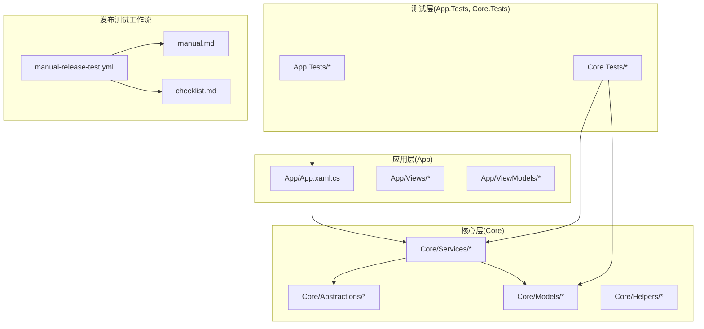
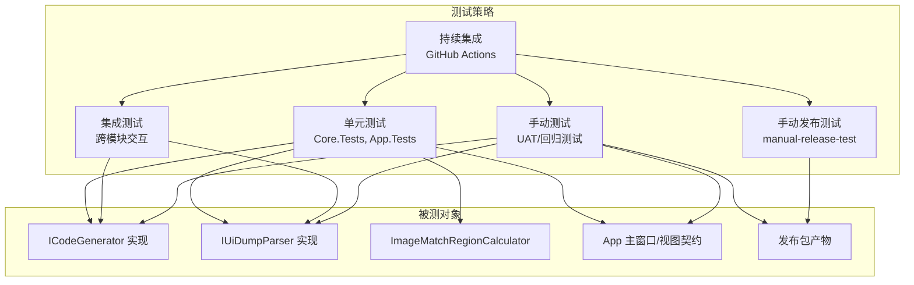
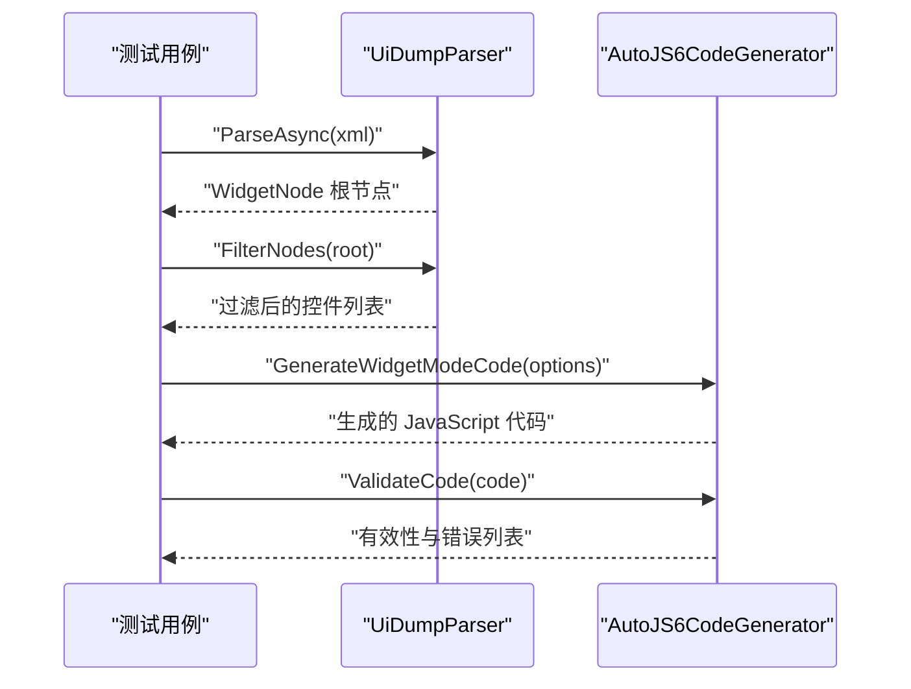
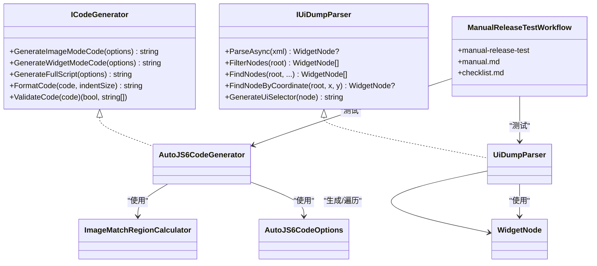

# 测试策略与质量保证

<cite>
**本文引用的文件**
- [App.Tests/UnitTests.cs](file://App.Tests/UnitTests.cs)
- [App.Tests/App.Tests.csproj](file://App.Tests/App.Tests.csproj)
- [Core.Tests/AutoJS6CodeGeneratorTests.cs](file://Core.Tests/AutoJS6CodeGeneratorTests.cs)
- [Core.Tests/UiDumpParserTests.cs](file://Core.Tests/UiDumpParserTests.cs)
- [Core.Tests/ImageMatchRegionCalculatorTests.cs](file://Core.Tests/ImageMatchRegionCalculatorTests.cs)
- [Core.Tests/Core.Tests.csproj](file://Core.Tests/Core.Tests.csproj)
- [Core/Services/AutoJS6CodeGenerator.cs](file://Core/Services/AutoJS6CodeGenerator.cs)
- [Core/Services/UiDumpParser.cs](file://Core/Services/UiDumpParser.cs)
- [Core/Helpers/ImageMatchRegionCalculator.cs](file://Core/Helpers/ImageMatchRegionCalculator.cs)
- [Core/Models/AutoJS6CodeOptions.cs](file://Core/Models/AutoJS6CodeOptions.cs)
- [Core/Models/WidgetNode.cs](file://Core/Models/WidgetNode.cs)
- [Core/Models/CropRegion.cs](file://Core/Models/CropRegion.cs)
- [Core/Abstractions/ICodeGenerator.cs](file://Core/Abstractions/ICodeGenerator.cs)
- [Core/Abstractions/IUiDumpParser.cs](file://Core/Abstractions/IUiDumpParser.cs)
- [App/App.xaml.cs](file://App/App.xaml.cs)
- [.github/workflows/manual-release-test.yml](file://.github/workflows/manual-release-test.yml)
- [manual.md](file://manual.md)
- [checklist.md](file://checklist.md)
- [RELEASE_TEST.md](file://RELEASE_TEST.md)
- [RELEASE_TEST_zh_CN.md](file://RELEASE_TEST_zh_CN.md)
- [DEVELOPMENT.md](file://DEVELOPMENT.md)
- [PROXY.md](file://PROXY.md)
- [scripts/release/Test-PortablePackageSmoke.ps1](file://scripts/release/Test-PortablePackageSmoke.ps1)
- [scripts/release/Set-AppReleaseMetadata.ps1](file://scripts/release/Set-AppReleaseMetadata.ps1)
- [packaging/windows/MSIX-INSTALL.md](file://packaging/windows/MSIX-INSTALL.md)
</cite>

## 更新摘要
**所做更改**
- 新增手动发布测试工作流的详细使用指南章节
- 完善手动测试流程与标准，增加实际操作步骤和验证清单
- 更新持续集成中的测试自动化配置，包含手动发布测试工作流
- 增加测试覆盖率要求与度量方法的详细说明
- 补充故障排查指南，涵盖发布测试相关的问题

## 目录
1. [引言](#引言)
2. [项目结构](#项目结构)
3. [核心组件](#核心组件)
4. [架构总览](#架构总览)
5. [详细组件分析](#详细组件分析)
6. [依赖关系分析](#依赖关系分析)
7. [性能考虑](#性能考虑)
8. [故障排查指南](#故障排查指南)
9. [结论](#结论)
10. [附录](#附录)

## 引言
本文件面向 AutoJS6 开发工具，系统性地建立测试策略与质量保证体系，覆盖单元测试、集成测试、手动测试以及持续集成自动化。文档以现有代码库为基础，结合接口契约与实现细节，给出设计原则、测试用例编写规范、测试数据准备方法、覆盖率要求与度量方式，并提供 GitHub Actions 工作流的配置建议与测试结果分析方法。

**更新** 新增手动发布测试工作流的使用指南，完善测试策略的完整性和实用性。

## 项目结构
项目采用分层与模块化组织，核心逻辑位于 Core 层，包含接口抽象、模型与服务；应用层位于 App 层，负责 UI 与宿主生命周期；测试层分别对应各模块，使用 MSTest 进行单元测试。新增的手动发布测试工作流提供完整的打包和验证能力。

**图表来源**
- [App/App.xaml.cs:1-57](file://App/App.xaml.cs#L1-L57)
- [Core/Services/AutoJS6CodeGenerator.cs:1-357](file://Core/Services/AutoJS6CodeGenerator.cs#L1-L357)
- [Core/Services/UiDumpParser.cs:1-263](file://Core/Services/UiDumpParser.cs#L1-L263)
- [Core/Helpers/ImageMatchRegionCalculator.cs:1-99](file://Core/Helpers/ImageMatchRegionCalculator.cs#L1-L99)
- [Core/Abstractions/ICodeGenerator.cs:1-46](file://Core/Abstractions/ICodeGenerator.cs#L1-L46)
- [Core/Abstractions/IUiDumpParser.cs:1-56](file://Core/Abstractions/IUiDumpParser.cs#L1-L56)
- [.github/workflows/manual-release-test.yml:1-253](file://.github/workflows/manual-release-test.yml#L1-L253)
- [manual.md:1-224](file://manual.md#L1-L224)
- [checklist.md:1-186](file://checklist.md#L1-L186)

**章节来源**
- [App/App.xaml.cs:1-57](file://App/App.xaml.cs#L1-L57)
- [Core/Services/AutoJS6CodeGenerator.cs:1-357](file://Core/Services/AutoJS6CodeGenerator.cs#L1-L357)
- [Core/Services/UiDumpParser.cs:1-263](file://Core/Services/UiDumpParser.cs#L1-L263)
- [Core/Helpers/ImageMatchRegionCalculator.cs:1-99](file://Core/Helpers/ImageMatchRegionCalculator.cs#L1-L99)
- [Core/Abstractions/ICodeGenerator.cs:1-46](file://Core/Abstractions/ICodeGenerator.cs#L1-L46)
- [Core/Abstractions/IUiDumpParser.cs:1-56](file://Core/Abstractions/IUiDumpParser.cs#L1-L56)
- [.github/workflows/manual-release-test.yml:1-253](file://.github/workflows/manual-release-test.yml#L1-L253)
- [manual.md:1-224](file://manual.md#L1-L224)
- [checklist.md:1-186](file://checklist.md#L1-L186)

## 核心组件
- 接口契约
  - ICodeGenerator：定义图像模式与控件模式的代码生成、脚本拼装、格式化与约束校验能力。
  - IUiDumpParser：定义 UI Dump 解析、节点过滤、坐标定位与 UiSelector 生成能力。
- 服务实现
  - AutoJS6CodeGenerator：实现代码生成、重试/超时/回收等工程化特性，满足 Rhino 引擎约束。
  - UiDumpParser：实现 XML 解析、布局容器过滤、坐标命中查找与选择器生成。
  - ImageMatchRegionCalculator：根据参考区域计算搜索区域与 regionRef，支持横竖屏归一化。
- 模型
  - AutoJS6CodeOptions：统一的代码生成参数集合。
  - WidgetNode：控件节点树模型，包含属性、边界与层级。
  - CropRegion：裁剪区域与参考分辨率信息。
- **发布测试组件**
  - manual-release-test 工作流：提供手动触发的打包和验证功能。
  - manual.md 使用指南：详细的操作步骤和参数说明。
  - checklist.md 验证清单：用户视角的发布标准检查。

**更新** 新增发布测试组件，完善测试策略的完整性。

**章节来源**
- [Core/Abstractions/ICodeGenerator.cs:1-46](file://Core/Abstractions/ICodeGenerator.cs#L1-L46)
- [Core/Abstractions/IUiDumpParser.cs:1-56](file://Core/Abstractions/IUiDumpParser.cs#L1-L56)
- [Core/Services/AutoJS6CodeGenerator.cs:1-357](file://Core/Services/AutoJS6CodeGenerator.cs#L1-L357)
- [Core/Services/UiDumpParser.cs:1-263](file://Core/Services/UiDumpParser.cs#L1-L263)
- [Core/Helpers/ImageMatchRegionCalculator.cs:1-99](file://Core/Helpers/ImageMatchRegionCalculator.cs#L1-L99)
- [Core/Models/AutoJS6CodeOptions.cs:1-89](file://Core/Models/AutoJS6CodeOptions.cs#L1-L89)
- [Core/Models/WidgetNode.cs:1-93](file://Core/Models/WidgetNode.cs#L1-L93)
- [Core/Models/CropRegion.cs:1-53](file://Core/Models/CropRegion.cs#L1-L53)
- [.github/workflows/manual-release-test.yml:1-253](file://.github/workflows/manual-release-test.yml#L1-L253)
- [manual.md:1-224](file://manual.md#L1-L224)
- [checklist.md:1-186](file://checklist.md#L1-L186)

## 架构总览
下图展示测试策略与质量保证的关键交互：单元测试覆盖接口契约与具体实现；集成测试关注跨模块协作；手动测试保障用户体验与验收；CI 自动化贯穿全链路，包括手动发布测试工作流。

**图表来源**
- [Core/Abstractions/ICodeGenerator.cs:1-46](file://Core/Abstractions/ICodeGenerator.cs#L1-L46)
- [Core/Abstractions/IUiDumpParser.cs:1-56](file://Core/Abstractions/IUiDumpParser.cs#L1-L56)
- [Core/Services/AutoJS6CodeGenerator.cs:1-357](file://Core/Services/AutoJS6CodeGenerator.cs#L1-L357)
- [Core/Services/UiDumpParser.cs:1-263](file://Core/Services/UiDumpParser.cs#L1-L263)
- [Core/Helpers/ImageMatchRegionCalculator.cs:1-99](file://Core/Helpers/ImageMatchRegionCalculator.cs#L1-L99)
- [App/App.xaml.cs:1-57](file://App/App.xaml.cs#L1-L57)
- [.github/workflows/manual-release-test.yml:1-253](file://.github/workflows/manual-release-test.yml#L1-L253)

## 详细组件分析

### 单元测试设计与实现
- 设计原则
  - 面向接口测试：优先针对 ICodeGenerator 与 IUiDumpParser 的契约进行断言，避免对具体实现耦合。
  - 参数驱动与边界覆盖：利用 AutoJS6CodeOptions 的可配置项（阈值、重试、区域、回收等）构造多场景用例。
  - 纯函数与可预测性：对纯辅助类（如 ImageMatchRegionCalculator）重点验证数学逻辑与边界条件。
  - 合约一致性：确保生成代码满足 Rhino 引擎约束（循环体内禁用 const/let），并通过 ValidateCode 校验。
- 测试用例编写规范
  - 命名：以"方法名_场景_期望结果"命名，清晰表达前置条件与断言。
  - 组织：每个类一个 TestClass，按功能分组，使用 TestMethod 标注。
  - 断言：优先使用强语义断言（Contains、IsTrue、AreEqual 等），必要时使用异常断言。
  - 数据准备：通过构造函数或工厂方法创建最小化输入，避免外部依赖。
- 典型用例示例（路径引用）
  - 图像模式代码生成：[Core.Tests/AutoJS6CodeGeneratorTests.cs:10-39](file://Core.Tests/AutoJS6CodeGeneratorTests.cs#L10-L39)
  - 控件模式选择器优先级：[Core.Tests/AutoJS6CodeGeneratorTests.cs:42-78](file://Core.Tests/AutoJS6CodeGeneratorTests.cs#L42-L78)
  - UI Dump 解析与过滤：[Core.Tests/UiDumpParserTests.cs:9-36](file://Core.Tests/UiDumpParserTests.cs#L9-L36)
  - 坐标命中查找：[Core.Tests/UiDumpParserTests.cs:38-62](file://Core.Tests/UiDumpParserTests.cs#L38-L62)
  - 无效 XML 返回空：[Core.Tests/UiDumpParserTests.cs:64-72](file://Core.Tests/UiDumpParserTests.cs#L64-L72)
  - 区域计算器横竖屏与裁剪：[Core.Tests/ImageMatchRegionCalculatorTests.cs:10-58](file://Core.Tests/ImageMatchRegionCalculatorTests.cs#L10-L58)
  - 主页面 XAML 合同检查（App.Tests）：[App.Tests/UnitTests.cs:10-40](file://App.Tests/UnitTests.cs#L10-L40)

**章节来源**
- [Core.Tests/AutoJS6CodeGeneratorTests.cs:1-80](file://Core.Tests/AutoJS6CodeGeneratorTests.cs#L1-L80)
- [Core.Tests/UiDumpParserTests.cs:1-74](file://Core.Tests/UiDumpParserTests.cs#L1-L74)
- [Core.Tests/ImageMatchRegionCalculatorTests.cs:1-60](file://Core.Tests/ImageMatchRegionCalculatorTests.cs#L1-L60)
- [App.Tests/UnitTests.cs:1-91](file://App.Tests/UnitTests.cs#L1-L91)

### 集成测试策略
- 目标
  - 验证模块间协作：如代码生成器与 UI Dump 解析器组合使用时的正确性。
  - 端到端流程：从 UI Dump 输入到生成可运行脚本的完整链路。
- 设计要点
  - 使用真实 XML 与典型控件树，覆盖复杂布局与嵌套容器。
  - 验证生成的 UiSelector 在目标应用中的可命中性（可通过模拟环境或外部工具验证）。
  - 关注错误路径：非法 XML、缺失字段、越界区域等。
- 示例流程（序列图）

**图表来源**
- [Core/Services/UiDumpParser.cs:14-59](file://Core/Services/UiDumpParser.cs#L14-L59)
- [Core/Services/AutoJS6CodeGenerator.cs:104-164](file://Core/Services/AutoJS6CodeGenerator.cs#L104-L164)
- [Core/Abstractions/IUiDumpParser.cs:10-55](file://Core/Abstractions/IUiDumpParser.cs#L10-L55)
- [Core/Abstractions/ICodeGenerator.cs:8-45](file://Core/Abstractions/ICodeGenerator.cs#L8-L45)

### 手动测试流程与标准
- 用户验收测试（UAT）
  - 场景覆盖：图像识别点击、控件点击、重试与超时、错误提示与退出。
  - 环境准备：准备不同分辨率与横竖屏设备快照，验证 regionRef 与坐标转换。
  - 回归测试
    - 版本升级后复测关键路径：图像匹配阈值、控件选择器降级顺序、边界框命中。
    - 修复缺陷后补充回归用例，形成闭环。
- **手动发布测试工作流**
  - **工作流概述**：manual-release-test 提供手动触发的打包和验证功能，支持多种发布场景。
  - **使用场景**：
    - 只测试打包：用于快速验证打包流程和产物完整性
    - 测试上传到 GitHub Release：验证发布流程和资产上传
    - 预演发布：使用预发布标记进行测试
  - **操作步骤**：
    1. 打开 GitHub 仓库 -> Actions -> manual-release-test
    2. 点击 "Run workflow" -> "Use workflow from" 选择分支
    3. 填写必需参数：source_ref、version、publish_to_release 等
    4. 点击 "Run workflow" 开始执行
  - **参数说明**：
    - source_ref：要打包的真实代码来源（分支或 tag）
    - version：验证的真实版本号（格式 x.y.z）
    - publish_to_release：是否上传到 GitHub Release
    - release_tag：发布标签（上传时必填）
    - release_name：发布标题（上传时必填）
    - prerelease：是否标记为预发布
- **验证清单（checklist.md）**
  - 安装与启动：便携包、安装包、MSIX 包的完整验证
  - ADB 与设备连接：设备发现、连接状态、截图功能
  - 截图与画布：画布加载、缩放、平移功能
  - 图像模式：模板保存、匹配测试、代码生成
  - 控件模式：UI 树拉取、控件选择、选择器生成
  - 基础稳定性：连续操作、状态保持、错误恢复
- **执行标准**
  - 用例编号与步骤明确，结果可重复。
  - 记录失败截图与日志，定位问题根因。
  - 与自动生成的代码保持一致的交互行为。

**更新** 新增手动发布测试工作流的详细使用指南和验证清单。

**章节来源**
- [.github/workflows/manual-release-test.yml:1-253](file://.github/workflows/manual-release-test.yml#L1-L253)
- [manual.md:1-224](file://manual.md#L1-L224)
- [checklist.md:1-186](file://checklist.md#L1-L186)
- [RELEASE_TEST.md:1-63](file://RELEASE_TEST.md#L1-L63)
- [RELEASE_TEST_zh_CN.md:1-59](file://RELEASE_TEST_zh_CN.md#L1-L59)

### 测试覆盖率要求与度量
- 覆盖率目标
  - 语句覆盖率：核心算法与关键分支不低于 80%。
  - 分支覆盖率：决策点（if/else、switch）不低于 70%。
  - 接口契约覆盖率：所有公开接口至少 1 条用例覆盖。
  - **发布测试覆盖率**：手动发布测试工作流的每个步骤和分支都应有对应的验证。
- 度量方法
  - 使用 .NET Coverlet 或其它 .NET 生态工具在 CI 中收集覆盖率报告。
  - 对关键路径（图像匹配、控件选择器、坐标计算）单独统计。
  - **手动发布测试覆盖率**：通过测试结果和验证清单跟踪发布流程的完整性。
  - 将覆盖率指标纳入 PR 审查门禁。
- **覆盖率监控**
  - 单元测试覆盖率：通过 Core.Tests 和 App.Tests 项目
  - 集成测试覆盖率：通过端到端测试场景
  - 发布测试覆盖率：通过 manual-release-test 工作流执行结果

**更新** 新增发布测试覆盖率的度量方法。

**章节来源**
- [scripts/release/Test-PortablePackageSmoke.ps1:1-38](file://scripts/release/Test-PortablePackageSmoke.ps1#L1-L38)
- [scripts/release/Set-AppReleaseMetadata.ps1:1-85](file://scripts/release/Set-AppReleaseMetadata.ps1#L1-L85)

### 持续集成中的测试自动化
- 工作流建议
  - 触发条件：push 到主分支、PR 打开/更新、手动触发。
  - 步骤建议：
    - 恢复缓存与安装依赖
    - 还原包并构建解决方案
    - 运行 MSTest 单元测试
    - 收集并上传测试结果与覆盖率报告
    - **手动发布测试**：可选运行 manual-release-test 进行打包验证
    - **发布流程**：release-please 自动处理正式发布
- **手动发布测试工作流**
  - **触发方式**：workflow_dispatch 手动触发
  - **权限设置**：contents: write 权限
  - **环境变量**：产品名称、包标识、发布者信息
  - **构建步骤**：
    1. 解析构建元数据（版本号验证）
    2. 检出指定源码引用
    3. 验证发布元数据文件
    4. 设置 .NET 8 SDK 和 MSBuild
    5. 生成代码签名证书
    6. 构建便携包（win-x64/win-arm64）
    7. 构建安装包（win-x64/win-arm64）
    8. 构建 MSIX 包（win-x64/win-arm64）
    9. 准备输出文件和校验和
    10. 上传构建结果到 Actions 资产
    11. 可选：上传到 GitHub Release
- **结果分析**
  - 失败即阻断，成功才允许合并。
  - 报告中突出失败用例、耗时长用例与覆盖率缺口。
  - **发布测试结果**：通过 Actions 资产和 Release 页面验证产物完整性。

**更新** 新增手动发布测试工作流的详细配置和执行流程。

**章节来源**
- [.github/workflows/manual-release-test.yml:1-253](file://.github/workflows/manual-release-test.yml#L1-L253)
- [DEVELOPMENT.md:164-186](file://DEVELOPMENT.md#L164-L186)

## 依赖关系分析

**图表来源**
- [Core/Abstractions/ICodeGenerator.cs:1-46](file://Core/Abstractions/ICodeGenerator.cs#L1-L46)
- [Core/Abstractions/IUiDumpParser.cs:1-56](file://Core/Abstractions/IUiDumpParser.cs#L1-L56)
- [Core/Services/AutoJS6CodeGenerator.cs:1-357](file://Core/Services/AutoJS6CodeGenerator.cs#L1-L357)
- [Core/Services/UiDumpParser.cs:1-263](file://Core/Services/UiDumpParser.cs#L1-L263)
- [Core/Helpers/ImageMatchRegionCalculator.cs:1-99](file://Core/Helpers/ImageMatchRegionCalculator.cs#L1-L99)
- [Core/Models/AutoJS6CodeOptions.cs:1-89](file://Core/Models/AutoJS6CodeOptions.cs#L1-L89)
- [Core/Models/WidgetNode.cs:1-93](file://Core/Models/WidgetNode.cs#L1-L93)
- [.github/workflows/manual-release-test.yml:1-253](file://.github/workflows/manual-release-test.yml#L1-L253)

**章节来源**
- [Core/Abstractions/ICodeGenerator.cs:1-46](file://Core/Abstractions/ICodeGenerator.cs#L1-L46)
- [Core/Abstractions/IUiDumpParser.cs:1-56](file://Core/Abstractions/IUiDumpParser.cs#L1-L56)
- [Core/Services/AutoJS6CodeGenerator.cs:1-357](file://Core/Services/AutoJS6CodeGenerator.cs#L1-L357)
- [Core/Services/UiDumpParser.cs:1-263](file://Core/Services/UiDumpParser.cs#L1-L263)
- [Core/Helpers/ImageMatchRegionCalculator.cs:1-99](file://Core/Helpers/ImageMatchRegionCalculator.cs#L1-L99)
- [Core/Models/AutoJS6CodeOptions.cs:1-89](file://Core/Models/AutoJS6CodeOptions.cs#L1-L89)
- [Core/Models/WidgetNode.cs:1-93](file://Core/Models/WidgetNode.cs#L1-L93)
- [.github/workflows/manual-release-test.yml:1-253](file://.github/workflows/manual-release-test.yml#L1-L253)

## 性能考虑
- 解析与匹配
  - UI Dump 解析与节点过滤为 O(N) 遍历，注意避免重复解析与深拷贝。
  - 图像匹配区域计算仅做常数级数学运算，性能开销可忽略。
- 代码生成
  - 生成脚本为字符串拼接，注意大模板与多区域时的内存占用。
- 测试执行
  - 单测尽量无 IO；若需文件读取，使用内存流或临时文件并及时清理。
- **发布测试性能**
  - 手动发布测试工作流包含多个构建步骤，注意并行化优化。
  - 便携包、安装包、MSIX 包的构建可以并行执行以提高效率。

**更新** 新增发布测试相关的性能考虑。

## 故障排查指南
- 常见问题
  - 生成代码不符合 Rhino 约束：检查循环体内是否使用了 const/let，必要时调整 ValidateCode 逻辑。
  - 图像匹配失败：核对阈值、region 与模板路径；确认屏幕分辨率与 orientation。
  - 控件未命中：检查选择器优先级与边界框；确认控件是否存在降级方案。
  - **发布测试问题**：
    - manual-release-test 工作流无法触发：检查 workflow_dispatch 权限和分支可见性
    - 版本号格式错误：确保使用 x.y.z 格式，不要包含前缀或后缀
    - 证书生成失败：检查签名证书配置和权限设置
    - Release 上传失败：验证 GH_TOKEN 密钥和发布权限
    - 产物校验和不匹配：检查文件完整性验证逻辑
- 排查步骤
  - 复现最小化用例，逐步缩小范围。
  - 打印中间状态（如 regionRef、选择器片段）辅助定位。
  - 对比历史版本差异，确认回归引入点。
  - **发布测试排查**：
    - 检查 Actions 日志中的具体错误信息
    - 验证参数输入的正确性和完整性
    - 确认网络连接和代理配置
    - 检查 GitHub 仓库的 Secrets 和权限设置

**更新** 新增发布测试相关的故障排查指南。

**章节来源**
- [PROXY.md:1-150](file://PROXY.md#L1-L150)
- [.github/workflows/manual-release-test.yml:1-253](file://.github/workflows/manual-release-test.yml#L1-L253)

## 结论
通过以接口契约为核心的单元测试、以工作流为主线的集成测试、以场景驱动的手动测试与以覆盖率为核心的持续集成，AutoJS6 开发工具可形成完善的质量保证体系。新增的手动发布测试工作流进一步完善了测试策略，提供了灵活的打包和验证能力。建议在后续迭代中持续完善覆盖率指标与自动化报告，确保关键功能与易错路径得到充分验证，同时加强发布测试流程的自动化和标准化。

**更新** 结论部分增加了对新发布测试工作流的总结和建议。

## 附录

### 测试数据准备清单
- 图像模式
  - 不同分辨率与横竖屏的模板图片
  - 多个阈值与 region 的组合用例
- 控件模式
  - 多种资源 ID/文本/描述组合
  - 带/不带边界框的控件样本
- 辅助类
  - 横竖屏与越界场景的 CropRegion 输入
- UI 合同
  - MainPage.xaml 关键控件存在性与名称断言
- **发布测试数据**
  - 不同版本号格式的测试用例
  - 多种 source_ref 类型的验证场景
  - Release 标签和标题的命名规范测试

**更新** 新增发布测试相关的数据准备清单。

**章节来源**
- [Core.Tests/AutoJS6CodeGeneratorTests.cs:10-39](file://Core.Tests/AutoJS6CodeGeneratorTests.cs#L10-L39)
- [Core.Tests/UiDumpParserTests.cs:9-36](file://Core.Tests/UiDumpParserTests.cs#L9-L36)
- [Core.Tests/ImageMatchRegionCalculatorTests.cs:10-58](file://Core.Tests/ImageMatchRegionCalculatorTests.cs#L10-L58)
- [App.Tests/UnitTests.cs:10-40](file://App.Tests/UnitTests.cs#L10-L40)
- [manual.md:43-52](file://manual.md#L43-L52)
- [checklist.md:1-186](file://checklist.md#L1-L186)

### 手动发布测试工作流使用指南

#### 工作流概述
manual-release-test 是一个专门用于手动触发的发布测试工作流，提供灵活的打包和验证功能。该工作流支持多种使用场景，包括只测试打包、测试上传到 GitHub Release、以及预演发布等。

#### 使用场景
1. **只测试打包**：用于快速验证打包流程和产物完整性
2. **测试上传到 GitHub Release**：验证发布流程和资产上传
3. **预演发布**：使用预发布标记进行测试

#### 操作步骤
1. 打开 GitHub 仓库
2. 进入 **Actions** 页面
3. 点击左侧的 **manual-release-test** 工作流
4. 点击右上角 **Run workflow**
5. 选择 **Use workflow from**（选择要测试的分支）
6. 填写必需参数
7. 点击 **Run workflow** 开始执行

#### 参数详细说明
| 参数名称 | 必填 | 默认值 | 描述 | 使用示例 |
|---------|------|--------|------|----------|
| source_ref | 是 | dev | 要打包的真实代码来源（分支或 tag） | dev、main、v1.2.3 |
| version | 是 | - | 验证的真实版本号（格式 x.y.z） | 1.2.3 |
| publish_to_release | 是 | false | 是否上传到 GitHub Release | true/false |
| release_tag | 否 | test-v{version} | 发布标签（上传时必填） | v1.2.3-test |
| release_name | 否 | Test Package v{version} | 发布标题（上传时必填） | Test Release v1.2.3 |
| prerelease | 是 | true | 是否标记为预发布 | true/false |

#### 成功验证标准
1. **Actions 状态**：工作流执行结果为绿色成功
2. **产物完整性**：下载 Artifact 包含以下文件：
   - ZIP 便携包（win-x64/win-arm64）
   - setup.exe 安装包（win-x64/win-arm64）
   - MSIX 包（win-x64/win-arm64）
   - SHA256SUMS.txt 校验文件
   - BUILD-INFO.txt 构建信息
3. **Release 验证**（如启用上传）：GitHub Releases 页面资产完整

#### 常见问题与解决方案
1. **工作流无法触发**
   - 检查 workflow_dispatch 权限
   - 确认分支在默认分支上可见
2. **版本号格式错误**
   - 确保使用 x.y.z 格式（如 1.2.3）
   - 不要添加 -test、-rc、v 前缀
3. **证书生成失败**
   - 检查签名证书配置
   - 验证权限设置
4. **Release 上传失败**
   - 验证 GH_TOKEN 密钥
   - 检查发布权限设置

**章节来源**
- [.github/workflows/manual-release-test.yml:1-253](file://.github/workflows/manual-release-test.yml#L1-L253)
- [manual.md:1-224](file://manual.md#L1-L224)
- [RELEASE_TEST.md:1-63](file://RELEASE_TEST.md#L1-L63)
- [RELEASE_TEST_zh_CN.md:1-59](file://RELEASE_TEST_zh_CN.md#L1-L59)
- [DEVELOPMENT.md:164-186](file://DEVELOPMENT.md#L164-L186)

### 发布测试验证清单

#### 安装与启动验证
- [ ] x64 便携包可正常解压
- [ ] x64 便携版首次启动成功，10 秒内不崩溃
- [ ] x64 安装包可正常安装
- [ ] 安装版首次启动成功，10 秒内不崩溃
- [ ] 安装版可正常卸载
- [ ] 主界面打开后布局完整，无明显裁切、空白区错位、首屏卡死

#### ADB 与设备连接验证
- [ ] 冷启动环境下可发现设备，或能明确记录出"必须先启动 ADB server"的前置条件
- [ ] USB 设备可被识别并选中
- [ ] 选中设备后，顶部/状态区能同步显示当前设备
- [ ] 点击截图前，未选设备时会给出明确提示，不会假成功
- [ ] TCP/IP 连接流程可用（如本次发版需要无线调试）
- [ ] 配对流程可用（如本次发版需要无线配对）

#### 截图与画布基础能力验证
- [ ] 点击"截图"后，5 秒内能把设备截图加载到画布
- [ ] 画布分辨率显示正确
- [ ] `适应窗口` 可用
- [ ] `原图 1:1` 可用
- [ ] 鼠标缩放、平移可用，无明显抖动或卡顿
- [ ] `清屏` 不会误清底图，只清当前工作状态

#### 图像模式主闭环验证
- [ ] 进入图像模式后，主要操作区可正常显示
- [ ] 可进入裁剪模式
- [ ] 可拖拽创建裁剪区域
- [ ] 裁剪区域变化后，`regionRef` 会同步更新
- [ ] 可将当前裁剪保存为模板
- [ ] 可选择外部模板文件
- [ ] 可选择外部测试截图文件
- [ ] 可执行一次真实匹配测试
- [ ] 匹配结果可在画布上可视化显示
- [ ] 匹配结果文案中可看到命中/未命中、置信度、耗时
- [ ] 命中后可生成 JS 代码
- [ ] 生成代码可保存到本地目录
- [ ] 生成代码内容包含模板路径、阈值、搜索区域等关键参数
- [ ] 整个流程中失败场景会给出明确提示，不会伪造命中结果

#### 控件模式主闭环验证
- [ ] 进入控件模式后，主要操作区可正常显示
- [ ] 可成功拉取 UI 树
- [ ] UI 树加载完成后，节点数量和展示状态正常
- [ ] 画布上能显示控件边界框
- [ ] 节点树选中控件后，属性面板会更新
- [ ] 画布点击控件框后，可选中对应控件
- [ ] 属性面板能显示 class / text / resource-id / bounds 等关键属性
- [ ] 可复制控件坐标
- [ ] 可复制 UiSelector
- [ ] 可生成控件点击代码片段

#### 基础稳定性验证
- [ ] 连续截图 10 次不崩溃
- [ ] 连续匹配测试 10 次不崩溃
- [ ] 连续执行"截图 → 裁剪 → 匹配 → 生成代码"3 轮无状态错乱
- [ ] 连续执行"截图 → 拉取 UI 树 → 选控件 → 复制选择器"3 轮无状态错乱
- [ ] 出错后仍可继续下一次操作，无需重启应用

#### ARM64 产物验证（条件项）
- [ ] ARM64 便携包可启动
- [ ] ARM64 安装包可安装、启动、卸载

#### MSIX 产物验证（条件项）
- [ ] x64 MSIX 可安装
- [ ] x64 MSIX 可启动
- [ ] ARM64 MSIX 可安装
- [ ] ARM64 MSIX 可启动
- [ ] 证书安装与信任说明足够清晰

#### 已知重点风险监控
- [ ] ADB server 冷启动是否影响设备发现
- [ ] 不同分辨率设备下截图与 UI 坐标是否仍然对齐
- [ ] 当前画布截图与外部截图切换后，状态是否会串线
- [ ] 连续多次匹配后，内存占用是否明显持续增长
- [ ] 失败重试后，按钮状态是否会卡死在不可点击状态

**章节来源**
- [checklist.md:1-186](file://checklist.md#L1-L186)
- [packaging/windows/MSIX-INSTALL.md:1-36](file://packaging/windows/MSIX-INSTALL.md#L1-L36)