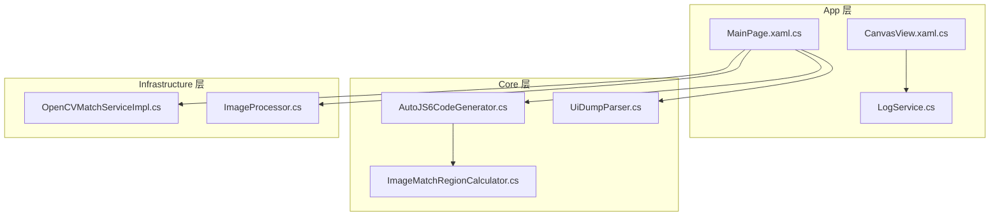
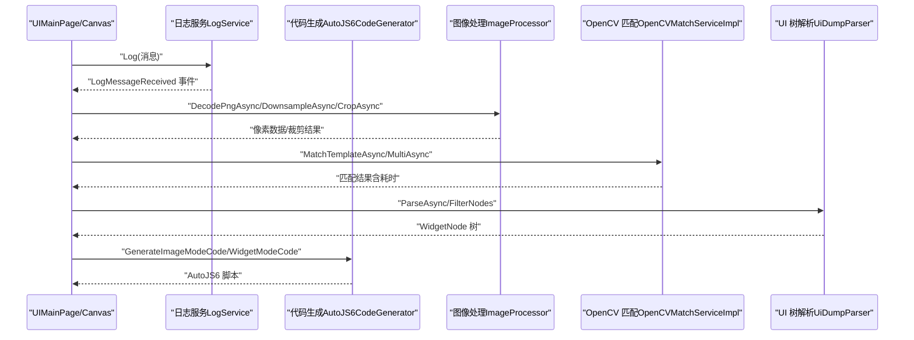
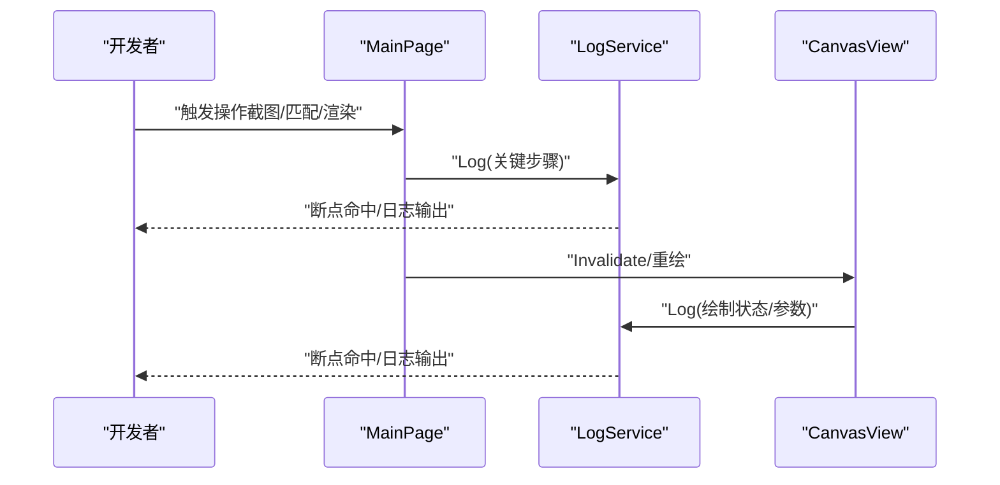
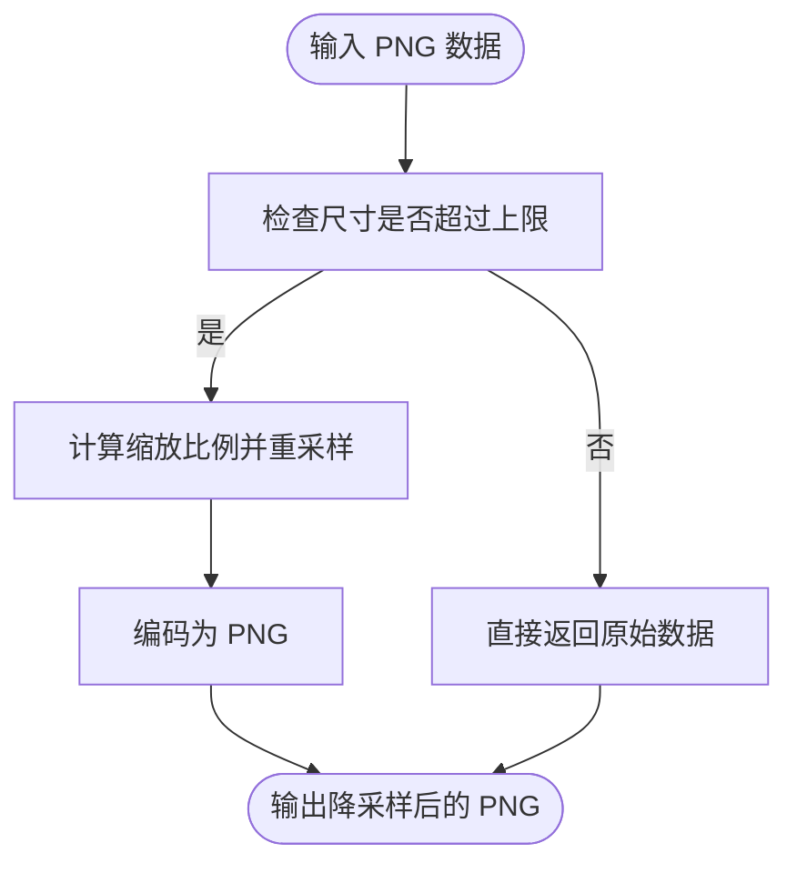
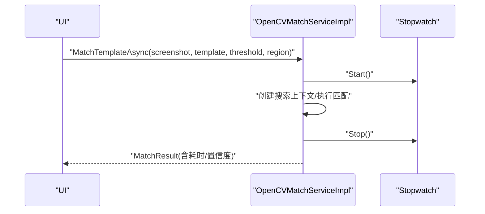
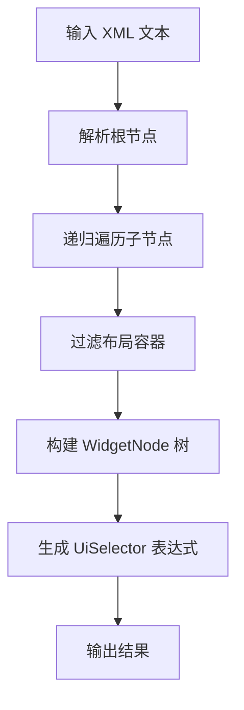
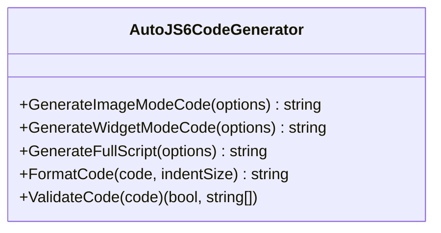
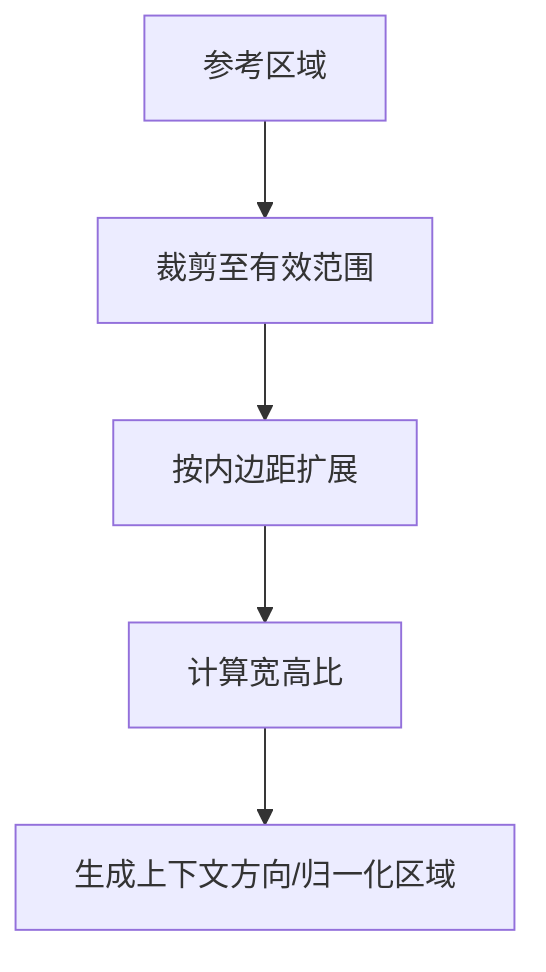
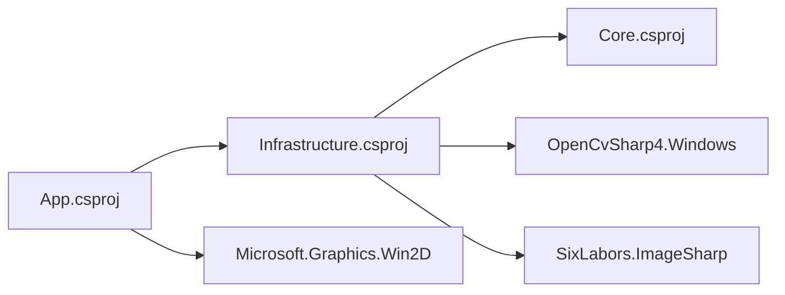

# 调试技巧与性能优化

<cite>
**本文档引用的文件**
- [LogService.cs](file://App/Services/LogService.cs)
- [MainPage.xaml.cs](file://App/Views/MainPage.xaml.cs)
- [CanvasView.xaml.cs](file://App/Views/CanvasView.xaml.cs)
- [ImageProcessor.cs](file://Infrastructure/Imaging/ImageProcessor.cs)
- [OpenCVMatchServiceImpl.cs](file://Infrastructure/Imaging/OpenCVMatchServiceImpl.cs)
- [UiDumpParser.cs](file://Core/Services/UiDumpParser.cs)
- [AutoJS6CodeGenerator.cs](file://Core/Services/AutoJS6CodeGenerator.cs)
- [ImageMatchRegionCalculator.cs](file://Core/Helpers/ImageMatchRegionCalculator.cs)
- [README.md](file://README.md)
- [UnitTests.cs](file://App.Tests/UnitTests.cs)
- [AutoJS6CodeGeneratorTests.cs](file://Core.Tests/AutoJS6CodeGeneratorTests.cs)
- [App.csproj](file://App/App.csproj)
- [Infrastructure.csproj](file://Infrastructure/Infrastructure.csproj)
- [Core.csproj](file://Core/Core.csproj)
- [launchSettings.json](file://App/Properties/launchSettings.json)
</cite>

## 目录
1. [简介](#简介)
2. [项目结构](#项目结构)
3. [核心组件](#核心组件)
4. [架构总览](#架构总览)
5. [详细组件分析](#详细组件分析)
6. [依赖分析](#依赖分析)
7. [性能考虑](#性能考虑)
8. [故障排查指南](#故障排查指南)
9. [结论](#结论)
10. [附录](#附录)

## 简介
本指南聚焦 AutoJS6 开发工具的调试技巧与性能优化，围绕以下主题展开：
- 断点调试与日志系统：如何利用现有日志基础设施进行问题定位，以及在关键路径设置断点的方法。
- 性能分析与优化：针对图像处理、UI 渲染与内存管理的关键瓶颈识别与优化策略。
- 工具链与配置：结合项目结构与构建配置，给出 Visual Studio 调试器、性能探查器与诊断工具的使用建议。

## 项目结构
该项目采用 Clean Architecture 分层设计，分为三层：
- App 层：WinUI 3 应用界面与视图逻辑，负责用户交互与事件驱动。
- Core 层：纯业务逻辑与模型，不依赖 UI，便于单元测试与复用。
- Infrastructure 层：外部依赖适配器（ADB、OpenCV、ImageSharp），向上提供抽象接口。

图表来源
- [MainPage.xaml.cs:1-409](file://App/Views/MainPage.xaml.cs#L1-L409)
- [CanvasView.xaml.cs:1-800](file://App/Views/CanvasView.xaml.cs#L1-L800)
- [LogService.cs:1-51](file://App/Services/LogService.cs#L1-L51)
- [AutoJS6CodeGenerator.cs:1-357](file://Core/Services/AutoJS6CodeGenerator.cs#L1-L357)
- [UiDumpParser.cs:1-263](file://Core/Services/UiDumpParser.cs#L1-L263)
- [OpenCVMatchServiceImpl.cs:1-204](file://Infrastructure/Imaging/OpenCVMatchServiceImpl.cs#L1-L204)
- [ImageProcessor.cs:1-162](file://Infrastructure/Imaging/ImageProcessor.cs#L1-L162)

章节来源
- [README.md:230-261](file://README.md#L230-L261)
- [App.csproj:1-84](file://App/App.csproj#L1-L84)
- [Infrastructure.csproj:1-19](file://Infrastructure/Infrastructure.csproj#L1-L19)
- [Core.csproj:1-10](file://Core/Core.csproj#L1-L10)

## 核心组件
- 日志服务（LogService）：全局单例日志入口，统一输出到调试控制台并推送 UI 事件，便于在断点调试时快速查看关键路径信息。
- 主页面（MainPage）：集中处理设备截图、UI 树拉取、模板裁剪与代码生成等流程，并订阅日志事件展示到 UI。
- 画布视图（CanvasView）：Win2D 双层渲染（图像层+覆盖层），包含缩放、平移、惯性滚动、裁剪交互与匹配结果绘制。
- 图像处理（ImageProcessor）：PNG 解码、降采样、裁剪、元数据生成与尺寸查询。
- OpenCV 匹配（OpenCVMatchServiceImpl）：模板匹配、多点匹配与相似度计算，内置计时统计。
- UI 树解析（UiDumpParser）：XML 解析、节点过滤、坐标查找与 UiSelector 生成。
- 代码生成（AutoJS6CodeGenerator）：基于选项生成 AutoJS6 脚本，含 Rhino 引擎约束校验与格式化。
- 匹配区域计算器（ImageMatchRegionCalculator）：根据参考区域生成搜索上下文与归一化区域。

章节来源
- [LogService.cs:1-51](file://App/Services/LogService.cs#L1-L51)
- [MainPage.xaml.cs:1-409](file://App/Views/MainPage.xaml.cs#L1-L409)
- [CanvasView.xaml.cs:1-800](file://App/Views/CanvasView.xaml.cs#L1-L800)
- [ImageProcessor.cs:1-162](file://Infrastructure/Imaging/ImageProcessor.cs#L1-L162)
- [OpenCVMatchServiceImpl.cs:1-204](file://Infrastructure/Imaging/OpenCVMatchServiceImpl.cs#L1-L204)
- [UiDumpParser.cs:1-263](file://Core/Services/UiDumpParser.cs#L1-L263)
- [AutoJS6CodeGenerator.cs:1-357](file://Core/Services/AutoJS6CodeGenerator.cs#L1-L357)
- [ImageMatchRegionCalculator.cs:1-99](file://Core/Helpers/ImageMatchRegionCalculator.cs#L1-L99)

## 架构总览
应用采用“异步优先”的架构，所有 I/O 操作均通过 async/await 执行，避免阻塞 UI 线程；日志服务贯穿各层，便于在断点调试时快速定位问题。

图表来源
- [MainPage.xaml.cs:147-248](file://App/Views/MainPage.xaml.cs#L147-L248)
- [CanvasView.xaml.cs:572-627](file://App/Views/CanvasView.xaml.cs#L572-L627)
- [LogService.cs:39-49](file://App/Services/LogService.cs#L39-L49)
- [ImageProcessor.cs:21-100](file://Infrastructure/Imaging/ImageProcessor.cs#L21-L100)
- [OpenCVMatchServiceImpl.cs:13-60](file://Infrastructure/Imaging/OpenCVMatchServiceImpl.cs#L13-L60)
- [UiDumpParser.cs:14-35](file://Core/Services/UiDumpParser.cs#L14-L35)
- [AutoJS6CodeGenerator.cs:13-102](file://Core/Services/AutoJS6CodeGenerator.cs#L13-L102)

## 详细组件分析

### 日志系统与断点调试
- 日志服务（LogService）提供统一入口，支持 UI 订阅事件实时显示日志。
- 在关键路径（如截图、UI 树拉取、画布绘制、匹配计算）插入日志，有助于断点调试时快速定位问题。
- 建议在以下位置设置断点：
  - 截图与 UI 树拉取：MainPage 的对应事件处理方法。
  - 画布绘制：CanvasView 的 Canvas_Draw 与 Overlay 绘制分支。
  - 匹配计算：OpenCVMatchServiceImpl 的 MatchTemplateAsync。
  - 代码生成：AutoJS6CodeGenerator 的 GenerateImageModeCode/GenerateWidgetModeCode。

图表来源
- [MainPage.xaml.cs:112-118](file://App/Views/MainPage.xaml.cs#L112-L118)
- [CanvasView.xaml.cs:572-627](file://App/Views/CanvasView.xaml.cs#L572-L627)
- [LogService.cs:39-49](file://App/Services/LogService.cs#L39-L49)

章节来源
- [LogService.cs:1-51](file://App/Services/LogService.cs#L1-L51)
- [MainPage.xaml.cs:1-409](file://App/Views/MainPage.xaml.cs#L1-L409)
- [CanvasView.xaml.cs:1-800](file://App/Views/CanvasView.xaml.cs#L1-L800)

### 图像处理与性能优化
- 解码与降采样：对高分辨率图像进行降采样以减少内存占用与后续处理开销。
- 裁剪与导出：安全边界检查与区域裁剪，避免越界错误。
- 元数据生成：记录原始尺寸与裁剪偏移，便于 AutoJS6 代码生成与回放。

图表来源
- [ImageProcessor.cs:47-72](file://Infrastructure/Imaging/ImageProcessor.cs#L47-L72)

章节来源
- [ImageProcessor.cs:1-162](file://Infrastructure/Imaging/ImageProcessor.cs#L1-L162)

### OpenCV 匹配与计时
- 使用 TM_CCOEFF_NORMED 算法进行模板匹配，支持单点与多点匹配。
- 内置计时统计，返回匹配耗时与置信度，便于性能分析与阈值调优。

图表来源
- [OpenCVMatchServiceImpl.cs:20-60](file://Infrastructure/Imaging/OpenCVMatchServiceImpl.cs#L20-L60)

章节来源
- [OpenCVMatchServiceImpl.cs:1-204](file://Infrastructure/Imaging/OpenCVMatchServiceImpl.cs#L1-L204)

### UI 树解析与选择器生成
- 解析 uiautomator dump XML，过滤布局容器，生成 WidgetNode 树。
- 支持坐标查找与 UiSelector 生成，便于控件定位与代码生成。

图表来源
- [UiDumpParser.cs:14-35](file://Core/Services/UiDumpParser.cs#L14-L35)
- [UiDumpParser.cs:103-154](file://Core/Services/UiDumpParser.cs#L103-L154)

章节来源
- [UiDumpParser.cs:1-263](file://Core/Services/UiDumpParser.cs#L1-L263)

### 代码生成与 Rhino 约束
- 生成图像模式与控件模式的 AutoJS6 脚本，包含重试逻辑与资源回收。
- 对 Rhino 引擎的 const/let 限制进行校验，确保生成代码可在运行时正确执行。

图表来源
- [AutoJS6CodeGenerator.cs:11-164](file://Core/Services/AutoJS6CodeGenerator.cs#L11-L164)

章节来源
- [AutoJS6CodeGenerator.cs:1-357](file://Core/Services/AutoJS6CodeGenerator.cs#L1-L357)

### 匹配区域上下文与归一化
- 基于参考区域与内边距生成搜索区域，支持横竖屏方向归一化，便于跨设备匹配。

图表来源
- [ImageMatchRegionCalculator.cs:40-97](file://Core/Helpers/ImageMatchRegionCalculator.cs#L40-L97)

章节来源
- [ImageMatchRegionCalculator.cs:1-99](file://Core/Helpers/ImageMatchRegionCalculator.cs#L1-L99)

## 依赖分析
- App 依赖 Infrastructure，Infrastructure 依赖 Core。
- 关键第三方库：Win2D（GPU 加速渲染）、OpenCvSharp（图像匹配）、ImageSharp（图像解码/编码）。

图表来源
- [App.csproj:67-67](file://App/App.csproj#L67-L67)
- [Infrastructure.csproj:9-17](file://Infrastructure/Infrastructure.csproj#L9-L17)
- [Core.csproj:1-10](file://Core/Core.csproj#L1-L10)

章节来源
- [App.csproj:1-84](file://App/App.csproj#L1-L84)
- [Infrastructure.csproj:1-19](file://Infrastructure/Infrastructure.csproj#L1-L19)
- [Core.csproj:1-10](file://Core/Core.csproj#L1-L10)

## 性能考虑
- 图像处理
  - 降采样：对高分辨率图像进行降采样，减少内存与计算压力。
  - 裁剪：仅在必要范围内进行裁剪，避免不必要的像素拷贝。
  - 元数据：记录原始尺寸与偏移，便于 AutoJS6 侧按需处理。
- UI 渲染
  - 双层渲染：图像层与覆盖层分离，减少重绘成本。
  - 缓存：CanvasBitmap 缓存池限制数量，避免频繁纹理创建与销毁。
  - 惯性滚动：定时器频率与衰减系数平衡流畅度与 CPU 占用。
- 匹配性能
  - 区域限定：优先使用 region 限定搜索范围，减少扫描面积。
  - 算法选择：TM_CCOEFF_NORMED 适合一般场景，配合阈值与置信度筛选。
  - 计时统计：利用匹配耗时评估不同阈值与区域的效果。
- 内存管理
  - 资源回收：及时释放图像对象与位图缓存，避免 OOM。
  - 并发与取消：使用 CancellationToken 支持取消与并发控制。
- 代码生成
  - 循环内变量：遵循 Rhino 引擎约束，避免在循环体内使用 const/let。
  - 重试与回收：合理设置重试次数与模板回收，平衡稳定性与性能。

章节来源
- [ImageProcessor.cs:47-72](file://Infrastructure/Imaging/ImageProcessor.cs#L47-L72)
- [CanvasView.xaml.cs:358-426](file://App/Views/CanvasView.xaml.cs#L358-L426)
- [CanvasView.xaml.cs:107-138](file://App/Views/CanvasView.xaml.cs#L107-L138)
- [OpenCVMatchServiceImpl.cs:13-60](file://Infrastructure/Imaging/OpenCVMatchServiceImpl.cs#L13-L60)
- [AutoJS6CodeGenerator.cs:226-258](file://Core/Services/AutoJS6CodeGenerator.cs#L226-L258)

## 故障排查指南
- 日志定位
  - 在 MainPage 与 CanvasView 的关键路径调用 LogService，断点命中后查看日志输出。
  - 使用 UI 的日志面板进行复制与筛选，辅助问题复现。
- 单元测试
  - App.Tests 验证 MainPage XAML 控件契约，确保 UI 构建输出符合预期。
  - Core.Tests 验证代码生成的语法与顺序，确保生成脚本可运行。
- 常见问题
  - 截图失败：检查设备连接与 ADB 权限，关注异常提示。
  - UI 树解析失败：确认 XML 结构与节点有效性。
  - 匹配结果为空：调整阈值、限定区域或检查模板质量。
  - UI 卡顿：检查 Canvas 绘制路径与缓存策略，避免过度重绘。

章节来源
- [MainPage.xaml.cs:112-118](file://App/Views/MainPage.xaml.cs#L112-L118)
- [CanvasView.xaml.cs:572-627](file://App/Views/CanvasView.xaml.cs#L572-L627)
- [UnitTests.cs:1-91](file://App.Tests/UnitTests.cs#L1-L91)
- [AutoJS6CodeGeneratorTests.cs:1-80](file://Core.Tests/AutoJS6CodeGeneratorTests.cs#L1-L80)

## 结论
通过统一的日志系统与清晰的分层架构，本项目在调试与性能优化方面具备良好基础。建议在关键路径持续输出日志，在断点调试中结合计时统计与缓存策略，逐步定位并解决性能瓶颈，最终获得稳定高效的 AutoJS6 开发体验。

## 附录
- 调试器与性能探查器配置
  - Visual Studio 启动配置：使用 launchSettings.json 中的 App 配置启动应用。
  - 性能探针：在 OpenCV 匹配与 Canvas 绘制路径设置计时，观察耗时分布。
  - 诊断工具：结合 Win2D GPU 加速特性，监控渲染帧率与内存占用。
- 代码生成约束
  - 遵循 Rhino 引擎限制，避免循环体内使用 const/let。
  - 生成脚本包含重试与回收逻辑，提升鲁棒性与资源利用率。

章节来源
- [launchSettings.json:1-14](file://App/Properties/launchSettings.json#L1-L14)
- [README.md:342-374](file://README.md#L342-L374)