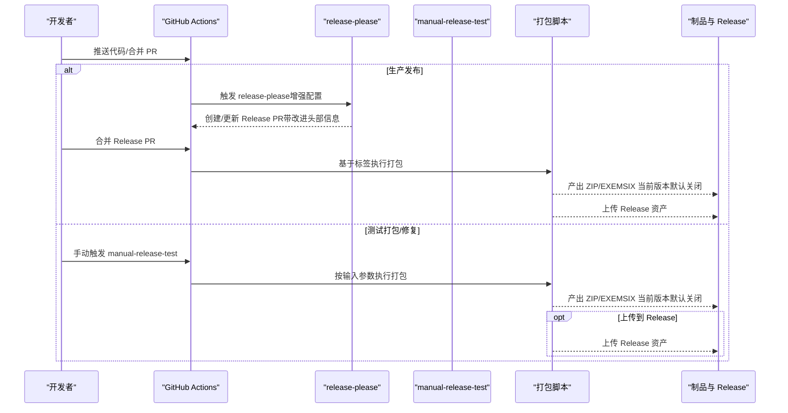
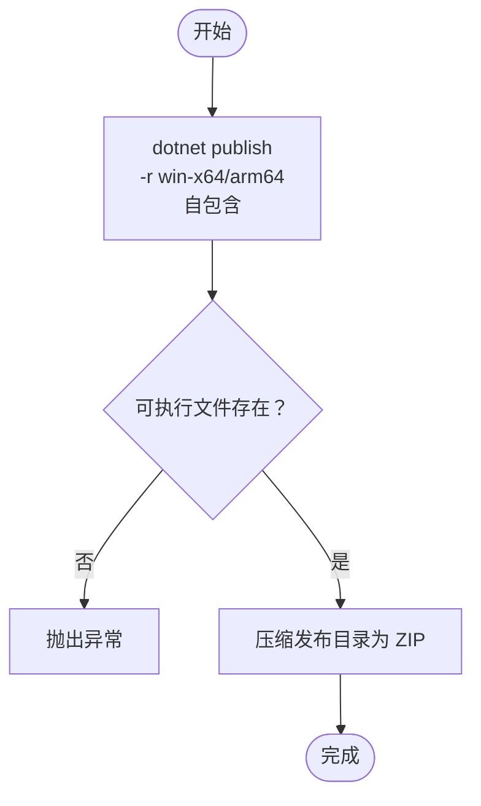
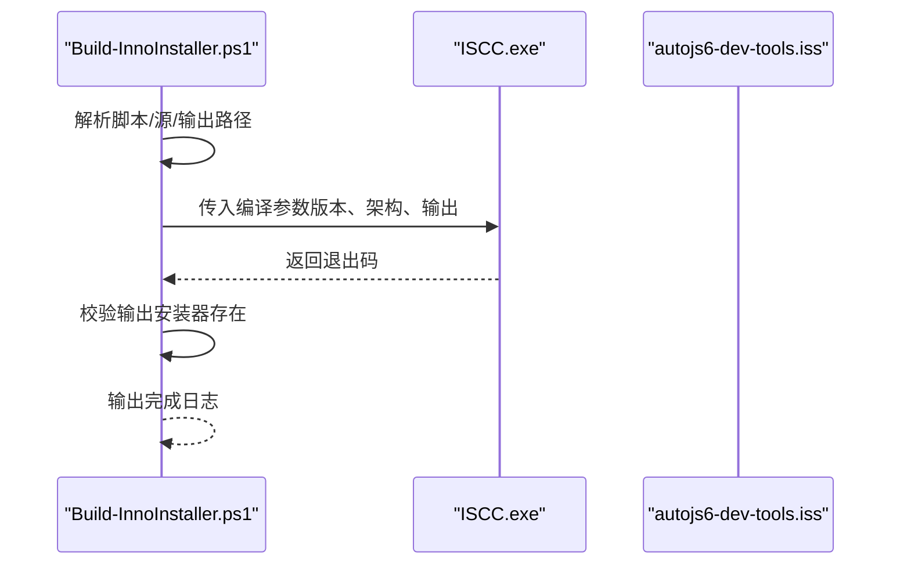
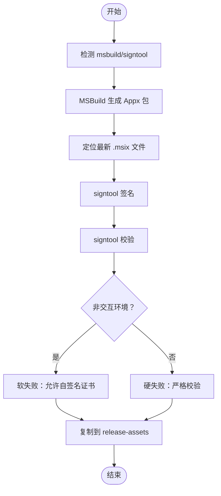
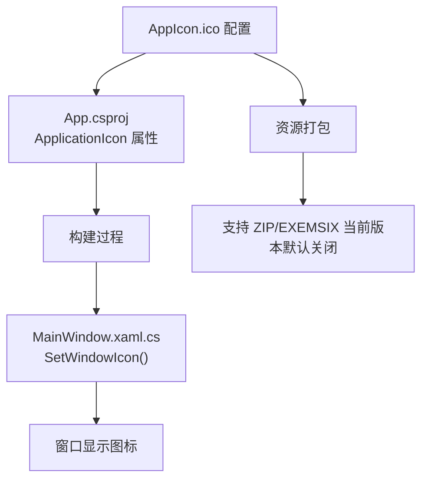
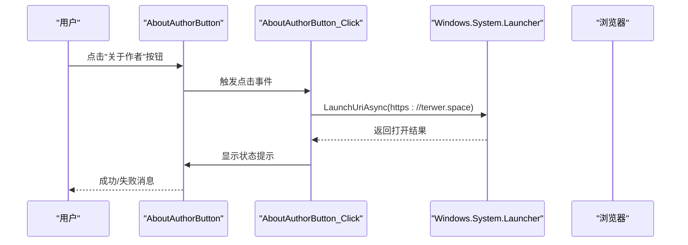
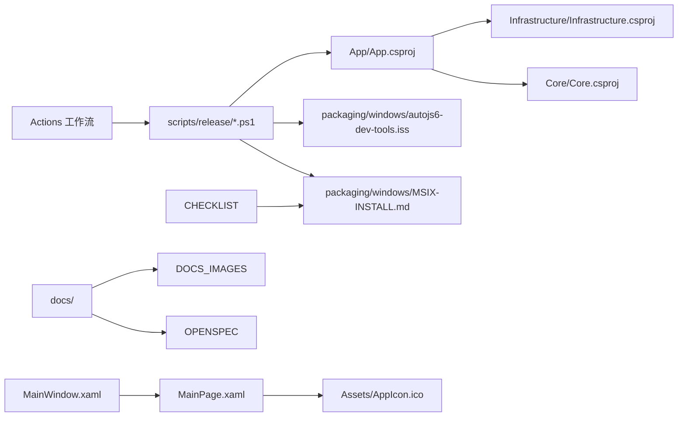

# 部署与发布流程

<cite>
**本文引用的文件**
- [.github/workflows/release-please.yml](file://.github/workflows/release-please.yml)
- [.github/workflows/manual-release-test.yml](file://.github/workflows/manual-release-test.yml)
- [release-please-config.json](file://release-please-config.json)
- [.release-please-manifest.json](file://.release-please-manifest.json)
- [packaging/windows/autojs6-dev-tools.iss](file://packaging/windows/autojs6-dev-tools.iss)
- [packaging/windows/MSIX-INSTALL.md](file://packaging/windows/MSIX-INSTALL.md)
- [scripts/release/Set-AppReleaseMetadata.ps1](file://scripts/release/Set-AppReleaseMetadata.ps1)
- [scripts/release/Build-PortablePackage.ps1](file://scripts/release/Build-PortablePackage.ps1)
- [scripts/release/Build-InnoInstaller.ps1](file://scripts/release/Build-InnoInstaller.ps1)
- [scripts/release/Build-MsixPackage.ps1](file://scripts/release/Build-MsixPackage.ps1)
- [App/App.csproj](file://App/App.csproj)
- [App/Package.appxmanifest](file://App/Package.appxmanifest)
- [App/app.manifest](file://App/app.manifest)
- [App/MainWindow.xaml](file://App/MainWindow.xaml)
- [App/MainWindow.xaml.cs](file://App/MainWindow.xaml.cs)
- [App/Views/MainPage.xaml](file://App/Views/MainPage.xaml)
- [App/Views/MainPage.xaml.cs](file://App/Views/MainPage.xaml.cs)
- [App/App.xaml](file://App/App.xaml)
- [checklist.md](file://checklist.md)
- [DEVELOPMENT.md](file://DEVELOPMENT.md)
- [README.md](file://README.md)
- [RELEASE_TEST.md](file://RELEASE_TEST.md)
</cite>

## 更新摘要
**所做更改**
- 更新MSIX包生成流程状态，明确标注为"当前版本默认关闭，只有后续版本明确恢复时才执行"
- 新增MSIX安装指南和证书信任说明
- 更新发布路径说明，反映MSIX包在当前CI中的临时禁用状态
- 增强MSIX包的未来使用规划说明

## 目录
1. [简介](#简介)
2. [项目结构](#项目结构)
3. [核心组件](#核心组件)
4. [架构总览](#架构总览)
5. [详细组件分析](#详细组件分析)
6. [依赖关系分析](#依赖关系分析)
7. [性能考量](#性能考量)
8. [故障排除指南](#故障排除指南)
9. [结论](#结论)
10. [附录](#附录)

## 简介
本文件面向 AutoJS6 开发工具的维护者与贡献者，系统性阐述项目的部署与发布流程，明确三类发布路径的差异与适用场景，并深入解析 GitHub Actions 工作流的配置与参数，提供本地打包验证的完整步骤，说明多平台支持（x86/x64/ARM64）的实现方式，以及版本管理与发布策略。同时给出常见问题的诊断与修复建议，帮助团队在 CI/CD 与本地环境中高效、稳定地交付产品。

**更新** 本版本更新了MSIX包生成流程的状态说明，明确标注为"当前版本默认关闭，只有后续版本明确恢复时才执行"，并在相关章节中反映了这一状态，同时新增了MSIX安装指南和证书信任说明。

## 项目结构
项目采用分层与多工程组织方式，核心应用为 WinUI 3 桌面应用，配合纯业务逻辑层与基础设施适配层；发布侧通过 GitHub Actions 自动化执行，脚本位于 scripts/release 下，Windows 安装包模板位于 packaging/windows。解决方案文件中新增了文档文件夹结构，便于维护项目文档。

```mermaid
graph TB
subgraph "应用层"
APP["App/App.csproj"]
MAIN_WINDOW["App/MainWindow.xaml"]
MAIN_PAGE["App/Views/MainPage.xaml"]
MAN_APPX["App/Package.appxmanifest"]
MAN_WIN32["App/app.manifest"]
ASSETS["App/Assets/"]
ASSETS_ICON["App/Assets/AppIcon.ico"]
END
subgraph "业务与基础设施"
CORE["Core/Core.csproj"]
INFRA["Infrastructure/Infrastructure.csproj"]
END
subgraph "发布与打包"
GH_RELEASE["release-please.yml"]
GH_TEST["manual-release-test.yml"]
ISS["packaging/windows/autojs6-dev-tools.iss"]
MSIX_INSTALL["packaging/windows/MSIX-INSTALL.md"]
SCRIPTS["scripts/release/*.ps1"]
END
subgraph "文档结构"
DOCS["docs/"]
DOCS_IMAGES["docs/images/"]
OPENSPEC["openspec/"]
CHECKLIST["checklist.md"]
END
APP --> INFRA
APP --> CORE
APP -. MSIX 打包 .-> MAN_APPX
APP -. Win32 版本号 .-> MAN_WIN32
MAIN_WINDOW --> MAIN_PAGE
MAIN_PAGE --> ASSETS_ICON
GH_RELEASE --> SCRIPTS
GH_TEST --> SCRIPTS
SCRIPTS --> APP
SCRIPTS --> ISS
SCRIPTS --> MSIX_INSTALL
DOCS --> DOCS_IMAGES
DOCS --> OPENSPEC
CHECKLIST --> MSIX_INSTALL
```

**图表来源**
- [App/App.csproj:1-88](file://App/App.csproj#L1-L88)
- [App/MainWindow.xaml:1-19](file://App/MainWindow.xaml#L1-L19)
- [App/Views/MainPage.xaml:1-824](file://App/Views/MainPage.xaml#L1-L824)
- [.github/workflows/release-please.yml:1-169](file://.github/workflows/release-please.yml#L1-L169)
- [.github/workflows/manual-release-test.yml:1-219](file://.github/workflows/manual-release-test.yml#L1-L219)
- [packaging/windows/autojs6-dev-tools.iss:1-75](file://packaging/windows/autojs6-dev-tools.iss#L1-L75)
- [packaging/windows/MSIX-INSTALL.md:1-36](file://packaging/windows/MSIX-INSTALL.md#L1-L36)
- [README.md:261-291](file://README.md#L261-L291)
- [checklist.md:182-187](file://checklist.md#L182-L187)

**章节来源**
- [README.md:261-291](file://README.md#L261-L291)
- [App/App.csproj:1-88](file://App/App.csproj#L1-L88)

## 核心组件
- 发布工作流
  - release-please：基于增强配置自动创建/更新发布 PR 并在创建标签后触发打包与上传，支持目标分支指定和改进的变更日志分类。
  - manual-release-test：手动触发的测试/修复打包流程，支持选择源分支/标签、指定版本、是否上传到 Release。
- 发布元数据与清单
  - release-please-config.json：定义发布类型、变更日志路径、目标分支、PR 头部信息和配置模式引用。
  - .release-please-manifest.json：根包版本清单。
- 打包脚本
  - Set-AppReleaseMetadata.ps1：写入应用清单中的产品名、包身份、发布者、版本等。
  - Build-PortablePackage.ps1：生成便携 ZIP（win-x64/win-arm64）。
  - Build-InnoInstaller.ps1：生成 EXE 安装器（win-x64/win-arm64），支持架构参数。
  - Build-MsixPackage.ps1：生成 MSIX 包并签名验证（当前版本默认关闭，只有后续版本明确恢复时才执行）。
- Windows 安装脚本
  - autojs6-dev-tools.iss：Inno Setup 脚本模板，包含应用信息、输出命名、架构参数等。
- MSIX 安装指南
  - MSIX-INSTALL.md：MSIX 包安装与证书信任的详细说明。
- 应用清单
  - Package.appxmanifest：MSIX 包身份、显示名、最小/最大目标版本、能力等。
  - app.manifest：Win32 应用兼容性与 DPI 设置等。
- 用户界面组件
  - 应用图标：AppIcon.ico 作为应用程序的主要图标资源。
  - 关于作者按钮：HyperlinkButton 实现的作者主页链接功能。

**章节来源**
- [.github/workflows/release-please.yml:13-169](file://.github/workflows/release-please.yml#L13-L169)
- [.github/workflows/manual-release-test.yml:37-219](file://.github/workflows/manual-release-test.yml#L37-L219)
- [release-please-config.json:1-39](file://release-please-config.json#L1-L39)
- [.release-please-manifest.json:1-4](file://.release-please-manifest.json#L1-L4)
- [scripts/release/Set-AppReleaseMetadata.ps1:1-85](file://scripts/release/Set-AppReleaseMetadata.ps1#L1-L85)
- [scripts/release/Build-PortablePackage.ps1:1-59](file://scripts/release/Build-PortablePackage.ps1#L1-L59)
- [scripts/release/Build-InnoInstaller.ps1:1-122](file://scripts/release/Build-InnoInstaller.ps1#L1-L122)
- [scripts/release/Build-MsixPackage.ps1:1-265](file://scripts/release/Build-MsixPackage.ps1#L1-L265)
- [packaging/windows/autojs6-dev-tools.iss:1-75](file://packaging/windows/autojs6-dev-tools.iss#L1-L75)
- [packaging/windows/MSIX-INSTALL.md:1-36](file://packaging/windows/MSIX-INSTALL.md#L1-L36)
- [App/Package.appxmanifest:1-54](file://App/Package.appxmanifest#L1-L54)
- [App/app.manifest:1-20](file://App/app.manifest#L1-L20)
- [App/App.csproj:37-39](file://App/App.csproj#L37-L39)

## 架构总览
下图展示从代码提交到产物发布的端到端流程，涵盖两条路径：常规开发、测试打包/修复、生产发布。



**图表来源**
- [.github/workflows/release-please.yml:13-169](file://.github/workflows/release-please.yml#L13-L169)
- [.github/workflows/manual-release-test.yml:37-219](file://.github/workflows/manual-release-test.yml#L37-L219)

## 详细组件分析

### 发布路径与适用场景
- 常规开发
  - 特点：不自动构建完整发布包，避免浪费资源与产生低价值构建。
  - 适用：日常功能开发与小步提交。
- 测试打包/修复
  - 特点：按需手动触发，可选择从 main 或已有标签构建，可仅本地验证或上传到 Release。
  - 适用：需要验证打包可用性、修复现有 Release 缺失资产。
- 生产发布
  - 特点：由 release-please 在创建/更新标签后自动触发打包与上传，确保版本稳定。
  - 适用：确认可用后正式对外发布。

**更新** 当前版本中，MSIX 包生成已被默认关闭，仅在后续版本明确恢复时才会执行。这意味着生产发布和测试打包都只会生成 ZIP 和 EXE 产物。

**章节来源**
- [DEVELOPMENT.md:5-16](file://DEVELOPMENT.md#L5-L16)
- [DEVELOPMENT.md:64-132](file://DEVELOPMENT.md#L64-L132)
- [DEVELOPMENT.md:135-162](file://DEVELOPMENT.md#L135-L162)
- [checklist.md:182-187](file://checklist.md#L182-L187)

### GitHub Actions 工作流配置与参数

#### release-please 工作流（增强配置）
- 触发条件：推送到 main 分支。
- 安全配置更新：使用 secrets.GH_TOKEN 替代传统的 secrets.GITHUB_TOKEN，提升安全性。
- 增强配置特性：
  - 目标分支指定：`target-branch: "main"` 确保 PR 始终针对 main 分支。
  - 改进的变更日志部分：支持 feat、fix、refactor、chore、perf 等类型分类。
  - PR 头部信息：`:robot: A new release will be created` 提供清晰的 PR 标识。
  - 配置模式引用：`$schema` 指向官方配置模式，确保配置有效性。
- 关键步骤：
  - 校验 release-please 配置与清单版本格式。
  - 使用 release-please-action 创建/更新 Release PR。
  - 切换到标签引用，恢复项目，安装 Inno Setup。
  - 应用发布元数据（产品名、包身份、发布者、版本）。
  - 生成代码签名证书。
  - 分别为 win-x64 与 win-arm64 生成便携 ZIP。
  - 分别为 win-x64 与 win-arm64 生成 EXE 安装器（Inno Setup）。
  - **更新**：MSIX 包生成步骤在当前版本中被默认关闭，只有后续版本明确恢复时才执行。
  - 准备支持文件（安装说明、证书、SHA256SUMS）。
  - 上传制品到对应 Release 标签。

**更新** release-please 配置现已包含目标分支指定、改进的变更日志分类和 PR 头部信息，这些增强特性提升了发布流程的规范性和可追溯性。同时，MSIX 包生成步骤在当前版本中被默认关闭，体现了其作为未来功能的状态。

**章节来源**
- [.github/workflows/release-please.yml:1-169](file://.github/workflows/release-please.yml#L1-L169)
- [release-please-config.json:1-39](file://release-please-config.json#L1-L39)
- [.release-please-manifest.json:1-4](file://.release-please-manifest.json#L1-L4)

#### manual-release-test 工作流（增强参数）
- 触发方式：workflow_dispatch，支持以下输入：
  - source_ref：构建来源（main 或标签）。**增强描述**：支持三种场景
    - dev：当前开发验证（默认值，用于验证开发中的功能）
    - main：发布候选验证（用于验证即将发布的版本）
    - 生产标签：修复现有发布（用于修复已发布版本的缺失资产）
  - version：版本号（语义化 x.y.z）。
  - publish_to_release：是否上传到 GitHub Release。
  - release_tag：目标 Release 标签（为空则生成测试标签）。
  - release_name：Release 标题（为空则生成默认标题）。
  - prerelease：新建 Release 时标记为预发布。
- 安全配置更新：同样使用 secrets.GH_TOKEN 进行安全令牌传递。
- 关键步骤：
  - 解析并校验版本格式。
  - 检出指定源引用。
  - 应用发布元数据与生成签名证书。
  - 构建便携 ZIP（win-x64/win-arm64）、EXE 安装器（win-x64/win-arm64）。
  - **更新**：MSIX 包生成步骤在当前版本中被默认关闭，只有后续版本明确恢复时才执行。
  - 生成支持文件与 SHA256SUMS。
  - 将制品作为 Actions 资产下载，或上传到指定 Release。

**更新** source_ref 参数的默认值已从 'main' 更改为 'dev'，这使得新功能开发的验证更加便捷，默认直接指向开发分支。同时增强了参数描述，提供了更清晰的使用指导。MSIX 包生成步骤在当前版本中被默认关闭，体现了其作为未来功能的状态。

**章节来源**
- [.github/workflows/manual-release-test.yml:1-219](file://.github/workflows/manual-release-test.yml#L1-L219)

### 多平台支持（x86/x64/ARM64）
- 应用项目配置
  - App.csproj 中定义了多平台与运行时标识符，支持 AnyCPU、x86、x64、ARM64，并在无显式指定时默认 win-x64。
  - **增强**：完善了 AnyCPU 平台的处理逻辑，确保在未指定平台时自动解析为 win-x64。
  - **新增**：配置了 ApplicationIcon 为 Assets/AppIcon.ico，确保所有平台使用统一的应用图标。
- 打包脚本参数
  - Build-PortablePackage.ps1 与 Build-InnoInstaller.ps1 明确传入 RuntimeIdentifier（win-x64/win-arm64）。
  - **更新**：Build-MsixPackage.ps1 明确传入 Platform（x64/ARM64）与 RuntimeIdentifier（win-x64/win-arm64），但当前版本默认关闭。
- Inno Setup 模板
  - autojs6-dev-tools.iss 支持通过编译参数设置 ArchitecturesAllowed 与 ArchitecturesInstallIn64BitMode，分别针对 x64 兼容与 ARM64。

**章节来源**
- [App/App.csproj:11-19](file://App/App.csproj#L11-L19)
- [App/App.csproj:37-39](file://App/App.csproj#L37-L39)
- [scripts/release/Build-PortablePackage.ps1:2-16](file://scripts/release/Build-PortablePackage.ps1#L2-L16)
- [scripts/release/Build-InnoInstaller.ps1:2-29](file://scripts/release/Build-InnoInstaller.ps1#L2-L29)
- [scripts/release/Build-MsixPackage.ps1:2-23](file://scripts/release/Build-MsixPackage.ps1#L2-L23)
- [packaging/windows/autojs6-dev-tools.iss:28-33](file://packaging/windows/autojs6-dev-tools.iss#L28-L33)

### 版本管理与发布策略
- 语义化版本
  - 工作流与脚本均要求版本格式为 x.y.z，且会将语义版本转换为四段制用于 Win32 清单与 MSIX 清单。
- 发布历史维护
  - release-please-config.json 指定 changelog 路径，便于维护发布历史。
  - 改进的变更日志部分分类，支持多种类型（feat、fix、refactor、chore、perf）。
- 版本来源
  - .release-please-manifest.json 提供根包当前版本，release-please 基于此创建/更新 Release。

**更新** release-please 配置现已包含改进的变更日志部分分类，支持更多类型的变更记录，提升了发布历史的可读性和维护性。

**章节来源**
- [.github/workflows/release-please.yml:26-41](file://.github/workflows/release-please.yml#L26-L41)
- [.github/workflows/manual-release-test.yml:47-65](file://.github/workflows/manual-release-test.yml#L47-L65)
- [scripts/release/Set-AppReleaseMetadata.ps1:16-35](file://scripts/release/Set-AppReleaseMetadata.ps1#L16-L35)
- [release-please-config.json:4-8](file://release-please-config.json#L4-L8)
- [.release-please-manifest.json:1-4](file://.release-please-manifest.json#L1-L4)

### 本地打包验证流程（ZIP/EXE/MSIX）
- 前置条件
  - .NET 8 SDK、MSBuild + SignTool（VS 2022/2026 或 Build Tools + Windows SDK）、Inno Setup 6（ISCC.exe）。
- 推荐顺序
  - 还原并构建解决方案（Release）。
  - 运行单元测试（Release）。
  - 生成 win-x64 与 win-arm64 便携 ZIP。
  - 对 win-x64 便携 EXE 进行冒烟测试。
  - 生成 win-x64 与 win-arm64 EXE 安装器。
  - **更新**：MSIX 包生成步骤在当前版本中被默认关闭，只有后续版本明确恢复时才执行。
  - 校验 release-assets 内文件版本、发布者、SHA256 摘要列表。

**更新** 当前版本中，MSIX 包生成步骤被默认关闭，因此本地验证流程中不会生成 MSIX 包。如果需要验证 MSIX 功能，需要在后续版本中明确恢复该步骤。

**章节来源**
- [DEVELOPMENT.md:35-61](file://DEVELOPMENT.md#L35-L61)
- [README.md:112-124](file://README.md#L112-L124)

### 打包脚本与流程详解

#### 应用发布元数据注入
- 功能：修改 Package.appxmanifest 与 app.manifest 的 Identity 与显示信息，统一版本格式。
- 关键点：将 x.y.z 转换为 x.y.z.0 写入清单。


**图表来源**
- [scripts/release/Set-AppReleaseMetadata.ps1:16-85](file://scripts/release/Set-AppReleaseMetadata.ps1#L16-L85)
- [App/Package.appxmanifest:11-22](file://App/Package.appxmanifest#L11-L22)
- [App/app.manifest:2-3](file://App/app.manifest#L2-L3)

**章节来源**
- [scripts/release/Set-AppReleaseMetadata.ps1:1-85](file://scripts/release/Set-AppReleaseMetadata.ps1#L1-L85)

#### 便携 ZIP 生成
- 功能：dotnet publish（自包含）后压缩为 zip，输出命名为 autojs6-dev-tools-{rid}-portable.zip。
- 关键点：校验目标可执行文件存在，避免空包。



**图表来源**
- [scripts/release/Build-PortablePackage.ps1:29-59](file://scripts/release/Build-PortablePackage.ps1#L29-L59)

**章节来源**
- [scripts/release/Build-PortablePackage.ps1:1-59](file://scripts/release/Build-PortablePackage.ps1#L1-L59)

#### EXE 安装器生成
- 功能：调用 ISCC.exe 编译 Inno Setup 脚本，输出 autojs6-dev-tools-{rid}-setup.exe。
- 关键点：自动检测 ISCC.exe，支持通过参数覆盖架构允许与安装模式。



**图表来源**
- [scripts/release/Build-InnoInstaller.ps1:52-122](file://scripts/release/Build-InnoInstaller.ps1#L52-L122)
- [packaging/windows/autojs6-dev-tools.iss:35-75](file://packaging/windows/autojs6-dev-tools.iss#L35-L75)

**章节来源**
- [scripts/release/Build-InnoInstaller.ps1:1-122](file://scripts/release/Build-InnoInstaller.ps1#L1-L122)

#### MSIX 包生成与签名
- 功能：MSBuild 构建 Appx 包，签名并校验，复制到 release-assets。
- 关键点：自动发现 msbuild/dotnet 与 signtool，证书 Subject 必须与 Package.appxmanifest Publisher 一致。
- **更新**：当前版本默认关闭，只有后续版本明确恢复时才执行。在非交互环境中，即使签名验证失败也不会阻塞产物生成。



**图表来源**
- [scripts/release/Build-MsixPackage.ps1:46-265](file://scripts/release/Build-MsixPackage.ps1#L46-L265)
- [App/Package.appxmanifest:11-14](file://App/Package.appxmanifest#L11-L14)

**章节来源**
- [scripts/release/Build-MsixPackage.ps1:1-265](file://scripts/release/Build-MsixPackage.ps1#L1-L265)

### MSIX 安装指南与证书信任

#### MSIX 包安装流程
- 文件准备：需要 `autojs6-dev-tools-signing.cer` 证书文件和对应的 `.msix` 包文件。
- 安装步骤：
  1. 下载证书文件并双击安装到"受信任的人"存储区
  2. 将证书同时导入到"受信任的根证书颁发机构"
  3. 双击 `.msix` 文件进行安装
- 平台选择：根据目标平台选择对应的 x64 或 ARM64 包文件。

#### 证书信任要求
- 证书必须与 Package.appxmanifest 中的 Publisher 字段一致
- 需要在"受信任的人"和"受信任的根证书颁发机构"两个存储区都导入
- 对于本地验证，当前用户存储区即可满足需求
- 对于正常用户安装，建议使用本地计算机存储区

**更新** 新增了完整的 MSIX 安装指南和证书信任说明，为将来恢复 MSIX 包生成功能做好准备。

**章节来源**
- [packaging/windows/MSIX-INSTALL.md:1-36](file://packaging/windows/MSIX-INSTALL.md#L1-L36)

### 用户界面组件与图标定制

#### 应用图标定制
- 功能：通过 AppIcon.ico 提供统一的应用程序图标，支持所有平台和打包格式。
- 配置位置：App.csproj 中的 ApplicationIcon 属性指向 Assets/AppIcon.ico。
- 资源管理：Assets 目录包含多种尺寸的图标资源，确保在不同显示密度下的清晰度。
- 窗口图标：MainWindow.xaml.cs 中的 SetWindowIcon 方法动态设置窗口图标。



**图表来源**
- [App/App.csproj:37-39](file://App/App.csproj#L37-L39)
- [App/MainWindow.xaml.cs:38-43](file://App/MainWindow.xaml.cs#L38-L43)

**章节来源**
- [App/App.csproj:37-39](file://App/App.csproj#L37-L39)
- [App/MainWindow.xaml.cs:38-43](file://App/MainWindow.xaml.cs#L38-L43)

#### 关于作者按钮功能
- 功能：提供 HyperlinkButton 控件，点击后跳转到作者主页。
- 实现位置：MainPage.xaml 中的 AboutAuthorButton 控件。
- 事件处理：AboutAuthorButton_Click 方法处理点击事件，使用 Windows.System.Launcher.Launcher.LaunchUriAsync 打开链接。
- 用户反馈：根据打开结果显示成功或失败的状态提示。



**图表来源**
- [App/Views/MainPage.xaml:671-677](file://App/Views/MainPage.xaml#L671-L677)
- [App/Views/MainPage.xaml.cs:147-154](file://App/Views/MainPage.xaml.cs#L147-L154)

**章节来源**
- [App/Views/MainPage.xaml:671-677](file://App/Views/MainPage.xaml#L671-L677)
- [App/Views/MainPage.xaml.cs:147-154](file://App/Views/MainPage.xaml.cs#L147-L154)

## 依赖关系分析
- 组件耦合
  - 应用层（App）依赖基础设施（Infrastructure）与核心（Core），打包脚本依赖应用项目与安装模板。
  - release-please 与 manual-release-test 通过环境变量与参数驱动脚本，形成松耦合。
  - 主窗口与主页面之间存在直接的 UI 依赖关系。
- 外部依赖
  - .NET 8 SDK、MSBuild、SignTool、Inno Setup 6、Windows App SDK。
- 可能的循环依赖
  - 项目采用单向依赖（App → Infrastructure → Core），打包脚本不反向依赖应用，避免循环。



**图表来源**
- [App/App.csproj:66-68](file://App/App.csproj#L66-L68)
- [.github/workflows/release-please.yml:13-169](file://.github/workflows/release-please.yml#L13-L169)
- [.github/workflows/manual-release-test.yml:37-219](file://.github/workflows/manual-release-test.yml#L37-L219)
- [README.md:285-291](file://README.md#L285-L291)

**章节来源**
- [App/App.csproj:1-88](file://App/App.csproj#L1-L88)
- [scripts/release/Build-MsixPackage.ps1:46-100](file://scripts/release/Build-MsixPackage.ps1#L46-L100)

## 性能考量
- 构建成本
  - 完整打包（ZIP/EXE/MSIX）耗时较长，常规开发阶段应避免自动全量打包。
  - **更新**：当前版本中 MSIX 包生成步骤被默认关闭，减少了构建时间和资源消耗。
- 产物优先级
  - 对最终用户而言，EXE 与 ZIP 最常用；MSIX 需要信任证书，优先级较低。
  - **更新**：MSIX 包在当前版本中被默认关闭，优先级进一步降低。
- 本地先行
  - 建议先在本地完成冒烟验证，再上 CI，减少无效资源消耗。
- 图标资源优化
  - 多尺寸图标资源确保在不同显示密度下的清晰度，但会增加打包体积。

**更新** 当前版本中，由于 MSIX 包生成步骤被默认关闭，构建成本得到了有效控制，性能表现更加稳定。

**章节来源**
- [DEVELOPMENT.md:164-179](file://DEVELOPMENT.md#L164-L179)
- [DEVELOPMENT.md:47-61](file://DEVELOPMENT.md#L47-L61)

## 故障排除指南
- 测试打包失败
  - 优先检查代码、打包脚本与工作流配置问题，待测试打包通过后再进行生产发布。
- 生产 Release 缺失文件
  - 使用 manual-release-test 重新从同一生产标签构建并回传缺失资产，避免重复发版。
- 生产包不可用
  - 在 main 上修复问题并发布下一个补丁版本，避免重写已发布标签。
- 本地 dotnet build 失败
  - 检查默认 Release 配置（避免 Trim/ReadyToRun）、确保 MSBuild 解析到具体平台而非 AnyCPU。
- 本地 MSIX 构建失败（证书/签名）
  - 确认证书 Subject 与 Package.appxmanifest Publisher 一致，确保 signtool 可用并正确导入本地信任链。
  - **更新**：当前版本中，非交互环境下的 MSIX 签名校验失败会被视为软失败，不会阻塞产物生成。
- 本地 EXE 安装器构建失败
  - 确认 ISCC.exe 存在、源发布目录包含应用文件、输出路径可写。
- 应用图标显示异常
  - 检查 Assets/AppIcon.ico 是否存在于输出目录，确认 App.csproj 中的 ApplicationIcon 配置正确。
- 关于作者按钮无法点击
  - 确认 AboutAuthorButton_Click 事件处理器已正确绑定，检查 URI 地址的有效性。
- MSIX 安装失败
  - 确认证书已正确安装到"受信任的人"和"受信任的根证书颁发机构"存储区。
  - 检查证书主题与包发布者是否一致。
  - 确认选择了正确的平台包文件（x64 或 ARM64）。

**更新** 新增了 MSIX 安装失败的故障排除指南，涵盖了证书信任、包选择等常见问题的解决方案。

**章节来源**
- [DEVELOPMENT.md:182-250](file://DEVELOPMENT.md#L182-L250)
- [packaging/windows/MSIX-INSTALL.md:1-36](file://packaging/windows/MSIX-INSTALL.md#L1-L36)

## 结论
通过三条发布路径与自动化工作流，项目实现了"轻开发、重验证、稳发布"的最佳实践：常规开发不浪费资源，测试打包/修复可快速回溯与修复，生产发布由 release-please 确保版本稳定与历史清晰。结合本地验证与严格的多平台打包策略，团队可以高效、可靠地交付 AutoJS6 开发工具。

**更新** 本版本的 release-please 配置增强和 manual-release-test 工作流的重大改进进一步明确了发布流程的规范性和可维护性，特别是 source_ref 参数默认值的调整和增强的配置选项，为不同阶段的发布需求提供了更清晰的指导，显著提升了开发者体验和工作效率。新增的应用图标定制和关于作者按钮功能进一步提升了产品的专业性和用户体验。同时，MSIX 包生成流程的临时关闭状态为未来的功能恢复做好了准备，体现了项目的前瞻性和灵活性。

## 附录

### 工作流触发与参数速查
- release-please（增强配置）
  - 触发：推送 main。
  - 行为：创建/更新 Release PR（带改进头部信息），随后基于标签执行打包与上传。
  - **安全配置**：使用 secrets.GH_TOKEN 进行令牌管理。
  - **增强特性**：目标分支指定、改进的变更日志分类、PR 头部信息、配置模式引用。
  - **MSIX 状态**：当前版本默认关闭，只有后续版本明确恢复时才执行。
- manual-release-test（增强参数）
  - 触发：workflow_dispatch。
  - 关键输入：source_ref、version、publish_to_release、release_tag、release_name、prerelease。
  - **安全配置**：同样使用 secrets.GH_TOKEN 进行安全令牌传递。
  - **source_ref 使用场景**：
    - dev：当前开发验证（默认值，验证开发中的功能）
    - main：发布候选验证（验证即将发布的版本）
    - 生产标签：修复现有发布（修复已发布版本的缺失资产）
  - **MSIX 状态**：当前版本默认关闭，只有后续版本明确恢复时才执行。

### GitHub Actions 安全配置说明
- **令牌命名分离**：工作流中使用 secrets.GH_TOKEN 作为值来源，但下游工具仍识别为 GITHUB_TOKEN 环境变量。
- **接口契约优先**：遵循"先理解接口契约，再考虑内部命名"的原则，避免不必要的接口名称变更。
- **官方文档支持**：GitHub CLI 环境文档明确支持 GH_TOKEN 和 GITHUB_TOKEN 环境变量。

**章节来源**
- [.github/workflows/release-please.yml:3-7](file://.github/workflows/release-please.yml#L3-L7)
- [.github/workflows/manual-release-test.yml:3-33](file://.github/workflows/manual-release-test.yml#L3-L33)
- [DEVELOPMENT.md:53-115](file://DEVELOPMENT.md#L53-L115)

### 发布测试文档入口
- **RELEASE_TEST.md**：发布测试文档入口，包含手动测试、验证清单和问题排查指南。
- **适用场景**：GitHub Actions 发布验证、包验证、发布修复、最终预发布检查。
- **推荐流程**：先读 manual.md，再读 checklist.md，最后根据需要阅读 PROXY.md 和 DEVELOPMENT.md。

**章节来源**
- [RELEASE_TEST.md:1-63](file://RELEASE_TEST.md#L1-L63)

### 解决方案文件中的文档结构
- **docs/**：项目文档根目录，包含项目文档和示例。
- **docs/images/**：README 和文档使用的图片资源。
- **openspec/**：OpenSpec 变更提案和设计文档。
- **autojs6-dev-tools.slnx**：解决方案入口文件，包含所有项目和文档结构。

**章节来源**
- [README.md:285-291](file://README.md#L285-L291)

### 用户界面组件配置
- **应用图标配置**：通过 ApplicationIcon 属性统一管理应用图标资源。
- **窗口图标设置**：MainWindow.xaml.cs 中的 SetWindowIcon 方法动态设置窗口图标。
- **关于作者按钮**：MainPage.xaml 中的 HyperlinkButton 提供作者主页链接功能。
- **样式资源**：App.xaml 中定义了统一的样式资源，确保界面一致性。

**章节来源**
- [App/App.csproj:37-39](file://App/App.csproj#L37-L39)
- [App/MainWindow.xaml.cs:38-43](file://App/MainWindow.xaml.cs#L38-L43)
- [App/Views/MainPage.xaml:671-677](file://App/Views/MainPage.xaml#L671-L677)
- [App/App.xaml:13-76](file://App/App.xaml#L13-L76)

### MSIX 包状态说明
- **当前状态**：默认关闭，属于"未来功能"范畴
- **恢复条件**：只有在后续版本中明确恢复时才执行
- **验证要求**：如重新启用，需先完成独立验收后再恢复到正式发版链路
- **安装要求**：需要正确的证书信任配置和平台选择

**章节来源**
- [checklist.md:136-144](file://checklist.md#L136-L144)
- [checklist.md:182-187](file://checklist.md#L182-L187)