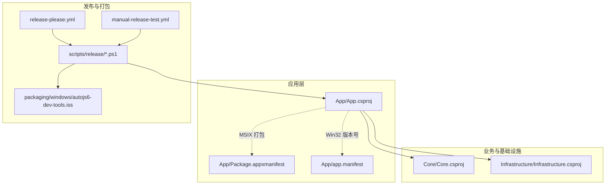
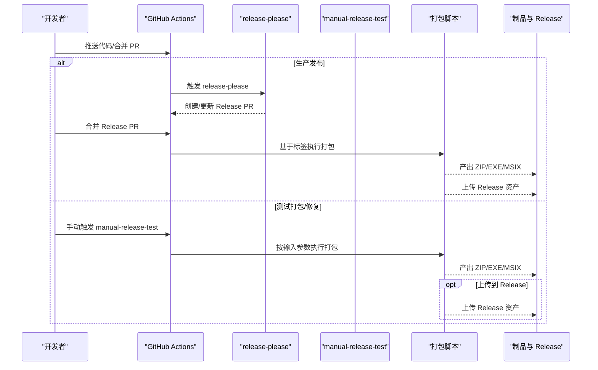
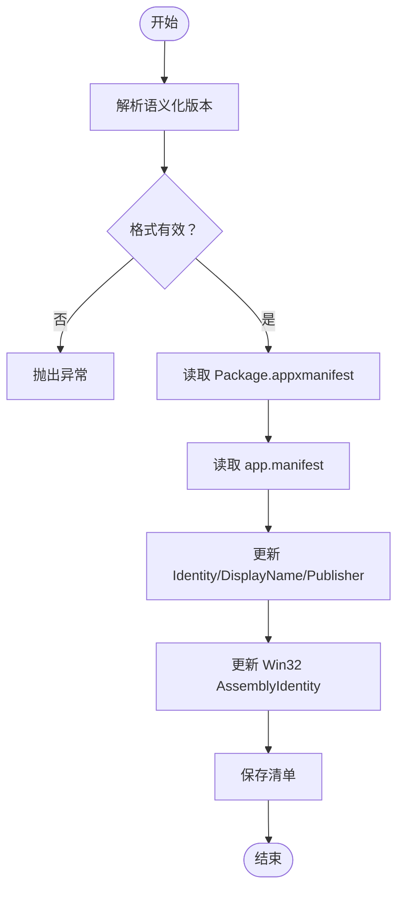
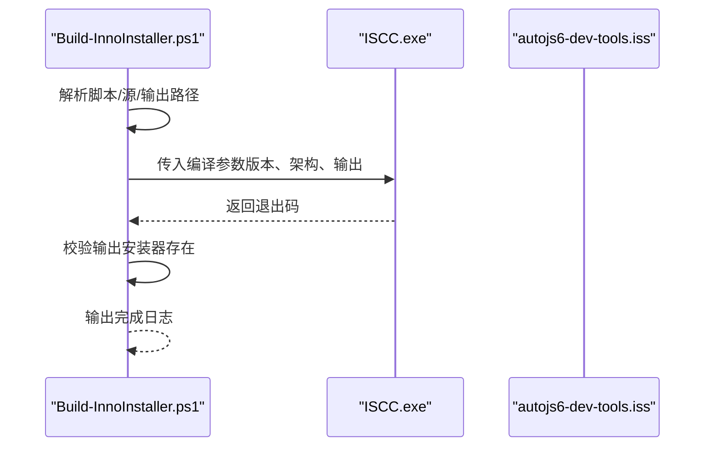
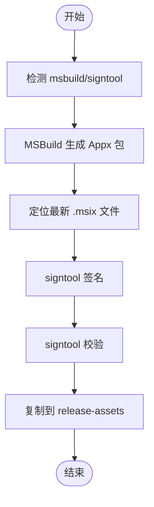
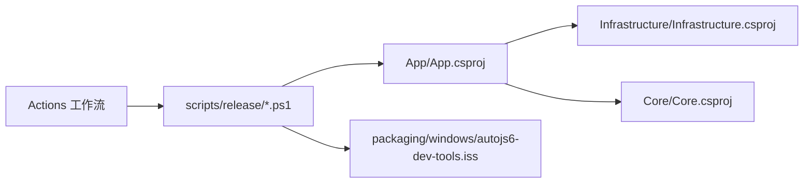

# 部署与发布流程

<cite>
**本文引用的文件**
- [.github/workflows/release-please.yml](file://.github/workflows/release-please.yml)
- [.github/workflows/manual-release-test.yml](file://.github/workflows/manual-release-test.yml)
- [release-please-config.json](file://release-please-config.json)
- [.release-please-manifest.json](file://.release-please-manifest.json)
- [packaging/windows/autojs6-dev-tools.iss](file://packaging/windows/autojs6-dev-tools.iss)
- [scripts/release/Set-AppReleaseMetadata.ps1](file://scripts/release/Set-AppReleaseMetadata.ps1)
- [scripts/release/Build-PortablePackage.ps1](file://scripts/release/Build-PortablePackage.ps1)
- [scripts/release/Build-InnoInstaller.ps1](file://scripts/release/Build-InnoInstaller.ps1)
- [scripts/release/Build-MsixPackage.ps1](file://scripts/release/Build-MsixPackage.ps1)
- [App/App.csproj](file://App/App.csproj)
- [App/Package.appxmanifest](file://App/Package.appxmanifest)
- [App/app.manifest](file://App/app.manifest)
- [DEVELOPMENT.md](file://DEVELOPMENT.md)
- [README.md](file://README.md)
</cite>

## 更新摘要
**所做更改**
- 增强了 manual-release-test 工作流的 source_ref 参数描述，提供了更清晰的使用指导
- 新增了 source_ref 参数的三种使用场景说明：dev（开发验证）、main（发布候选验证）、生产标签（修复现有发布）
- 更新了相关的工作流配置和使用指南

## 目录
1. [简介](#简介)
2. [项目结构](#项目结构)
3. [核心组件](#核心组件)
4. [架构总览](#架构总览)
5. [详细组件分析](#详细组件分析)
6. [依赖关系分析](#依赖关系分析)
7. [性能考量](#性能考量)
8. [故障排除指南](#故障排除指南)
9. [结论](#结论)
10. [附录](#附录)

## 简介
本文件面向 AutoJS6 开发工具的维护者与贡献者，系统性阐述项目的部署与发布流程，明确三类发布路径的差异与适用场景，并深入解析 GitHub Actions 工作流的配置与参数，提供本地打包验证的完整步骤，说明多平台支持（x86/x64/ARM64）的实现方式，以及版本管理与发布策略。同时给出常见问题的诊断与修复建议，帮助团队在 CI/CD 与本地环境中高效、稳定地交付产品。

**更新** 本版本反映了 manual-release-test 工作流中 source_ref 参数的增强描述，提供了更清晰的使用指导和场景说明。

## 项目结构
项目采用分层与多工程组织方式，核心应用为 WinUI 3 桌面应用，配合纯业务逻辑层与基础设施适配层；发布侧通过 GitHub Actions 自动化执行，脚本位于 scripts/release 下，Windows 安装包模板位于 packaging/windows。

**图表来源**
- [App/App.csproj:1-84](file://App/App.csproj#L1-L84)
- [.github/workflows/release-please.yml:1-207](file://.github/workflows/release-please.yml#L1-L207)
- [.github/workflows/manual-release-test.yml:1-253](file://.github/workflows/manual-release-test.yml#L1-L253)
- [packaging/windows/autojs6-dev-tools.iss:1-75](file://packaging/windows/autojs6-dev-tools.iss#L1-L75)

**章节来源**
- [README.md:230-261](file://README.md#L230-L261)
- [App/App.csproj:1-84](file://App/App.csproj#L1-L84)

## 核心组件
- 发布工作流
  - release-please：基于配置自动创建/更新发布 PR 并在创建标签后触发打包与上传。
  - manual-release-test：手动触发的测试/修复打包流程，支持选择源分支/标签、指定版本、是否上传到 Release。
- 发布元数据与清单
  - release-please-config.json：定义发布类型、变更日志路径等。
  - .release-please-manifest.json：根包版本清单。
- 打包脚本
  - Set-AppReleaseMetadata.ps1：写入应用清单中的产品名、包身份、发布者、版本等。
  - Build-PortablePackage.ps1：生成便携 ZIP（win-x64/win-arm64）。
  - Build-InnoInstaller.ps1：生成 EXE 安装器（win-x64/win-arm64），支持架构参数。
  - Build-MsixPackage.ps1：生成 MSIX 包并签名验证。
- Windows 安装脚本
  - autojs6-dev-tools.iss：Inno Setup 脚本模板，包含应用信息、输出命名、架构参数等。
- 应用清单
  - Package.appxmanifest：MSIX 包身份、显示名、最小/最大目标版本、能力等。
  - app.manifest：Win32 应用兼容性与 DPI 设置等。

**章节来源**
- [.github/workflows/release-please.yml:13-207](file://.github/workflows/release-please.yml#L13-L207)
- [.github/workflows/manual-release-test.yml:37-253](file://.github/workflows/manual-release-test.yml#L37-L253)
- [release-please-config.json:1-11](file://release-please-config.json#L1-L11)
- [.release-please-manifest.json:1-4](file://.release-please-manifest.json#L1-L4)
- [scripts/release/Set-AppReleaseMetadata.ps1:1-85](file://scripts/release/Set-AppReleaseMetadata.ps1#L1-L85)
- [scripts/release/Build-PortablePackage.ps1:1-58](file://scripts/release/Build-PortablePackage.ps1#L1-L58)
- [scripts/release/Build-InnoInstaller.ps1:1-121](file://scripts/release/Build-InnoInstaller.ps1#L1-L121)
- [scripts/release/Build-MsixPackage.ps1:1-201](file://scripts/release/Build-MsixPackage.ps1#L1-L201)
- [packaging/windows/autojs6-dev-tools.iss:1-75](file://packaging/windows/autojs6-dev-tools.iss#L1-L75)
- [App/Package.appxmanifest:1-54](file://App/Package.appxmanifest#L1-L54)
- [App/app.manifest:1-20](file://App/app.manifest#L1-L20)

## 架构总览
下图展示从代码提交到产物发布的端到端流程，涵盖两条路径：常规开发、测试打包/修复、生产发布。

**图表来源**
- [.github/workflows/release-please.yml:13-207](file://.github/workflows/release-please.yml#L13-L207)
- [.github/workflows/manual-release-test.yml:37-253](file://.github/workflows/manual-release-test.yml#L37-L253)

## 详细组件分析

### 发布路径与适用场景
- 常规开发
  - 特点：不自动构建完整发布包，避免浪费资源与产生低价值构建。
  - 适用：日常功能开发与小步提交。
- 测试打包/修复
  - 特点：按需手动触发，可选择从 main 或已有标签构建，可仅本地验证或上传到 Release。
  - 适用：需要验证打包可用性、修复现有 Release 缺失资产。
- 生产发布
  - 特点：由 release-please 在创建/更新标签后自动触发打包与上传，确保版本稳定。
  - 适用：确认可用后正式对外发布。

**章节来源**
- [DEVELOPMENT.md:5-16](file://DEVELOPMENT.md#L5-L16)
- [DEVELOPMENT.md:64-132](file://DEVELOPMENT.md#L64-L132)
- [DEVELOPMENT.md:135-162](file://DEVELOPMENT.md#L135-L162)

### GitHub Actions 工作流配置与参数

#### release-please 工作流
- 触发条件：推送到 main 分支。
- 安全配置更新：使用 secrets.GH_TOKEN 替代传统的 secrets.GITHUB_TOKEN，提升安全性。
- 关键步骤：
  - 校验 release-please 配置与清单版本格式。
  - 使用 release-please-action 创建/更新 Release PR。
  - 切换到标签引用，恢复项目，安装 Inno Setup。
  - 应用发布元数据（产品名、包身份、发布者、版本）。
  - 生成代码签名证书。
  - 分别为 win-x64 与 win-arm64 生成便携 ZIP。
  - 分别为 win-x64 与 win-arm64 生成 EXE 安装器（Inno Setup）。
  - 分别为 win-x64 与 win-arm64 生成并签名 MSIX 包。
  - 准备支持文件（安装说明、证书、SHA256SUMS）。
  - 上传制品到对应 Release 标签。

**章节来源**
- [.github/workflows/release-please.yml:1-207](file://.github/workflows/release-please.yml#L1-L207)
- [release-please-config.json:1-11](file://release-please-config.json#L1-L11)
- [.release-please-manifest.json:1-4](file://.release-please-manifest.json#L1-L4)

#### manual-release-test 工作流
- 触发方式：workflow_dispatch，支持以下输入：
  - source_ref：构建来源（main 或标签）。**增强描述**：支持三种场景
    - dev：当前开发验证（用于验证开发中的功能）
    - main：发布候选验证（用于验证即将发布的版本）
    - 生产标签：修复现有发布（用于修复已发布版本的缺失资产）
  - version：版本号（语义化 x.y.z）。
  - publish_to_release：是否上传到 GitHub Release。
  - release_tag：目标 Release 标签（为空则生成测试标签）。
  - release_name：Release 标题（为空则生成默认标题）。
  - prerelease：新建 Release 时标记为预发布。
- 安全配置更新：同样使用 secrets.GH_TOKEN 进行安全令牌传递。
- 关键步骤：
  - 解析并校验版本格式。
  - 检出指定源引用。
  - 应用发布元数据与生成签名证书。
  - 构建便携 ZIP（win-x64/win-arm64）、EXE 安装器（win-x64/win-arm64）、MSIX（win-x64/win-arm64）。
  - 生成支持文件与 SHA256SUMS。
  - 将制品作为 Actions 资产下载，或上传到指定 Release。

**章节来源**
- [.github/workflows/manual-release-test.yml:1-253](file://.github/workflows/manual-release-test.yml#L1-L253)

### 多平台支持（x86/x64/ARM64）
- 应用项目配置
  - App.csproj 中定义了多平台与运行时标识符，支持 AnyCPU、x86、x64、ARM64，并在无显式指定时默认 win-x64。
  - **增强**：完善了 AnyCPU 平台的处理逻辑，确保在未指定平台时自动解析为 win-x64。
- 打包脚本参数
  - Build-PortablePackage.ps1 与 Build-InnoInstaller.ps1 明确传入 RuntimeIdentifier（win-x64/win-arm64）。
  - Build-MsixPackage.ps1 明确传入 Platform（x64/ARM64）与 RuntimeIdentifier（win-x64/win-arm64）。
- Inno Setup 模板
  - autojs6-dev-tools.iss 支持通过编译参数设置 ArchitecturesAllowed 与 ArchitecturesInstallIn64BitMode，分别针对 x64 兼容与 ARM64。

**章节来源**
- [App/App.csproj:11-19](file://App/App.csproj#L11-L19)
- [scripts/release/Build-PortablePackage.ps1:2-16](file://scripts/release/Build-PortablePackage.ps1#L2-L16)
- [scripts/release/Build-InnoInstaller.ps1:2-29](file://scripts/release/Build-InnoInstaller.ps1#L2-L29)
- [scripts/release/Build-MsixPackage.ps1:2-23](file://scripts/release/Build-MsixPackage.ps1#L2-L23)
- [packaging/windows/autojs6-dev-tools.iss:28-33](file://packaging/windows/autojs6-dev-tools.iss#L28-L33)

### 版本管理与发布策略
- 语义化版本
  - 工作流与脚本均要求版本格式为 x.y.z，且会将语义版本转换为四段制用于 Win32 清单与 MSIX 清单。
- 发布历史维护
  - release-please-config.json 指定 changelog 路径，便于维护发布历史。
- 版本来源
  - .release-please-manifest.json 提供根包当前版本，release-please 基于此创建/更新 Release。

**章节来源**
- [.github/workflows/release-please.yml:26-41](file://.github/workflows/release-please.yml#L26-L41)
- [.github/workflows/manual-release-test.yml:47-65](file://.github/workflows/manual-release-test.yml#L47-L65)
- [scripts/release/Set-AppReleaseMetadata.ps1:16-35](file://scripts/release/Set-AppReleaseMetadata.ps1#L16-L35)
- [release-please-config.json:4-8](file://release-please-config.json#L4-L8)
- [.release-please-manifest.json:1-4](file://.release-please-manifest.json#L1-L4)

### 本地打包验证流程（ZIP/EXE/MSIX）
- 前置条件
  - .NET 8 SDK、MSBuild + SignTool（VS 2022/2026 或 Build Tools + Windows SDK）、Inno Setup 6（ISCC.exe）。
- 推荐顺序
  - 还原并构建解决方案（Release）。
  - 运行单元测试（Release）。
  - 生成 win-x64 与 win-arm64 便携 ZIP。
  - 对 win-x64 便携 EXE 进行冒烟测试。
  - 生成 win-x64 与 win-arm64 EXE 安装器。
  - 生成 win-x64 与 win-arm64 MSIX 包。
  - 校验 release-assets 内文件版本、发布者、SHA256 摘要列表。

**章节来源**
- [DEVELOPMENT.md:35-61](file://DEVELOPMENT.md#L35-L61)
- [README.md:112-124](file://README.md#L112-L124)

### 打包脚本与流程详解

#### 应用发布元数据注入
- 功能：修改 Package.appxmanifest 与 app.manifest 的 Identity 与显示信息，统一版本格式。
- 关键点：将 x.y.z 转换为 x.y.z.0 写入清单。

**图表来源**
- [scripts/release/Set-AppReleaseMetadata.ps1:16-85](file://scripts/release/Set-AppReleaseMetadata.ps1#L16-L85)
- [App/Package.appxmanifest:11-22](file://App/Package.appxmanifest#L11-L22)
- [App/app.manifest:2-3](file://App/app.manifest#L2-L3)

**章节来源**
- [scripts/release/Set-AppReleaseMetadata.ps1:1-85](file://scripts/release/Set-AppReleaseMetadata.ps1#L1-L85)

#### 便携 ZIP 生成
- 功能：dotnet publish（自包含）后压缩为 zip，输出命名为 autojs6-dev-tools-{rid}-portable.zip。
- 关键点：校验目标可执行文件存在，避免空包。

**图表来源**
- [scripts/release/Build-PortablePackage.ps1:29-58](file://scripts/release/Build-PortablePackage.ps1#L29-L58)

**章节来源**
- [scripts/release/Build-PortablePackage.ps1:1-58](file://scripts/release/Build-PortablePackage.ps1#L1-L58)

#### EXE 安装器生成
- 功能：调用 ISCC.exe 编译 Inno Setup 脚本，输出 autojs6-dev-tools-{rid}-setup.exe。
- 关键点：自动检测 ISCC.exe，支持通过参数覆盖架构允许与安装模式。

**图表来源**
- [scripts/release/Build-InnoInstaller.ps1:52-121](file://scripts/release/Build-InnoInstaller.ps1#L52-L121)
- [packaging/windows/autojs6-dev-tools.iss:35-75](file://packaging/windows/autojs6-dev-tools.iss#L35-L75)

**章节来源**
- [scripts/release/Build-InnoInstaller.ps1:1-121](file://scripts/release/Build-InnoInstaller.ps1#L1-L121)

#### MSIX 包生成与签名
- 功能：MSBuild 构建 Appx 包，签名并校验，复制到 release-assets。
- 关键点：自动发现 msbuild/dotnet 与 signtool，证书 Subject 必须与 Package.appxmanifest Publisher 一致。

**图表来源**
- [scripts/release/Build-MsixPackage.ps1:46-201](file://scripts/release/Build-MsixPackage.ps1#L46-L201)
- [App/Package.appxmanifest:11-14](file://App/Package.appxmanifest#L11-L14)

**章节来源**
- [scripts/release/Build-MsixPackage.ps1:1-201](file://scripts/release/Build-MsixPackage.ps1#L1-L201)

## 依赖关系分析
- 组件耦合
  - 应用层（App）依赖基础设施（Infrastructure）与核心（Core），打包脚本依赖应用项目与安装模板。
  - release-please 与 manual-release-test 通过环境变量与参数驱动脚本，形成松耦合。
- 外部依赖
  - .NET 8 SDK、MSBuild、SignTool、Inno Setup 6、Windows App SDK。
- 可能的循环依赖
  - 项目采用单向依赖（App → Infrastructure → Core），打包脚本不反向依赖应用，避免循环。

**图表来源**
- [App/App.csproj:66-68](file://App/App.csproj#L66-L68)
- [.github/workflows/release-please.yml:13-207](file://.github/workflows/release-please.yml#L13-L207)
- [.github/workflows/manual-release-test.yml:37-253](file://.github/workflows/manual-release-test.yml#L37-L253)

**章节来源**
- [App/App.csproj:1-84](file://App/App.csproj#L1-L84)
- [scripts/release/Build-MsixPackage.ps1:46-100](file://scripts/release/Build-MsixPackage.ps1#L46-L100)

## 性能考量
- 构建成本
  - 完整打包（ZIP/EXE/MSIX）耗时较长，常规开发阶段应避免自动全量打包。
- 产物优先级
  - 对最终用户而言，EXE 与 ZIP 最常用；MSIX 需要信任证书，优先级较低。
- 本地先行
  - 建议先在本地完成冒烟验证，再上 CI，减少无效资源消耗。

**章节来源**
- [DEVELOPMENT.md:164-179](file://DEVELOPMENT.md#L164-L179)
- [DEVELOPMENT.md:47-61](file://DEVELOPMENT.md#L47-L61)

## 故障排除指南
- 测试打包失败
  - 优先检查代码、打包脚本与工作流配置问题，待测试打包通过后再进行生产发布。
- 生产 Release 缺失文件
  - 使用 manual-release-test 重新从同一生产标签构建并回传缺失资产，避免重复发版。
- 生产包不可用
  - 在 main 上修复问题并发布下一个补丁版本，避免重写已发布标签。
- 本地 dotnet build 失败
  - 检查默认 Release 配置（避免 Trim/ReadyToRun）、确保 MSBuild 解析到具体平台而非 AnyCPU。
- 本地 MSIX 构建失败（证书/签名）
  - 确认证书 Subject 与 Package.appxmanifest Publisher 一致，确保 signtool 可用并正确导入本地信任链。
- 本地 EXE 安装器构建失败
  - 确认 ISCC.exe 存在、源发布目录包含应用文件、输出路径可写。

**章节来源**
- [DEVELOPMENT.md:182-250](file://DEVELOPMENT.md#L182-L250)

## 结论
通过三条发布路径与自动化工作流，项目实现了"轻开发、重验证、稳发布"的最佳实践：常规开发不浪费资源，测试打包/修复可快速回溯与修复，生产发布由 release-please 确保版本稳定与历史清晰。结合本地验证与严格的多平台打包策略，团队可以高效、可靠地交付 AutoJS6 开发工具。

**更新** 本版本的 source_ref 参数增强描述进一步明确了 manual-release-test 工作流的使用场景，为不同阶段的发布需求提供了更清晰的指导。

## 附录

### 工作流触发与参数速查
- release-please
  - 触发：推送 main。
  - 行为：创建/更新 Release PR，随后基于标签执行打包与上传。
  - **安全配置**：使用 secrets.GH_TOKEN 进行令牌管理。
- manual-release-test
  - 触发：workflow_dispatch。
  - 关键输入：source_ref、version、publish_to_release、release_tag、release_name、prerelease。
  - **安全配置**：同样使用 secrets.GH_TOKEN 进行安全令牌传递。
  - **source_ref 使用场景**：
    - dev：当前开发验证（验证开发中的功能）
    - main：发布候选验证（验证即将发布的版本）
    - 生产标签：修复现有发布（修复已发布版本的缺失资产）

### GitHub Actions 安全配置说明
- **令牌命名分离**：工作流中使用 secrets.GH_TOKEN 作为值来源，但下游工具仍识别为 GITHUB_TOKEN 环境变量。
- **接口契约优先**：遵循"先理解接口契约，再考虑内部命名"的原则，避免不必要的接口名称变更。
- **官方文档支持**：GitHub CLI 环境文档明确支持 GH_TOKEN 和 GITHUB_TOKEN 环境变量。

**章节来源**
- [.github/workflows/release-please.yml:3-7](file://.github/workflows/release-please.yml#L3-L7)
- [.github/workflows/manual-release-test.yml:3-33](file://.github/workflows/manual-release-test.yml#L3-L33)
- [DEVELOPMENT.md:53-115](file://DEVELOPMENT.md#L53-L115)