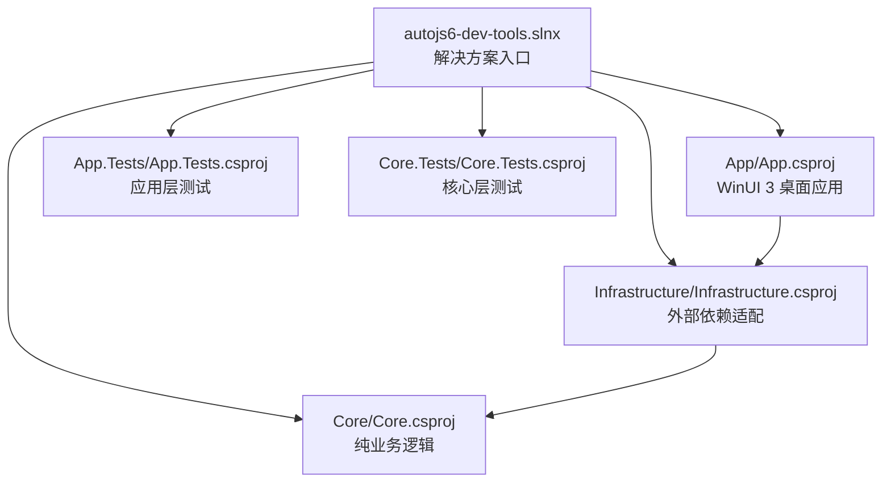
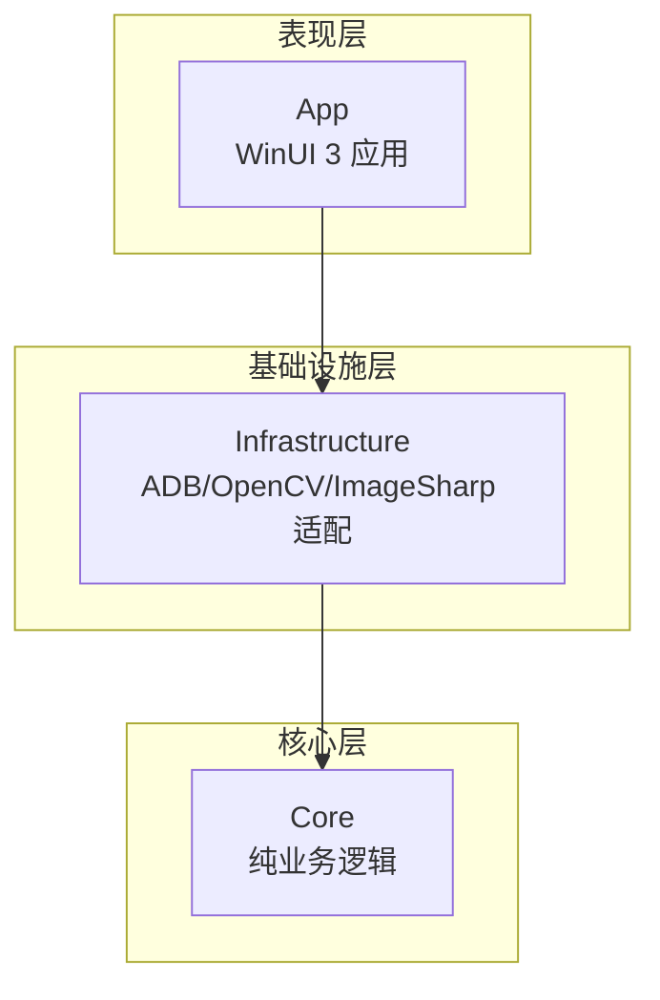
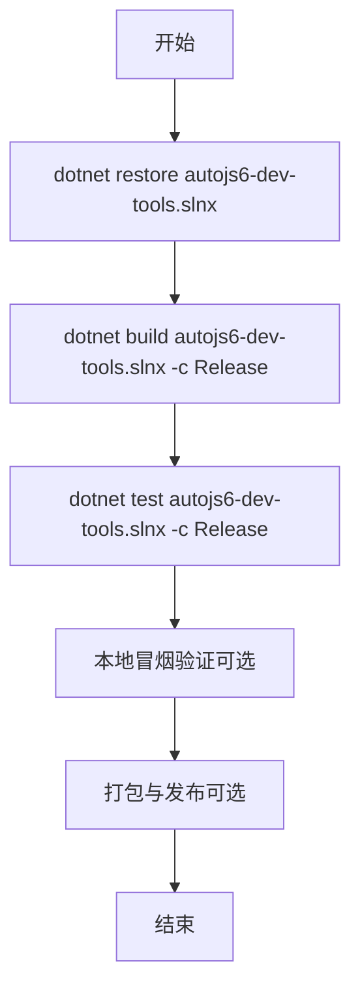
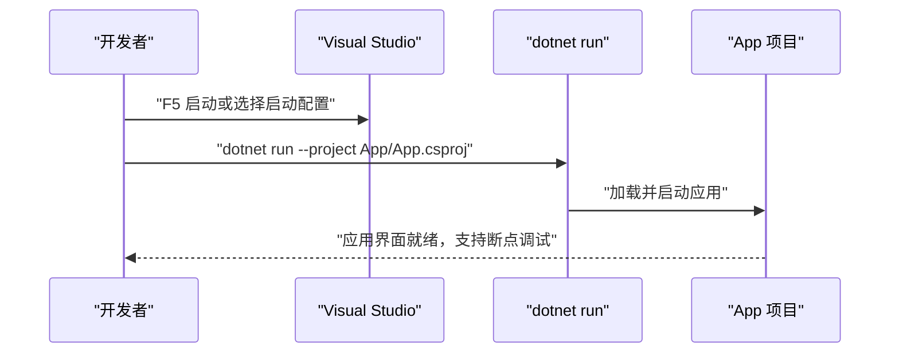
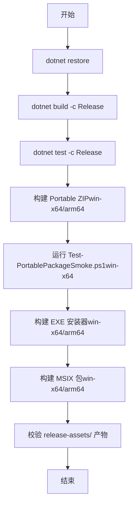
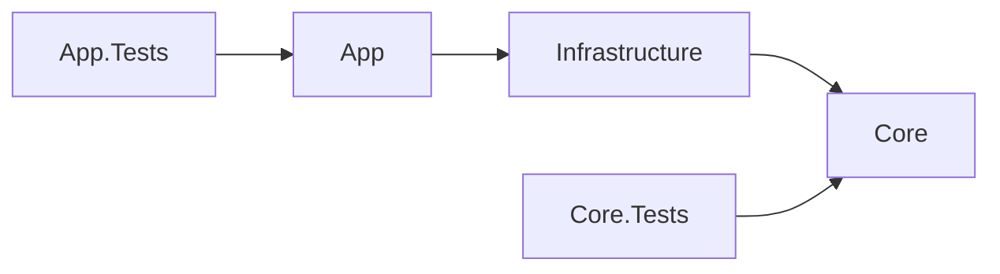

# 项目构建与运行

<cite>
**本文引用的文件**
- [README.md](file://README.md)
- [DEVELOPMENT.md](file://DEVELOPMENT.md)
- [autojs6-dev-tools.slnx](file://autojs6-dev-tools.slnx)
- [App/App.csproj](file://App/App.csproj)
- [App/Properties/launchSettings.json](file://App/Properties/launchSettings.json)
- [App/Package.appxmanifest](file://App/Package.appxmanifest)
- [App/app.manifest](file://App/app.manifest)
- [App/MainWindow.xaml.cs](file://App/MainWindow.xaml.cs)
- [App.Tests/App.Tests.csproj](file://App.Tests/App.Tests.csproj)
- [App.Tests/UnitTests.cs](file://App.Tests/UnitTests.cs)
- [Core/Core.csproj](file://Core/Core.csproj)
- [Infrastructure/Infrastructure.csproj](file://Infrastructure/Infrastructure.csproj)
- [packaging/windows/autojs6-dev-tools.iss](file://packaging/windows/autojs6-dev-tools.iss)
- [scripts/release/Test-PortablePackageSmoke.ps1](file://scripts/release/Test-PortablePackageSmoke.ps1)
</cite>

## 目录
1. [简介](#简介)
2. [项目结构](#项目结构)
3. [核心组件](#核心组件)
4. [架构总览](#架构总览)
5. [详细组件分析](#详细组件分析)
6. [应用程序图标配置](#应用程序图标配置)
7. [依赖关系分析](#依赖关系分析)
8. [性能考虑](#性能考虑)
9. [故障排查指南](#故障排查指南)
10. [结论](#结论)
11. [附录](#附录)

## 简介
本指南面向 AutoJS6 开发工具项目的开发者与维护者，系统讲解从依赖还原、构建到测试与本地验证的完整流程。内容覆盖：
- dotnet restore、dotnet build、dotnet test 的执行顺序与常用参数
- Debug 与 Release 构建配置的差异与适用场景
- 应用启动与调试步骤（含启动参数与断点设置）
- 本地验证序列（含 Portable Package 冒烟测试）与结果分析
- 构建产物正确性与完整性校验（可执行文件、依赖项、配置文件）
- **新增** 应用程序图标配置与相关构建设置说明

## 项目结构
项目采用多项目解决方案组织，包含应用层、核心业务层与基础设施层，以及对应的单元测试与打包脚本。



**图表来源**
- [autojs6-dev-tools.slnx:1-30](file://autojs6-dev-tools.slnx#L1-L30)
- [App/App.csproj:1-84](file://App/App.csproj#L1-L84)
- [Core/Core.csproj:1-10](file://Core/Core.csproj#L1-L10)
- [Infrastructure/Infrastructure.csproj:1-19](file://Infrastructure/Infrastructure.csproj#L1-L19)
- [App.Tests/App.Tests.csproj:1-17](file://App.Tests/App.Tests.csproj#L1-L17)
- [Core.Tests/Core.Tests.csproj](file://Core.Tests/Core.Tests.csproj)

**章节来源**
- [README.md:230-260](file://README.md#L230-L260)
- [autojs6-dev-tools.slnx:1-30](file://autojs6-dev-tools.slnx#L1-L30)

## 核心组件
- 应用层（App）：基于 WinUI 3 的桌面应用，负责 UI 与 MVVM 层，引用基础设施层。
- 基础设施层（Infrastructure）：封装外部依赖（ADB、OpenCV、ImageSharp），并依赖核心层。
- 核心层（Core）：纯业务逻辑，不包含 UI 依赖，独立可测试。
- 测试层：App.Tests 与 Core.Tests 使用 MSTest 进行单元测试。

**章节来源**
- [README.md:242-251](file://README.md#L242-L251)
- [App/App.csproj:66-68](file://App/App.csproj#L66-L68)
- [Infrastructure/Infrastructure.csproj:9-11](file://Infrastructure/Infrastructure.csproj#L9-L11)

## 架构总览
项目遵循分层与解耦原则，数据流自下而上，职责清晰：



**图表来源**
- [README.md:272-286](file://README.md#L272-L286)
- [App/App.csproj:66-68](file://App/App.csproj#L66-L68)
- [Infrastructure/Infrastructure.csproj:9-11](file://Infrastructure/Infrastructure.csproj#L9-L11)

## 详细组件分析

### 构建与测试流程
- 依赖还原：使用 dotnet restore 对解决方案进行包还原。
- 构建：使用 dotnet build 针对解决方案进行构建；推荐在 Release 配置下进行打包前验证。
- 测试：使用 dotnet test 针对解决方案运行测试；建议在 Release 配置下进行打包前质量门禁。



**图表来源**
- [DEVELOPMENT.md:51-58](file://DEVELOPMENT.md#L51-L58)
- [README.md:151-160](file://README.md#L151-L160)

**章节来源**
- [README.md:132-160](file://README.md#L132-L160)
- [DEVELOPMENT.md:47-61](file://DEVELOPMENT.md#L47-L61)

### Debug 与 Release 配置差异与适用场景
- Debug：适合日常开发与快速迭代，编译速度快，便于调试。
- Release：用于打包与发布前的质量门禁，包含完整的优化与测试，确保产物稳定性与性能。

**章节来源**
- [DEVELOPMENT.md:328-339](file://DEVELOPMENT.md#L328-L339)

### 应用启动与调试
- 在命令行中启动应用：
  - 使用 dotnet run 指定项目路径启动应用。
  - 或在 Visual Studio 中打开解决方案后按 F5 启动。
- 启动配置：
  - 可通过 launchSettings.json 中的 profiles 选择"App"、"App (Unpackaged)"或"App (Package)"等启动方式。
- 断点设置：
  - 在 App、Infrastructure、Core 任一层设置断点均可，便于定位问题。



**图表来源**
- [README.md:158-162](file://README.md#L158-L162)
- [App/Properties/launchSettings.json:1-14](file://App/Properties/launchSettings.json#L1-L14)

**章节来源**
- [README.md:149-162](file://README.md#L149-L162)
- [App/Properties/launchSettings.json:1-14](file://App/Properties/launchSettings.json#L1-L14)

### 本地验证序列（含 Portable Package 冒烟测试）
- 推荐顺序：
  1) dotnet restore
  2) dotnet build -c Release
  3) dotnet test -c Release
  4) 构建 win-x64 与 win-arm64 可移植 ZIP 包
  5) 使用 Test-PortablePackageSmoke.ps1 对 win-x64 可移植 EXE 执行冒烟测试
  6) 构建 win-x64 与 win-arm64 EXE 安装器
  7) 构建 win-x64 与 win-arm64 MSIX 包
  8) 校验 release-assets/ 文件清单与版本信息



**图表来源**
- [DEVELOPMENT.md:47-61](file://DEVELOPMENT.md#L47-L61)
- [scripts/release/Test-PortablePackageSmoke.ps1:1-38](file://scripts/release/Test-PortablePackageSmoke.ps1#L1-L38)

**章节来源**
- [DEVELOPMENT.md:47-61](file://DEVELOPMENT.md#L47-L61)
- [scripts/release/Test-PortablePackageSmoke.ps1:1-38](file://scripts/release/Test-PortablePackageSmoke.ps1#L1-L38)

### 构建产物正确性与完整性校验
- 可执行文件与程序集：
  - App 层输出：确认 App/bin 下存在 autojs6-dev-tools.exe 与 autojs6-dev-tools.dll 等。
  - 关键 XAML 控件：测试用例会校验 MainPage.xaml 中的关键控件名称是否存在。
- 依赖项与配置：
  - App.csproj 中声明的包引用与项目引用需在输出中可用。
  - Inno Setup 脚本定义了安装器的产物目录、图标与版本信息。
- 验证方法：
  - 使用 App.Tests 的单元测试对构建产物与契约进行验证。
  - 使用 Test-PortablePackageSmoke.ps1 对可移植 EXE 启动进行冒烟测试。

**章节来源**
- [App.Tests/UnitTests.cs:10-40](file://App.Tests/UnitTests.cs#L10-L40)
- [App/App.csproj:60-68](file://App/App.csproj#L60-L68)
- [packaging/windows/autojs6-dev-tools.iss:1-75](file://packaging/windows/autojs6-dev-tools.iss#L1-L75)

## 应用程序图标配置

### 图标文件结构
项目包含完整的图标资源配置，涵盖多种尺寸和用途：

- 主应用程序图标：Assets/AppIcon.ico
- 应用商店图标：Assets/StoreLogo.png
- 启动画面：Assets/SplashScreen.scale-200.png
- 磁贴图标：Assets/Square150x150Logo.scale-200.png
- 小图标：Assets/Square44x44Logo.scale-200.png
- 替代小图标：Assets/Square44x44Logo.targetsize-24_altform-unplated.png
- 广告磁贴：Assets/Wide310x150Logo.scale-200.png
- 锁屏图标：Assets/LockScreenLogo.scale-200.png

### 构建配置
应用程序图标通过以下配置进行管理：

#### MSBuild 项目配置
在 App.csproj 中，图标文件通过 Content 元素进行声明：

```xml
<ItemGroup>
    <Content Include="Assets\AppIcon.ico">
      <CopyToOutputDirectory>PreserveNewest</CopyToOutputDirectory>
    </Content>
    <!-- 其他图标文件配置 -->
</ItemGroup>
```

#### 应用程序清单配置
Package.appxmanifest 中定义了应用的视觉元素：

```xml
<uap:VisualElements
    DisplayName="AutoJS6 Visual Development Toolkit"
    Description="AutoJS6 image matching, widget inspection, and code generation workbench"
    BackgroundColor="transparent"
    Square150x150Logo="Assets\Square150x150Logo.png"
    Square44x44Logo="Assets\Square44x44Logo.png">
    <uap:DefaultTile Wide310x150Logo="Assets\Wide310x150Logo.png" />
    <uap:SplashScreen Image="Assets\SplashScreen.png" />
</uap:VisualElements>
```

#### 运行时图标设置
MainWindow.xaml.cs 中实现了动态图标设置：

```csharp
private void SetWindowIcon()
{
    IntPtr hWnd = WinRT.Interop.WindowNative.GetWindowHandle(this);
    WindowId windowId = Microsoft.UI.Win32Interop.GetWindowIdFromWindow(hWnd);
    AppWindow appWindow = AppWindow.GetFromWindowId(windowId);
    var iconPath = Path.Combine(AppContext.BaseDirectory, "Assets", "AppIcon.ico");
    
    if (appWindow != null && File.Exists(iconPath))
    {
        appWindow.SetIcon(iconPath);
    }
}
```

### 图标构建流程
1. **图标准备**：将各种尺寸的图标文件放置在 Assets 目录下
2. **项目引用**：通过 App.csproj 的 Content 元素声明图标文件
3. **清单配置**：在 Package.appxmanifest 中定义应用的视觉元素
4. **运行时设置**：MainWindow 初始化时自动设置窗口图标
5. **构建输出**：图标文件随应用程序一起打包和部署

### 图标验证方法
- 构建后检查输出目录是否包含图标文件
- 启动应用验证任务栏和窗口图标显示
- 验证应用商店包中的图标显示效果
- 检查不同 DPI 设置下的图标清晰度

**章节来源**
- [App/App.csproj:35-49](file://App/App.csproj#L35-L49)
- [App/Package.appxmanifest:37-45](file://App/Package.appxmanifest#L37-L45)
- [App/MainWindow.xaml.cs:38-49](file://App/MainWindow.xaml.cs#L38-L49)

## 依赖关系分析
- App 依赖 Infrastructure，Infrastructure 依赖 Core，形成单向依赖链。
- App 项目引用 Infrastructure.csproj；Infrastructure 项目引用 Core.csproj。
- 测试项目分别引用被测项目以进行单元测试。



**图表来源**
- [App/App.csproj:66-68](file://App/App.csproj#L66-L68)
- [Infrastructure/Infrastructure.csproj:9-11](file://Infrastructure/Infrastructure.csproj#L9-L11)
- [App.Tests/App.Tests.csproj:1-17](file://App.Tests/App.Tests.csproj#L1-L17)
- [Core.Tests/Core.Tests.csproj:1-21](file://Core.Tests/Core.Tests.csproj#L1-L21)

**章节来源**
- [README.md:272-286](file://README.md#L272-L286)

## 性能考虑
- 异步优先：所有 I/O 操作采用异步模型，避免阻塞 UI 线程。
- 渲染性能：Win2D 提供 GPU 加速渲染，建议在开发中关注帧率与资源回收。
- 构建优化：Release 配置下进行打包前验证，确保产物稳定与性能达标。
- **新增** 图标性能：合理使用图标尺寸和格式，避免过大的图标文件影响启动性能。

**章节来源**
- [README.md:282-286](file://README.md#L282-L286)

## 故障排查指南
- dotnet build -c Release 失败：
  - 检查平台目标与运行时标识，避免默认 AnyCPU 导致的解析问题。
  - 确认未启用不必要的裁剪或 ReadyToRun。
- MSIX 签名失败：
  - 确认证书主题与 appxmanifest 中的 Publisher 一致。
  - 确保 signtool.exe 可用且证书导入到当前用户信任存储。
- EXE 安装器失败：
  - 确认 ISCC.exe 存在，源发布目录包含构建产物，输出路径可写。
- 冒烟测试失败：
  - 检查可移植 EXE 是否能在指定时间内保持运行，必要时调整启动等待时间。
- **新增** 图标显示问题：
  - 确认 Assets/AppIcon.ico 文件存在于输出目录
  - 检查 MainWindow.xaml.cs 中的图标路径拼接是否正确
  - 验证 Package.appxmanifest 中的图标路径配置

**章节来源**
- [DEVELOPMENT.md:224-249](file://DEVELOPMENT.md#L224-L249)
- [scripts/release/Test-PortablePackageSmoke.ps1:24-32](file://scripts/release/Test-PortablePackageSmoke.ps1#L24-L32)

## 结论
通过遵循上述构建与运行流程，结合 Release 配置下的测试与本地验证序列，可以高效地完成从开发到发布的全链路工作。建议在日常开发中使用 Debug 快速迭代，在打包前使用 Release 进行质量门禁与冒烟测试，确保最终产物的稳定性与可用性。**新增的应用程序图标配置为应用提供了完整的视觉识别系统，包括运行时动态图标设置和多尺寸图标支持。**

## 附录
- 常用命令参考
  - 依赖还原：dotnet restore autojs6-dev-tools.slnx
  - 构建：dotnet build autojs6-dev-tools.slnx -c Release
  - 测试：dotnet test autojs6-dev-tools.slnx -c Release
  - 启动应用：dotnet run --project App/App.csproj
- 启动配置
  - 在 Visual Studio 中通过 launchSettings.json 的 profiles 选择启动方式。
- 打包与安装
  - 使用 Inno Setup 脚本构建 EXE 安装器，MSIX 由项目配置与工具链生成。
- **新增** 图标配置
  - 图标文件位于 Assets 目录，通过 App.csproj 进行项目引用
  - 运行时通过 MainWindow.xaml.cs 动态设置窗口图标
  - MSIX 包通过 Package.appxmanifest 定义应用视觉元素

**章节来源**
- [README.md:132-160](file://README.md#L132-L160)
- [App/Properties/launchSettings.json:1-14](file://App/Properties/launchSettings.json#L1-L14)
- [packaging/windows/autojs6-dev-tools.iss:1-75](file://packaging/windows/autojs6-dev-tools.iss#L1-L75)
- [App/App.csproj:35-49](file://App/App.csproj#L35-L49)
- [App/Package.appxmanifest:37-45](file://App/Package.appxmanifest#L37-L45)
- [App/MainWindow.xaml.cs:38-49](file://App/MainWindow.xaml.cs#L38-L49)