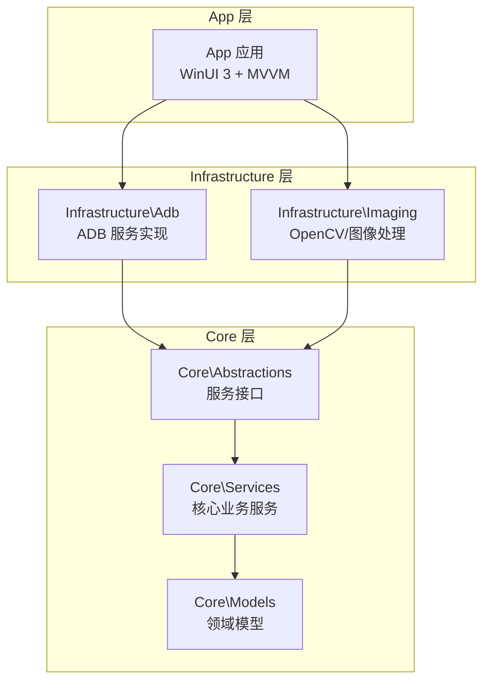
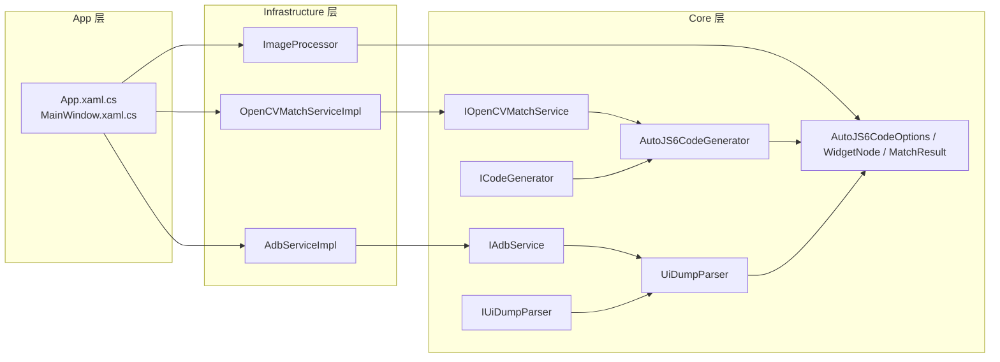
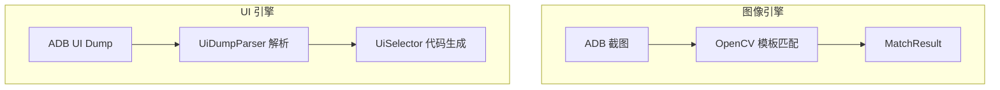
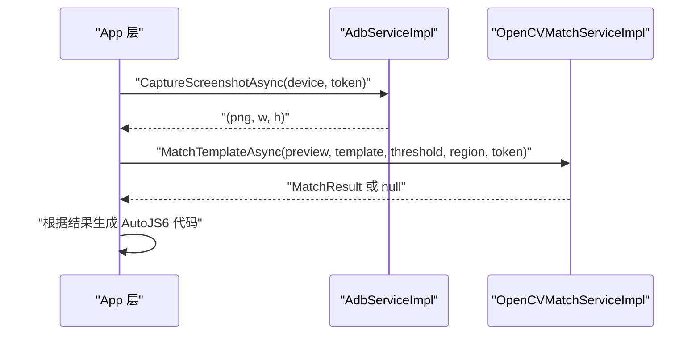
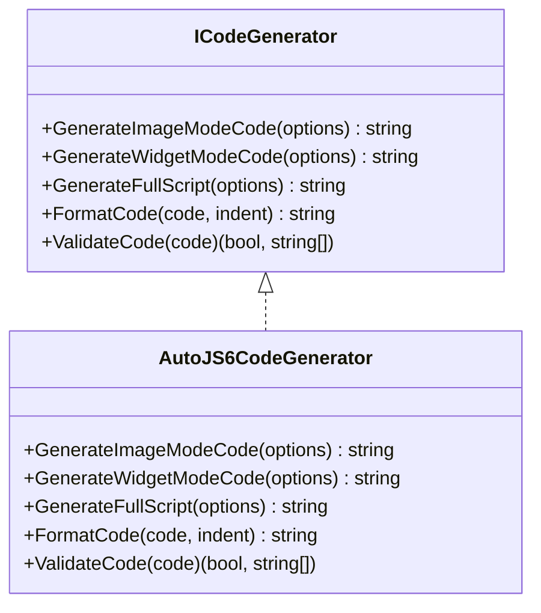
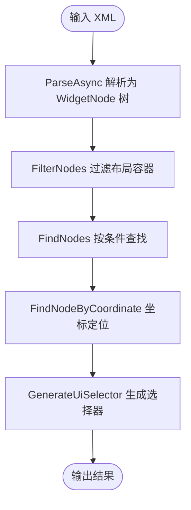
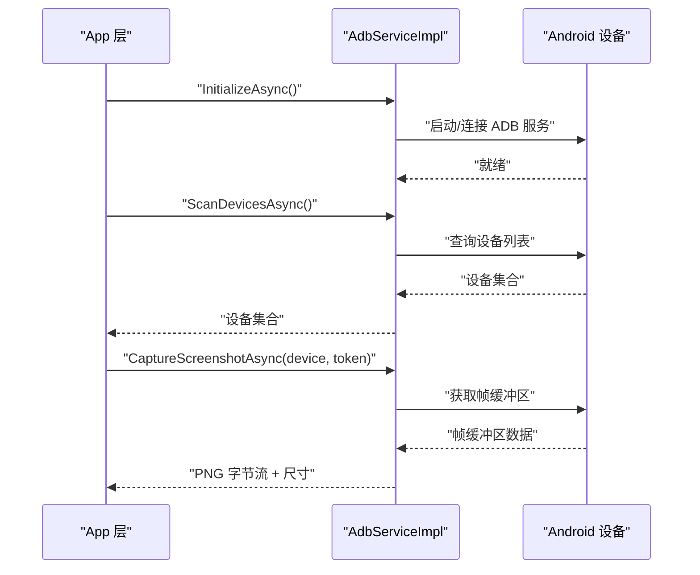
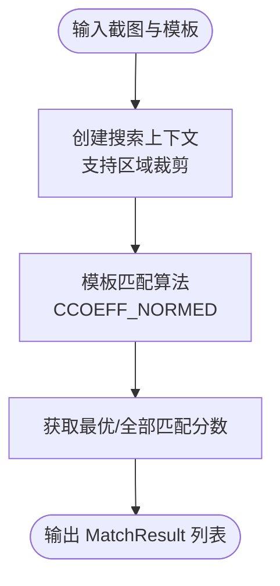
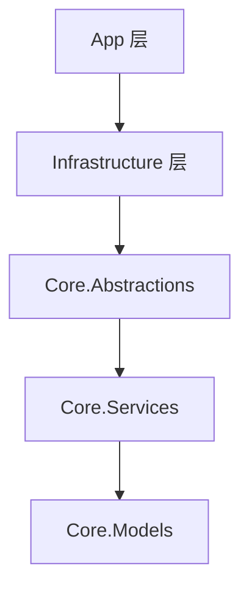

# 技术架构

<cite>
**本文引用的文件**
- [App\App.csproj](file://App\App.csproj)
- [Core\Core.csproj](file://Core\Core.csproj)
- [Infrastructure\Infrastructure.csproj](file://Infrastructure\Infrastructure.csproj)
- [Core\Abstractions\IAdbService.cs](file://Core\Abstractions\IAdbService.cs)
- [Core\Abstractions\ICodeGenerator.cs](file://Core\Abstractions\ICodeGenerator.cs)
- [Core\Abstractions\IOpenCVMatchService.cs](file://Core\Abstractions\IOpenCVMatchService.cs)
- [Core\Abstractions\IUiDumpParser.cs](file://Core\Abstractions\IUiDumpParser.cs)
- [Core\Services\AutoJS6CodeGenerator.cs](file://Core\Services\AutoJS6CodeGenerator.cs)
- [Core\Services\UiDumpParser.cs](file://Core\Services\UiDumpParser.cs)
- [Infrastructure\Adb\AdbServiceImpl.cs](file://Infrastructure\Adb\AdbServiceImpl.cs)
- [Infrastructure\Imaging\OpenCVMatchServiceImpl.cs](file://Infrastructure\Imaging\OpenCVMatchServiceImpl.cs)
- [Infrastructure\Imaging\ImageProcessor.cs](file://Infrastructure\Imaging\ImageProcessor.cs)
- [Core\Models\AutoJS6CodeOptions.cs](file://Core\Models\AutoJS6CodeOptions.cs)
- [Core\Models\WidgetNode.cs](file://Core\Models\WidgetNode.cs)
- [Core\Models\MatchResult.cs](file://Core\Models\MatchResult.cs)
- [App\App.xaml.cs](file://App\App.xaml.cs)
- [App\MainWindow.xaml.cs](file://App\MainWindow.xaml.cs)
- [README.md](file://README.md)
</cite>

## 目录
1. [引言](#引言)
2. [项目结构](#项目结构)
3. [核心组件](#核心组件)
4. [架构总览](#架构总览)
5. [详细组件分析](#详细组件分析)
6. [依赖分析](#依赖分析)
7. [性能考虑](#性能考虑)
8. [故障排查指南](#故障排查指南)
9. [结论](#结论)
10. [附录](#附录)

## 引言
本文件面向 AutoJS6 开发工具的架构文档，系统阐述 Clean Architecture 分层架构的设计理念与实现细节，明确 App 层、Core 层与 Infrastructure 层的职责划分与相互关系；解释依赖单向流动的原则与接口隔离带来的松耦合；说明异步优先架构的实现方式（async/await 与 CancellationToken 支持）；并重点解析“双引擎独立性”（图像引擎与 UI 引擎）如何确保两个处理管道完全解耦。文中提供架构图与组件交互说明，帮助开发者快速理解整体设计思路与技术决策。

## 项目结构
项目采用 Clean Architecture 分层组织，三层职责清晰、边界明确：
- App 层：WinUI 3 应用，负责 UI 与 MVVM，不包含业务逻辑。
- Core 层：纯业务逻辑层，定义领域模型、抽象接口与核心服务，无 UI 依赖。
- Infrastructure 层：外部依赖适配层，封装 ADB、OpenCV、ImageSharp 等第三方能力。

项目结构概览如下：

**图表来源**
- [README.md:230-287](file://README.md#L230-L287)
- [App\App.csproj:67](file://App\App.csproj#L67)
- [Infrastructure\Infrastructure.csproj:10](file://Infrastructure\Infrastructure.csproj#L10)
- [Core\Core.csproj:1-10](file://Core\Core.csproj#L1-L10)

**章节来源**
- [README.md:230-287](file://README.md#L230-L287)
- [App\App.csproj:67](file://App\App.csproj#L67)
- [Infrastructure\Infrastructure.csproj:10](file://Infrastructure\Infrastructure.csproj#L10)
- [Core\Core.csproj:1-10](file://Core\Core.csproj#L1-L10)

## 核心组件
本节聚焦 Clean Architecture 中的关键组件及其职责：
- 接口层（Core.Abstractions）：定义跨层的服务契约，隔离具体实现。
- 业务服务（Core.Services）：实现核心业务逻辑，如代码生成、UI Dump 解析等。
- 基础设施实现（Infrastructure）：封装 ADB 通信、OpenCV 模板匹配、图像处理等外部依赖。
- 应用层（App）：WinUI 3 视图与视图模型，负责用户交互与工作台编排。

关键接口与实现一览：
- 设备与截图：IAdbService → AdbServiceImpl
- 图像匹配：IOpenCVMatchService → OpenCVMatchServiceImpl
- UI 解析：IUiDumpParser → UiDumpParser
- 代码生成：ICodeGenerator → AutoJS6CodeGenerator
- 图像处理：ImageProcessor（基础设施工具）

**章节来源**
- [Core\Abstractions\IAdbService.cs:8-56](file://Core\Abstractions\IAdbService.cs#L8-L56)
- [Core\Abstractions\IOpenCVMatchService.cs:8-56](file://Core\Abstractions\IOpenCVMatchService.cs#L8-L56)
- [Core\Abstractions\IUiDumpParser.cs:8-55](file://Core\Abstractions\IUiDumpParser.cs#L8-L55)
- [Core\Abstractions\ICodeGenerator.cs:8-45](file://Core\Abstractions\ICodeGenerator.cs#L8-L45)
- [Infrastructure\Adb\AdbServiceImpl.cs:17-237](file://Infrastructure\Adb\AdbServiceImpl.cs#L17-L237)
- [Infrastructure\Imaging\OpenCVMatchServiceImpl.cs:11-203](file://Infrastructure\Imaging\OpenCVMatchServiceImpl.cs#L11-L203)
- [Core\Services\UiDumpParser.cs:12-262](file://Core\Services\UiDumpParser.cs#L12-L262)
- [Core\Services\AutoJS6CodeGenerator.cs:11-356](file://Core\Services\AutoJS6CodeGenerator.cs#L11-L356)
- [Infrastructure\Imaging\ImageProcessor.cs:13-161](file://Infrastructure\Imaging\ImageProcessor.cs#L13-L161)

## 架构总览
Clean Architecture 在本项目中的落地体现为严格的依赖方向与分层职责：
- 依赖单向流动：App → Infrastructure → Core ← Infrastructure
- Core 层不含 UI 依赖，仅暴露接口，便于单元测试与复用。
- Infrastructure 层仅实现接口，屏蔽第三方库差异。
- App 层只负责 UI 与编排，不参与业务判断。

**图表来源**
- [README.md:264-287](file://README.md#L264-L287)
- [App\App.xaml.cs:27-54](file://App\App.xaml.cs#L27-L54)
- [App\MainWindow.xaml.cs:26-50](file://App\MainWindow.xaml.cs#L26-L50)
- [Infrastructure\Adb\AdbServiceImpl.cs:17-237](file://Infrastructure\Adb\AdbServiceImpl.cs#L17-L237)
- [Infrastructure\Imaging\OpenCVMatchServiceImpl.cs:11-203](file://Infrastructure\Imaging\OpenCVMatchServiceImpl.cs#L11-L203)
- [Infrastructure\Imaging\ImageProcessor.cs:13-161](file://Infrastructure\Imaging\ImageProcessor.cs#L13-L161)
- [Core\Services\AutoJS6CodeGenerator.cs:11-356](file://Core\Services\AutoJS6CodeGenerator.cs#L11-L356)
- [Core\Services\UiDumpParser.cs:12-262](file://Core\Services\UiDumpParser.cs#L12-L262)
- [Core\Abstractions\IAdbService.cs:8-56](file://Core\Abstractions\IAdbService.cs#L8-L56)
- [Core\Abstractions\IOpenCVMatchService.cs:8-56](file://Core\Abstractions\IOpenCVMatchService.cs#L8-L56)
- [Core\Abstractions\IUiDumpParser.cs:8-55](file://Core\Abstractions\IUiDumpParser.cs#L8-L55)
- [Core\Abstractions\ICodeGenerator.cs:8-45](file://Core\Abstractions\ICodeGenerator.cs#L8-L45)

## 详细组件分析

### 组件一：双引擎独立性设计（图像引擎与 UI 引擎）
- 图像引擎（像素级）：以截图与模板匹配为核心，输出绝对像素坐标与置信度，典型流程见下图。
- UI 引擎（控件级）：以 UI Dump 解析为核心，输出 UiSelector 选择器链，典型流程见下图。
- 两者完全解耦：数据源、处理管线、渲染与代码生成路径彼此独立，互不影响。

**图表来源**
- [Infrastructure\Adb\AdbServiceImpl.cs:51-138](file://Infrastructure\Adb\AdbServiceImpl.cs#L51-L138)
- [Infrastructure\Imaging\OpenCVMatchServiceImpl.cs:13-122](file://Infrastructure\Imaging\OpenCVMatchServiceImpl.cs#L13-L122)
- [Core\Services\UiDumpParser.cs:14-97](file://Core\Services\UiDumpParser.cs#L14-L97)
- [Core\Models\MatchResult.cs:6-62](file://Core\Models\MatchResult.cs#L6-L62)

**章节来源**
- [README.md:266-270](file://README.md#L266-L270)

### 组件二：异步优先架构与 CancellationToken 支持
- 所有 I/O 密集操作均采用 async/await，避免阻塞 UI 线程。
- CancellationToken 作为参数贯穿关键方法，支持取消与超时控制。
- 典型场景：ADB 截图、UI Dump、OpenCV 匹配、图像处理等。

**图表来源**
- [Core\Abstractions\IAdbService.cs:22](file://Core\Abstractions\IAdbService.cs#L22)
- [Core\Abstractions\IOpenCVMatchService.cs:19-40](file://Core\Abstractions\IOpenCVMatchService.cs#L19-L40)
- [Infrastructure\Adb\AdbServiceImpl.cs:72-118](file://Infrastructure\Adb\AdbServiceImpl.cs#L72-L118)
- [Infrastructure\Imaging\OpenCVMatchServiceImpl.cs:13-59](file://Infrastructure\Imaging\OpenCVMatchServiceImpl.cs#L13-L59)

**章节来源**
- [README.md:282-287](file://README.md#L282-L287)
- [Core\Abstractions\IAdbService.cs:14-54](file://Core\Abstractions\IAdbService.cs#L14-L54)
- [Core\Abstractions\IOpenCVMatchService.cs:19-40](file://Core\Abstractions\IOpenCVMatchService.cs#L19-L40)

### 组件三：代码生成器（Core.Services.AutoJS6CodeGenerator）
- 支持两种模式：图像模式（基于 images.findImage）与控件模式（基于 UiSelector）。
- 生成完整脚本、格式化代码、验证 Rhino 引擎约束。
- 生成逻辑包含重试、超时、日志与图像回收等工程化特性。

**图表来源**
- [Core\Abstractions\ICodeGenerator.cs:8-45](file://Core\Abstractions\ICodeGenerator.cs#L8-L45)
- [Core\Services\AutoJS6CodeGenerator.cs:11-356](file://Core\Services\AutoJS6CodeGenerator.cs#L11-L356)

**章节来源**
- [Core\Services\AutoJS6CodeGenerator.cs:13-189](file://Core\Services\AutoJS6CodeGenerator.cs#L13-L189)
- [Core\Models\AutoJS6CodeOptions.cs:6-72](file://Core\Models\AutoJS6CodeOptions.cs#L6-L72)

### 组件四：UI Dump 解析器（Core.Services.UiDumpParser）
- 异步解析 Android UI Dump XML，构建 WidgetNode 树。
- 提供节点过滤、按属性查找、坐标定位与 UiSelector 代码生成。

**图表来源**
- [Core\Services\UiDumpParser.cs:14-97](file://Core\Services\UiDumpParser.cs#L14-L97)
- [Core\Models\WidgetNode.cs:6-92](file://Core\Models\WidgetNode.cs#L6-L92)

**章节来源**
- [Core\Services\UiDumpParser.cs:14-262](file://Core\Services\UiDumpParser.cs#L14-L262)
- [Core\Models\WidgetNode.cs:6-92](file://Core\Models\WidgetNode.cs#L6-L92)

### 组件五：ADB 服务实现（Infrastructure.Adb.AdbServiceImpl）
- 封装 ADB 服务器启动、设备扫描、截图捕获、UI Dump 获取、设备连接与配对。
- 截图流程包含帧缓冲区处理、去填充与 PNG 编码。

**图表来源**
- [Infrastructure\Adb\AdbServiceImpl.cs:33-118](file://Infrastructure\Adb\AdbServiceImpl.cs#L33-L118)
- [Infrastructure\Adb\AdbServiceImpl.cs:51-138](file://Infrastructure\Adb\AdbServiceImpl.cs#L51-L138)

**章节来源**
- [Infrastructure\Adb\AdbServiceImpl.cs:17-237](file://Infrastructure\Adb\AdbServiceImpl.cs#L17-L237)

### 组件六：OpenCV 模板匹配服务（Infrastructure.Imaging.OpenCVMatchServiceImpl）
- 提供单匹配与多匹配、相似度计算、模板校验。
- 支持区域裁剪搜索上下文，保证匹配精度与性能。

**图表来源**
- [Infrastructure\Imaging\OpenCVMatchServiceImpl.cs:13-122](file://Infrastructure\Imaging\OpenCVMatchServiceImpl.cs#L13-L122)
- [Core\Models\MatchResult.cs:6-62](file://Core\Models\MatchResult.cs#L6-L62)

**章节来源**
- [Infrastructure\Imaging\OpenCVMatchServiceImpl.cs:11-203](file://Infrastructure\Imaging\OpenCVMatchServiceImpl.cs#L11-L203)
- [Core\Models\MatchResult.cs:6-62](file://Core\Models\MatchResult.cs#L6-L62)

### 组件七：图像处理器（Infrastructure.Imaging.ImageProcessor）
- 提供 PNG 解码、降采样、裁剪、元数据生成、尺寸查询与有效性校验。
- 为高性能渲染与匹配提供前置处理能力。

**章节来源**
- [Infrastructure\Imaging\ImageProcessor.cs:13-161](file://Infrastructure\Imaging\ImageProcessor.cs#L13-L161)

## 依赖分析
- App 层仅依赖 Infrastructure 层提供的服务接口，不直接依赖 Core 实现，满足 Clean Architecture 的依赖倒置原则。
- Infrastructure 层依赖 Core 的抽象接口，实现具体功能，向上提供稳定契约。
- Core 层不依赖任何 UI 或外部框架，仅依赖 Models 与 Abstractions，保证可测试性与可移植性。

**图表来源**
- [App\App.csproj:67](file://App\App.csproj#L67)
- [Infrastructure\Infrastructure.csproj:10](file://Infrastructure\Infrastructure.csproj#L10)
- [Core\Core.csproj:1-10](file://Core\Core.csproj#L1-L10)

**章节来源**
- [App\App.csproj:67](file://App\App.csproj#L67)
- [Infrastructure\Infrastructure.csproj:10](file://Infrastructure\Infrastructure.csproj#L10)
- [Core\Core.csproj:1-10](file://Core\Core.csproj#L1-L10)

## 性能考虑
- 异步 I/O 与后台线程：所有 I/O 密集任务均在后台线程执行，避免阻塞 UI。
- 取消与超时：通过 CancellationToken 支持取消与超时，防止长时间阻塞。
- 区域裁剪与降采样：优先使用 region 限定搜索范围，并对高分辨率图像进行降采样，降低匹配成本。
- 图像回收：在图像模式下及时回收 ImageWrapper 对象，避免内存泄漏。
- 渲染优化：Win2D 提供 GPU 加速，配合双层渲染与惯性平滑，达到 60 FPS。

**章节来源**
- [README.md:282-287](file://README.md#L282-L287)
- [README.md:362-368](file://README.md#L362-L368)
- [Infrastructure\Imaging\ImageProcessor.cs:47-72](file://Infrastructure\Imaging\ImageProcessor.cs#L47-L72)
- [Core\Services\AutoJS6CodeGenerator.cs:38-99](file://Core\Services\AutoJS6CodeGenerator.cs#L38-L99)

## 故障排查指南
- ADB 无法连接或截图失败
  - 检查 ADB 路径与环境变量配置，确认 ADB 服务已启动。
  - 确认设备处于在线状态且允许调试。
  - 关注异常信息中的“设备未找到/截图为空”提示，必要时重启 ADB 服务。
- OpenCV 匹配结果异常
  - 调整阈值与匹配区域，确保模板质量与背景对比度。
  - 检查模板有效性与图像尺寸一致性。
- UI Dump 解析失败
  - 确认 UI Dump 数据非空且格式正确。
  - 使用过滤规则排除布局容器，提高节点可用性。
- 代码生成不符合 Rhino 约束
  - 避免在循环体内使用 const/let，改用 var。
  - 确保每轮迭代仅调用一次 captureScreen()，并及时回收模板图像。

**章节来源**
- [Infrastructure\Adb\AdbServiceImpl.cs:33-49](file://Infrastructure\Adb\AdbServiceImpl.cs#L33-L49)
- [Infrastructure\Adb\AdbServiceImpl.cs:72-118](file://Infrastructure\Adb\AdbServiceImpl.cs#L72-L118)
- [Infrastructure\Imaging\OpenCVMatchServiceImpl.cs:13-59](file://Infrastructure\Imaging\OpenCVMatchServiceImpl.cs#L13-L59)
- [Core\Services\UiDumpParser.cs:14-35](file://Core\Services\UiDumpParser.cs#L14-L35)
- [Core\Services\AutoJS6CodeGenerator.cs:226-258](file://Core\Services\AutoJS6CodeGenerator.cs#L226-L258)

## 结论
本项目通过 Clean Architecture 实现了清晰的分层与严格的依赖方向，结合接口隔离与异步优先策略，既保证了核心业务的稳定性与可测试性，又实现了 UI 与基础设施的灵活扩展。双引擎独立性进一步强化了解耦程度，使图像与 UI 两条处理管线能够并行演进、互不干扰。该架构为 AutoJS6 开发工具提供了坚实的技术基础与良好的可维护性。

## 附录
- 关键模型与枚举
  - AutoJS6CodeOptions：代码生成选项（模式、阈值、重试、超时、变量前缀、模板路径、区域、控件选择器、开关项等）
  - WidgetNode：UI 控件节点（类名、资源 ID、文本、内容描述、边界框、包名、状态、子节点等）
  - MatchResult：模板匹配结果（位置、尺寸、置信度、耗时、算法、阈值等）

**章节来源**
- [Core\Models\AutoJS6CodeOptions.cs:6-72](file://Core\Models\AutoJS6CodeOptions.cs#L6-L72)
- [Core\Models\WidgetNode.cs:6-92](file://Core\Models\WidgetNode.cs#L6-L92)
- [Core\Models\MatchResult.cs:6-62](file://Core\Models\MatchResult.cs#L6-L62)