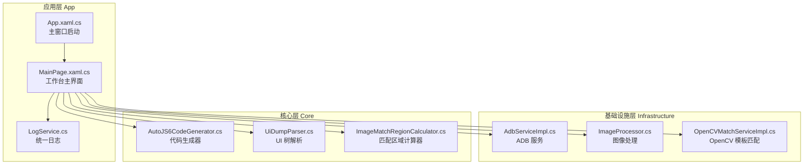
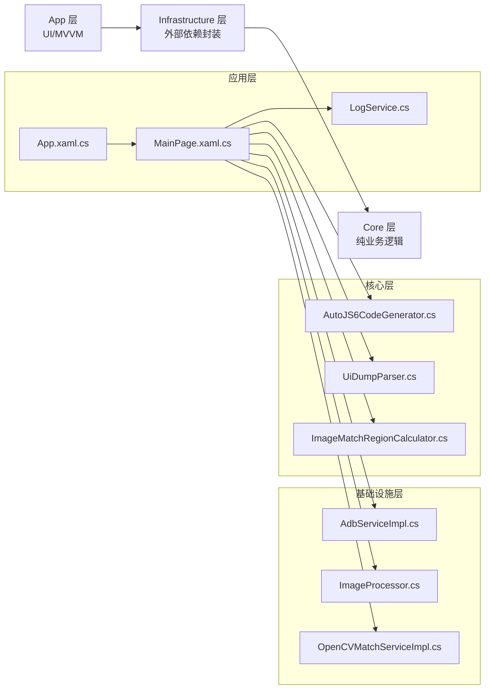
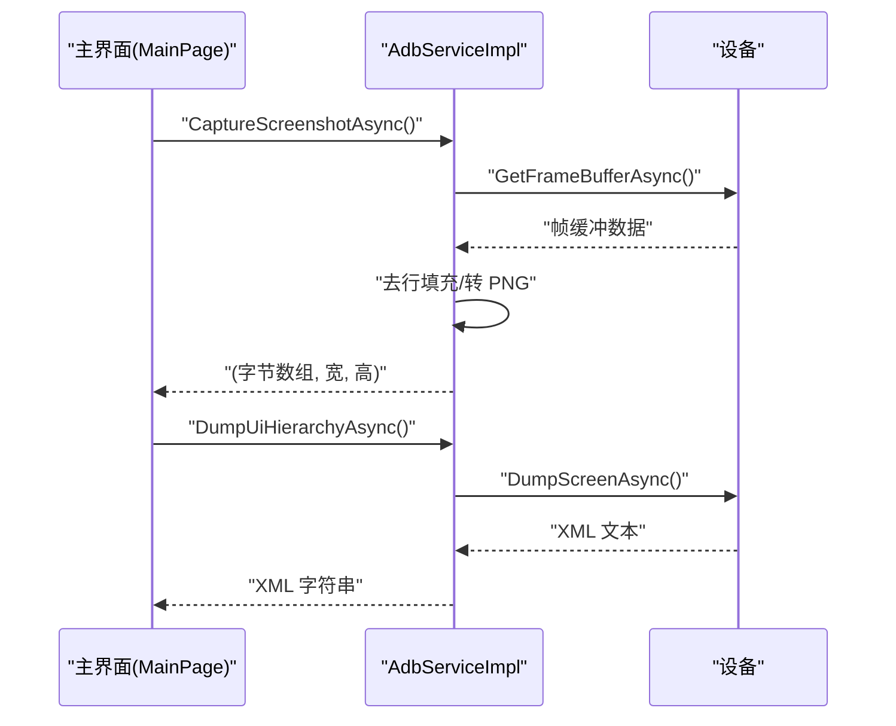
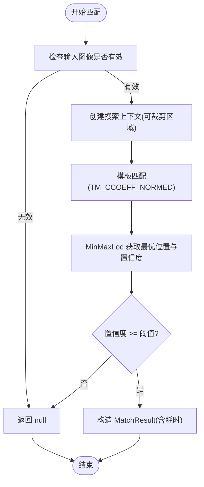
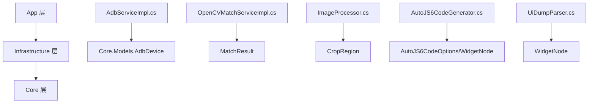

# 故障排除

<cite>
**本文引用的文件**   
- [App\App.xaml.cs](file://App\App.xaml.cs)
- [App\Services\LogService.cs](file://App\Services\LogService.cs)
- [App\Views\MainPage.xaml.cs](file://App\Views\MainPage.xaml.cs)
- [Infrastructure\Adb\AdbServiceImpl.cs](file://Infrastructure\Adb\AdbServiceImpl.cs)
- [Infrastructure\Imaging\OpenCVMatchServiceImpl.cs](file://Infrastructure\Imaging\OpenCVMatchServiceImpl.cs)
- [Infrastructure\Imaging\ImageProcessor.cs](file://Infrastructure\Imaging\ImageProcessor.cs)
- [Core\Services\AutoJS6CodeGenerator.cs](file://Core\Services\AutoJS6CodeGenerator.cs)
- [Core\Services\UiDumpParser.cs](file://Core\Services\UiDumpParser.cs)
- [Core\Helpers\ImageMatchRegionCalculator.cs](file://Core\Helpers\ImageMatchRegionCalculator.cs)
- [Core.Tests\AutoJS6CodeGeneratorTests.cs](file://Core.Tests\AutoJS6CodeGeneratorTests.cs)
- [Core.Tests\UiDumpParserTests.cs](file://Core.Tests\UiDumpParserTests.cs)
- [README.md](file://README.md)
- [AGENTS.md](file://AGENTS.md)
- [openspec\changes\winui3-visual-dev-toolkit\design.md](file://openspec\changes\winui3-visual-dev-toolkit\design.md)
- [openspec\changes\winui3-visual-dev-toolkit\proposal.md](file://openspec\changes\winui3-visual-dev-toolkit\proposal.md)
- [openspec\changes\winui3-visual-dev-toolkit\tasks.md](file://openspec\changes\winui3-visual-dev-toolkit\tasks.md)
</cite>

## 目录
1. [简介](#简介)
2. [项目结构](#项目结构)
3. [核心组件](#核心组件)
4. [架构总览](#架构总览)
5. [详细组件分析](#详细组件分析)
6. [依赖分析](#依赖分析)
7. [性能考虑](#性能考虑)
8. [故障排除指南](#故障排除指南)
9. [结论](#结论)
10. [附录](#附录)

## 简介
本指南面向 AutoJS6 开发工具使用者，聚焦于常见问题的诊断与修复，涵盖图像匹配不准确、设备连接失败、UI 树解析异常、代码生成错误、性能问题（渲染卡顿、内存泄漏、CPU 占用过高）、以及环境配置（ADB、依赖库、权限）等。文档提供系统化的调试流程、日志查看方法、性能分析与错误追踪技巧，并给出针对性解决步骤，帮助用户快速定位并解决问题。

## 项目结构
该工具采用 Clean Architecture 分层设计，分为 App（UI/MVVM）、Infrastructure（外部依赖封装）、Core（纯业务逻辑）。各层职责清晰，接口隔离，便于测试与维护。

**图表来源**
- [App\App.xaml.cs:1-57](file://App\App.xaml.cs#L1-L57)
- [App\Views\MainPage.xaml.cs:1-409](file://App\Views\MainPage.xaml.cs#L1-L409)
- [App\Services\LogService.cs:1-51](file://App\Services\LogService.cs#L1-L51)
- [Infrastructure\Adb\AdbServiceImpl.cs:1-238](file://Infrastructure\Adb\AdbServiceImpl.cs#L1-L238)
- [Infrastructure\Imaging\ImageProcessor.cs:1-162](file://Infrastructure\Imaging\ImageProcessor.cs#L1-L162)
- [Infrastructure\Imaging\OpenCVMatchServiceImpl.cs:1-204](file://Infrastructure\Imaging\OpenCVMatchServiceImpl.cs#L1-L204)
- [Core\Services\AutoJS6CodeGenerator.cs:1-357](file://Core\Services\AutoJS6CodeGenerator.cs#L1-L357)
- [Core\Services\UiDumpParser.cs:1-263](file://Core\Services\UiDumpParser.cs#L1-L263)
- [Core\Helpers\ImageMatchRegionCalculator.cs:1-99](file://Core\Helpers\ImageMatchRegionCalculator.cs#L1-L99)

**章节来源**
- [README.md:230-287](file://README.md#L230-L287)

## 核心组件
- ADB 服务：负责设备发现、截图、UI 层级拉取、设备连接与配对。
- OpenCV 模板匹配：基于 CCoeff 归一化算法进行实时匹配，支持阈值与区域裁剪。
- 图像处理器：PNG 解码、降采样、裁剪、元数据生成与尺寸查询。
- UI 树解析器：解析 uiautomator XML，过滤布局容器，支持按坐标查找节点。
- 代码生成器：根据图像或控件模式生成 AutoJS6 脚本，严格遵循 Rhino 引擎约束。
- 日志服务：统一日志入口，支持 UI 实时显示与调试日志复制。

**章节来源**
- [Infrastructure\Adb\AdbServiceImpl.cs:17-238](file://Infrastructure\Adb\AdbServiceImpl.cs#L17-L238)
- [Infrastructure\Imaging\OpenCVMatchServiceImpl.cs:11-204](file://Infrastructure\Imaging\OpenCVMatchServiceImpl.cs#L11-L204)
- [Infrastructure\Imaging\ImageProcessor.cs:13-162](file://Infrastructure\Imaging\ImageProcessor.cs#L13-L162)
- [Core\Services\UiDumpParser.cs:12-263](file://Core\Services\UiDumpParser.cs#L12-L263)
- [Core\Services\AutoJS6CodeGenerator.cs:11-357](file://Core\Services\AutoJS6CodeGenerator.cs#L11-L357)
- [App\Services\LogService.cs:9-51](file://App\Services\LogService.cs#L9-L51)

## 架构总览
系统采用“应用层 -> 基础设施层 -> 核心层”的单向依赖，核心层不含 UI 依赖，可独立测试；基础设施层封装外部依赖（ADB、OpenCV、ImageSharp）；应用层负责 UI 与 MVVM，通过服务接口与核心交互。

**图表来源**
- [README.md:264-287](file://README.md#L264-L287)
- [openspec\changes\winui3-visual-dev-toolkit\design.md:120-143](file://openspec\changes\winui3-visual-dev-toolkit\design.md#L120-L143)

## 详细组件分析

### ADB 服务（设备连接与截图）
- 功能要点：初始化 ADB 服务器、扫描设备、截图（帧缓冲流式读取并去除行填充）、UI 层级 XML 拉取、在线状态检测、TCP/IP 连接与配对。
- 关键异常：设备不存在、截图数据为空、UI Dump 返回空、连接/配对失败。
- 性能注意：帧缓冲数据可能包含行填充，需去填充后转 PNG；截图与 UI Dump 为异步操作，避免阻塞 UI。

**图表来源**
- [Infrastructure\Adb\AdbServiceImpl.cs:72-138](file://Infrastructure\Adb\AdbServiceImpl.cs#L72-L138)
- [App\Views\MainPage.xaml.cs:147-248](file://App\Views\MainPage.xaml.cs#L147-L248)

**章节来源**
- [Infrastructure\Adb\AdbServiceImpl.cs:33-49](file://Infrastructure\Adb\AdbServiceImpl.cs#L33-L49)
- [Infrastructure\Adb\AdbServiceImpl.cs:72-118](file://Infrastructure\Adb\AdbServiceImpl.cs#L72-L118)
- [Infrastructure\Adb\AdbServiceImpl.cs:120-138](file://Infrastructure\Adb\AdbServiceImpl.cs#L120-L138)
- [App\Views\MainPage.xaml.cs:147-248](file://App\Views\MainPage.xaml.cs#L147-L248)

### OpenCV 模板匹配服务
- 功能要点：基于 CCoeff 归一化算法进行模板匹配，支持单点与多点匹配、相似度计算、模板有效性校验、区域裁剪上下文。
- 关键异常：输入图像为空、匹配失败返回空结果。
- 性能注意：匹配过程在后台线程执行，带计时统计；阈值与区域裁剪直接影响性能与精度。

**图表来源**
- [Infrastructure\Imaging\OpenCVMatchServiceImpl.cs:13-60](file://Infrastructure\Imaging\OpenCVMatchServiceImpl.cs#L13-L60)
- [Infrastructure\Imaging\OpenCVMatchServiceImpl.cs:163-202](file://Infrastructure\Imaging\OpenCVMatchServiceImpl.cs#L163-L202)

**章节来源**
- [Infrastructure\Imaging\OpenCVMatchServiceImpl.cs:20-59](file://Infrastructure\Imaging\OpenCVMatchServiceImpl.cs#L20-L59)
- [Infrastructure\Imaging\OpenCVMatchServiceImpl.cs:62-122](file://Infrastructure\Imaging\OpenCVMatchServiceImpl.cs#L62-L122)
- [Infrastructure\Imaging\OpenCVMatchServiceImpl.cs:150-161](file://Infrastructure\Imaging\OpenCVMatchServiceImpl.cs#L150-L161)

### 图像处理器
- 功能要点：PNG 解码为像素数据、降采样（最大 1920x1080）、裁剪、元数据生成、尺寸查询、图像有效性验证。
- 性能注意：降采样保持宽高比，避免大图带来的内存压力；裁剪前进行边界校验。

**章节来源**
- [Infrastructure\Imaging\ImageProcessor.cs:21-72](file://Infrastructure\Imaging\ImageProcessor.cs#L21-L72)
- [Infrastructure\Imaging\ImageProcessor.cs:77-100](file://Infrastructure\Imaging\ImageProcessor.cs#L77-L100)
- [Infrastructure\Imaging\ImageProcessor.cs:105-133](file://Infrastructure\Imaging\ImageProcessor.cs#L105-L133)
- [Infrastructure\Imaging\ImageProcessor.cs:138-161](file://Infrastructure\Imaging\ImageProcessor.cs#L138-L161)

### UI 树解析器
- 功能要点：解析 XML，构建 WidgetNode 树，过滤布局容器，按资源 ID/文本/内容描述/类名查找节点，按坐标查找最深节点，生成 UiSelector。
- 异常处理：XML 解析失败返回空根节点；布局容器过滤减少冗余节点。

**章节来源**
- [Core\Services\UiDumpParser.cs:14-35](file://Core\Services\UiDumpParser.cs#L14-L35)
- [Core\Services\UiDumpParser.cs:37-54](file://Core\Services\UiDumpParser.cs#L37-L54)
- [Core\Services\UiDumpParser.cs:56-59](file://Core\Services\UiDumpParser.cs#L56-L59)
- [Core\Services\UiDumpParser.cs:61-97](file://Core\Services\UiDumpParser.cs#L61-L97)
- [Core\Services\UiDumpParser.cs:103-154](file://Core\Services\UiDumpParser.cs#L103-L154)
- [Core\Services\UiDumpParser.cs:178-197](file://Core\Services\UiDumpParser.cs#L178-L197)
- [Core\Services\UiDumpParser.cs:199-227](file://Core\Services\UiDumpParser.cs#L199-L227)
- [Core\Services\UiDumpParser.cs:229-251](file://Core\Services\UiDumpParser.cs#L229-L251)

### 代码生成器
- 功能要点：图像模式生成 images.findImage 脚本，控件模式生成 UiSelector 链；支持重试逻辑、模板回收、Rhino 引擎约束校验。
- 关键约束：循环体内禁止 const/let，需使用 var；建议 region 匹配与模板回收。

**章节来源**
- [Core\Services\AutoJS6CodeGenerator.cs:13-102](file://Core\Services\AutoJS6CodeGenerator.cs#L13-L102)
- [Core\Services\AutoJS6CodeGenerator.cs:104-164](file://Core\Services\AutoJS6CodeGenerator.cs#L104-L164)
- [Core\Services\AutoJS6CodeGenerator.cs:226-258](file://Core\Services\AutoJS6CodeGenerator.cs#L226-L258)
- [README.md:342-374](file://README.md#L342-L374)

### 日志服务
- 功能要点：统一日志入口，带时间戳，同时输出到 Debug 控制台与 UI；UI 侧订阅事件显示日志。
- 使用场景：调试 ADB 截图尺寸、UI Dump 长度、匹配耗时等。

**章节来源**
- [App\Services\LogService.cs:39-49](file://App\Services\LogService.cs#L39-L49)
- [App\Views\MainPage.xaml.cs:112-118](file://App\Views\MainPage.xaml.cs#L112-L118)

## 依赖分析
- 单向依赖：App → Infrastructure → Core，Core 为纯业务逻辑，无项目内部依赖。
- 外部依赖封装：ADB（SharpAdbClient）、OpenCV（OpenCvSharp4）、图像（SixLabors.ImageSharp）。
- 测试覆盖：Core 层单元测试覆盖代码生成与 UI 树解析的关键行为。

**图表来源**
- [openspec\changes\winui3-visual-dev-toolkit\design.md:120-143](file://openspec\changes\winui3-visual-dev-toolkit\design.md#L120-L143)
- [Infrastructure\Adb\AdbServiceImpl.cs:51-70](file://Infrastructure\Adb\AdbServiceImpl.cs#L51-L70)
- [Infrastructure\Imaging\OpenCVMatchServiceImpl.cs:13-60](file://Infrastructure\Imaging\OpenCVMatchServiceImpl.cs#L13-L60)
- [Infrastructure\Imaging\ImageProcessor.cs:15-16](file://Infrastructure\Imaging\ImageProcessor.cs#L15-L16)
- [Core\Services\AutoJS6CodeGenerator.cs:3-4](file://Core\Services\AutoJS6CodeGenerator.cs#L3-L4)
- [Core\Services\UiDumpParser.cs:14-35](file://Core\Services\UiDumpParser.cs#L14-L35)

**章节来源**
- [openspec\changes\winui3-visual-dev-toolkit\design.md:120-143](file://openspec\changes\winui3-visual-dev-toolkit\design.md#L120-L143)
- [Core.Tests\AutoJS6CodeGeneratorTests.cs:10-79](file://Core.Tests\AutoJS6CodeGeneratorTests.cs#L10-L79)
- [Core.Tests\UiDumpParserTests.cs:9-73](file://Core.Tests\UiDumpParserTests.cs#L9-L73)

## 性能考虑
- 异步优先：所有 I/O（ADB、OpenCV、XML 解析、纹理上传）使用 async/await，避免 UI 阻塞。
- 渲染优化：Win2D 启用 GPU 加速，CanvasBitmap 缓存池，分层渲染仅重绘变化图层。
- 内存优化：阈值滑动仅重算匹配层，不重建图像纹理；控件树支持 5000+ 节点虚拟化渲染。
- 图像降采样：最大 1920x1080，保持宽高比，降低内存占用与匹配开销。
- 匹配范围控制：优先使用 region 裁剪，减少搜索面积。

**章节来源**
- [openspec\changes\winui3-visual-dev-toolkit\design.md:109-143](file://openspec\changes\winui3-visual-dev-toolkit\design.md#L109-L143)
- [openspec\changes\winui3-visual-dev-toolkit\tasks.md:214-224](file://openspec\changes\winui3-visual-dev-toolkit\tasks.md#L214-L224)
- [Infrastructure\Imaging\ImageProcessor.cs:47-72](file://Infrastructure\Imaging\ImageProcessor.cs#L47-L72)
- [Infrastructure\Imaging\OpenCVMatchServiceImpl.cs:19-60](file://Infrastructure\Imaging\OpenCVMatchServiceImpl.cs#L19-L60)

## 故障排除指南

### 一、图像匹配不准确
- 现象
  - 模板未匹配或误匹配；阈值调高/调低效果不明显；不同分辨率设备表现差异大。
- 诊断步骤
  1. 检查模板有效性：确认模板图像非空且尺寸大于零。
     - 参考：[Infrastructure\Imaging\OpenCVMatchServiceImpl.cs:150-161](file://Infrastructure\Imaging\OpenCVMatchServiceImpl.cs#L150-L161)
  2. 检查区域裁剪：确保 region 与实际目标区域一致，避免过大或过小。
     - 参考：[Infrastructure\Imaging\OpenCVMatchServiceImpl.cs:163-177](file://Infrastructure\Imaging\OpenCVMatchServiceImpl.cs#L163-L177)
  3. 调整阈值：使用滑块从 0.50 到 0.95 逐步调整，观察置信度与匹配结果。
     - 参考：[App\Views\MainPage.xaml.cs:333-339](file://App\Views\MainPage.xaml.cs#L333-L339)
  4. 降采样与一致性：在多分辨率设备上统一使用降采样（最大 1920x1080）。
     - 参考：[Infrastructure\Imaging\ImageProcessor.cs:47-72](file://Infrastructure\Imaging\ImageProcessor.cs#L47-L72)
  5. 检查匹配耗时：若耗时过长，考虑缩小区域或降低分辨率。
     - 参考：[Infrastructure\Imaging\OpenCVMatchServiceImpl.cs:24-60](file://Infrastructure\Imaging\OpenCVMatchServiceImpl.cs#L24-L60)
- 解决方案
  - 使用“区域参考”工具生成 regionRef，避免凭感觉猜测。
    - 参考：[AGENTS.md:220-227](file://AGENTS.md#L220-L227)
  - 在生成代码时启用模板回收与 region 匹配。
    - 参考：[Core\Services\AutoJS6CodeGenerator.cs:264-288](file://Core\Services\AutoJS6CodeGenerator.cs#L264-L288)

**章节来源**
- [Infrastructure\Imaging\OpenCVMatchServiceImpl.cs:150-161](file://Infrastructure\Imaging\OpenCVMatchServiceImpl.cs#L150-L161)
- [Infrastructure\Imaging\OpenCVMatchServiceImpl.cs:163-177](file://Infrastructure\Imaging\OpenCVMatchServiceImpl.cs#L163-L177)
- [Infrastructure\Imaging\ImageProcessor.cs:47-72](file://Infrastructure\Imaging\ImageProcessor.cs#L47-L72)
- [AGENTS.md:220-227](file://AGENTS.md#L220-L227)
- [Core\Services\AutoJS6CodeGenerator.cs:264-288](file://Core\Services\AutoJS6CodeGenerator.cs#L264-L288)

### 二、设备连接失败
- 现象
  - 设备未出现在设备列表；截图/Dump 失败；连接/配对报错。
- 诊断步骤
  1. 检查 ADB 可执行文件路径：工具会尝试从 PATH、常见 SDK 路径、ANDROID_HOME 环境变量查找 adb.exe。
     - 参考：[Infrastructure\Adb\AdbServiceImpl.cs:190-236](file://Infrastructure\Adb\AdbServiceImpl.cs#L190-L236)
  2. 初始化 ADB 服务器：确认返回“已启动/已在运行”。
     - 参考：[Infrastructure\Adb\AdbServiceImpl.cs:33-49](file://Infrastructure\Adb\AdbServiceImpl.cs#L33-L49)
  3. 设备在线状态：确认设备状态为 Online。
     - 参考：[Infrastructure\Adb\AdbServiceImpl.cs:140-144](file://Infrastructure\Adb\AdbServiceImpl.cs#L140-L144)
  4. TCP/IP 连接/配对：检查地址与配对码，捕获异常信息。
     - 参考：[Infrastructure\Adb\AdbServiceImpl.cs:150-180](file://Infrastructure\Adb\AdbServiceImpl.cs#L150-L180)
- 解决方案
  - 将 adb.exe 所在目录加入系统 PATH，或在应用中正确配置环境变量。
  - 使用“连接设备/配对设备”功能，按提示输入地址与配对码。
  - 若仍失败，查看日志中的异常消息并重试。

**章节来源**
- [Infrastructure\Adb\AdbServiceImpl.cs:33-49](file://Infrastructure\Adb\AdbServiceImpl.cs#L33-L49)
- [Infrastructure\Adb\AdbServiceImpl.cs:140-180](file://Infrastructure\Adb\AdbServiceImpl.cs#L140-L180)
- [Infrastructure\Adb\AdbServiceImpl.cs:190-236](file://Infrastructure\Adb\AdbServiceImpl.cs#L190-L236)

### 三、UI 树解析异常
- 现象
  - UI 树拉取成功但解析失败；节点数量极少或为空；按坐标查找失败。
- 诊断步骤
  1. 检查 XML 长度与根节点：确认返回的 XML 非空且包含根 node。
     - 参考：[App\Views\MainPage.xaml.cs:205-219](file://App\Views\MainPage.xaml.cs#L205-L219)
  2. 解析器容错：解析失败返回空根节点；必要时回退到全量节点。
     - 参考：[Core\Services\UiDumpParser.cs:14-35](file://Core\Services\UiDumpParser.cs#L14-L35)
  3. 布局容器过滤：确认过滤规则是否移除了关键节点。
     - 参考：[Core\Services\UiDumpParser.cs:178-197](file://Core\Services\UiDumpParser.cs#L178-L197)
  4. 坐标查找：确认坐标在节点 bounds 内，优先返回最深节点。
     - 参考：[Core\Services\UiDumpParser.cs:229-251](file://Core\Services\UiDumpParser.cs#L229-L251)
- 解决方案
  - 在 UI 树解析失败时，回退到全量节点展示；检查 bounds 格式与坐标系。
  - 使用“坐标对齐策略”确保 Android bounds 与画布坐标一致。
    - 参考：[AGENTS.md:256-264](file://AGENTS.md#L256-L264)

**章节来源**
- [App\Views\MainPage.xaml.cs:205-219](file://App\Views\MainPage.xaml.cs#L205-L219)
- [Core\Services\UiDumpParser.cs:14-35](file://Core\Services\UiDumpParser.cs#L14-L35)
- [Core\Services\UiDumpParser.cs:178-197](file://Core\Services\UiDumpParser.cs#L178-L197)
- [Core\Services\UiDumpParser.cs:229-251](file://Core\Services\UiDumpParser.cs#L229-L251)
- [AGENTS.md:256-264](file://AGENTS.md#L256-L264)

### 四、代码生成错误
- 现象
  - 生成的 AutoJS6 代码在设备端运行时报错；循环体内出现 const/let 导致变量不更新。
- 诊断步骤
  1. 代码约束校验：检查循环体内是否使用 const/let。
     - 参考：[Core\Services\AutoJS6CodeGenerator.cs:226-258](file://Core\Services\AutoJS6CodeGenerator.cs#L226-L258)
  2. 生成选项核对：确认是否启用模板回收、region 匹配、重试逻辑。
     - 参考：[Core\Services\AutoJS6CodeGenerator.cs:13-102](file://Core\Services\AutoJS6CodeGenerator.cs#L13-L102)
  3. 单元测试验证：对照测试用例检查生成顺序与内容。
     - 参考：[Core.Tests\AutoJS6CodeGeneratorTests.cs:10-79](file://Core.Tests\AutoJS6CodeGeneratorTests.cs#L10-L79)
- 解决方案
  - 强制使用 var 替代 const/let；启用模板回收与 region 匹配。
  - 严格遵循 API 约束，以 PHASE0_REFERENCE.md 为准。
    - 参考：[openspec\changes\winui3-visual-dev-toolkit\proposal.md:60-69](file://openspec\changes\winui3-visual-dev-toolkit\proposal.md#L60-L69)

**章节来源**
- [Core\Services\AutoJS6CodeGenerator.cs:226-258](file://Core\Services\AutoJS6CodeGenerator.cs#L226-L258)
- [Core\Services\AutoJS6CodeGenerator.cs:13-102](file://Core\Services\AutoJS6CodeGenerator.cs#L13-L102)
- [Core.Tests\AutoJS6CodeGeneratorTests.cs:10-79](file://Core.Tests\AutoJS6CodeGeneratorTests.cs#L10-L79)
- [openspec\changes\winui3-visual-dev-toolkit\proposal.md:60-69](file://openspec\changes\winui3-visual-dev-toolkit\proposal.md#L60-L69)

### 五、性能问题诊断
- 渲染卡顿
  - 现象：缩放/拖拽时掉帧；TreeView 滚动卡顿。
  - 排查：确认已启用 GPU 加速与分层渲染；仅重绘变化图层。
    - 参考：[openspec\changes\winui3-visual-dev-toolkit\design.md:109-143](file://openspec\changes\winui3-visual-dev-toolkit\design.md#L109-L143)
- 内存泄漏
  - 现象：长时间使用后内存持续增长。
  - 排查：确认模板对象在使用后及时回收；避免重复创建纹理。
    - 参考：[Core\Services\AutoJS6CodeGenerator.cs:62-93](file://Core\Services\AutoJS6CodeGenerator.cs#L62-L93)
- CPU 占用过高
  - 现象：阈值滑动时 CPU 占用飙升。
  - 排查：仅重算匹配层，不重建图像纹理；缩小匹配区域；降低分辨率。
    - 参考：[openspec\changes\winui3-visual-dev-toolkit\design.md:109-143](file://openspec\changes\winui3-visual-dev-toolkit\design.md#L109-L143)

**章节来源**
- [openspec\changes\winui3-visual-dev-toolkit\design.md:109-143](file://openspec\changes\winui3-visual-dev-toolkit\design.md#L109-L143)
- [Core\Services\AutoJS6CodeGenerator.cs:62-93](file://Core\Services\AutoJS6CodeGenerator.cs#L62-L93)

### 六、环境配置问题
- ADB 配置
  - 确认 adb.exe 在 PATH 中，或在应用中正确配置环境变量。
    - 参考：[Infrastructure\Adb\AdbServiceImpl.cs:190-236](file://Infrastructure\Adb\AdbServiceImpl.cs#L190-L236)
- 依赖库安装
  - 安装 .NET 8 SDK、WinUI 3 工作负载；确保 OpenCvSharp4 与 SixLabors.ImageSharp 可用。
    - 参考：[README.md:112-124](file://README.md#L112-L124)
- 权限设置
  - 请求截图权限；确保设备允许自动化操作（开发者选项、USB 调试、无线调试）。
    - 参考：[Core\Services\AutoJS6CodeGenerator.cs:23-26](file://Core\Services\AutoJS6CodeGenerator.cs#L23-L26)

**章节来源**
- [Infrastructure\Adb\AdbServiceImpl.cs:190-236](file://Infrastructure\Adb\AdbServiceImpl.cs#L190-L236)
- [README.md:112-124](file://README.md#L112-L124)
- [Core\Services\AutoJS6CodeGenerator.cs:23-26](file://Core\Services\AutoJS6CodeGenerator.cs#L23-L26)

### 七、系统化调试流程与工具使用
- 日志查看
  - 使用“清空日志/全选/复制日志”功能，复制到剪贴板便于反馈。
    - 参考：[App\Views\MainPage.xaml.cs:386-407](file://App\Views\MainPage.xaml.cs#L386-L407)
  - 日志服务统一入口，带时间戳并推送 UI。
    - 参考：[App\Services\LogService.cs:39-49](file://App\Services\LogService.cs#L39-L49)
- 性能分析
  - 关注匹配耗时与 UI Dump 长度；必要时缩小区域或降采样。
    - 参考：[Infrastructure\Imaging\OpenCVMatchServiceImpl.cs:24-60](file://Infrastructure\Imaging\OpenCVMatchServiceImpl.cs#L24-L60)
    - 参考：[App\Views\MainPage.xaml.cs:205-206](file://App\Views\MainPage.xaml.cs#L205-L206)
- 错误追踪
  - 截图失败：检查设备在线状态与 ADB 初始化。
    - 参考：[Infrastructure\Adb\AdbServiceImpl.cs:72-118](file://Infrastructure\Adb\AdbServiceImpl.cs#L72-L118)
  - UI 树解析失败：检查 XML 格式与根节点。
    - 参考：[Core\Services\UiDumpParser.cs:14-35](file://Core\Services\UiDumpParser.cs#L14-L35)

**章节来源**
- [App\Views\MainPage.xaml.cs:386-407](file://App\Views\MainPage.xaml.cs#L386-L407)
- [App\Services\LogService.cs:39-49](file://App\Services\LogService.cs#L39-L49)
- [Infrastructure\Adb\AdbServiceImpl.cs:72-118](file://Infrastructure\Adb\AdbServiceImpl.cs#L72-L118)
- [Core\Services\UiDumpParser.cs:14-35](file://Core\Services\UiDumpParser.cs#L14-L35)

## 结论
通过以上系统化流程与工具使用，用户可以高效定位并解决 AutoJS6 开发工具中的常见问题。建议在日常使用中：
- 始终启用 region 匹配与模板回收；
- 使用降采样与阈值滑块优化匹配；
- 严格遵循 Rhino 引擎约束；
- 利用日志与性能指标进行问题追踪；
- 按照环境配置要求正确设置 ADB 与依赖库。

## 附录
- 相关规范与设计说明
  - API 约束与冲突处理原则
    - 参考：[openspec\changes\winui3-visual-dev-toolkit\proposal.md:60-69](file://openspec\changes\winui3-visual-dev-toolkit\proposal.md#L60-L69)
  - 异步架构与内存优化
    - 参考：[openspec\changes\winui3-visual-dev-toolkit\design.md:109-143](file://openspec\changes\winui3-visual-dev-toolkit\design.md#L109-L143)
  - 匹配区域生成规则
    - 参考：[AGENTS.md:220-227](file://AGENTS.md#L220-L227)