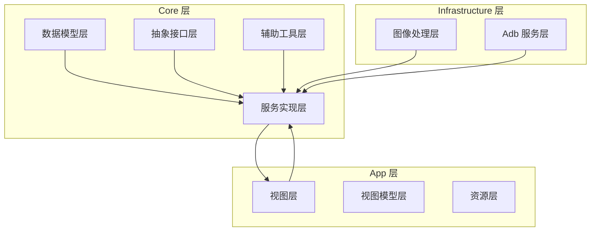
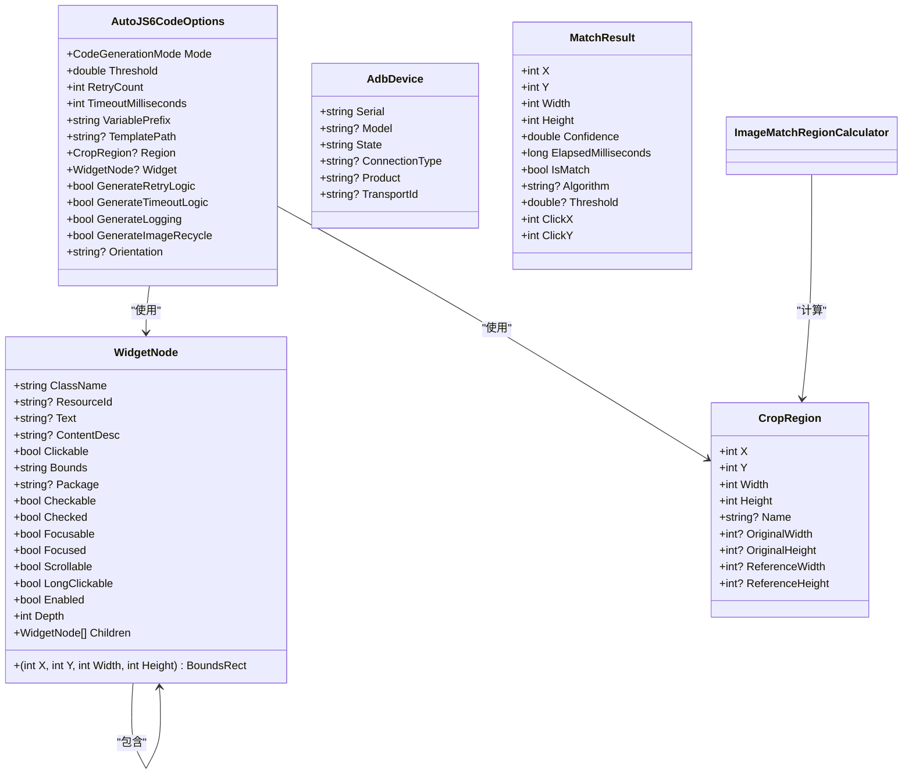
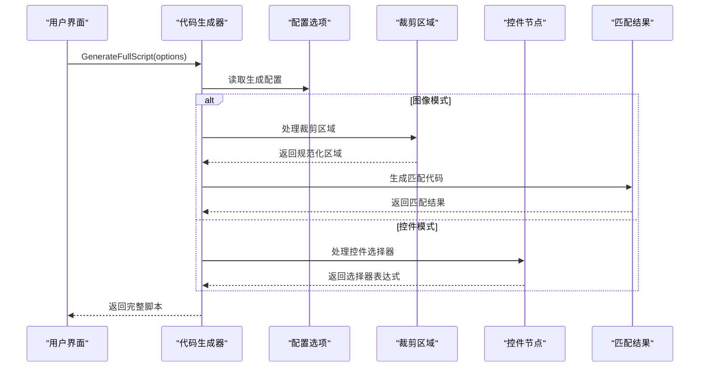
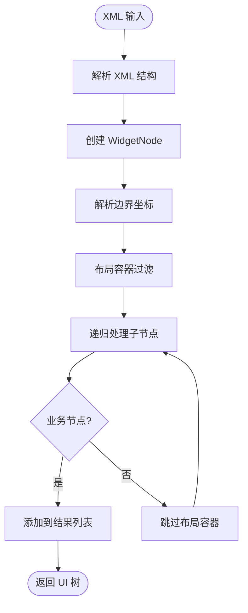
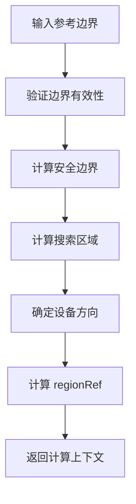
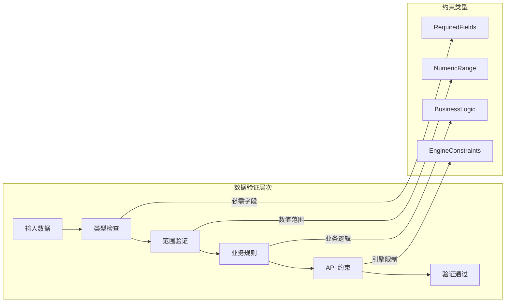
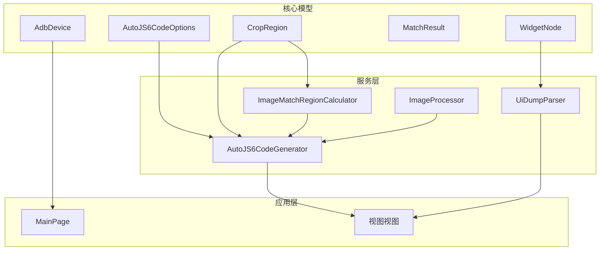

# 数据模型设计

<cite>
**本文档引用的文件**
- [AutoJS6CodeOptions.cs](file://Core/Models/AutoJS6CodeOptions.cs)
- [WidgetNode.cs](file://Core/Models/WidgetNode.cs)
- [AdbDevice.cs](file://Core/Models/AdbDevice.cs)
- [CropRegion.cs](file://Core/Models/CropRegion.cs)
- [MatchResult.cs](file://Core/Models/MatchResult.cs)
- [ImageCodeTemplateKind.cs](file://App/Models/ImageCodeTemplateKind.cs)
- [ICodeGenerator.cs](file://Core/Abstractions/ICodeGenerator.cs)
- [AutoJS6CodeGenerator.cs](file://Core/Services/AutoJS6CodeGenerator.cs)
- [IUiDumpParser.cs](file://Core/Abstractions/IUiDumpParser.cs)
- [UiDumpParser.cs](file://Core/Services/UiDumpParser.cs)
- [ImageMatchRegionCalculator.cs](file://Core/Helpers/ImageMatchRegionCalculator.cs)
- [ImageProcessor.cs](file://Infrastructure/Imaging/ImageProcessor.cs)
- [MainPage.xaml.cs](file://App/Views/MainPage.xaml.cs)
- [MainPage.UiTree.cs](file://App/Views/MainPage.UiTree.cs)
- [AGENTS.md](file://AGENTS.md)
</cite>

## 目录
1. [简介](#简介)
2. [项目结构](#项目结构)
3. [核心组件](#核心组件)
4. [架构概览](#架构概览)
5. [详细组件分析](#详细组件分析)
6. [依赖分析](#依赖分析)
7. [性能考虑](#性能考虑)
8. [故障排除指南](#故障排除指南)
9. [结论](#结论)

## 简介

AutoJS6 开发工具的数据模型设计围绕五个核心数据结构构建，这些模型为整个应用程序提供了坚实的基础。本文档深入分析了 AutoJS6CodeOptions 配置选项、WidgetNode UI 控件节点、AdbDevice 设备信息、CropRegion 裁剪区域和 MatchResult 匹配结果等关键模型的设计理念和实现细节。

这些数据模型不仅定义了应用程序内部的数据结构，更重要的是它们建立了不同功能模块之间的桥梁，支撑着图像识别、控件分析、设备管理和代码生成等核心功能。通过精心设计的字段定义、数据类型选择和业务约束，这些模型确保了应用程序在 AutoJS6 平台上的稳定运行和高效性能。

## 项目结构

AutoJS6 开发工具采用分层架构设计，数据模型位于 Core 层的核心位置，为上层的应用界面和下层的服务实现提供统一的数据抽象。

**图表来源**
- [AutoJS6CodeOptions.cs:1-89](file://Core/Models/AutoJS6CodeOptions.cs#L1-L89)
- [WidgetNode.cs:1-93](file://Core/Models/WidgetNode.cs#L1-L93)
- [AdbDevice.cs:1-38](file://Core/Models/AdbDevice.cs#L1-L38)

**章节来源**
- [AutoJS6CodeOptions.cs:1-89](file://Core/Models/AutoJS6CodeOptions.cs#L1-L89)
- [WidgetNode.cs:1-93](file://Core/Models/WidgetNode.cs#L1-L93)
- [AdbDevice.cs:1-38](file://Core/Models/AdbDevice.cs#L1-L38)

## 核心组件

### AutoJS6CodeOptions 配置选项

AutoJS6CodeOptions 是代码生成系统的核心配置模型，它定义了所有与代码生成相关的行为参数和环境设置。

**核心特性：**
- **双模式支持**：同时支持图像模式（Image）和控件模式（Widget）两种代码生成方式
- **灵活的阈值控制**：可配置的模板匹配阈值范围（0.0 - 1.0）
- **重试机制**：可配置的重试次数和超时时间
- **变量命名**：自定义变量名前缀，便于代码组织
- **条件生成**：可选择性地生成重试逻辑、超时机制、日志输出和图像回收代码

**使用场景：**
- 自动化脚本生成
- 图像识别模板匹配
- UI 控件自动化点击
- 多设备兼容性处理

**章节来源**
- [AutoJS6CodeOptions.cs:6-89](file://Core/Models/AutoJS6CodeOptions.cs#L6-L89)

### WidgetNode UI 控件节点

WidgetNode 模型是对 Android UI 层级结构的精确抽象，它完整地描述了单个 UI 控件的所有属性和行为特征。

**核心属性：**
- **标识信息**：ClassName、ResourceId、Text、ContentDesc
- **状态属性**：Clickable、Checkable、Checked、Enabled 等布尔状态
- **几何信息**：Bounds 字符串和 BoundsRect 元组（X, Y, Width, Height）
- **层次结构**：Depth 深度和 Children 子节点列表
- **包信息**：Package 应用包名

**业务价值：**
- 支持复杂的 UI 树遍历和查询
- 提供精确的控件定位能力
- 实现智能的控件过滤和筛选
- 支持坐标系转换和多分辨率适配

**章节来源**
- [WidgetNode.cs:6-93](file://Core/Models/WidgetNode.cs#L6-L93)

### AdbDevice 设备信息

AdbDevice 模型封装了 Android 设备连接的所有相关信息，为设备管理和远程操作提供了统一的数据接口。

**关键字段：**
- **设备标识**：Serial 序列号（唯一标识符）
- **硬件信息**：Model 型号、Product 产品名称、TransportId 传输 ID
- **连接状态**：State 设备状态（device, offline, unauthorized 等）
- **连接类型**：ConnectionType 连接方式（usb, tcpip）

**应用场景：**
- 多设备环境下的设备管理
- 设备状态监控和故障诊断
- 远程设备操作和调试
- 设备兼容性测试

**章节来源**
- [AdbDevice.cs:6-38](file://Core/Models/AdbDevice.cs#L6-L38)

### CropRegion 裁剪区域

CropRegion 模型定义了图像处理中的矩形裁剪区域，是图像识别和匹配功能的基础数据结构。

**设计要点：**
- **基础坐标**：X、Y 左上角坐标，Width、Height 宽度和高度
- **元数据支持**：Name 名称、OriginalWidth/Height 原始图像尺寸
- **参考系统**：ReferenceWidth/Height 参考分辨率，用于 regionRef 生成
- **坐标转换**：支持不同分辨率间的坐标映射

**技术意义：**
- 实现跨设备的坐标一致性
- 支持动态分辨率适配
- 提供精确的图像区域定义
- 为模板匹配提供标准化输入

**章节来源**
- [CropRegion.cs:6-53](file://Core/Models/CropRegion.cs#L6-L53)

### MatchResult 匹配结果

MatchResult 模型标准化了图像匹配算法的输出结果，为上层应用提供了统一的结果处理接口。

**核心指标：**
- **位置信息**：X、Y 左上角坐标，Width、Height 模板尺寸
- **质量评估**：Confidence 置信度（0.0 - 1.0）
- **性能指标**：ElapsedMilliseconds 匹配耗时
- **决策支持**：IsMatch 是否匹配成功
- **算法信息**：Algorithm 算法类型，Threshold 使用阈值

**实用功能：**
- ClickX、ClickY 中心点击坐标计算
- 自动阈值判断和结果分类
- 性能统计和优化指导
- 多算法结果对比分析

**章节来源**
- [MatchResult.cs:6-63](file://Core/Models/MatchResult.cs#L6-L63)

## 架构概览

AutoJS6 开发工具的数据模型架构体现了清晰的关注点分离和职责划分，各模型之间通过明确的接口进行交互。

**图表来源**
- [AutoJS6CodeOptions.cs:6-89](file://Core/Models/AutoJS6CodeOptions.cs#L6-L89)
- [WidgetNode.cs:6-93](file://Core/Models/WidgetNode.cs#L6-L93)
- [CropRegion.cs:6-53](file://Core/Models/CropRegion.cs#L6-L53)
- [MatchResult.cs:6-63](file://Core/Models/MatchResult.cs#L6-L63)

**章节来源**
- [AutoJS6CodeOptions.cs:6-89](file://Core/Models/AutoJS6CodeOptions.cs#L6-L89)
- [WidgetNode.cs:6-93](file://Core/Models/WidgetNode.cs#L6-L93)
- [CropRegion.cs:6-53](file://Core/Models/CropRegion.cs#L6-L53)
- [MatchResult.cs:6-63](file://Core/Models/MatchResult.cs#L6-L63)

## 详细组件分析

### 代码生成器集成分析

AutoJS6CodeGenerator 作为核心服务，深度集成了所有数据模型，实现了从配置到代码的完整转换流程。

**图表来源**
- [AutoJS6CodeGenerator.cs:166-189](file://Core/Services/AutoJS6CodeGenerator.cs#L166-L189)
- [AutoJS6CodeOptions.cs:6-89](file://Core/Models/AutoJS6CodeOptions.cs#L6-L89)

**章节来源**
- [AutoJS6CodeGenerator.cs:13-102](file://Core/Services/AutoJS6CodeGenerator.cs#L13-L102)
- [AutoJS6CodeGenerator.cs:104-164](file://Core/Services/AutoJS6CodeGenerator.cs#L104-L164)

### UI 树解析流程

UiDumpParser 展示了 WidgetNode 模型在实际应用中的解析和处理过程。

**图表来源**
- [UiDumpParser.cs:103-154](file://Core/Services/UiDumpParser.cs#L103-L154)
- [UiDumpParser.cs:178-197](file://Core/Services/UiDumpParser.cs#L178-L197)

**章节来源**
- [UiDumpParser.cs:14-59](file://Core/Services/UiDumpParser.cs#L14-L59)
- [UiDumpParser.cs:61-97](file://Core/Services/UiDumpParser.cs#L61-L97)

### 图像匹配区域计算

ImageMatchRegionCalculator 展示了 CropRegion 模型在复杂计算场景中的应用。

**图表来源**
- [ImageMatchRegionCalculator.cs:40-97](file://Core/Helpers/ImageMatchRegionCalculator.cs#L40-L97)

**章节来源**
- [ImageMatchRegionCalculator.cs:9-30](file://Core/Helpers/ImageMatchRegionCalculator.cs#L9-L30)
- [ImageMatchRegionCalculator.cs:35-99](file://Core/Helpers/ImageMatchRegionCalculator.cs#L35-L99)

### 数据验证和约束

系统在多个层面实施了严格的数据验证和业务约束，确保数据的完整性和一致性。

**图表来源**
- [AGENTS.md:152-171](file://AGENTS.md#L152-L171)

**章节来源**
- [AGENTS.md:152-171](file://AGENTS.md#L152-L171)

## 依赖分析

AutoJS6 开发工具的数据模型之间存在清晰的依赖关系，形成了一个有机的整体。

**图表来源**
- [AutoJS6CodeGenerator.cs:11-11](file://Core/Services/AutoJS6CodeGenerator.cs#L11-L11)
- [UiDumpParser.cs:12-12](file://Core/Services/UiDumpParser.cs#L12-L12)

**章节来源**
- [AutoJS6CodeGenerator.cs:11-11](file://Core/Services/AutoJS6CodeGenerator.cs#L11-L11)
- [UiDumpParser.cs:12-12](file://Core/Services/UiDumpParser.cs#L12-L12)

### 关键依赖关系说明

1. **AutoJS6CodeOptions → 所有其他模型**：配置选项是代码生成的总控制器
2. **WidgetNode → UiDumpParser**：UI 树解析依赖控件节点结构
3. **CropRegion → ImageMatchRegionCalculator**：区域计算依赖裁剪区域定义
4. **AdbDevice → 应用界面**：设备信息驱动用户界面更新

**章节来源**
- [ICodeGenerator.cs:8-45](file://Core/Abstractions/ICodeGenerator.cs#L8-L45)
- [IUiDumpParser.cs](file://Core/Abstractions/IUiDumpParser.cs)

## 性能考虑

AutoJS6 开发工具在数据模型设计中充分考虑了性能优化，特别是在图像处理和 UI 分析方面。

### 内存管理策略

- **延迟加载**：可选的模板路径和控件节点避免不必要的内存分配
- **图像回收**：自动化的图像资源回收机制防止内存泄漏
- **对象池**：重复使用的数据结构采用对象池模式

### 计算优化

- **坐标预计算**：WidgetNode 中的 BoundsRect 提供直接的几何计算
- **缓存机制**：频繁访问的数据结构支持缓存策略
- **批量处理**：UI 树过滤和查询支持批量操作

### 网络和 I/O 优化

- **异步处理**：UI 树解析和设备通信采用异步模式
- **流式处理**：大图像数据采用流式处理避免内存峰值
- **增量更新**：UI 界面支持增量更新减少重绘开销

## 故障排除指南

### 常见问题诊断

**配置选项相关问题：**
- 阈值设置过高导致误匹配
- 超时时间过短影响识别准确性
- 变量名前缀冲突导致代码生成错误

**UI 树解析问题：**
- XML 格式错误导致解析失败
- 布局容器过多影响性能
- 坐标系转换异常

**图像匹配问题：**
- 裁剪区域超出图像边界
- 模板图像质量不佳
- 多分辨率适配问题

**章节来源**
- [UiDumpParser.cs:6-35](file://Core/Services/UiDumpParser.cs#L6-L35)
- [AutoJS6CodeGenerator.cs:226-242](file://Core/Services/AutoJS6CodeGenerator.cs#L226-L242)

### 调试技巧

1. **启用日志记录**：通过 GenerateLogging 选项获取详细的执行日志
2. **分步验证**：逐个验证数据模型的有效性
3. **边界测试**：测试极端情况下的模型行为
4. **性能监控**：监控内存使用和处理时间

**章节来源**
- [AutoJS6CodeGenerator.cs:51-68](file://Core/Services/AutoJS6CodeGenerator.cs#L51-L68)
- [ImageProcessor.cs:149-161](file://Infrastructure/Imaging/ImageProcessor.cs#L149-L161)

## 结论

AutoJS6 开发工具的数据模型设计展现了优秀的软件工程实践，通过精心设计的五个核心模型，为整个应用程序提供了坚实的数据基础。这些模型不仅满足了当前的功能需求，更重要的是为未来的扩展和维护奠定了良好的基础。

**设计亮点：**
- **清晰的职责分离**：每个模型都有明确的业务职责和边界
- **强类型约束**：严格的类型定义确保了数据的完整性
- **灵活的扩展性**：模型设计支持未来功能的平滑扩展
- **性能优化**：在设计阶段就考虑了性能和资源使用

**技术价值：**
- 为 AutoJS6 平台的自动化开发提供了标准化的数据接口
- 支撑了从 UI 分析到代码生成的完整工作流程
- 建立了跨设备、跨分辨率的一致性解决方案
- 为图像识别和控件自动化提供了可靠的技术基础

这些数据模型的成功设计为类似工具的开发提供了宝贵的参考经验，展示了如何通过合理的数据建模来解决复杂的业务问题。