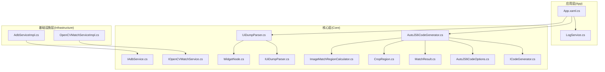
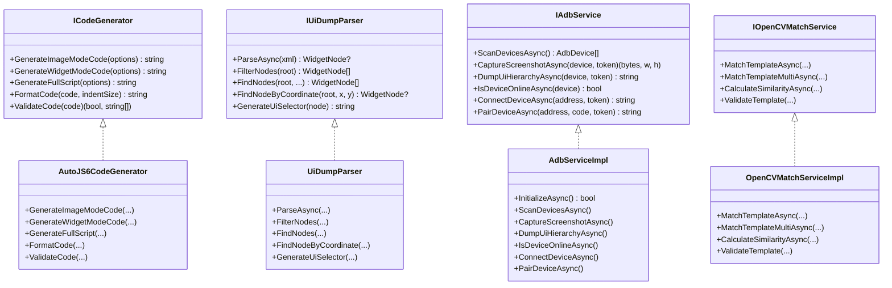
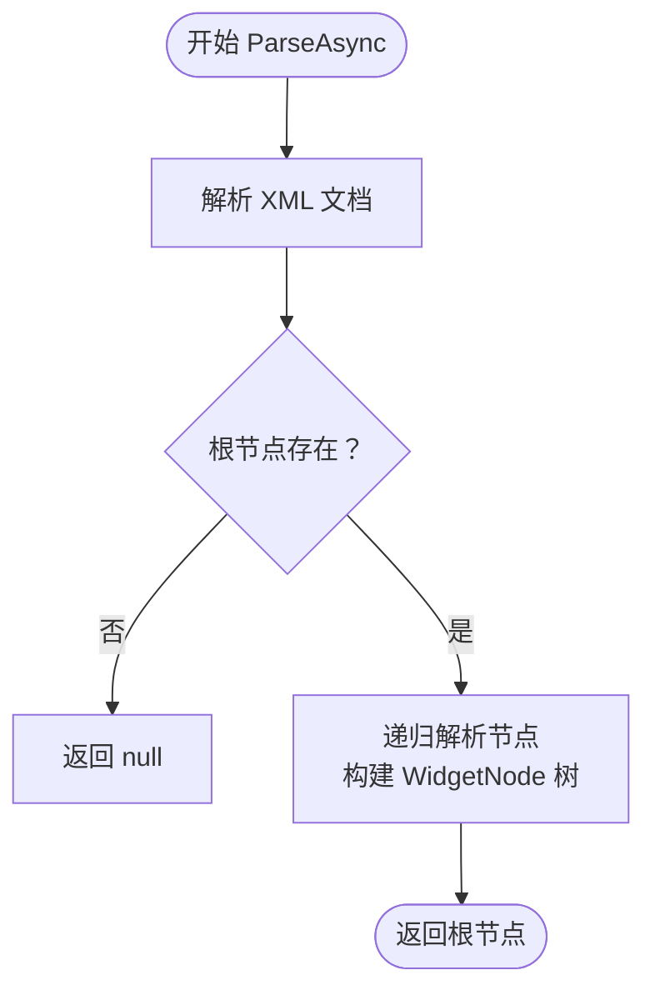
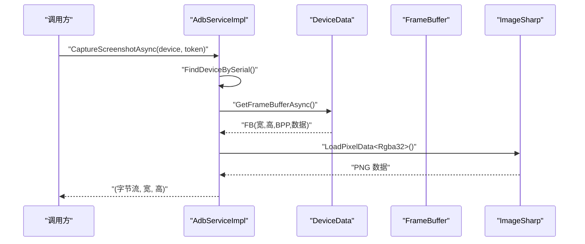
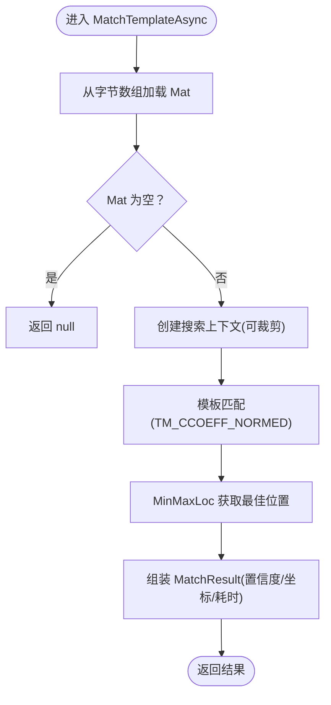
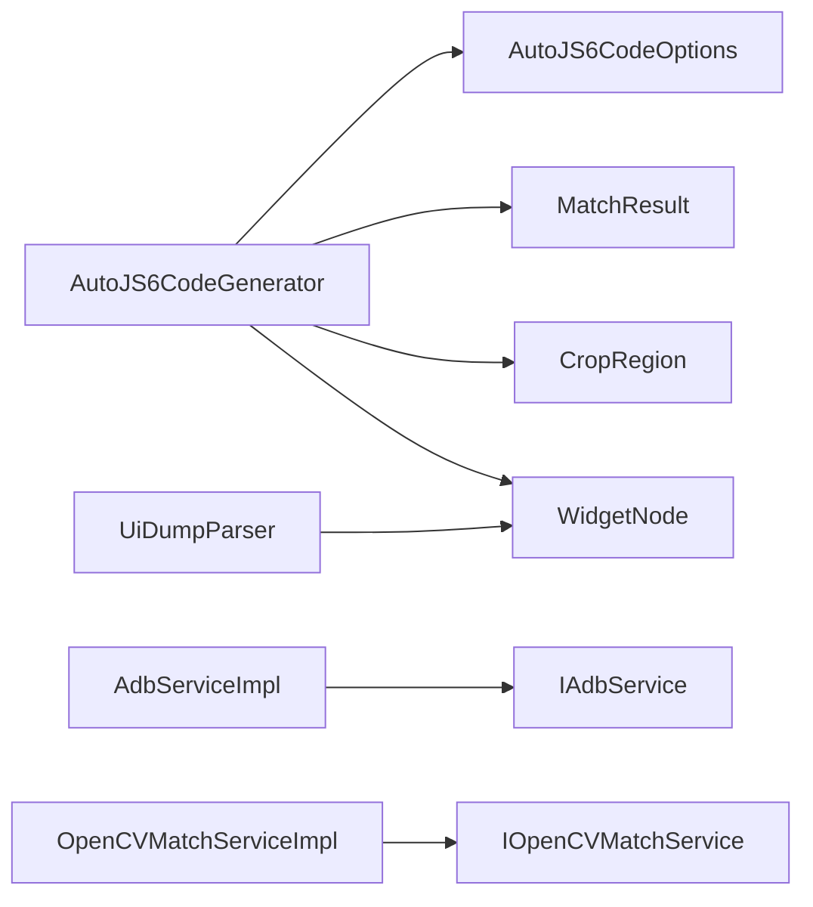

# 服务架构

<cite>
**本文引用的文件**
- [ICodeGenerator.cs](file://Core/Abstractions/ICodeGenerator.cs)
- [IAdbService.cs](file://Core/Abstractions/IAdbService.cs)
- [IOpenCVMatchService.cs](file://Core/Abstractions/IOpenCVMatchService.cs)
- [IUiDumpParser.cs](file://Core/Abstractions/IUiDumpParser.cs)
- [AutoJS6CodeGenerator.cs](file://Core/Services/AutoJS6CodeGenerator.cs)
- [UiDumpParser.cs](file://Core/Services/UiDumpParser.cs)
- [AdbServiceImpl.cs](file://Infrastructure/Adb/AdbServiceImpl.cs)
- [OpenCVMatchServiceImpl.cs](file://Infrastructure/Imaging/OpenCVMatchServiceImpl.cs)
- [AutoJS6CodeOptions.cs](file://Core/Models/AutoJS6CodeOptions.cs)
- [WidgetNode.cs](file://Core/Models/WidgetNode.cs)
- [MatchResult.cs](file://Core/Models/MatchResult.cs)
- [CropRegion.cs](file://Core/Models/CropRegion.cs)
- [LogService.cs](file://App/Services/LogService.cs)
- [ImageMatchRegionCalculator.cs](file://Core/Helpers/ImageMatchRegionCalculator.cs)
- [AutoJS6CodeGeneratorTests.cs](file://Core.Tests/AutoJS6CodeGeneratorTests.cs)
- [UiDumpParserTests.cs](file://Core.Tests/UiDumpParserTests.cs)
- [ImageMatchRegionCalculatorTests.cs](file://Core.Tests/ImageMatchRegionCalculatorTests.cs)
- [App.xaml.cs](file://App/App.xaml.cs)
</cite>

## 目录
1. [引言](#引言)
2. [项目结构](#项目结构)
3. [核心组件](#核心组件)
4. [架构总览](#架构总览)
5. [详细组件分析](#详细组件分析)
6. [依赖关系分析](#依赖关系分析)
7. [性能考量](#性能考量)
8. [故障排查指南](#故障排查指南)
9. [结论](#结论)
10. [附录](#附录)

## 引言
本文件系统性梳理 AutoJS6 开发工具的服务架构，围绕核心服务接口 ICodeGenerator、IAdbService、IOpenCVMatchService、IUiDumpParser 的设计与实现展开，解释其职责划分、依赖注入组合方式、生命周期与异步处理策略，并给出扩展与测试的最佳实践，帮助开发者高效理解与维护该服务层。

## 项目结构
项目采用分层与领域驱动结合的组织方式：
- Core 层：抽象接口与领域模型，定义服务契约与数据结构
- Infrastructure 层：具体服务实现，对接外部依赖（ADB、OpenCV、图像处理等）
- App 层：应用入口与 UI 层，提供日志服务与主窗体
- Core.Tests：单元测试，验证关键服务行为



图表来源
- [App.xaml.cs:1-57](file://App/App.xaml.cs#L1-L57)
- [LogService.cs:1-51](file://App/Services/LogService.cs#L1-L51)
- [ICodeGenerator.cs:1-46](file://Core/Abstractions/ICodeGenerator.cs#L1-L46)
- [IAdbService.cs:1-57](file://Core/Abstractions/IAdbService.cs#L1-L57)
- [IOpenCVMatchService.cs:1-57](file://Core/Abstractions/IOpenCVMatchService.cs#L1-L57)
- [IUiDumpParser.cs:1-56](file://Core/Abstractions/IUiDumpParser.cs#L1-L56)
- [AutoJS6CodeGenerator.cs:1-357](file://Core/Services/AutoJS6CodeGenerator.cs#L1-L357)
- [UiDumpParser.cs:1-263](file://Core/Services/UiDumpParser.cs#L1-L263)
- [AdbServiceImpl.cs:1-238](file://Infrastructure/Adb/AdbServiceImpl.cs#L1-L238)
- [OpenCVMatchServiceImpl.cs:1-204](file://Infrastructure/Imaging/OpenCVMatchServiceImpl.cs#L1-L204)
- [AutoJS6CodeOptions.cs:1-89](file://Core/Models/AutoJS6CodeOptions.cs#L1-L89)
- [WidgetNode.cs:1-93](file://Core/Models/WidgetNode.cs#L1-L93)
- [MatchResult.cs:1-63](file://Core/Models/MatchResult.cs#L1-L63)
- [CropRegion.cs:1-53](file://Core/Models/CropRegion.cs#L1-L53)
- [ImageMatchRegionCalculator.cs:1-99](file://Core/Helpers/ImageMatchRegionCalculator.cs#L1-L99)

章节来源
- [App.xaml.cs:1-57](file://App/App.xaml.cs#L1-L57)
- [LogService.cs:1-51](file://App/Services/LogService.cs#L1-L51)
- [ICodeGenerator.cs:1-46](file://Core/Abstractions/ICodeGenerator.cs#L1-L46)
- [IAdbService.cs:1-57](file://Core/Abstractions/IAdbService.cs#L1-L57)
- [IOpenCVMatchService.cs:1-57](file://Core/Abstractions/IOpenCVMatchService.cs#L1-L57)
- [IUiDumpParser.cs:1-56](file://Core/Abstractions/IUiDumpParser.cs#L1-L56)
- [AutoJS6CodeGenerator.cs:1-357](file://Core/Services/AutoJS6CodeGenerator.cs#L1-L357)
- [UiDumpParser.cs:1-263](file://Core/Services/UiDumpParser.cs#L1-L263)
- [AdbServiceImpl.cs:1-238](file://Infrastructure/Adb/AdbServiceImpl.cs#L1-L238)
- [OpenCVMatchServiceImpl.cs:1-204](file://Infrastructure/Imaging/OpenCVMatchServiceImpl.cs#L1-L204)
- [AutoJS6CodeOptions.cs:1-89](file://Core/Models/AutoJS6CodeOptions.cs#L1-L89)
- [WidgetNode.cs:1-93](file://Core/Models/WidgetNode.cs#L1-L93)
- [MatchResult.cs:1-63](file://Core/Models/MatchResult.cs#L1-L63)
- [CropRegion.cs:1-53](file://Core/Models/CropRegion.cs#L1-L53)
- [ImageMatchRegionCalculator.cs:1-99](file://Core/Helpers/ImageMatchRegionCalculator.cs#L1-L99)

## 核心组件
- ICodeGenerator：定义 AutoJS6 代码生成能力，覆盖图像模式、控件模式、完整脚本生成、代码格式化与校验
- IAdbService：定义 ADB 设备扫描、截图捕获、UI Dump、设备状态与网络连接/配对
- IOpenCVMatchService：定义模板匹配（单个/多个）、相似度计算与模板有效性校验
- IUiDumpParser：定义 UI Dump 解析、节点过滤、节点查询、坐标定位与 UiSelector 代码生成

章节来源
- [ICodeGenerator.cs:1-46](file://Core/Abstractions/ICodeGenerator.cs#L1-L46)
- [IAdbService.cs:1-57](file://Core/Abstractions/IAdbService.cs#L1-L57)
- [IOpenCVMatchService.cs:1-57](file://Core/Abstractions/IOpenCVMatchService.cs#L1-L57)
- [IUiDumpParser.cs:1-56](file://Core/Abstractions/IUiDumpParser.cs#L1-L56)

## 架构总览
服务层通过接口隔离与实现解耦，配合模型层的数据结构完成端到端流程：
- 应用层负责启动与 UI 交互，日志服务统一输出
- 核心服务实现业务逻辑：代码生成、UI Dump 解析
- 基础设施实现外部依赖：ADB 通信、OpenCV 图像匹配
- 测试层验证关键行为与边界条件



图表来源
- [ICodeGenerator.cs:1-46](file://Core/Abstractions/ICodeGenerator.cs#L1-L46)
- [AutoJS6CodeGenerator.cs:1-357](file://Core/Services/AutoJS6CodeGenerator.cs#L1-L357)
- [IUiDumpParser.cs:1-56](file://Core/Abstractions/IUiDumpParser.cs#L1-L56)
- [UiDumpParser.cs:1-263](file://Core/Services/UiDumpParser.cs#L1-L263)
- [IAdbService.cs:1-57](file://Core/Abstractions/IAdbService.cs#L1-L57)
- [AdbServiceImpl.cs:1-238](file://Infrastructure/Adb/AdbServiceImpl.cs#L1-L238)
- [IOpenCVMatchService.cs:1-57](file://Core/Abstractions/IOpenCVMatchService.cs#L1-L57)
- [OpenCVMatchServiceImpl.cs:1-204](file://Infrastructure/Imaging/OpenCVMatchServiceImpl.cs#L1-L204)

## 详细组件分析

### ICodeGenerator 接口与 AutoJS6CodeGenerator 实现
- 设计理念
  - 明确分离“生成”“格式化”“校验”三类职责，便于替换与测试
  - 遵循引擎约束（如 Rhino 循环体内禁止 const/let），在生成与校验阶段共同保障兼容性
- 关键实现要点
  - 图像模式：支持重试、区域裁剪、模板回收；生成 images.findImage 调用与点击坐标计算
  - 控件模式：优先 id/text/desc 降级策略，支持 boundsInside 精确定位与点击
  - 完整脚本：拼接头部与模式代码，统一输出
  - 格式化：基于缩进层级的简单美化
  - 校验：检测循环体内 const/let 使用，返回错误清单
- 依赖关系
  - 使用 AutoJS6CodeOptions、MatchResult、CropRegion、WidgetNode 等模型
  - 通过 ImageMatchRegionCalculator 生成 regionRef 与方向信息

```mermaid
sequenceDiagram
participant Caller as "调用方"
participant Gen as "AutoJS6CodeGenerator"
participant Opt as "AutoJS6CodeOptions"
Caller->>Gen : "GenerateFullScript(options)"
alt "模式=图像"
Gen->>Gen : "GenerateImageModeCode(options)"
Gen->>Opt : "读取阈值/区域/模板路径"
Gen-->>Caller : "返回图像模式代码"
else "模式=控件"
Gen->>Gen : "GenerateWidgetModeCode(options)"
Gen->>Opt : "读取 WidgetNode"
Gen-->>Caller : "返回控件模式代码"
end
Gen-->>Caller : "返回完整脚本"
```

图表来源
- [AutoJS6CodeGenerator.cs:166-189](file://Core/Services/AutoJS6CodeGenerator.cs#L166-L189)
- [AutoJS6CodeGenerator.cs:13-102](file://Core/Services/AutoJS6CodeGenerator.cs#L13-L102)
- [AutoJS6CodeGenerator.cs:104-164](file://Core/Services/AutoJS6CodeGenerator.cs#L104-L164)
- [AutoJS6CodeOptions.cs:1-89](file://Core/Models/AutoJS6CodeOptions.cs#L1-L89)

章节来源
- [ICodeGenerator.cs:1-46](file://Core/Abstractions/ICodeGenerator.cs#L1-L46)
- [AutoJS6CodeGenerator.cs:1-357](file://Core/Services/AutoJS6CodeGenerator.cs#L1-L357)
- [AutoJS6CodeOptions.cs:1-89](file://Core/Models/AutoJS6CodeOptions.cs#L1-L89)
- [MatchResult.cs:1-63](file://Core/Models/MatchResult.cs#L1-L63)
- [CropRegion.cs:1-53](file://Core/Models/CropRegion.cs#L1-L53)
- [WidgetNode.cs:1-93](file://Core/Models/WidgetNode.cs#L1-L93)
- [ImageMatchRegionCalculator.cs:1-99](file://Core/Helpers/ImageMatchRegionCalculator.cs#L1-L99)

### IUiDumpParser 接口与 UiDumpParser 实现
- 设计理念
  - 以 XML 为中心的树形结构解析，提供过滤、查询、坐标定位与 UiSelector 生成
  - 布局容器过滤规则减少冗余节点，提升后续选择器稳定性
- 关键实现要点
  - 解析：基于 LINQ to XML，递归构建 WidgetNode 树
  - 过滤：识别仅含布局语义的容器节点并剔除
  - 查询：支持按资源 ID、文本、内容描述、类名筛选
  - 坐标定位：自顶向下优先匹配最深节点
  - 选择器生成：按 id > text > desc > className > boundsInside 顺序组合
- 性能与健壮性
  - 解析过程封装在后台任务中，异常时返回空结果



图表来源
- [UiDumpParser.cs:14-35](file://Core/Services/UiDumpParser.cs#L14-L35)
- [UiDumpParser.cs:103-154](file://Core/Services/UiDumpParser.cs#L103-L154)

章节来源
- [IUiDumpParser.cs:1-56](file://Core/Abstractions/IUiDumpParser.cs#L1-L56)
- [UiDumpParser.cs:1-263](file://Core/Services/UiDumpParser.cs#L1-L263)
- [WidgetNode.cs:1-93](file://Core/Models/WidgetNode.cs#L1-L93)

### IAdbService 接口与 AdbServiceImpl 实现
- 设计理念
  - 对外暴露统一的 ADB 能力，屏蔽底层客户端细节
  - 支持 TCP/IP 连接与配对，提供截图与 UI Dump 获取
- 关键实现要点
  - 初始化：自动发现 adb.exe 并启动 ADB 服务
  - 设备扫描：映射设备信息为 Core.Models.AdbDevice
  - 截图：帧缓冲区处理、行填充去除、Rgba32 转 PNG
  - UI Dump：DeviceClient 异步获取 XML
  - 网络连接/配对：调用底层 AdbClient API，异常包装为可诊断错误
- 生命周期
  - 通过构造函数注入 adb 路径，初始化时启动服务；截图/Dump 在调用时异步执行



图表来源
- [AdbServiceImpl.cs:72-118](file://Infrastructure/Adb/AdbServiceImpl.cs#L72-L118)
- [AdbServiceImpl.cs:181-184](file://Infrastructure/Adb/AdbServiceImpl.cs#L181-L184)

章节来源
- [IAdbService.cs:1-57](file://Core/Abstractions/IAdbService.cs#L1-L57)
- [AdbServiceImpl.cs:1-238](file://Infrastructure/Adb/AdbServiceImpl.cs#L1-L238)

### IOpenCVMatchService 接口与 OpenCVMatchServiceImpl 实现
- 设计理念
  - 提供高性能模板匹配与相似度计算，支持区域裁剪与多匹配
- 关键实现要点
  - 单匹配：归一化相关系数匹配，返回最佳位置与置信度
  - 多匹配：遍历结果矩阵，收集高于阈值的所有候选
  - 相似度：直接匹配返回最大值
  - 模板校验：确保模板非空且尺寸有效
  - 上下文管理：SearchContext 自动处理区域偏移与内存释放
- 异步与并发
  - 所有方法在后台线程执行，避免阻塞 UI



图表来源
- [OpenCVMatchServiceImpl.cs:13-60](file://Infrastructure/Imaging/OpenCVMatchServiceImpl.cs#L13-L60)
- [OpenCVMatchServiceImpl.cs:163-177](file://Infrastructure/Imaging/OpenCVMatchServiceImpl.cs#L163-L177)

章节来源
- [IOpenCVMatchService.cs:1-57](file://Core/Abstractions/IOpenCVMatchService.cs#L1-L57)
- [OpenCVMatchServiceImpl.cs:1-204](file://Infrastructure/Imaging/OpenCVMatchServiceImpl.cs#L1-L204)
- [MatchResult.cs:1-63](file://Core/Models/MatchResult.cs#L1-L63)
- [CropRegion.cs:1-53](file://Core/Models/CropRegion.cs#L1-L53)

### 服务组合与依赖注入使用建议
- 当前实现风格
  - 服务以接口形式暴露，具体实现位于 Infrastructure/Core.Services 中
  - 应用层通过构造函数注入或静态工厂获取服务实例
- 组合示例思路
  - 代码生成器依赖 UI Dump 解析器（用于控件模式）与匹配服务（用于图像模式）
  - ADB 服务为外部依赖，被 UI Dump 解析器与图像匹配流程间接使用
- 生命周期与异步
  - 服务方法多为异步，调用方需正确传递 CancellationToken
  - ADB 服务在初始化阶段启动服务，其余方法按需异步执行

章节来源
- [AutoJS6CodeGenerator.cs:1-357](file://Core/Services/AutoJS6CodeGenerator.cs#L1-L357)
- [UiDumpParser.cs:1-263](file://Core/Services/UiDumpParser.cs#L1-L263)
- [AdbServiceImpl.cs:1-238](file://Infrastructure/Adb/AdbServiceImpl.cs#L1-L238)
- [OpenCVMatchServiceImpl.cs:1-204](file://Infrastructure/Imaging/OpenCVMatchServiceImpl.cs#L1-L204)

## 依赖关系分析
- 接口与实现
  - ICodeGenerator → AutoJS6CodeGenerator
  - IUiDumpParser → UiDumpParser
  - IAdbService → AdbServiceImpl
  - IOpenCVMatchService → OpenCVMatchServiceImpl
- 模型依赖
  - 代码生成器与 UI Dump 解析器均依赖 WidgetNode、MatchResult、CropRegion、AutoJS6CodeOptions
  - 匹配服务与区域计算器协同生成 regionRef 与方向信息
- 外部依赖
  - ADB 服务依赖 AdvancedSharpAdbClient 与 ImageSharp
  - 匹配服务依赖 OpenCvSharp



图表来源
- [AutoJS6CodeGenerator.cs:1-357](file://Core/Services/AutoJS6CodeGenerator.cs#L1-L357)
- [UiDumpParser.cs:1-263](file://Core/Services/UiDumpParser.cs#L1-L263)
- [AdbServiceImpl.cs:1-238](file://Infrastructure/Adb/AdbServiceImpl.cs#L1-L238)
- [OpenCVMatchServiceImpl.cs:1-204](file://Infrastructure/Imaging/OpenCVMatchServiceImpl.cs#L1-L204)
- [AutoJS6CodeOptions.cs:1-89](file://Core/Models/AutoJS6CodeOptions.cs#L1-L89)
- [WidgetNode.cs:1-93](file://Core/Models/WidgetNode.cs#L1-L93)
- [MatchResult.cs:1-63](file://Core/Models/MatchResult.cs#L1-L63)
- [CropRegion.cs:1-53](file://Core/Models/CropRegion.cs#L1-L53)

章节来源
- [AutoJS6CodeGenerator.cs:1-357](file://Core/Services/AutoJS6CodeGenerator.cs#L1-L357)
- [UiDumpParser.cs:1-263](file://Core/Services/UiDumpParser.cs#L1-L263)
- [AdbServiceImpl.cs:1-238](file://Infrastructure/Adb/AdbServiceImpl.cs#L1-L238)
- [OpenCVMatchServiceImpl.cs:1-204](file://Infrastructure/Imaging/OpenCVMatchServiceImpl.cs#L1-L204)
- [AutoJS6CodeOptions.cs:1-89](file://Core/Models/AutoJS6CodeOptions.cs#L1-L89)
- [WidgetNode.cs:1-93](file://Core/Models/WidgetNode.cs#L1-L93)
- [MatchResult.cs:1-63](file://Core/Models/MatchResult.cs#L1-L63)
- [CropRegion.cs:1-53](file://Core/Models/CropRegion.cs#L1-L53)

## 性能考量
- 异步与并发
  - 截图、UI Dump、模板匹配均在后台线程执行，避免 UI 卡顿
  - ADB 帧缓冲区处理考虑行填充，按行拷贝去除填充，减少无效像素处理
- 算法与数据结构
  - 模板匹配使用归一化相关系数，兼顾鲁棒性与速度
  - 多匹配遍历结果矩阵，阈值过滤后批量返回
- 资源管理
  - OpenCV Mat 与 ImageSharp Image 在 using 中自动释放
  - SearchContext 管理区域 Mat 的所有权，避免内存泄漏
- I/O 与序列化
  - UI Dump 解析使用 LINQ to XML，解析完成后立即返回对象树
  - 代码生成器使用 StringBuilder 减少字符串拼接开销

章节来源
- [AdbServiceImpl.cs:72-118](file://Infrastructure/Adb/AdbServiceImpl.cs#L72-L118)
- [OpenCVMatchServiceImpl.cs:13-122](file://Infrastructure/Imaging/OpenCVMatchServiceImpl.cs#L13-L122)
- [OpenCVMatchServiceImpl.cs:179-202](file://Infrastructure/Imaging/OpenCVMatchServiceImpl.cs#L179-L202)
- [UiDumpParser.cs:14-35](file://Core/Services/UiDumpParser.cs#L14-L35)

## 故障排查指南
- ADB 相关
  - 启动失败：检查 adb.exe 路径与环境变量，确认 Android SDK platform-tools 可用
  - 设备未在线：确认设备状态与 USB/TCP 连接
  - 截图失败：检查截图权限与设备状态，关注帧缓冲区尺寸与行填充
- 匹配相关
  - 匹配结果为空：调整阈值、检查模板有效性、缩小搜索区域
  - 多匹配无结果：确认图像尺寸一致与算法参数设置
- UI Dump 解析
  - XML 解析异常：确认 UI Dump 来源与完整性
  - 坐标定位不准确：核对 bounds 字符串格式与坐标系
- 代码生成
  - 循环体内 const/let 报错：使用 ValidateCode 检查并修正
  - 选择器失效：优先使用 id，降级至 text/desc，补充 boundsInside

章节来源
- [AdbServiceImpl.cs:33-49](file://Infrastructure/Adb/AdbServiceImpl.cs#L33-L49)
- [AdbServiceImpl.cs:150-179](file://Infrastructure/Adb/AdbServiceImpl.cs#L150-L179)
- [OpenCVMatchServiceImpl.cs:150-161](file://Infrastructure/Imaging/OpenCVMatchServiceImpl.cs#L150-L161)
- [UiDumpParser.cs:14-35](file://Core/Services/UiDumpParser.cs#L14-L35)
- [AutoJS6CodeGenerator.cs:226-258](file://Core/Services/AutoJS6CodeGenerator.cs#L226-L258)

## 结论
该服务架构通过清晰的接口分层与实现解耦，将业务逻辑（代码生成、UI 解析）与外部依赖（ADB、OpenCV）有效隔离。异步与资源管理策略保证了性能与稳定性；测试用例覆盖关键行为，便于持续演进与扩展。

## 附录

### 服务扩展与自定义指南
- 新增服务接口
  - 在 Core/Abstractions 下定义新接口，明确职责边界与输入输出
- 实现服务
  - 在 Infrastructure 或 Core.Services 下新增实现类，遵循现有命名与异常处理模式
  - 如涉及外部库，确保资源释放与异步调用
- 集成第三方服务
  - 保持接口不变，通过适配器模式对接第三方 SDK
  - 在应用层通过依赖注入注册新实现
- 最佳实践
  - 优先使用异步方法与 CancellationToken
  - 对外部输入进行参数校验与边界保护
  - 为关键路径增加日志记录与错误包装

章节来源
- [ICodeGenerator.cs:1-46](file://Core/Abstractions/ICodeGenerator.cs#L1-L46)
- [IUiDumpParser.cs:1-56](file://Core/Abstractions/IUiDumpParser.cs#L1-L56)
- [IAdbService.cs:1-57](file://Core/Abstractions/IAdbService.cs#L1-L57)
- [IOpenCVMatchService.cs:1-57](file://Core/Abstractions/IOpenCVMatchService.cs#L1-L57)

### 服务测试策略与最佳实践
- 单元测试
  - 覆盖关键分支与边界条件：图像模式/控件模式、多匹配、坐标定位、区域计算器
  - 使用断言验证生成代码片段与选择器顺序
- 测试数据
  - 使用简短 XML 片段与固定尺寸图像，确保可重复性
- 异步与并发
  - 在测试中验证异步方法的完成与异常传播
- 日志与可观测性
  - 通过日志服务统一输出，便于调试与回归

章节来源
- [AutoJS6CodeGeneratorTests.cs:1-80](file://Core.Tests/AutoJS6CodeGeneratorTests.cs#L1-L80)
- [UiDumpParserTests.cs:1-74](file://Core.Tests/UiDumpParserTests.cs#L1-L74)
- [ImageMatchRegionCalculatorTests.cs:1-60](file://Core.Tests/ImageMatchRegionCalculatorTests.cs#L1-L60)
- [LogService.cs:1-51](file://App/Services/LogService.cs#L1-L51)