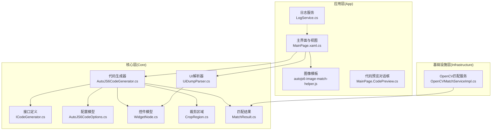
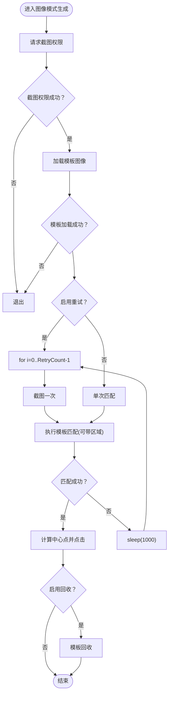
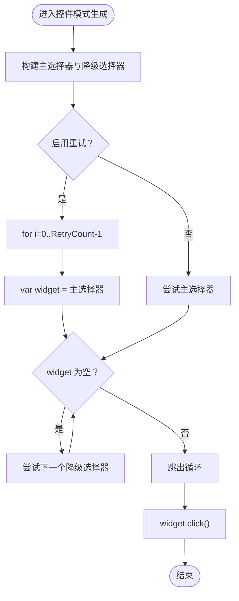
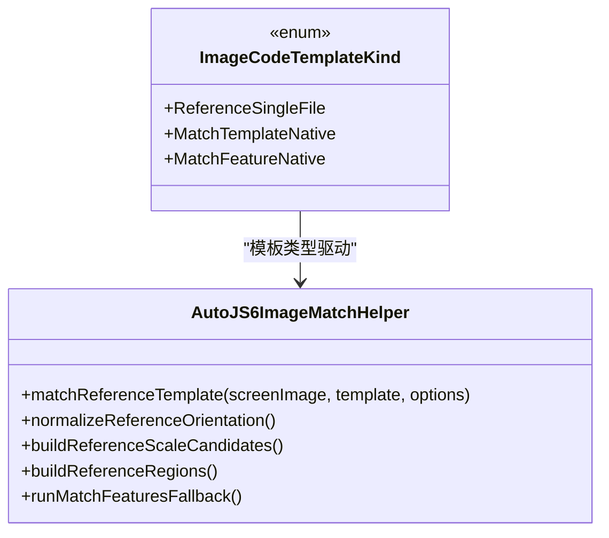
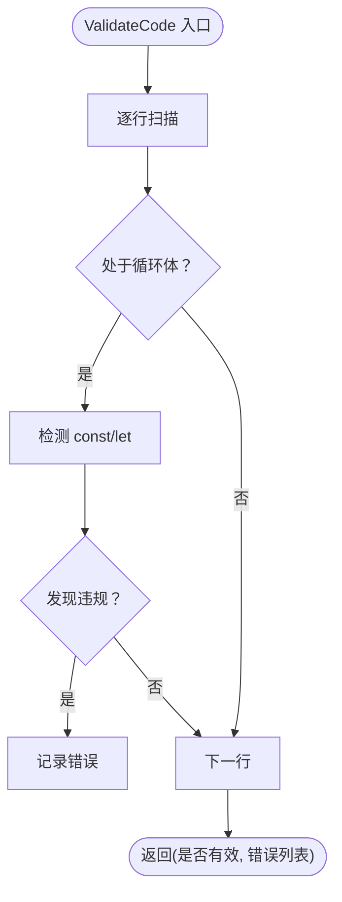
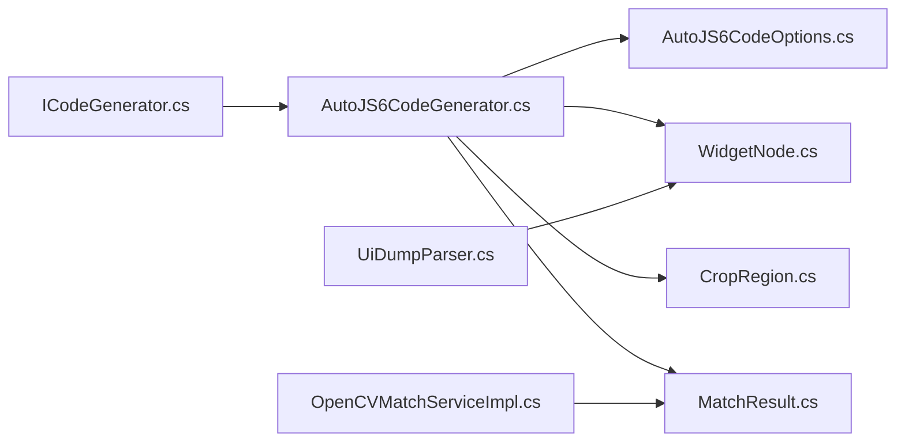

# AutoJS6 代码生成器

<cite>
**本文引用的文件**
- [AutoJS6CodeOptions.cs](file://Core/Models/AutoJS6CodeOptions.cs)
- [AutoJS6CodeGenerator.cs](file://Core/Services/AutoJS6CodeGenerator.cs)
- [ICodeGenerator.cs](file://Core/Abstractions/ICodeGenerator.cs)
- [WidgetNode.cs](file://Core/Models/WidgetNode.cs)
- [CropRegion.cs](file://Core/Models/CropRegion.cs)
- [MatchResult.cs](file://Core/Models/MatchResult.cs)
- [OpenCVMatchServiceImpl.cs](file://Infrastructure/Imaging/OpenCVMatchServiceImpl.cs)
- [UiDumpParser.cs](file://Core/Services/UiDumpParser.cs)
- [ImageCodeTemplateKind.cs](file://App/Models/ImageCodeTemplateKind.cs)
- [autojs6-image-match-helper.js](file://App/CodeTemplates/image/autojs6-image-match-helper.js)
- [MainPage.CodePreview.cs](file://App/Views/MainPage.CodePreview.cs)
- [MainPage.xaml.cs](file://App/Views/MainPage.xaml.cs)
- [LogService.cs](file://App/Services/LogService.cs)
- [README.md](file://README.md)
- [AutoJS6CodeGeneratorTests.cs](file://Core.Tests/AutoJS6CodeGeneratorTests.cs)
</cite>

## 目录
1. [简介](#简介)
2. [项目结构](#项目结构)
3. [核心组件](#核心组件)
4. [架构总览](#架构总览)
5. [详细组件分析](#详细组件分析)
6. [依赖关系分析](#依赖关系分析)
7. [性能考虑](#性能考虑)
8. [故障排查指南](#故障排查指南)
9. [结论](#结论)
10. [附录](#附录)

## 简介
本文件面向 AutoJS6 代码生成器的实现与使用，系统性阐述以下主题：
- 图像模式与控件模式的生成策略差异
- 模板选择机制与代码拼接逻辑
- AutoJS6CodeOptions 配置项设计与自定义方法
- 代码模板系统（含模板加载、变量替换与格式化）
- 具体生成示例（图像匹配、控件点击、循环处理）
- 代码验证与错误处理（语法检查、逻辑验证、异常捕获）
- 性能优化策略、代码压缩与兼容性处理
- 模板扩展与定制化方案

## 项目结构
该工具采用分层架构，核心业务逻辑位于 Core 层，基础设施适配在 Infrastructure 层，应用界面在 App 层。代码生成器位于 Core.Services，模型与接口位于 Core.Models 与 Core.Abstractions。



图表来源
- [MainPage.xaml.cs:1-200](file://App/Views/MainPage.xaml.cs#L1-L200)
- [AutoJS6CodeGenerator.cs:1-357](file://Core/Services/AutoJS6CodeGenerator.cs#L1-L357)
- [ICodeGenerator.cs:1-46](file://Core/Abstractions/ICodeGenerator.cs#L1-L46)
- [AutoJS6CodeOptions.cs:1-89](file://Core/Models/AutoJS6CodeOptions.cs#L1-L89)
- [WidgetNode.cs:1-93](file://Core/Models/WidgetNode.cs#L1-L93)
- [CropRegion.cs:1-53](file://Core/Models/CropRegion.cs#L1-L53)
- [MatchResult.cs:1-63](file://Core/Models/MatchResult.cs#L1-L63)
- [UiDumpParser.cs:1-263](file://Core/Services/UiDumpParser.cs#L1-L263)
- [OpenCVMatchServiceImpl.cs:1-204](file://Infrastructure/Imaging/OpenCVMatchServiceImpl.cs#L1-L204)
- [autojs6-image-match-helper.js:1-528](file://App/CodeTemplates/image/autojs6-image-match-helper.js#L1-L528)
- [MainPage.CodePreview.cs:1-268](file://App/Views/MainPage.CodePreview.cs#L1-L268)
- [LogService.cs:1-51](file://App/Services/LogService.cs#L1-L51)

章节来源
- [README.md:230-260](file://README.md#L230-L260)
- [MainPage.xaml.cs:1-200](file://App/Views/MainPage.xaml.cs#L1-L200)

## 核心组件
- 接口 ICodeGenerator：定义图像模式、控件模式、完整脚本生成、代码格式化与验证等能力。
- 实现 AutoJS6CodeGenerator：依据 AutoJS6 运行时约束（Rhino 引擎限制、内存与性能建议），分别生成图像匹配与控件点击代码，并支持重试、超时、日志与资源回收。
- 配置模型 AutoJS6CodeOptions：集中管理生成选项，包括模式、阈值、重试次数、超时、变量前缀、模板路径、裁剪区域、控件选择器、功能开关等。
- 数据模型：WidgetNode（控件属性与边界）、CropRegion（匹配区域）、MatchResult（OpenCV 匹配结果）。
- UI 解析器 UiDumpParser：从 uiautomator dump XML 构建 WidgetNode 树，生成 UiSelector 选择器链。
- OpenCV 匹配服务 OpenCVMatchServiceImpl：提供模板匹配、多点匹配与相似度计算，支持区域裁剪与阈值控制。
- 图像模板 autojs6-image-match-helper.js：提供参考分辨率、区域映射、缩放候选、特征匹配回退等高级匹配能力，供应用侧模板系统使用。

章节来源
- [ICodeGenerator.cs:1-46](file://Core/Abstractions/ICodeGenerator.cs#L1-L46)
- [AutoJS6CodeGenerator.cs:1-357](file://Core/Services/AutoJS6CodeGenerator.cs#L1-L357)
- [AutoJS6CodeOptions.cs:1-89](file://Core/Models/AutoJS6CodeOptions.cs#L1-L89)
- [WidgetNode.cs:1-93](file://Core/Models/WidgetNode.cs#L1-L93)
- [CropRegion.cs:1-53](file://Core/Models/CropRegion.cs#L1-L53)
- [MatchResult.cs:1-63](file://Core/Models/MatchResult.cs#L1-L63)
- [UiDumpParser.cs:1-263](file://Core/Services/UiDumpParser.cs#L1-L263)
- [OpenCVMatchServiceImpl.cs:1-204](file://Infrastructure/Imaging/OpenCVMatchServiceImpl.cs#L1-L204)
- [autojs6-image-match-helper.js:1-528](file://App/CodeTemplates/image/autojs6-image-match-helper.js#L1-L528)

## 架构总览
代码生成器遵循“纯业务逻辑、无 UI 依赖”的原则，通过接口隔离与依赖注入，实现与 UI 层与基础设施层的解耦。生成流程如下：

```mermaid
sequenceDiagram
participant UI as "应用界面"
participant Gen as "AutoJS6CodeGenerator"
participant Opt as "AutoJS6CodeOptions"
participant Sel as "UiSelector构建"
participant Img as "图像模板"
UI->>Gen : 调用生成接口(图像/控件)
Gen->>Opt : 读取配置(模式/阈值/重试/超时/变量前缀)
alt 图像模式
Gen->>Img : 加载模板/区域匹配/点击坐标计算
else 控件模式
Gen->>Sel : 构建主选择器与降级选择器
end
Gen-->>UI : 返回生成的 JavaScript 代码
UI->>UI : 格式化/预览/复制
```

图表来源
- [AutoJS6CodeGenerator.cs:13-189](file://Core/Services/AutoJS6CodeGenerator.cs#L13-L189)
- [ICodeGenerator.cs:10-44](file://Core/Abstractions/ICodeGenerator.cs#L10-L44)
- [autojs6-image-match-helper.js:18-160](file://App/CodeTemplates/image/autojs6-image-match-helper.js#L18-L160)

## 详细组件分析

### AutoJS6CodeOptions 配置设计
- 模式 Mode：决定生成图像模式还是控件模式。
- 阈值 Threshold：模板匹配阈值，默认 0.8，范围 0.0-1.0。
- 重试次数 RetryCount：默认 3，用于循环重试。
- 超时 TimeoutMilliseconds：默认 5000ms，用于整体流程控制。
- 变量前缀 VariablePrefix：默认 "target"，用于生成变量名，避免冲突。
- 模板路径 TemplatePath：图像模式下必需，指向模板文件。
- 裁剪区域 Region：可选，指定区域匹配参数。
- 控件选择器 Widget：控件模式下必需，包含资源 ID、文本、内容描述、类名、边界等。
- 功能开关：GenerateRetryLogic、GenerateTimeoutLogic、GenerateLogging、GenerateImageRecycle。
- 方向 Orientation：横竖屏方向，影响参考分辨率与区域映射。

章节来源
- [AutoJS6CodeOptions.cs:6-89](file://Core/Models/AutoJS6CodeOptions.cs#L6-L89)

### 图像模式生成策略
- 权限与截图：请求截图权限，失败则退出；否则截取屏幕。
- 模板加载：读取模板图像，失败则退出。
- 匹配执行：支持区域匹配与阈值控制；计算点击坐标为中心点。
- 循环重试：可选重试逻辑，每次迭代仅调用一次截图，避免重复开销。
- 资源回收：可选回收模板图像，防止内存泄漏。
- 超时与日志：可选超时与日志输出，便于调试。



图表来源
- [AutoJS6CodeGenerator.cs:13-102](file://Core/Services/AutoJS6CodeGenerator.cs#L13-L102)
- [AutoJS6CodeGenerator.cs:260-288](file://Core/Services/AutoJS6CodeGenerator.cs#L260-L288)

章节来源
- [AutoJS6CodeGenerator.cs:13-102](file://Core/Services/AutoJS6CodeGenerator.cs#L13-L102)
- [AutoJS6CodeGenerator.cs:260-288](file://Core/Services/AutoJS6CodeGenerator.cs#L260-L288)

### 控件模式生成策略
- 主选择器优先级：资源 ID → 文本 → 内容描述 → 类名（可选边界）。
- 降级选择器：当主选择器为空时，依次尝试文本、内容描述等。
- 点击行为：若找到控件则点击，否则提示未找到。
- 可选重试：循环重试并逐步尝试降级选择器。



图表来源
- [AutoJS6CodeGenerator.cs:104-164](file://Core/Services/AutoJS6CodeGenerator.cs#L104-L164)
- [AutoJS6CodeGenerator.cs:290-355](file://Core/Services/AutoJS6CodeGenerator.cs#L290-L355)

章节来源
- [AutoJS6CodeGenerator.cs:104-164](file://Core/Services/AutoJS6CodeGenerator.cs#L104-L164)
- [AutoJS6CodeGenerator.cs:290-355](file://Core/Services/AutoJS6CodeGenerator.cs#L290-L355)

### 模板选择机制与代码拼接
- 图像模式：通过模板路径与可选裁剪区域生成匹配代码；支持阈值与区域参数拼接；点击坐标为中心点。
- 控件模式：根据 WidgetNode 的属性动态构建选择器链，优先使用稳定属性（如资源 ID），并在必要时加入边界限定。
- 代码拼接：使用 StringBuilder 顺序追加注释、声明、判断与调用，确保可读性与可维护性。

章节来源
- [AutoJS6CodeGenerator.cs:13-189](file://Core/Services/AutoJS6CodeGenerator.cs#L13-L189)
- [UiDumpParser.cs:61-97](file://Core/Services/UiDumpParser.cs#L61-L97)

### 代码模板系统
- 模板类型：图像模板枚举定义三种模板类型，用于区分不同模板风格与实现。
- 模板加载：应用层通过文件系统加载模板脚本，结合运行时参数（如方向、区域、阈值）进行匹配。
- 变量替换：通过字符串拼接与格式化函数，将配置项嵌入模板代码。
- 代码格式化：提供基础缩进格式化，提升可读性。



图表来源
- [ImageCodeTemplateKind.cs:1-9](file://App/Models/ImageCodeTemplateKind.cs#L1-L9)
- [autojs6-image-match-helper.js:18-160](file://App/CodeTemplates/image/autojs6-image-match-helper.js#L18-L160)

章节来源
- [ImageCodeTemplateKind.cs:1-9](file://App/Models/ImageCodeTemplateKind.cs#L1-L9)
- [autojs6-image-match-helper.js:1-528](file://App/CodeTemplates/image/autojs6-image-match-helper.js#L1-L528)

### 代码验证与错误处理
- 语法检查：检测 Rhino 引擎限制（循环体内禁止 const/let），改用 var。
- 逻辑验证：检查生成代码是否符合 AutoJS6 约束（如 OOM 防护、区域匹配、模板回收）。
- 异常捕获：生成器内部对模板加载、截图、匹配等关键步骤进行异常保护，保证流程健壮性。



图表来源
- [AutoJS6CodeGenerator.cs:226-258](file://Core/Services/AutoJS6CodeGenerator.cs#L226-L258)

章节来源
- [AutoJS6CodeGenerator.cs:226-258](file://Core/Services/AutoJS6CodeGenerator.cs#L226-L258)

### 具体生成示例
- 图像匹配代码：包含权限请求、模板加载、区域匹配、中心点点击与模板回收。
- 控件点击代码：包含主选择器与降级选择器、点击行为与未找到提示。
- 循环处理代码：重试逻辑与超时控制，确保在不稳定环境下仍可稳定运行。

章节来源
- [AutoJS6CodeGenerator.cs:13-189](file://Core/Services/AutoJS6CodeGenerator.cs#L13-L189)
- [README.md:191-219](file://README.md#L191-L219)

## 依赖关系分析
- 接口与实现：ICodeGenerator 定义能力，AutoJS6CodeGenerator 提供实现，确保可替换性与可测试性。
- 模型依赖：生成器依赖配置模型与数据模型；UI 解析器与 OpenCV 服务为外部依赖，通过接口隔离。
- 模板依赖：应用层模板脚本与生成器代码相互独立，通过参数传递与字符串拼接集成。



图表来源
- [ICodeGenerator.cs:1-46](file://Core/Abstractions/ICodeGenerator.cs#L1-L46)
- [AutoJS6CodeGenerator.cs:1-357](file://Core/Services/AutoJS6CodeGenerator.cs#L1-L357)
- [AutoJS6CodeOptions.cs:1-89](file://Core/Models/AutoJS6CodeOptions.cs#L1-L89)
- [WidgetNode.cs:1-93](file://Core/Models/WidgetNode.cs#L1-L93)
- [CropRegion.cs:1-53](file://Core/Models/CropRegion.cs#L1-L53)
- [MatchResult.cs:1-63](file://Core/Models/MatchResult.cs#L1-L63)
- [UiDumpParser.cs:1-263](file://Core/Services/UiDumpParser.cs#L1-L263)
- [OpenCVMatchServiceImpl.cs:1-204](file://Infrastructure/Imaging/OpenCVMatchServiceImpl.cs#L1-L204)

章节来源
- [ICodeGenerator.cs:1-46](file://Core/Abstractions/ICodeGenerator.cs#L1-L46)
- [AutoJS6CodeGenerator.cs:1-357](file://Core/Services/AutoJS6CodeGenerator.cs#L1-L357)

## 性能考虑
- 截图与匹配：每轮循环仅调用一次截图，避免重复开销；优先使用区域匹配缩小搜索范围。
- 模板回收：及时回收模板与中间图像对象，防止内存泄漏。
- 选择器优化：优先使用资源 ID，其次文本与内容描述，最后类名；在已知边界时加入 boundsInside 限定。
- OpenCV 匹配：使用 CCORR_NORMED 算法，合理设置阈值与区域，减少无效计算。

章节来源
- [README.md:342-374](file://README.md#L342-L374)
- [OpenCVMatchServiceImpl.cs:13-122](file://Infrastructure/Imaging/OpenCVMatchServiceImpl.cs#L13-L122)

## 故障排查指南
- 生成代码不符合 Rhino 约束：检查循环体内是否使用 const/let，改为 var。
- 未找到目标/控件：确认模板路径、阈值、区域参数与控件属性是否正确；检查是否启用重试与日志。
- 内存问题：确保模板与中间图像对象在使用后及时回收；避免在循环中重复创建大对象。
- 设备差异：使用参考分辨率与区域映射，结合方向参数，提升跨设备稳定性。

章节来源
- [AutoJS6CodeGenerator.cs:226-258](file://Core/Services/AutoJS6CodeGenerator.cs#L226-L258)
- [autojs6-image-match-helper.js:18-160](file://App/CodeTemplates/image/autojs6-image-match-helper.js#L18-L160)

## 结论
AutoJS6 代码生成器通过清晰的接口设计与严格的运行时约束，实现了图像模式与控件模式的高效代码生成。配合模板系统、验证机制与性能优化策略，能够在复杂设备环境与多变 UI 场景下稳定生成可运行的 AutoJS6 脚本。开发者可通过 AutoJS6CodeOptions 精细定制生成行为，并通过扩展模板与选择器策略满足更多场景需求。

## 附录

### 配置选项速查表
- Mode：图像/控件
- Threshold：模板匹配阈值（0.0-1.0）
- RetryCount：重试次数
- TimeoutMilliseconds：超时时间（毫秒）
- VariablePrefix：变量前缀
- TemplatePath：模板文件路径（图像模式）
- Region：裁剪区域（x,y,width,height）
- Widget：控件节点（控件模式）
- GenerateRetryLogic：生成重试逻辑
- GenerateTimeoutLogic：生成超时逻辑
- GenerateLogging：生成日志输出
- GenerateImageRecycle：生成图像回收
- Orientation：横竖屏方向

章节来源
- [AutoJS6CodeOptions.cs:6-89](file://Core/Models/AutoJS6CodeOptions.cs#L6-L89)

### 代码生成示例路径
- 图像模式：[AutoJS6CodeGenerator.cs:13-102](file://Core/Services/AutoJS6CodeGenerator.cs#L13-L102)
- 控件模式：[AutoJS6CodeGenerator.cs:104-164](file://Core/Services/AutoJS6CodeGenerator.cs#L104-L164)
- 完整脚本：[AutoJS6CodeGenerator.cs:166-189](file://Core/Services/AutoJS6CodeGenerator.cs#L166-L189)

### 测试用例参考
- 图像模式生成校验：[AutoJS6CodeGeneratorTests.cs:10-39](file://Core.Tests/AutoJS6CodeGeneratorTests.cs#L10-L39)
- 控件模式选择器顺序校验：[AutoJS6CodeGeneratorTests.cs:41-79](file://Core.Tests/AutoJS6CodeGeneratorTests.cs#L41-L79)