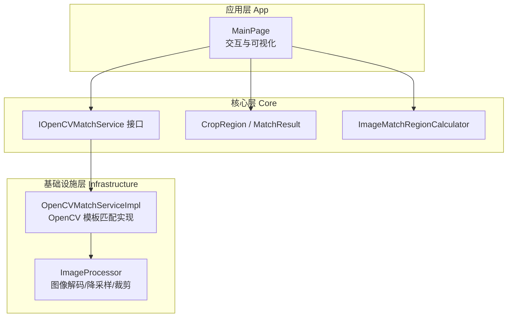
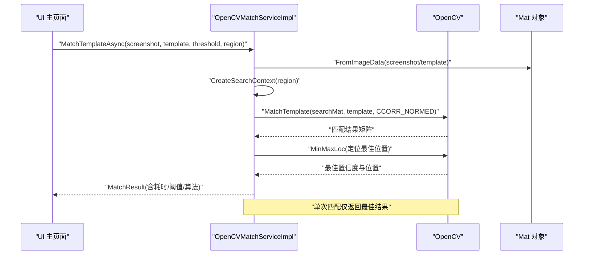
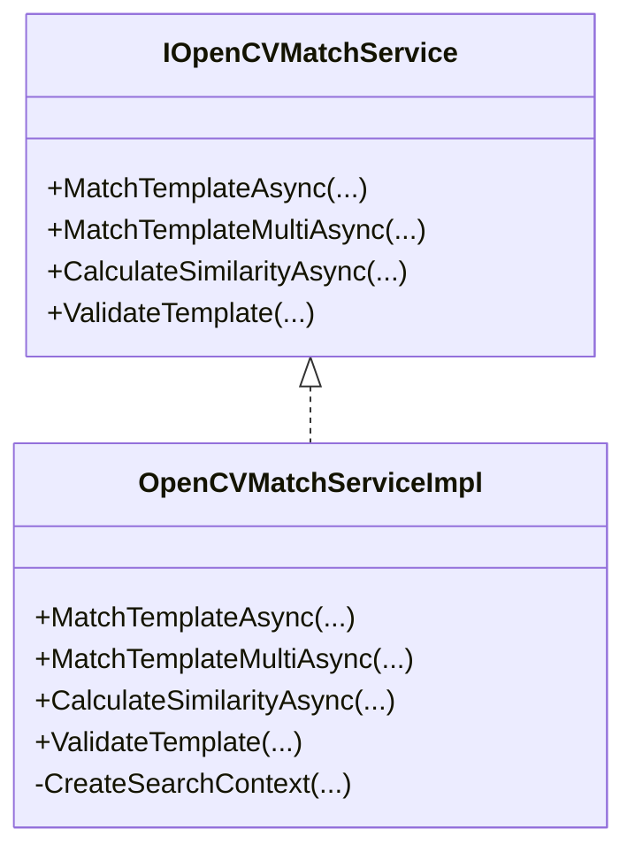
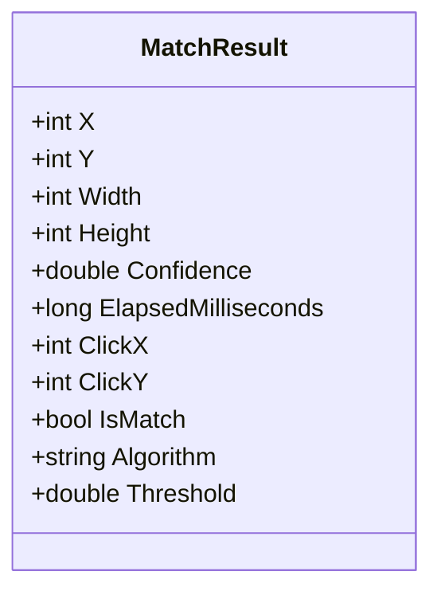
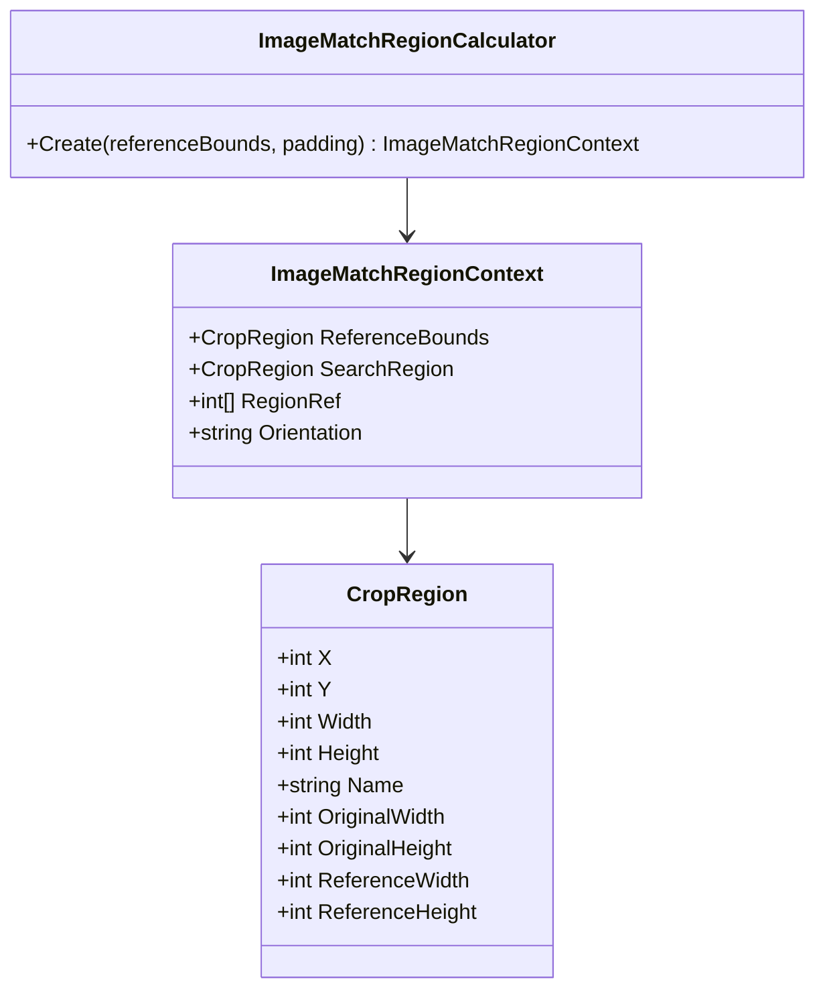
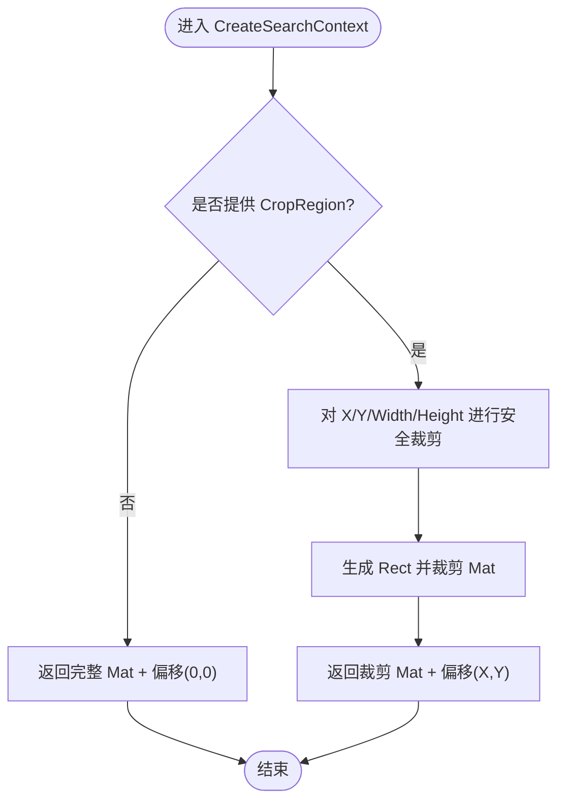
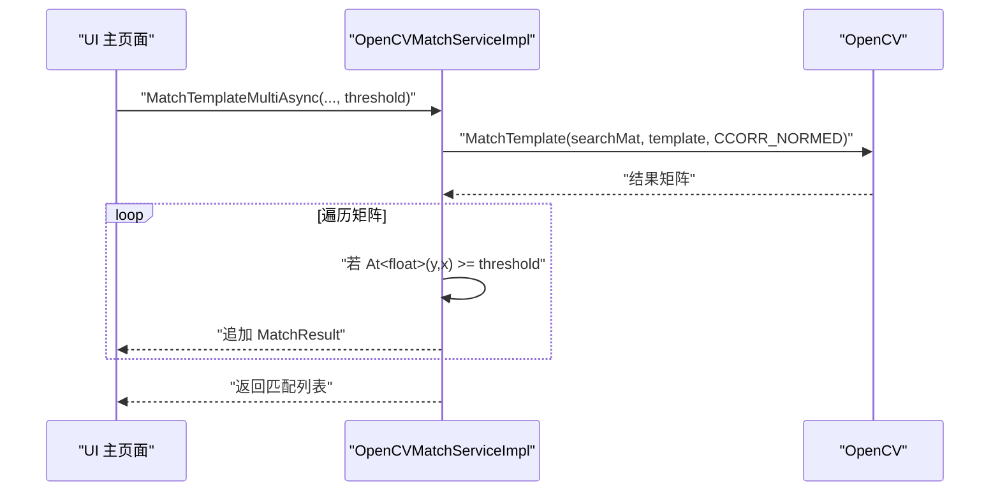
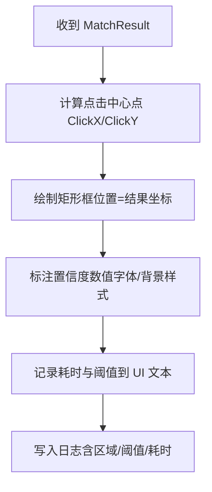
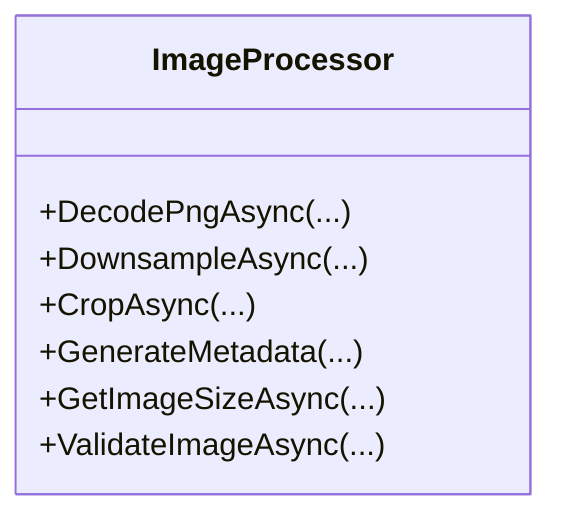
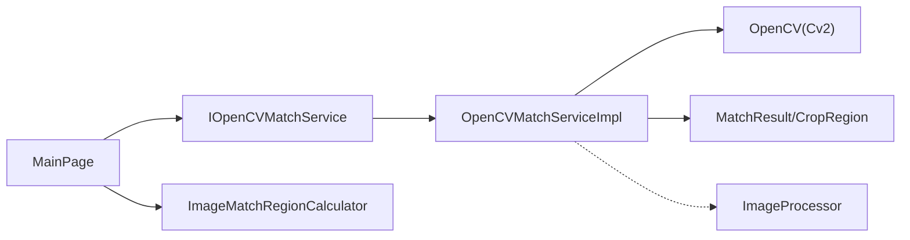

# 图像识别匹配引擎

<cite>
**本文引用的文件**
- [OpenCVMatchServiceImpl.cs](file://Infrastructure/Imaging/OpenCVMatchServiceImpl.cs)
- [IOpenCVMatchService.cs](file://Core/Abstractions/IOpenCVMatchService.cs)
- [CropRegion.cs](file://Core/Models/CropRegion.cs)
- [MatchResult.cs](file://Core/Models/MatchResult.cs)
- [ImageMatchRegionCalculator.cs](file://Core/Helpers/ImageMatchRegionCalculator.cs)
- [ImageProcessor.cs](file://Infrastructure/Imaging/ImageProcessor.cs)
- [MainPage.Match.cs](file://App/Views/MainPage.Match.cs)
- [MainPage.ImageCodeTemplates.NativeMatchTemplate.cs](file://App/Views/MainPage.ImageCodeTemplates.NativeMatchTemplate.cs)
- [AutoJS6CodeGenerator.cs](file://Core/Services/AutoJS6CodeGenerator.cs)
- [README.md](file://README.md)
- [spec.md（图像处理引擎）](file://openspec/changes/winui3-visual-dev-toolkit/specs/image-processing-engine/spec.md)
- [spec.md（实时匹配测试）](file://openspec/changes/winui3-visual-dev-toolkit/specs/realtime-match-testing/spec.md)
</cite>

## 目录
1. [简介](#简介)
2. [项目结构](#项目结构)
3. [核心组件](#核心组件)
4. [架构总览](#架构总览)
5. [详细组件分析](#详细组件分析)
6. [依赖关系分析](#依赖关系分析)
7. [性能考量](#性能考量)
8. [故障排查指南](#故障排查指南)
9. [结论](#结论)
10. [附录](#附录)

## 简介
本技术文档围绕基于 OpenCV 的图像识别匹配引擎展开，重点解释模板匹配算法（TM_CCOEFF_NORMED）、像素级匹配机制、相似度计算、实时阈值调整、区域裁剪（CropRegion）与坐标偏移、内存优化策略，以及如何使用 MatchTemplateAsync 与 MatchTemplateMultiAsync 方法进行匹配测试与可视化展示。同时覆盖图像预处理、内存管理与并发处理等关键技术点。

## 项目结构
该工程采用分层架构，核心业务逻辑位于 Core 层，外部依赖适配在 Infrastructure 层，应用 UI 在 App 层。图像识别匹配引擎位于 Infrastructure/Imaging 中，通过 IOpenCVMatchService 接口对外暴露能力；Core/Helpers 提供区域上下文与裁剪区域模型；App/Views 提供 UI 交互与可视化展示。

图表来源
- [OpenCVMatchServiceImpl.cs:11-204](file://Infrastructure/Imaging/OpenCVMatchServiceImpl.cs#L11-L204)
- [IOpenCVMatchService.cs:8-56](file://Core/Abstractions/IOpenCVMatchService.cs#L8-L56)
- [ImageMatchRegionCalculator.cs:35-99](file://Core/Helpers/ImageMatchRegionCalculator.cs#L35-L99)
- [ImageProcessor.cs:13-162](file://Infrastructure/Imaging/ImageProcessor.cs#L13-L162)

章节来源
- [README.md:230-287](file://README.md#L230-L287)

## 核心组件
- OpenCV 模板匹配服务实现：提供单次最佳匹配与多匹配结果两种模式，支持阈值过滤与区域裁剪。
- 匹配结果模型：封装匹配位置、置信度、耗时、点击中心点、算法与阈值等信息。
- 裁剪区域模型：描述矩形区域及可选的原始分辨率与参考分辨率，用于坐标转换与 regionRef 生成。
- 区域计算器：根据参考矩形与内边距生成搜索区域与归一化的 regionRef。
- 图像处理器：提供 PNG 解码、降采样、裁剪与元数据生成等基础图像处理能力。
- UI 交互与可视化：在画布上叠加匹配结果，展示置信度与性能统计，支持阈值滑动与区域调整。

章节来源
- [OpenCVMatchServiceImpl.cs:13-148](file://Infrastructure/Imaging/OpenCVMatchServiceImpl.cs#L13-L148)
- [MatchResult.cs:6-62](file://Core/Models/MatchResult.cs#L6-L62)
- [CropRegion.cs:6-52](file://Core/Models/CropRegion.cs#L6-L52)
- [ImageMatchRegionCalculator.cs:35-99](file://Core/Helpers/ImageMatchRegionCalculator.cs#L35-L99)
- [ImageProcessor.cs:13-162](file://Infrastructure/Imaging/ImageProcessor.cs#L13-L162)
- [MainPage.Match.cs:12-83](file://App/Views/MainPage.Match.cs#L12-L83)

## 架构总览
匹配引擎以异步方式运行，避免阻塞 UI 线程。OpenCV 计算在后台线程执行，结果通过 MatchResult 返回；UI 层负责渲染匹配框、置信度标注与性能统计。

图表来源
- [OpenCVMatchServiceImpl.cs:13-60](file://Infrastructure/Imaging/OpenCVMatchServiceImpl.cs#L13-L60)
- [OpenCVMatchServiceImpl.cs:37-53](file://Infrastructure/Imaging/OpenCVMatchServiceImpl.cs#L37-L53)

章节来源
- [OpenCVMatchServiceImpl.cs:13-60](file://Infrastructure/Imaging/OpenCVMatchServiceImpl.cs#L13-L60)

## 详细组件分析

### OpenCV 模板匹配服务实现（IOpenCVMatchService）
- 接口职责
  - MatchTemplateAsync：单次最佳匹配，返回 MatchResult 或 null。
  - MatchTemplateMultiAsync：返回所有置信度高于阈值的匹配结果列表。
  - CalculateSimilarityAsync：计算两张图像的相似度（CCOEFF_NORMED）。
  - ValidateTemplate：校验模板有效性。
- 实现要点
  - 使用 CCORR_NORMED 算法，返回归一化相关匹配值作为置信度。
  - 通过 MinMaxLoc 获取最佳匹配位置与置信度。
  - 多匹配模式遍历结果矩阵，按阈值筛选并生成多个 MatchResult。
  - 使用 Stopwatch 记录耗时，便于性能统计与 UI 展示。
  - 异常捕获确保方法稳定返回，避免 UI 阻塞。

图表来源
- [IOpenCVMatchService.cs:8-56](file://Core/Abstractions/IOpenCVMatchService.cs#L8-L56)
- [OpenCVMatchServiceImpl.cs:11-204](file://Infrastructure/Imaging/OpenCVMatchServiceImpl.cs#L11-L204)

章节来源
- [IOpenCVMatchService.cs:8-56](file://Core/Abstractions/IOpenCVMatchService.cs#L8-L56)
- [OpenCVMatchServiceImpl.cs:13-148](file://Infrastructure/Imaging/OpenCVMatchServiceImpl.cs#L13-L148)

### 匹配结果模型（MatchResult）
- 字段含义
  - X/Y：匹配矩形左上角坐标。
  - Width/Height：模板尺寸。
  - Confidence：置信度（0.0-1.0）。
  - ElapsedMilliseconds：匹配耗时。
  - ClickX/ClickY：点击中心点（模板中心）。
  - IsMatch：是否达到阈值。
  - Algorithm/Threshold：算法名称与使用的阈值。
- 用途
  - 作为 UI 叠加层的渲染数据源，用于绘制矩形框与标注置信度。
  - 作为 AutoJS6 代码生成的基础数据。

图表来源
- [MatchResult.cs:6-62](file://Core/Models/MatchResult.cs#L6-L62)

章节来源
- [MatchResult.cs:6-62](file://Core/Models/MatchResult.cs#L6-L62)

### 裁剪区域模型（CropRegion）与区域计算器（ImageMatchRegionCalculator）
- CropRegion
  - 描述矩形区域（X/Y/Width/Height），支持可选名称与原始分辨率，用于坐标转换与 regionRef 生成。
- ImageMatchRegionCalculator
  - Create：基于参考矩形与内边距生成搜索区域，计算归一化 regionRef（按横纵比映射到参考分辨率）。
  - 作用：在不同分辨率下保持匹配区域的一致性，便于跨设备复用。

图表来源
- [CropRegion.cs:6-52](file://Core/Models/CropRegion.cs#L6-L52)
- [ImageMatchRegionCalculator.cs:9-30](file://Core/Helpers/ImageMatchRegionCalculator.cs#L9-L30)
- [ImageMatchRegionCalculator.cs:35-99](file://Core/Helpers/ImageMatchRegionCalculator.cs#L35-L99)

章节来源
- [CropRegion.cs:6-52](file://Core/Models/CropRegion.cs#L6-L52)
- [ImageMatchRegionCalculator.cs:35-99](file://Core/Helpers/ImageMatchRegionCalculator.cs#L35-L99)

### 区域裁剪与坐标偏移（SearchContext）
- CreateSearchContext
  - 当未提供 region 时，直接使用完整截图 Mat。
  - 当提供 region 时，对截图进行安全裁剪（Clamp），生成新的 Mat 并记录 OffsetX/OffsetY。
  - 通过 SearchContext 将裁剪后的 Mat 与原始坐标偏移传递给匹配算法，保证最终坐标还原到原图空间。
- 内存优化
  - ownsMat 标记决定是否释放裁剪产生的新 Mat，避免重复拷贝与内存泄漏。

图表来源
- [OpenCVMatchServiceImpl.cs:163-177](file://Infrastructure/Imaging/OpenCVMatchServiceImpl.cs#L163-L177)
- [OpenCVMatchServiceImpl.cs:179-202](file://Infrastructure/Imaging/OpenCVMatchServiceImpl.cs#L179-L202)

章节来源
- [OpenCVMatchServiceImpl.cs:163-177](file://Infrastructure/Imaging/OpenCVMatchServiceImpl.cs#L163-L177)
- [OpenCVMatchServiceImpl.cs:179-202](file://Infrastructure/Imaging/OpenCVMatchServiceImpl.cs#L179-L202)

### 实时阈值调整与多匹配结果
- 单次匹配（MatchTemplateAsync）
  - 使用 CCORR_NORMED，返回最佳匹配位置与置信度。
  - 通过 IsMatch 判断是否达到阈值。
- 多匹配（MatchTemplateMultiAsync）
  - 遍历结果矩阵，对每个像素位置判断置信度是否满足阈值。
  - 生成多个 MatchResult，便于 UI 展示所有候选位置。
- 性能优化
  - 结果矩阵一次性计算，后续仅做阈值过滤，避免重复 OpenCV 计算。
  - 通过 Stopwatch 记录耗时，便于 UI 展示与日志记录。

图表来源
- [OpenCVMatchServiceImpl.cs:62-122](file://Infrastructure/Imaging/OpenCVMatchServiceImpl.cs#L62-L122)

章节来源
- [OpenCVMatchServiceImpl.cs:62-122](file://Infrastructure/Imaging/OpenCVMatchServiceImpl.cs#L62-L122)

### 匹配结果可视化与性能统计
- UI 层在画布 Overlay 图层绘制矩形框，标注置信度数值与耗时。
- 通过 MatchSummaryText 展示状态、置信度、耗时与点击坐标。
- 日志记录匹配详情，便于问题定位与回归分析。

图表来源
- [MatchResult.cs:41-46](file://Core/Models/MatchResult.cs#L41-L46)
- [MainPage.Match.cs:188-227](file://App/Views/MainPage.Match.cs#L188-L227)

章节来源
- [MainPage.Match.cs:12-83](file://App/Views/MainPage.Match.cs#L12-L83)
- [MainPage.Match.cs:188-227](file://App/Views/MainPage.Match.cs#L188-L227)

### 图像预处理与内存管理
- 图像解码与降采样
  - ImageProcessor 提供 PNG 解码与最大 1920x1080 的降采样，保持宽高比。
  - 适用于高分辨率设备，减少 OpenCV 计算压力。
- 裁剪与元数据
  - 支持裁剪导出为独立 PNG，并生成包含偏移量与原图尺寸的 JSON 元数据。
- 内存优化
  - OpenCVMatchServiceImpl 使用 using 语义释放 Mat，防止内存泄漏。
  - SearchContext ownsMat 标记控制 Mat 生命周期。
  - UI 层使用 CanvasBitmap 缓存池（规范要求）避免重复纹理创建。

图表来源
- [ImageProcessor.cs:13-162](file://Infrastructure/Imaging/ImageProcessor.cs#L13-L162)

章节来源
- [ImageProcessor.cs:13-162](file://Infrastructure/Imaging/ImageProcessor.cs#L13-L162)
- [spec.md（图像处理引擎）:17-21](file://openspec/changes/winui3-visual-dev-toolkit/specs/image-processing-engine/spec.md#L17-L21)

### 使用示例：MatchTemplateAsync 与 MatchTemplateMultiAsync
- 参数配置
  - screenshot：截图字节数组（PNG）。
  - template：模板字节数组（PNG）。
  - threshold：阈值（0.50-0.95，默认 0.8）。
  - region：可选的 CropRegion，限定搜索区域。
  - cancellationToken：取消令牌，支持取消操作。
- 返回值处理
  - MatchTemplateAsync：返回单个 MatchResult 或 null。
  - MatchTemplateMultiAsync：返回所有置信度≥阈值的结果列表。
- 异常情况处理
  - 输入为空或 Mat 为空时返回 null/空列表。
  - 异常捕获确保方法稳定返回，UI 层据此提示“匹配失败”。

章节来源
- [IOpenCVMatchService.cs:19-40](file://Core/Abstractions/IOpenCVMatchService.cs#L19-L40)
- [OpenCVMatchServiceImpl.cs:13-122](file://Infrastructure/Imaging/OpenCVMatchServiceImpl.cs#L13-L122)

### 代码生成与 AutoJS6 集成
- 代码生成器根据 MatchResult 与 regionRef 生成 AutoJS6 脚本，包含 threshold 与 region 参数。
- UI 层在生成模板代码时，会根据当前区域上下文与阈值生成可运行的 images.findImage 调用。

章节来源
- [AutoJS6CodeGenerator.cs:260-288](file://Core/Services/AutoJS6CodeGenerator.cs#L260-L288)
- [MainPage.ImageCodeTemplates.NativeMatchTemplate.cs:7-32](file://App/Views/MainPage.ImageCodeTemplates.NativeMatchTemplate.cs#L7-L32)

## 依赖关系分析
- IOpenCVMatchService 由 OpenCVMatchServiceImpl 实现，被 App/Views 的 MainPage 调用。
- MainPage 依赖 ImageMatchRegionCalculator 与 CropRegion 生成搜索区域与 regionRef。
- OpenCVMatchServiceImpl 依赖 OpenCV（Cv2）与 Mat，内部使用 Stopwatch 记录耗时。
- ImageProcessor 为基础设施层组件，提供 PNG 解码与降采样等基础能力。

图表来源
- [IOpenCVMatchService.cs:8-56](file://Core/Abstractions/IOpenCVMatchService.cs#L8-L56)
- [OpenCVMatchServiceImpl.cs:11-204](file://Infrastructure/Imaging/OpenCVMatchServiceImpl.cs#L11-L204)
- [ImageMatchRegionCalculator.cs:35-99](file://Core/Helpers/ImageMatchRegionCalculator.cs#L35-L99)
- [ImageProcessor.cs:13-162](file://Infrastructure/Imaging/ImageProcessor.cs#L13-L162)

章节来源
- [OpenCVMatchServiceImpl.cs:11-204](file://Infrastructure/Imaging/OpenCVMatchServiceImpl.cs#L11-L204)
- [MainPage.Match.cs:12-83](file://App/Views/MainPage.Match.cs#L12-L83)

## 性能考量
- 算法选择
  - CCORR_NORMED 适合一般模板匹配场景，对光照变化有一定鲁棒性。
- 异步与并发
  - 所有 I/O 与 OpenCV 计算均在后台线程执行，避免阻塞 UI。
- 区域限制
  - 通过 CropRegion 限制搜索范围，显著降低计算复杂度。
- 内存管理
  - 使用 using 与 ownsMat 控制 Mat 生命周期，避免内存泄漏。
  - 高分辨率图像降采样至最大 1920x1080，减少内存占用与计算时间。
- 多匹配优化
  - 一次计算结果矩阵，后续仅做阈值过滤，避免重复计算。

章节来源
- [OpenCVMatchServiceImpl.cs:13-148](file://Infrastructure/Imaging/OpenCVMatchServiceImpl.cs#L13-L148)
- [ImageProcessor.cs:47-72](file://Infrastructure/Imaging/ImageProcessor.cs#L47-L72)
- [spec.md（实时匹配测试）:22-36](file://openspec/changes/winui3-visual-dev-toolkit/specs/realtime-match-testing/spec.md#L22-L36)

## 故障排查指南
- 匹配失败
  - 检查模板是否有效（ValidateTemplate）。
  - 调整阈值（0.50-0.95）或缩小搜索区域（CropRegion）。
  - 查看日志中的耗时与最高置信度，辅助定位问题。
- 性能过慢
  - 使用区域裁剪限制搜索范围。
  - 对高分辨率截图进行降采样。
  - 避免在循环中重复调用 OpenCV 计算。
- 内存问题
  - 确认 Mat 对象正确释放（using 语义）。
  - 检查 SearchContext 的 ownsMat 标记是否正确。
- 坐标不一致
  - 使用 regionRef 与原始分辨率字段进行坐标转换。
  - 核对 Orientation（横屏/竖屏）与参考分辨率映射。

章节来源
- [OpenCVMatchServiceImpl.cs:150-161](file://Infrastructure/Imaging/OpenCVMatchServiceImpl.cs#L150-L161)
- [ImageMatchRegionCalculator.cs:78-97](file://Core/Helpers/ImageMatchRegionCalculator.cs#L78-L97)
- [MainPage.Match.cs:200-227](file://App/Views/MainPage.Match.cs#L200-L227)

## 结论
该图像识别匹配引擎以 OpenCV 为核心，结合区域裁剪、阈值动态调整与可视化展示，提供了高效、稳定的模板匹配能力。通过异步架构与内存优化策略，确保在 UI 线程不阻塞的前提下完成高性能计算，并支持 AutoJS6 脚本的自动生成与跨设备复用。配合图像降采样与缓存池等手段，可在不同分辨率与设备环境下获得一致的匹配体验。

## 附录
- 关键流程与规范参考
  - 实时匹配测试规范：阈值范围、可视化标注与报告输出。
  - 图像处理引擎规范：截图降采样、裁剪导出与 CanvasBitmap 缓存池。

章节来源
- [spec.md（实时匹配测试）:3-55](file://openspec/changes/winui3-visual-dev-toolkit/specs/realtime-match-testing/spec.md#L3-L55)
- [spec.md（图像处理引擎）:17-21](file://openspec/changes/winui3-visual-dev-toolkit/specs/image-processing-engine/spec.md#L17-L21)