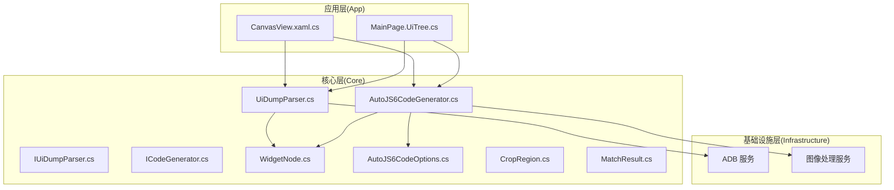
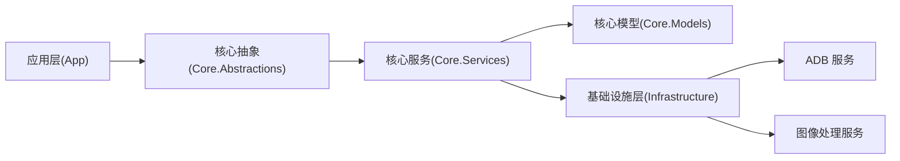
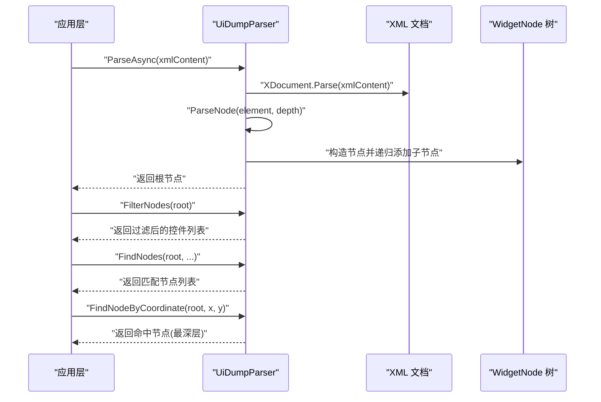
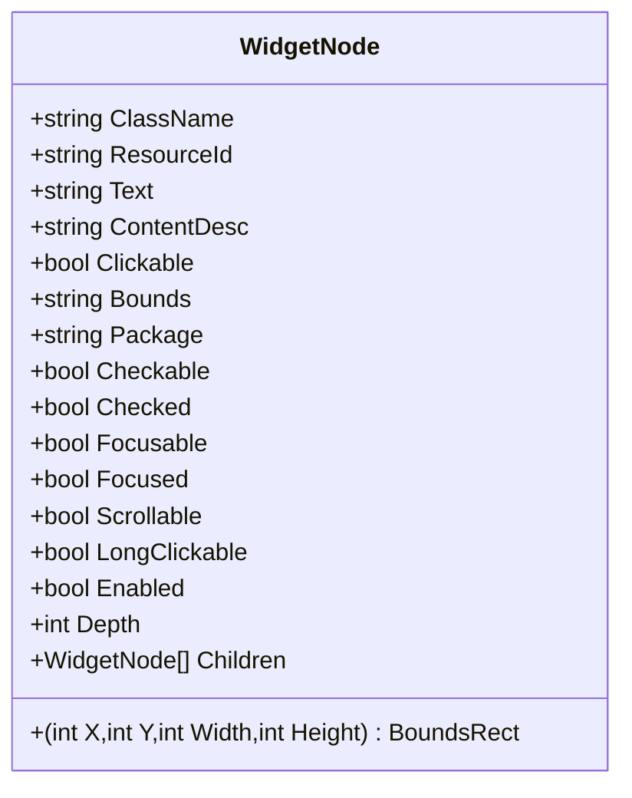
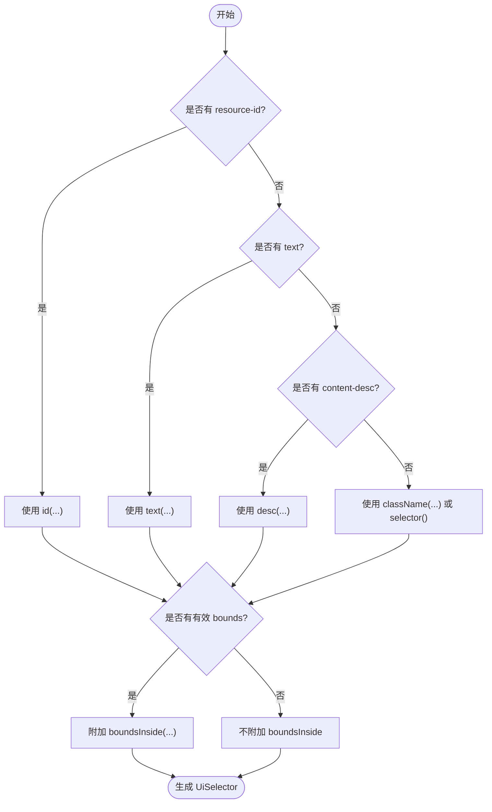
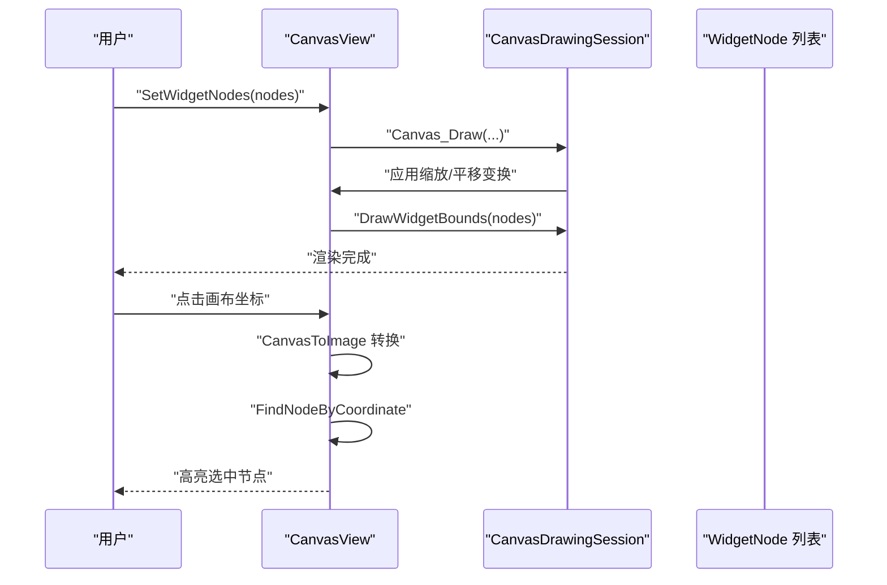
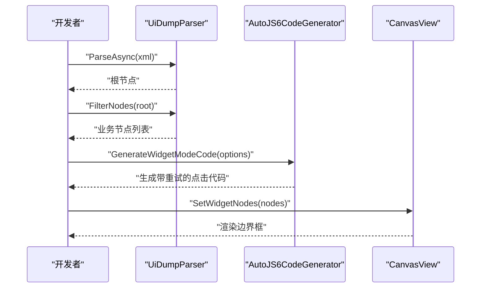
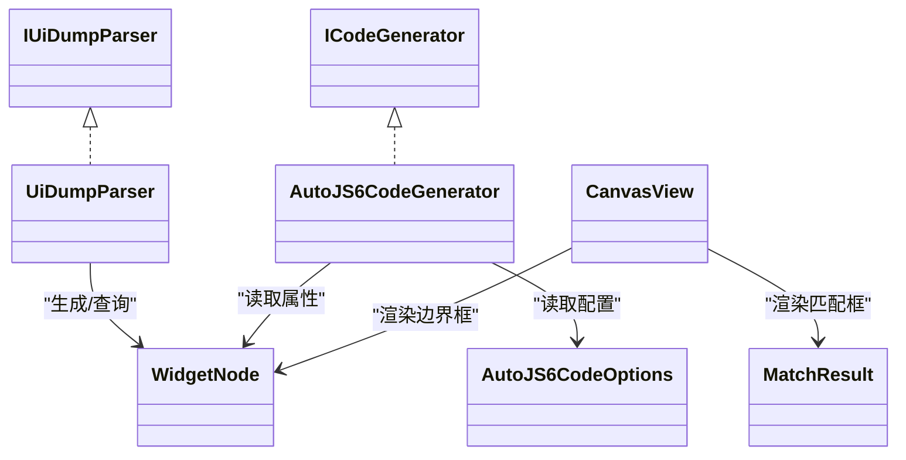

# 控件选择器定位系统

<cite>
**本文档引用的文件**
- [WidgetNode.cs](file://Core/Models/WidgetNode.cs)
- [UiDumpParser.cs](file://Core/Services/UiDumpParser.cs)
- [IUiDumpParser.cs](file://Core/Abstractions/IUiDumpParser.cs)
- [AutoJS6CodeGenerator.cs](file://Core/Services/AutoJS6CodeGenerator.cs)
- [ICodeGenerator.cs](file://Core/Abstractions/ICodeGenerator.cs)
- [AutoJS6CodeOptions.cs](file://Core/Models/AutoJS6CodeOptions.cs)
- [CropRegion.cs](file://Core/Models/CropRegion.cs)
- [MatchResult.cs](file://Core/Models/MatchResult.cs)
- [CanvasView.xaml.cs](file://App/Views/CanvasView.xaml.cs)
- [MainPage.UiTree.cs](file://App/Views/MainPage.UiTree.cs)
- [README.md](file://README.md)
- [spec.md（UI 层分析引擎）](file://openspec/changes/winui3-visual-dev-toolkit/specs/ui-layer-analysis-engine/spec.md)
- [spec.md（AutoJS6 代码生成器）](file://openspec/changes/winui3-visual-dev-toolkit/specs/autojs6-code-generator/spec.md)
</cite>

## 目录
1. [简介](#简介)
2. [项目结构](#项目结构)
3. [核心组件](#核心组件)
4. [架构总览](#架构总览)
5. [详细组件分析](#详细组件分析)
6. [依赖关系分析](#依赖关系分析)
7. [性能考虑](#性能考虑)
8. [故障排查指南](#故障排查指南)
9. [结论](#结论)
10. [附录](#附录)

## 简介
本系统面向 AutoJS6 开发者，提供 Android UI 树解析、控件边界渲染与交互反馈、UiSelector 选择器生成与降级策略、以及与现有脚本行为一致的代码生成能力。系统采用双引擎分离设计：图像引擎（像素级）与 UI 引擎（控件级）完全解耦；核心业务逻辑纯净化、可测试；应用层仅负责 UI 与 MVVM。

## 项目结构
- App：WinUI 3 应用层，包含画布视图、主页面、代码预览等 UI 组件
- Core：纯业务逻辑层，包含模型、服务与抽象接口
- Infrastructure：外部依赖适配层（ADB、图像处理等）
- openspec：需求规格与设计文档

图表来源
- [CanvasView.xaml.cs:1-1307](file://App/Views/CanvasView.xaml.cs#L1-L1307)
- [MainPage.UiTree.cs:1-191](file://App/Views/MainPage.UiTree.cs#L1-L191)
- [IUiDumpParser.cs:1-56](file://Core/Abstractions/IUiDumpParser.cs#L1-L56)
- [UiDumpParser.cs:1-263](file://Core/Services/UiDumpParser.cs#L1-L263)
- [ICodeGenerator.cs:1-46](file://Core/Abstractions/ICodeGenerator.cs#L1-L46)
- [AutoJS6CodeGenerator.cs:1-357](file://Core/Services/AutoJS6CodeGenerator.cs#L1-L357)
- [WidgetNode.cs:1-93](file://Core/Models/WidgetNode.cs#L1-L93)
- [AutoJS6CodeOptions.cs:1-89](file://Core/Models/AutoJS6CodeOptions.cs#L1-L89)
- [CropRegion.cs:1-53](file://Core/Models/CropRegion.cs#L1-L53)
- [MatchResult.cs:1-63](file://Core/Models/MatchResult.cs#L1-L63)

章节来源
- [README.md:230-260](file://README.md#L230-L260)

## 核心组件
- WidgetNode：Android UI 控件节点的数据模型，包含类名、资源 ID、文本、内容描述、可交互属性、边界框、包名、层级等
- IUiDumpParser / UiDumpParser：UI Dump XML 解析器，负责解析 UiAutomator 输出、提取节点、过滤布局容器、坐标解析、节点查询与坐标命中查找
- ICodeGenerator / AutoJS6CodeGenerator：AutoJS6 代码生成器，支持图像模式与控件模式，生成带重试/超时机制的代码，并进行 Rhino 引擎约束校验
- CanvasView：Win2D 画布，负责图像层与 Overlay 层渲染，控件边界框绘制、交互反馈与裁剪区域管理
- MainPage.UiTree：UI 树构建与搜索，TreeView 与 Canvas 的双向联动

章节来源
- [WidgetNode.cs:1-93](file://Core/Models/WidgetNode.cs#L1-L93)
- [IUiDumpParser.cs:1-56](file://Core/Abstractions/IUiDumpParser.cs#L1-L56)
- [UiDumpParser.cs:1-263](file://Core/Services/UiDumpParser.cs#L1-L263)
- [ICodeGenerator.cs:1-46](file://Core/Abstractions/ICodeGenerator.cs#L1-L46)
- [AutoJS6CodeGenerator.cs:1-357](file://Core/Services/AutoJS6CodeGenerator.cs#L1-L357)
- [CanvasView.xaml.cs:1-1307](file://App/Views/CanvasView.xaml.cs#L1-L1307)
- [MainPage.UiTree.cs:1-191](file://App/Views/MainPage.UiTree.cs#L1-L191)

## 架构总览
系统采用“双引擎独立、单向依赖”的 Clean Architecture：
- 应用层仅依赖核心层接口，不直接访问基础设施
- 核心层不依赖 UI，保证可测试性
- 基础设施层封装外部依赖（ADB、OpenCV）

图表来源
- [README.md:264-287](file://README.md#L264-L287)

## 详细组件分析

### Android UI 树解析机制
- 输入：UiAutomator dump 的 XML 字符串
- 解析流程：使用 LINQ to XML 解析根节点，递归遍历 node 节点，提取属性并构造 WidgetNode 树
- 坐标解析：从 bounds 字符串解析为 (x, y, width, height)，并保留原始 bounds 字符串
- 过滤规则：布局容器过滤（无特征且非可交互时跳过），仅保留业务控件
- 查询算法：支持按资源 ID、文本、内容描述、类名过滤；支持按坐标命中查找（优先最深层子节点）

图表来源
- [UiDumpParser.cs:14-263](file://Core/Services/UiDumpParser.cs#L14-L263)
- [IUiDumpParser.cs:10-47](file://Core/Abstractions/IUiDumpParser.cs#L10-L47)

章节来源
- [UiDumpParser.cs:14-263](file://Core/Services/UiDumpParser.cs#L14-L263)
- [spec.md（UI 层分析引擎）:3-56](file://openspec/changes/winui3-visual-dev-toolkit/specs/ui-layer-analysis-engine/spec.md#L3-L56)

### WidgetNode 数据模型设计
- 必填字段：ClassName、Bounds、Depth
- 可选字段：ResourceId、Text、ContentDesc、Package
- 布尔属性：Clickable、Checkable、Checked、Focusable、Focused、Scrollable、LongClickable、Enabled
- 几何属性：BoundsRect（元组 x,y,width,height）与原始 Bounds 字符串
- 关系：Children 列表构成树结构，Depth 表示层级

图表来源
- [WidgetNode.cs:6-92](file://Core/Models/WidgetNode.cs#L6-L92)

章节来源
- [WidgetNode.cs:1-93](file://Core/Models/WidgetNode.cs#L1-L93)

### UiSelector 选择器生成逻辑
- 优先级：resource-id → text → content-desc → className → boundsInside
- 生成策略：主选择器优先使用强定位属性；若存在边界框则附加 boundsInside；回退策略按降级顺序生成多个候选
- 代码生成：支持图像模式与控件模式，控件模式生成带重试/超时的点击脚本

图表来源
- [UiDumpParser.cs:61-97](file://Core/Services/UiDumpParser.cs#L61-L97)
- [AutoJS6CodeGenerator.cs:290-345](file://Core/Services/AutoJS6CodeGenerator.cs#L290-L345)

章节来源
- [UiDumpParser.cs:61-97](file://Core/Services/UiDumpParser.cs#L61-L97)
- [AutoJS6CodeGenerator.cs:290-345](file://Core/Services/AutoJS6CodeGenerator.cs#L290-L345)
- [spec.md（AutoJS6 代码生成器）:35-63](file://openspec/changes/winui3-visual-dev-toolkit/specs/autojs6-code-generator/spec.md#L35-L63)

### 控件边界渲染与交互反馈
- 分层渲染：图像层（CanvasBitmap）+ Overlay 层（Win2D 绘制）
- 边界框绘制：按控件类型着色（Text/按钮/图片/其他），支持透明度与显示开关
- 交互反馈：画布坐标与图像坐标互转；CanvasToImage/ImageToCanvas；惯性滑动；裁剪模式（仅 1:1）
- 事件联动：TreeView 与 Canvas 双向同步，点击节点高亮画框，点击画框定位 TreeView

图表来源
- [CanvasView.xaml.cs:548-627](file://App/Views/CanvasView.xaml.cs#L548-L627)
- [CanvasView.xaml.cs:629-796](file://App/Views/CanvasView.xaml.cs#L629-L796)
- [UiDumpParser.cs:56-59](file://Core/Services/UiDumpParser.cs#L56-L59)

章节来源
- [CanvasView.xaml.cs:1-1307](file://App/Views/CanvasView.xaml.cs#L1-L1307)
- [MainPage.UiTree.cs:1-191](file://App/Views/MainPage.UiTree.cs#L1-L191)

### 降级策略与容错处理
- UI 树解析容错：XML 解析异常时返回空；节点属性缺失时以空字符串处理
- 选择器降级：优先 resource-id，其次 text，再次 content-desc，最后 className；若存在 bounds 则附加 boundsInside
- 代码生成约束：Rhino 引擎循环体内禁止 const/let；OOM 防护：单次迭代只截一次图、最小化扫描范围、及时回收图像对象
- 失败提示：UI 树拉取失败时提示设备连接问题；未找到控件时提示并退出

章节来源
- [UiDumpParser.cs:18-34](file://Core/Services/UiDumpParser.cs#L18-L34)
- [AutoJS6CodeGenerator.cs:226-258](file://Core/Services/AutoJS6CodeGenerator.cs#L226-L258)
- [README.md:342-374](file://README.md#L342-L374)
- [spec.md（UI 层分析引擎）:12-21](file://openspec/changes/winui3-visual-dev-toolkit/specs/ui-layer-analysis-engine/spec.md#L12-L21)

### 使用示例与工作流
- 解析 UI 树：调用解析器的异步解析方法，得到根节点；过滤布局容器，得到业务节点列表
- 生成选择器代码：根据选中节点生成主选择器与回退选择器；可附加 boundsInside；生成带重试/超时的点击脚本
- 控件定位验证：在 Canvas 上高亮边界框，确认坐标与截图一致；在 TreeView 中定位节点

图表来源
- [UiDumpParser.cs:14-42](file://Core/Services/UiDumpParser.cs#L14-L42)
- [AutoJS6CodeGenerator.cs:104-164](file://Core/Services/AutoJS6CodeGenerator.cs#L104-L164)
- [CanvasView.xaml.cs:143-151](file://App/Views/CanvasView.xaml.cs#L143-L151)

## 依赖关系分析
- 接口与实现：IUiDumpParser ↔ UiDumpParser；ICodeGenerator ↔ AutoJS6CodeGenerator
- 模型依赖：WidgetNode 作为核心数据载体，被解析器与代码生成器共同使用
- 外部依赖：ADB 用于拉取 UI 树；图像处理服务用于模板匹配与渲染
- UI 依赖：CanvasView 与 MainPage.UiTree 依赖 WidgetNode 与 MatchResult

图表来源
- [IUiDumpParser.cs:8-55](file://Core/Abstractions/IUiDumpParser.cs#L8-L55)
- [UiDumpParser.cs:12-13](file://Core/Services/UiDumpParser.cs#L12-L13)
- [ICodeGenerator.cs:8-45](file://Core/Abstractions/ICodeGenerator.cs#L8-L45)
- [AutoJS6CodeGenerator.cs:11-12](file://Core/Services/AutoJS6CodeGenerator.cs#L11-L12)
- [WidgetNode.cs:6-92](file://Core/Models/WidgetNode.cs#L6-L92)
- [AutoJS6CodeOptions.cs:6-89](file://Core/Models/AutoJS6CodeOptions.cs#L6-L89)
- [MatchResult.cs:6-62](file://Core/Models/MatchResult.cs#L6-L62)

章节来源
- [IUiDumpParser.cs:1-56](file://Core/Abstractions/IUiDumpParser.cs#L1-L56)
- [ICodeGenerator.cs:1-46](file://Core/Abstractions/ICodeGenerator.cs#L1-L46)

## 性能考虑
- 异步解析：UI 树解析与图像加载均采用异步，避免阻塞 UI 线程
- 渲染优化：Win2D 双层渲染，Overlay 层仅绘制必要元素；CanvasBitmap 缓存池限制数量，避免频繁纹理创建
- 坐标转换：缩放与平移矩阵一次性应用，减少重复计算
- 代码生成约束：避免在循环体内使用 const/let，防止 Rhino 变量绑定问题；单次迭代只截一次图，及时回收图像对象

章节来源
- [README.md:282-287](file://README.md#L282-L287)
- [CanvasView.xaml.cs:358-426](file://App/Views/CanvasView.xaml.cs#L358-L426)
- [README.md:362-368](file://README.md#L362-L368)

## 故障排查指南
- UI 树解析失败：检查 ADB 连接与设备状态；查看日志面板错误信息；确认 XML 结构正确
- 未找到控件：确认 resource-id/text/content-desc 是否存在；尝试附加 boundsInside；启用回退选择器
- 画布渲染异常：检查 CanvasBitmap 是否被释放；确认缩放/偏移状态；查看日志输出
- 代码生成错误：检查 Rhino 引擎约束（循环体内禁止 const/let）；核对阈值与区域参数；确认模板路径与变量名

章节来源
- [spec.md（UI 层分析引擎）:12-21](file://openspec/changes/winui3-visual-dev-toolkit/specs/ui-layer-analysis-engine/spec.md#L12-L21)
- [AutoJS6CodeGenerator.cs:226-258](file://Core/Services/AutoJS6CodeGenerator.cs#L226-L258)
- [CanvasView.xaml.cs:572-594](file://App/Views/CanvasView.xaml.cs#L572-L594)

## 结论
本系统通过清晰的分层架构与严格的接口契约，实现了 Android UI 树的高效解析、控件边界可视化渲染、以及与现有 AutoJS6 行为一致的代码生成。其双引擎独立设计与异步优先的实现方式，确保了在大规模节点场景下的稳定性与性能表现。

## 附录
- 坐标系统：左上角原点，(x,y) 为边界框左上角，width/height 为像素单位
- 类型着色：Text（蓝色）、Button（绿色）、Image（橙色）、其他（灰色）
- 生成代码规范：遵循 Rhino 引擎约束，支持重试/超时机制，路径与变量名可配置