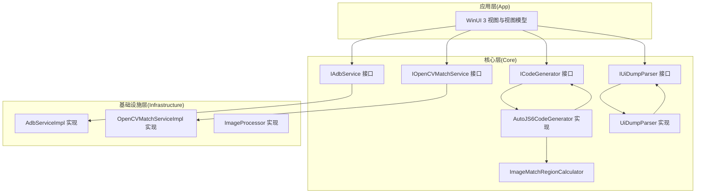
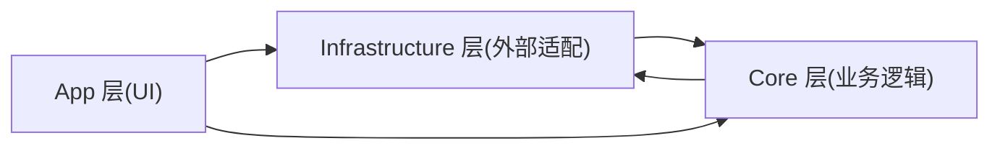
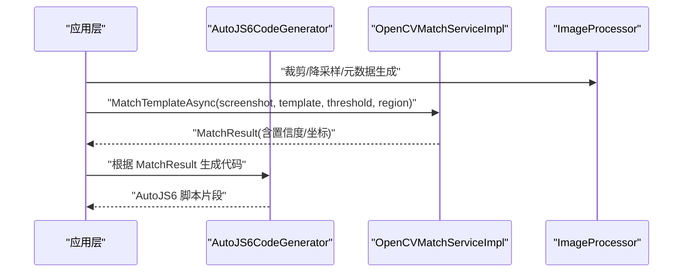
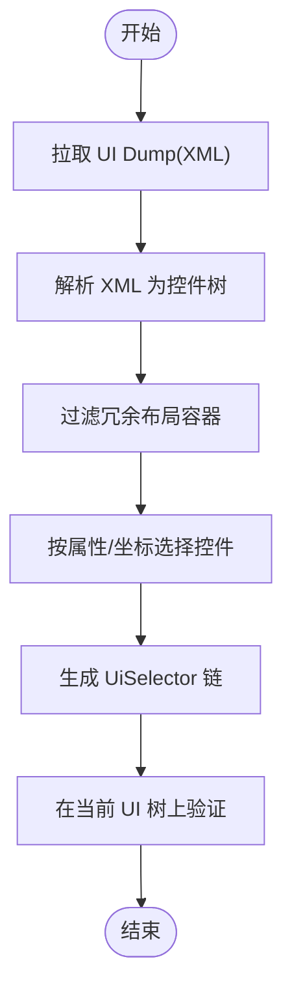
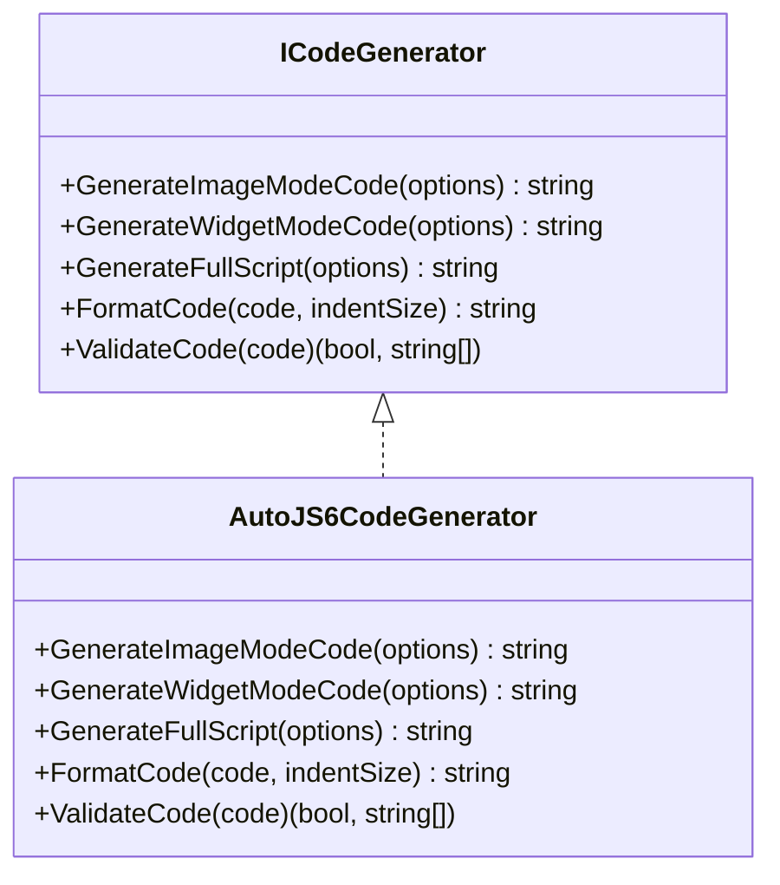
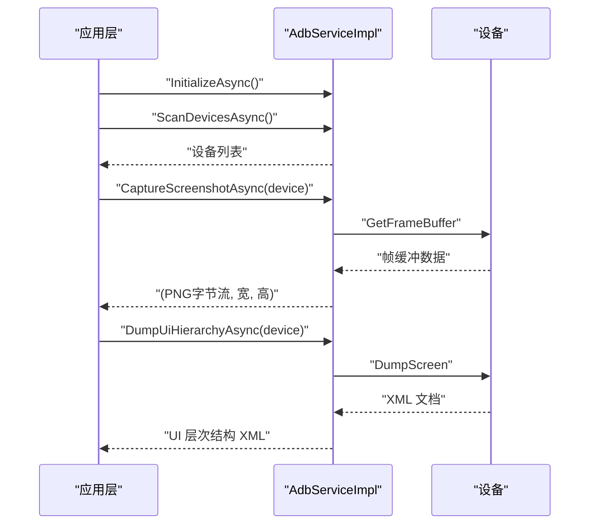
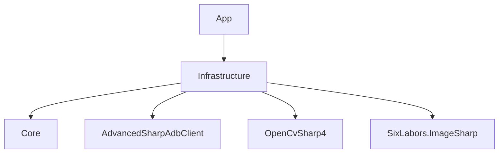

# 核心功能模块

<cite>
**本文引用的文件**
- [README.md](file://README.md)
- [App.csproj](file://App/App.csproj)
- [Infrastructure.csproj](file://Infrastructure/Infrastructure.csproj)
- [Core.csproj](file://Core/Core.csproj)
- [IAdbService.cs](file://Core/Abstractions/IAdbService.cs)
- [ICodeGenerator.cs](file://Core/Abstractions/ICodeGenerator.cs)
- [IOpenCVMatchService.cs](file://Core/Abstractions/IOpenCVMatchService.cs)
- [IUiDumpParser.cs](file://Core/Abstractions/IUiDumpParser.cs)
- [AdbServiceImpl.cs](file://Infrastructure/Adb/AdbServiceImpl.cs)
- [OpenCVMatchServiceImpl.cs](file://Infrastructure/Imaging/OpenCVMatchServiceImpl.cs)
- [ImageProcessor.cs](file://Infrastructure/Imaging/ImageProcessor.cs)
- [AutoJS6CodeGenerator.cs](file://Core/Services/AutoJS6CodeGenerator.cs)
- [UiDumpParser.cs](file://Core/Services/UiDumpParser.cs)
- [ImageMatchRegionCalculator.cs](file://Core/Helpers/ImageMatchRegionCalculator.cs)
</cite>

## 目录
1. [简介](#简介)
2. [项目结构](#项目结构)
3. [核心组件](#核心组件)
4. [架构总览](#架构总览)
5. [详细组件分析](#详细组件分析)
6. [依赖关系分析](#依赖关系分析)
7. [性能考量](#性能考量)
8. [故障排除指南](#故障排除指南)
9. [结论](#结论)
10. [附录](#附录)

## 简介
本文件面向 AutoJS6 开发工具的核心功能模块，围绕四大能力展开：图像识别匹配引擎、控件选择器定位系统、AutoJS6 代码生成器、设备管理与通信。文档从实现原理、关键技术点、使用方法与最佳实践等维度进行系统阐述，并结合项目中的接口与实现，给出可视化流程与时序图，帮助开发者快速上手并高效利用工具。

## 项目结构
项目采用分层架构，清晰分离 UI、核心业务与基础设施：
- App 层：WinUI 3 应用与视图模型，负责用户交互与工作台组织
- Core 层：纯业务逻辑与领域模型，定义抽象接口与核心算法
- Infrastructure 层：外部依赖适配器，封装 ADB 与图像处理库

图表来源
- [App.csproj:1-84](file://App/App.csproj#L1-L84)
- [Core.csproj:1-10](file://Core/Core.csproj#L1-L10)
- [Infrastructure.csproj:1-19](file://Infrastructure/Infrastructure.csproj#L1-L19)

章节来源
- [App.csproj:1-84](file://App/App.csproj#L1-L84)
- [Core.csproj:1-10](file://Core/Core.csproj#L1-L10)
- [Infrastructure.csproj:1-19](file://Infrastructure/Infrastructure.csproj#L1-L19)

## 核心组件
- 图像识别匹配引擎：基于 OpenCV 的模板匹配，支持单次最佳匹配与多点召回，提供置信度阈值与区域限制
- 控件选择器定位系统：解析 Android UI Dump，过滤冗余布局容器，生成 UiSelector 链
- AutoJS6 代码生成器：根据图像或控件模式生成可运行脚本，内置 Rhino 引擎约束校验
- 设备管理与通信：通过 ADB 实现设备扫描、截图抓取、UI 层次结构拉取与网络设备配对/连接

章节来源
- [README.md:166-300](file://README.md#L166-L300)

## 架构总览
系统遵循“双引擎独立、单向依赖”的设计原则：
- 图像引擎：像素/位图 → 绝对像素坐标
- UI 引擎：控件树 → UiSelector 链
- Core 层纯业务、无 UI 依赖；Infrastructure 层封装外部依赖；App 层仅负责 UI 与 MVVM

图表来源
- [README.md:264-287](file://README.md#L264-L287)

章节来源
- [README.md:264-287](file://README.md#L264-L287)

## 详细组件分析

### 图像识别匹配引擎
- 实现原理
  - 使用 OpenCV 的归一化相关匹配算法，计算模板与截图的相似度，输出最佳匹配位置与置信度
  - 支持区域搜索与多点召回，便于在复杂界面中快速定位目标
  - 提供模板有效性校验与相似度计算能力，辅助质量评估
- 关键技术点
  - 模板匹配算法：归一化相关匹配（TM_CCOEFF_NORMED）
  - 区域上下文：支持指定搜索区域，减少无关区域计算
  - 性能优化：异步执行、短路返回、最小化内存拷贝
- 使用方法
  - 传入截图与模板字节数组，设置阈值与可选区域，获取最佳匹配或所有匹配
  - 结合区域计算器生成跨分辨率的 regionRef，提升多设备兼容性
- 最佳实践
  - 模板应包含稳定特征（如固定边框、图标），避免动态元素
  - 合理设置阈值与区域，避免误检与漏检
  - 对大图进行降采样或区域限定，提高匹配速度

图表来源
- [OpenCVMatchServiceImpl.cs:13-60](file://Infrastructure/Imaging/OpenCVMatchServiceImpl.cs#L13-L60)
- [ImageProcessor.cs:77-100](file://Infrastructure/Imaging/ImageProcessor.cs#L77-L100)
- [AutoJS6CodeGenerator.cs:260-288](file://Core/Services/AutoJS6CodeGenerator.cs#L260-L288)

章节来源
- [OpenCVMatchServiceImpl.cs:1-204](file://Infrastructure/Imaging/OpenCVMatchServiceImpl.cs#L1-L204)
- [ImageProcessor.cs:1-162](file://Infrastructure/Imaging/ImageProcessor.cs#L1-L162)
- [AutoJS6CodeGenerator.cs:13-102](file://Core/Services/AutoJS6CodeGenerator.cs#L13-L102)

### 控件选择器定位系统
- 实现原理
  - 通过 ADB 拉取 uiautomator XML，解析为控件树，过滤冗余布局容器，保留可交互控件
  - 支持按资源 ID、文本、内容描述、类名等属性检索，支持坐标命中检测
  - 生成 UiSelector 链，优先使用稳定属性（如 resource-id），并可附加 boundsInside 约束
- 关键技术点
  - XML 解析：LINQ to XML，递归构建控件树
  - 布局容器过滤：识别无语义的容器，减少干扰
  - 选择器生成：组合 id/text/desc/className/boundsInside，形成健壮的定位链
- 使用方法
  - 拉取 UI Dump → 解析 → 过滤 → 选择控件 → 生成 UiSelector → 验证
  - 支持双向联动：树节点点击高亮画布，画布点击展开树节点
- 最佳实践
  - 优先使用 resource-id，其次 text/content-desc，最后 className
  - 在控件具备稳定边界时添加 boundsInside，提升稳定性
  - 对长列表/滚动区域，尽量缩小搜索范围

图表来源
- [UiDumpParser.cs:14-35](file://Core/Services/UiDumpParser.cs#L14-L35)
- [UiDumpParser.cs:37-42](file://Core/Services/UiDumpParser.cs#L37-L42)
- [UiDumpParser.cs:61-97](file://Core/Services/UiDumpParser.cs#L61-L97)

章节来源
- [UiDumpParser.cs:1-263](file://Core/Services/UiDumpParser.cs#L1-L263)

### AutoJS6 代码生成器
- 实现原理
  - 图像模式：生成 requestScreenCapture → images.read → images.findImage → 点击的完整流程，支持重试与回收
  - 控件模式：生成主选择器与降级选择器链，支持 boundsInside 约束与点击
  - 格式化与校验：提供基础代码格式化与 Rhino 引擎约束校验（循环体内禁止 const/let）
- 关键技术点
  - 代码模板化：统一生成入口，支持图像/控件两种模式
  - 重试机制：可配置重试次数与间隔，提升鲁棒性
  - 兼容性：严格遵循 AutoJS6 运行时约束，避免 Rhino 引擎缺陷
- 使用方法
  - 设置生成选项（模式、阈值、区域、模板路径、重试等）→ 生成代码 → 格式化 → 校验
  - 可一键生成完整脚本，包含头部注释与模式标识
- 最佳实践
  - 每次循环仅截屏一次，避免重复 captureScreen
  - 优先使用 region 缩小搜索范围，减少模板数量
  - 使用 recycle 回收图像对象，防止内存泄漏

图表来源
- [ICodeGenerator.cs:8-45](file://Core/Abstractions/ICodeGenerator.cs#L8-L45)
- [AutoJS6CodeGenerator.cs:11-357](file://Core/Services/AutoJS6CodeGenerator.cs#L11-L357)

章节来源
- [ICodeGenerator.cs:1-46](file://Core/Abstractions/ICodeGenerator.cs#L1-L46)
- [AutoJS6CodeGenerator.cs:1-357](file://Core/Services/AutoJS6CodeGenerator.cs#L1-L357)

### 设备管理与通信
- 实现原理
  - 通过 ADB 服务实现设备扫描、截图抓取、UI Dump 拉取、网络设备配对与连接
  - 截图采用帧缓冲直读，处理行填充，转换为 PNG 并返回宽高
  - UI Dump 通过设备客户端异步拉取，返回 XML 字符串
- 关键技术点
  - ADB 服务器初始化：自动查找 adb.exe 并启动服务
  - 帧缓冲处理：识别并去除行填充，保证像素数据连续
  - 网络设备：支持配对码配对与 TCP/IP 连接
- 使用方法
  - 初始化 ADB 服务 → 扫描设备 → 选择目标设备 → 截图/拉取 UI Dump → 处理数据
  - 支持连接/配对网络设备，便于远程调试
- 最佳实践
  - 优先使用 USB 连接，网络连接需确保防火墙与配对流程正确
  - 截图后及时降采样或裁剪，减少内存占用
  - 对多分辨率设备，结合区域计算器生成跨设备 regionRef

图表来源
- [AdbServiceImpl.cs:33-49](file://Infrastructure/Adb/AdbServiceImpl.cs#L33-L49)
- [AdbServiceImpl.cs:51-70](file://Infrastructure/Adb/AdbServiceImpl.cs#L51-L70)
- [AdbServiceImpl.cs:72-118](file://Infrastructure/Adb/AdbServiceImpl.cs#L72-L118)
- [AdbServiceImpl.cs:120-138](file://Infrastructure/Adb/AdbServiceImpl.cs#L120-L138)

章节来源
- [IAdbService.cs:8-56](file://Core/Abstractions/IAdbService.cs#L8-L56)
- [AdbServiceImpl.cs:1-238](file://Infrastructure/Adb/AdbServiceImpl.cs#L1-L238)

## 依赖关系分析
- 依赖方向
  - App → Infrastructure → Core：单向依赖，确保 UI 与业务解耦
- 组件耦合
  - Core 层接口清晰，实现与 UI 无耦合
  - Infrastructure 层对第三方库进行封装，Core 仅依赖接口
- 外部依赖
  - ADB：AdvancedSharpAdbClient
  - 图像处理：OpenCvSharp4、SixLabors.ImageSharp
  - UI：WinUI 3、Windows App SDK

图表来源
- [Infrastructure.csproj:9-17](file://Infrastructure/Infrastructure.csproj#L9-L17)
- [README.md:290-300](file://README.md#L290-L300)

章节来源
- [Infrastructure.csproj:1-19](file://Infrastructure/Infrastructure.csproj#L1-L19)
- [README.md:290-300](file://README.md#L290-L300)

## 性能考量
- 异步优先：所有 I/O 操作均采用 async/await，避免阻塞 UI 线程
- 区域匹配：通过区域限制与 regionRef 缩小搜索空间，显著降低计算量
- 内存管理：及时回收图像对象，避免重复截图与模板加载
- 降采样策略：对高分辨率图像进行等比缩放，平衡精度与性能
- 多模板召回：在批量测试场景下，使用多模板匹配汇总结果，提升覆盖率

## 故障排除指南
- ADB 无法连接
  - 确认 adb.exe 可用且已启动服务
  - 检查设备授权与驱动安装
  - 网络设备需先配对再连接
- 截图失败或黑屏
  - 检查截图权限与设备状态
  - 确认帧缓冲数据长度与像素尺寸一致，必要时去除行填充
- 匹配结果不稳定
  - 调整阈值与区域，避免动态元素干扰
  - 使用 boundsInside 约束提升稳定性
- 代码生成不符合 Rhino 约束
  - 循环体内使用 var 替代 const/let
  - 校验生成代码的约束并通过 ValidateCode

章节来源
- [AdbServiceImpl.cs:186-236](file://Infrastructure/Adb/AdbServiceImpl.cs#L186-L236)
- [OpenCVMatchServiceImpl.cs:150-161](file://Infrastructure/Imaging/OpenCVMatchServiceImpl.cs#L150-L161)
- [AutoJS6CodeGenerator.cs:226-258](file://Core/Services/AutoJS6CodeGenerator.cs#L226-L258)

## 结论
该工具通过清晰的分层架构与严格的接口隔离，实现了图像识别与控件定位两大核心引擎，并配套完善的代码生成与设备管理能力。借助区域上下文与多模板召回，能够在多分辨率与多设备环境下稳定运行；通过格式化与约束校验，保障生成代码的可运行性与可维护性。建议在实际使用中结合区域计算器与降采样策略，持续优化性能与稳定性。

## 附录
- 使用场景示例
  - 图像模式：登录按钮识别与点击，支持重试与回收
  - 控件模式：多级菜单选择，使用降级选择器链与 boundsInside 约束
  - 批量测试：多模板匹配汇总，生成报告与修复建议
- 参考规范
  - AutoJS6 运行时约束与最佳实践
  - 模板裁剪规则与 OOM 防护