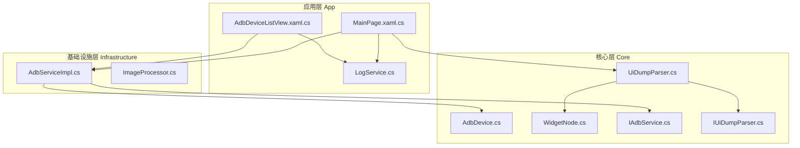
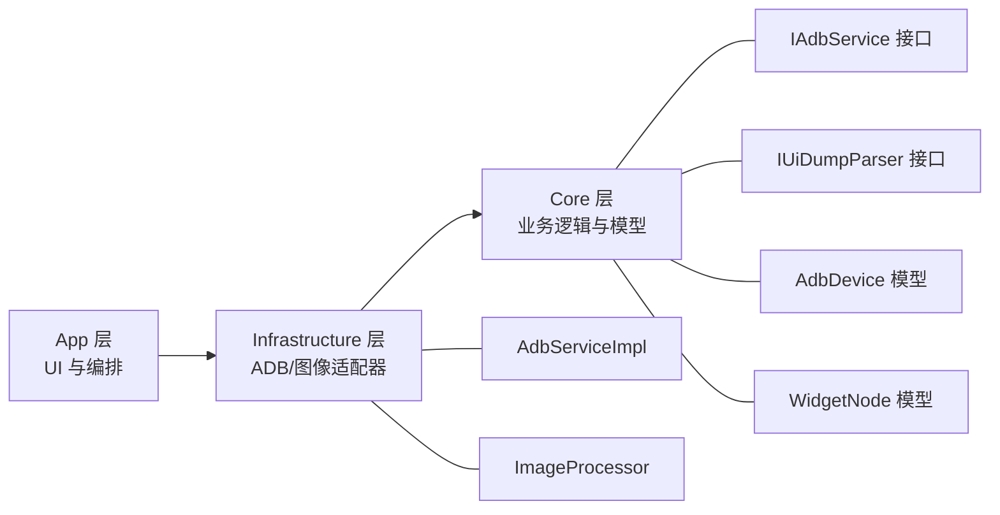
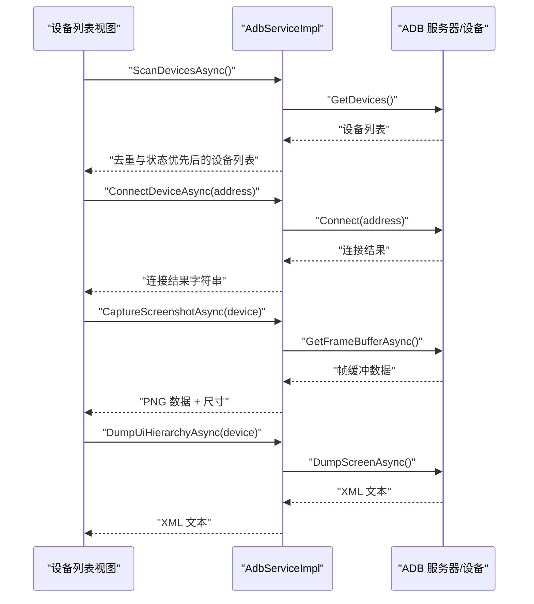
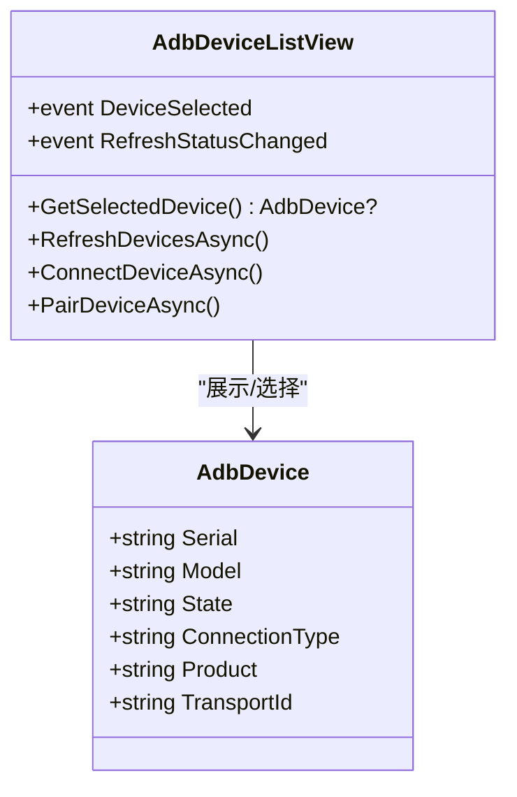
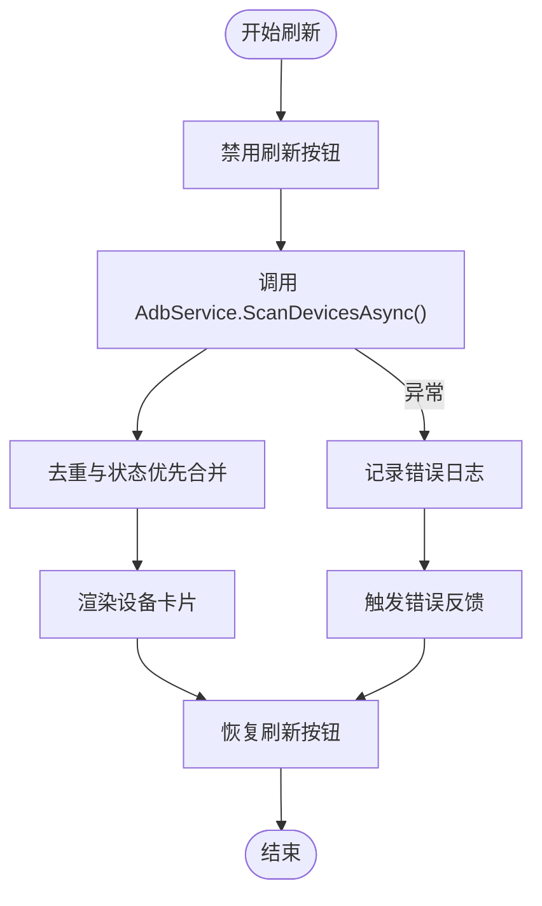
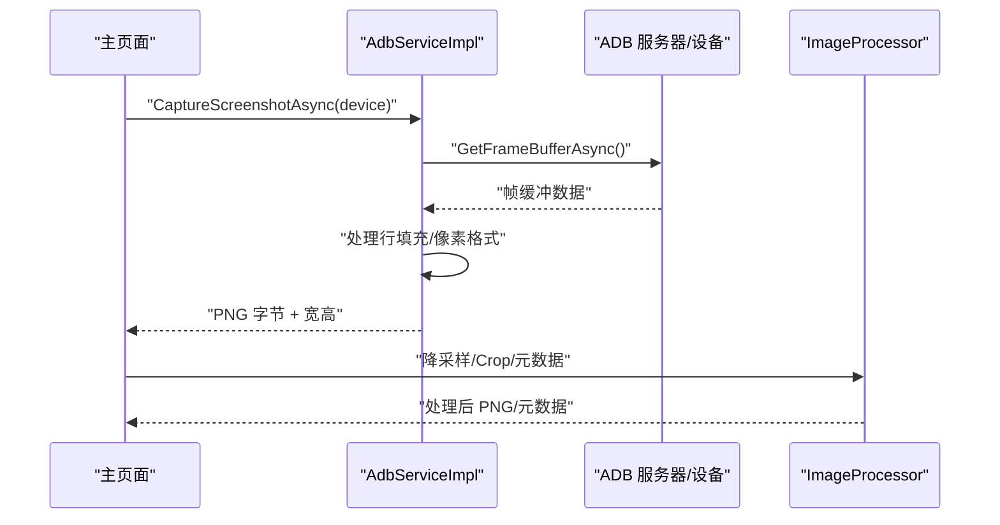
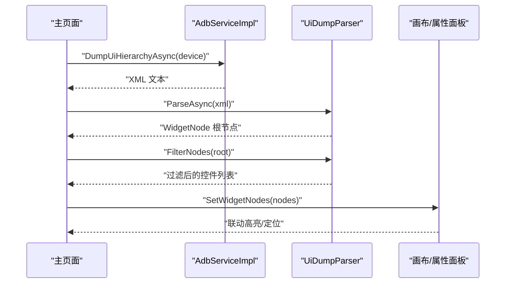
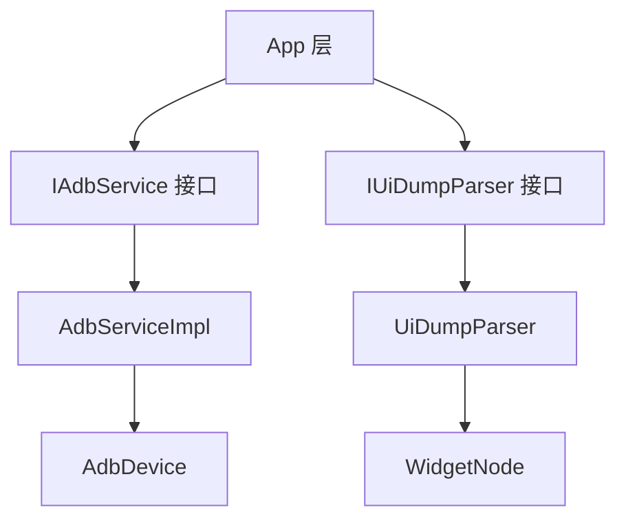

# 设备管理与通信

<cite>
**本文引用的文件**
- [AdbDevice.cs](file://Core/Models/AdbDevice.cs)
- [WidgetNode.cs](file://Core/Models/WidgetNode.cs)
- [IAdbService.cs](file://Core/Abstractions/IAdbService.cs)
- [IUiDumpParser.cs](file://Core/Abstractions/IUiDumpParser.cs)
- [AdbServiceImpl.cs](file://Infrastructure/Adb/AdbServiceImpl.cs)
- [UiDumpParser.cs](file://Core/Services/UiDumpParser.cs)
- [AdbDeviceListView.xaml.cs](file://App/Views/AdbDeviceListView.xaml.cs)
- [MainPage.xaml.cs](file://App/Views/MainPage.xaml.cs)
- [ImageProcessor.cs](file://Infrastructure/Imaging/ImageProcessor.cs)
- [LogService.cs](file://App/Services/LogService.cs)
- [adb-device-management 规范](file://openspec/changes/winui3-visual-dev-toolkit/specs/adb-device-management/spec.md)
- [ui-layer-analysis-engine 规范](file://openspec/changes/winui3-visual-dev-toolkit/specs/ui-layer-analysis-engine/spec.md)
- [canvas-interaction 规范](file://openspec/changes/winui3-visual-dev-toolkit/specs/canvas-interaction/spec.md)
- [autojs6-code-generator 规范](file://openspec/changes/winui3-visual-dev-toolkit/specs/autojs6-code-generator/spec.md)
- [README.md](file://README.md)
</cite>

## 目录
1. [简介](#简介)
2. [项目结构](#项目结构)
3. [核心组件](#核心组件)
4. [架构总览](#架构总览)
5. [详细组件分析](#详细组件分析)
6. [依赖关系分析](#依赖关系分析)
7. [性能考量](#性能考量)
8. [故障排查指南](#故障排查指南)
9. [结论](#结论)
10. [附录](#附录)

## 简介
本文件面向“设备管理与通信”子系统，围绕 ADB 通信协议实现、设备发现与连接、命令执行流程、AdbDevice 数据模型设计、设备列表管理、截图获取与图像处理、UI 树解析与设备集成、多设备并发与稳定性保障等主题，提供系统化技术文档。文档同时结合项目内的规范文件，确保实现与需求一致。

## 项目结构
项目采用 Clean Architecture 分层，核心关注点如下：
- Core 层：纯业务逻辑与领域模型，不依赖 UI
- Infrastructure 层：外部依赖适配器（ADB、图像处理）
- App 层：WinUI3 桌面应用，负责 UI 与交互编排

图表来源
- [AdbDeviceListView.xaml.cs:1-348](file://App/Views/AdbDeviceListView.xaml.cs#L1-L348)
- [MainPage.xaml.cs:1-409](file://App/Views/MainPage.xaml.cs#L1-L409)
- [AdbServiceImpl.cs:1-238](file://Infrastructure/Adb/AdbServiceImpl.cs#L1-L238)
- [UiDumpParser.cs:1-263](file://Core/Services/UiDumpParser.cs#L1-L263)
- [AdbDevice.cs:1-38](file://Core/Models/AdbDevice.cs#L1-L38)
- [WidgetNode.cs:1-93](file://Core/Models/WidgetNode.cs#L1-L93)
- [IAdbService.cs:1-57](file://Core/Abstractions/IAdbService.cs#L1-L57)
- [IUiDumpParser.cs:1-56](file://Core/Abstractions/IUiDumpParser.cs#L1-L56)
- [LogService.cs:1-51](file://App/Services/LogService.cs#L1-L51)

章节来源
- [README.md: 项目结构与架构原则:230-287](file://README.md#L230-L287)

## 核心组件
- ADB 服务接口与实现：IAdbService 定义设备扫描、截图、UI Dump、连接与配对等能力；AdbServiceImpl 基于 AdvancedSharpAdbClient 实现。
- 设备模型与 UI 节点模型：AdbDevice 描述设备信息；WidgetNode 描述控件节点属性与层次。
- UI Dump 解析器：IUiDumpParser 接口与 UiDumpParser 实现，负责 XML 解析、节点过滤、坐标解析与选择器生成。
- 设备列表视图与主页面：AdbDeviceListView 负责设备发现、连接与状态反馈；MainPage 负责截图、UI Dump、画布与属性面板联动。
- 图像处理：ImageProcessor 提供 PNG 解码、降采样、裁剪与元数据生成。
- 日志服务：LogService 单例，统一输出日志并广播给 UI。

章节来源
- [IAdbService.cs: 服务接口定义:1-57](file://Core/Abstractions/IAdbService.cs#L1-L57)
- [AdbServiceImpl.cs: 服务实现:1-238](file://Infrastructure/Adb/AdbServiceImpl.cs#L1-L238)
- [AdbDevice.cs: 设备模型:1-38](file://Core/Models/AdbDevice.cs#L1-L38)
- [WidgetNode.cs: UI 节点模型:1-93](file://Core/Models/WidgetNode.cs#L1-L93)
- [IUiDumpParser.cs: UI Dump 接口:1-56](file://Core/Abstractions/IUiDumpParser.cs#L1-L56)
- [UiDumpParser.cs: UI Dump 解析实现:1-263](file://Core/Services/UiDumpParser.cs#L1-L263)
- [AdbDeviceListView.xaml.cs: 设备列表视图:1-348](file://App/Views/AdbDeviceListView.xaml.cs#L1-L348)
- [MainPage.xaml.cs: 主页面:1-409](file://App/Views/MainPage.xaml.cs#L1-L409)
- [ImageProcessor.cs: 图像处理:1-162](file://Infrastructure/Imaging/ImageProcessor.cs#L1-L162)
- [LogService.cs: 日志服务:1-51](file://App/Services/LogService.cs#L1-L51)

## 架构总览
系统遵循 Clean Architecture，依赖单向流动：App → Infrastructure → Core。UI 通过服务接口与基础设施交互，核心业务逻辑与外部依赖解耦。

图表来源
- [README.md: 架构原则与依赖方向:272-287](file://README.md#L272-L287)
- [IAdbService.cs:1-57](file://Core/Abstractions/IAdbService.cs#L1-L57)
- [IUiDumpParser.cs:1-56](file://Core/Abstractions/IUiDumpParser.cs#L1-L56)
- [AdbServiceImpl.cs:1-238](file://Infrastructure/Adb/AdbServiceImpl.cs#L1-L238)
- [ImageProcessor.cs:1-162](file://Infrastructure/Imaging/ImageProcessor.cs#L1-L162)
- [AdbDevice.cs:1-38](file://Core/Models/AdbDevice.cs#L1-L38)
- [WidgetNode.cs:1-93](file://Core/Models/WidgetNode.cs#L1-L93)

## 详细组件分析

### ADB 通信协议与设备管理
- 设备发现机制
  - 使用底层 API 获取设备列表，支持去重与状态优先策略，确保同一设备的 Online 状态覆盖离线状态。
  - 连接类型识别：根据序列号是否包含冒号区分 USB/TCP/IP。
- 连接建立过程
  - 支持 TCP/IP 连接与配对，异常统一包装为 InvalidOperationException 并携带原始错误信息。
  - 连接成功后刷新设备列表，确保 UI 状态与实际设备一致。
- 命令执行流程
  - 截图：通过帧缓冲流式读取，处理行填充，转换为 PNG。
  - UI Dump：调用设备客户端异步拉取 XML，解析为结构化节点树。
  - 设备状态检查：判断设备是否在线。
- ADB 可执行文件路径探测
  - 依次尝试 PATH、常见 Android SDK 路径、ANDROID_HOME 环境变量，找不到则返回空。

图表来源
- [AdbDeviceListView.xaml.cs: 设备列表交互:124-189](file://App/Views/AdbDeviceListView.xaml.cs#L124-L189)
- [AdbServiceImpl.cs: 设备扫描/连接/截图/UI Dump:51-138](file://Infrastructure/Adb/AdbServiceImpl.cs#L51-L138)

章节来源
- [AdbServiceImpl.cs: 设备扫描与连接实现:51-184](file://Infrastructure/Adb/AdbServiceImpl.cs#L51-L184)
- [AdbDeviceListView.xaml.cs: 设备刷新与连接触发:124-189](file://App/Views/AdbDeviceListView.xaml.cs#L124-L189)
- [adb-device-management 规范: 设备扫描与连接要求:1-90](file://openspec/changes/winui3-visual-dev-toolkit/specs/adb-device-management/spec.md#L1-L90)

### AdbDevice 数据模型设计
- 字段设计
  - 序列号、型号、状态、连接类型、产品、传输 ID，均使用可空或必需语义，便于 UI 展示与服务层处理。
- 状态管理与连接状态跟踪
  - 连接类型由序列号判定；状态来自底层设备对象；在线状态检查通过设备状态判断。
- 与 UI 的集成
  - 设备卡片展示序列号、型号、状态与连接类型；选中设备通过事件传递给主页面。

图表来源
- [AdbDevice.cs:1-38](file://Core/Models/AdbDevice.cs#L1-L38)
- [AdbDeviceListView.xaml.cs:1-348](file://App/Views/AdbDeviceListView.xaml.cs#L1-L348)

章节来源
- [AdbDevice.cs: 设备模型定义:1-38](file://Core/Models/AdbDevice.cs#L1-L38)
- [AdbDeviceListView.xaml.cs: 设备卡片与选中逻辑:208-337](file://App/Views/AdbDeviceListView.xaml.cs#L208-L337)

### 设备列表管理与用户交互
- 自动扫描机制
  - 后台任务刷新设备列表，去重策略优先保留 Online 状态，保证 UI 展示准确性。
- 设备状态监控
  - 连接/配对结果即时反馈，日志服务统一记录。
- 用户交互处理
  - 支持无线连接与配对对话框，输入校验与异常捕获，连接成功后自动刷新并选中设备。

图表来源
- [AdbDeviceListView.xaml.cs: 设备刷新流程:124-189](file://App/Views/AdbDeviceListView.xaml.cs#L124-L189)

章节来源
- [AdbDeviceListView.xaml.cs: 设备刷新与状态反馈:124-189](file://App/Views/AdbDeviceListView.xaml.cs#L124-L189)
- [LogService.cs: 日志广播:32-49](file://App/Services/LogService.cs#L32-L49)

### 截图获取与图像处理
- 屏幕捕获流程
  - 通过帧缓冲流式读取，处理行填充，转换为 RGBA 像素数据，再编码为 PNG。
- 图像传输协议与格式转换
  - 返回 PNG 字节数组与宽高；UI 层可直接加载到画布。
- 性能与兼容性
  - ImageProcessor 提供降采样、裁剪与元数据生成，满足不同分辨率与导出需求。

图表来源
- [AdbServiceImpl.cs: 截图实现:72-118](file://Infrastructure/Adb/AdbServiceImpl.cs#L72-L118)
- [ImageProcessor.cs: 图像处理:1-162](file://Infrastructure/Imaging/ImageProcessor.cs#L1-L162)
- [MainPage.xaml.cs: 截图调用与画布加载:147-178](file://App/Views/MainPage.xaml.cs#L147-L178)

章节来源
- [AdbServiceImpl.cs: 截图与帧缓冲处理:72-118](file://Infrastructure/Adb/AdbServiceImpl.cs#L72-L118)
- [ImageProcessor.cs: 降采样与裁剪:47-100](file://Infrastructure/Imaging/ImageProcessor.cs#L47-L100)
- [MainPage.xaml.cs: 截图加载与状态提示:147-178](file://App/Views/MainPage.xaml.cs#L147-L178)

### UI 树解析与设备集成
- 解析流程
  - 通过 ADB 拉取 XML，解析为 WidgetNode 树；过滤布局容器，保留具备特征的控件节点。
- 跨进程通信与数据同步
  - UI 树解析与画布渲染解耦，通过事件与接口实现双向联动（TreeView 与画布）。
- 状态更新
  - 解析完成更新节点计数、显示节点集合，并支持属性面板懒加载。

图表来源
- [MainPage.xaml.cs: UI Dump 调用与解析:180-248](file://App/Views/MainPage.xaml.cs#L180-L248)
- [UiDumpParser.cs: 解析与过滤:14-197](file://Core/Services/UiDumpParser.cs#L14-L197)
- [IUiDumpParser.cs: 接口契约:1-56](file://Core/Abstractions/IUiDumpParser.cs#L1-L56)

章节来源
- [MainPage.xaml.cs: UI Dump 与解析流程:180-248](file://App/Views/MainPage.xaml.cs#L180-L248)
- [UiDumpParser.cs: XML 解析与节点过滤:14-197](file://Core/Services/UiDumpParser.cs#L14-L197)
- [ui-layer-analysis-engine 规范: UI 树解析与过滤要求:1-134](file://openspec/changes/winui3-visual-dev-toolkit/specs/ui-layer-analysis-engine/spec.md#L1-L134)

### 多设备并发管理与稳定性保障
- 并发执行
  - 截图与 UI Dump 等耗时操作均采用异步与 CancellationToken，避免阻塞 UI。
- 超时与异常处理
  - 规范要求操作超时使用取消令牌；设备断连时捕获异常并自动刷新设备列表。
- 稳定性
  - 服务层统一异常包装；UI 层通过状态提示与日志反馈，提升可用性。

章节来源
- [adb-device-management 规范: 异步与超时要求:76-90](file://openspec/changes/winui3-visual-dev-toolkit/specs/adb-device-management/spec.md#L76-L90)
- [AdbServiceImpl.cs: 连接/配对异常处理:150-179](file://Infrastructure/Adb/AdbServiceImpl.cs#L150-L179)
- [AdbDeviceListView.xaml.cs: 连接结果与异常捕获:102-122](file://App/Views/AdbDeviceListView.xaml.cs#L102-L122)

### 权限、驱动与兼容性
- ADB 环境
  - 通过 PATH/SDK 路径/ANDROID_HOME 自动探测 adb.exe；若不可用，提示环境配置。
- 设备权限
  - 无线连接需配对；UI 层提供配对码输入与结果反馈。
- 兼容性
  - 截图处理考虑行填充与像素格式；UI Dump 解析对缺失属性做容错处理。

章节来源
- [AdbServiceImpl.cs: ADB 路径探测:190-236](file://Infrastructure/Adb/AdbServiceImpl.cs#L190-L236)
- [adb-device-management 规范: ADB 环境与连接类型:56-75](file://openspec/changes/winui3-visual-dev-toolkit/specs/adb-device-management/spec.md#L56-L75)

## 依赖关系分析
- 接口与实现
  - IAdbService 与 IUiDumpParser 作为契约，分别约束 ADB 服务与 UI Dump 解析能力。
- 组件耦合
  - App 层仅依赖接口；Infrastructure 层实现具体适配；Core 层保持纯净业务逻辑。
- 外部依赖
  - ADB 通信依赖 AdvancedSharpAdbClient；图像处理依赖 SixLabors.ImageSharp 与 OpenCvSharp4。

图表来源
- [IAdbService.cs:1-57](file://Core/Abstractions/IAdbService.cs#L1-L57)
- [IUiDumpParser.cs:1-56](file://Core/Abstractions/IUiDumpParser.cs#L1-L56)
- [AdbServiceImpl.cs:1-238](file://Infrastructure/Adb/AdbServiceImpl.cs#L1-L238)
- [UiDumpParser.cs:1-263](file://Core/Services/UiDumpParser.cs#L1-L263)
- [AdbDevice.cs:1-38](file://Core/Models/AdbDevice.cs#L1-L38)
- [WidgetNode.cs:1-93](file://Core/Models/WidgetNode.cs#L1-L93)

章节来源
- [README.md: 依赖方向与分层原则:272-287](file://README.md#L272-L287)

## 性能考量
- 异步与取消
  - 所有 I/O 操作采用 async/await，支持 CancellationToken，避免 UI 阻塞。
- 渲染与计算
  - 图像处理提供降采样与裁剪，降低内存占用与传输成本。
- UI 虚拟化与懒加载
  - UI 引擎规范要求 TreeView 虚拟化与属性面板懒加载，支持大规模节点树渲染。

章节来源
- [README.md: 异步优先架构:282-287](file://README.md#L282-L287)
- [ImageProcessor.cs: 降采样与裁剪:47-100](file://Infrastructure/Imaging/ImageProcessor.cs#L47-L100)
- [ui-layer-analysis-engine 规范: 虚拟化与懒加载:114-126](file://openspec/changes/winui3-visual-dev-toolkit/specs/ui-layer-analysis-engine/spec.md#L114-L126)

## 故障排查指南
- ADB 不可用
  - 现象：设备列表为空或提示 ADB 不可用。
  - 排查：确认 adb.exe 路径存在于 PATH 或 Android SDK；检查 ANDROID_HOME。
- 连接失败
  - 现象：连接结果包含失败信息。
  - 排查：核对 IP/端口；确保设备已开启无线调试与配对；查看日志服务输出。
- 截图失败
  - 现象：截图异常或尺寸不正确。
  - 排查：检查设备状态是否在线；确认帧缓冲数据非空；查看行填充处理逻辑。
- UI Dump 解析失败
  - 现象：UI 树为空或解析异常。
  - 排查：确认设备支持 uiautomator；XML 格式是否异常；解析器容错日志。

章节来源
- [AdbServiceImpl.cs: ADB 路径探测与异常包装:190-236](file://Infrastructure/Adb/AdbServiceImpl.cs#L190-L236)
- [AdbDeviceListView.xaml.cs: 连接与配对异常处理:102-122](file://App/Views/AdbDeviceListView.xaml.cs#L102-L122)
- [MainPage.xaml.cs: 截图与 UI Dump 异常处理:174-178](file://App/Views/MainPage.xaml.cs#L174-L178)
- [LogService.cs: 日志统一入口:32-49](file://App/Services/LogService.cs#L32-L49)

## 结论
本系统以 Clean Architecture 为核心，通过 IAdbService 与 IUiDumpParser 接口隔离 UI 与外部依赖，实现设备发现、连接、截图与 UI 树解析的完整闭环。结合异步架构、日志服务与规范约束，系统在多设备并发、性能与稳定性方面具备良好保障。建议在后续迭代中持续完善错误分类与重试策略，增强跨平台与多设备场景下的健壮性。

## 附录
- 快速示例（连接与断开）
  - 连接：在设备列表视图输入 IP:端口，点击连接；成功后刷新列表并选中设备。
  - 断开：设备断连后自动刷新列表；UI 层通过状态提示与日志反馈。
- 代码生成集成
  - UI 树解析完成后，可生成 UiSelector 代码；图像模式下可生成基于模板匹配的 AutoJS6 代码。

章节来源
- [AdbDeviceListView.xaml.cs: 连接与配对触发:90-122](file://App/Views/AdbDeviceListView.xaml.cs#L90-L122)
- [MainPage.xaml.cs: UI Dump 与代码生成:180-248](file://App/Views/MainPage.xaml.cs#L180-L248)
- [autojs6-code-generator 规范: 代码生成要求:1-136](file://openspec/changes/winui3-visual-dev-toolkit/specs/autojs6-code-generator/spec.md#L1-L136)