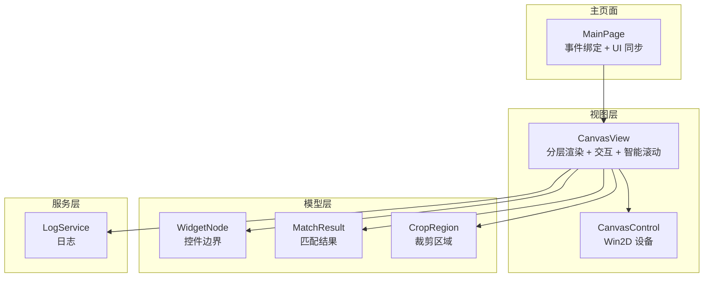
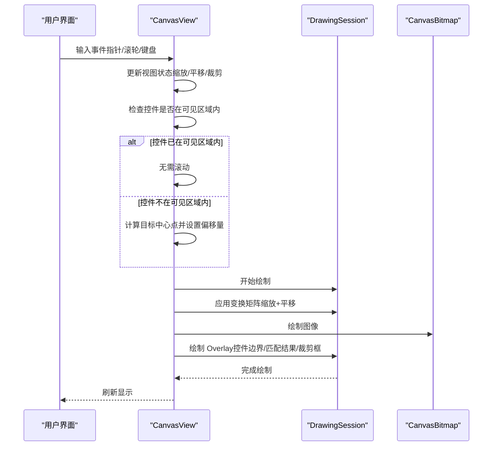
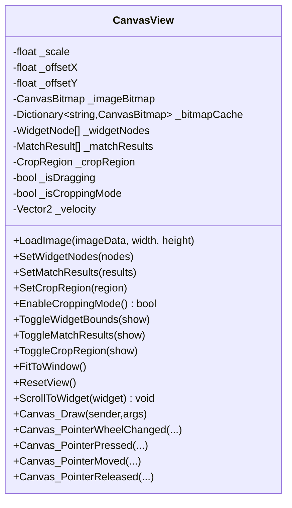
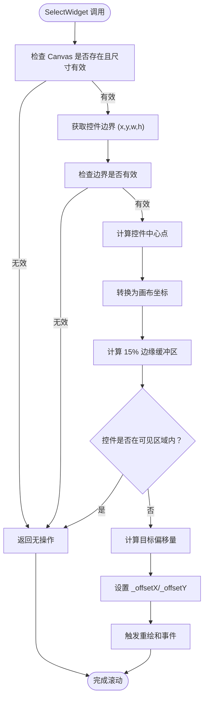
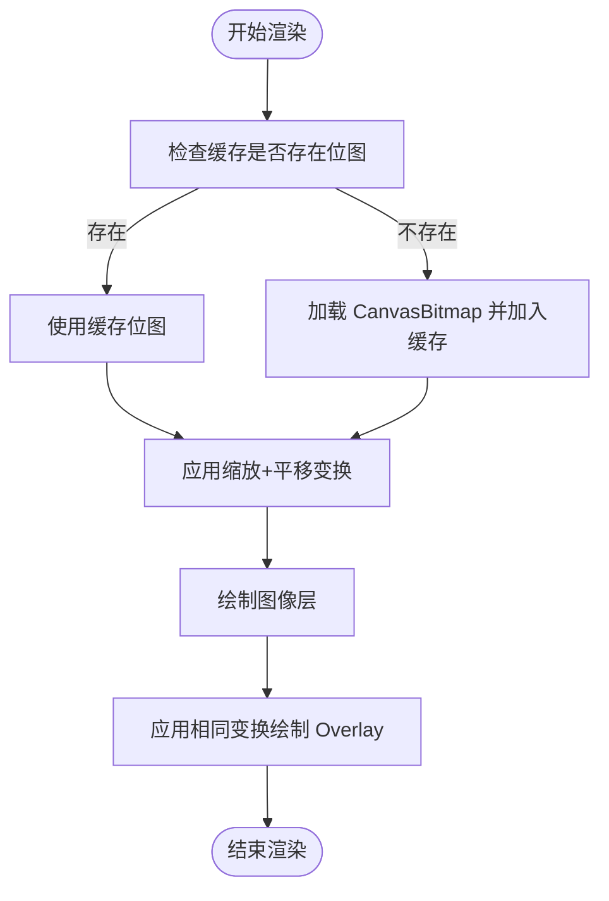
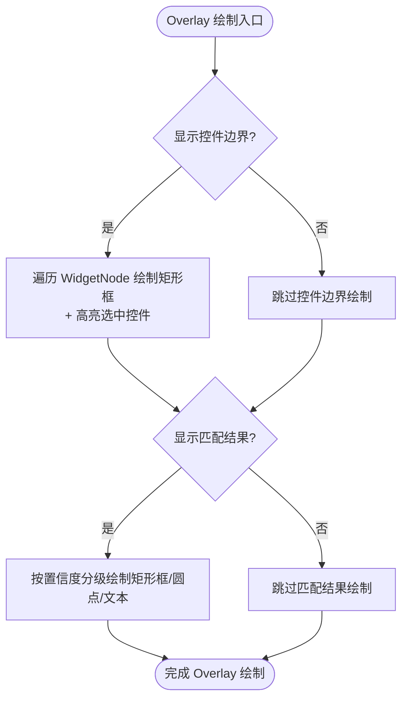
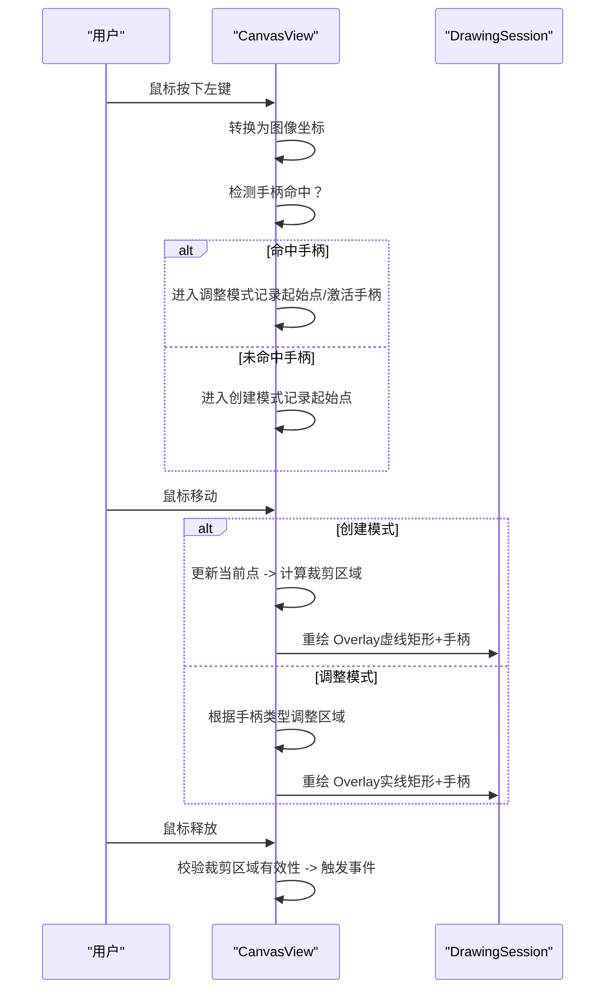
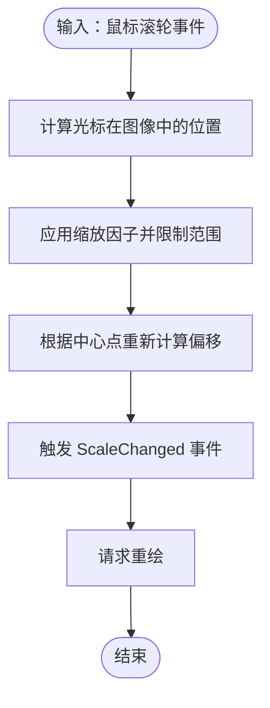
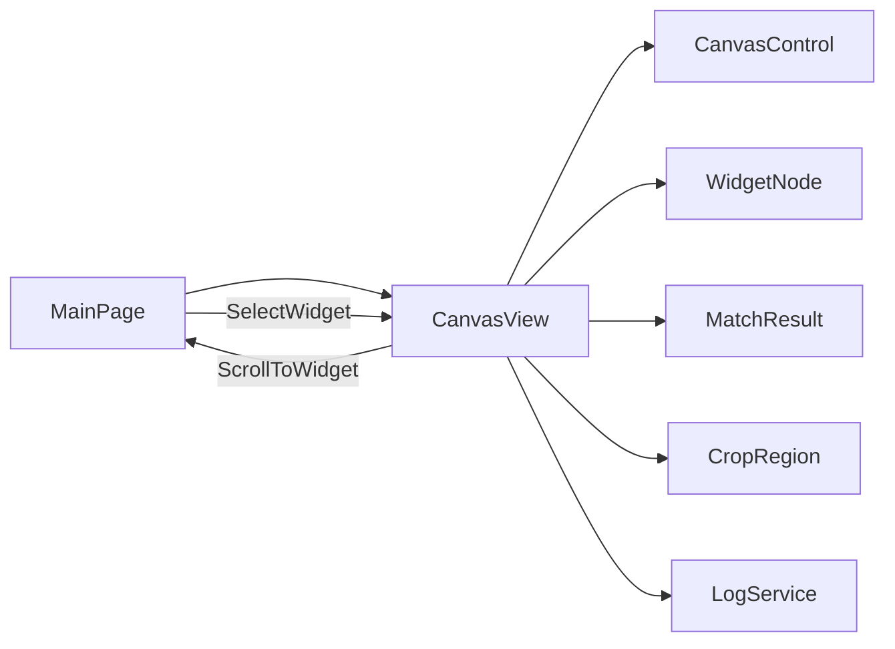

# Canvas 高性能渲染系统

<cite>
**本文档引用的文件**
- [CanvasView.xaml](file://App/Views/CanvasView.xaml)
- [CanvasView.xaml.cs](file://App/Views/CanvasView.xaml.cs)
- [MainPage.xaml.cs](file://App/Views/MainPage.xaml.cs)
- [MainPage.UiTree.cs](file://App/Views/MainPage.UiTree.cs)
- [CropRegion.cs](file://Core/Models/CropRegion.cs)
- [WidgetNode.cs](file://Core/Models/WidgetNode.cs)
- [MatchResult.cs](file://Core/Models/MatchResult.cs)
- [LogService.cs](file://App/Services/LogService.cs)
- [autojs6-image-match-helper.js](file://App/CodeTemplates/image/autojs6-image-match-helper.js)
</cite>

## 更新摘要
**变更内容**
- 新增 CanvasView.ScrollToWidget 智能滚动功能章节
- 更新 CanvasView 详细组件分析，增加智能滚动功能说明
- 更新交互能力章节，包含智能滚动与现有交互功能的整合
- 更新用户体验优化章节，强调智能滚动带来的体验提升

## 目录
1. [简介](#简介)
2. [项目结构](#项目结构)
3. [核心组件](#核心组件)
4. [架构总览](#架构总览)
5. [详细组件分析](#详细组件分析)
6. [依赖关系分析](#依赖关系分析)
7. [性能考虑](#性能考虑)
8. [故障排除指南](#故障排除指南)
9. [结论](#结论)
10. [附录](#附录)

## 简介
本文件面向 AutoJS6 开发工具的 Canvas 高性能渲染系统，围绕 Win2D GPU 加速渲染架构进行深入解析。重点覆盖 CanvasView 的分层渲染管道、60 FPS 实时渲染优化、图形缓冲区管理、图像绘制机制、控件边界渲染、匹配结果可视化、辅助工具（像素尺、网格、十字准星）的实现思路、渲染状态管理、视图变换与缩放机制、拖拽裁剪交互、实时阈值调整的视觉反馈与性能优化策略，以及新增的智能滚动功能。提供渲染调试技巧与性能监控方法，帮助开发者理解和优化渲染效果。

## 项目结构
该系统主要由以下模块构成：
- 视图层：CanvasView（Win2D CanvasControl + 分层渲染 + 交互处理 + 智能滚动）
- 模型层：WidgetNode、MatchResult、CropRegion（渲染数据载体）
- 服务层：LogService（统一日志输出）
- 主页面：MainPage（事件绑定、状态同步、工作台 UI）

**图表来源**
- [CanvasView.xaml.cs:568-627](file://App/Views/CanvasView.xaml.cs#L568-L627)
- [MainPage.xaml.cs:56-60](file://App/Views/MainPage.xaml.cs#L56-L60)

**章节来源**
- [CanvasView.xaml:1-21](file://App/Views/CanvasView.xaml#L1-L21)
- [CanvasView.xaml.cs:19-116](file://App/Views/CanvasView.xaml.cs#L19-L116)
- [MainPage.xaml.cs:17-60](file://App/Views/MainPage.xaml.cs#L17-L60)

## 核心组件
- CanvasView：Win2D 画布视图，负责图像层与 Overlay 层的分层渲染、视图状态管理、交互事件处理、CanvasBitmap 缓存池与导出功能，**新增智能滚动功能**。
- 模型对象：WidgetNode（控件边界）、MatchResult（匹配结果）、CropRegion（裁剪区域）。
- 日志服务：LogService 提供统一日志入口，便于渲染调试与性能观测。
- 主页面：MainPage 订阅 CanvasView 的事件，驱动 UI 状态更新与工作台展示。

**章节来源**
- [CanvasView.xaml.cs:24-116](file://App/Views/CanvasView.xaml.cs#L24-L116)
- [WidgetNode.cs:6-93](file://Core/Models/WidgetNode.cs#L6-L93)
- [MatchResult.cs:6-63](file://Core/Models/MatchResult.cs#L6-L63)
- [CropRegion.cs:6-53](file://Core/Models/CropRegion.cs#L6-L53)
- [LogService.cs:9-51](file://App/Services/LogService.cs#L9-L51)

## 架构总览
CanvasView 采用 Win2D CanvasControl 进行 GPU 加速渲染，实现"图像层（底层）+ Overlay 层（上层）"的分层渲染架构。渲染流程如下：
- 图像层：根据当前缩放与平移矩阵绘制 CanvasBitmap。
- Overlay 层：在同一变换下绘制控件边界、匹配结果与裁剪区域，并支持透明度控制与条件渲染。
- 交互层：滚轮缩放、拖拽平移、惯性滑动、裁剪模式与手柄调整等，**新增智能滚动功能**。

**图表来源**
- [CanvasView.xaml.cs:572-627](file://App/Views/CanvasView.xaml.cs#L572-L627)
- [CanvasView.xaml.cs:584-588](file://App/Views/CanvasView.xaml.cs#L584-L588)
- [CanvasView.xaml.cs:598-626](file://App/Views/CanvasView.xaml.cs#L598-L626)

## 详细组件分析

### CanvasView：分层渲染与交互
- 分层渲染
  - 图像层：绘制 CanvasBitmap，应用缩放与平移矩阵，异常安全处理（ObjectDisposedException）。
  - Overlay 层：在同一变换下绘制控件边界、匹配结果与裁剪区域，支持透明度与开关控制。
- 视图状态管理
  - 缩放范围限制（10%-500%），缩放中心为鼠标位置；平移通过拖拽实现；惯性滑动使用定时器（约 60 FPS）。
  - 提供 FitToWindow 自适应缩放与 ResetView 重置视图。
- CanvasBitmap 缓存池
  - 基于图像哈希（尺寸+长度+前 16 字节）作为缓存键，最大缓存数量限制，避免重复创建 GPU 纹理。
- 导出功能
  - 支持将当前裁剪区域导出为 PNG，包含边界裁剪与像素格式转换。
- 交互能力
  - 滚轮缩放（以光标为中心）、拖拽平移、惯性滑动、裁剪模式（仅 1:1 下可用）、调整手柄（8 个）、Shift 锁定宽高比。
- **智能滚动功能**（新增）
  - 当 UI 树中的控件被选中时自动将画布平移至该控件在视口中的居中显示。
  - 包含智能视口检测逻辑、15% 边缘缓冲区处理、缩放比例适配等特性。
  - 仅在控件不在当前可见区域内时才触发滚动，避免不必要的重绘。

**图表来源**
- [CanvasView.xaml.cs:24-116](file://App/Views/CanvasView.xaml.cs#L24-L116)
- [CanvasView.xaml.cs:358-426](file://App/Views/CanvasView.xaml.cs#L358-L426)
- [CanvasView.xaml.cs:572-627](file://App/Views/CanvasView.xaml.cs#L572-L627)
- [CanvasView.xaml.cs:199-231](file://App/Views/CanvasView.xaml.cs#L199-L231)

**章节来源**
- [CanvasView.xaml.cs:358-426](file://App/Views/CanvasView.xaml.cs#L358-L426)
- [CanvasView.xaml.cs:572-627](file://App/Views/CanvasView.xaml.cs#L572-L627)
- [CanvasView.xaml.cs:802-827](file://App/Views/CanvasView.xaml.cs#L802-L827)
- [CanvasView.xaml.cs:833-1023](file://App/Views/CanvasView.xaml.cs#L833-L1023)
- [CanvasView.xaml.cs:1097-1305](file://App/Views/CanvasView.xaml.cs#L1097-L1305)
- [CanvasView.xaml.cs:199-231](file://App/Views/CanvasView.xaml.cs#L199-L231)

### 智能滚动功能详解（新增）
- 功能概述
  - 当 UI 树中的控件被选中时自动将画布平移至该控件在视口中的居中显示。
  - 仅当控件不在当前可见区域内时才触发滚动，避免不必要的重绘。
- 智能检测逻辑
  - 计算控件中心点坐标：`centerImgX = x + w / 2.0f; centerImgY = y + h / 2.0f`
  - 将控件边界转换为画布坐标：`canvasLeft, canvasTop = ImageToCanvas(x, y)` 和 `canvasRight, canvasBottom = ImageToCanvas(x + w, y + h)`
  - 设置 15% 边缘缓冲区：`marginX = viewW * 0.15f; marginY = viewH * 0.15f`
  - 检测控件是否已在可见区域内：`canvasLeft >= marginX && canvasTop >= marginY && canvasRight <= viewW - marginX && canvasBottom <= viewH - marginY`
- 滚动实现
  - 计算目标偏移量：`offsetX = viewW / 2.0f - centerImgX * scale; offsetY = viewH / 2.0f - centerImgY * scale`
  - 触发重绘并通知缩放变化：`Canvas.Invalidate(); ScaleChanged?.Invoke(this, _scale)`
- 性能优化
  - 仅在控件不在可见区域内时执行滚动，减少不必要的重绘。
  - 使用缩放比例适配，确保不同缩放下都能正确居中显示。
  - 异常安全处理，避免无效控件或图像尺寸导致的问题。

**图表来源**
- [CanvasView.xaml.cs:199-231](file://App/Views/CanvasView.xaml.cs#L199-L231)
- [MainPage.UiTree.cs:170-172](file://App/Views/MainPage.UiTree.cs#L170-L172)

**章节来源**
- [CanvasView.xaml.cs:199-231](file://App/Views/CanvasView.xaml.cs#L199-L231)
- [MainPage.UiTree.cs:170-172](file://App/Views/MainPage.UiTree.cs#L170-L172)

### 图像绘制机制与缓冲区管理
- CanvasBitmap 缓存策略
  - 以图像哈希作为键，命中则复用 GPU 纹理，避免重复创建；超出缓存上限时逐出最旧项。
  - 加载位图时先清空当前引用，避免 Canvas_Draw 访问即将释放的对象；加载失败时清理状态。
- 绘制流程
  - 图像层：应用缩放+平移矩阵后绘制 CanvasBitmap，结束后重置变换。
  - Overlay 层：同样应用变换，按需绘制控件边界、匹配结果与裁剪区域。
- 性能要点
  - 仅在状态变化时调用 Invalidate 触发重绘，减少不必要的 GPU 传输与绘制。
  - 通过缓存池降低纹理创建开销，提升大图与频繁切换场景下的帧率稳定性。

**图表来源**
- [CanvasView.xaml.cs:368-417](file://App/Views/CanvasView.xaml.cs#L368-L417)
- [CanvasView.xaml.cs:584-588](file://App/Views/CanvasView.xaml.cs#L584-L588)
- [CanvasView.xaml.cs:598-626](file://App/Views/CanvasView.xaml.cs#L598-L626)

**章节来源**
- [CanvasView.xaml.cs:368-417](file://App/Views/CanvasView.xaml.cs#L368-L417)
- [CanvasView.xaml.cs:584-588](file://App/Views/CanvasView.xaml.cs#L584-L588)
- [CanvasView.xaml.cs:598-626](file://App/Views/CanvasView.xaml.cs#L598-L626)

### 控件边界渲染与匹配结果可视化
- 控件边界
  - 按控件类型着色（Text/按钮/图片/其他），支持高亮选中控件，半透明填充与描边组合。
  - 仅在开启显示时绘制，避免无效绘制。
- 匹配结果
  - 按置信度分级着色（高/中/低），绘制矩形框、点击圆点与置信度文本。
  - 透明度统一由 Overlay 层控制，保证与图像层融合自然。
- 交互联动
  - 点击画布坐标转换为图像坐标，查找命中控件并触发选择事件。

**图表来源**
- [CanvasView.xaml.cs:632-676](file://App/Views/CanvasView.xaml.cs#L632-L676)
- [CanvasView.xaml.cs:681-704](file://App/Views/CanvasView.xaml.cs#L681-L704)

**章节来源**
- [CanvasView.xaml.cs:632-676](file://App/Views/CanvasView.xaml.cs#L632-L676)
- [CanvasView.xaml.cs:681-704](file://App/Views/CanvasView.xaml.cs#L681-L704)
- [CanvasView.xaml.cs:1028-1057](file://App/Views/CanvasView.xaml.cs#L1028-L1057)

### 裁剪区域与拖拽裁剪交互
- 裁剪模式
  - 仅在 1:1 缩放下启用，防止非整数像素导致的视觉偏差。
  - 支持拖拽创建矩形、调整 8 个手柄（顶点+边中点）、Shift 锁定宽高比。
- 手柄绘制
  - 手柄大小随缩放自适应，白底黑框，便于精确调整。
- 交互细节
  - 按下左键检测手柄命中，进入调整模式；否则进入创建模式。
  - 创建过程中实时更新裁剪区域，释放时进行有效性校验（最小尺寸、范围约束）。
  - 调整过程中支持锁定宽高比，按手柄类型分别以宽或高为基准调整另一维。

**图表来源**
- [CanvasView.xaml.cs:840-883](file://App/Views/CanvasView.xaml.cs#L840-L883)
- [CanvasView.xaml.cs:904-929](file://App/Views/CanvasView.xaml.cs#L904-L929)
- [CanvasView.xaml.cs:918-929](file://App/Views/CanvasView.xaml.cs#L918-L929)
- [CanvasView.xaml.cs:1097-1137](file://App/Views/CanvasView.xaml.cs#L1097-L1137)
- [CanvasView.xaml.cs:1177-1305](file://App/Views/CanvasView.xaml.cs#L1177-L1305)

**章节来源**
- [CanvasView.xaml.cs:840-883](file://App/Views/CanvasView.xaml.cs#L840-L883)
- [CanvasView.xaml.cs:904-929](file://App/Views/CanvasView.xaml.cs#L904-L929)
- [CanvasView.xaml.cs:1097-1137](file://App/Views/CanvasView.xaml.cs#L1097-L1137)
- [CanvasView.xaml.cs:1177-1305](file://App/Views/CanvasView.xaml.cs#L1177-L1305)

### 视图变换与缩放机制
- 坐标转换
  - 图像坐标与画布坐标互转，支持 CanvasToImage 与 ImageToCanvas。
- 缩放策略
  - 滚轮缩放以鼠标位置为中心，缩放范围限制在 10%-500%，并即时调整偏移量保证视觉稳定。
- 自适应缩放
  - FitToWindow 根据画布与图像实际尺寸计算缩放比例，限制在合理区间并居中显示。
- 重置与状态查询
  - ResetView 清零缩放与偏移；GetViewState/SetViewState 提供状态持久化与恢复。

**图表来源**
- [CanvasView.xaml.cs:802-827](file://App/Views/CanvasView.xaml.cs#L802-L827)
- [CanvasView.xaml.cs:472-510](file://App/Views/CanvasView.xaml.cs#L472-L510)
- [CanvasView.xaml.cs:549-566](file://App/Views/CanvasView.xaml.cs#L549-L566)

**章节来源**
- [CanvasView.xaml.cs:802-827](file://App/Views/CanvasView.xaml.cs#L802-L827)
- [CanvasView.xaml.cs:472-510](file://App/Views/CanvasView.xaml.cs#L472-L510)
- [CanvasView.xaml.cs:549-566](file://App/Views/CanvasView.xaml.cs#L549-L566)

### 辅助工具（像素尺、网格、十字准星）实现思路
- 像素尺：可在 Overlay 层绘制水平/垂直刻度线，刻度间隔随缩放动态调整，用于精细测量。
- 网格：按 10×10 像素网格绘制虚线，随缩放密度自适应，便于对齐与布局分析。
- 十字准星：在鼠标位置绘制十字线，支持 Ctrl 键锁定，辅助精确对位。
- 实现建议：将上述工具作为 Overlay 层的可选项，通过布尔开关与透明度参数控制，避免影响主渲染路径。

### 实时阈值调整的视觉反馈
- 配合匹配结果可视化，阈值变化可通过调整 Overlay 层透明度与颜色分级感知差异。
- 建议在 UI 中提供阈值滑条，结合 CanvasView 的 SetOverlayOpacity 与 MatchResult 的置信度分级，形成闭环反馈。

## 依赖关系分析
- CanvasView 依赖 Win2D CanvasControl 进行 GPU 加速渲染。
- 渲染数据来自模型层（WidgetNode、MatchResult、CropRegion）。
- 日志服务统一输出，便于定位渲染问题。
- 主页面订阅 CanvasView 事件，驱动 UI 状态更新。
- **智能滚动功能**：MainPage 通过调用 Canvas.ScrollToWidget(widget) 实现控件自动滚动到可视区域内。

**图表来源**
- [MainPage.xaml.cs:56-60](file://App/Views/MainPage.xaml.cs#L56-L60)
- [CanvasView.xaml.cs:29-33](file://App/Views/CanvasView.xaml.cs#L29-L33)
- [LogService.cs:32-32](file://App/Services/LogService.cs#L32-L32)
- [MainPage.UiTree.cs:170-172](file://App/Views/MainPage.UiTree.cs#L170-L172)

**章节来源**
- [MainPage.xaml.cs:56-60](file://App/Views/MainPage.xaml.cs#L56-L60)
- [CanvasView.xaml.cs:29-33](file://App/Views/CanvasView.xaml.cs#L29-L33)
- [LogService.cs:32-32](file://App/Services/LogService.cs#L32-L32)
- [MainPage.UiTree.cs:170-172](file://App/Views/MainPage.UiTree.cs#L170-L172)

## 性能考虑
- 60 FPS 实时渲染
  - 惯性滑动定时器周期约 16ms（≈60 FPS），速度衰减与最小阈值确保快速停止。
  - 仅在状态变化时调用 Invalidate，避免无效重绘。
- GPU 缓存与纹理复用
  - CanvasBitmap 缓存池限制最大容量，使用哈希键避免重复创建纹理，显著降低 GPU 传输成本。
- 绘制路径优化
  - Overlay 层与图像层共享同一变换矩阵，减少状态切换；按需绘制（开关控制）避免冗余绘制。
- 缩放与边界
  - FitToWindow 限制缩放范围，避免过大缩放导致的过度采样与内存压力。
- 交互优化
  - 拖拽阈值区分点击与拖拽，减少误触发；裁剪模式仅在 1:1 下启用，保证像素级精度。
- **智能滚动性能优化**（新增）
  - 仅在控件不在可见区域内时执行滚动，避免不必要的重绘。
  - 使用 15% 边缘缓冲区，减少频繁的滚动触发。
  - 缩放比例适配，确保不同缩放下都能正确居中显示。

**章节来源**
- [CanvasView.xaml.cs:107-116](file://App/Views/CanvasView.xaml.cs#L107-L116)
- [CanvasView.xaml.cs:368-417](file://App/Views/CanvasView.xaml.cs#L368-L417)
- [CanvasView.xaml.cs:472-510](file://App/Views/CanvasView.xaml.cs#L472-L510)
- [CanvasView.xaml.cs:802-827](file://App/Views/CanvasView.xaml.cs#L802-L827)
- [CanvasView.xaml.cs:199-231](file://App/Views/CanvasView.xaml.cs#L199-L231)

## 故障排除指南
- 位图绘制异常
  - 现象：ObjectDisposedException 导致跳过绘制。
  - 处理：CanvasView 在 Canvas_Draw 中捕获异常并安全跳过，确保稳定性；确认 CanvasBitmap 生命周期与缓存清理时机。
- 缓存泄漏
  - 现象：内存占用持续增长。
  - 处理：调用 ClearBitmapCache 释放所有缓存位图；检查缓存上限与逐出策略是否生效。
- 缩放异常
  - 现象：缩放范围越界或偏移异常。
  - 处理：确认缩放范围限制逻辑与滚轮缩放中心计算；必要时调用 ResetView 或 FitToWindow。
- 裁剪无效
  - 现象：裁剪区域过小或越界。
  - 处理：检查裁剪区域有效性校验（最小尺寸、范围约束）与事件触发逻辑。
- **智能滚动问题**（新增）
  - 现象：控件选择后画布不滚动或滚动异常。
  - 处理：确认控件边界有效（w>0, h>0）；检查 Canvas 尺寸是否有效；验证缩放比例和图像尺寸；查看日志输出确认滚动逻辑执行。
- 日志定位
  - 使用 LogService 输出关键路径日志（如 Canvas_Draw、Overlay 状态、裁剪过程、智能滚动），结合 UI 的日志面板进行问题排查。

**章节来源**
- [CanvasView.xaml.cs:590-593](file://App/Views/CanvasView.xaml.cs#L590-L593)
- [CanvasView.xaml.cs:448-456](file://App/Views/CanvasView.xaml.cs#L448-L456)
- [CanvasView.xaml.cs:815-821](file://App/Views/CanvasView.xaml.cs#L815-L821)
- [CanvasView.xaml.cs:962-971](file://App/Views/CanvasView.xaml.cs#L962-L971)
- [CanvasView.xaml.cs:199-231](file://App/Views/CanvasView.xaml.cs#L199-L231)
- [LogService.cs:39-49](file://App/Services/LogService.cs#L39-L49)

## 结论
本系统通过 Win2D CanvasControl 实现 GPU 加速的分层渲染，结合 CanvasBitmap 缓存池与严格的视图状态管理，在保证交互流畅的同时实现了稳定的 60 FPS 渲染体验。新增的智能滚动功能显著提升了用户体验，当 UI 树中的控件被选中时能够自动平移至视口居中显示，智能的视口检测与边缘缓冲区处理确保了良好的交互体验。控件边界、匹配结果与裁剪区域的可视化设计直观清晰，配合日志服务与 UI 状态同步，为开发者提供了高效的调试与优化手段。未来可扩展像素尺、网格与十字准星等辅助工具，进一步提升图像分析与模板匹配的工作效率。

## 附录
- 模板匹配辅助脚本：提供参考分辨率与区域构建逻辑，便于生成 regionRef 与多尺度候选区域，支撑更稳健的匹配流程。

**章节来源**
- [autojs6-image-match-helper.js:257-298](file://App/CodeTemplates/image/autojs6-image-match-helper.js#L257-L298)
- [autojs6-image-match-helper.js:457-494](file://App/CodeTemplates/image/autojs6-image-match-helper.js#L457-L494)