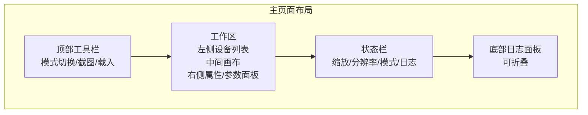
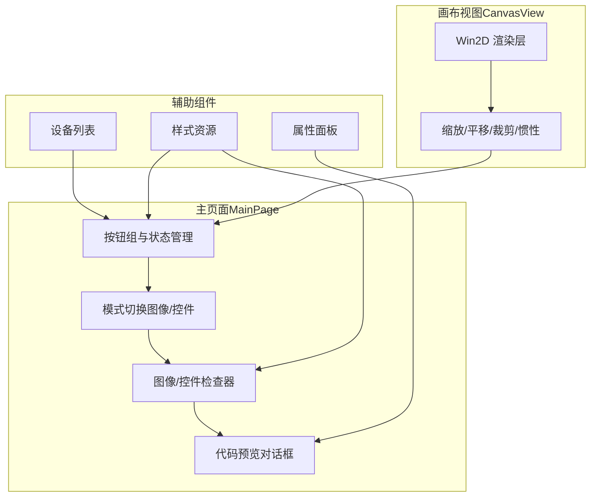
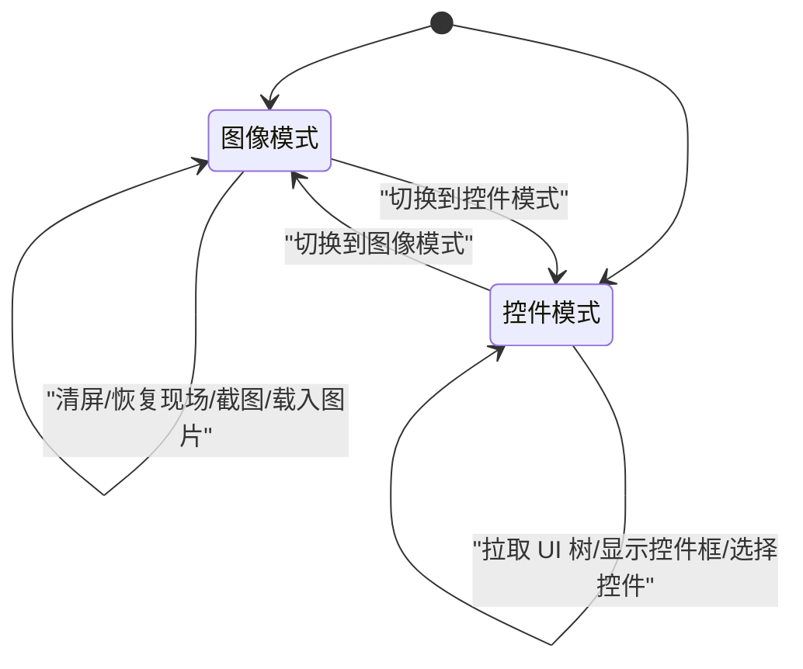
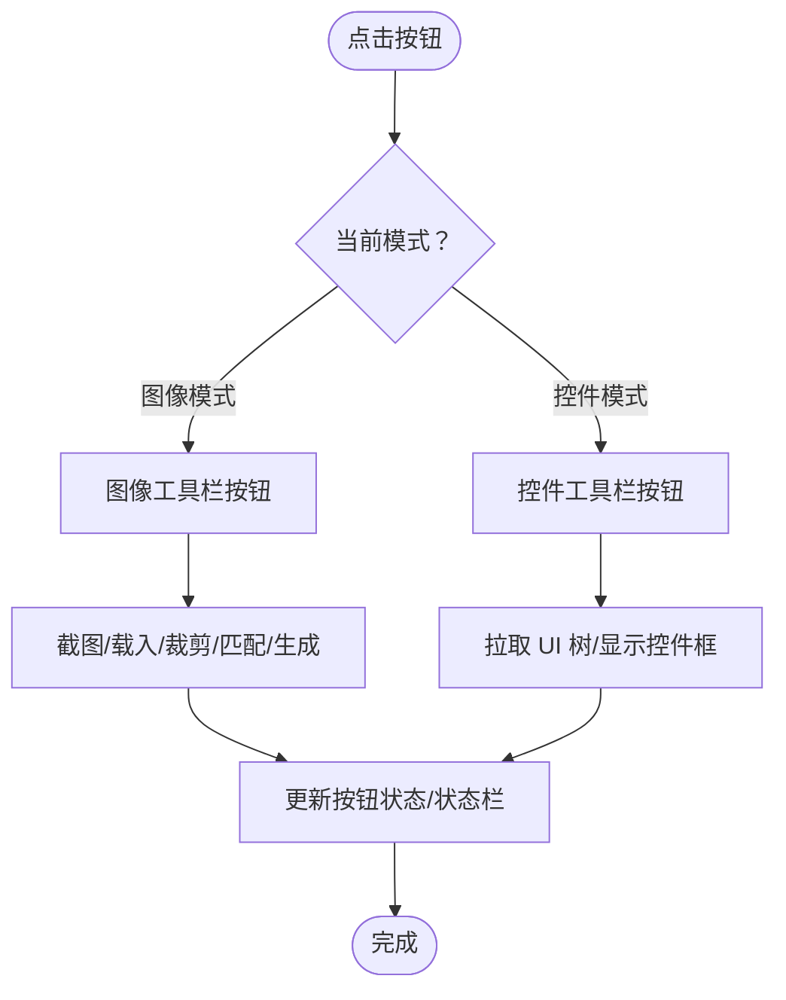
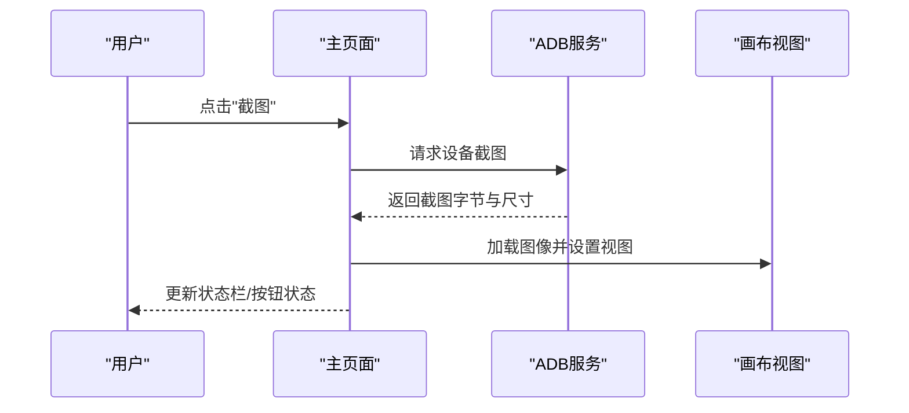
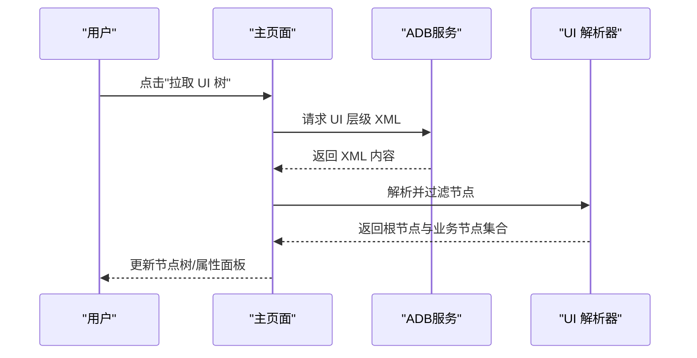
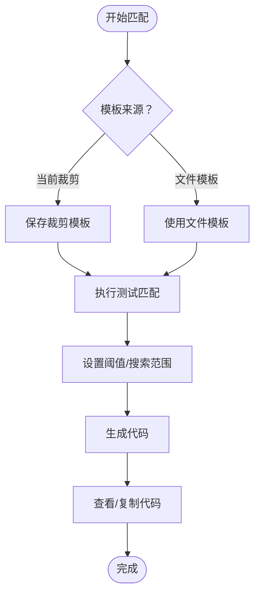
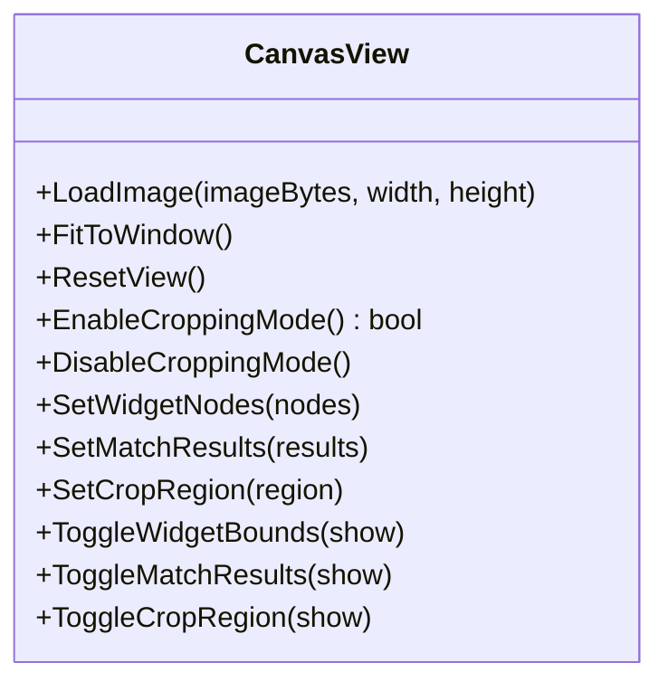
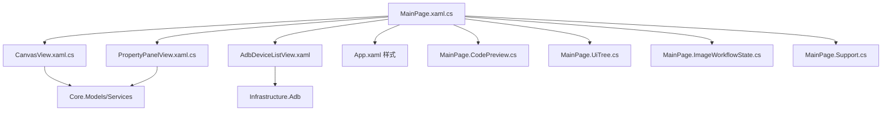

# 主工作台布局

<cite>
**本文档引用的文件**
- [MainPage.xaml](file://App/Views/MainPage.xaml)
- [MainPage.xaml.cs](file://App/Views/MainPage.xaml.cs)
- [MainPage.Workbench.cs](file://App/Views/MainPage.Workbench.cs)
- [MainPage.Buttons.cs](file://App/Views/MainPage.Buttons.cs)
- [MainPage.CodePreview.cs](file://App/Views/MainPage.CodePreview.cs)
- [MainPage.UiTree.cs](file://App/Views/MainPage.UiTree.cs)
- [MainPage.ImageWorkflowState.cs](file://App/Views/MainPage.ImageWorkflowState.cs)
- [MainPage.Support.cs](file://App/Views/MainPage.Support.cs)
- [CanvasView.xaml](file://App/Views/CanvasView.xaml)
- [CanvasView.xaml.cs](file://App/Views/CanvasView.xaml.cs)
- [PropertyPanelView.xaml](file://App/Views/PropertyPanelView.xaml)
- [PropertyPanelView.xaml.cs](file://App/Views/PropertyPanelView.xaml.cs)
- [AdbDeviceListView.xaml](file://App/Views/AdbDeviceListView.xaml)
- [App.xaml](file://App/App.xaml)
</cite>

## 目录
1. [简介](#简介)
2. [项目结构](#项目结构)
3. [核心组件](#核心组件)
4. [架构总览](#架构总览)
5. [详细组件分析](#详细组件分析)
6. [依赖关系分析](#依赖关系分析)
7. [性能考虑](#性能考虑)
8. [故障排除指南](#故障排除指南)
9. [结论](#结论)

## 简介
本文件面向 AutoJS6 开发工具的主工作台布局，系统性阐述双工作区设计（图像模式与控件模式）的界面组织方式，包括网格布局系统、工具栏设计、状态栏显示与按钮组功能分配；解释工作区切换机制、界面元素的动态显示/隐藏逻辑与响应式布局适配；梳理用户操作流程（截图捕获、UI 树解析、模板匹配与代码生成）的界面引导；并提供界面定制选项与用户体验优化建议，帮助用户高效在不同工作模式间切换。

## 项目结构
主工作台位于应用的主页面视图中，采用三层栅格布局（行定义）与三列栅格布局（列定义）相结合的方式组织界面。左侧设备列表、中间画布区域、右侧属性/参数面板形成“主工作区”，底部状态栏与可折叠日志面板提供上下文反馈，顶部标题栏包含模式切换与基础操作入口。

**图表来源**
- [MainPage.xaml:103-167](file://App/Views/MainPage.xaml#L103-L167)
- [MainPage.xaml:169-633](file://App/Views/MainPage.xaml#L169-L633)
- [MainPage.xaml:635-718](file://App/Views/MainPage.xaml#L635-L718)

**章节来源**
- [MainPage.xaml:103-167](file://App/Views/MainPage.xaml#L103-L167)
- [MainPage.xaml:169-633](file://App/Views/MainPage.xaml#L169-L633)
- [MainPage.xaml:635-718](file://App/Views/MainPage.xaml#L635-L718)

## 核心组件
- 主页面（MainPage）：承载双工作区布局、模式切换、按钮状态管理、状态提示与日志面板控制。
- 画布视图（CanvasView）：基于 Win2D 的图像渲染与交互层，支持缩放、平移、惯性滑动、裁剪区域绘制与控件边界框叠加。
- 设备列表（AdbDeviceListView）：设备发现、无线连接配置与设备选择。
- 属性面板（PropertyPanelView）：控件属性展示与代码片段生成。
- 样式资源（App.xaml）：统一卡片边框、按钮、文本样式与主题风格。

**章节来源**
- [MainPage.xaml.cs:43-60](file://App/Views/MainPage.xaml.cs#L43-L60)
- [CanvasView.xaml.cs:24-116](file://App/Views/CanvasView.xaml.cs#L24-L116)
- [AdbDeviceListView.xaml:1-136](file://App/Views/AdbDeviceListView.xaml#L1-L136)
- [PropertyPanelView.xaml.cs:12-28](file://App/Views/PropertyPanelView.xaml.cs#L12-L28)
- [App.xaml:13-76](file://App/App.xaml#L13-L76)

## 架构总览
主工作台采用“视图-模型”分离与事件驱动的交互架构。主页面负责布局与状态协调，画布视图负责渲染与交互，设备列表负责设备生命周期，属性面板负责控件信息与代码生成。通过事件（如 ScaleChanged、WidgetSelected、CropRegionChanged、CodeGenerated）实现组件间松耦合通信。

**图表来源**
- [MainPage.xaml.cs:43-60](file://App/Views/MainPage.xaml.cs#L43-L60)
- [CanvasView.xaml.cs:24-116](file://App/Views/CanvasView.xaml.cs#L24-L116)
- [App.xaml:13-76](file://App/App.xaml#L13-L76)

## 详细组件分析

### 双工作区设计与模式切换
- 图像模式：聚焦于截图、裁剪、模板匹配与代码生成。工具栏包含“适应窗口/原图 1:1/开始裁剪/退出裁剪/恢复现场/清屏”等按钮；右侧检查器提供模板/截图来源选择、阈值、全图搜索开关、测试匹配、保存模板与生成代码等功能。
- 控件模式：聚焦于 UI 树拉取、节点搜索与选择、属性查看与代码片段生成。工具栏包含“拉取 UI 树/显示控件框”等按钮；右侧检查器提供节点树、属性面板与代码动作（复制坐标/选择器/查看代码）。

**图表来源**
- [MainPage.Workbench.cs:15-61](file://App/Views/MainPage.Workbench.cs#L15-L61)
- [MainPage.xaml:135-144](file://App/Views/MainPage.xaml#L135-L144)
- [MainPage.xaml:232-251](file://App/Views/MainPage.xaml#L232-L251)

**章节来源**
- [MainPage.Workbench.cs:38-89](file://App/Views/MainPage.Workbench.cs#L38-L89)
- [MainPage.xaml:135-144](file://App/Views/MainPage.xaml#L135-L144)
- [MainPage.xaml:232-251](file://App/Views/MainPage.xaml#L232-L251)

### 网格布局系统与响应式适配
- 顶层网格（行定义）：标题栏（AutoJS6 可视化工作台）、主工作区（设备列表/画布/属性面板）、状态栏、日志面板。
- 主工作区网格（列定义）：左侧固定宽度设备列表（约 220），中间自适应画布区域，右侧固定宽度属性面板（约 336）。
- 行间距与边距：全局采用统一的边距与间距（如 16、12、8），保证在不同分辨率下的视觉一致性。
- 响应式适配：画布区域内部采用自适应缩放（FitToWindow）与 1:1 原图模式，配合状态栏实时显示缩放与分辨率信息。

**章节来源**
- [MainPage.xaml:103-167](file://App/Views/MainPage.xaml#L103-L167)
- [MainPage.xaml:169-174](file://App/Views/MainPage.xaml#L169-L174)
- [MainPage.xaml:178-183](file://App/Views/MainPage.xaml#L178-L183)
- [MainPage.xaml:635-676](file://App/Views/MainPage.xaml#L635-L676)

### 工具栏设计与按钮组功能分配
- 图像模式工具栏：适应窗口、原图 1:1、开始裁剪、退出裁剪、恢复现场、清屏。
- 控件模式工具栏：拉取 UI 树、显示控件框。
- 状态栏：状态提示气泡（成功/警告/错误）、缩放、分辨率、当前模式、查看日志。
- 日志面板：可折叠的底部日志面板，支持清空、全选、复制。

**图表来源**
- [MainPage.xaml:193-273](file://App/Views/MainPage.xaml#L193-L273)
- [MainPage.xaml:232-251](file://App/Views/MainPage.xaml#L232-L251)
- [MainPage.xaml:651-675](file://App/Views/MainPage.xaml#L651-L675)

**章节来源**
- [MainPage.xaml:193-273](file://App/Views/MainPage.xaml#L193-L273)
- [MainPage.xaml:232-251](file://App/Views/MainPage.xaml#L232-L251)
- [MainPage.xaml:651-675](file://App/Views/MainPage.xaml#L651-L675)

### 界面元素动态显示/隐藏逻辑
- 模式切换时，图像/控件检查器与对应工具栏面板互斥显示。
- 裁剪按钮根据“是否处于 1:1 视图且无裁剪模式”决定可见性与启用状态。
- 恢复现场按钮仅在存在外部截图预览快照时显示。
- 状态栏根据当前状态（成功/警告/错误）动态更新图标与背景色。

**章节来源**
- [MainPage.Workbench.cs:63-89](file://App/Views/MainPage.Workbench.cs#L63-L89)
- [MainPage.Workbench.cs:91-189](file://App/Views/MainPage.Workbench.cs#L91-L189)
- [MainPage.Buttons.cs:18-27](file://App/Views/MainPage.Buttons.cs#L18-L27)

### 用户操作流程与界面引导

#### 截图捕获与图像处理
- 选择设备后点击“截图”，触发 ADB 截图并加载至画布；若选择本地图片则走“载入图片”路径。
- 支持适应窗口与 1:1 原图两种视图模式，实时更新状态栏缩放与分辨率信息。
- 可进行裁剪区域创建与编辑，支持调整手柄与宽高比锁定。

**图表来源**
- [MainPage.xaml.cs:147-178](file://App/Views/MainPage.xaml.cs#L147-L178)
- [MainPage.xaml.cs:516-545](file://App/Views/MainPage.xaml.cs#L516-L545)
- [CanvasView.xaml.cs:472-510](file://App/Views/CanvasView.xaml.cs#L472-L510)

**章节来源**
- [MainPage.xaml.cs:147-178](file://App/Views/MainPage.xaml.cs#L147-L178)
- [MainPage.xaml.cs:516-545](file://App/Views/MainPage.xaml.cs#L516-L545)
- [CanvasView.xaml.cs:472-510](file://App/Views/CanvasView.xaml.cs#L472-L510)

#### UI 树解析与控件选择
- 在控件模式下，先准备当前截图，再点击“拉取 UI 树”，解析 XML 并过滤业务节点，构建树形结构。
- 支持按关键字搜索节点，选择节点后同步到画布与属性面板，并可生成点击代码片段。

**图表来源**
- [MainPage.xaml.cs:180-248](file://App/Views/MainPage.xaml.cs#L180-L248)
- [MainPage.UiTree.cs:49-80](file://App/Views/MainPage.UiTree.cs#L49-L80)

**章节来源**
- [MainPage.xaml.cs:180-248](file://App/Views/MainPage.xaml.cs#L180-L248)
- [MainPage.UiTree.cs:49-80](file://App/Views/MainPage.UiTree.cs#L49-L80)

#### 模板匹配与代码生成
- 图像模式下，可选择“当前裁剪区域”或“文件模板”作为模板来源；设置阈值与搜索范围（区域/全图），执行测试匹配。
- 成功匹配后可保存模板并生成代码，支持多种模板类型（封装版/图像匹配/特征匹配）的预览与复制。

**图表来源**
- [MainPage.xaml:372-381](file://App/Views/MainPage.xaml#L372-L381)
- [MainPage.xaml:482-491](file://App/Views/MainPage.xaml#L482-L491)
- [MainPage.CodePreview.cs:137-149](file://App/Views/MainPage.CodePreview.cs#L137-L149)

**章节来源**
- [MainPage.xaml:372-381](file://App/Views/MainPage.xaml#L372-L381)
- [MainPage.xaml:482-491](file://App/Views/MainPage.xaml#L482-L491)
- [MainPage.CodePreview.cs:137-149](file://App/Views/MainPage.CodePreview.cs#L137-L149)

### 画布渲染与交互
- 分层渲染：图像层（底层）+ 叠加层（上层）。叠加层绘制控件边界框、匹配结果与裁剪区域。
- 交互能力：缩放（滚轮）、平移（拖拽）、惯性滑动、裁剪模式（仅 1:1 模式可用）。
- 性能优化：CanvasBitmap 缓存池（最多 10 个），避免重复纹理创建；缩放范围限制（10%-500%）。

**图表来源**
- [CanvasView.xaml.cs:358-426](file://App/Views/CanvasView.xaml.cs#L358-L426)
- [CanvasView.xaml.cs:472-510](file://App/Views/CanvasView.xaml.cs#L472-L510)
- [CanvasView.xaml.cs:281-305](file://App/Views/CanvasView.xaml.cs#L281-L305)

**章节来源**
- [CanvasView.xaml.cs:358-426](file://App/Views/CanvasView.xaml.cs#L358-L426)
- [CanvasView.xaml.cs:472-510](file://App/Views/CanvasView.xaml.cs#L472-L510)
- [CanvasView.xaml.cs:281-305](file://App/Views/CanvasView.xaml.cs#L281-L305)

### 设备列表与无线连接
- 提供“刷新”、“无线”入口；无线连接包含首次配对与直接连接两种方式，输入 IP、端口与配对码后建立连接。
- 设备选择后，截图与 UI 树拉取按钮启用。

**章节来源**
- [AdbDeviceListView.xaml:22-42](file://App/Views/AdbDeviceListView.xaml#L22-L42)
- [AdbDeviceListView.xaml:60-133](file://App/Views/AdbDeviceListView.xaml#L60-L133)
- [MainPage.xaml.cs:120-126](file://App/Views/MainPage.xaml.cs#L120-L126)

### 属性面板与代码生成
- 属性面板展示控件 ClassName、ResourceId、Text、Bounds 等信息，并可生成点击代码片段。
- 支持复制坐标与 UiSelector 文本，便于快速粘贴到脚本中。

**章节来源**
- [PropertyPanelView.xaml.cs:32-78](file://App/Views/PropertyPanelView.xaml.cs#L32-L78)
- [MainPage.CodePreview.cs:63-82](file://App/Views/MainPage.CodePreview.cs#L63-L82)

## 依赖关系分析

**图表来源**
- [MainPage.xaml.cs:43-60](file://App/Views/MainPage.xaml.cs#L43-L60)
- [App.xaml:13-76](file://App/App.xaml#L13-L76)

**章节来源**
- [MainPage.xaml.cs:43-60](file://App/Views/MainPage.xaml.cs#L43-L60)
- [App.xaml:13-76](file://App/App.xaml#L13-L76)

## 性能考虑
- 画布渲染：使用 CanvasBitmap 缓存池减少纹理创建开销；限制缩放范围避免过度放大导致的内存压力。
- UI 树构建：仅显示业务节点，过滤布局容器；搜索时延迟构建树，避免不必要的计算。
- 事件驱动：通过事件解耦组件，减少不必要的重绘与状态同步成本。
- 日志输出：异步写入日志文本框，避免阻塞主线程。

[本节为通用性能建议，无需特定文件引用]

## 故障排除指南
- 截图失败：检查设备连接状态与权限，确认设备选择后再尝试截图。
- 无法进入裁剪模式：确保当前处于 1:1 视图且已加载截图。
- UI 树拉取失败：确认已准备当前截图且设备连接正常。
- 生成代码不可用：图像模式需先保存模板或完成外部模板的命中测试；控件模式需先选择控件。
- 日志面板无内容：点击“查看日志”展开底部面板，必要时清空后重试。

**章节来源**
- [MainPage.xaml.cs:147-178](file://App/Views/MainPage.xaml.cs#L147-L178)
- [MainPage.xaml.cs:180-248](file://App/Views/MainPage.xaml.cs#L180-L248)
- [MainPage.xaml.cs:250-285](file://App/Views/MainPage.xaml.cs#L250-L285)
- [MainPage.xaml.cs:341-358](file://App/Views/MainPage.xaml.cs#L341-L358)

## 结论
AutoJS6 开发工具的主工作台通过清晰的双工作区设计与完善的事件驱动架构，实现了从图像处理到控件分析的完整开发闭环。其网格布局与响应式适配确保了在不同分辨率下的良好体验；动态显示/隐藏逻辑与按钮状态管理提升了操作效率；日志与状态栏提供了即时反馈。结合本文档的界面引导与优化建议，用户可以更高效地在图像模式与控件模式之间切换，并完成从截图到代码生成的全流程任务。