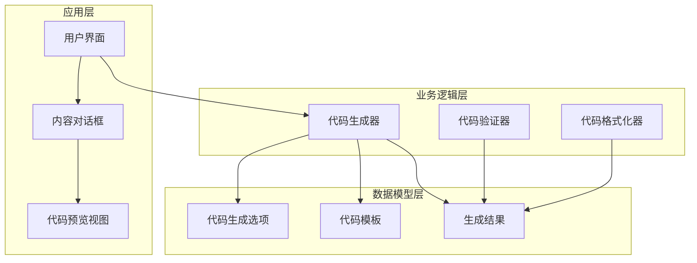
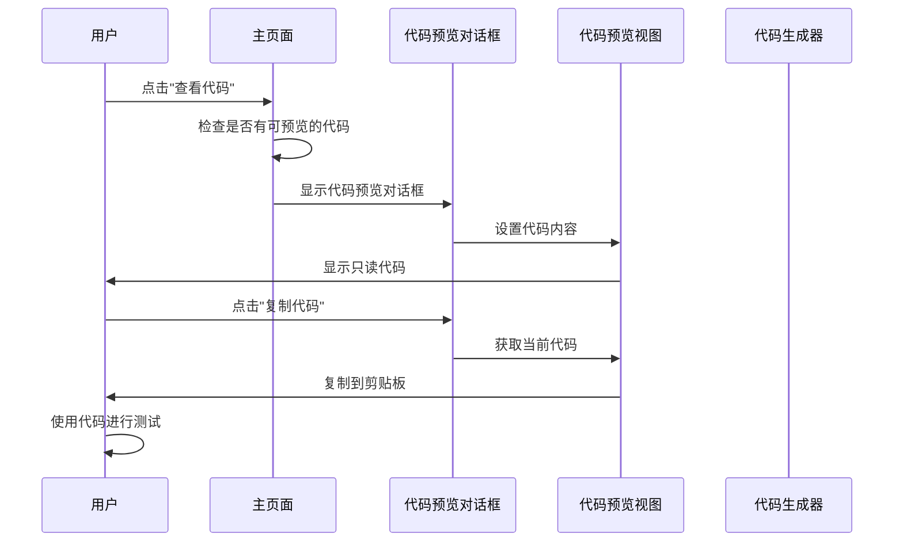
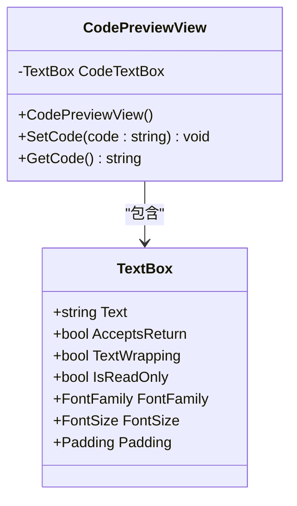
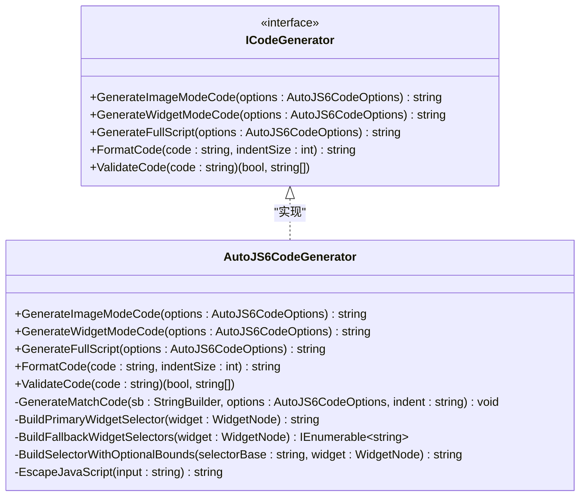
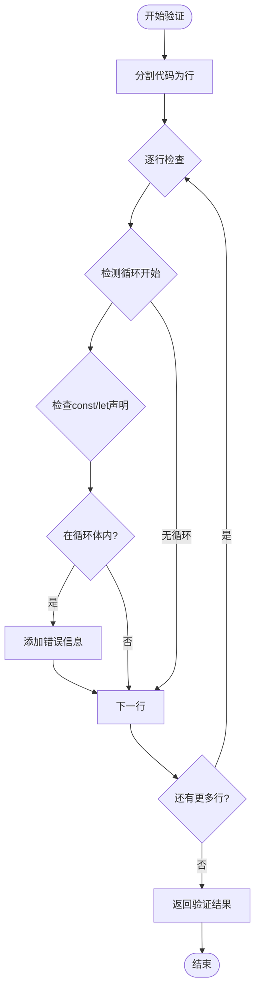
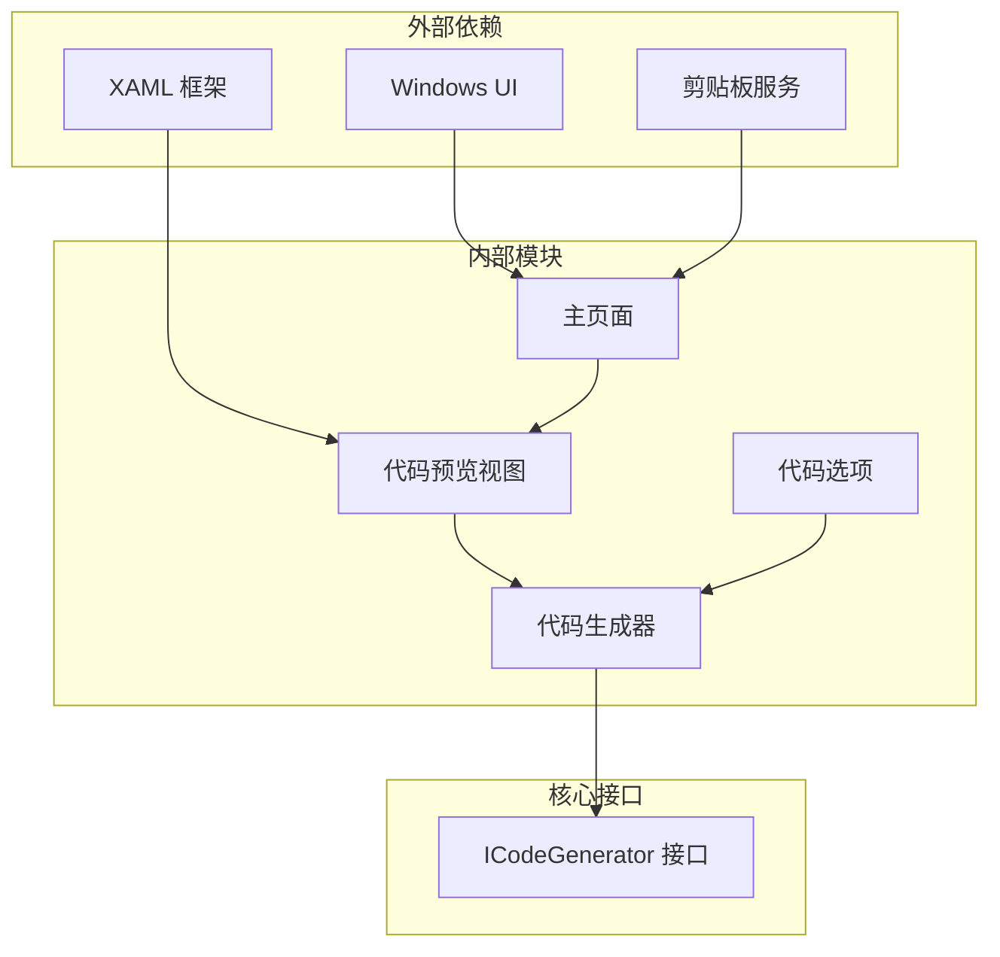

# 代码预览编辑器

<cite>
**本文档引用的文件**
- [CodePreviewView.xaml](file://App/Views/CodePreviewView.xaml)
- [CodePreviewView.xaml.cs](file://App/Views/CodePreviewView.xaml.cs)
- [MainPage.CodePreview.cs](file://App/Views/MainPage.CodePreview.cs)
- [MainPage.xaml](file://App/Views/MainPage.xaml)
- [App.xaml](file://App/App.xaml)
- [AutoJS6CodeGenerator.cs](file://Core/Services/AutoJS6CodeGenerator.cs)
- [ICodeGenerator.cs](file://Core/Abstractions/ICodeGenerator.cs)
- [AutoJS6CodeOptions.cs](file://Core/Models/AutoJS6CodeOptions.cs)
- [AutoJS6CodeGeneratorTests.cs](file://Core.Tests/AutoJS6CodeGeneratorTests.cs)
</cite>

## 目录
1. [简介](#简介)
2. [项目结构](#项目结构)
3. [核心组件](#核心组件)
4. [架构概览](#架构概览)
5. [详细组件分析](#详细组件分析)
6. [依赖关系分析](#依赖关系分析)
7. [性能考虑](#性能考虑)
8. [故障排除指南](#故障排除指南)
9. [结论](#结论)

## 简介

AutoJS6 开发工具的代码预览编辑器是一个专为 AutoJS6 自动化脚本开发设计的可视化代码展示和编辑系统。该系统提供了完整的代码生成、预览、编辑和导出功能，支持 AutoJS6 JavaScript 代码的语法高亮、代码格式化和实时预览。

该编辑器的核心功能包括：
- **代码生成**：基于 AutoJS6 代码生成器自动生成 JavaScript 代码
- **代码预览**：提供只读的代码展示界面
- **代码格式化**：自动格式化生成的代码
- **代码验证**：检查生成代码是否符合 AutoJS6 约束
- **代码导出**：支持复制代码到剪贴板和分享功能

## 项目结构

代码预览编辑器采用分层架构设计，主要分为以下几个层次：



**图表来源**
- [MainPage.xaml:743-816](file://App/Views/MainPage.xaml#L743-L816)
- [CodePreviewView.xaml:1-22](file://App/Views/CodePreviewView.xaml#L1-L22)
- [AutoJS6CodeGenerator.cs:11-357](file://Core/Services/AutoJS6CodeGenerator.cs#L11-L357)

**章节来源**
- [MainPage.xaml:743-816](file://App/Views/MainPage.xaml#L743-L816)
- [CodePreviewView.xaml:1-22](file://App/Views/CodePreviewView.xaml#L1-L22)
- [AutoJS6CodeGenerator.cs:11-357](file://Core/Services/AutoJS6CodeGenerator.cs#L11-L357)

## 核心组件

### 代码预览视图 (CodePreviewView)

代码预览视图是整个编辑器的核心组件，负责显示和管理代码内容。它是一个简单的只读文本框，具有以下特性：

- **只读模式**：防止意外修改生成的代码
- **自动换行**：支持长代码的自动换行显示
- **滚动支持**：垂直滚动条支持大量代码的浏览
- **等宽字体**：使用 Consolas 字体确保代码对齐

### 主页面集成 (MainPage)

主页面负责协调整个代码预览系统的各个组件，包括：

- **对话框管理**：控制代码预览对话框的显示和隐藏
- **模板管理**：处理不同类型的代码模板
- **交互控制**：提供复制、保存、分享等功能
- **状态管理**：维护当前选中的代码项和模板状态

### 代码生成器 (AutoJS6CodeGenerator)

代码生成器实现了 ICodeGenerator 接口，提供完整的代码生成功能：

- **图像模式代码生成**：使用 images.findImage 进行模板匹配
- **控件模式代码生成**：使用 UiSelector 进行控件查找
- **完整脚本生成**：包含初始化和清理代码的完整脚本
- **代码格式化**：提供基本的代码格式化功能
- **代码验证**：检查生成代码是否符合 AutoJS6 约束

**章节来源**
- [CodePreviewView.xaml.cs:9-28](file://App/Views/CodePreviewView.xaml.cs#L9-L28)
- [MainPage.CodePreview.cs:12-268](file://App/Views/MainPage.CodePreview.cs#L12-L268)
- [AutoJS6CodeGenerator.cs:11-357](file://Core/Services/AutoJS6CodeGenerator.cs#L11-L357)

## 架构概览

代码预览编辑器采用 MVVM 架构模式，通过清晰的职责分离实现松耦合的设计：



**图表来源**
- [MainPage.CodePreview.cs:45-103](file://App/Views/MainPage.CodePreview.cs#L45-L103)
- [CodePreviewView.xaml.cs:19-27](file://App/Views/CodePreviewView.xaml.cs#L19-L27)

系统的主要交互流程包括：

1. **代码生成流程**：用户触发代码生成 → 代码生成器生成代码 → 主页面更新状态 → 显示预览对话框
2. **代码预览流程**：用户请求预览 → 主页面配置模板 → 代码预览视图显示内容 → 用户进行操作
3. **代码导出流程**：用户选择导出 → 代码预览视图获取内容 → 复制到剪贴板 → 完成导出

**章节来源**
- [MainPage.CodePreview.cs:137-160](file://App/Views/MainPage.CodePreview.cs#L137-L160)
- [CodePreviewView.xaml.cs:19-27](file://App/Views/CodePreviewView.xaml.cs#L19-L27)

## 详细组件分析

### 代码预览视图组件

代码预览视图是一个简单的用户控件，实现了基本的代码展示功能：



**图表来源**
- [CodePreviewView.xaml.cs:9-28](file://App/Views/CodePreviewView.xaml.cs#L9-L28)
- [CodePreviewView.xaml:10-19](file://App/Views/CodePreviewView.xaml#L10-L19)

该组件的特点：
- **简单设计**：只包含一个 TextBox 控件，保持界面简洁
- **只读模式**：IsReadOnly 属性确保代码不会被意外修改
- **格式化支持**：等宽字体和适当的内边距确保代码可读性
- **响应式布局**：支持自动换行和滚动

### 主页面代码预览管理

主页面负责管理所有与代码预览相关的功能：

```mermaid
flowchart TD
Start([用户点击"查看代码"]) --> CheckCode{检查是否有代码}
CheckCode --> |无代码| ShowWarning[显示警告提示]
CheckCode --> |有代码| CheckMode{检查工作台模式}
CheckMode --> |图像模式| ShowImageTemplates[显示图像模板]
CheckMode --> |其他模式| ShowSingleCode[显示单个代码]
ShowImageTemplates --> ConfigTemplates[配置模板]
ShowSingleCode --> ConfigSingle[配置单个代码]
ConfigTemplates --> ShowDialog[显示预览对话框]
ConfigSingle --> ShowDialog
ShowDialog --> UserAction{用户操作}
UserAction --> |复制代码| CopyCode[复制到剪贴板]
UserAction --> |打开Gist| OpenGist[打开GitHub Gist]
UserAction --> |关闭| CloseDialog[关闭对话框]
CopyCode --> Success[操作成功]
OpenGist --> Success
CloseDialog --> End([结束])
Success --> End
ShowWarning --> End
```

**图表来源**
- [MainPage.CodePreview.cs:45-120](file://App/Views/MainPage.CodePreview.cs#L45-L120)

**章节来源**
- [MainPage.CodePreview.cs:14-268](file://App/Views/MainPage.CodePreview.cs#L14-L268)

### 代码生成器组件

代码生成器实现了完整的代码生成功能，支持多种模式：



**图表来源**
- [ICodeGenerator.cs:8-45](file://Core/Abstractions/ICodeGenerator.cs#L8-L45)
- [AutoJS6CodeGenerator.cs:11-357](file://Core/Services/AutoJS6CodeGenerator.cs#L11-L357)

代码生成器的关键功能：

1. **图像模式代码生成**：支持模板匹配和特征匹配两种方式
2. **控件模式代码生成**：支持多种选择器组合和降级策略
3. **代码格式化**：提供基本的缩进和格式化功能
4. **代码验证**：检查 Rhino 引擎约束和循环体内变量声明规则

**章节来源**
- [AutoJS6CodeGenerator.cs:13-288](file://Core/Services/AutoJS6CodeGenerator.cs#L13-L288)
- [ICodeGenerator.cs:8-45](file://Core/Abstractions/ICodeGenerator.cs#L8-L45)

### 代码验证系统

代码验证系统确保生成的代码符合 AutoJS6 的特定要求：



**图表来源**
- [AutoJS6CodeGenerator.cs:226-258](file://Core/Services/AutoJS6CodeGenerator.cs#L226-L258)

验证规则包括：
- **循环体内变量声明限制**：禁止在循环体内使用 const 和 let
- **Rhino 引擎兼容性**：确保代码与 AutoJS6 的 JavaScript 引擎兼容

**章节来源**
- [AutoJS6CodeGenerator.cs:226-258](file://Core/Services/AutoJS6CodeGenerator.cs#L226-L258)

## 依赖关系分析

代码预览编辑器的依赖关系相对简单，主要遵循单一职责原则：



**图表来源**
- [MainPage.xaml:743-816](file://App/Views/MainPage.xaml#L743-L816)
- [CodePreviewView.xaml:1-22](file://App/Views/CodePreviewView.xaml#L1-L22)
- [AutoJS6CodeGenerator.cs:11-357](file://Core/Services/AutoJS6CodeGenerator.cs#L11-L357)

主要依赖关系：
- **UI 层依赖**：代码预览视图依赖 XAML 框架和 Windows UI 组件
- **业务逻辑依赖**：主页面依赖代码生成器和各种服务
- **接口依赖**：代码生成器实现 ICodeGenerator 接口
- **系统服务依赖**：依赖剪贴板服务进行代码导出

**章节来源**
- [MainPage.xaml:743-816](file://App/Views/MainPage.xaml#L743-L816)
- [CodePreviewView.xaml:1-22](file://App/Views/CodePreviewView.xaml#L1-L22)
- [AutoJS6CodeGenerator.cs:11-357](file://Core/Services/AutoJS6CodeGenerator.cs#L11-L357)

## 性能考虑

代码预览编辑器在设计时充分考虑了性能优化：

### 内存管理
- **字符串处理**：使用 StringBuilder 进行高效的字符串拼接
- **对象复用**：避免频繁创建临时对象
- **延迟加载**：只有在需要时才加载和显示代码内容

### UI 响应性
- **异步操作**：对话框显示采用异步方式，不阻塞主线程
- **懒加载**：代码内容在对话框首次显示时才设置
- **事件处理**：使用轻量级事件处理器，避免内存泄漏

### 代码生成优化
- **模板缓存**：重复使用的模板代码进行缓存
- **增量更新**：只更新发生变化的部分
- **批量操作**：减少 UI 更新的频率

## 故障排除指南

### 常见问题及解决方案

#### 代码无法显示
**症状**：点击"查看代码"后对话框显示为空白
**可能原因**：
- 没有生成任何代码
- 代码生成失败
- 对话框配置错误

**解决方法**：
1. 确认已经生成了有效的代码
2. 检查代码生成器的状态
3. 重新触发代码生成过程

#### 代码复制失败
**症状**：点击"复制代码"后没有反应
**可能原因**：
- 当前没有可复制的代码
- 剪贴板访问权限问题
- 代码内容为空

**解决方法**：
1. 确认对话框中有代码内容
2. 检查应用程序的剪贴板访问权限
3. 重新生成代码后尝试复制

#### 代码验证错误
**症状**：生成的代码显示验证错误
**可能原因**：
- 在循环体内使用了 const 或 let
- 代码不符合 Rhino 引擎要求

**解决方法**：
1. 将 const 和 let 改为 var
2. 检查代码是否符合 AutoJS6 的 JavaScript 规范
3. 使用代码格式化功能重新格式化

**章节来源**
- [MainPage.CodePreview.cs:90-120](file://App/Views/MainPage.CodePreview.cs#L90-L120)
- [AutoJS6CodeGenerator.cs:226-258](file://Core/Services/AutoJS6CodeGenerator.cs#L226-L258)

## 结论

AutoJS6 开发工具的代码预览编辑器是一个设计精良、功能完整的代码展示系统。它通过清晰的架构设计、合理的组件分离和完善的错误处理机制，为用户提供了一个高效、可靠的代码预览和编辑体验。

### 主要优势

1. **简洁直观**：界面设计简洁，功能明确，易于使用
2. **功能完整**：涵盖了从代码生成到导出的完整流程
3. **扩展性强**：基于接口的设计便于功能扩展和维护
4. **性能优秀**：优化的内存管理和异步操作确保良好的用户体验

### 技术亮点

- **只读设计**：防止意外修改生成的代码
- **模板系统**：支持多种代码模板的管理和切换
- **验证机制**：内置代码质量检查确保代码可靠性
- **导出功能**：提供便捷的代码导出和分享能力

该系统为 AutoJS6 自动化脚本开发提供了强有力的技术支撑，显著提高了开发效率和代码质量。