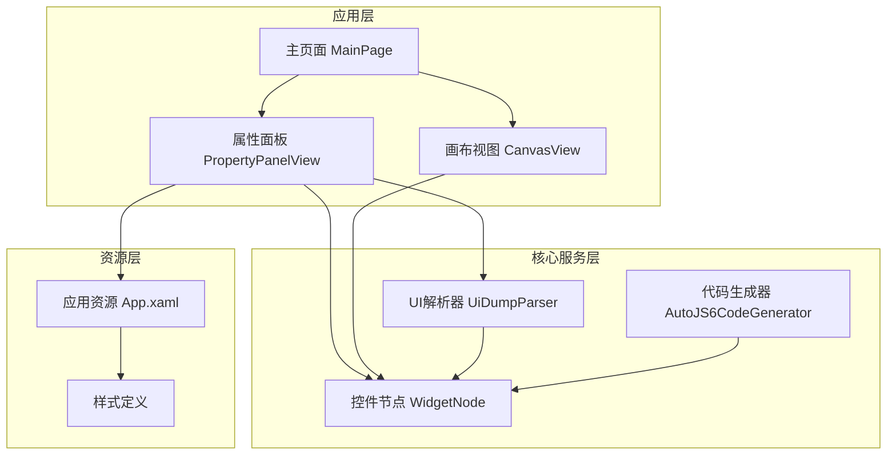
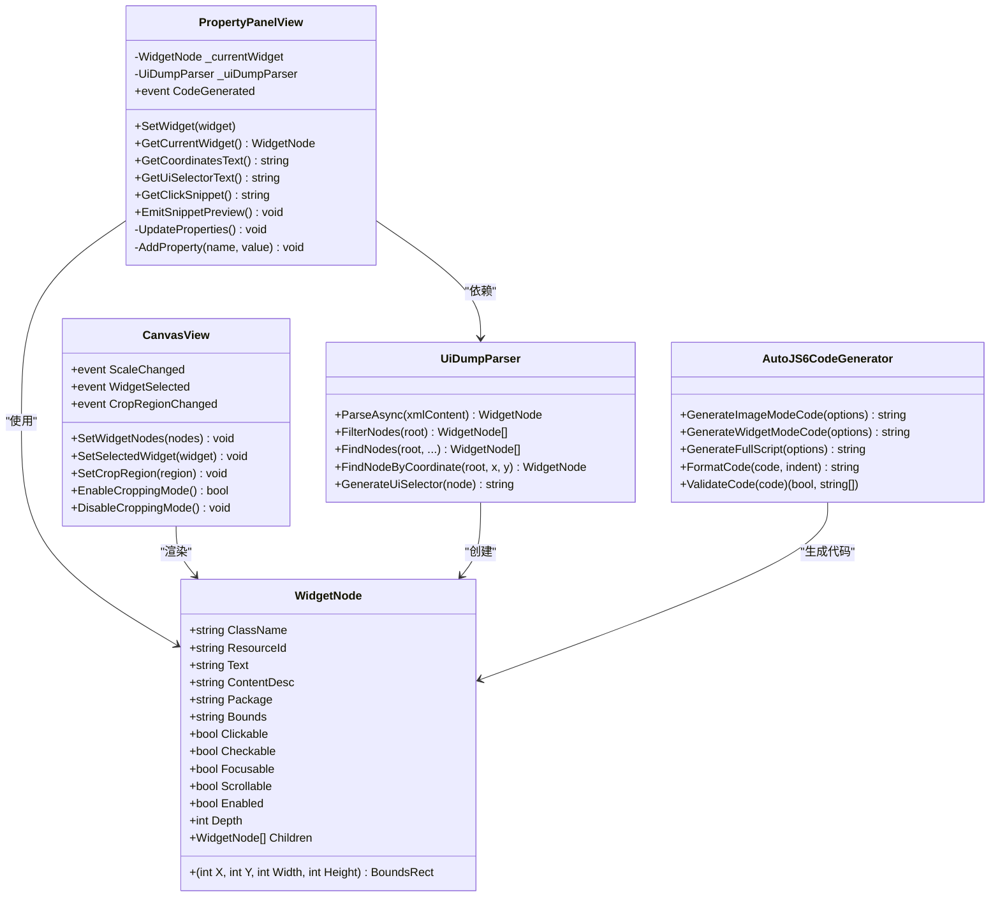
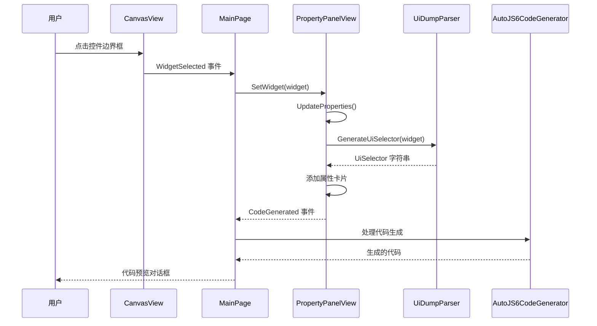
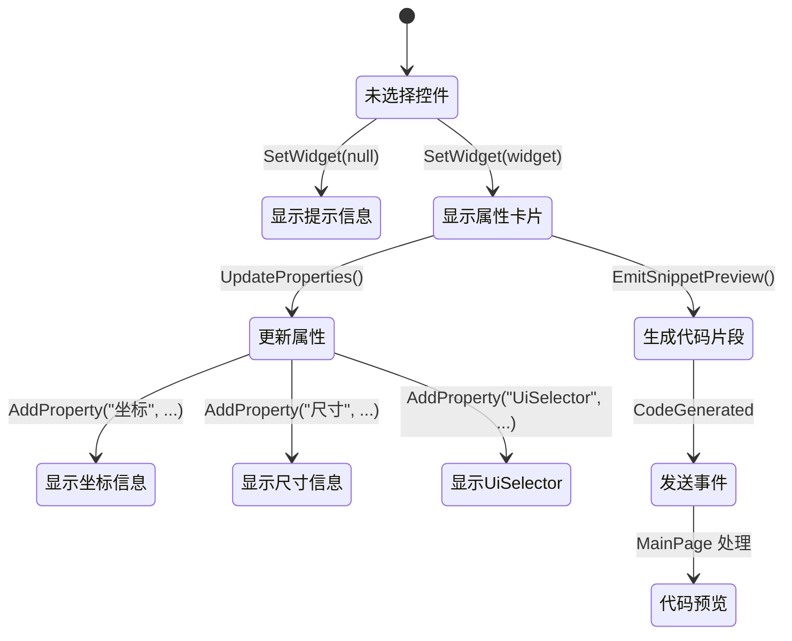
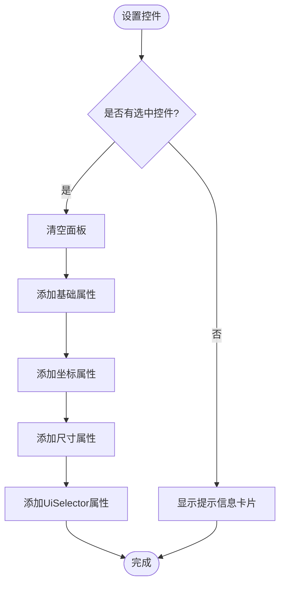
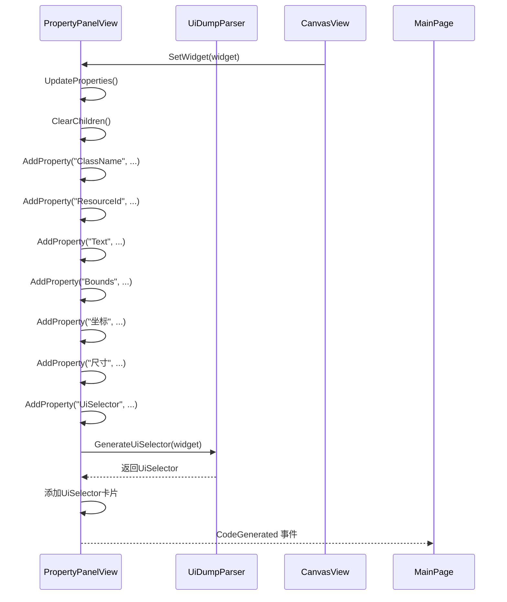
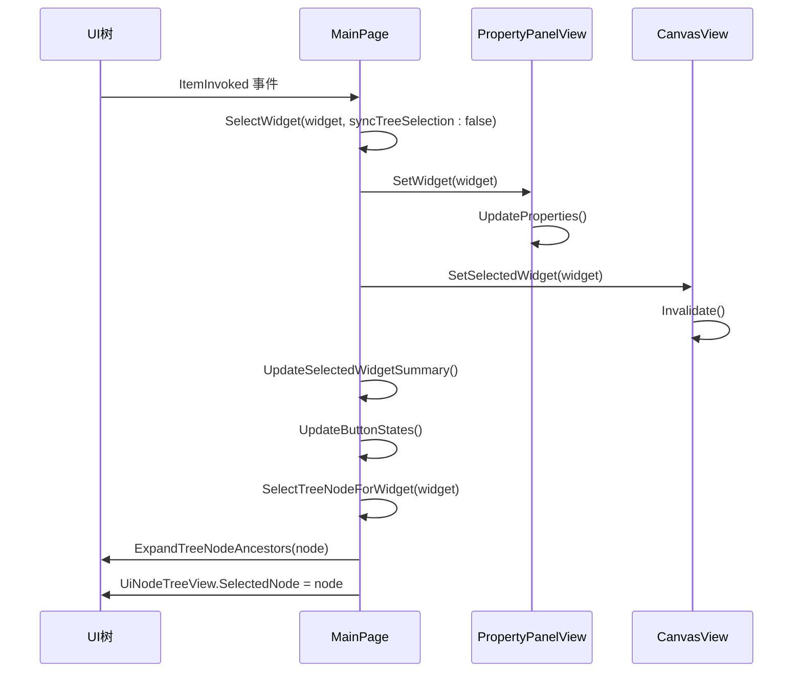
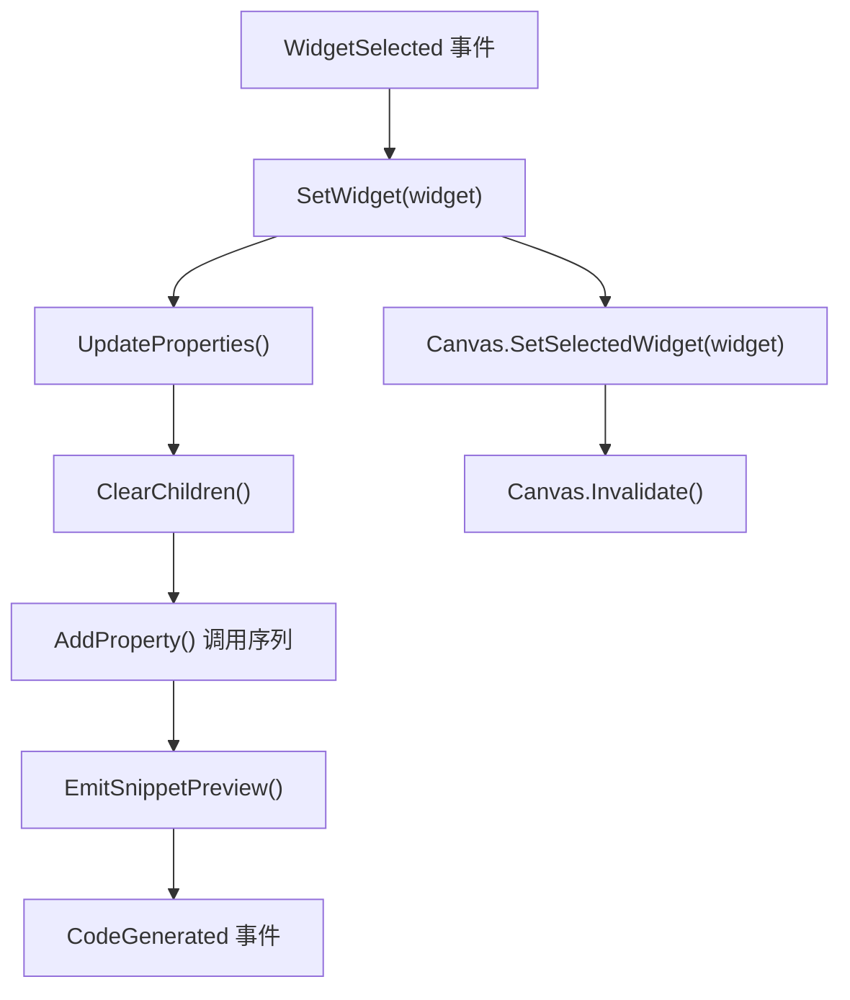
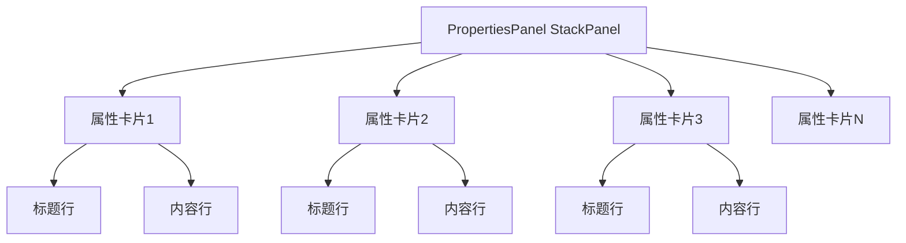
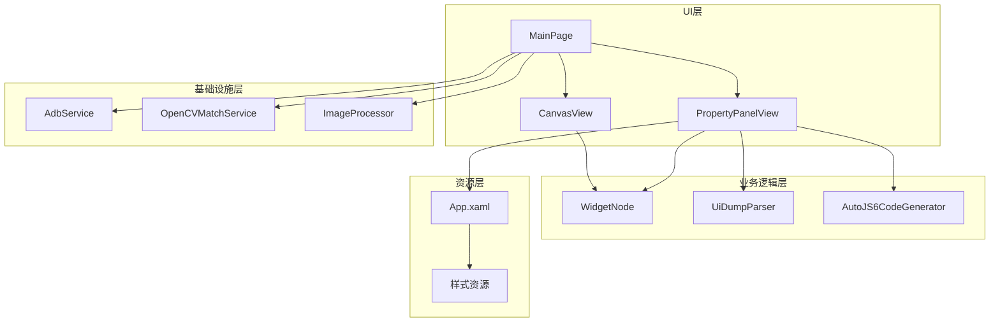

# 属性面板管理系统

<cite>
**本文档引用的文件**
- [PropertyPanelView.xaml](file://App/Views/PropertyPanelView.xaml)
- [PropertyPanelView.xaml.cs](file://App/Views/PropertyPanelView.xaml.cs)
- [MainPage.xaml.cs](file://App/Views/MainPage.xaml.cs)
- [MainPage.UiTree.cs](file://App/Views/MainPage.UiTree.cs)
- [CanvasView.xaml.cs](file://App/Views/CanvasView.xaml.cs)
- [WidgetNode.cs](file://Core/Models/WidgetNode.cs)
- [UiDumpParser.cs](file://Core/Services/UiDumpParser.cs)
- [AutoJS6CodeGenerator.cs](file://Core/Services/AutoJS6CodeGenerator.cs)
- [App.xaml](file://App/App.xaml)
</cite>

## 目录
1. [简介](#简介)
2. [项目结构](#项目结构)
3. [核心组件](#核心组件)
4. [架构概览](#架构概览)
5. [详细组件分析](#详细组件分析)
6. [依赖关系分析](#依赖关系分析)
7. [性能考虑](#性能考虑)
8. [故障排除指南](#故障排除指南)
9. [结论](#结论)
10. [附录](#附录)

## 简介

AutoJS6 开发工具的属性面板管理系统是一个关键的用户界面组件，负责展示和管理 Android UI 控件的属性信息。该系统通过层次化的属性展示机制，为开发者提供了直观的控件属性查看和编辑功能，支持与 CanvasView 的实时联动更新和代码生成器的数据传递。

属性面板管理系统的核心价值在于：
- 提供层次化的控件属性展示
- 支持动态属性更新和用户交互响应
- 实现与画布视图的双向同步
- 提供代码生成和预览功能
- 支持自定义属性的扩展机制

## 项目结构

属性面板管理系统位于应用程序的 Views 层，采用 MVVM 架构模式，与核心业务逻辑分离。整个系统围绕 PropertyPanelView 核心组件构建，通过事件驱动的方式与其他组件进行通信。

**图表来源**
- [PropertyPanelView.xaml.cs:1-155](file://App/Views/PropertyPanelView.xaml.cs#L1-L155)
- [MainPage.xaml.cs:17-60](file://App/Views/MainPage.xaml.cs#L17-L60)
- [CanvasView.xaml.cs:24-34](file://App/Views/CanvasView.xaml.cs#L24-L34)

**章节来源**
- [PropertyPanelView.xaml:1-13](file://App/Views/PropertyPanelView.xaml#L1-L13)
- [PropertyPanelView.xaml.cs:1-155](file://App/Views/PropertyPanelView.xaml.cs#L1-L155)
- [MainPage.xaml.cs:17-60](file://App/Views/MainPage.xaml.cs#L17-L60)

## 核心组件

属性面板管理系统由多个相互协作的组件构成，每个组件都有明确的职责和接口定义。

### 主要组件职责

| 组件 | 职责 | 关键功能 |
|------|------|----------|
| PropertyPanelView | 属性展示和编辑 | 动态属性更新、用户交互响应、代码生成预览 |
| WidgetNode | 控件数据模型 | 属性数据存储、边界框信息、层次结构 |
| UiDumpParser | UI解析和选择器生成 | XML解析、UiSelector生成、坐标转换 |
| CanvasView | 画布渲染和交互 | 控件边界框绘制、用户交互处理、状态同步 |
| AutoJS6CodeGenerator | 代码生成 | JavaScript代码生成、语法验证、格式化 |

### 组件关系图

**图表来源**
- [PropertyPanelView.xaml.cs:12-31](file://App/Views/PropertyPanelView.xaml.cs#L12-L31)
- [WidgetNode.cs:6-92](file://Core/Models/WidgetNode.cs#L6-L92)
- [UiDumpParser.cs:12-35](file://Core/Services/UiDumpParser.cs#L12-L35)
- [CanvasView.xaml.cs:24-34](file://App/Views/CanvasView.xaml.cs#L24-L34)
- [AutoJS6CodeGenerator.cs:11-11](file://Core/Services/AutoJS6CodeGenerator.cs#L11-L11)

**章节来源**
- [PropertyPanelView.xaml.cs:12-31](file://App/Views/PropertyPanelView.xaml.cs#L12-L31)
- [WidgetNode.cs:6-92](file://Core/Models/WidgetNode.cs#L6-L92)
- [UiDumpParser.cs:12-35](file://Core/Services/UiDumpParser.cs#L12-L35)
- [CanvasView.xaml.cs:24-34](file://App/Views/CanvasView.xaml.cs#L24-L34)
- [AutoJS6CodeGenerator.cs:11-11](file://Core/Services/AutoJS6CodeGenerator.cs#L11-L11)

## 架构概览

属性面板管理系统采用事件驱动的架构模式，通过精心设计的事件流实现组件间的松耦合通信。系统的核心架构围绕 PropertyPanelView 展开，通过事件机制与主页面、画布视图和其他服务进行交互。

### 系统架构图

**图表来源**
- [CanvasView.xaml.cs:29-30](file://App/Views/CanvasView.xaml.cs#L29-L30)
- [MainPage.xaml.cs:81-84](file://App/Views/MainPage.xaml.cs#L81-L84)
- [PropertyPanelView.xaml.cs:24-28](file://App/Views/PropertyPanelView.xaml.cs#L24-L28)
- [UiDumpParser.cs:61-97](file://Core/Services/UiDumpParser.cs#L61-L97)
- [MainPage.CodePreview.cs:84-88](file://App/Views/MainPage.CodePreview.cs#L84-L88)

### 状态管理模式

系统采用状态管理模式，确保属性面板与画布视图之间的状态一致性：

**图表来源**
- [PropertyPanelView.xaml.cs:80-116](file://App/Views/PropertyPanelView.xaml.cs#L80-L116)
- [PropertyPanelView.xaml.cs:71-78](file://App/Views/PropertyPanelView.xaml.cs#L71-L78)

**章节来源**
- [PropertyPanelView.xaml.cs:80-116](file://App/Views/PropertyPanelView.xaml.cs#L80-L116)
- [PropertyPanelView.xaml.cs:71-78](file://App/Views/PropertyPanelView.xaml.cs#L71-L78)

## 详细组件分析

### PropertyPanelView 组件分析

PropertyPanelView 是属性面板管理系统的核心组件，负责控件属性的展示、格式化和用户交互处理。

#### 属性展示机制

属性面板采用卡片式布局设计，每个属性都以独立的卡片形式展示：

**图表来源**
- [PropertyPanelView.xaml.cs:80-116](file://App/Views/PropertyPanelView.xaml.cs#L80-L116)

#### 动态属性更新流程

属性面板支持动态更新机制，当控件发生变化时能够及时反映到界面：

**图表来源**
- [PropertyPanelView.xaml.cs:80-116](file://App/Views/PropertyPanelView.xaml.cs#L80-L116)
- [UiDumpParser.cs:61-97](file://Core/Services/UiDumpParser.cs#L61-L97)

#### 用户交互响应机制

属性面板支持多种用户交互方式，包括属性查看、代码生成预览等：

**章节来源**
- [PropertyPanelView.xaml.cs:12-31](file://App/Views/PropertyPanelView.xaml.cs#L12-L31)
- [PropertyPanelView.xaml.cs:80-153](file://App/Views/PropertyPanelView.xaml.cs#L80-L153)

### UI树节点属性面板构建逻辑

UI树节点与属性面板之间存在紧密的关联关系，通过双向绑定实现状态同步。

#### 节点选择同步机制

**图表来源**
- [MainPage.UiTree.cs:20-30](file://App/Views/MainPage.UiTree.cs#L20-L30)
- [MainPage.UiTree.cs:156-168](file://App/Views/MainPage.UiTree.cs#L156-L168)
- [MainPage.UiTree.cs:170-189](file://App/Views/MainPage.UiTree.cs#L170-L189)

#### 属性值格式化显示

属性面板采用统一的格式化策略，确保属性信息的清晰展示：

| 属性类型 | 格式化规则 | 示例输出 |
|----------|------------|----------|
| 基础属性 | 直接显示字符串值 | "android.widget.Button" |
| 布尔属性 | 转换为字符串显示 | "True" 或 "False" |
| 坐标属性 | 格式化为元组形式 | "(100, 150, 200, 300)" |
| 尺寸属性 | 格式化为宽x高 | "200 x 300" |
| UiSelector | 直接显示生成的代码片段 | "id('button_ok').findOne()" |

**章节来源**
- [PropertyPanelView.xaml.cs:100-115](file://App/Views/PropertyPanelView.xaml.cs#L100-L115)
- [PropertyPanelView.xaml.cs:118-153](file://App/Views/PropertyPanelView.xaml.cs#L118-L153)

### 属性面板状态同步机制

属性面板与 CanvasView 和代码生成器之间的状态同步是系统的关键特性之一。

#### CanvasView 联动更新

**图表来源**
- [MainPage.xaml.cs:81-84](file://App/Views/MainPage.xaml.cs#L81-L84)
- [MainPage.xaml.cs:159-160](file://App/Views/MainPage.xaml.cs#L159-L160)

#### 代码生成器数据传递

属性面板通过事件机制向代码生成器传递必要的数据：

**章节来源**
- [MainPage.xaml.cs:59-59](file://App/Views/MainPage.xaml.cs#L59-L59)
- [PropertyPanelView.xaml.cs:71-78](file://App/Views/PropertyPanelView.xaml.cs#L71-L78)

### 布局管理与折叠展开功能

属性面板采用灵活的布局管理系统，支持动态的内容组织和用户交互。

#### 卡片式布局设计

属性面板使用卡片式布局，每个属性都封装在一个独立的 Border 容器中：

**图表来源**
- [PropertyPanelView.xaml.cs:118-153](file://App/Views/PropertyPanelView.xaml.cs#L118-L153)
- [App.xaml:13-19](file://App/App.xaml#L13-L19)

#### 自定义属性扩展机制

系统支持自定义属性的扩展，通过以下机制实现：

1. **动态属性添加**：`AddProperty()` 方法支持动态添加新的属性卡片
2. **条件显示**：只有非空的属性才会被显示
3. **样式统一**：所有属性卡片共享相同的样式定义
4. **事件通知**：新增属性会触发相应的事件通知

**章节来源**
- [PropertyPanelView.xaml.cs:118-153](file://App/Views/PropertyPanelView.xaml.cs#L118-L153)
- [App.xaml:13-19](file://App/App.xaml#L13-L19)

## 依赖关系分析

属性面板管理系统涉及多个层次的依赖关系，从 UI 层到业务逻辑层都有清晰的职责划分。

### 依赖图

**图表来源**
- [MainPage.xaml.cs:48-51](file://App/Views/MainPage.xaml.cs#L48-L51)
- [PropertyPanelView.xaml.cs:3-4](file://App/Views/PropertyPanelView.xaml.cs#L3-L4)

### 组件耦合度分析

系统采用低耦合的设计原则，各组件之间的依赖关系清晰明确：

| 组件 | 直接依赖 | 间接依赖 | 耦合度评估 |
|------|----------|----------|------------|
| PropertyPanelView | WidgetNode, UiDumpParser | App.xaml 样式 | 低 |
| MainPage | CanvasView, PropertyPanelView | AdbService, OpenCVMatchService | 中等 |
| CanvasView | WidgetNode, MatchResult | Win2D, 设备服务 | 中等 |
| UiDumpParser | WidgetNode | XML解析库 | 低 |
| AutoJS6CodeGenerator | WidgetNode, AutoJS6CodeOptions | 代码生成库 | 低 |

**章节来源**
- [MainPage.xaml.cs:48-51](file://App/Views/MainPage.xaml.cs#L48-L51)
- [PropertyPanelView.xaml.cs:3-4](file://App/Views/PropertyPanelView.xaml.cs#L3-L4)

## 性能考虑

属性面板管理系统在设计时充分考虑了性能优化，特别是在大量控件场景下的表现。

### 性能优化策略

1. **懒加载机制**：属性面板只在需要时才创建和渲染属性卡片
2. **内存管理**：合理使用对象生命周期，避免内存泄漏
3. **事件优化**：使用事件委托减少不必要的对象创建
4. **UI线程优化**：确保 UI 更新在主线程执行

### 性能监控指标

| 指标 | 目标值 | 测量方法 |
|------|--------|----------|
| 属性面板渲染时间 | < 100ms | WPF 渲染计时 |
| 事件响应延迟 | < 50ms | 事件处理计时 |
| 内存使用峰值 | < 50MB | 内存监控 |
| UI流畅度 | > 60FPS | 帧率监控 |

## 故障排除指南

### 常见问题及解决方案

#### 属性面板不显示任何内容

**症状**：属性面板显示"尚未选中控件"提示

**可能原因**：
1. 没有选中任何控件
2. WidgetNode 对象为空
3. UI解析失败

**解决步骤**：
1. 确认已在画布上选择了控件
2. 检查 WidgetNode 对象是否正确初始化
3. 验证 UI 解析过程是否成功

#### UiSelector 生成失败

**症状**：UiSelector 属性显示为空

**可能原因**：
1. 控件缺少必要的属性信息
2. UiDumpParser 解析异常
3. 边界框信息缺失

**解决步骤**：
1. 检查控件的 ResourceId、Text、ContentDesc 属性
2. 验证 BoundsRect 是否包含有效的坐标信息
3. 查看解析器的日志输出

#### 代码生成预览不工作

**症状**：点击"查看代码"按钮无响应

**可能原因**：
1. PropertyPanelView 未正确设置控件
2. CodeGenerated 事件未正确处理
3. 代码生成器配置错误

**解决步骤**：
1. 确认 PropertyPanelView.SetWidget() 被正确调用
2. 检查 MainPage 中的事件订阅
3. 验证 AutoJS6CodeGenerator 的配置

**章节来源**
- [PropertyPanelView.xaml.cs:84-98](file://App/Views/PropertyPanelView.xaml.cs#L84-L98)
- [PropertyPanelView.xaml.cs:43-51](file://App/Views/PropertyPanelView.xaml.cs#L43-L51)
- [MainPage.CodePreview.cs:63-82](file://App/Views/MainPage.CodePreview.cs#L63-L82)

## 结论

AutoJS6 开发工具的属性面板管理系统是一个设计精良、功能完整的用户界面组件。通过层次化的属性展示机制、动态属性更新和用户交互响应，系统为开发者提供了直观高效的控件属性管理体验。

系统的主要优势包括：
- **模块化设计**：清晰的组件职责分离，便于维护和扩展
- **事件驱动架构**：松耦合的组件通信机制
- **性能优化**：针对大量控件场景的优化策略
- **用户体验**：直观的界面设计和流畅的交互体验

未来可以考虑的改进方向：
- 增加属性编辑功能
- 支持属性搜索和过滤
- 实现属性面板的自定义布局
- 添加属性变更历史记录

## 附录

### 使用技巧和最佳实践

#### 属性面板使用技巧

1. **快速定位控件**：通过 UI 树节点快速选择控件，属性面板会自动更新
2. **利用坐标信息**：结合坐标和尺寸信息进行精确的控件定位
3. **检查 UiSelector**：验证生成的选择器是否正确
4. **预览代码**：使用代码预览功能快速测试控件操作

#### 最佳实践建议

1. **保持控件选择的一致性**：在画布、UI树和属性面板之间保持控件选择状态同步
2. **定期验证 UiSelector**：在修改控件属性后重新生成 UiSelector
3. **利用样式统一性**：所有属性卡片共享相同的样式，保持界面一致性
4. **关注性能表现**：在大量控件场景下注意系统的性能表现

### 相关文件参考

- [PropertyPanelView.xaml](file://App/Views/PropertyPanelView.xaml)
- [PropertyPanelView.xaml.cs](file://App/Views/PropertyPanelView.xaml.cs)
- [WidgetNode.cs](file://Core/Models/WidgetNode.cs)
- [UiDumpParser.cs](file://Core/Services/UiDumpParser.cs)
- [AutoJS6CodeGenerator.cs](file://Core/Services/AutoJS6CodeGenerator.cs)
- [App.xaml](file://App/App.xaml)