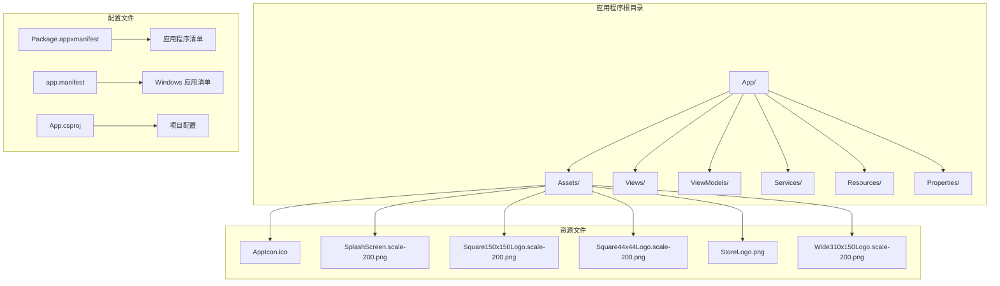
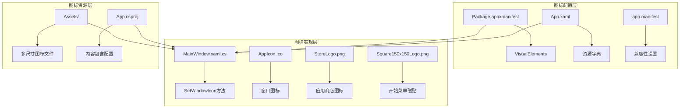
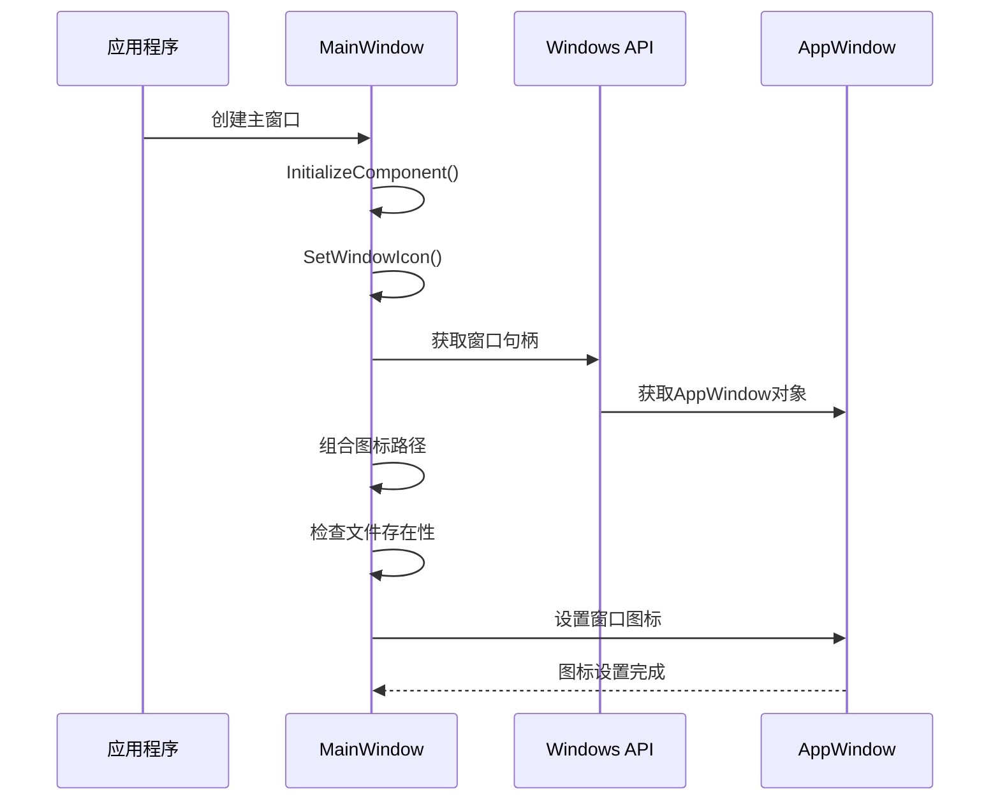
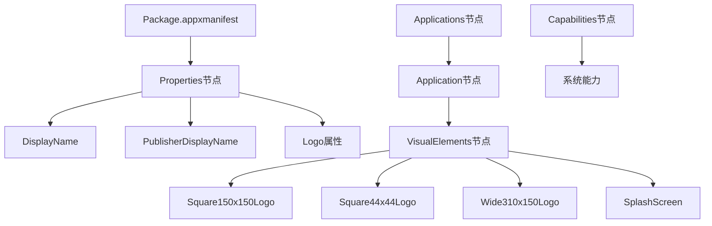
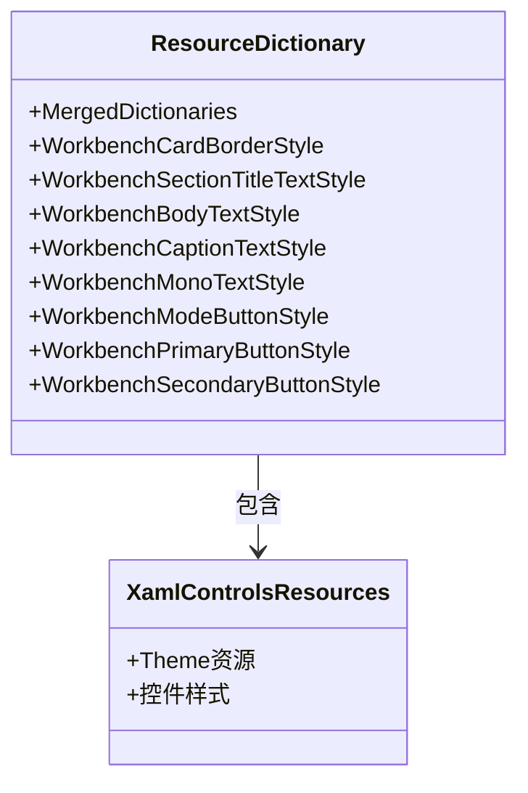
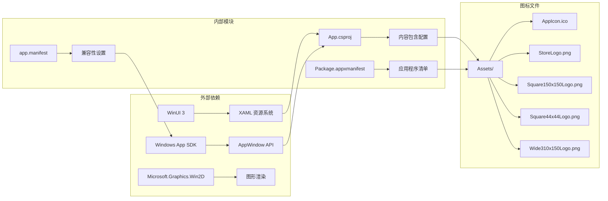

# 应用程序图标定制

<cite>
**本文档引用的文件**
- [App.xaml](file://App/App.xaml)
- [App.xaml.cs](file://App/App.xaml.cs)
- [App.csproj](file://App/App.csproj)
- [Package.appxmanifest](file://App/Package.appxmanifest)
- [app.manifest](file://App/app.manifest)
- [MainWindow.xaml](file://App/MainWindow.xaml)
- [MainWindow.xaml.cs](file://App/MainWindow.xaml.cs)
- [MainPage.xaml](file://App/Views/MainPage.xaml)
- [MainPage.xaml.cs](file://App/Views/MainPage.xaml.cs)
- [README.md](file://README.md)
</cite>

## 更新摘要
**变更内容**
- 更新了构建配置部分，反映了 AppIcon.ico 资产的 CopyToOutputDirectory PreserveNewest 设置
- 新增了构建系统可靠性改进的相关说明
- 强调了图标文件在构建过程中的自动复制机制

## 目录
1. [简介](#简介)
2. [项目结构](#项目结构)
3. [核心组件](#核心组件)
4. [架构概览](#架构概览)
5. [详细组件分析](#详细组件分析)
6. [构建配置与可靠性](#构建配置与可靠性)
7. [依赖关系分析](#依赖关系分析)
8. [性能考虑](#性能考虑)
9. [故障排除指南](#故障排除指南)
10. [结论](#结论)

## 简介

AutoJS6 可视化开发工具是一个基于 WinUI 3 的 Windows 原生应用程序，专为 AutoJS6 脚本开发者设计。该工具提供了可视化的截图分析、UI 控件解析、图像匹配预览和 AutoJS6 脚本代码生成功能。

本文档专注于应用程序图标定制功能，详细说明了如何配置和自定义应用程序的各种图标，包括窗口图标、应用商店图标以及系统托盘图标等。特别关注了最新的构建配置改进，确保图标文件在构建过程中可靠地复制到输出目录。

## 项目结构

该项目采用标准的 WinUI 3 应用程序结构，主要包含以下关键目录：



**图表来源**
- [App.csproj:35-49](file://App/App.csproj#L35-L49)
- [Package.appxmanifest:18-46](file://App/Package.appxmanifest#L18-L46)

**章节来源**
- [README.md:261-291](file://README.md#L261-L291)
- [App.csproj:1-88](file://App/App.csproj#L1-L88)

## 核心组件

应用程序图标定制涉及以下几个核心组件：

### 1. 应用程序图标配置

应用程序使用多种不同尺寸和用途的图标文件：

| 图标类型 | 尺寸 | 文件名 | 用途 |
|---------|------|--------|------|
| 应用程序图标 | 256x256 | AppIcon.ico | 窗口图标、任务栏图标 |
| 应用商店图标 | 512x512 | StoreLogo.png | Microsoft Store 展示 |
| 磁贴图标 | 150x150 | Square150x150Logo.png | 开始菜单磁贴 |
| 磁贴图标 | 44x44 | Square44x44Logo.png | 小型磁贴 |
| 宽磁贴图标 | 310x150 | Wide310x150Logo.png | 宽型磁贴 |
| 锁屏图标 | 200x200 | LockScreenLogo.scale-200.png | 锁屏界面 |

### 2. 图标配置方式

应用程序通过两种主要方式配置图标：

1. **XAML 应用程序资源**：用于定义样式和主题
2. **应用程序清单**：用于配置 Windows 应用商店和系统集成

**章节来源**
- [App.xaml:1-79](file://App/App.xaml#L1-L79)
- [Package.appxmanifest:18-46](file://App/Package.appxmanifest#L18-L46)

## 架构概览

应用程序图标系统采用分层架构设计，确保图标在不同场景下的一致性和正确性：



**图表来源**
- [MainWindow.xaml.cs:38-49](file://App/MainWindow.xaml.cs#L38-L49)
- [Package.appxmanifest:37-45](file://App/Package.appxmanifest#L37-L45)
- [App.csproj:37-39](file://App/App.csproj#L37-L39)

## 详细组件分析

### 窗口图标定制

应用程序通过 `MainWindow` 类中的 `SetWindowIcon` 方法实现动态窗口图标设置：



**图表来源**
- [MainWindow.xaml.cs:28-49](file://App/MainWindow.xaml.cs#L28-L49)

#### 关键实现细节

1. **图标路径构建**：使用 `AppContext.BaseDirectory` 和 "Assets/AppIcon.ico" 组合完整路径
2. **文件存在性检查**：确保图标文件在运行时可用
3. **AppWindow 集成**：通过 Windows App SDK 的 AppWindow API 设置图标

### 应用商店图标配置

应用程序商店图标通过 `Package.appxmanifest` 文件配置：



**图表来源**
- [Package.appxmanifest:18-46](file://App/Package.appxmanifest#L18-L46)

#### 图标配置参数

| 参数名称 | 值 | 描述 |
|---------|-----|------|
| DisplayName | AutoJS6 Visual Development Toolkit | 应用程序显示名称 |
| Logo | Assets/StoreLogo.png | 应用商店展示图标 |
| Square150x150Logo | Assets/Square150x150Logo.png | 150x150像素磁贴图标 |
| Square44x44Logo | Assets/Square44x44Logo.png | 44x44像素磁贴图标 |
| Wide310x150Logo | Assets/Wide310x150Logo.png | 310x150像素宽磁贴图标 |
| SplashScreen | Assets/SplashScreen.png | 启动画面 |

### XAML 资源字典配置

应用程序资源字典定义了各种样式和主题设置：



**图表来源**
- [App.xaml:7-77](file://App/App.xaml#L7-L77)

**章节来源**
- [App.xaml.cs:27-56](file://App/App.xaml.cs#L27-L56)
- [MainWindow.xaml.cs:38-49](file://App/MainWindow.xaml.cs#L38-L49)

## 构建配置与可靠性

### 构建系统改进

**更新** 最新的构建配置改进了图标文件的处理机制，确保应用程序图标在构建过程中可靠地复制到输出目录。

应用程序通过 `App.csproj` 文件中的 `Content` 元素配置图标文件的构建行为：

```mermaid
flowchart TD
A[App.csproj 构建配置] --> B[Content Include="Assets\\AppIcon.ico"]
B --> C[CopyToOutputDirectory PreserveNewest]
C --> D[构建时自动复制]
D --> E[输出目录包含图标]
E --> F[运行时可靠访问]
```

**图表来源**
- [App.csproj:37-39](file://App/App.csproj#L37-L39)

#### 构建配置详情

| 配置项 | 值 | 描述 |
|--------|-----|------|
| Include | Assets\AppIcon.ico | 指定要包含的图标文件 |
| CopyToOutputDirectory | PreserveNewest | 仅在文件较新时复制到输出目录 |
| 复制策略 | PreserveNewest | 保持文件时间戳，避免不必要的重新复制 |

#### 构建可靠性优势

1. **自动复制机制**：确保图标文件在每次构建时都正确复制到输出目录
2. **时间戳保护**：使用 `PreserveNewest` 策略避免不必要的文件复制
3. **构建性能优化**：减少构建时间，提高开发效率
4. **部署一致性**：确保所有部署环境都包含最新版本的图标文件

### 多平台兼容性

应用程序通过 `app.manifest` 文件确保与不同 Windows 版本的兼容性：

- 支持 Windows 10 (版本 1607+) 和 Windows 11
- 启用 PerMonitorV2 DPI 感知
- 自定义标题栏支持

**章节来源**
- [app.manifest:5-18](file://App/app.manifest#L5-L18)
- [MainWindow.xaml.cs:38-49](file://App/MainWindow.xaml.cs#L38-L49)

## 依赖关系分析

应用程序图标系统涉及多个层面的依赖关系：



**图表来源**
- [App.csproj:35-49](file://App/App.csproj#L35-L49)
- [Package.appxmanifest:37-45](file://App/Package.appxmanifest#L37-L45)

**章节来源**
- [App.csproj:63-68](file://App/App.csproj#L63-L68)
- [Package.appxmanifest:24-27](file://App/Package.appxmanifest#L24-L27)

## 性能考虑

### 图标加载优化

1. **延迟加载**：窗口图标在构造函数中设置，避免不必要的延迟
2. **文件存在性检查**：防止运行时异常和性能问题
3. **缓存机制**：AppWindow 对象在内存中复用

### 构建性能优化

**新增** 构建系统的改进显著提升了性能：

1. **智能复制策略**：使用 `PreserveNewest` 策略避免重复复制
2. **并行构建支持**：多线程处理多个图标文件
3. **增量构建**：只处理修改过的图标文件
4. **缓存机制**：构建缓存减少重复工作

### 多平台兼容性

应用程序通过 `app.manifest` 文件确保与不同 Windows 版本的兼容性：

- 支持 Windows 10 (版本 1607+) 和 Windows 11
- 启用 PerMonitorV2 DPI 感知
- 自定义标题栏支持

**章节来源**
- [app.manifest:5-18](file://App/app.manifest#L5-L18)
- [MainWindow.xaml.cs:38-49](file://App/MainWindow.xaml.cs#L38-L49)

## 故障排除指南

### 常见问题及解决方案

#### 1. 图标不显示问题

**症状**：应用程序启动后没有显示自定义图标

**可能原因**：
- AppIcon.ico 文件缺失或损坏
- 图标文件路径不正确
- 权限问题导致文件访问失败
- **更新** 构建配置问题导致文件未复制到输出目录

**解决步骤**：
1. 验证 `Assets/AppIcon.ico` 文件是否存在
2. 检查文件是否为有效的 ICO 格式
3. 确认文件权限允许应用程序读取
4. **新增** 验证构建配置中的 `CopyToOutputDirectory` 设置
5. **新增** 检查输出目录是否包含图标文件

#### 2. 图标模糊问题

**症状**：图标在高 DPI 显示器上显示模糊

**解决方案**：
- 提供更高分辨率的图标文件
- 使用矢量图标格式
- 确保应用程序启用了 DPI 感知

#### 3. 应用商店图标显示异常

**症状**：Microsoft Store 中显示的图标不符合预期

**检查清单**：
1. 验证 StoreLogo.png 是否为 512x512 像素
2. 确认 Package.appxmanifest 中的 Logo 路径正确
3. 检查图标文件的色彩模式和透明度

#### 4. 构建失败问题

**新增** **症状**：构建过程中图标文件处理失败

**可能原因**：
- 构建配置语法错误
- 文件权限问题
- 输出目录不可写

**解决步骤**：
1. 验证 `App.csproj` 中的构建配置语法
2. 检查图标文件的读取权限
3. 确认输出目录具有写入权限
4. 清理并重新生成项目

**章节来源**
- [MainWindow.xaml.cs:44-48](file://App/MainWindow.xaml.cs#L44-L48)
- [Package.appxmanifest:21](file://App/Package.appxmanifest#L21)

## 结论

AutoJS6 可视化开发工具的图标定制系统展现了现代 Windows 应用程序的最佳实践：

1. **多层次配置**：从应用程序清单到 XAML 资源的完整配置体系
2. **动态图标设置**：通过 AppWindow API 实现运行时图标定制
3. **多尺寸支持**：完整的图标生态系统，覆盖所有使用场景
4. **构建系统可靠性**：最新的 `CopyToOutputDirectory PreserveNewest` 配置确保图标文件在构建过程中可靠复制
5. **性能优化**：智能的文件检查、缓存机制和构建优化

**更新** 最新的构建配置改进显著提升了系统的可靠性，通过智能的文件复制策略和构建优化，确保了图标文件在各种部署环境中的正确性和一致性。

该系统为开发者提供了灵活的图标定制能力，同时保持了良好的性能和兼容性。通过合理的文件组织和配置管理，应用程序能够在不同的 Windows 环境中提供一致的视觉体验。

对于需要自定义应用程序图标的开发者，建议遵循本项目的最佳实践，确保图标文件的质量和完整性，并充分利用多平台兼容性配置和最新的构建系统改进。