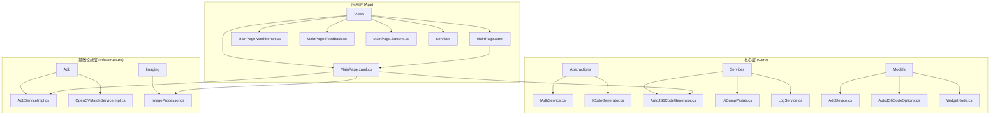
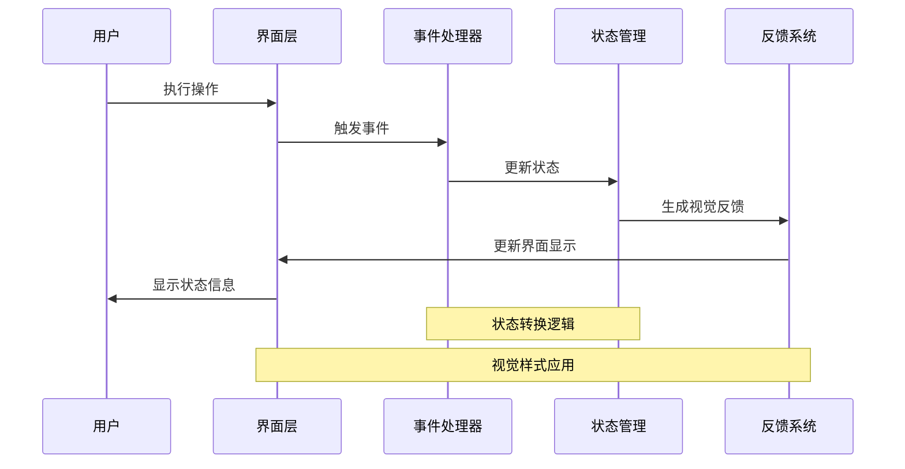
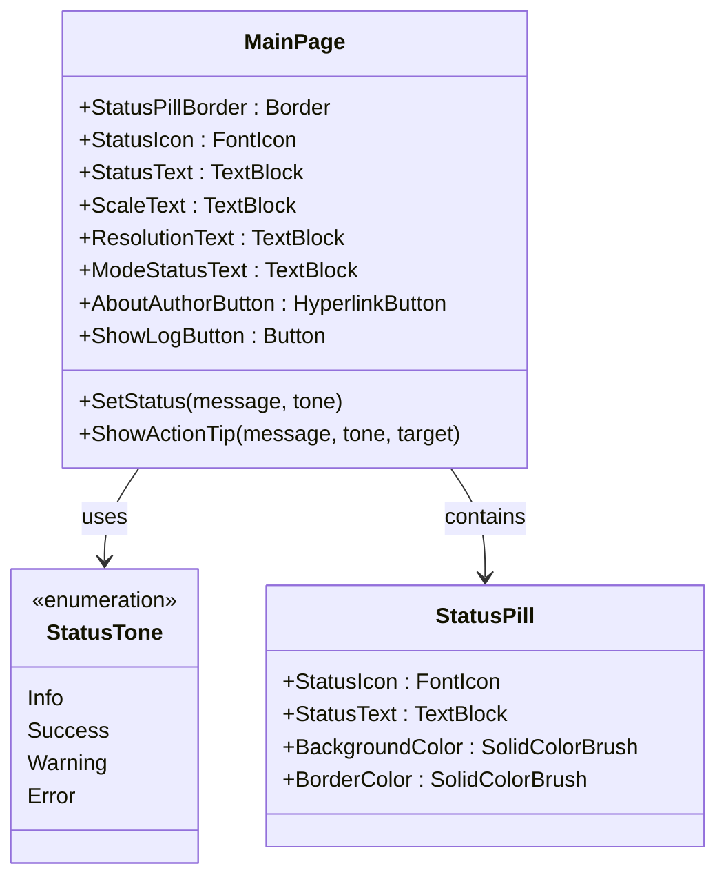
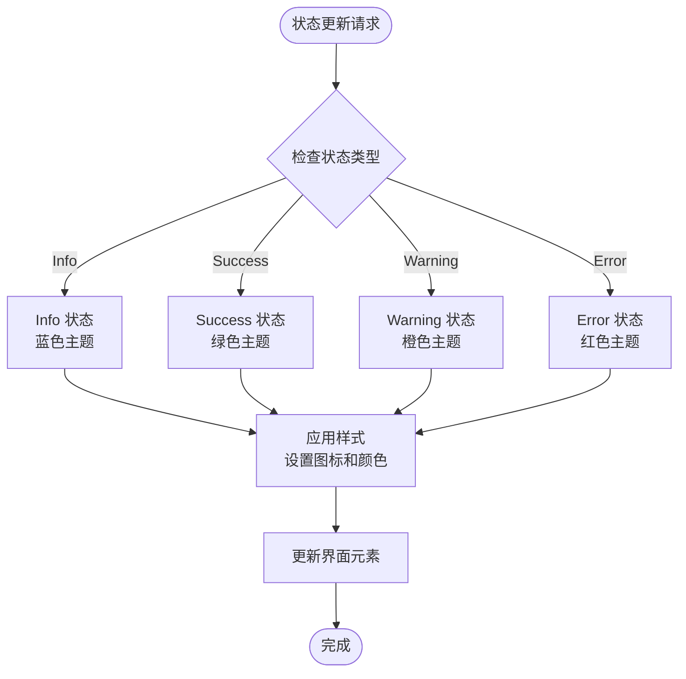
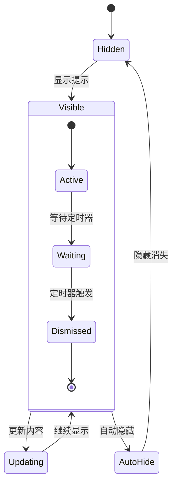
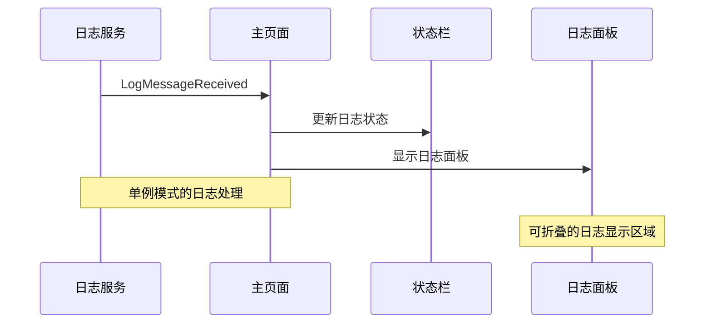
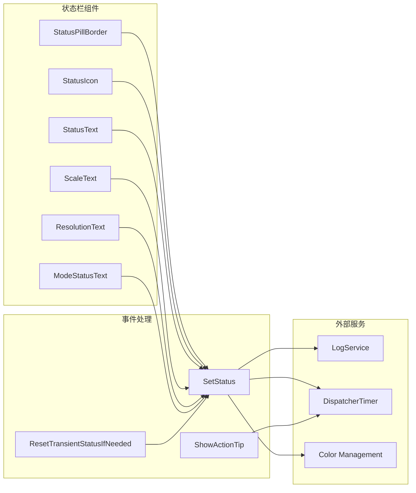

# 状态栏功能增强

<cite>
**本文档引用的文件**
- [MainPage.xaml](file://App/Views/MainPage.xaml)
- [MainPage.xaml.cs](file://App/Views/MainPage.xaml.cs)
- [MainPage.Workbench.cs](file://App/Views/MainPage.Workbench.cs)
- [MainPage.Feedback.cs](file://App/Views/MainPage.Feedback.cs)
- [MainPage.Buttons.cs](file://App/Views/MainPage.Buttons.cs)
- [LogService.cs](file://App/Services/LogService.cs)
- [AutoJS6CodeGenerator.cs](file://Core/Services/AutoJS6CodeGenerator.cs)
- [IAdbService.cs](file://Core/Abstractions/IAdbService.cs)
- [AdbServiceImpl.cs](file://Infrastructure/Adb/AdbServiceImpl.cs)
- [AutoJS6CodeOptions.cs](file://Core/Models/AutoJS6CodeOptions.cs)
- [WidgetNode.cs](file://Core/Models/WidgetNode.cs)
</cite>

## 目录
1. [简介](#简介)
2. [项目结构](#项目结构)
3. [核心组件](#核心组件)
4. [架构概览](#架构概览)
5. [详细组件分析](#详细组件分析)
6. [依赖关系分析](#依赖关系分析)
7. [性能考虑](#性能考虑)
8. [故障排除指南](#故障排除指南)
9. [结论](#结论)

## 简介

AutoJS6 开发工具的状态栏功能增强项目旨在提升用户界面的用户体验，通过改进状态栏的显示效果、交互反馈和信息展示能力。该项目采用 C# 和 XAML 技术构建，基于 WinUI 3 框架，为 AutoJS6 脚本开发提供强大的可视化工作台。

状态栏功能是整个应用的重要组成部分，它不仅提供了实时的操作状态反馈，还集成了多种实用的功能按钮，包括日志查看、关于作者等。本次增强主要关注于状态栏的视觉设计、交互体验和功能完整性。

## 项目结构

该项目采用典型的 MVVM 架构模式，主要分为以下几个层次：

**图表来源**
- [MainPage.xaml:1-824](file://App/Views/MainPage.xaml#L1-L824)
- [MainPage.xaml.cs:1-418](file://App/Views/MainPage.xaml.cs#L1-L418)
- [AutoJS6CodeGenerator.cs:1-357](file://Core/Services/AutoJS6CodeGenerator.cs#L1-L357)

**章节来源**
- [MainPage.xaml:1-824](file://App/Views/MainPage.xaml#L1-L824)
- [MainPage.xaml.cs:1-418](file://App/Views/MainPage.xaml.cs#L1-L418)

## 核心组件

### 状态栏主界面组件

状态栏位于应用界面的底部，采用卡片式设计，包含以下主要元素：

1. **状态胶囊 (StatusPill)** - 显示核心状态信息
2. **缩放比例显示** - 当前图像缩放比例
3. **分辨率显示** - 当前图像分辨率
4. **模式状态显示** - 当前工作模式
5. **功能按钮组** - 关于作者、查看日志等

### 状态管理机制

系统实现了完整的状态管理机制，包括四种状态类型：

- **Info (信息状态)** - 默认状态，蓝色主题
- **Success (成功状态)** - 绿色主题，表示操作成功
- **Warning (警告状态)** - 橙色主题，表示潜在问题
- **Error (错误状态)** - 红色主题，表示操作失败

**章节来源**
- [MainPage.xaml:635-684](file://App/Views/MainPage.xaml#L635-L684)
- [MainPage.Workbench.cs:21-27](file://App/Views/MainPage.Workbench.cs#L21-L27)
- [MainPage.Feedback.cs:47-72](file://App/Views/MainPage.Feedback.cs#L47-L72)

## 架构概览

状态栏功能的实现采用了分层架构设计，确保了良好的代码组织和可维护性：

**图表来源**
- [MainPage.xaml.cs:112-145](file://App/Views/MainPage.xaml.cs#L112-L145)
- [MainPage.Workbench.cs:554-576](file://App/Views/MainPage.Workbench.cs#L554-L576)
- [MainPage.Feedback.cs:23-45](file://App/Views/MainPage.Feedback.cs#L23-L45)

## 详细组件分析

### 状态栏界面组件

状态栏采用网格布局，包含状态胶囊和多个信息显示区域：

**图表来源**
- [MainPage.xaml:652-662](file://App/Views/MainPage.xaml#L652-L662)
- [MainPage.Workbench.cs:21-27](file://App/Views/MainPage.Workbench.cs#L21-L27)

### 状态管理实现

状态管理系统实现了完整的状态转换和视觉反馈机制：

#### 状态转换流程

**图表来源**
- [MainPage.Workbench.cs:554-576](file://App/Views/MainPage.Workbench.cs#L554-L576)
- [MainPage.Feedback.cs:47-72](file://App/Views/MainPage.Feedback.cs#L47-L72)

#### 反馈提示系统

系统实现了基于时间的临时状态提示机制：

**图表来源**
- [MainPage.Feedback.cs:74-91](file://App/Views/MainPage.Feedback.cs#L74-L91)

**章节来源**
- [MainPage.Workbench.cs:554-576](file://App/Views/MainPage.Workbench.cs#L554-L576)
- [MainPage.Feedback.cs:23-45](file://App/Views/MainPage.Feedback.cs#L23-L45)

### 日志集成系统

状态栏与日志系统的集成提供了完整的调试支持：

**图表来源**
- [LogService.cs:32-49](file://App/Services/LogService.cs#L32-L49)
- [MainPage.xaml.cs:54-54](file://App/Views/MainPage.xaml.cs#L54-L54)

**章节来源**
- [LogService.cs:1-51](file://App/Services/LogService.cs#L1-L51)
- [MainPage.xaml.cs:112-118](file://App/Views/MainPage.xaml.cs#L112-L118)

### 功能按钮组件

状态栏集成了多个实用的功能按钮：

| 按钮 | 功能 | 触发条件 |
|------|------|----------|
| 关于作者 | 打开作者主页链接 | 点击按钮 |
| 查看日志 | 切换日志面板显示 | 点击按钮 |
| 状态胶囊 | 显示当前系统状态 | 状态变化 |

**章节来源**
- [MainPage.xaml:671-682](file://App/Views/MainPage.xaml#L671-L682)
- [MainPage.xaml.cs:147-154](file://App/Views/MainPage.xaml.cs#L147-L154)

## 依赖关系分析

状态栏功能的实现涉及多个组件之间的复杂依赖关系：

**图表来源**
- [MainPage.Workbench.cs:554-576](file://App/Views/MainPage.Workbench.cs#L554-L576)
- [MainPage.Feedback.cs:74-91](file://App/Views/MainPage.Feedback.cs#L74-L91)

**章节来源**
- [MainPage.Workbench.cs:1-578](file://App/Views/MainPage.Workbench.cs#L1-L578)
- [MainPage.Feedback.cs:1-111](file://App/Views/MainPage.Feedback.cs#L1-L111)

## 性能考虑

状态栏功能的性能优化主要体现在以下几个方面：

### 内存管理
- 使用 `DispatcherTimer` 管理定时器资源
- 及时释放不再使用的视觉资源
- 避免重复创建相同的颜色对象

### 渲染优化
- 最小化 UI 更新频率
- 使用延迟更新策略
- 合理使用视觉状态管理器

### 事件处理
- 避免频繁的状态更新
- 批量处理相关的 UI 变更
- 使用异步模式处理耗时操作

## 故障排除指南

### 常见问题及解决方案

#### 状态栏不显示
**症状**: 状态栏完全不可见
**可能原因**:
- XAML 绑定问题
- 样式资源缺失
- 窗口初始化顺序问题

**解决方法**:
1. 检查 XAML 中的命名绑定
2. 验证样式资源的正确性
3. 确认页面加载顺序

#### 状态更新异常
**症状**: 状态文本不更新或显示错误
**可能原因**:
- 状态枚举值错误
- 颜色资源访问失败
- 线程同步问题

**解决方法**:
1. 验证状态枚举的正确性
2. 检查颜色资源的可用性
3. 使用 `Dispatcher` 确保线程安全

#### 反馈提示不消失
**症状**: 提示消息持续显示不消失
**可能原因**:
- 定时器未正确停止
- 事件处理程序异常
- UI 线程阻塞

**解决方法**:
1. 确保定时器正确停止
2. 检查事件处理程序的异常处理
3. 避免在 UI 线程中执行长时间操作

**章节来源**
- [MainPage.Feedback.cs:74-91](file://App/Views/MainPage.Feedback.cs#L74-L91)
- [MainPage.Workbench.cs:93-118](file://App/Views/MainPage.Workbench.cs#L93-L118)

## 结论

AutoJS6 开发工具的状态栏功能增强项目成功实现了现代化的用户界面状态管理。通过精心设计的架构和完善的组件实现，系统提供了丰富的状态反馈、直观的视觉指示和流畅的用户体验。

主要成就包括：
- 实现了完整的状态管理机制，支持四种不同的状态类型
- 建立了可靠的视觉反馈系统，提供即时的操作反馈
- 集成了日志系统，增强了调试和监控能力
- 优化了性能和内存使用，确保流畅的用户体验

未来可以考虑的改进方向：
- 添加更多的状态类型和自定义选项
- 实现状态历史记录功能
- 增强无障碍访问支持
- 扩展状态栏的交互能力