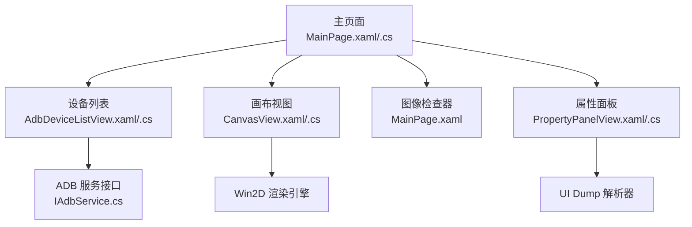
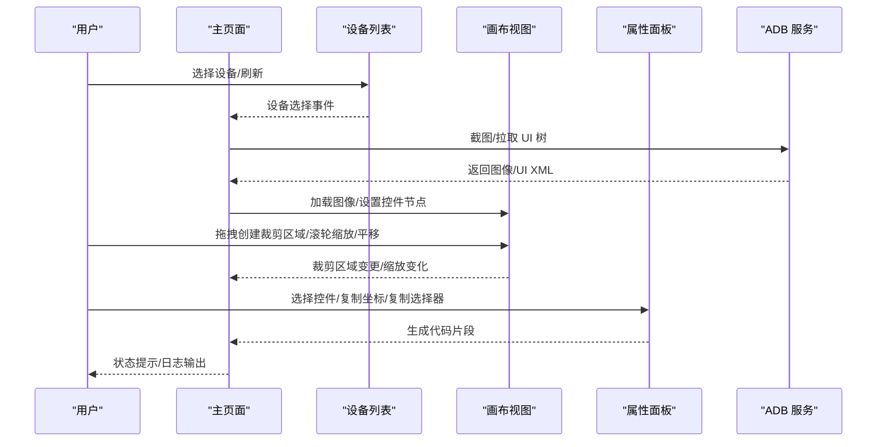
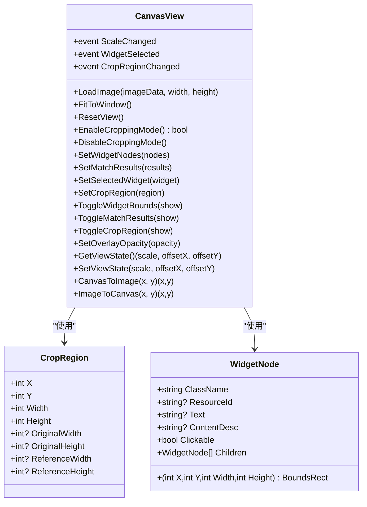
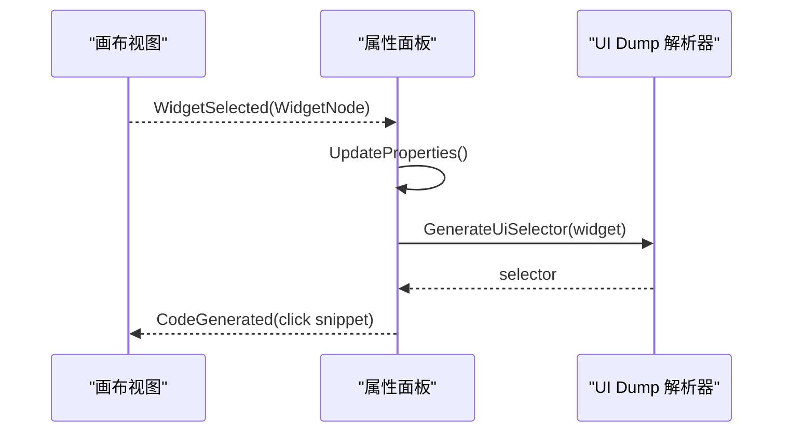
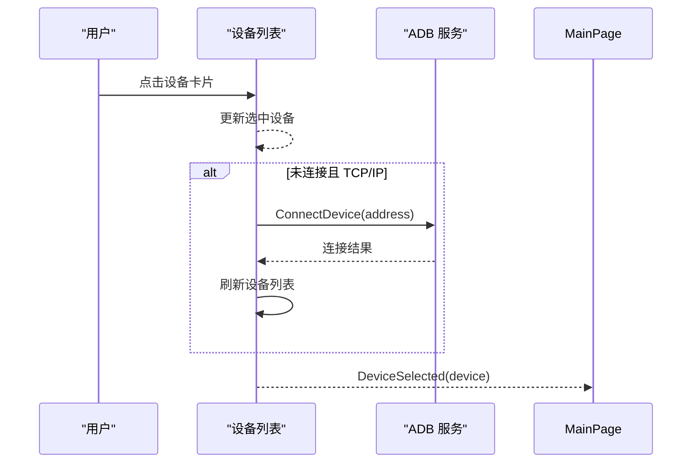
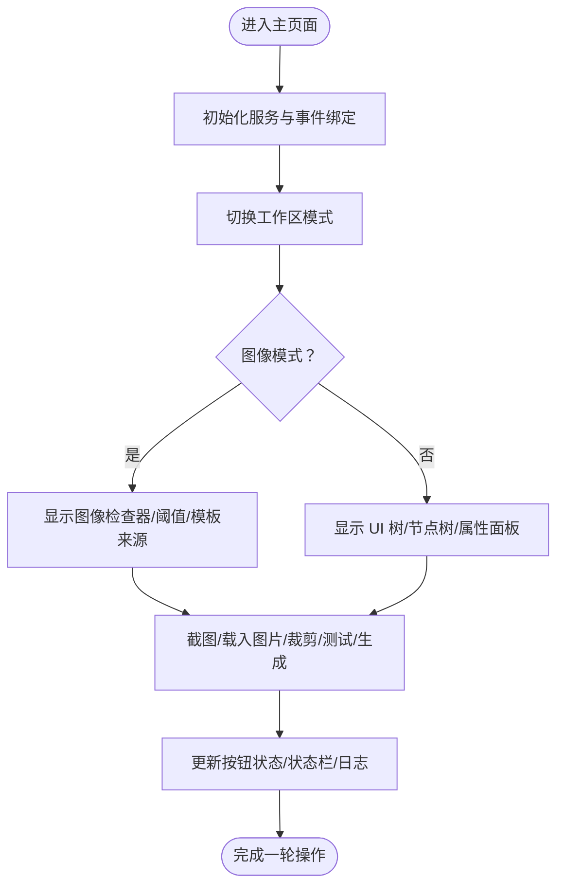
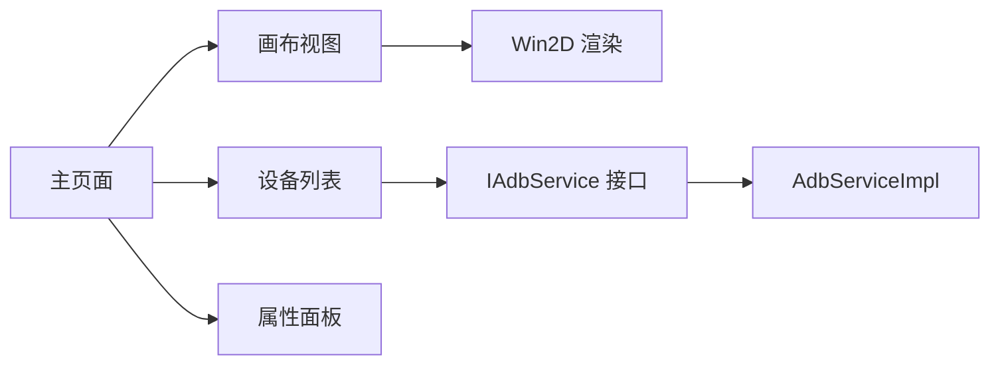

# 用户界面设计

<cite>
**本文档引用的文件**
- [MainPage.xaml](file://App/Views/MainPage.xaml)
- [MainPage.xaml.cs](file://App/Views/MainPage.xaml.cs)
- [MainPage.Workbench.cs](file://App/Views/MainPage.Workbench.cs)
- [MainPage.Support.cs](file://App/Views/MainPage.Support.cs)
- [CanvasView.xaml](file://App/Views/CanvasView.xaml)
- [CanvasView.xaml.cs](file://App/Views/CanvasView.xaml.cs)
- [PropertyPanelView.xaml](file://App/Views/PropertyPanelView.xaml)
- [PropertyPanelView.xaml.cs](file://App/Views/PropertyPanelView.xaml.cs)
- [AdbDeviceListView.xaml](file://App/Views/AdbDeviceListView.xaml)
- [AdbDeviceListView.xaml.cs](file://App/Views/AdbDeviceListView.xaml.cs)
- [CropRegion.cs](file://Core/Models/CropRegion.cs)
- [WidgetNode.cs](file://Core/Models/WidgetNode.cs)
- [IAdbService.cs](file://Core/Abstractions/IAdbService.cs)
</cite>

## 目录
1. [简介](#简介)
2. [项目结构](#项目结构)
3. [核心组件](#核心组件)
4. [架构总览](#架构总览)
5. [详细组件分析](#详细组件分析)
6. [依赖关系分析](#依赖关系分析)
7. [性能考虑](#性能考虑)
8. [故障排查指南](#故障排查指南)
9. [结论](#结论)
10. [附录](#附录)

## 简介
本文件面向 AutoJS6 开发工具的用户界面设计，系统性阐述主界面布局与双工作区设计（图像模式与控件模式）的用户体验理念；深入解析 CanvasView 的高性能画布渲染机制（Win2D GPU 加速、60 FPS 帧率保障、惯性滑动、分层渲染与覆盖层叠加）；详解 PropertyPanelView 的属性面板管理与 AdbDeviceListView 的设备列表功能；梳理用户交互流程（拖拽裁剪、实时阈值调整、控件边界高亮等）；并提供界面定制与体验优化建议，帮助用户高效完成图像模板匹配与 UI 控件分析任务。

## 项目结构
AutoJS6 开发工具采用基于功能模块的视图组织方式，核心界面由主页面与多个专用视图组成：
- 主页面（MainPage）承载双工作区布局与全局状态协调
- 画布视图（CanvasView）负责图像与覆盖层的高性能渲染
- 属性面板（PropertyPanelView）展示与生成控件相关代码片段
- 设备列表（AdbDeviceListView）管理 ADB 设备连接与选择
- 核心模型（CropRegion、WidgetNode）支撑数据结构与交互

图表来源
- [MainPage.xaml:103-816](file://App/Views/MainPage.xaml#L103-L816)
- [CanvasView.xaml.cs:1-1307](file://App/Views/CanvasView.xaml.cs#L1-L1307)
- [AdbDeviceListView.xaml.cs:1-348](file://App/Views/AdbDeviceListView.xaml.cs#L1-L348)
- [PropertyPanelView.xaml.cs:1-155](file://App/Views/PropertyPanelView.xaml.cs#L1-L155)
- [IAdbService.cs:1-57](file://Core/Abstractions/IAdbService.cs#L1-L57)

章节来源
- [MainPage.xaml:103-816](file://App/Views/MainPage.xaml#L103-L816)
- [MainPage.xaml.cs:1-409](file://App/Views/MainPage.xaml.cs#L1-L409)

## 核心组件
- 双工作区设计
  - 图像模式：专注模板匹配与阈值测试，支持裁剪区域创建、保存与代码生成
  - 控件模式：专注 UI 树解析与控件属性查看，支持控件边界高亮与选择
- CanvasView 高性能渲染
  - 分层渲染：图像层（底层）+ 覆盖层（上层），独立变换矩阵与透明度控制
  - Win2D GPU 加速：CanvasBitmap 缓存池、位图复用、异步加载
  - 60 FPS 体验：16ms 定时器驱动惯性滑动，衰减与最小速度阈值保证顺滑
- PropertyPanelView 属性面板
  - 动态构建属性卡片，支持复制坐标、复制选择器、预览点击代码片段
- AdbDeviceListView 设备列表
  - 设备扫描、连接（含无线配对）、状态展示与选择事件

章节来源
- [MainPage.Workbench.cs:13-89](file://App/Views/MainPage.Workbench.cs#L13-L89)
- [CanvasView.xaml.cs:19-116](file://App/Views/CanvasView.xaml.cs#L19-L116)
- [PropertyPanelView.xaml.cs:12-31](file://App/Views/PropertyPanelView.xaml.cs#L12-L31)
- [AdbDeviceListView.xaml.cs:16-52](file://App/Views/AdbDeviceListView.xaml.cs#L16-L52)

## 架构总览
主页面作为协调者，绑定设备列表、画布视图与属性面板，统一处理模式切换、按钮状态、提示反馈与日志输出。CanvasView 通过 Win2D 提供 GPU 加速渲染，支持图像与覆盖层叠加绘制；PropertyPanelView 动态生成控件属性卡片与代码片段；AdbDeviceListView 通过 IAdbService 抽象访问底层 ADB 能力。

图表来源
- [MainPage.xaml.cs:147-178](file://App/Views/MainPage.xaml.cs#L147-L178)
- [AdbDeviceListView.xaml.cs:124-189](file://App/Views/AdbDeviceListView.xaml.cs#L124-L189)
- [CanvasView.xaml.cs:572-627](file://App/Views/CanvasView.xaml.cs#L572-L627)
- [PropertyPanelView.xaml.cs:24-78](file://App/Views/PropertyPanelView.xaml.cs#L24-L78)

## 详细组件分析

### CanvasView 画布渲染与交互
- 渲染架构
  - 分层渲染：图像层（CanvasBitmap）+ 覆盖层（控件边界、匹配框、裁剪框）
  - 变换矩阵：统一缩放与平移，覆盖层同步应用相同变换
  - 透明度控制：覆盖层统一透明度，支持动态调节
- 性能优化
  - CanvasBitmap 缓存池：基于图像哈希键缓存，限制最大数量，避免重复纹理创建
  - 异步加载：在主线程外完成位图加载，防止阻塞 UI
  - 日志记录：绘制与交互过程带日志，便于诊断性能问题
- 交互能力
  - 滚轮缩放：以鼠标位置为中心进行缩放，限制缩放范围
  - 平移拖拽：左/右键拖拽，结合惯性滑动，提升顺滑体验
  - 裁剪模式：1:1 视图下启用，支持拖拽创建/调整裁剪区域，Shift 键锁定宽高比
  - 控件点击：根据图像坐标命中控件，优先最小面积子控件
- 覆盖层绘制
  - 控件边界：按类型着色（文本/按钮/图片/其他），选中控件高亮
  - 匹配结果：按置信度着色（绿/黄/橙），绘制点击点与置信度文本
  - 裁剪区域：虚线矩形 + 8 个调整手柄（白底黑框）

图表来源
- [CanvasView.xaml.cs:24-116](file://App/Views/CanvasView.xaml.cs#L24-L116)
- [CropRegion.cs:6-52](file://Core/Models/CropRegion.cs#L6-L52)
- [WidgetNode.cs:6-92](file://Core/Models/WidgetNode.cs#L6-L92)

章节来源
- [CanvasView.xaml:1-21](file://App/Views/CanvasView.xaml#L1-L21)
- [CanvasView.xaml.cs:19-116](file://App/Views/CanvasView.xaml.cs#L19-L116)
- [CanvasView.xaml.cs:358-426](file://App/Views/CanvasView.xaml.cs#L358-L426)
- [CanvasView.xaml.cs:572-627](file://App/Views/CanvasView.xaml.cs#L572-L627)
- [CanvasView.xaml.cs:829-1023](file://App/Views/CanvasView.xaml.cs#L829-L1023)
- [CanvasView.xaml.cs:1097-1305](file://App/Views/CanvasView.xaml.cs#L1097-L1305)

### PropertyPanelView 属性面板
- 功能要点
  - 动态生成属性卡片：ClassName、ResourceId、Text、ContentDesc、Bounds、Clickable 等
  - 生成 UI 选择器与点击代码片段，支持预览与复制
  - 无控件时显示占位提示
- 交互流程
  - Canvas 控件选择事件触发属性面板更新
  - 支持复制坐标与选择器，便于快速粘贴到代码

图表来源
- [PropertyPanelView.xaml.cs:24-78](file://App/Views/PropertyPanelView.xaml.cs#L24-L78)
- [MainPage.xaml.cs:81-85](file://App/Views/MainPage.xaml.cs#L81-L85)

章节来源
- [PropertyPanelView.xaml:1-13](file://App/Views/PropertyPanelView.xaml#L1-L13)
- [PropertyPanelView.xaml.cs:12-155](file://App/Views/PropertyPanelView.xaml.cs#L12-L155)

### AdbDeviceListView 设备列表
- 功能要点
  - 设备扫描与去重：同一序列号唯一化，优先在线设备
  - 设备卡片高亮与状态展示：选中态视觉强调、状态与连接类型
  - 无线连接：首次配对（输入 IP/端口/配对码）与直接连接（输入 IP/端口）
  - 刷新状态反馈：不同音调（信息/成功/警告/错误）提示
- 交互流程
  - 点击设备卡片触发设备选择事件
  - 对于 TCP/IP 未连接设备，尝试连接并刷新状态

图表来源
- [AdbDeviceListView.xaml.cs:299-337](file://App/Views/AdbDeviceListView.xaml.cs#L299-L337)
- [AdbDeviceListView.xaml.cs:124-189](file://App/Views/AdbDeviceListView.xaml.cs#L124-L189)
- [IAdbService.cs:40-54](file://Core/Abstractions/IAdbService.cs#L40-L54)

章节来源
- [AdbDeviceListView.xaml:1-136](file://App/Views/AdbDeviceListView.xaml#L1-L136)
- [AdbDeviceListView.xaml.cs:16-348](file://App/Views/AdbDeviceListView.xaml.cs#L16-L348)

### 主页面工作区与状态管理
- 双工作区模式
  - 图像模式：图像检查器、阈值滑块、模板/截图来源、测试与生成
  - 控件模式：UI 树搜索、节点树、属性面板、复制坐标/选择器/预览代码
- 状态与按钮联动
  - 根据是否有截图、是否处于裁剪模式、是否选择设备等条件动态启用/禁用按钮
  - 模式切换时清理上一模式状态，避免交叉干扰
- 交互反馈
  - 状态栏提示（信息/成功/警告/错误），日志面板可展开查看

图表来源
- [MainPage.xaml.cs:43-60](file://App/Views/MainPage.xaml.cs#L43-L60)
- [MainPage.Workbench.cs:38-89](file://App/Views/MainPage.Workbench.cs#L38-L89)
- [MainPage.Workbench.cs:91-189](file://App/Views/MainPage.Workbench.cs#L91-L189)

章节来源
- [MainPage.xaml.cs:1-409](file://App/Views/MainPage.xaml.cs#L1-L409)
- [MainPage.Workbench.cs:13-578](file://App/Views/MainPage.Workbench.cs#L13-L578)
- [MainPage.Support.cs:12-67](file://App/Views/MainPage.Support.cs#L12-L67)

## 依赖关系分析
- 组件耦合
  - 主页面对设备列表、画布视图、属性面板存在强依赖，负责状态协调与事件转发
  - 画布视图依赖 Win2D 渲染引擎与图像数据，内部维护复杂的状态机
  - 属性面板依赖 UI Dump 解析器生成选择器与代码片段
  - 设备列表依赖 IAdbService 接口抽象，屏蔽具体实现细节
- 外部依赖
  - Win2D：GPU 加速渲染与 CanvasBitmap 管理
  - ADB：设备扫描、截图、UI Dump、无线配对与连接
- 循环依赖
  - 未见循环依赖，事件通过主页面中转，降低耦合

图表来源
- [MainPage.xaml.cs:48-60](file://App/Views/MainPage.xaml.cs#L48-L60)
- [CanvasView.xaml.cs:1-16](file://App/Views/CanvasView.xaml.cs#L1-L16)
- [AdbDeviceListView.xaml.cs:50-51](file://App/Views/AdbDeviceListView.xaml.cs#L50-L51)
- [IAdbService.cs:8-56](file://Core/Abstractions/IAdbService.cs#L8-L56)

章节来源
- [MainPage.xaml.cs:19-60](file://App/Views/MainPage.xaml.cs#L19-L60)
- [AdbDeviceListView.xaml.cs:39-52](file://App/Views/AdbDeviceListView.xaml.cs#L39-L52)

## 性能考虑
- 渲染性能
  - Win2D GPU 加速：CanvasBitmap 缓存池减少纹理创建开销，最大缓存数量限制避免内存膨胀
  - 分层渲染：图像层与覆盖层分离，变换矩阵统一应用，减少重复计算
  - 60 FPS 帧率：16ms 定时器驱动惯性滑动，衰减系数与最小速度阈值平衡顺滑与能耗
- 交互性能
  - 滚轮缩放以指针为中心，避免频繁重绘导致卡顿
  - 裁剪区域创建/调整采用增量更新，仅在必要时触发重绘
- 数据与 I/O
  - 截图与 UI Dump 采用异步加载，避免阻塞 UI 线程
  - 位图加载失败时及时清理状态，防止悬挂资源占用

章节来源
- [CanvasView.xaml.cs:48-51](file://App/Views/CanvasView.xaml.cs#L48-L51)
- [CanvasView.xaml.cs:107-116](file://App/Views/CanvasView.xaml.cs#L107-L116)
- [CanvasView.xaml.cs:816-827](file://App/Views/CanvasView.xaml.cs#L816-L827)

## 故障排查指南
- 设备连接问题
  - 无线配对：确认 IP、端口、配对码正确；首次配对后可直接连接
  - 连接失败：检查设备状态与网络连通性，查看日志面板错误信息
- 截图/UI 树拉取失败
  - 确认设备已选择且在线；截图失败时检查权限与设备状态
  - UI 树解析失败时检查 XML 内容长度与解析器输出
- 画布渲染异常
  - 位图被释放：捕获对象已释放异常并跳过本次绘制
  - 缩放/平移异常：检查变换矩阵与视图状态一致性
- 日志与反馈
  - 使用底部日志面板查看详细日志；状态栏提示提供即时反馈

章节来源
- [AdbDeviceListView.xaml.cs:65-122](file://App/Views/AdbDeviceListView.xaml.cs#L65-L122)
- [MainPage.xaml.cs:174-178](file://App/Views/MainPage.xaml.cs#L174-L178)
- [CanvasView.xaml.cs:590-594](file://App/Views/CanvasView.xaml.cs#L590-L594)
- [MainPage.xaml.cs:112-118](file://App/Views/MainPage.xaml.cs#L112-L118)

## 结论
AutoJS6 开发工具的用户界面围绕“双工作区 + 高性能画布”的核心理念构建：图像模式聚焦模板匹配与阈值测试，控件模式聚焦 UI 分析与属性查看。CanvasView 通过 Win2D GPU 加速与分层渲染实现流畅的 60 FPS 体验，配合惯性滑动与裁剪交互提升效率。PropertyPanelView 与 AdbDeviceListView 分别承担属性生成与设备管理职责，主页面统一协调状态与交互反馈。整体设计在易用性与性能之间取得良好平衡，适合开发者高效完成图像模板与 UI 控件的分析与自动化脚本生成。

## 附录
- 界面定制建议
  - 自定义主题：通过样式资源统一按钮、文本与边框风格
  - 快捷键扩展：在 CanvasView 中增加更多快捷键（如全屏、网格、十字准星开关）
  - 交互增强：在 CanvasView 中加入像素尺、网格与十字准星辅助工具（参考现有覆盖层绘制思路）
- 用户体验优化
  - 模式切换时自动保存当前视图状态（缩放、偏移、裁剪区域），提升连续工作体验
  - 增加撤销/重做机制，支持裁剪区域与匹配结果的回退
  - 优化日志面板：支持过滤、导出与折叠，便于定位问题