# 设备列表界面

<cite>
**本文档引用的文件**
- [AdbDeviceListView.xaml](file://App/Views/AdbDeviceListView.xaml)
- [AdbDeviceListView.xaml.cs](file://App/Views/AdbDeviceListView.xaml.cs)
- [AdbDevice.cs](file://Core/Models/AdbDevice.cs)
- [AdbServiceImpl.cs](file://Infrastructure/Adb/AdbServiceImpl.cs)
- [IAdbService.cs](file://Core/Abstractions/IAdbService.cs)
- [MainPage.xaml](file://App/Views/MainPage.xaml)
- [MainPage.xaml.cs](file://App/Views/MainPage.xaml.cs)
- [LogService.cs](file://App/Services/LogService.cs)
</cite>

## 目录
1. [简介](#简介)
2. [项目结构](#项目结构)
3. [核心组件](#核心组件)
4. [架构概览](#架构概览)
5. [详细组件分析](#详细组件分析)
6. [依赖关系分析](#依赖关系分析)
7. [性能考虑](#性能考虑)
8. [故障排除指南](#故障排除指南)
9. [结论](#结论)

## 简介

AutoJS6 开发工具的设备列表界面是整个可视化工作台的核心组件之一，负责管理 Android 设备的连接状态、显示设备信息并提供设备选择交互。该界面基于 WPF 技术栈构建，采用 MVVM 架构模式，通过 ADB 服务实现与 Android 设备的通信。

设备列表界面的主要功能包括：
- 设备扫描和实时状态监控
- 设备信息展示（序列号、型号、状态、连接类型）
- 设备选择交互和连接状态反馈
- 无线调试连接支持
- 设备刷新机制和异常处理
- 用户友好的界面反馈系统

## 项目结构

设备列表界面位于应用的 Views 层，采用分层架构设计，确保了良好的代码组织和职责分离：

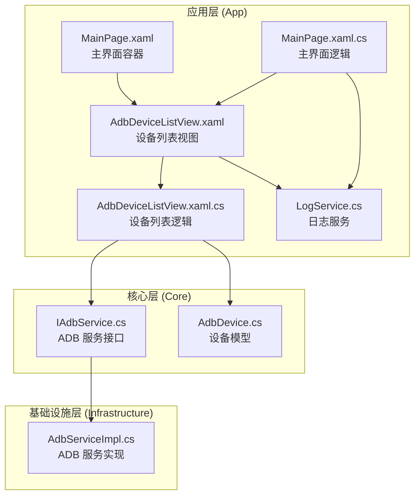

**图表来源**
- [AdbDeviceListView.xaml.cs:46-52](file://App/Views/AdbDeviceListView.xaml.cs#L46-L52)
- [MainPage.xaml:176](file://App/Views/MainPage.xaml#L176)
- [IAdbService.cs:8-56](file://Core/Abstractions/IAdbService.cs#L8-L56)

**章节来源**
- [AdbDeviceListView.xaml:1-136](file://App/Views/AdbDeviceListView.xaml#L1-L136)
- [AdbDeviceListView.xaml.cs:16-52](file://App/Views/AdbDeviceListView.xaml.cs#L16-L52)
- [MainPage.xaml:169-176](file://App/Views/MainPage.xaml#L169-L176)

## 核心组件

### 设备模型 (AdbDevice)

设备模型定义了 Android 设备的基本信息结构，包含序列号、型号、状态和连接类型等关键属性：

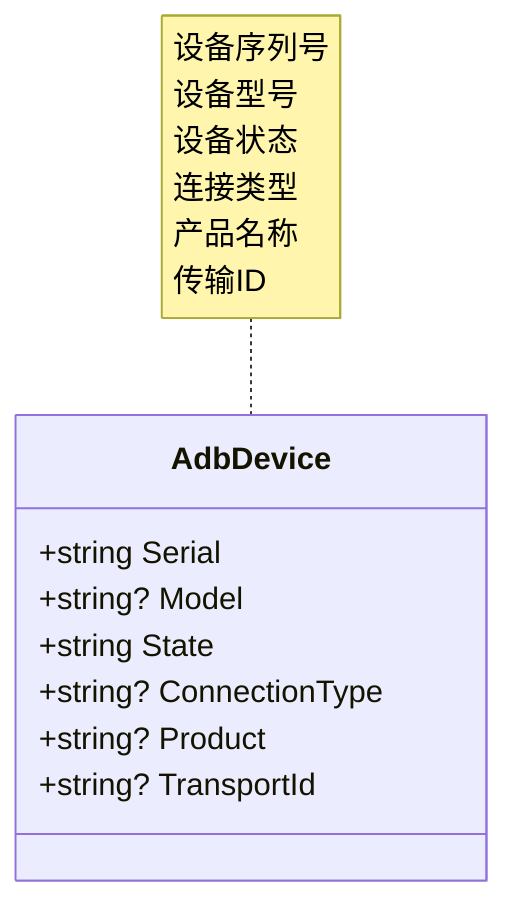

**图表来源**
- [AdbDevice.cs:6-37](file://Core/Models/AdbDevice.cs#L6-L37)

### ADB 服务接口 (IAdbService)

ADB 服务接口定义了设备管理所需的核心方法，包括设备扫描、连接管理和数据获取：

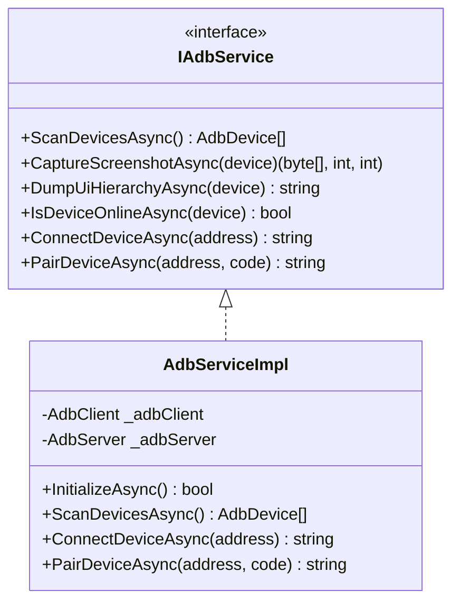

**图表来源**
- [IAdbService.cs:8-56](file://Core/Abstractions/IAdbService.cs#L8-L56)
- [AdbServiceImpl.cs:17-28](file://Infrastructure/Adb/AdbServiceImpl.cs#L17-L28)

**章节来源**
- [AdbDevice.cs:1-38](file://Core/Models/AdbDevice.cs#L1-L38)
- [IAdbService.cs:1-57](file://Core/Abstractions/IAdbService.cs#L1-L57)
- [AdbServiceImpl.cs:17-238](file://Infrastructure/Adb/AdbServiceImpl.cs#L17-L238)

## 架构概览

设备列表界面采用事件驱动的架构模式，通过事件机制实现组件间的松耦合通信：

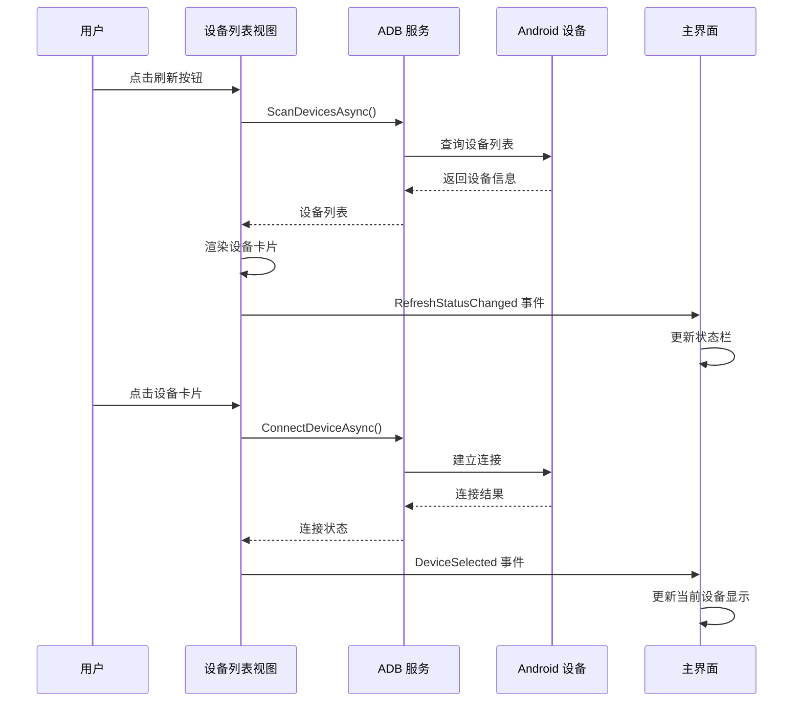

**图表来源**
- [AdbDeviceListView.xaml.cs:54-57](file://App/Views/AdbDeviceListView.xaml.cs#L54-L57)
- [AdbDeviceListView.xaml.cs:124-189](file://App/Views/AdbDeviceListView.xaml.cs#L124-L189)
- [AdbDeviceListView.xaml.cs:299-337](file://App/Views/AdbDeviceListView.xaml.cs#L299-L337)

## 详细组件分析

### 设备列表视图 (AdbDeviceListView)

设备列表视图是用户交互的核心界面，提供了完整的设备管理功能：

#### 界面布局结构

```mermaid
graph TB
subgraph "设备列表容器"
A[Grid: 行间距10]
subgraph "工具栏 (Row 0)"
B[Border: 卡片样式]
C[Grid: 列间距8]
D[Button: 刷新]
E[Button: 无线调试]
end
subgraph "设备列表 (Row 1)"
F[Border: 卡片样式]
G[ScrollViewer: 垂直滚动]
H[StackPanel: 内边距10, 间距8]
I[设备计数文本]
J[设备项面板]
end
subgraph "无线连接对话框"
K[ContentDialog: 标题"无线调试连接"]
L[配对卡片]
M[直接连接卡片]
end
end
```

**图表来源**
- [AdbDeviceListView.xaml:9-58](file://App/Views/AdbDeviceListView.xaml#L9-L58)
- [AdbDeviceListView.xaml:60-133](file://App/Views/AdbDeviceListView.xaml#L60-L133)

#### 设备卡片渲染机制

每个设备都以卡片形式展示，具有以下特性：

```mermaid
flowchart TD
A[设备数据] --> B[创建根Grid]
B --> C[创建左侧Accent边框]
B --> D[创建右侧Button]
D --> E[创建卡片Border]
E --> F[创建内部Grid]
F --> G[创建左侧StackPanel]
F --> H[创建右侧StackPanel]
G --> I[设备序列号 (粗体)]
G --> J[设备型号 (中等强度)]
H --> K[设备状态 (粗体)]
H --> L[连接类型 (中等强度)]
I --> M[应用选中样式]
J --> M
K --> M
L --> M
M --> N[返回设备卡片]
```

**图表来源**
- [AdbDeviceListView.xaml.cs:208-297](file://App/Views/AdbDeviceListView.xaml.cs#L208-L297)

#### 设备选择交互流程

设备选择采用事件驱动的方式处理用户交互：

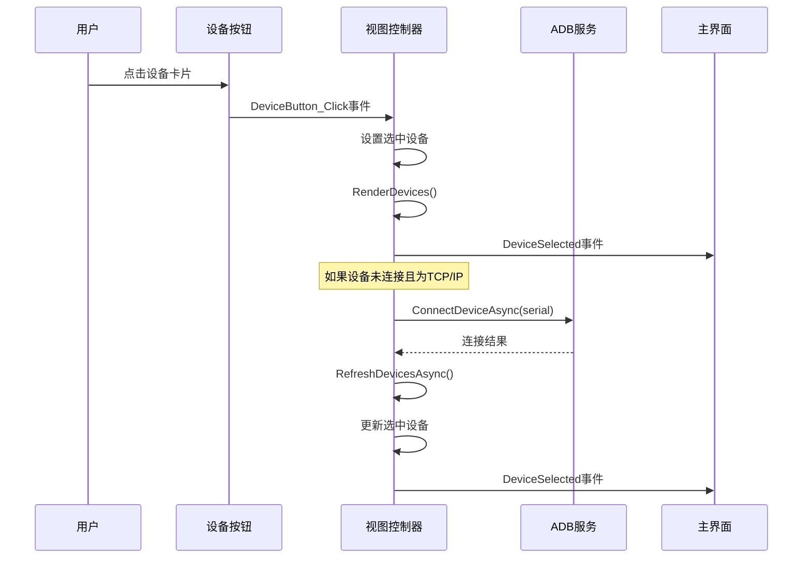

**图表来源**
- [AdbDeviceListView.xaml.cs:299-337](file://App/Views/AdbDeviceListView.xaml.cs#L299-L337)

**章节来源**
- [AdbDeviceListView.xaml:1-136](file://App/Views/AdbDeviceListView.xaml#L1-L136)
- [AdbDeviceListView.xaml.cs:16-347](file://App/Views/AdbDeviceListView.xaml.cs#L16-L347)

### 设备刷新机制

设备列表的刷新机制实现了智能去重和状态优先级处理：

#### 刷新流程分析

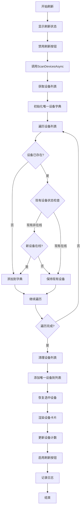

**图表来源**
- [AdbDeviceListView.xaml.cs:124-189](file://App/Views/AdbDeviceListView.xaml.cs#L124-L189)

#### 状态监控和异常处理

设备列表实现了完善的错误处理机制：

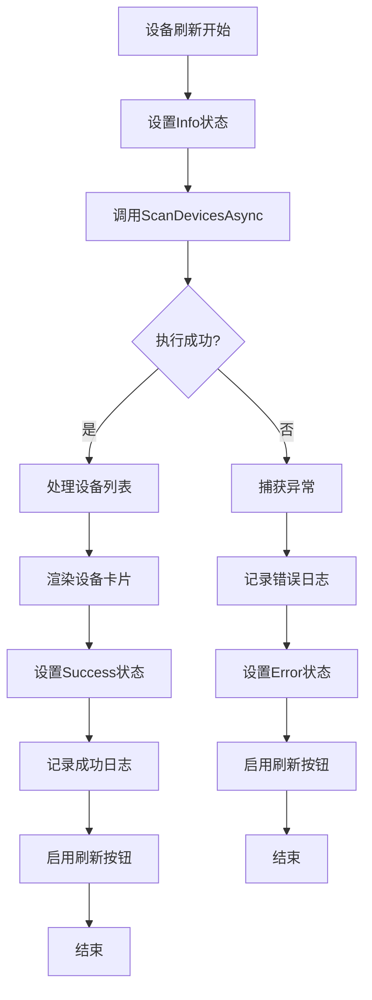

**图表来源**
- [AdbDeviceListView.xaml.cs:177-184](file://App/Views/AdbDeviceListView.xaml.cs#L177-L184)

**章节来源**
- [AdbDeviceListView.xaml.cs:124-189](file://App/Views/AdbDeviceListView.xaml.cs#L124-L189)

### 无线调试连接功能

设备列表支持两种无线连接方式：配对连接和直接连接：

#### 配对连接流程

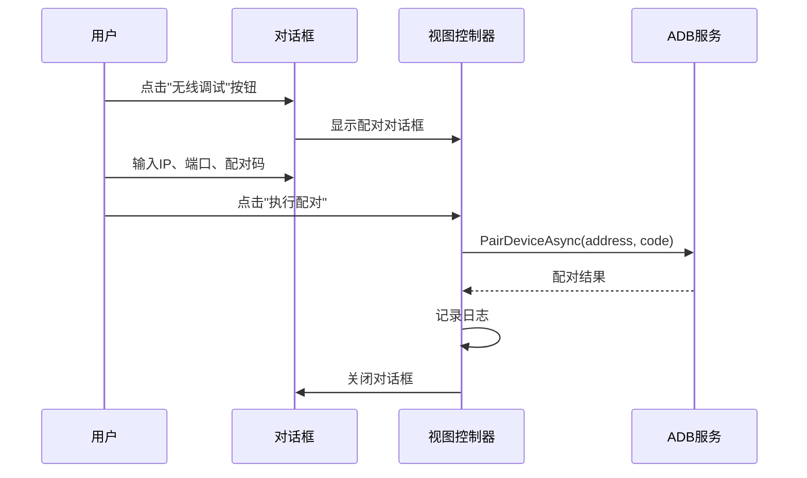

**图表来源**
- [AdbDeviceListView.xaml.cs:65-88](file://App/Views/AdbDeviceListView.xaml.cs#L65-L88)

#### 直接连接流程

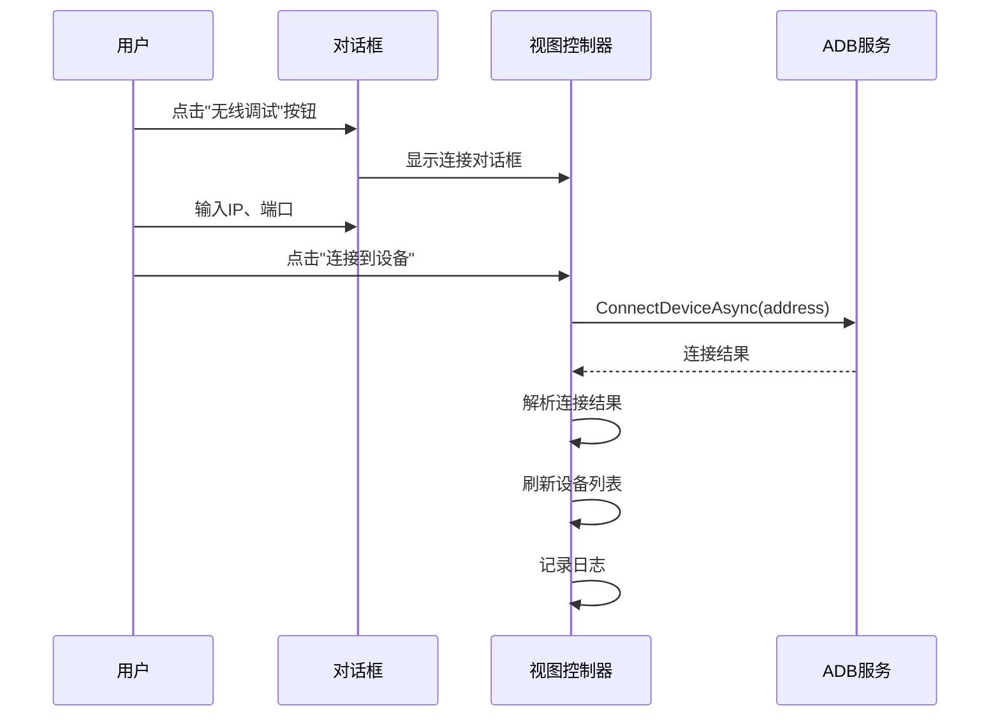

**图表来源**
- [AdbDeviceListView.xaml.cs:90-122](file://App/Views/AdbDeviceListView.xaml.cs#L90-L122)

**章节来源**
- [AdbDeviceListView.xaml:60-133](file://App/Views/AdbDeviceListView.xaml#L60-L133)
- [AdbDeviceListView.xaml.cs:59-122](file://App/Views/AdbDeviceListView.xaml.cs#L59-L122)

## 依赖关系分析

设备列表界面的依赖关系体现了清晰的分层架构：

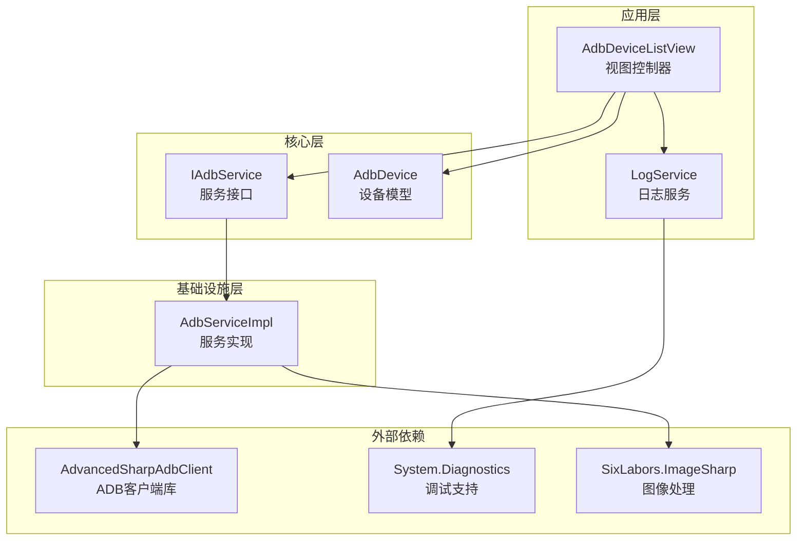

**图表来源**
- [AdbDeviceListView.xaml.cs:8-9](file://App/Views/AdbDeviceListView.xaml.cs#L8-L9)
- [AdbServiceImpl.cs:1-10](file://Infrastructure/Adb/AdbServiceImpl.cs#L1-L10)

### 组件耦合度分析

设备列表界面采用了低耦合的设计原则：

- **视图与逻辑分离**：XAML 和代码隐藏文件分离，便于维护
- **接口抽象**：通过 IAdbService 接口实现服务抽象，便于测试和替换
- **事件驱动**：使用事件机制实现组件间通信，减少直接依赖
- **单一职责**：每个组件专注于特定功能，职责明确

**章节来源**
- [AdbDeviceListView.xaml.cs:39-44](file://App/Views/AdbDeviceListView.xaml.cs#L39-L44)
- [IAdbService.cs:8-56](file://Core/Abstractions/IAdbService.cs#L8-L56)

## 性能考虑

### 设备列表渲染优化

设备列表采用了高效的渲染策略：

1. **虚拟化渲染**：使用 StackPanel 动态创建设备卡片，避免一次性渲染大量元素
2. **增量更新**：只更新发生变化的设备卡片，而非重新渲染整个列表
3. **状态缓存**：缓存设备状态信息，减少重复查询

### 内存管理

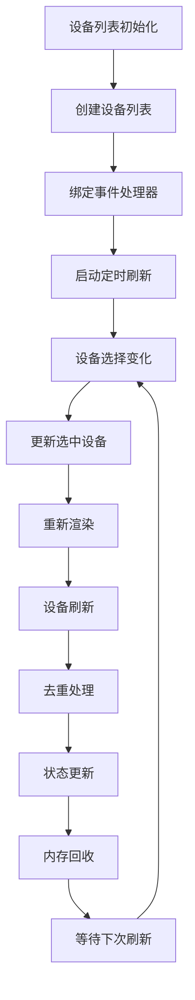

**图表来源**
- [AdbDeviceListView.xaml.cs:138-165](file://App/Views/AdbDeviceListView.xaml.cs#L138-L165)

### 网络连接优化

ADB 服务实现了连接池和重连机制：

- **自动重连**：在网络中断时自动尝试重新连接
- **超时控制**：设置合理的超时时间，避免长时间阻塞
- **并发控制**：限制同时进行的设备操作数量

## 故障排除指南

### 常见连接问题及解决方案

#### ADB 服务初始化失败

**症状**：设备列表无法显示任何设备

**可能原因**：
1. ADB 可执行文件未找到
2. Android SDK 环境变量配置错误
3. 权限不足

**解决方案**：
1. 检查 ANDROID_HOME 环境变量
2. 验证 adb.exe 路径有效性
3. 以管理员权限运行应用

#### 设备连接超时

**症状**：无线设备连接时出现超时错误

**可能原因**：
1. 网络连接不稳定
2. 防火墙阻止连接
3. 设备端无线调试未开启

**解决方案**：
1. 确保设备和电脑在同一网络
2. 检查防火墙设置
3. 重新启动设备的无线调试功能

#### 设备状态异常

**症状**：设备显示为 "offline" 或 "unauthorized"

**可能原因**：
1. USB 调试未开启
2. 设备授权被拒绝
3. ADB 服务冲突

**解决方案**：
1. 在设备上重新开启 USB 调试
2. 授权开发设备
3. 重启 ADB 服务

### 网络连接优化建议

#### Wi-Fi 连接优化

1. **网络稳定性**：确保设备和电脑连接到同一个稳定的 Wi-Fi 网络
2. **IP 地址固定**：为设备分配静态 IP 地址，避免 IP 变化导致连接失败
3. **端口开放**：确保 5555 端口在防火墙中开放

#### ADB 服务配置

1. **服务重启**：定期重启 ADB 服务，清理异常连接
2. **版本兼容**：确保 ADB 版本与设备系统兼容
3. **驱动安装**：正确安装设备驱动程序

#### 性能监控

1. **日志监控**：通过日志服务监控连接状态
2. **连接测试**：定期测试网络连接质量
3. **资源监控**：监控内存和 CPU 使用情况

**章节来源**
- [LogService.cs:9-50](file://App/Services/LogService.cs#L9-L50)
- [AdbServiceImpl.cs:190-236](file://Infrastructure/Adb/AdbServiceImpl.cs#L190-L236)

## 结论

AutoJS6 开发工具的设备列表界面是一个设计精良的设备管理组件，具有以下特点：

### 技术优势

1. **架构清晰**：采用分层架构和事件驱动模式，职责分离明确
2. **用户体验优秀**：提供直观的设备选择和连接反馈
3. **功能完整**：支持有线和无线连接，具备完整的设备管理功能
4. **错误处理完善**：实现了全面的异常处理和用户反馈机制

### 改进建议

1. **搜索过滤功能**：可以添加设备搜索和过滤功能，提升大设备列表的管理效率
2. **批量操作支持**：支持多设备选择和批量连接操作
3. **设备状态监控**：实现实时设备状态监控和自动刷新
4. **配置持久化**：保存用户偏好设置和设备连接历史

### 应用价值

该设备列表界面为 AutoJS6 开发工具提供了可靠的设备管理基础，使得开发者能够高效地管理 Android 设备，进行截图、UI 树拉取和代码生成等操作。其模块化的架构设计也为后续功能扩展奠定了良好基础。