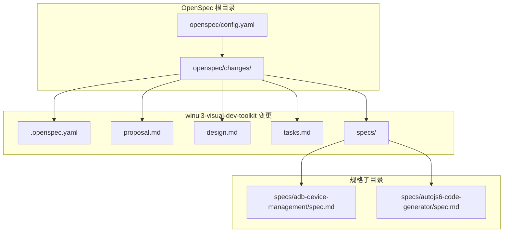
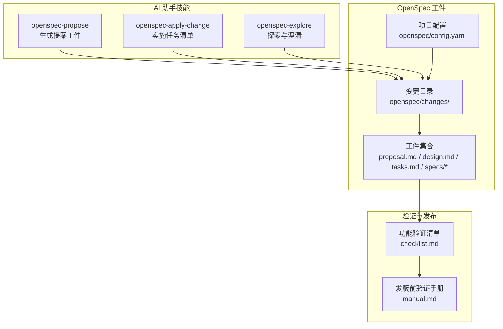
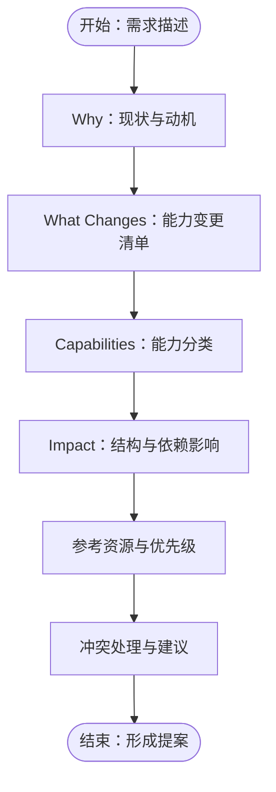
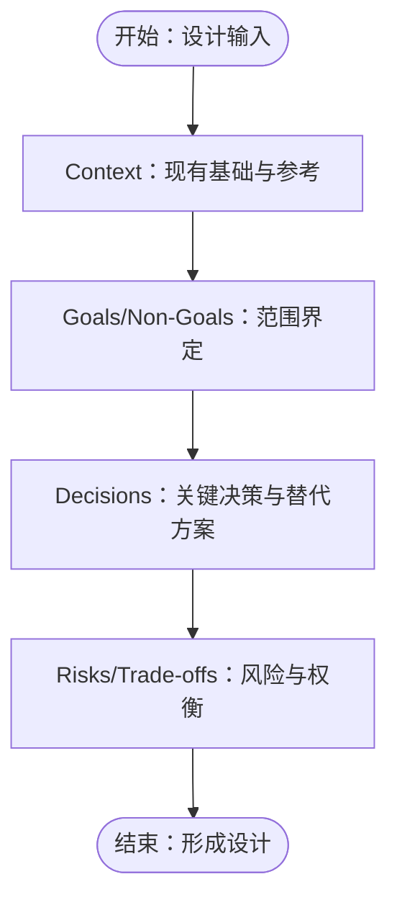
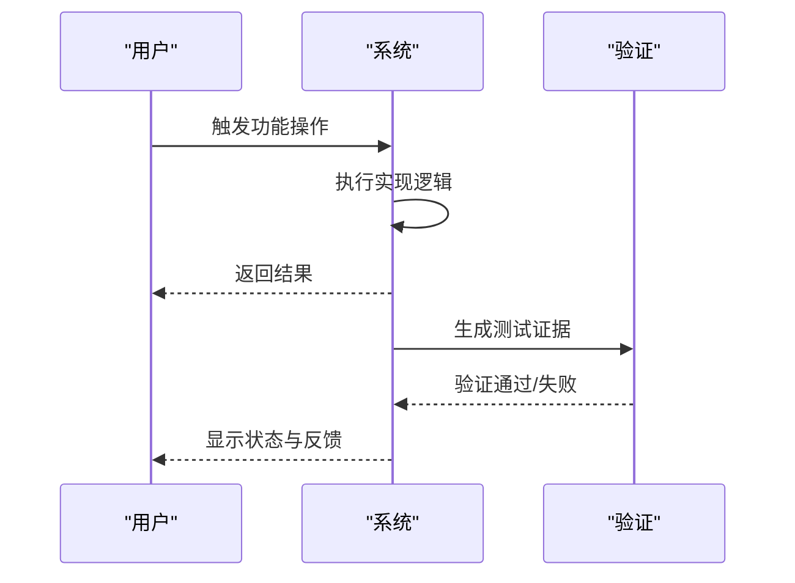
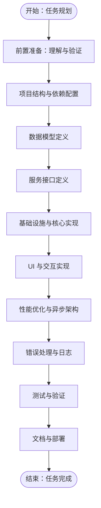
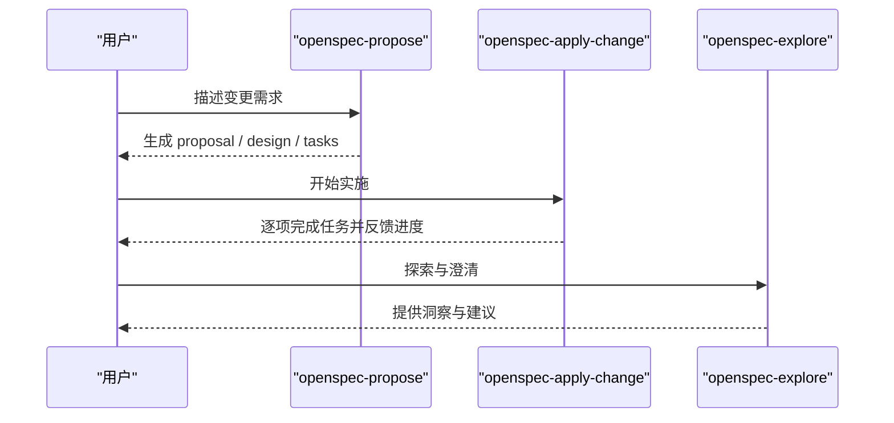
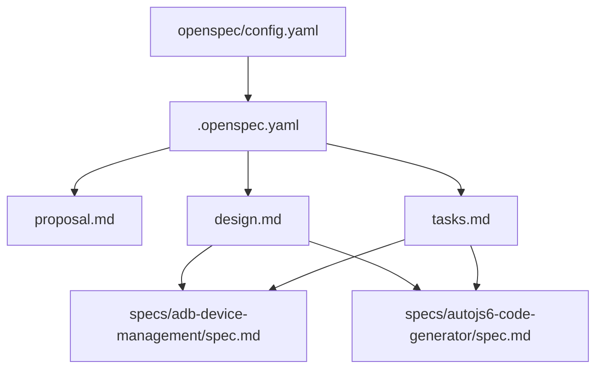

# OpenSpec 变更提案

<cite>
**本文档引用的文件**
- [openspec/config.yaml](file://openspec/config.yaml)
- [openspec/changes/winui3-visual-dev-toolkit/proposal.md](file://openspec/changes/winui3-visual-dev-toolkit/proposal.md)
- [openspec/changes/winui3-visual-dev-toolkit/design.md](file://openspec/changes/winui3-visual-dev-toolkit/design.md)
- [openspec/changes/winui3-visual-dev-toolkit/tasks.md](file://openspec/changes/winui3-visual-dev-toolkit/tasks.md)
- [.agents/skills/openspec-propose/SKILL.md](file://.agents/skills/openspec-propose/SKILL.md)
- [.agents/skills/openspec-apply-change/SKILL.md](file://.agents/skills/openspec-apply-change/SKILL.md)
- [.agents/skills/openspec-explore/SKILL.md](file://.agents/skills/openspec-explore/SKILL.md)
- [openspec/changes/winui3-visual-dev-toolkit/.openspec.yaml](file://openspec/changes/winui3-visual-dev-toolkit/.openspec.yaml)
- [openspec/changes/winui3-visual-dev-toolkit/specs/adb-device-management/spec.md](file://openspec/changes/winui3-visual-dev-toolkit/specs/adb-device-management/spec.md)
- [openspec/changes/winui3-visual-dev-toolkit/specs/autojs6-code-generator/spec.md](file://openspec/changes/winui3-visual-dev-toolkit/specs/autojs6-code-generator/spec.md)
- [manual.md](file://manual.md)
- [checklist.md](file://checklist.md)
</cite>

## 目录
1. [引言](#引言)
2. [项目结构](#项目结构)
3. [核心组件](#核心组件)
4. [架构总览](#架构总览)
5. [详细组件分析](#详细组件分析)
6. [依赖分析](#依赖分析)
7. [性能考虑](#性能考虑)
8. [故障排除指南](#故障排除指南)
9. [结论](#结论)
10. [附录](#附录)

## 引言
本文件为 AutoJS6 开发工具的 OpenSpec 变更提案提供系统化规范，旨在建立一套标准化的变更提案流程与技术要求，确保从需求提出到实现落地的全过程可追溯、可评审、可验证。OpenSpec 通过结构化的提案、设计、规格与任务清单，将抽象需求转化为可执行的工程任务，并配套 AI 助手技能实现“一次性生成完整提案”的高效协作模式。

OpenSpec 的核心价值在于：
- 明确变更的“为什么（Why）”“做什么（What）”“怎么做（How）”
- 以规格（Spec）驱动实现，确保功能边界与质量标准
- 以任务（Tasks）分解工程化落地，保障可执行性与可追踪性
- 以设计（Design）沉淀架构决策与权衡，提升可维护性

## 项目结构
AutoJS6 开发工具的 OpenSpec 相关文件集中在 openspec 目录，采用“变更（change）-工件（artifact）”的组织方式。每个变更包含 proposal（为什么）、design（怎么做）、tasks（如何做）、以及针对具体能力的 specs（规格）。

图表来源
- [openspec/config.yaml:1-21](file://openspec/config.yaml#L1-L21)
- [openspec/changes/winui3-visual-dev-toolkit/.openspec.yaml:1-3](file://openspec/changes/winui3-visual-dev-toolkit/.openspec.yaml#L1-L3)
- [openspec/changes/winui3-visual-dev-toolkit/proposal.md:1-70](file://openspec/changes/winui3-visual-dev-toolkit/proposal.md#L1-L70)
- [openspec/changes/winui3-visual-dev-toolkit/design.md:1-153](file://openspec/changes/winui3-visual-dev-toolkit/design.md#L1-L153)
- [openspec/changes/winui3-visual-dev-toolkit/tasks.md:1-260](file://openspec/changes/winui3-visual-dev-toolkit/tasks.md#L1-L260)
- [openspec/changes/winui3-visual-dev-toolkit/specs/adb-device-management/spec.md:1-90](file://openspec/changes/winui3-visual-dev-toolkit/specs/adb-device-management/spec.md#L1-L90)
- [openspec/changes/winui3-visual-dev-toolkit/specs/autojs6-code-generator/spec.md:1-136](file://openspec/changes/winui3-visual-dev-toolkit/specs/autojs6-code-generator/spec.md#L1-L136)

章节来源
- [openspec/config.yaml:1-21](file://openspec/config.yaml#L1-L21)
- [openspec/changes/winui3-visual-dev-toolkit/.openspec.yaml:1-3](file://openspec/changes/winui3-visual-dev-toolkit/.openspec.yaml#L1-L3)
- [openspec/changes/winui3-visual-dev-toolkit/proposal.md:1-70](file://openspec/changes/winui3-visual-dev-toolkit/proposal.md#L1-L70)
- [openspec/changes/winui3-visual-dev-toolkit/design.md:1-153](file://openspec/changes/winui3-visual-dev-toolkit/design.md#L1-L153)
- [openspec/changes/winui3-visual-dev-toolkit/tasks.md:1-260](file://openspec/changes/winui3-visual-dev-toolkit/tasks.md#L1-L260)

## 核心组件
OpenSpec 变更提案由四个核心工件构成，分别承担不同阶段的职责：

- 提案（Proposal）：阐述变更背景、动机与范围，回答“为什么”和“做什么”
- 设计（Design）：定义技术路线、架构决策与约束，回答“怎么做”
- 规格（Spec）：以可验证的场景化需求描述功能边界，确保实现质量
- 任务（Tasks）：将设计与规格转化为可执行的工程任务清单

AI 助手技能支撑 OpenSpec 的自动化生成与实施：
- openspec-propose：一次性生成提案相关工件
- openspec-apply-change：按任务清单实施变更
- openspec-explore：探索与澄清需求，不直接实现

章节来源
- [.agents/skills/openspec-propose/SKILL.md:1-111](file://.agents/skills/openspec-propose/SKILL.md#L1-L111)
- [.agents/skills/openspec-apply-change/SKILL.md:1-157](file://.agents/skills/openspec-apply-change/SKILL.md#L1-L157)
- [.agents/skills/openspec-explore/SKILL.md:1-289](file://.agents/skills/openspec-explore/SKILL.md#L1-L289)

## 架构总览
OpenSpec 在本项目中的应用体现为“提案-设计-规格-任务”的闭环，配合 AI 助手技能实现从需求到实现的自动化与规范化。

图表来源
- [.agents/skills/openspec-propose/SKILL.md:1-111](file://.agents/skills/openspec-propose/SKILL.md#L1-L111)
- [.agents/skills/openspec-apply-change/SKILL.md:1-157](file://.agents/skills/openspec-apply-change/SKILL.md#L1-L157)
- [.agents/skills/openspec-explore/SKILL.md:1-289](file://.agents/skills/openspec-explore/SKILL.md#L1-L289)
- [openspec/config.yaml:1-21](file://openspec/config.yaml#L1-L21)
- [openspec/changes/winui3-visual-dev-toolkit/proposal.md:1-70](file://openspec/changes/winui3-visual-dev-toolkit/proposal.md#L1-L70)
- [openspec/changes/winui3-visual-dev-toolkit/design.md:1-153](file://openspec/changes/winui3-visual-dev-toolkit/design.md#L1-L153)
- [openspec/changes/winui3-visual-dev-toolkit/tasks.md:1-260](file://openspec/changes/winui3-visual-dev-toolkit/tasks.md#L1-L260)
- [checklist.md:1-186](file://checklist.md#L1-L186)
- [manual.md:1-522](file://manual.md#L1-L522)

## 详细组件分析

### 提案（Proposal）规范
提案用于明确变更的目的、范围与受益方，回答“为什么”和“做什么”。其典型结构包括：
- Why：现状痛点、收益项目与背景
- What Changes：新增/修改的能力清单
- Capabilities：新能力与修改能力的分类
- Impact：对项目结构、依赖与兼容性的影响
- 参考资源与前置分析报告优先级
- 冲突处理原则与实施建议

图表来源
- [openspec/changes/winui3-visual-dev-toolkit/proposal.md:1-70](file://openspec/changes/winui3-visual-dev-toolkit/proposal.md#L1-L70)

章节来源
- [openspec/changes/winui3-visual-dev-toolkit/proposal.md:1-70](file://openspec/changes/winui3-visual-dev-toolkit/proposal.md#L1-L70)

### 设计（Design）规范
设计用于沉淀技术路线、架构决策与约束，回答“怎么做”。其典型结构包括：
- Context：现有基础、参考资源与前置分析报告
- Goals/Non-Goals：目标与非目标范围
- Decisions：关键架构决策及其理由与替代方案
- Risks/Trade-offs：风险缓解与权衡取舍

图表来源
- [openspec/changes/winui3-visual-dev-toolkit/design.md:1-153](file://openspec/changes/winui3-visual-dev-toolkit/design.md#L1-L153)

章节来源
- [openspec/changes/winui3-visual-dev-toolkit/design.md:1-153](file://openspec/changes/winui3-visual-dev-toolkit/design.md#L1-L153)

### 规格（Spec）规范
规格以可验证的场景化需求描述功能边界，确保实现质量。典型结构包括：
- Added Requirements：新增需求条目
- 场景（Scenario）：前置条件、动作、期望结果
- 实现约束：技术限制与合规要求
- 质量与一致性：与既有实现的行为一致性

图表来源
- [openspec/changes/winui3-visual-dev-toolkit/specs/adb-device-management/spec.md:1-90](file://openspec/changes/winui3-visual-dev-toolkit/specs/adb-device-management/spec.md#L1-L90)
- [openspec/changes/winui3-visual-dev-toolkit/specs/autojs6-code-generator/spec.md:1-136](file://openspec/changes/winui3-visual-dev-toolkit/specs/autojs6-code-generator/spec.md#L1-L136)

章节来源
- [openspec/changes/winui3-visual-dev-toolkit/specs/adb-device-management/spec.md:1-90](file://openspec/changes/winui3-visual-dev-toolkit/specs/adb-device-management/spec.md#L1-L90)
- [openspec/changes/winui3-visual-dev-toolkit/specs/autojs6-code-generator/spec.md:1-136](file://openspec/changes/winui3-visual-dev-toolkit/specs/autojs6-code-generator/spec.md#L1-L136)

### 任务（Tasks）规范
任务将设计与规格转化为可执行的工程任务清单，确保落地可控。典型结构包括：
- 前置准备：理解项目与生态、MVP 验证
- 项目结构与依赖配置
- 数据模型与服务接口定义
- 基础设施与核心服务实现
- UI 与交互实现
- 性能优化与异步架构
- 错误处理与日志
- 测试与验证
- 文档与部署

图表来源
- [openspec/changes/winui3-visual-dev-toolkit/tasks.md:1-260](file://openspec/changes/winui3-visual-dev-toolkit/tasks.md#L1-L260)

章节来源
- [openspec/changes/winui3-visual-dev-toolkit/tasks.md:1-260](file://openspec/changes/winui3-visual-dev-toolkit/tasks.md#L1-L260)

### AI 助手技能集成
- openspec-propose：一次性生成 proposal、design、tasks 等工件，支持按依赖顺序创建
- openspec-apply-change：读取上下文文件，按任务清单逐步实施，支持暂停与继续
- openspec-explore：在不实现的前提下探索与澄清需求，自然融入讨论

图表来源
- [.agents/skills/openspec-propose/SKILL.md:1-111](file://.agents/skills/openspec-propose/SKILL.md#L1-L111)
- [.agents/skills/openspec-apply-change/SKILL.md:1-157](file://.agents/skills/openspec-apply-change/SKILL.md#L1-L157)
- [.agents/skills/openspec-explore/SKILL.md:1-289](file://.agents/skills/openspec-explore/SKILL.md#L1-L289)

章节来源
- [.agents/skills/openspec-propose/SKILL.md:1-111](file://.agents/skills/openspec-propose/SKILL.md#L1-L111)
- [.agents/skills/openspec-apply-change/SKILL.md:1-157](file://.agents/skills/openspec-apply-change/SKILL.md#L1-L157)
- [.agents/skills/openspec-explore/SKILL.md:1-289](file://.agents/skills/openspec-explore/SKILL.md#L1-L289)

## 依赖分析
OpenSpec 工件之间存在明确的依赖关系，确保变更流程的完整性与可追溯性。

图表来源
- [openspec/config.yaml:1-21](file://openspec/config.yaml#L1-L21)
- [openspec/changes/winui3-visual-dev-toolkit/.openspec.yaml:1-3](file://openspec/changes/winui3-visual-dev-toolkit/.openspec.yaml#L1-L3)
- [openspec/changes/winui3-visual-dev-toolkit/proposal.md:1-70](file://openspec/changes/winui3-visual-dev-toolkit/proposal.md#L1-L70)
- [openspec/changes/winui3-visual-dev-toolkit/design.md:1-153](file://openspec/changes/winui3-visual-dev-toolkit/design.md#L1-L153)
- [openspec/changes/winui3-visual-dev-toolkit/tasks.md:1-260](file://openspec/changes/winui3-visual-dev-toolkit/tasks.md#L1-L260)
- [openspec/changes/winui3-visual-dev-toolkit/specs/adb-device-management/spec.md:1-90](file://openspec/changes/winui3-visual-dev-toolkit/specs/adb-device-management/spec.md#L1-L90)
- [openspec/changes/winui3-visual-dev-toolkit/specs/autojs6-code-generator/spec.md:1-136](file://openspec/changes/winui3-visual-dev-toolkit/specs/autojs6-code-generator/spec.md#L1-L136)

章节来源
- [openspec/config.yaml:1-21](file://openspec/config.yaml#L1-L21)
- [openspec/changes/winui3-visual-dev-toolkit/.openspec.yaml:1-3](file://openspec/changes/winui3-visual-dev-toolkit/.openspec.yaml#L1-L3)
- [openspec/changes/winui3-visual-dev-toolkit/proposal.md:1-70](file://openspec/changes/winui3-visual-dev-toolkit/proposal.md#L1-L70)
- [openspec/changes/winui3-visual-dev-toolkit/design.md:1-153](file://openspec/changes/winui3-visual-dev-toolkit/design.md#L1-L153)
- [openspec/changes/winui3-visual-dev-toolkit/tasks.md:1-260](file://openspec/changes/winui3-visual-dev-toolkit/tasks.md#L1-L260)

## 性能考虑
- 异步架构：所有外部操作（ADB、OpenCV、UI 树解析）采用异步执行，避免阻塞 UI
- 分层渲染：Win2D 双图层架构（图像层 + 叠加层），仅重绘变化部分，确保 60FPS
- 缓存与复用：CanvasBitmap 缓存池、模板降采样与路径兼容处理，降低资源消耗
- 超时与重试：通过 CancellationToken 实现超时控制，结合有限重试避免长时间等待

章节来源
- [openspec/changes/winui3-visual-dev-toolkit/design.md:109-119](file://openspec/changes/winui3-visual-dev-toolkit/design.md#L109-L119)
- [openspec/changes/winui3-visual-dev-toolkit/tasks.md:214-225](file://openspec/changes/winui3-visual-dev-toolkit/tasks.md#L214-L225)

## 故障排除指南
- ADB 连接不稳定：实现重试机制（最多 3 次）、超时设置（5 秒）、异常捕获与 Toast 提示
- OpenCV 匹配误报/漏报：提供阈值滑块（0.50~0.95）实时调节，绘制置信度数值，支持多模板匹配
- UI 树解析失败：容错解析器（跳过无效节点），日志记录解析错误，提供原始 Dump 文本查看面板
- 渲染性能不足：图像降采样（最大 1920x1080），分层渲染仅重绘变化图层，启用 GPU 加速
- 生成代码不一致：严格复用现有脚本的坐标计算/匹配算法/路径处理逻辑，提供代码预览与手动编辑

章节来源
- [openspec/changes/winui3-visual-dev-toolkit/design.md:131-153](file://openspec/changes/winui3-visual-dev-toolkit/design.md#L131-L153)
- [openspec/changes/winui3-visual-dev-toolkit/tasks.md:226-236](file://openspec/changes/winui3-visual-dev-toolkit/tasks.md#L226-L236)

## 结论
OpenSpec 为 AutoJS6 开发工具提供了从需求到实现的标准化流程：以提案明确目标与范围，以设计沉淀架构与约束，以规格确保可验证的质量边界，以任务推动工程化落地。配合 AI 助手技能，OpenSpec 实现了“一次性生成完整提案”“按任务清单实施变更”的高效协作模式，显著提升了变更管理的透明度与可追溯性。

## 附录

### 提案编写流程
- 准备阶段：收集背景信息、目标用户场景与前置分析报告
- 编写阶段：按照 Proposal 结构撰写 Why/What/Capabilities/Impact
- 评审阶段：依据设计与规格进行技术评审与范围确认
- 批准阶段：根据评审意见修订并获得批准

章节来源
- [openspec/changes/winui3-visual-dev-toolkit/proposal.md:1-70](file://openspec/changes/winui3-visual-dev-toolkit/proposal.md#L1-L70)

### 技术要求
- 需求分析：明确业务痛点与收益项目，形成需求清单
- 设计文档：定义架构决策、约束与风险缓解策略
- 实现计划：细化任务清单，明确依赖关系与里程碑
- 测试方案：覆盖功能、性能与稳定性测试，确保质量达标

章节来源
- [openspec/changes/winui3-visual-dev-toolkit/design.md:1-153](file://openspec/changes/winui3-visual-dev-toolkit/design.md#L1-L153)
- [openspec/changes/winui3-visual-dev-toolkit/tasks.md:1-260](file://openspec/changes/winui3-visual-dev-toolkit/tasks.md#L1-L260)

### 提案模板与示例
- 提案模板：包含 Why、What Changes、Capabilities、Impact 等结构化字段
- 规格模板：包含 Added Requirements、Scenario、实现约束、一致性要求
- 示例参考：winui3-visual-dev-toolkit 变更的 proposal、design、tasks 与 specs

章节来源
- [openspec/changes/winui3-visual-dev-toolkit/proposal.md:1-70](file://openspec/changes/winui3-visual-dev-toolkit/proposal.md#L1-L70)
- [openspec/changes/winui3-visual-dev-toolkit/design.md:1-153](file://openspec/changes/winui3-visual-dev-toolkit/design.md#L1-L153)
- [openspec/changes/winui3-visual-dev-toolkit/tasks.md:1-260](file://openspec/changes/winui3-visual-dev-toolkit/tasks.md#L1-L260)
- [openspec/changes/winui3-visual-dev-toolkit/specs/adb-device-management/spec.md:1-90](file://openspec/changes/winui3-visual-dev-toolkit/specs/adb-device-management/spec.md#L1-L90)
- [openspec/changes/winui3-visual-dev-toolkit/specs/autojs6-code-generator/spec.md:1-136](file://openspec/changes/winui3-visual-dev-toolkit/specs/autojs6-code-generator/spec.md#L1-L136)

### 提案管理最佳实践与版本控制策略
- 版本控制：每个变更独立目录，使用 .openspec.yaml 标识 schema 与创建时间
- 评审标准：以设计与规格为依据，关注技术可行性、风险与一致性
- 批准程序：由相关干系人对提案进行评审与签字批准
- 发布验证：结合 checklist.md 与 manual.md，确保功能可用与发版链路稳定

章节来源
- [openspec/changes/winui3-visual-dev-toolkit/.openspec.yaml:1-3](file://openspec/changes/winui3-visual-dev-toolkit/.openspec.yaml#L1-L3)
- [checklist.md:1-186](file://checklist.md#L1-L186)
- [manual.md:1-522](file://manual.md#L1-L522)