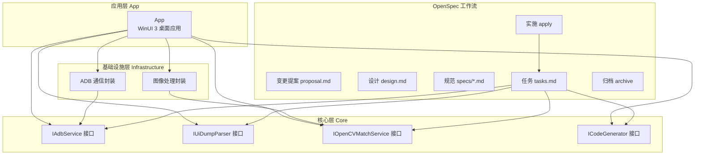
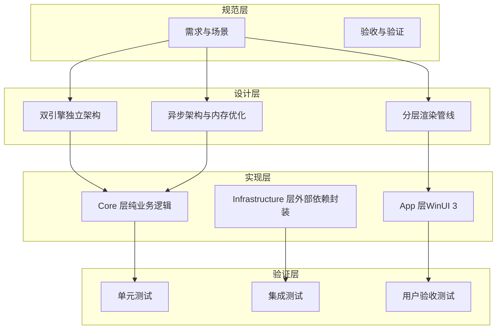
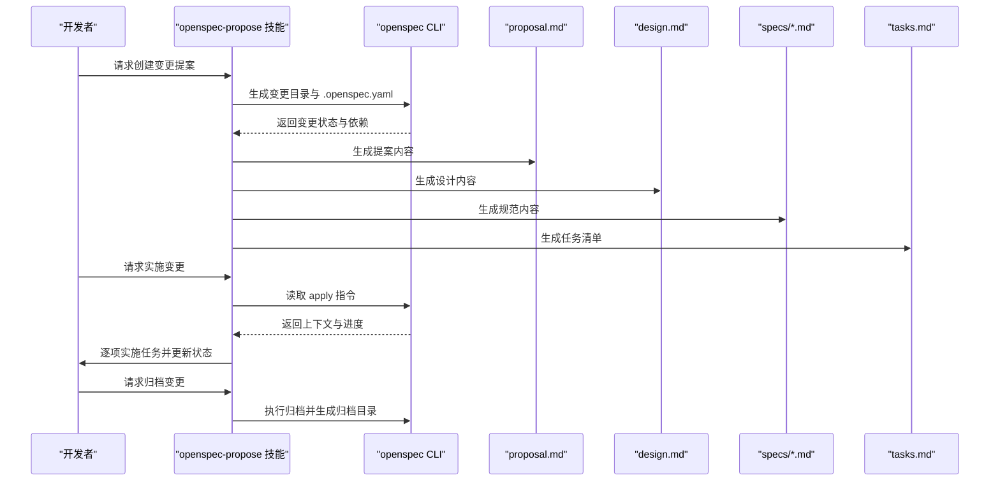
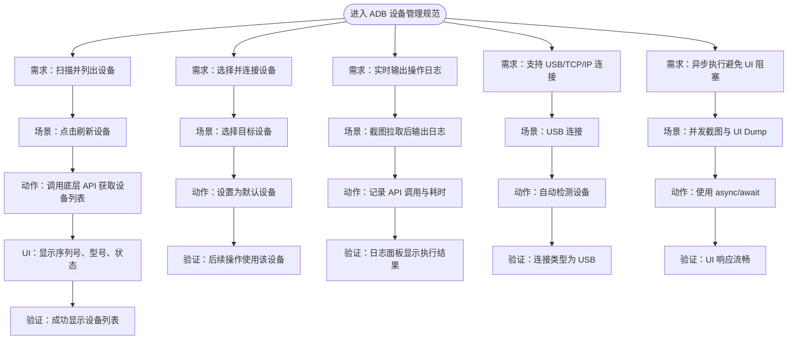
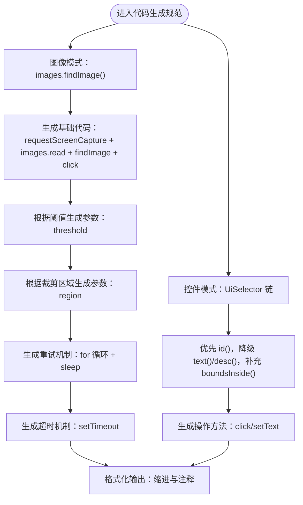
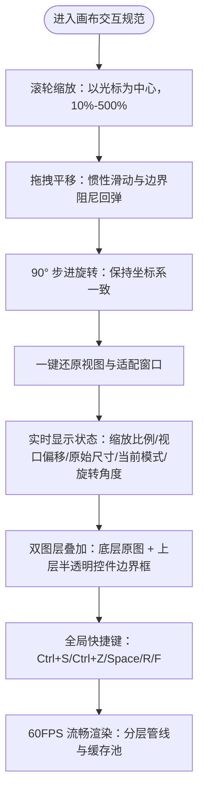
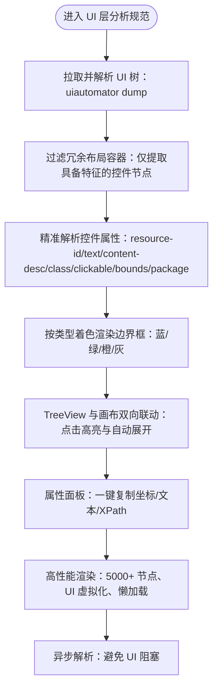
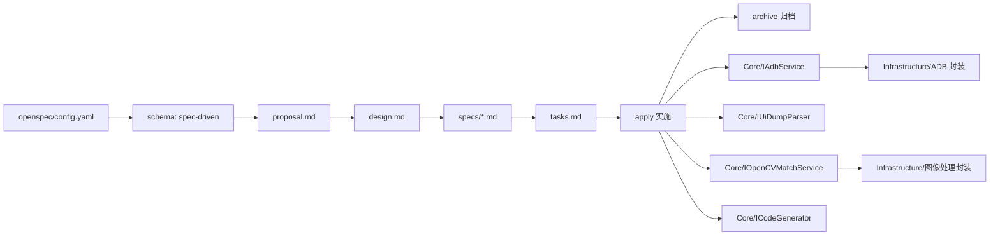

# OpenSpec 概念与定义

<cite>
**本文档引用的文件**
- [README.md](file://README.md)
- [AGENTS.md](file://AGENTS.md)
- [checklist.md](file://checklist.md)
- [.github\skills\openspec-propose\SKILL.md](file://.github/skills/openspec-propose/SKILL.md)
- [.github\skills\openspec-apply-change\SKILL.md](file://.github/skills/openspec-apply-change/SKILL.md)
- [.github\skills\openspec-explore\SKILL.md](file://.github/skills/openspec-explore/SKILL.md)
- [.github\skills\openspec-archive-change\SKILL.md](file://.github/skills/openspec-archive-change/SKILL.md)
- [openspec\config.yaml](file://openspec/config.yaml)
- [openspec\.openspec.yaml](file://openspec/.openspec.yaml)
- [openspec\changes\winui3-visual-dev-toolkit\proposal.md](file://openspec/changes/winui3-visual-dev-toolkit/proposal.md)
- [openspec\changes\winui3-visual-dev-toolkit\design.md](file://openspec/changes/winui3-visual-dev-toolkit/design.md)
- [openspec\changes\winui3-visual-dev-toolkit\tasks.md](file://openspec/changes/winui3-visual-dev-toolkit/tasks.md)
- [openspec\changes\winui3-visual-dev-toolkit\specs\adb-device-management\spec.md](file://openspec/changes/winui3-visual-dev-toolkit/specs/adb-device-management/spec.md)
- [openspec\changes\winui3-visual-dev-toolkit\specs\autojs6-code-generator\spec.md](file://openspec/changes/winui3-visual-dev-toolkit/specs/autojs6-code-generator/spec.md)
- [openspec\changes\winui3-visual-dev-toolkit\specs\canvas-interaction\spec.md](file://openspec/changes/winui3-visual-dev-toolkit/specs/canvas-interaction/spec.md)
- [openspec\changes\winui3-visual-dev-toolkit\specs\ui-layer-analysis-engine\spec.md](file://openspec/changes/winui3-visual-dev-toolkit/specs/ui-layer-analysis-engine/spec.md)
</cite>

## 目录
1. [引言](#引言)
2. [项目结构](#项目结构)
3. [核心组件](#核心组件)
4. [架构总览](#架构总览)
5. [详细组件分析](#详细组件分析)
6. [依赖关系分析](#依赖关系分析)
7. [性能考量](#性能考量)
8. [故障排查指南](#故障排查指南)
9. [结论](#结论)
10. [附录](#附录)

## 引言
本文件系统性阐述 AutoJS6 开发工具中的 OpenSpec 概念与定义，解释规范驱动开发（spec-driven）理念及其在项目中的落地实践。OpenSpec 通过“变更提案（proposal）—设计（design）—规范（spec）—任务（tasks）—实施（apply）—归档（archive）”的闭环工作流，帮助团队实现规范化的需求管理与功能开发，确保技术约束、用户体验与业务目标的一致性。

## 项目结构
AutoJS6 可视化开发工具采用 WinUI 3 + Clean Architecture 的三层架构，结合 OpenSpec 的 spec-driven 工作流，形成“规范先行、任务驱动、验证闭环”的开发范式。项目关键目录与文件如下：
- App：WinUI 3 桌面应用，包含视图、视图模型与资源
- Core：纯业务逻辑层，无 UI 依赖，独立可测试
- Infrastructure：外部依赖适配层，封装 ADB、OpenCV、ImageSharp 等
- openspec：OpenSpec 变更提案与规范集合，包含 proposal、design、specs、tasks 等
- .github/skills：GitHub Actions 集成的 OpenSpec 技能，支持 propose、apply、explore、archive

**图表来源**
- [README.md: 项目结构与架构原则:230-288](file://README.md#L230-L288)
- [openspec\changes\winui3-visual-dev-toolkit\proposal.md: 变更背景与范围:1-70](file://openspec/changes/winui3-visual-dev-toolkit/proposal.md#L1-L70)
- [openspec\changes\winui3-visual-dev-toolkit\design.md: 设计决策与约束:1-153](file://openspec/changes/winui3-visual-dev-toolkit/design.md#L1-L153)
- [openspec\changes\winui3-visual-dev-toolkit\tasks.md: 实施任务清单:1-260](file://openspec/changes/winui3-visual-dev-toolkit/tasks.md#L1-L260)

**章节来源**
- [README.md: 项目结构与架构原则:230-288](file://README.md#L230-L288)
- [openspec\changes\winui3-visual-dev-toolkit\proposal.md: 变更背景与范围:1-70](file://openspec/changes/winui3-visual-dev-toolkit/proposal.md#L1-L70)
- [openspec\changes\winui3-visual-dev-toolkit\design.md: 设计决策与约束:1-153](file://openspec/changes/winui3-visual-dev-toolkit/design.md#L1-L153)
- [openspec\changes\winui3-visual-dev-toolkit\tasks.md: 实施任务清单:1-260](file://openspec/changes/winui3-visual-dev-toolkit/tasks.md#L1-L260)

## 核心组件
OpenSpec 在 AutoJS6 工具中的核心组件包括：
- OpenSpec 配置与模式：openspec/config.yaml 与 .openspec.yaml 明确采用“规范驱动（spec-driven）”模式
- 变更提案（Proposal）：定义“为什么做（Why）”和“做什么（What）”，明确收益项目、能力范围与影响
- 设计（Design）：定义“怎么做（How）”，包括上下文、目标、决策、风险与权衡
- 规范（Spec）：以可执行的“需求 + 场景 + 验证”形式描述功能边界与质量标准
- 任务（Tasks）：将设计与规范转化为可追踪的实施步骤，覆盖架构、实现、测试与验证
- 技能（Skills）：GitHub Actions 集成的自动化技能，支持 propose、apply、explore、archive

**章节来源**
- [openspec\config.yaml: OpenSpec 模式配置:1-21](file://openspec/config.yaml#L1-L21)
- [openspec\.openspec.yaml: 变更元数据:1-3](file://openspec/.openspec.yaml#L1-L3)
- [openspec\changes\winui3-visual-dev-toolkit\proposal.md: 变更提案:1-70](file://openspec/changes/winui3-visual-dev-toolkit/proposal.md#L1-L70)
- [openspec\changes\winui3-visual-dev-toolkit\design.md: 设计文档:1-153](file://openspec/changes/winui3-visual-dev-toolkit/design.md#L1-L153)
- [openspec\changes\winui3-visual-dev-toolkit\tasks.md: 任务清单:1-260](file://openspec/changes/winui3-visual-dev-toolkit/tasks.md#L1-L260)
- [.github\skills\openspec-propose\SKILL.md: 提案技能:1-111](file://.github/skills/openspec-propose/SKILL.md#L1-L111)
- [.github\skills\openspec-apply-change\SKILL.md: 实施技能:1-157](file://.github/skills/openspec-apply-change/SKILL.md#L1-L157)
- [.github\skills\openspec-explore\SKILL.md: 探索技能:1-289](file://.github/skills/openspec-explore/SKILL.md#L1-L289)
- [.github\skills\openspec-archive-change\SKILL.md: 归档技能:1-115](file://.github/skills/openspec-archive-change/SKILL.md#L1-L115)

## 架构总览
OpenSpec 在 AutoJS6 工具中的架构以“双引擎独立、异步非阻塞、60FPS 流畅”为核心原则，结合 Clean Architecture 的分层依赖关系，确保可维护性与扩展性。

**图表来源**
- [README.md: 架构原则与技术栈:264-288](file://README.md#L264-L288)
- [AGENTS.md: 双核独立架构与依赖规则:40-95](file://AGENTS.md#L40-L95)
- [openspec\changes\winui3-visual-dev-toolkit\design.md: 设计决策:51-153](file://openspec/changes/winui3-visual-dev-toolkit/design.md#L51-L153)

**章节来源**
- [README.md: 架构原则与技术栈:264-288](file://README.md#L264-L288)
- [AGENTS.md: 双核独立架构与依赖规则:40-95](file://AGENTS.md#L40-L95)
- [openspec\changes\winui3-visual-dev-toolkit\design.md: 设计决策:51-153](file://openspec/changes/winui3-visual-dev-toolkit/design.md#L51-L153)

## 详细组件分析

### OpenSpec 工作流（Propose → Apply → Archive）
OpenSpec 通过 GitHub Skills 实现端到端自动化，确保变更从“提出—设计—规范—实施—验证—归档”的闭环可控。

**图表来源**
- [.github\skills\openspec-propose\SKILL.md: 提案技能流程:25-86](file://.github/skills/openspec-propose/SKILL.md#L25-L86)
- [.github\skills\openspec-apply-change\SKILL.md: 实施技能流程:16-89](file://.github/skills/openspec-apply-change/SKILL.md#L16-L89)
- [.github\skills\openspec-archive-change\SKILL.md: 归档技能流程:16-84](file://.github/skills/openspec-archive-change/SKILL.md#L16-L84)

**章节来源**
- [.github\skills\openspec-propose\SKILL.md: 提案技能:1-111](file://.github/skills/openspec-propose/SKILL.md#L1-L111)
- [.github\skills\openspec-apply-change\SKILL.md: 实施技能:1-157](file://.github/skills/openspec-apply-change/SKILL.md#L1-L157)
- [.github\skills\openspec-archive-change\SKILL.md: 归档技能:1-115](file://.github/skills/openspec-archive-change/SKILL.md#L1-L115)

### 规范（Spec）示例：ADB 设备管理
规范以“需求 + 场景 + 验证”的形式定义功能边界，确保实现与用户期望一致。

**图表来源**
- [openspec\changes\winui3-visual-dev-toolkit\specs\adb-device-management\spec.md: ADB 设备管理规范:1-90](file://openspec/changes/winui3-visual-dev-toolkit/specs/adb-device-management/spec.md#L1-L90)

**章节来源**
- [openspec\changes\winui3-visual-dev-toolkit\specs\adb-device-management\spec.md: ADB 设备管理规范:1-90](file://openspec/changes/winui3-visual-dev-toolkit/specs/adb-device-management/spec.md#L1-L90)

### 规范（Spec）示例：AutoJS6 代码生成
代码生成规范确保生成的 AutoJS6 代码符合 Rhino 引擎约束与 OOM 预防规则。

**图表来源**
- [openspec\changes\winui3-visual-dev-toolkit\specs\autojs6-code-generator\spec.md: 代码生成规范:1-136](file://openspec/changes/winui3-visual-dev-toolkit/specs/autojs6-code-generator/spec.md#L1-L136)

**章节来源**
- [openspec\changes\winui3-visual-dev-toolkit\specs\autojs6-code-generator\spec.md: 代码生成规范:1-136](file://openspec/changes/winui3-visual-dev-toolkit/specs/autojs6-code-generator/spec.md#L1-L136)

### 规范（Spec）示例：画布交互
画布交互规范确保 60FPS 流畅渲染与直观的用户操作体验。

**图表来源**
- [openspec\changes\winui3-visual-dev-toolkit\specs\canvas-interaction\spec.md: 画布交互规范:1-132](file://openspec/changes/winui3-visual-dev-toolkit/specs/canvas-interaction/spec.md#L1-L132)

**章节来源**
- [openspec\changes\winui3-visual-dev-toolkit\specs\canvas-interaction\spec.md: 画布交互规范:1-132](file://openspec/changes/winui3-visual-dev-toolkit/specs/canvas-interaction/spec.md#L1-L132)

### 规范（Spec）示例：UI 层分析引擎
UI 层分析规范确保控件树解析与边界框渲染的准确性与性能。

**图表来源**
- [openspec\changes\winui3-visual-dev-toolkit\specs\ui-layer-analysis-engine\spec.md: UI 层分析规范:1-134](file://openspec/changes/winui3-visual-dev-toolkit/specs/ui-layer-analysis-engine/spec.md#L1-L134)

**章节来源**
- [openspec\changes\winui3-visual-dev-toolkit\specs\ui-layer-analysis-engine\spec.md: UI 层分析规范:1-134](file://openspec/changes/winui3-visual-dev-toolkit/specs/ui-layer-analysis-engine/spec.md#L1-L134)

## 依赖关系分析
OpenSpec 在项目中的依赖关系体现在“规范驱动—任务分解—实施验证”的闭环中，同时遵循 Clean Architecture 的分层依赖：

**图表来源**
- [openspec\config.yaml: OpenSpec 模式配置:1-21](file://openspec/config.yaml#L1-L21)
- [openspec\.openspec.yaml: 变更元数据:1-3](file://openspec/.openspec.yaml#L1-L3)
- [openspec\changes\winui3-visual-dev-toolkit\tasks.md: 实施任务清单:1-260](file://openspec/changes/winui3-visual-dev-toolkit/tasks.md#L1-L260)
- [README.md: 架构原则与技术栈:264-288](file://README.md#L264-L288)

**章节来源**
- [openspec\config.yaml: OpenSpec 模式配置:1-21](file://openspec/config.yaml#L1-L21)
- [openspec\.openspec.yaml: 变更元数据:1-3](file://openspec/.openspec.yaml#L1-L3)
- [openspec\changes\winui3-visual-dev-toolkit\tasks.md: 实施任务清单:1-260](file://openspec/changes/winui3-visual-dev-toolkit/tasks.md#L1-L260)
- [README.md: 架构原则与技术栈:264-288](file://README.md#L264-L288)

## 性能考量
OpenSpec 在性能方面的考量体现在“异步架构、内存优化、渲染管线与模块规模”四个方面：
- 异步架构：所有 I/O 操作（ADB、OpenCV、XML 解析、纹理上传）使用 async/await，避免 UI 阻塞
- 内存优化：Win2D CanvasBitmap 缓存池、阈值滑动仅重算匹配层、控件树虚拟化与懒加载
- 渲染性能：分层渲染管线（ImageLayer + OverlayLayer）、GPU 加速、60FPS 无撕裂
- 模块规模：运行时/feature/action 模块不超过 512 行，超过则拆分

**章节来源**
- [AGENTS.md: 异步架构与内存优化规则:229-253](file://AGENTS.md#L229-L253)
- [README.md: 架构原则与性能要求:282-288](file://README.md#L282-L288)
- [openspec\changes\winui3-visual-dev-toolkit\design.md: 设计决策与性能约束:109-147](file://openspec/changes/winui3-visual-dev-toolkit/design.md#L109-L147)

## 故障排查指南
OpenSpec 的故障排查围绕“规范—任务—验证”的闭环展开，常见问题与处理建议：
- ADB 连接不稳定：实现重试机制（最多 3 次）、超时控制（5 秒）、Toast 提示与日志记录
- OpenCV 匹配误报/漏报：提供阈值滑块（0.50~0.95）实时调节、置信度可视化、多模板匹配
- UI 树解析失败：容错解析器（跳过无效节点）、日志记录解析错误、提供原始 Dump 文本查看面板
- 渲染性能不足：图像降采样（最大 1920x1080）、分层渲染仅重绘变化图层、启用 GPU 加速
- 生成代码与现有脚本行为不一致：严格复用现有脚本的坐标计算/匹配算法/路径处理逻辑，提供代码预览与手动编辑功能

**章节来源**
- [openspec\changes\winui3-visual-dev-toolkit\design.md: 风险与缓解措施:131-153](file://openspec/changes/winui3-visual-dev-toolkit/design.md#L131-L153)
- [openspec\changes\winui3-visual-dev-toolkit\tasks.md: 错误处理与日志:226-236](file://openspec/changes/winui3-visual-dev-toolkit/tasks.md#L226-L236)

## 结论
OpenSpec 将“规范驱动开发”的理念融入 AutoJS6 可视化开发工具的全流程，通过 proposal、design、specs、tasks 的结构化输出，配合 GitHub Skills 的自动化实施与归档，实现了需求、设计、实现与验证的闭环管理。该方法论不仅提升了团队协作效率与交付质量，也确保了技术约束与用户体验的一致性，为复杂桌面工具的长期演进提供了可持续的工程基座。

## 附录

### OpenSpec 基本术语表
- 变更提案（Proposal）：定义“为什么做（Why）”和“做什么（What）”，明确收益项目、能力范围与影响
- 设计（Design）：定义“怎么做（How）”，包括上下文、目标、决策、风险与权衡
- 规范（Spec）：以可执行的“需求 + 场景 + 验证”形式描述功能边界与质量标准
- 任务（Tasks）：将设计与规范转化为可追踪的实施步骤，覆盖架构、实现、测试与验证
- 实施（Apply）：依据任务清单逐步完成代码实现与验证，保持与规范一致
- 归档（Archive）：完成实施后归档变更，沉淀经验并同步到主规范

**章节来源**
- [openspec\changes\winui3-visual-dev-toolkit\proposal.md: 变更提案:1-70](file://openspec/changes/winui3-visual-dev-toolkit/proposal.md#L1-L70)
- [openspec\changes\winui3-visual-dev-toolkit\design.md: 设计文档:1-153](file://openspec/changes/winui3-visual-dev-toolkit/design.md#L1-L153)
- [openspec\changes\winui3-visual-dev-toolkit\tasks.md: 任务清单:1-260](file://openspec/changes/winui3-visual-dev-toolkit/tasks.md#L1-L260)
- [.github\skills\openspec-propose\SKILL.md: 提案技能:1-111](file://.github/skills/openspec-propose/SKILL.md#L1-L111)
- [.github\skills\openspec-apply-change\SKILL.md: 实施技能:1-157](file://.github/skills/openspec-apply-change/SKILL.md#L1-L157)
- [.github\skills\openspec-archive-change\SKILL.md: 归档技能:1-115](file://.github/skills/openspec-archive-change/SKILL.md#L1-L115)