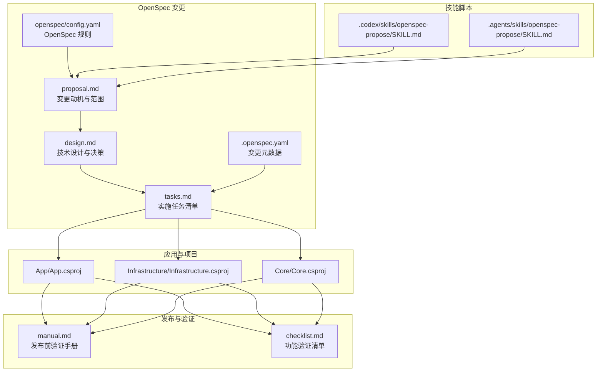
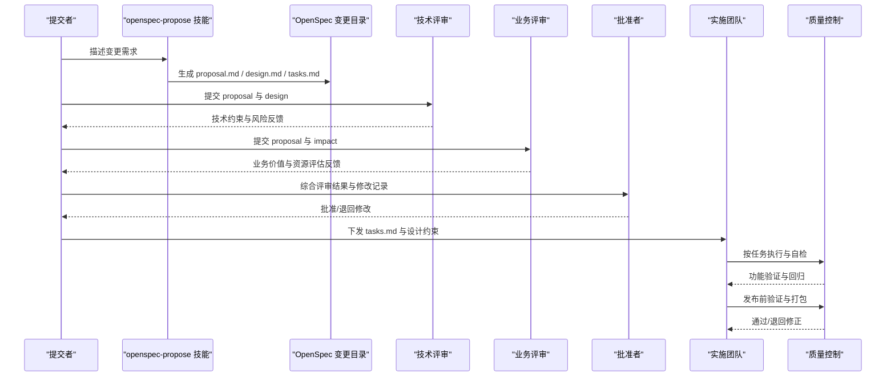
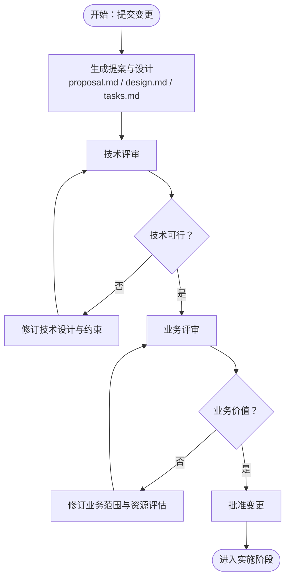
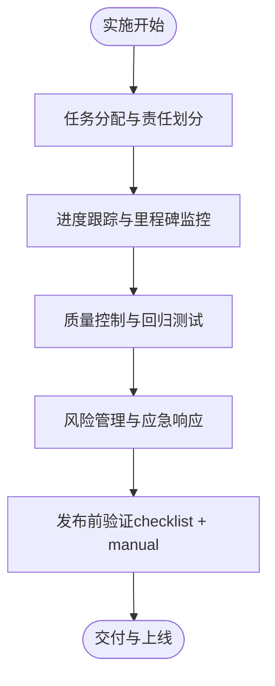
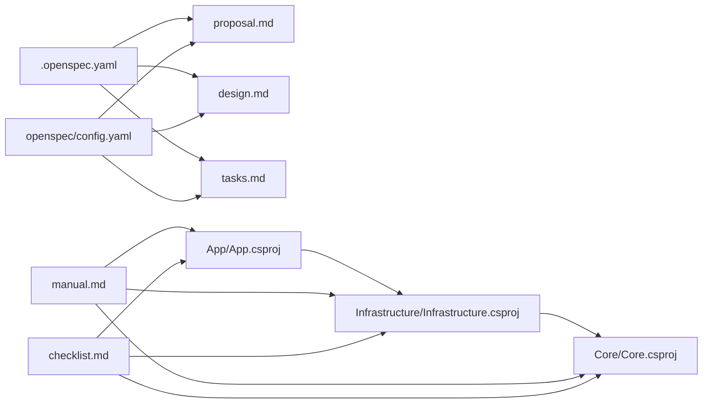
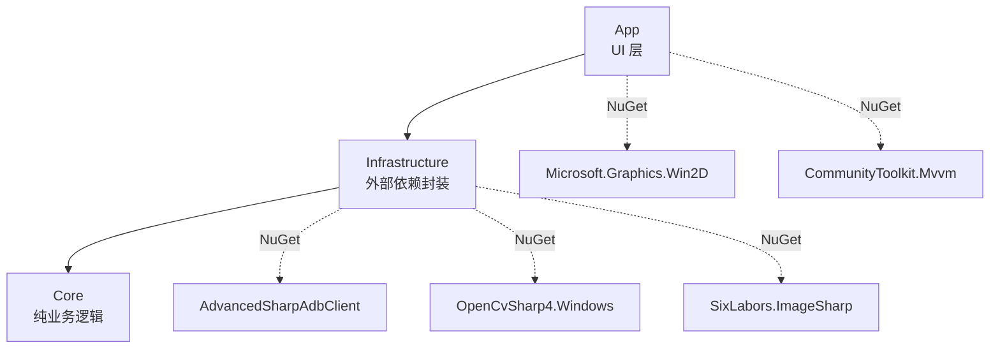

# 审批与实施流程

<cite>
**本文引用的文件**
- [openspec/config.yaml](file://openspec/config.yaml)
- [openspec/changes/winui3-visual-dev-toolkit/.openspec.yaml](file://openspec/changes/winui3-visual-dev-toolkit/.openspec.yaml)
- [openspec/changes/winui3-visual-dev-toolkit/proposal.md](file://openspec/changes/winui3-visual-dev-toolkit/proposal.md)
- [openspec/changes/winui3-visual-dev-toolkit/design.md](file://openspec/changes/winui3-visual-dev-toolkit/design.md)
- [openspec/changes/winui3-visual-dev-toolkit/tasks.md](file://openspec/changes/winui3-visual-dev-toolkit/tasks.md)
- [.codex/skills/openspec-propose/SKILL.md](file://.codex/skills/openspec-propose/SKILL.md)
- [.agents/skills/openspec-propose/SKILL.md](file://.agents/skills/openspec-propose/SKILL.md)
- [manual.md](file://manual.md)
- [checklist.md](file://checklist.md)
- [App/App.csproj](file://App/App.csproj)
- [Core/Core.csproj](file://Core/Core.csproj)
- [Infrastructure/Infrastructure.csproj](file://Infrastructure/Infrastructure.csproj)
</cite>

## 目录
1. [引言](#引言)
2. [项目结构](#项目结构)
3. [核心组件](#核心组件)
4. [架构总览](#架构总览)
5. [详细组件分析](#详细组件分析)
6. [依赖分析](#依赖分析)
7. [性能考虑](#性能考虑)
8. [故障排除指南](#故障排除指南)
9. [结论](#结论)
10. [附录](#附录)

## 引言
本文件面向 AutoJS6 开发工具的 OpenSpec 审批与实施流程，系统化梳理从提案、评审、修改到批准与实施的全过程，结合项目现有的 OpenSpec 文档与技能脚本，明确各环节的要求、时限与验收标准，并提供实施阶段的任务分配、进度跟踪、质量控制与风险管理方法，以及版本控制与变更管理策略，确保 OpenSpec 的有效执行与持续改进。

## 项目结构
AutoJS6 开发工具采用三层架构（App → Infrastructure → Core），配合 OpenSpec 变更管理与 GitHub Actions 发布流水线，形成“设计—实施—验证—发布”的闭环。OpenSpec 变更位于 openspec/changes/winui3-visual-dev-toolkit 目录，配套技能脚本位于 .codex/skills/openspec-propose 与 .agents/skills/openspec-propose，发布与验证由 manual.md 与 checklist.md 提供流程规范。

**图表来源**
- [openspec/changes/winui3-visual-dev-toolkit/proposal.md:1-70](file://openspec/changes/winui3-visual-dev-toolkit/proposal.md#L1-L70)
- [openspec/changes/winui3-visual-dev-toolkit/design.md:1-153](file://openspec/changes/winui3-visual-dev-toolkit/design.md#L1-L153)
- [openspec/changes/winui3-visual-dev-toolkit/tasks.md:1-260](file://openspec/changes/winui3-visual-dev-toolkit/tasks.md#L1-L260)
- [openspec/changes/winui3-visual-dev-toolkit/.openspec.yaml:1-3](file://openspec/changes/winui3-visual-dev-toolkit/.openspec.yaml#L1-L3)
- [openspec/config.yaml:1-21](file://openspec/config.yaml#L1-L21)
- [.codex/skills/openspec-propose/SKILL.md:1-111](file://.codex/skills/openspec-propose/SKILL.md#L1-L111)
- [.agents/skills/openspec-propose/SKILL.md:1-111](file://.agents/skills/openspec-propose/SKILL.md#L1-L111)
- [App/App.csproj:1-84](file://App/App.csproj#L1-L84)
- [Infrastructure/Infrastructure.csproj:1-19](file://Infrastructure/Infrastructure.csproj#L1-L19)
- [Core/Core.csproj:1-10](file://Core/Core.csproj#L1-L10)
- [manual.md:1-522](file://manual.md#L1-L522)
- [checklist.md:1-186](file://checklist.md#L1-L186)

**章节来源**
- [openspec/config.yaml:1-21](file://openspec/config.yaml#L1-L21)
- [openspec/changes/winui3-visual-dev-toolkit/.openspec.yaml:1-3](file://openspec/changes/winui3-visual-dev-toolkit/.openspec.yaml#L1-L3)
- [openspec/changes/winui3-visual-dev-toolkit/proposal.md:1-70](file://openspec/changes/winui3-visual-dev-toolkit/proposal.md#L1-L70)
- [openspec/changes/winui3-visual-dev-toolkit/design.md:1-153](file://openspec/changes/winui3-visual-dev-toolkit/design.md#L1-L153)
- [openspec/changes/winui3-visual-dev-toolkit/tasks.md:1-260](file://openspec/changes/winui3-visual-dev-toolkit/tasks.md#L1-L260)
- [.codex/skills/openspec-propose/SKILL.md:1-111](file://.codex/skills/openspec-propose/SKILL.md#L1-L111)
- [.agents/skills/openspec-propose/SKILL.md:1-111](file://.agents/skills/openspec-propose/SKILL.md#L1-L111)
- [App/App.csproj:1-84](file://App/App.csproj#L1-L84)
- [Infrastructure/Infrastructure.csproj:1-19](file://Infrastructure/Infrastructure.csproj#L1-L19)
- [Core/Core.csproj:1-10](file://Core/Core.csproj#L1-L10)
- [manual.md:1-522](file://manual.md#L1-L522)
- [checklist.md:1-186](file://checklist.md#L1-L186)

## 核心组件
- OpenSpec 变更文档：包含变更动机（Why）、范围（What Changes）、能力与影响（Capabilities/Impact）、前置分析与冲突处理原则等，用于技术评审与业务评估。
- 设计与决策文档：明确技术约束、目标与非目标、关键决策及其替代方案、权衡与风险缓解措施，支撑实施阶段的架构与实现。
- 实施任务清单：将设计转化为可执行的任务，覆盖项目结构、接口与实现、UI 与交互、测试与验证、性能与错误处理、文档与部署等。
- 技能脚本：提供 OpenSpec 提案的自动化生成与应用流程，规范 artifact 的创建顺序与依赖关系。
- 项目与依赖：App（UI 层）、Infrastructure（外部依赖封装）、Core（纯业务逻辑）三层结构，配合 NuGet 依赖与 MSIX 打包。
- 发布与验证：manual.md 提供 GitHub Actions 发版前验证手册，checklist.md 提供功能验证清单，二者共同构成质量控制与风险管理的基础。

**章节来源**
- [openspec/changes/winui3-visual-dev-toolkit/proposal.md:1-70](file://openspec/changes/winui3-visual-dev-toolkit/proposal.md#L1-L70)
- [openspec/changes/winui3-visual-dev-toolkit/design.md:1-153](file://openspec/changes/winui3-visual-dev-toolkit/design.md#L1-L153)
- [openspec/changes/winui3-visual-dev-toolkit/tasks.md:1-260](file://openspec/changes/winui3-visual-dev-toolkit/tasks.md#L1-L260)
- [.codex/skills/openspec-propose/SKILL.md:1-111](file://.codex/skills/openspec-propose/SKILL.md#L1-L111)
- [.agents/skills/openspec-propose/SKILL.md:1-111](file://.agents/skills/openspec-propose/SKILL.md#L1-L111)
- [App/App.csproj:1-84](file://App/App.csproj#L1-L84)
- [Infrastructure/Infrastructure.csproj:1-19](file://Infrastructure/Infrastructure.csproj#L1-L19)
- [Core/Core.csproj:1-10](file://Core/Core.csproj#L1-L10)
- [manual.md:1-522](file://manual.md#L1-L522)
- [checklist.md:1-186](file://checklist.md#L1-L186)

## 架构总览
OpenSpec 审批与实施流程围绕“变更提案—技术设计—实施任务—质量验证—发布上线”展开，形成闭环管理。OpenSpec 文档与技能脚本确保提案与设计的质量与一致性；三层项目结构与依赖关系保障实施的可维护性与可测试性；manual.md 与 checklist.md 为发布前验证与功能验证提供标准流程。

**图表来源**
- [.codex/skills/openspec-propose/SKILL.md:25-86](file://.codex/skills/openspec-propose/SKILL.md#L25-L86)
- [openspec/changes/winui3-visual-dev-toolkit/proposal.md:1-70](file://openspec/changes/winui3-visual-dev-toolkit/proposal.md#L1-L70)
- [openspec/changes/winui3-visual-dev-toolkit/design.md:1-153](file://openspec/changes/winui3-visual-dev-toolkit/design.md#L1-L153)
- [openspec/changes/winui3-visual-dev-toolkit/tasks.md:1-260](file://openspec/changes/winui3-visual-dev-toolkit/tasks.md#L1-L260)
- [manual.md:1-522](file://manual.md#L1-L522)
- [checklist.md:1-186](file://checklist.md#L1-L186)

## 详细组件分析

### OpenSpec 提案与审批流程
- 提交：通过 openspec-propose 技能生成 proposal.md、design.md、tasks.md，明确变更动机、范围、能力与影响、技术约束与决策、实施任务与里程碑。
- 评审：
  - 技术评审：聚焦 API 约束、架构原则、性能与风险缓解、依赖与兼容性。
  - 业务评审：聚焦受益项目、ROI、资源投入与交付价值。
- 修改：根据评审反馈修订 proposal 与 design，必要时补充 tasks 与设计约束。
- 批准：综合技术与业务评估，批准变更进入实施阶段。

**图表来源**
- [.codex/skills/openspec-propose/SKILL.md:25-86](file://.codex/skills/openspec-propose/SKILL.md#L25-L86)
- [openspec/changes/winui3-visual-dev-toolkit/proposal.md:1-70](file://openspec/changes/winui3-visual-dev-toolkit/proposal.md#L1-L70)
- [openspec/changes/winui3-visual-dev-toolkit/design.md:1-153](file://openspec/changes/winui3-visual-dev-toolkit/design.md#L1-L153)

**章节来源**
- [.codex/skills/openspec-propose/SKILL.md:1-111](file://.codex/skills/openspec-propose/SKILL.md#L1-L111)
- [.agents/skills/openspec-propose/SKILL.md:1-111](file://.agents/skills/openspec-propose/SKILL.md#L1-L111)
- [openspec/changes/winui3-visual-dev-toolkit/proposal.md:1-70](file://openspec/changes/winui3-visual-dev-toolkit/proposal.md#L1-L70)
- [openspec/changes/winui3-visual-dev-toolkit/design.md:1-153](file://openspec/changes/winui3-visual-dev-toolkit/design.md#L1-L153)

### 实施流程管理
- 任务分配：依据 tasks.md 的任务分类与依赖关系，将任务分解到 Core、Infrastructure、App 三层，明确负责人与里程碑。
- 进度跟踪：以任务完成状态（如“已实现/待实现/已验证”）为度量，定期回顾与更新。
- 质量控制：结合 checklist.md 的 P0/P1 项与 manual.md 的发布前验证，确保功能闭环与发布质量。
- 风险管理：针对 ADB 连接、OpenCV 匹配、UI 树解析、渲染性能等风险制定缓解措施与应急预案。

**图表来源**
- [openspec/changes/winui3-visual-dev-toolkit/tasks.md:1-260](file://openspec/changes/winui3-visual-dev-toolkit/tasks.md#L1-L260)
- [checklist.md:1-186](file://checklist.md#L1-L186)
- [manual.md:1-522](file://manual.md#L1-L522)

**章节来源**
- [openspec/changes/winui3-visual-dev-toolkit/tasks.md:1-260](file://openspec/changes/winui3-visual-dev-toolkit/tasks.md#L1-L260)
- [checklist.md:1-186](file://checklist.md#L1-L186)
- [manual.md:1-522](file://manual.md#L1-L522)

### 审批决策标准与依据
- 技术评审：API 约束优先（如 AutoJS6 API、Rhino 引擎限制、坐标系统约定）、双引擎独立架构、分层渲染管线、异步与内存优化、依赖关系与兼容性。
- 业务评估：受益项目（yxs-day-task）、业务逻辑一致性、ROI 与资源投入。
- 资源评估：技术栈锁定（C# 12 / .NET 8 / WinUI 3 / Win2D / OpenCvSharp4 / SharpAdbClient）、外部工具与环境要求（ADB 配置）。

**章节来源**
- [openspec/changes/winui3-visual-dev-toolkit/proposal.md:38-70](file://openspec/changes/winui3-visual-dev-toolkit/proposal.md#L38-L70)
- [openspec/changes/winui3-visual-dev-toolkit/design.md:16-28](file://openspec/changes/winui3-visual-dev-toolkit/design.md#L16-L28)
- [openspec/changes/winui3-visual-dev-toolkit/tasks.md:38-47](file://openspec/changes/winui3-visual-dev-toolkit/tasks.md#L38-L47)

### 版本控制与变更管理策略
- OpenSpec 元数据：.openspec.yaml 记录变更元信息（如 schema、创建时间），便于追踪与审计。
- OpenSpec 规则：openspec/config.yaml 支持为特定 artifact 设置规则（如字数限制、必须包含的章节），统一文档风格与完整性。
- 项目依赖：App → Infrastructure → Core 的单向依赖关系，Core 为纯类库，便于独立测试与演进。
- 发布与验证：manual.md 规范 GitHub Actions 发版前验证流程，checklist.md 明确功能验证标准，二者共同确保变更的稳定交付。

**图表来源**
- [openspec/changes/winui3-visual-dev-toolkit/.openspec.yaml:1-3](file://openspec/changes/winui3-visual-dev-toolkit/.openspec.yaml#L1-L3)
- [openspec/config.yaml:1-21](file://openspec/config.yaml#L1-L21)
- [App/App.csproj:67-68](file://App/App.csproj#L67-L68)
- [Infrastructure/Infrastructure.csproj:9-11](file://Infrastructure/Infrastructure.csproj#L9-L11)
- [manual.md:1-522](file://manual.md#L1-L522)
- [checklist.md:1-186](file://checklist.md#L1-L186)

**章节来源**
- [openspec/changes/winui3-visual-dev-toolkit/.openspec.yaml:1-3](file://openspec/changes/winui3-visual-dev-toolkit/.openspec.yaml#L1-L3)
- [openspec/config.yaml:1-21](file://openspec/config.yaml#L1-L21)
- [App/App.csproj:1-84](file://App/App.csproj#L1-L84)
- [Infrastructure/Infrastructure.csproj:1-19](file://Infrastructure/Infrastructure.csproj#L1-L19)
- [Core/Core.csproj:1-10](file://Core/Core.csproj#L1-L10)
- [manual.md:1-522](file://manual.md#L1-L522)
- [checklist.md:1-186](file://checklist.md#L1-L186)

## 依赖分析
- 组件耦合与内聚：App 仅负责 UI 与 MVVM，Core 为纯业务逻辑，Infrastructure 封装外部依赖，三层职责清晰，内聚度高、耦合度低。
- 直接与间接依赖：App 依赖 Infrastructure，Infrastructure 依赖 Core；NuGet 依赖集中在 Infrastructure（ADB、OpenCV、ImageSharp）与 App（Win2D、CommunityToolkit.Mvvm）。
- 外部依赖与集成点：ADB（AdvancedSharpAdbClient）、OpenCV（OpenCvSharp4）、图像处理（SixLabors.ImageSharp）、WinUI 3 与 Win2D、MSIX 打包与发布。

**图表来源**
- [App/App.csproj:60-68](file://App/App.csproj#L60-L68)
- [Infrastructure/Infrastructure.csproj:9-17](file://Infrastructure/Infrastructure.csproj#L9-L17)
- [Core/Core.csproj:1-10](file://Core/Core.csproj#L1-L10)

**章节来源**
- [App/App.csproj:1-84](file://App/App.csproj#L1-L84)
- [Infrastructure/Infrastructure.csproj:1-19](file://Infrastructure/Infrastructure.csproj#L1-L19)
- [Core/Core.csproj:1-10](file://Core/Core.csproj#L1-L10)

## 性能考虑
- 异步与非阻塞：所有 ADB 操作与 OpenCV 计算采用异步与后台线程，避免 UI 冻结。
- 分层渲染与缓存：Win2D 分层渲染（图像层与覆盖层），CanvasBitmap 缓存池减少纹理重复创建。
- 性能目标：60FPS 渲染、5000+ 节点控件树、异步非阻塞 UI。
- 优化策略：图像降采样、阈值滑动仅重算匹配层、虚拟化与懒加载、取消令牌超时控制。

**章节来源**
- [openspec/changes/winui3-visual-dev-toolkit/design.md:109-119](file://openspec/changes/winui3-visual-dev-toolkit/design.md#L109-L119)
- [openspec/changes/winui3-visual-dev-toolkit/tasks.md:214-225](file://openspec/changes/winui3-visual-dev-toolkit/tasks.md#L214-L225)

## 故障排除指南
- ADB 连接不稳定：实现重试机制（最多 3 次）、超时控制（5 秒）、异常捕获与 Toast 提示。
- OpenCV 匹配误报/漏报：提供阈值滑块（0.50~0.95）实时调节、置信度数值标注、多模板匹配。
- UI 树解析失败：容错解析器（跳过无效节点）、日志记录、原始 Dump 文本查看面板。
- 渲染性能不足：图像降采样（最大 1920x1080）、分层渲染仅重绘变化图层、GPU 加速。
- 生成代码一致性：严格复用现有脚本的坐标计算/匹配算法/路径处理逻辑，提供代码预览与手动编辑。

**章节来源**
- [openspec/changes/winui3-visual-dev-toolkit/design.md:131-153](file://openspec/changes/winui3-visual-dev-toolkit/design.md#L131-L153)
- [openspec/changes/winui3-visual-dev-toolkit/tasks.md:226-236](file://openspec/changes/winui3-visual-dev-toolkit/tasks.md#L226-L236)

## 结论
AutoJS6 开发工具的 OpenSpec 审批与实施流程以 OpenSpec 文档与技能脚本为入口，以三层架构与发布验证为保障，实现了从技术评审、业务评估到质量控制与发布的闭环管理。通过明确的决策标准、严格的变更管理与风险控制，确保 OpenSpec 的有效执行与持续改进，为 AutoJS6 生态的可视化开发工具建设提供坚实基础。

## 附录
- 审批与实施流程的关键参考路径：
  - 提案与设计：[proposal.md:1-70](file://openspec/changes/winui3-visual-dev-toolkit/proposal.md#L1-L70)、[design.md:1-153](file://openspec/changes/winui3-visual-dev-toolkit/design.md#L1-L153)
  - 实施任务：[tasks.md:1-260](file://openspec/changes/winui3-visual-dev-toolkit/tasks.md#L1-L260)
  - 技能脚本：[openspec-propose 技能（.codex）:1-111](file://.codex/skills/openspec-propose/SKILL.md#L1-L111)、[openspec-propose 技能（.agents）:1-111](file://.agents/skills/openspec-propose/SKILL.md#L1-L111)
  - 发布与验证：[manual.md:1-522](file://manual.md#L1-L522)、[checklist.md:1-186](file://checklist.md#L1-L186)
  - 项目与依赖：[App/App.csproj:1-84](file://App/App.csproj#L1-L84)、[Infrastructure/Infrastructure.csproj:1-19](file://Infrastructure/Infrastructure.csproj#L1-L19)、[Core/Core.csproj:1-10](file://Core/Core.csproj#L1-L10)