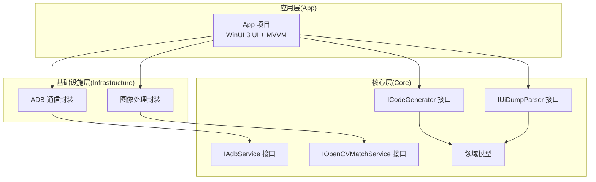
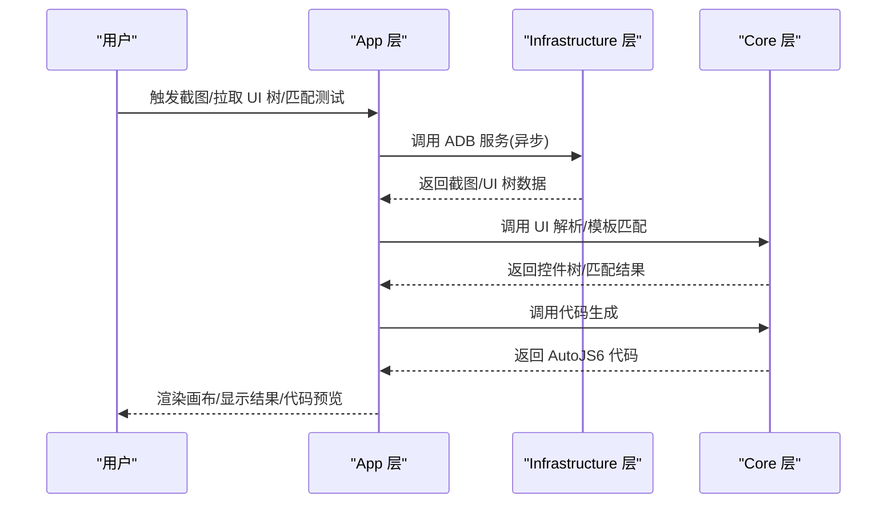
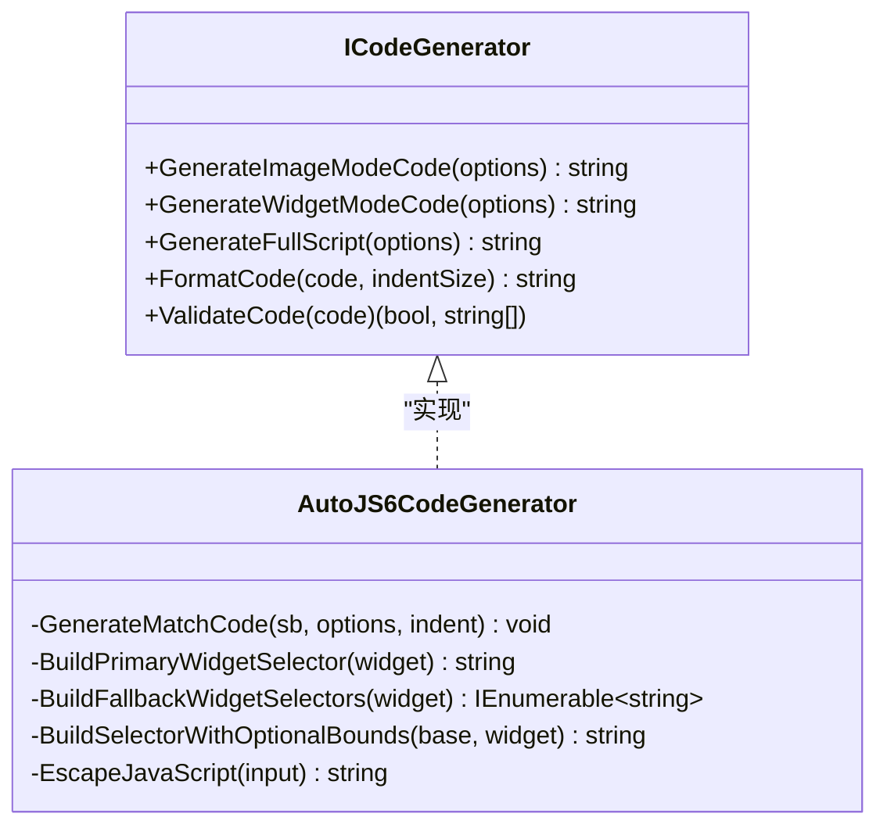
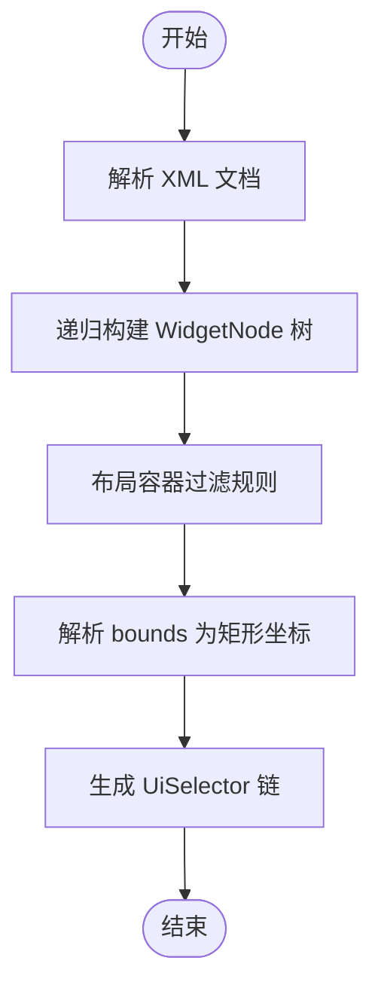
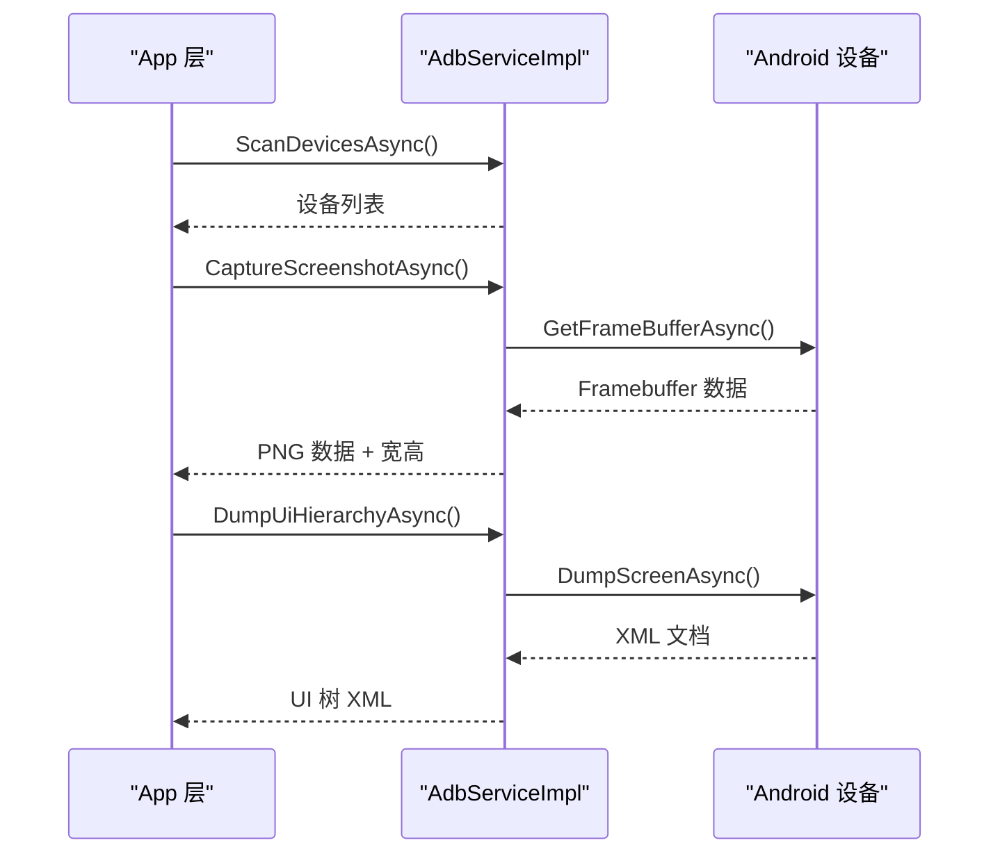
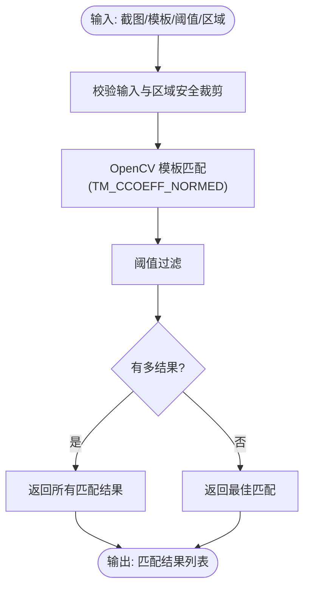
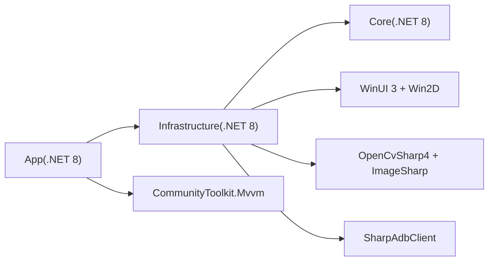

# 技术要求与规范

<cite>
**本文引用的文件**
- [proposal.md](file://openspec/changes/winui3-visual-dev-toolkit/proposal.md)
- [design.md](file://openspec/changes/winui3-visual-dev-toolkit/design.md)
- [tasks.md](file://openspec/changes/winui3-visual-dev-toolkit/tasks.md)
- [spec.md](file://openspec/changes/winui3-visual-dev-toolkit/specs/autojs6-code-generator/spec.md)
- [.openspec.yaml](file://openspec/changes/winui3-visual-dev-toolkit/.openspec.yaml)
- [README.md](file://README.md)
- [DEVELOPMENT.md](file://DEVELOPMENT.md)
- [checklist.md](file://checklist.md)
- [AutoJS6CodeGenerator.cs](file://Core/Services/AutoJS6CodeGenerator.cs)
- [UiDumpParser.cs](file://Core/Services/UiDumpParser.cs)
- [AdbServiceImpl.cs](file://Infrastructure/Adb/AdbServiceImpl.cs)
- [OpenCVMatchServiceImpl.cs](file://Infrastructure/Imaging/OpenCVMatchServiceImpl.cs)
- [WidgetNode.cs](file://Core/Models/WidgetNode.cs)
- [Core.csproj](file://Core/Core.csproj)
</cite>

## 目录
1. [引言](#引言)
2. [项目结构](#项目结构)
3. [核心组件](#核心组件)
4. [架构总览](#架构总览)
5. [详细组件分析](#详细组件分析)
6. [依赖分析](#依赖分析)
7. [性能考虑](#性能考虑)
8. [故障排查指南](#故障排查指南)
9. [结论](#结论)
10. [附录](#附录)

## 引言
本文件面向 AutoJS6 开发工具的 OpenSpec 技术提案，系统化阐述技术标准与质量要求，覆盖设计文档完整性、任务分解合理性、实现方案可行性评估，并制定代码规范、架构要求、性能指标、安全标准等评审关键要素。同时提供技术债务管理、重构策略与演进路线图的实施指引，确保提案具备可执行性与可维护性。

## 项目结构
AutoJS6 可视化开发工具采用分层架构，分为三层：
- App 层：WinUI 3 桌面应用，负责 UI 与 MVVM，不直接依赖外部库
- Infrastructure 层：外部依赖适配层，封装 ADB、图像处理等
- Core 层：纯业务逻辑层，独立可测试，不含 UI 依赖

项目层依赖关系为单向：App → Infrastructure → Core ← Infrastructure；Core 为核心纯类库，无项目内部依赖。

图表来源
- [README.md: 项目结构与架构原则:230-288](file://README.md#L230-L288)
- [Core.csproj: Core 项目配置:1-10](file://Core/Core.csproj#L1-L10)

章节来源
- [README.md: 项目结构与架构原则:230-288](file://README.md#L230-L288)
- [Core.csproj: Core 项目配置:1-10](file://Core/Core.csproj#L1-L10)

## 核心组件
- 设计文档完整性
  - 前置分析报告优先级明确：PHASE0_REFERENCE.md（API 定义层）优先于 PHASE0_ANALYSIS.md（业务实现层），冲突以 API 约束为准
  - 实施建议：先读权威参考，再读业务分析，最后按约束实施
- 任务分解合理性
  - 任务 0.1-0.11 完成前置分析与 MVP 验证，确保技术栈与核心流程验证通过
  - 任务 1-260 按阶段推进：环境与依赖、模型与接口、实现与 UI、测试与验证、文档与发布
- 实现方案可行性
  - 双引擎独立架构：图像处理引擎与 UI 分析引擎完全解耦，数据源、处理管线、渲染逻辑与代码生成路径严禁耦合
  - 异步架构与内存优化：所有 I/O 操作异步，Win2D CanvasBitmap 缓存池，UI 树虚拟化与懒加载
  - 性能指标：60FPS 渲染、5000+ 节点控件树、异步非阻塞 UI

章节来源
- [proposal.md: 前置分析与冲突处理原则:44-70](file://openspec/changes/winui3-visual-dev-toolkit/proposal.md#L44-L70)
- [design.md: 双引擎独立、分层渲染、坐标系对齐、异步架构:30-153](file://openspec/changes/winui3-visual-dev-toolkit/design.md#L30-L153)
- [tasks.md: 前置准备与 260 项任务:1-260](file://openspec/changes/winui3-visual-dev-toolkit/tasks.md#L1-L260)

## 架构总览
系统采用 Clean Architecture 分层与双引擎并行架构：
- 图像引擎：基于像素/位图（PNG 截图 + OpenCV），输出绝对像素坐标
- UI 引擎：基于控件树（uiautomator dump + XML 解析），输出 UiSelector 选择器链
- 代码生成：图像模式与控件模式双路径，严格遵循 AutoJS6 API 约束

图表来源
- [AdbServiceImpl.cs: ADB 异步接口:51-138](file://Infrastructure/Adb/AdbServiceImpl.cs#L51-L138)
- [UiDumpParser.cs: UI 解析接口:14-35](file://Core/Services/UiDumpParser.cs#L14-L35)
- [OpenCVMatchServiceImpl.cs: 模板匹配接口:13-60](file://Infrastructure/Imaging/OpenCVMatchServiceImpl.cs#L13-L60)
- [AutoJS6CodeGenerator.cs: 代码生成接口:13-102](file://Core/Services/AutoJS6CodeGenerator.cs#L13-L102)

章节来源
- [design.md: 双引擎独立与分层渲染:53-129](file://openspec/changes/winui3-visual-dev-toolkit/design.md#L53-L129)
- [README.md: 架构原则与技术栈:264-300](file://README.md#L264-L300)

## 详细组件分析

### 组件 A：AutoJS6 代码生成器
- 功能要点
  - 图像模式：生成 requestScreenCapture + images.read + images.findImage + click 代码，支持阈值、区域、重试、超时、回收
  - 控件模式：生成 UiSelector 链（优先 id，降级 text/desc，补充 boundsInside），支持重试与点击
  - 代码格式化与校验：遵循 Rhino 引擎循环体内禁止 const/let 的约束
- 质量要求
  - 严格复用现有 cmd 脚本的坐标计算、匹配算法、路径处理逻辑
  - 生成代码与现有行为一致，支持预览、手动编辑、一键复制、导出

图表来源
- [AutoJS6CodeGenerator.cs: 代码生成器实现:11-357](file://Core/Services/AutoJS6CodeGenerator.cs#L11-L357)

章节来源
- [spec.md: 代码生成需求与场景:1-136](file://openspec/changes/winui3-visual-dev-toolkit/specs/autojs6-code-generator/spec.md#L1-L136)
- [AutoJS6CodeGenerator.cs: 图像/控件模式生成逻辑:13-164](file://Core/Services/AutoJS6CodeGenerator.cs#L13-L164)

### 组件 B：UI 树解析器
- 功能要点
  - 解析 uiautomator dump XML，构建 WidgetNode 树
  - 布局容器过滤规则：class 包含 Layout 且无 clickable/text/content-desc → 跳过
  - 坐标解析：bounds "[x1,y1][x2,y2]" → Rect(x1, y1, x2-x1, y2-y1)，直接匹配 Framebuffer
  - 选择器生成：优先 resource-id，降级 text/desc，补充 boundsInside
- 质量要求
  - 容错解析：跳过无效节点、记录警告日志
  - 坐标系统一致性：无需旋转转换，直接使用实际宽高

图表来源
- [UiDumpParser.cs: UI 解析与过滤:14-197](file://Core/Services/UiDumpParser.cs#L14-L197)
- [WidgetNode.cs: 控件节点模型:6-92](file://Core/Models/WidgetNode.cs#L6-L92)

章节来源
- [design.md: 布局容器过滤与坐标系对齐:75-96](file://openspec/changes/winui3-visual-dev-toolkit/design.md#L75-L96)
- [UiDumpParser.cs: 坐标解析与选择器生成:160-97](file://Core/Services/UiDumpParser.cs#L160-L97)

### 组件 C：ADB 服务实现
- 功能要点
  - 设备扫描：AdbClient.GetDevices
  - 截图拉取：GetFrameBufferAsync，处理 stride 行填充，转 PNG
  - UI 树拉取：DeviceClient.DumpScreenAsync
  - TCP/IP 连接与配对：Connect/Pare
- 质量要求
  - 禁止使用 ADB 命令，必须使用底层 API
  - 异步调用，支持 CancellationToken 超时控制
  - 类型安全：使用 uint 匹配原生类型，避免强制转换

图表来源
- [AdbServiceImpl.cs: ADB 服务实现:51-138](file://Infrastructure/Adb/AdbServiceImpl.cs#L51-L138)

章节来源
- [tasks.md: ADB 底层 API 强制原则:39-46](file://openspec/changes/winui3-visual-dev-toolkit/tasks.md#L39-L46)
- [AdbServiceImpl.cs: 截图与 UI 树拉取:72-138](file://Infrastructure/Adb/AdbServiceImpl.cs#L72-L138)

### 组件 D：OpenCV 模板匹配服务
- 功能要点
  - TM_CCOEFF_NORMED 算法封装，支持阈值过滤与多结果返回
  - 异步模板匹配（Task.Run 后台线程），支持区域限定
  - 相似度计算与模板有效性校验
- 质量要求
  - 匹配结果包含置信度、坐标、耗时、算法与阈值
  - 区域安全裁剪，避免越界

图表来源
- [OpenCVMatchServiceImpl.cs: 模板匹配实现:13-122](file://Infrastructure/Imaging/OpenCVMatchServiceImpl.cs#L13-L122)

章节来源
- [design.md: 异步架构与内存优化:109-119](file://openspec/changes/winui3-visual-dev-toolkit/design.md#L109-L119)
- [OpenCVMatchServiceImpl.cs: 匹配算法与多结果返回:62-122](file://Infrastructure/Imaging/OpenCVMatchServiceImpl.cs#L62-L122)

## 依赖分析
- 项目依赖关系
  - App → Infrastructure → Core，Core 为纯类库，无项目内部依赖
- 外部依赖
  - WinUI 3 + Win2D：GPU 加速画布渲染
  - OpenCvSharp4 + SixLabors.ImageSharp：图像处理与模板匹配
  - SharpAdbClient：ADB 底层通信
  - CommunityToolkit.Mvvm：MVVM 绑定与命令
- 技术约束
  - 禁止使用 ADB 命令，必须使用底层 API
  - 所有 I/O 操作异步，支持 CancellationToken
  - 类型安全优先，使用 uint 匹配原生类型

图表来源
- [README.md: 技术栈与架构:290-300](file://README.md#L290-L300)
- [Core.csproj: TargetFramework](file://Core/Core.csproj#L3)

章节来源
- [README.md: 技术栈与架构:290-300](file://README.md#L290-L300)
- [Core.csproj: 项目配置:1-10](file://Core/Core.csproj#L1-L10)

## 性能考虑
- 渲染性能
  - Win2D 双图层架构：底层位图与上层 Overlay 分离，仅重绘变化层
  - CanvasBitmap 缓存池：避免重复创建纹理
  - 60FPS 目标：缩放/平移/旋转交互流畅，阈值滑动仅重算匹配层
- 计算性能
  - OpenCV 匹配后台线程计算（Task.Run），避免 UI 阻塞
  - 区域限定匹配，减少搜索空间
- 内存优化
  - 单次迭代仅一次截图，避免重复 captureScreen()
  - 模板图像及时 recycle()
  - UI 树虚拟化与懒加载，减少内存占用
- 网络与 I/O
  - ADB 操作异步，支持超时与重试
  - 图像降采样（最大 1920x1080），提升大图渲染性能

章节来源
- [design.md: 分层渲染与异步架构:64-119](file://openspec/changes/winui3-visual-dev-toolkit/design.md#L64-L119)
- [README.md: 性能与优化建议:184-227](file://README.md#L184-L227)

## 故障排查指南
- ADB 连接不稳定
  - 现象：截图/Dump 拉取失败
  - 处理：重试机制（最多 3 次），超时 5 秒，Toast 提示检查设备连接
- OpenCV 匹配误报/漏报
  - 现象：阈值不合适导致误报或漏报
  - 处理：提供阈值滑块（0.50~0.95）实时调节，画布绘制置信度数值，支持多模板匹配
- UI 树解析失败
  - 现象：XML 格式异常/节点缺失
  - 处理：容错解析器（跳过无效节点），日志记录解析错误，提供原始 Dump 文本查看面板
- Win2D 渲染性能不足
  - 现象：大图/高分辨率设备渲染卡顿
  - 处理：图像降采样（最大 1920x1080），分层渲染仅重绘变化图层，启用 GPU 加速
- 生成代码与现有脚本行为不一致
  - 现象：生成代码不符合 AutoJS6 API 约束
  - 处理：严格复用现有脚本的坐标计算/匹配算法/路径处理逻辑，提供代码预览与手动编辑功能

章节来源
- [design.md: 风险与缓解措施:131-153](file://openspec/changes/winui3-visual-dev-toolkit/design.md#L131-L153)
- [tasks.md: 错误处理与日志:226-236](file://openspec/changes/winui3-visual-dev-toolkit/tasks.md#L226-L236)

## 结论
本 OpenSpec 提案围绕“双引擎独立、异步架构、分层渲染、API 约束”四大原则，系统化制定了设计文档完整性、任务分解合理性与实现方案可行性的评估标准。通过严格的代码规范、架构要求、性能指标与安全标准，结合技术债务管理与演进路线图，确保项目具备可执行性与可维护性，能够高效替代传统命令行工作流，提供可视化的 AutoJS6 开发体验。

## 附录
- 技术评审关键要素
  - 设计文档：前置分析报告优先级、API 约束与业务逻辑冲突处理
  - 任务分解：MVP 验证、阶段目标与里程碑、风险与缓解措施
  - 实现方案：双引擎独立、异步架构、性能指标、错误处理与日志
- 技术债务管理
  - 保持模块边界清晰，避免循环依赖
  - 逐步引入单元测试与 UI 测试，完善覆盖率
  - 持续优化渲染与匹配性能，减少内存占用
- 重构策略
  - 以接口为中心的重构：先抽象接口，再实现具体服务
  - 渐进式迁移：从命令行脚本逻辑逐步迁移到可视化工具
  - 代码格式化与静态分析：统一风格，减少历史遗留问题
- 演进路线图
  - v1：完成核心闭环（能装、能开、能连、能截、能裁、能测、能生码）
  - v2：增强交互体验（惯性滑动、边界阻尼、像素坐标拾取、辅助网格）
  - v3：扩展功能（批量模板测试、选择器验证、导出为 JS 文件）

章节来源
- [checklist.md: V1 验证清单:1-186](file://checklist.md#L1-L186)
- [DEVELOPMENT.md: 发布与回归策略:1-276](file://DEVELOPMENT.md#L1-L276)
- [.openspec.yaml: OpenSpec 规范元数据:1-3](file://openspec/changes/winui3-visual-dev-toolkit/.openspec.yaml#L1-L3)