# 提案编写指南

<cite>
**本文档引用的文件**
- [proposal.md](file://openspec/changes/winui3-visual-dev-toolkit/proposal.md)
- [design.md](file://openspec/changes/winui3-visual-dev-toolkit/design.md)
- [tasks.md](file://openspec/changes/winui3-visual-dev-toolkit/tasks.md)
- [.openspec.yaml](file://openspec/changes/winui3-visual-dev-toolkit/.openspec.yaml)
- [checklist.md](file://checklist.md)
- [manual.md](file://manual.md)
- [README.md](file://README.md)
- [README_zh_CN.md](file://README_zh_CN.md)
- [openspec-propose.md](file://.github/skills/openspec-propose/SKILL.md)
- [openspec-explore.md](file://.github/skills/openspec-explore/SKILL.md)
- [openspec-apply-change.md](file://.github/skills/openspec-apply-change/SKILL.md)
- [openspec-archive-change.md](file://.github/skills/openspec-archive-change/SKILL.md)
</cite>

## 目录
1. [简介](#简介)
2. [项目结构](#项目结构)
3. [核心组件](#核心组件)
4. [架构概览](#架构概览)
5. [详细组件分析](#详细组件分析)
6. [依赖分析](#依赖分析)
7. [性能考虑](#性能考虑)
8. [故障排除指南](#故障排除指南)
9. [结论](#结论)
10. [附录](#附录)

## 简介

AutoJS6 开发工具是一个专为 AutoJS6 脚本开发者设计的可视化开发工具包。该项目提供了完整的 OpenSpec 提案编写流程，包括提案准备、需求收集、分析方法、标准格式和结构要求等。

该项目的核心目标是解决 AutoJS6 脚本开发中的痛点问题：
- 模板匹配调试效率低下
- 坐标拾取依赖手动猜测
- 多设备分辨率适配困难
- 代码生成繁琐且容易出错

通过构建 Windows 原生可视化开发工具包，该工具实现了像素级图像处理与控件级 UI 图层分析的双引擎并行能力，彻底改变了传统的命令行脚本工作流。

## 项目结构

AutoJS6 开发工具采用 Clean Architecture 设计模式，具有清晰的分层结构：

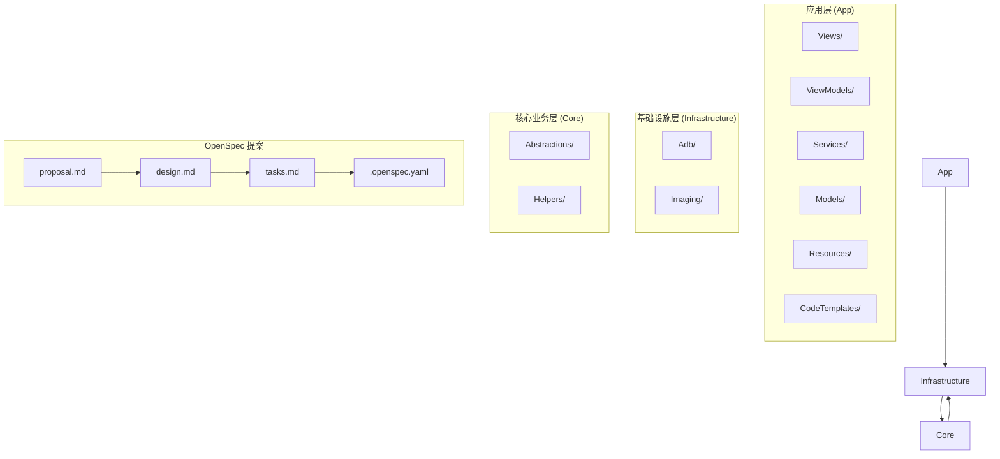

**图表来源**
- [README.md:230-260](file://README.md#L230-L260)
- [design.md:120-130](file://openspec/changes/winui3-visual-dev-toolkit/design.md#L120-L130)

**章节来源**
- [README.md:230-288](file://README.md#L230-L288)
- [design.md:120-130](file://openspec/changes/winui3-visual-dev-toolkit/design.md#L120-L130)

## 核心组件

### 双引擎架构设计

AutoJS6 开发工具采用了严格的双引擎独立架构，确保图像处理和 UI 分析的完全解耦：

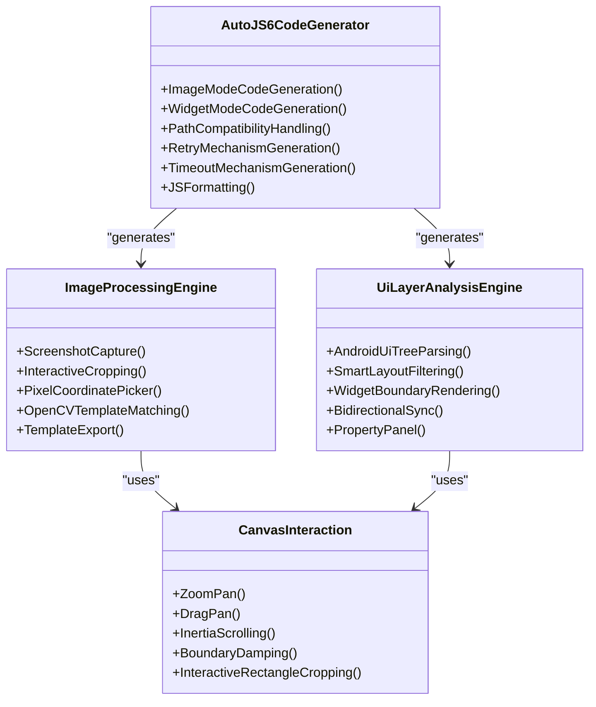

**图表来源**
- [proposal.md:16-28](file://openspec/changes/winui3-visual-dev-toolkit/proposal.md#L16-L28)
- [design.md:53-108](file://openspec/changes/winui3-visual-dev-toolkit/design.md#L53-L108)

### 技术栈与依赖

项目采用现代化的技术栈，确保高性能和良好的用户体验：

| 组件 | 技术 | 用途 |
|------|------|------|
| UI 框架 | WinUI 3 + Windows App SDK 1.5+ | 原生 Windows 桌面 UI |
| 渲染 | Microsoft.Graphics.Win2D | 60 FPS GPU 加速画布 |
| 图像处理 | OpenCvSharp4.Windows + SixLabors.ImageSharp | 模板匹配与图像处理 |
| ADB 通信 | SharpAdbClient | Android 设备控制 |
| MVVM | CommunityToolkit.Mvvm | 视图模型绑定与命令 |
| 架构 | Clean Architecture | 分层关注点分离 |

**章节来源**
- [README.md:290-300](file://README.md#L290-L300)
- [design.md:30-35](file://openspec/changes/winui3-visual-dev-toolkit/design.md#L30-L35)

## 架构概览

### 单向依赖关系

项目遵循严格的单向依赖原则，确保模块间的清晰边界：

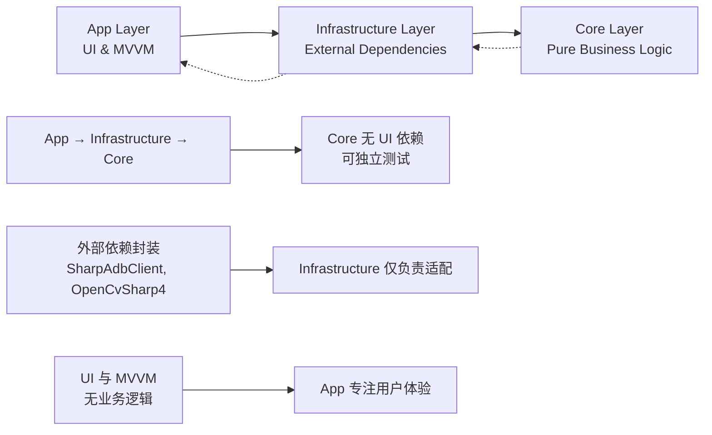

**图表来源**
- [design.md:272-281](file://openspec/changes/winui3-visual-dev-toolkit/design.md#L272-L281)

### 异步优先架构

所有 I/O 操作都采用异步模式，确保 UI 线程永不阻塞：

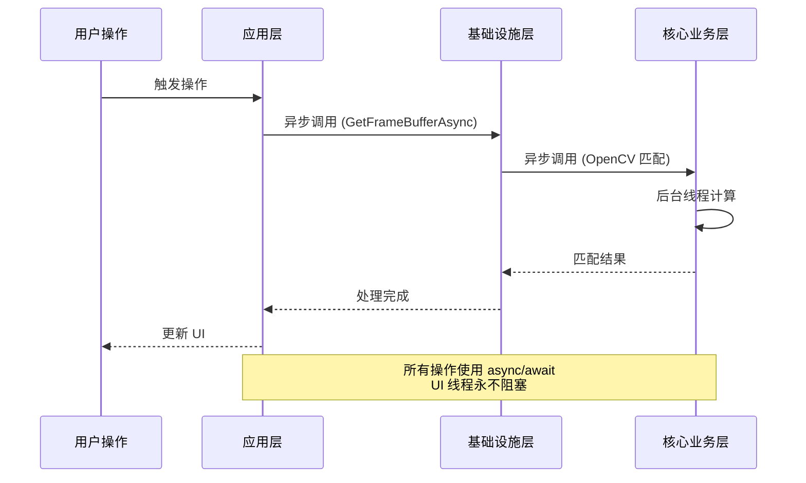

**图表来源**
- [design.md:282-287](file://openspec/changes/winui3-visual-dev-toolkit/design.md#L282-L287)

**章节来源**
- [design.md:272-287](file://openspec/changes/winui3-visual-dev-toolkit/design.md#L272-L287)

## 详细组件分析

### 提案准备阶段

#### 需求收集与分析

在提案准备阶段，需要完成以下关键任务：

1. **现有项目理解**：深入分析 AutoJS6 自动化项目 项目的业务逻辑和现有脚本实现
2. **AutoJS6 生态研究**：查阅官方文档和源码，理解 API 约束和技术限制
3. **MVP 验证**：通过 MVP 项目验证核心技术栈的可行性

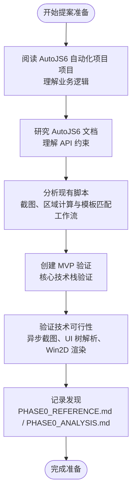

**图表来源**
- [tasks.md:1-16](file://openspec/changes/winui3-visual-dev-toolkit/tasks.md#L1-L16)

#### 前置分析报告

项目要求生成两份关键分析报告：

1. **PHASE0_REFERENCE.md**（最高优先级）
   - AutoJS6 API 权威参考
   - 图像生命周期管理规则
   - Rhino 引擎限制
   - 核心 API 签名和参数

2. **PHASE0_ANALYSIS.md**（次高优先级）
   - AutoJS6 自动化项目 业务逻辑分析
   - 锚点构建算法
   - 多容差搜索策略
   - regionRef 生成规则

**章节来源**
- [proposal.md:44-69](file://openspec/changes/winui3-visual-dev-toolkit/proposal.md#L44-L69)

### 提案标准格式与结构

#### 标准提案格式

OpenSpec 提案包含三个核心文件，每个都有特定的作用和结构要求：

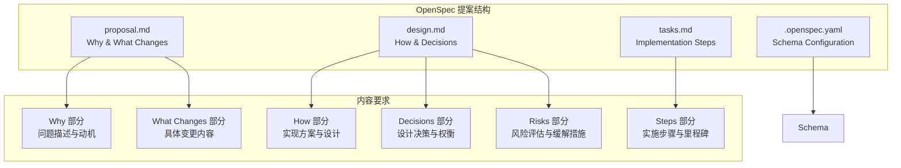

**图表来源**
- [openspec-propose.md:14-18](file://.github/skills/openspec-propose/SKILL.md#L14-L18)

#### 详细结构要求

##### Why 部分（问题与动机）

- **问题描述**：详细说明现有工作流的问题和痛点
- **影响分析**：量化问题的影响程度和成本
- **目标用户场景**：明确直接受益的项目和用户群体

##### What Changes 部分（变更内容）

- **新增功能**：列出所有新增的能力和特性
- **修改功能**：说明需要修改的现有功能
- **删除功能**：明确需要移除的功能
- **技术方案**：概述实现技术方案

##### How 部分（实现方案）

- **架构设计**：描述整体架构和设计原则
- **技术选型**：解释技术栈选择的理由
- **实现策略**：说明具体的实现策略和方法

##### Decisions 部分（设计决策）

- **设计决策**：记录重要的设计决策
- **替代方案**：说明被拒绝的替代方案
- **权衡考虑**：阐述决策的权衡和理由

##### Risks 部分（风险评估）

- **技术风险**：识别潜在的技术风险
- **业务风险**：评估业务层面的风险
- **缓解措施**：提出相应的缓解策略

**章节来源**
- [proposal.md:1-70](file://openspec/changes/winui3-visual-dev-toolkit/proposal.md#L1-L70)
- [design.md:36-153](file://openspec/changes/winui3-visual-dev-toolkit/design.md#L36-L153)

### 实施任务清单

#### 任务分类与优先级

项目实施采用分阶段的任务管理方式：

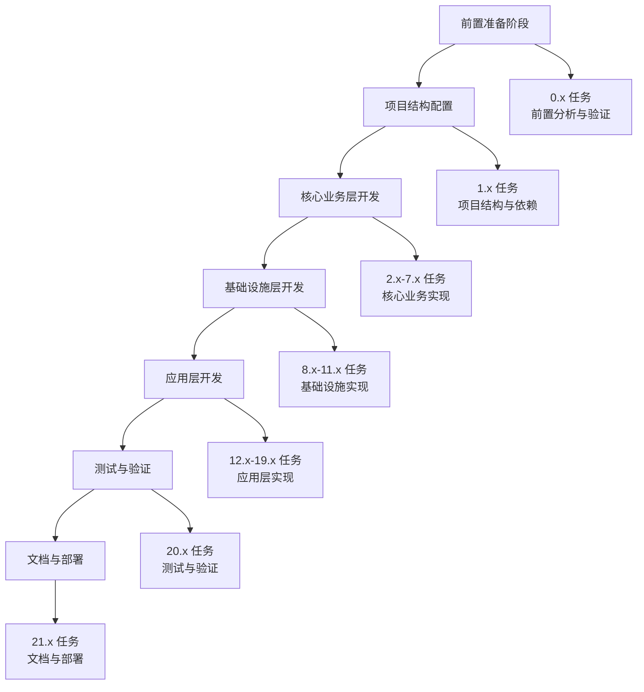

**图表来源**
- [tasks.md:1-260](file://openspec/changes/winui3-visual-dev-toolkit/tasks.md#L1-L260)

#### 关键里程碑

项目设置了多个关键里程碑来确保进度可控：

1. **MVP 验证完成**：核心技术栈验证通过
2. **核心功能实现**：双引擎架构完成
3. **应用层完成**：完整 UI 界面实现
4. **测试验证完成**：全面测试通过
5. **文档完善**：完整文档和部署准备

**章节来源**
- [tasks.md:17-47](file://openspec/changes/winui3-visual-dev-toolkit/tasks.md#L17-L47)

### 质量保证与测试

#### 验证清单

项目制定了详细的验证清单，确保质量标准得到满足：

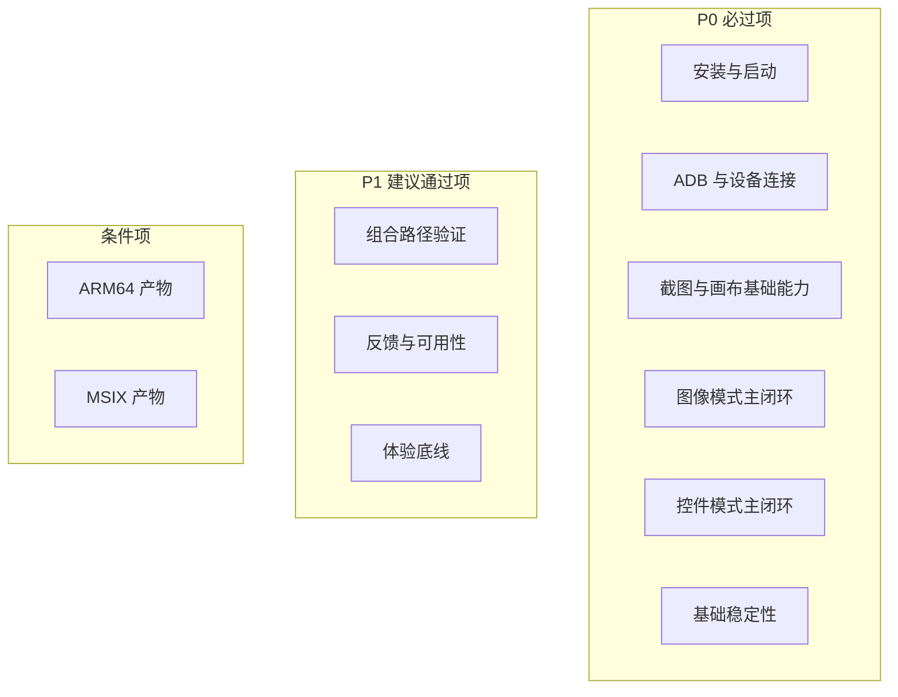

**图表来源**
- [checklist.md:29-153](file://checklist.md#L29-L153)

#### 测试策略

项目采用多层次的测试策略：

1. **单元测试**：Core 层的单元测试
2. **集成测试**：模块间集成测试
3. **端到端测试**：完整工作流测试
4. **性能测试**：60 FPS 渲染和大数据集测试

**章节来源**
- [checklist.md:29-153](file://checklist.md#L29-L153)
- [tasks.md:237-251](file://openspec/changes/winui3-visual-dev-toolkit/tasks.md#L237-L251)

## 依赖分析

### 外部依赖关系

项目依赖关系清晰明确，遵循单向依赖原则：

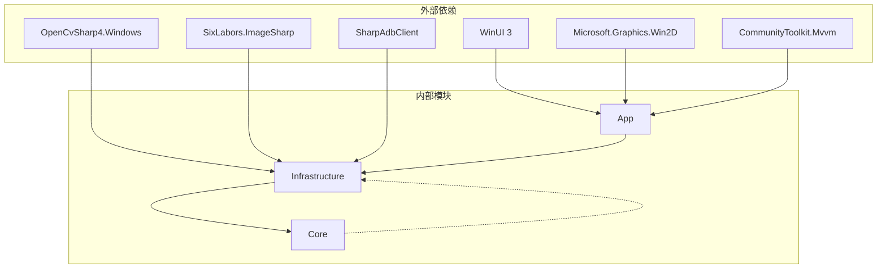

**图表来源**
- [proposal.md:34-36](file://openspec/changes/winui3-visual-dev-toolkit/proposal.md#L34-L36)

### 内部模块依赖

项目内部模块之间的依赖关系严格遵循 Clean Architecture 原则：

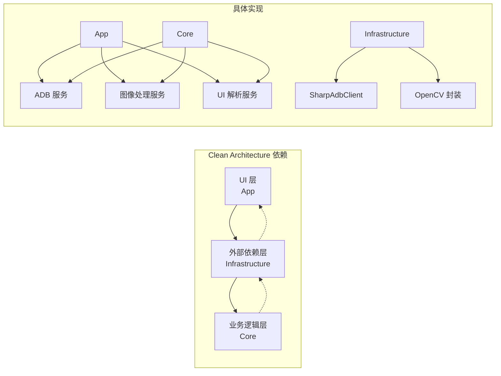

**图表来源**
- [design.md:120-129](file://openspec/changes/winui3-visual-dev-toolkit/design.md#L120-L129)

**章节来源**
- [proposal.md:31-36](file://openspec/changes/winui3-visual-dev-toolkit/proposal.md#L31-L36)
- [design.md:120-129](file://openspec/changes/winui3-visual-dev-toolkit/design.md#L120-L129)

## 性能考虑

### 性能基准要求

项目对性能有严格的要求：

- **渲染性能**：60 FPS 渲染，支持 5000+ 节点控件树
- **响应时间**：截图拉取 200-500ms，OpenCV 匹配 50-200ms
- **内存管理**：CanvasBitmap 缓存池，避免重复创建纹理
- **异步架构**：所有 I/O 操作异步执行，UI 线程永不阻塞

### 性能优化策略

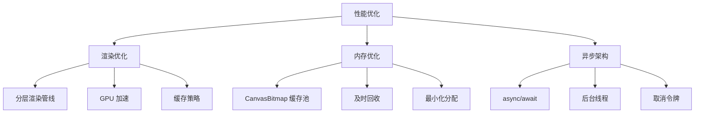

**图表来源**
- [design.md:109-119](file://openspec/changes/winui3-visual-dev-toolkit/design.md#L109-L119)

**章节来源**
- [design.md:109-119](file://openspec/changes/winui3-visual-dev-toolkit/design.md#L109-L119)

## 故障排除指南

### 常见问题与解决方案

#### ADB 连接问题

| 问题类型 | 症状 | 解决方案 |
|----------|------|----------|
| 连接不稳定 | 截图/Dump 拉取失败 | 实现重试机制（最多 3 次），超时设置 5 秒 |
| 设备识别失败 | 冷启动环境下无法发现设备 | 明确记录"必须先启动 ADB server"的前置条件 |
| TCP/IP 连接失败 | 无线调试不可用 | 检查网络连接和防火墙设置 |

#### 性能问题

| 问题类型 | 症状 | 解决方案 |
|----------|------|----------|
| 渲染卡顿 | 60 FPS 无法达到 | 图像降采样（最大 1920x1080），分层渲染仅重绘变化图层 |
| 内存泄漏 | 连续多次匹配后内存持续增长 | CanvasBitmap 缓存池，及时回收 ImageWrapper 对象 |
| UI 响应慢 | 操作卡顿 | 确保所有操作使用 async/await，避免同步阻塞 |

#### 代码生成问题

| 问题类型 | 症状 | 解决方案 |
|----------|------|----------|
| 生成代码不符合 API 约束 | Rhino 引擎循环体内使用 const/let | 强制使用 var 替代 const/let |
| 模板裁剪规则不符 | 动态元素包含在模板中 | 严格遵循模板裁剪规则，排除动态元素 |
| 选择器生成错误 | UiSelector 无效 | 验证控件树解析结果，提供选择器验证功能 |

**章节来源**
- [design.md:131-153](file://openspec/changes/winui3-visual-dev-toolkit/design.md#L131-L153)
- [README.md:342-374](file://README.md#L342-L374)

### 质量检查清单

项目制定了详细的质量检查清单，确保每个环节都得到充分验证：

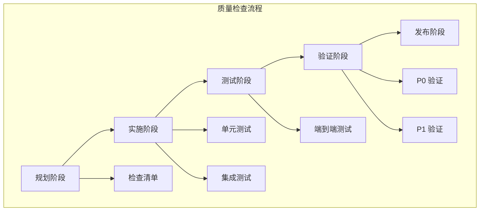

**图表来源**
- [checklist.md:1-186](file://checklist.md#L1-L186)

**章节来源**
- [checklist.md:1-186](file://checklist.md#L1-L186)

## 结论

AutoJS6 开发工具的 OpenSpec 提案编写指南展示了完整的项目管理最佳实践。通过严格的架构设计、清晰的依赖关系、完善的质量保证体系和详细的故障排除机制，该项目为 AutoJS6 脚本开发者提供了一个强大而易用的可视化开发工具。

该指南的核心价值在于：

1. **标准化流程**：提供了从需求收集到发布的完整流程
2. **架构指导**：明确了 Clean Architecture 的实施方法
3. **质量保证**：建立了多层次的质量检查和测试体系
4. **风险管理**：识别并制定了详细的风险缓解策略
5. **文档规范**：建立了标准化的 OpenSpec 提案格式

这些经验不仅适用于 AutoJS6 开发工具项目，也为其他类似的技术项目提供了宝贵的参考和借鉴。

## 附录

### OpenSpec 工作流

项目采用 OpenSpec 工具链支持完整的变更管理流程：

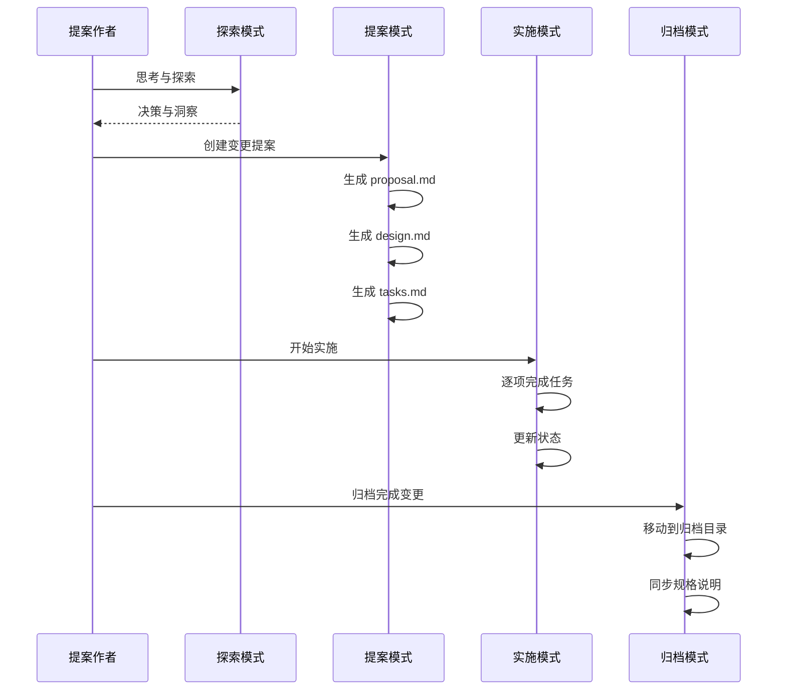

**图表来源**
- [openspec-propose.md:25-86](file://.github/skills/openspec-propose/SKILL.md#L25-L86)
- [openspec-apply-change.md:16-89](file://.github/skills/openspec-apply-change/SKILL.md#L16-L89)
- [openspec-archive-change.md:16-93](file://.github/skills/openspec-archive-change/SKILL.md#L16-L93)

### 发布流程

项目制定了详细的发布前验证流程：

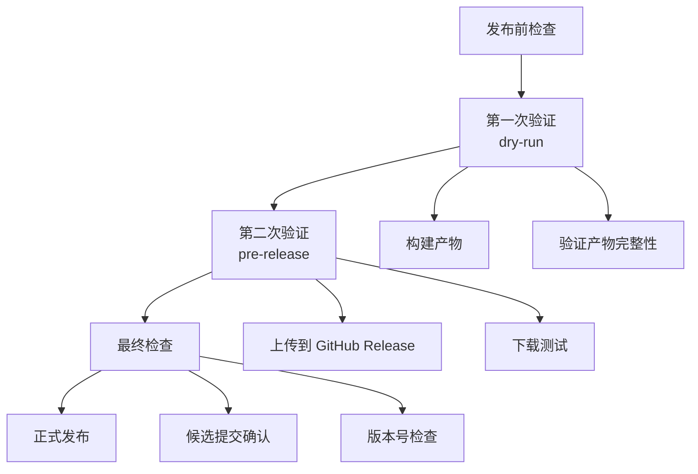

**图表来源**
- [manual.md:111-178](file://manual.md#L111-L178)
- [manual.md:180-241](file://manual.md#L180-L241)

**章节来源**
- [openspec-propose.md:25-86](file://.github/skills/openspec-propose/SKILL.md#L25-L86)
- [openspec-apply-change.md:16-89](file://.github/skills/openspec-apply-change/SKILL.md#L16-L89)
- [openspec-archive-change.md:16-93](file://.github/skills/openspec-archive-change/SKILL.md#L16-L93)
- [manual.md:111-241](file://manual.md#L111-L241)