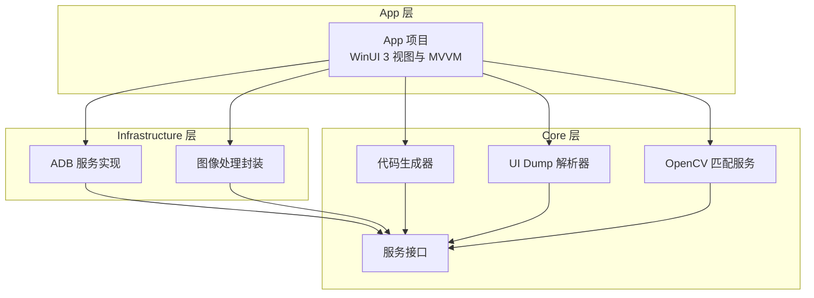
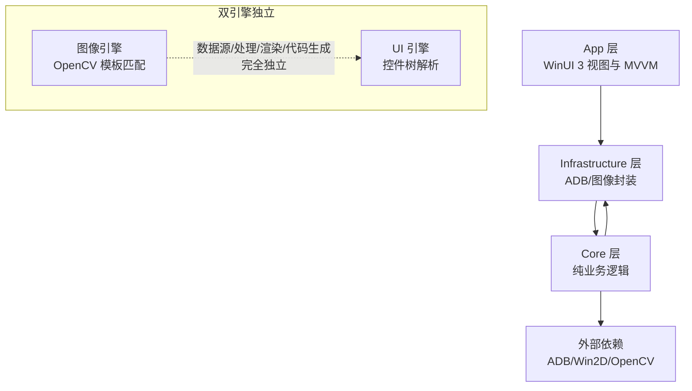
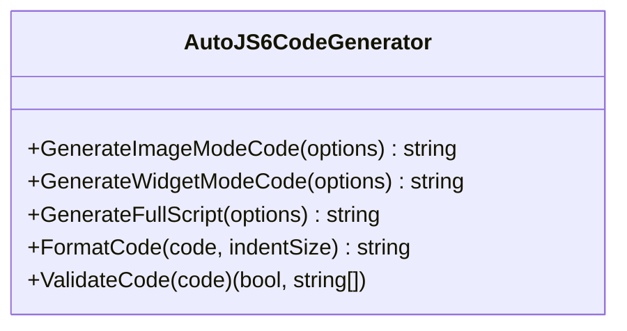
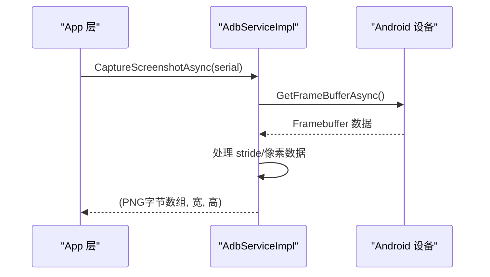
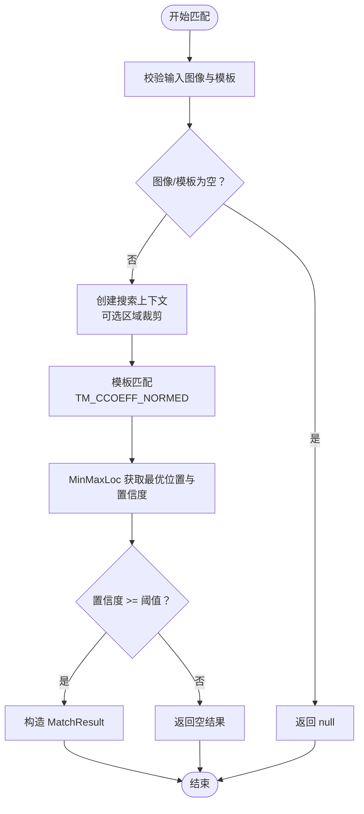
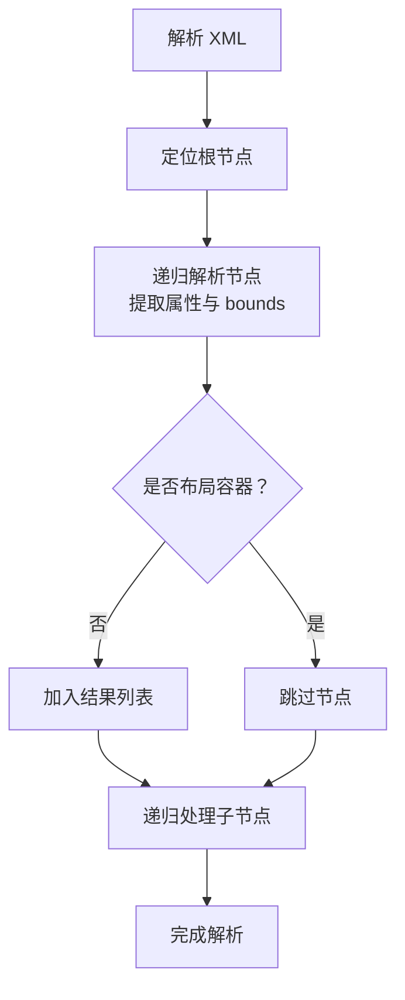
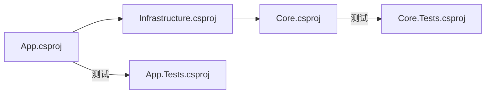

# 代码贡献规范

<cite>
**本文引用的文件**
- [README.md](file://README.md)
- [DEVELOPMENT.md](file://DEVELOPMENT.md)
- [checklist.md](file://checklist.md)
- [manual.md](file://manual.md)
- [AGENTS.md](file://AGENTS.md)
- [openspec/project.md](file://openspec/project.md)
- [openspec/config.yaml](file://openspec/config.yaml)
- [openspec/changes/winui3-visual-dev-toolkit/proposal.md](file://openspec/changes/winui3-visual-dev-toolkit/proposal.md)
- [openspec/changes/winui3-visual-dev-toolkit/design.md](file://openspec/changes/winui3-visual-dev-toolkit/design.md)
- [openspec/changes/winui3-visual-dev-toolkit/tasks.md](file://openspec/changes/winui3-visual-dev-toolkit/tasks.md)
- [App/App.csproj](file://App/App.csproj)
- [App.Tests/App.Tests.csproj](file://App.Tests/App.Tests.csproj)
- [Core.Tests/Core.Tests.csproj](file://Core.Tests/Core.Tests.csproj)
- [Core/Services/AutoJS6CodeGenerator.cs](file://Core/Services/AutoJS6CodeGenerator.cs)
- [Infrastructure/Adb/AdbServiceImpl.cs](file://Infrastructure/Adb/AdbServiceImpl.cs)
- [Infrastructure/Imaging/OpenCVMatchServiceImpl.cs](file://Infrastructure/Imaging/OpenCVMatchServiceImpl.cs)
- [Core/Services/UiDumpParser.cs](file://Core/Services/UiDumpParser.cs)
</cite>

## 目录
1. [简介](#简介)
2. [项目结构](#项目结构)
3. [核心组件](#核心组件)
4. [架构总览](#架构总览)
5. [详细组件分析](#详细组件分析)
6. [依赖分析](#依赖分析)
7. [性能考虑](#性能考虑)
8. [故障排查指南](#故障排查指南)
9. [结论](#结论)
10. [附录](#附录)

## 简介
本规范旨在为 AutoJS6 开发工具的贡献者提供一套标准化的流程与质量要求，覆盖分支管理、提交信息、代码审查、代码质量、OpenSpec 变更提案、测试与重构优化等方面。项目采用 WinUI 3 + .NET 8 技术栈，遵循双引擎独立架构（图像处理引擎与 UI 分析引擎）、异步非阻塞与 60FPS 渲染等工程约束，确保生成的 AutoJS6 代码符合 Rhino 引擎与 AutoJS6 运行时约束。

## 项目结构
项目采用 Clean Architecture 分层组织，分为三层：
- App：WinUI 3 UI 层，负责视图与 MVVM
- Infrastructure：外部依赖封装层，封装 ADB、OpenCV、ImageSharp 等
- Core：纯业务逻辑层，包含服务接口与实现，可独立测试

图表来源
- [App/App.csproj:1-84](file://App/App.csproj#L1-L84)
- [Infrastructure/Adb/AdbServiceImpl.cs:1-238](file://Infrastructure/Adb/AdbServiceImpl.cs#L1-L238)
- [Infrastructure/Imaging/OpenCVMatchServiceImpl.cs:1-204](file://Infrastructure/Imaging/OpenCVMatchServiceImpl.cs#L1-L204)
- [Core/Services/AutoJS6CodeGenerator.cs:1-357](file://Core/Services/AutoJS6CodeGenerator.cs#L1-L357)
- [Core/Services/UiDumpParser.cs:1-263](file://Core/Services/UiDumpParser.cs#L1-L263)

章节来源
- [README.md: 230-260:230-260](file://README.md#L230-L260)
- [App/App.csproj: 1-L84:1-84](file://App/App.csproj#L1-L84)

## 核心组件
- 代码生成器：生成图像模式与控件模式的 AutoJS6 代码，严格遵循 Rhino 引擎约束与 OOM 预防规则
- ADB 服务：基于 AdvancedSharpAdbClient 的设备扫描、截图拉取、UI Dump 拉取与 TCP/IP 连接
- OpenCV 匹配服务：基于 OpenCvSharp4 的模板匹配与相似度计算
- UI Dump 解析器：解析 uiautomator dump XML，过滤布局容器，构建控件树并生成 UiSelector

章节来源
- [Core/Services/AutoJS6CodeGenerator.cs: 1-L357:1-357](file://Core/Services/AutoJS6CodeGenerator.cs#L1-L357)
- [Infrastructure/Adb/AdbServiceImpl.cs: 1-L238:1-238](file://Infrastructure/Adb/AdbServiceImpl.cs#L1-L238)
- [Infrastructure/Imaging/OpenCVMatchServiceImpl.cs: 1-L204:1-204](file://Infrastructure/Imaging/OpenCVMatchServiceImpl.cs#L1-L204)
- [Core/Services/UiDumpParser.cs: 1-L263:1-263](file://Core/Services/UiDumpParser.cs#L1-L263)

## 架构总览
项目遵循“双引擎独立、单向依赖、异步非阻塞、60FPS 渲染”的架构原则，确保图像与 UI 两条主线完全解耦，渲染与匹配计算分离，UI 线程永不阻塞。

图表来源
- [AGENTS.md: 40-66:40-66](file://AGENTS.md#L40-L66)
- [AGENTS.md: 69-95:69-95](file://AGENTS.md#L69-L95)
- [README.md: 264-287:264-287](file://README.md#L264-L287)

章节来源
- [AGENTS.md: 40-95:40-95](file://AGENTS.md#L40-L95)
- [README.md: 264-287:264-287](file://README.md#L264-L287)

## 详细组件分析

### 代码生成器（AutoJS6CodeGenerator）
- 功能：生成图像模式与控件模式的 AutoJS6 代码，支持重试与超时机制，支持模板回收与路径兼容处理
- 质量约束：严格遵循 Rhino 引擎循环体内禁用 const/let 的约束，生成代码包含注释与格式化
- 测试：提供 ValidateCode 方法进行约束校验

图表来源
- [Core/Services/AutoJS6CodeGenerator.cs: 11-L164:11-164](file://Core/Services/AutoJS6CodeGenerator.cs#L11-L164)

章节来源
- [Core/Services/AutoJS6CodeGenerator.cs: 1-L357:1-357](file://Core/Services/AutoJS6CodeGenerator.cs#L1-L357)
- [AGENTS.md: 152-227:152-227](file://AGENTS.md#L152-L227)

### ADB 服务（AdbServiceImpl）
- 功能：设备扫描、截图拉取（GetFrameBufferAsync）、UI Dump 拉取（DumpScreenAsync）、TCP/IP 连接与配对
- 质量约束：禁止使用命令行，必须使用底层 API；异步调用；异常捕获与错误提示
- 性能：使用 ImageSharp 将 Framebuffer 转换为 PNG，处理 stride 行填充

图表来源
- [Infrastructure/Adb/AdbServiceImpl.cs: 72-L118:72-118](file://Infrastructure/Adb/AdbServiceImpl.cs#L72-L118)

章节来源
- [Infrastructure/Adb/AdbServiceImpl.cs: 1-L238:1-238](file://Infrastructure/Adb/AdbServiceImpl.cs#L1-L238)
- [openspec/changes/winui3-visual-dev-toolkit/tasks.md: 75-84:75-84](file://openspec/changes/winui3-visual-dev-toolkit/tasks.md#L75-L84)

### OpenCV 匹配服务（OpenCVMatchServiceImpl）
- 功能：模板匹配（TM_CCOEFF_NORMED）、多结果匹配、相似度计算、模板有效性校验
- 质量约束：后台线程执行，支持取消令牌；区域搜索上下文封装；异常安全返回空结果
- 性能：使用 Mat.FromImageData 与 MinMaxLoc 获取最优匹配位置与置信度

图表来源
- [Infrastructure/Imaging/OpenCVMatchServiceImpl.cs: 13-L60:13-60](file://Infrastructure/Imaging/OpenCVMatchServiceImpl.cs#L13-L60)
- [Infrastructure/Imaging/OpenCVMatchServiceImpl.cs: 62-L122:62-122](file://Infrastructure/Imaging/OpenCVMatchServiceImpl.cs#L62-L122)

章节来源
- [Infrastructure/Imaging/OpenCVMatchServiceImpl.cs: 1-L204:1-204](file://Infrastructure/Imaging/OpenCVMatchServiceImpl.cs#L1-L204)

### UI Dump 解析器（UiDumpParser）
- 功能：解析 XML、过滤布局容器、构建控件树、坐标映射、生成 UiSelector
- 质量约束：布局容器过滤规则（class 包含 Layout 且无 clickable/text/content-desc → 跳过）；bounds 解析为 Rect；容错解析与警告日志
- 性能：递归遍历，支持虚拟化渲染（在 App 层实现）

图表来源
- [Core/Services/UiDumpParser.cs: 14-L35:14-35](file://Core/Services/UiDumpParser.cs#L14-L35)
- [Core/Services/UiDumpParser.cs: 178-L197:178-197](file://Core/Services/UiDumpParser.cs#L178-L197)

章节来源
- [Core/Services/UiDumpParser.cs: 1-L263:1-263](file://Core/Services/UiDumpParser.cs#L1-L263)
- [openspec/changes/winui3-visual-dev-toolkit/design.md: 75-84:75-84](file://openspec/changes/winui3-visual-dev-toolkit/design.md#L75-L84)

## 依赖分析
- 项目层依赖：App → Infrastructure → Core ← Infrastructure，Core 为纯业务逻辑，无 UI 依赖
- 外部依赖：WinUI 3、Win2D、OpenCvSharp4、ImageSharp、AdvancedSharpAdbClient、CommunityToolkit.Mvvm
- 测试项目：App.Tests、Core.Tests，分别针对 UI 层与核心逻辑进行单元测试

图表来源
- [App/App.csproj: 67-L68:67-68](file://App/App.csproj#L67-L68)
- [Core.Tests/Core.Tests.csproj: 18-L19:18-19](file://Core.Tests/Core.Tests.csproj#L18-L19)
- [App.Tests/App.Tests.csproj: 1-L17:1-17](file://App.Tests/App.Tests.csproj#L1-L17)

章节来源
- [App/App.csproj: 1-L84:1-84](file://App/App.csproj#L1-L84)
- [Core.Tests/Core.Tests.csproj: 1-L21:1-21](file://Core.Tests/Core.Tests.csproj#L1-L21)
- [App.Tests/App.Tests.csproj: 1-L17:1-17](file://App.Tests/App.Tests.csproj#L1-L17)

## 性能考虑
- 异步架构：所有 I/O 操作（ADB、OpenCV、XML 解析、纹理上传）使用 async/await，避免阻塞 UI 线程
- 渲染优化：Win2D 分层渲染（CanvasImageLayer + CanvasOverlayLayer），仅重绘变化图层，启用 GPU 加速
- 内存优化：CanvasBitmap 缓存池，及时回收临时对象；控件树支持 5000+ 节点扁平化渲染
- 匹配优化：阈值滑动仅重算匹配层，不重建图像纹理；region 优先于全屏匹配

章节来源
- [AGENTS.md: 229-253:229-253](file://AGENTS.md#L229-L253)
- [README.md: 282-287:282-287](file://README.md#L282-L287)

## 故障排查指南
- ADB 连接失败：检查设备连接状态、ADB 服务状态、端口与配对码；实现重试机制与超时控制
- OpenCV 匹配异常：确认模板与截图尺寸一致，阈值范围（0.50~0.95），region 参数正确
- UI Dump 解析失败：容错解析（跳过无效节点），记录警告日志，提供原始 XML 查看
- 生成代码不符合约束：使用 ValidateCode 校验循环体内 const/let 使用，确保单轮单截图与 region 优先

章节来源
- [openspec/changes/winui3-visual-dev-toolkit/tasks.md: 226-236:226-236](file://openspec/changes/winui3-visual-dev-toolkit/tasks.md#L226-L236)
- [Core/Services/AutoJS6CodeGenerator.cs: 226-L258:226-258](file://Core/Services/AutoJS6CodeGenerator.cs#L226-L258)

## 结论
本规范明确了 AutoJS6 开发工具的贡献流程与质量标准，强调双引擎独立、异步非阻塞与 60FPS 渲染的工程约束，确保生成代码符合 AutoJS6 运行时约束。通过 OpenSpec 变更提案与测试验证，保障新功能的规范引入与稳定交付。

## 附录

### 分支管理与提交规范
- 分支策略：feature/* 用于功能开发，hotfix/* 用于紧急修复，release/* 用于发布准备
- 提交信息：采用清晰语义，说明变更目的与影响范围，避免“修复 bug”等模糊描述
- 代码审查：至少一名维护者审查，关注双引擎独立、异步架构与性能约束

章节来源
- [README.md: 376-389:376-389](file://README.md#L376-L389)

### OpenSpec 变更提案编写与评审
- 提案结构：Why（背景）、What Changes（变更内容）、Capabilities（新增/修改能力）、Impact（影响）
- 评审流程：先读 PHASE0_REFERENCE.md（API 约束），再读 PHASE0_ANALYSIS.md（业务逻辑），冲突以 API 约束为准
- 配置：openspec/config.yaml 支持为特定工件添加规则（如字数限制、任务拆分）

章节来源
- [openspec/changes/winui3-visual-dev-toolkit/proposal.md: 1-L70:1-70](file://openspec/changes/winui3-visual-dev-toolkit/proposal.md#L1-L70)
- [openspec/changes/winui3-visual-dev-toolkit/design.md: 16-L28:16-28](file://openspec/changes/winui3-visual-dev-toolkit/design.md#L16-L28)
- [openspec/config.yaml: 1-L21:1-21](file://openspec/config.yaml#L1-L21)

### 代码质量标准
- 命名约定：类/方法/属性使用 PascalCase；变量使用 camelCase；常量使用 Upper_Snake_Case
- 代码格式化：统一缩进与换行，注释说明关键步骤与约束
- 注释要求：公共方法添加 XML 文档注释，包含用途、参数、返回值与示例

章节来源
- [openspec/changes/winui3-visual-dev-toolkit/tasks.md: 45-L46:45-46](file://openspec/changes/winui3-visual-dev-toolkit/tasks.md#L45-L46)

### 测试要求与覆盖率
- 单元测试：Core.Tests 覆盖核心逻辑（UI Dump 解析、OpenCV 匹配、代码生成）
- 集成测试：App.Tests 覆盖 UI 层与 MVVM 绑定
- 验收测试：checklist.md 的 P0/P1 项作为发布前验收清单

章节来源
- [Core.Tests/Core.Tests.csproj: 1-L21:1-21](file://Core.Tests/Core.Tests.csproj#L1-L21)
- [App.Tests/App.Tests.csproj: 1-L17:1-17](file://App.Tests/App.Tests.csproj#L1-L17)
- [checklist.md: 29-L186:29-186](file://checklist.md#L29-L186)

### 代码重构与性能优化指导
- 重构原则：保持双引擎独立，避免循环依赖；模块规模不超过 512 行（硬上限 512）
- 性能优化：异步非阻塞、分层渲染、缓存池、region 优先、及时回收
- 发布验证：DEVELOPMENT.md 与 manual.md 提供本地与 CI 验证流程

章节来源
- [AGENTS.md: 249-L253:249-253](file://AGENTS.md#L249-L253)
- [DEVELOPMENT.md: 1-L276:1-276](file://DEVELOPMENT.md#L1-L276)
- [manual.md: 1-L522:1-522](file://manual.md#L1-L522)