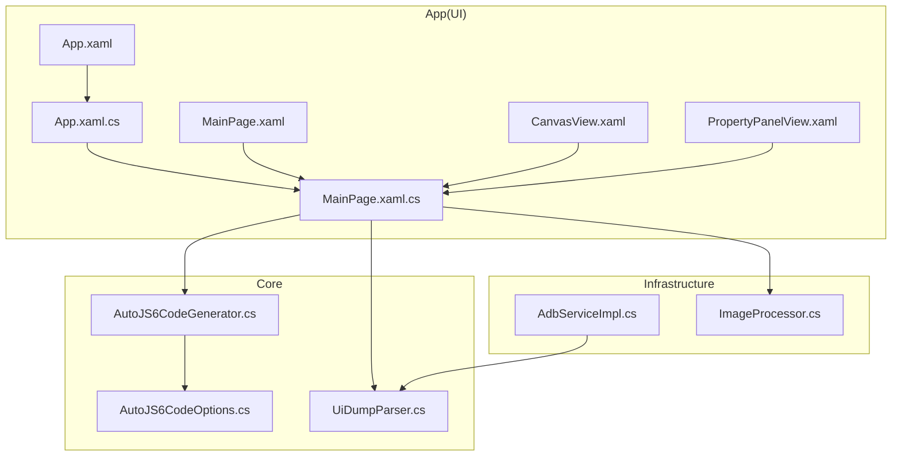
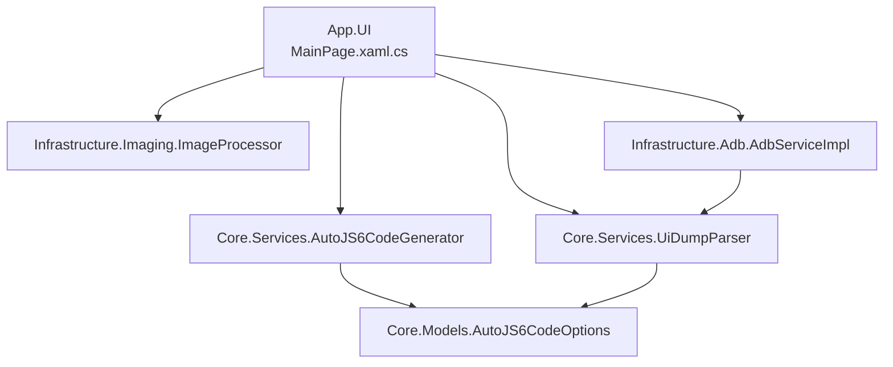
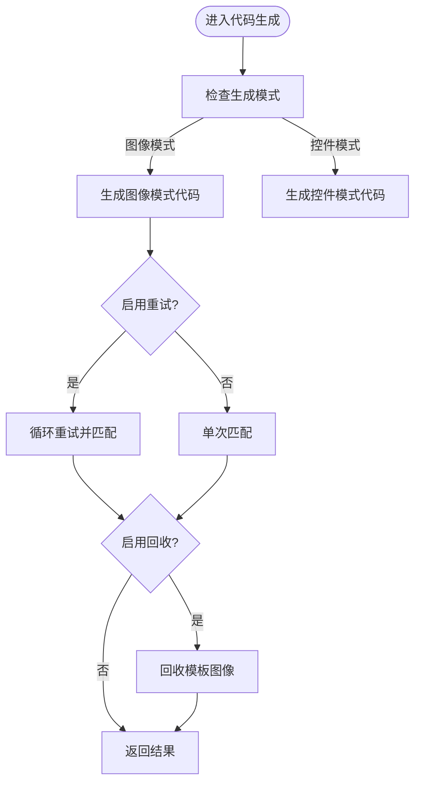
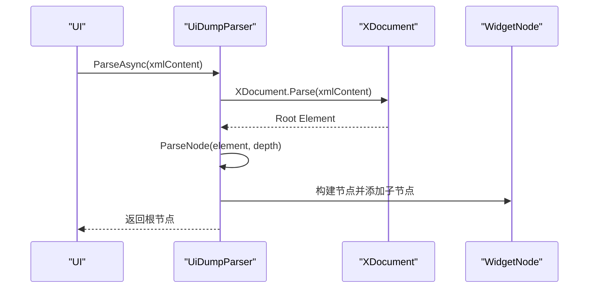

# 代码格式化

<cite>
**本文引用的文件**   
- [App.xaml.cs](file://App/App.xaml.cs)
- [App.xaml](file://App/App.xaml)
- [MainPage.xaml.cs](file://App/Views/MainPage.xaml.cs)
- [MainPage.xaml](file://App/Views/MainPage.xaml)
- [CanvasView.xaml](file://App/Views/CanvasView.xaml)
- [PropertyPanelView.xaml](file://App/Views/PropertyPanelView.xaml)
- [AutoJS6CodeGenerator.cs](file://Core/Services/AutoJS6CodeGenerator.cs)
- [UiDumpParser.cs](file://Core/Services/UiDumpParser.cs)
- [AdbServiceImpl.cs](file://Infrastructure/Adb/AdbServiceImpl.cs)
- [ImageProcessor.cs](file://Infrastructure/Imaging/ImageProcessor.cs)
- [AutoJS6CodeOptions.cs](file://Core/Models/AutoJS6CodeOptions.cs)
- [Core.csproj](file://Core/Core.csproj)
- [Infrastructure.csproj](file://Infrastructure/Infrastructure.csproj)
- [App.csproj](file://App/App.csproj)
</cite>

## 目录
1. [简介](#简介)
2. [项目结构](#项目结构)
3. [核心组件](#核心组件)
4. [架构总览](#架构总览)
5. [详细组件分析](#详细组件分析)
6. [依赖关系分析](#依赖关系分析)
7. [性能考量](#性能考量)
8. [故障排查指南](#故障排查指南)
9. [结论](#结论)
10. [附录](#附录)

## 简介
本文件为 AutoJS6 开发工具的代码格式化标准文档，面向 C# 与 XAML 的开发规范，统一团队编码风格，提升可读性与一致性。内容涵盖：
- C# 代码格式化规范（缩进、大括号、行长度、注释、变量与方法签名、代码块组织）
- XAML 格式化规范（属性排列、事件绑定、样式定义）
- 结合现有仓库中的实际代码示例进行说明与溯源

## 项目结构
项目采用多项目解决方案，按职责分层：
- App：UI 层（WinUI），包含 XAML 页面与后台代码
- Core：业务模型与服务接口、核心算法
- Infrastructure：外部依赖集成（ADB、图像处理等）

**图表来源**
- [App.xaml.cs:22-56](file://App/App.xaml.cs#L22-L56)
- [MainPage.xaml.cs:17-60](file://App/Views/MainPage.xaml.cs#L17-L60)
- [MainPage.xaml:1-100](file://App/Views/MainPage.xaml#L1-L100)
- [CanvasView.xaml:1-21](file://App/Views/CanvasView.xaml#L1-L21)
- [PropertyPanelView.xaml:1-13](file://App/Views/PropertyPanelView.xaml#L1-L13)
- [App.xaml:1-79](file://App/App.xaml#L1-L79)
- [AutoJS6CodeGenerator.cs:11-12](file://Core/Services/AutoJS6CodeGenerator.cs#L11-L12)
- [UiDumpParser.cs:12-12](file://Core/Services/UiDumpParser.cs#L12-L12)
- [AdbServiceImpl.cs:17-17](file://Infrastructure/Adb/AdbServiceImpl.cs#L17-L17)
- [ImageProcessor.cs:13-13](file://Infrastructure/Imaging/ImageProcessor.cs#L13-L13)
- [AutoJS6CodeOptions.cs:6-6](file://Core/Models/AutoJS6CodeOptions.cs#L6-L6)

**章节来源**
- [App.csproj:1-84](file://App/App.csproj#L1-L84)
- [Core.csproj:1-10](file://Core/Core.csproj#L1-L10)
- [Infrastructure.csproj:1-19](file://Infrastructure/Infrastructure.csproj#L1-L19)

## 核心组件
- 代码生成器：负责根据配置生成 AutoJS6 脚本，并提供基础格式化与校验能力
- UI 解析器：解析 Android UI 层次结构，生成可查询的节点树
- ADB 服务：设备连接、截图、UI 抓取
- 图像处理：PNG 解码、降采样、裁剪、元数据生成
- 模型：代码生成选项与枚举

这些组件在现有代码中体现了清晰的职责划分与一致的命名风格。

**章节来源**
- [AutoJS6CodeGenerator.cs:11-12](file://Core/Services/AutoJS6CodeGenerator.cs#L11-L12)
- [UiDumpParser.cs:12-12](file://Core/Services/UiDumpParser.cs#L12-L12)
- [AdbServiceImpl.cs:17-17](file://Infrastructure/Adb/AdbServiceImpl.cs#L17-L17)
- [ImageProcessor.cs:13-13](file://Infrastructure/Imaging/ImageProcessor.cs#L13-L13)
- [AutoJS6CodeOptions.cs:6-6](file://Core/Models/AutoJS6CodeOptions.cs#L6-L6)

## 架构总览

**图表来源**
- [MainPage.xaml.cs:43-51](file://App/Views/MainPage.xaml.cs#L43-L51)
- [AutoJS6CodeGenerator.cs:11-12](file://Core/Services/AutoJS6CodeGenerator.cs#L11-L12)
- [UiDumpParser.cs:12-12](file://Core/Services/UiDumpParser.cs#L12-L12)
- [ImageProcessor.cs:13-13](file://Infrastructure/Imaging/ImageProcessor.cs#L13-L13)
- [AdbServiceImpl.cs:17-17](file://Infrastructure/Adb/AdbServiceImpl.cs#L17-L17)
- [AutoJS6CodeOptions.cs:6-6](file://Core/Models/AutoJS6CodeOptions.cs#L6-L6)

## 详细组件分析

### C# 代码格式化规范
- 缩进与对齐
  - 统一使用 4 个空格缩进，不使用 Tab
  - 代码块内部保持一致的缩进层级
  - 参考示例：类体、方法体、条件/循环块均以 4 空格缩进
- 大括号位置
  - 左花括号不单独占行，紧跟在关键字/声明之后
  - 右花括号独立成行，与控制语句对齐
  - 参考示例：类定义、方法定义、构造函数、异常处理块
- 行长度
  - 建议每行不超过 120 个字符；过长表达式应换行并对齐
  - 参数列表、对象初始化、集合初始化等应在必要时分行
- 注释规范
  - 单行注释：使用双斜杠，注释与代码之间保留 2 个空格
  - 多行注释：使用块注释，段落间空一行
  - XML 文档注释：为公共 API 添加 /// 注释，描述用途、参数、返回值与异常
- 变量声明与初始化
  - 成员变量在类顶部声明，构造函数中初始化
  - 局部变量在首次使用前就近声明，避免“僵尸变量”
  - 使用 var 推断局部变量类型，显式类型用于公共 API 或需要强调的场景
- 方法签名格式
  - 修饰符顺序：访问级别（如 public/private）→ 修饰符（static/virtual/override 等）→ 返回类型 → 方法名
  - 参数列表每个参数独占一行（当参数较多时），右括号与左花括号在同一行
  - 返回类型与方法名之间保留一个空格
- 代码块组织
  - 使用空行分隔逻辑段落，增强可读性
  - 逻辑分组：字段/属性、构造函数、公开方法、私有方法
  - 合理折叠：将复杂方法拆分为私有辅助方法，便于折叠查看

参考示例文件与片段路径：
- [App.xaml.cs:22-56](file://App/App.xaml.cs#L22-L56)
- [MainPage.xaml.cs:43-60](file://App/Views/MainPage.xaml.cs#L43-L60)
- [AutoJS6CodeGenerator.cs:191-224](file://Core/Services/AutoJS6CodeGenerator.cs#L191-L224)
- [UiDumpParser.cs:103-154](file://Core/Services/UiDumpParser.cs#L103-L154)
- [AdbServiceImpl.cs:33-49](file://Infrastructure/Adb/AdbServiceImpl.cs#L33-L49)
- [ImageProcessor.cs:21-42](file://Infrastructure/Imaging/ImageProcessor.cs#L21-L42)

**章节来源**
- [App.xaml.cs:22-56](file://App/App.xaml.cs#L22-L56)
- [MainPage.xaml.cs:43-60](file://App/Views/MainPage.xaml.cs#L43-L60)
- [AutoJS6CodeGenerator.cs:191-224](file://Core/Services/AutoJS6CodeGenerator.cs#L191-L224)
- [UiDumpParser.cs:103-154](file://Core/Services/UiDumpParser.cs#L103-L154)
- [AdbServiceImpl.cs:33-49](file://Infrastructure/Adb/AdbServiceImpl.cs#L33-L49)
- [ImageProcessor.cs:21-42](file://Infrastructure/Imaging/ImageProcessor.cs#L21-L42)

### XAML 格式化规范
- 属性排列
  - 常用属性按“重要性”顺序排列：x:Name、Content/Text、Style、Click/事件、Grid.Row/Column 等
  - 复杂属性（如 Style、DataTemplate、事件）独立成行
- 事件绑定
  - 事件绑定使用 XAML 语法，避免在后台代码中重复绑定
  - 事件名称与方法签名保持一致，便于导航与重构
- 样式与资源
  - 样式定义集中于 Resources 中，键名使用语义化命名（如 WorkbenchPrimaryButtonStyle）
  - Setter 顺序：Property → Value，保持对齐
- 嵌套与缩进
  - 子元素统一缩进 4 个空格
  - 复杂模板（ControlTemplate）中，Setter 与 VisualState 内容按层级缩进
- 布局网格
  - Grid 的 RowDefinition/ColumnDefinition 与子元素对齐，便于阅读

参考示例文件与片段路径：
- [App.xaml:13-76](file://App/App.xaml#L13-L76)
- [MainPage.xaml:10-101](file://App/Views/MainPage.xaml#L10-L101)
- [MainPage.xaml:103-167](file://App/Views/MainPage.xaml#L103-L167)
- [MainPage.xaml:169-344](file://App/Views/MainPage.xaml#L169-L344)
- [MainPage.xaml:346-633](file://App/Views/MainPage.xaml#L346-L633)
- [CanvasView.xaml:10-19](file://App/Views/CanvasView.xaml#L10-L19)
- [PropertyPanelView.xaml:9-11](file://App/Views/PropertyPanelView.xaml#L9-L11)

**章节来源**
- [App.xaml:13-76](file://App/App.xaml#L13-L76)
- [MainPage.xaml:10-101](file://App/Views/MainPage.xaml#L10-L101)
- [MainPage.xaml:103-167](file://App/Views/MainPage.xaml#L103-L167)
- [MainPage.xaml:169-344](file://App/Views/MainPage.xaml#L169-L344)
- [MainPage.xaml:346-633](file://App/Views/MainPage.xaml#L346-L633)
- [CanvasView.xaml:10-19](file://App/Views/CanvasView.xaml#L10-L19)
- [PropertyPanelView.xaml:9-11](file://App/Views/PropertyPanelView.xaml#L9-L11)

### 代码块组织流程（以代码生成为例）

**图表来源**
- [AutoJS6CodeGenerator.cs:13-102](file://Core/Services/AutoJS6CodeGenerator.cs#L13-L102)
- [AutoJS6CodeGenerator.cs:104-164](file://Core/Services/AutoJS6CodeGenerator.cs#L104-L164)

**章节来源**
- [AutoJS6CodeGenerator.cs:13-102](file://Core/Services/AutoJS6CodeGenerator.cs#L13-L102)
- [AutoJS6CodeGenerator.cs:104-164](file://Core/Services/AutoJS6CodeGenerator.cs#L104-L164)

### 方法调用序列（以 UI 解析为例）

**图表来源**
- [UiDumpParser.cs:14-35](file://Core/Services/UiDumpParser.cs#L14-L35)
- [UiDumpParser.cs:103-154](file://Core/Services/UiDumpParser.cs#L103-L154)

**章节来源**
- [UiDumpParser.cs:14-35](file://Core/Services/UiDumpParser.cs#L14-L35)
- [UiDumpParser.cs:103-154](file://Core/Services/UiDumpParser.cs#L103-L154)

## 依赖关系分析
- App 项目引用 Infrastructure 与 Core
- Infrastructure 项目引用 Core
- 通过接口抽象（IAdbService、IUiDumpParser、ICodeGenerator）降低耦合

**图表来源**
- [App.csproj:67-68](file://App/App.csproj#L67-L68)
- [Infrastructure.csproj:9-11](file://Infrastructure/Infrastructure.csproj#L9-L11)
- [Core.csproj:1-10](file://Core/Core.csproj#L1-L10)

**章节来源**
- [App.csproj:67-68](file://App/App.csproj#L67-L68)
- [Infrastructure.csproj:9-11](file://Infrastructure/Infrastructure.csproj#L9-L11)
- [Core.csproj:1-10](file://Core/Core.csproj#L1-L10)

## 性能考量
- 代码生成器的格式化与校验逻辑简单高效，适合在 UI 端即时反馈
- 图像处理与 ADB 截图涉及大量内存与 I/O，建议：
  - 控制图像尺寸（降采样至合理分辨率）
  - 及时释放图像资源（回收模板）
  - 异步调用避免阻塞 UI 线程

[本节为通用指导，无需特定文件溯源]

## 故障排查指南
- 代码生成错误
  - 使用验证方法检查循环体内是否误用 const/let
  - 参考：[AutoJS6CodeGenerator.cs:226-258](file://Core/Services/AutoJS6CodeGenerator.cs#L226-L258)
- UI 解析失败
  - 检查 XML 内容是否为空或格式错误
  - 参考：[UiDumpParser.cs:14-35](file://Core/Services/UiDumpParser.cs#L14-L35)
- 设备连接问题
  - 确认 ADB 路径与服务状态
  - 参考：[AdbServiceImpl.cs:33-49](file://Infrastructure/Adb/AdbServiceImpl.cs#L33-L49)

**章节来源**
- [AutoJS6CodeGenerator.cs:226-258](file://Core/Services/AutoJS6CodeGenerator.cs#L226-L258)
- [UiDumpParser.cs:14-35](file://Core/Services/UiDumpParser.cs#L14-L35)
- [AdbServiceImpl.cs:33-49](file://Infrastructure/Adb/AdbServiceImpl.cs#L33-L49)

## 结论
通过统一 C# 与 XAML 的格式化规范，结合现有代码示例，可显著提升代码一致性与可维护性。建议在团队内推广并纳入 CI 校验，持续优化开发体验。

[本节为总结性内容，无需特定文件溯源]

## 附录
- 关键模型与枚举
  - 代码生成选项与模式：[AutoJS6CodeOptions.cs:6-89](file://Core/Models/AutoJS6CodeOptions.cs#L6-L89)

**章节来源**
- [AutoJS6CodeOptions.cs:6-89](file://Core/Models/AutoJS6CodeOptions.cs#L6-L89)