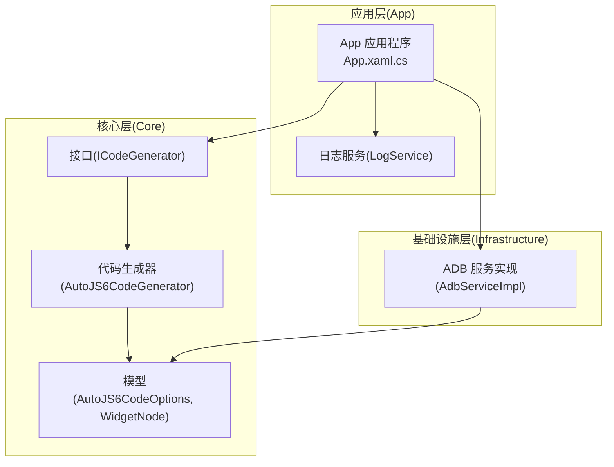
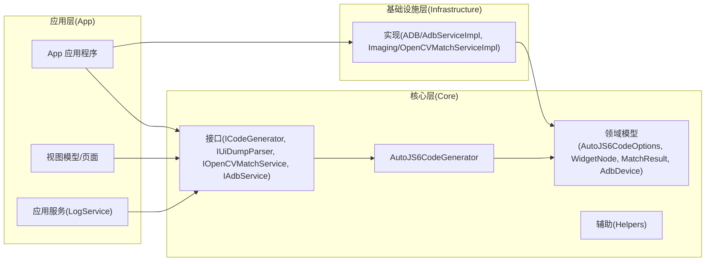
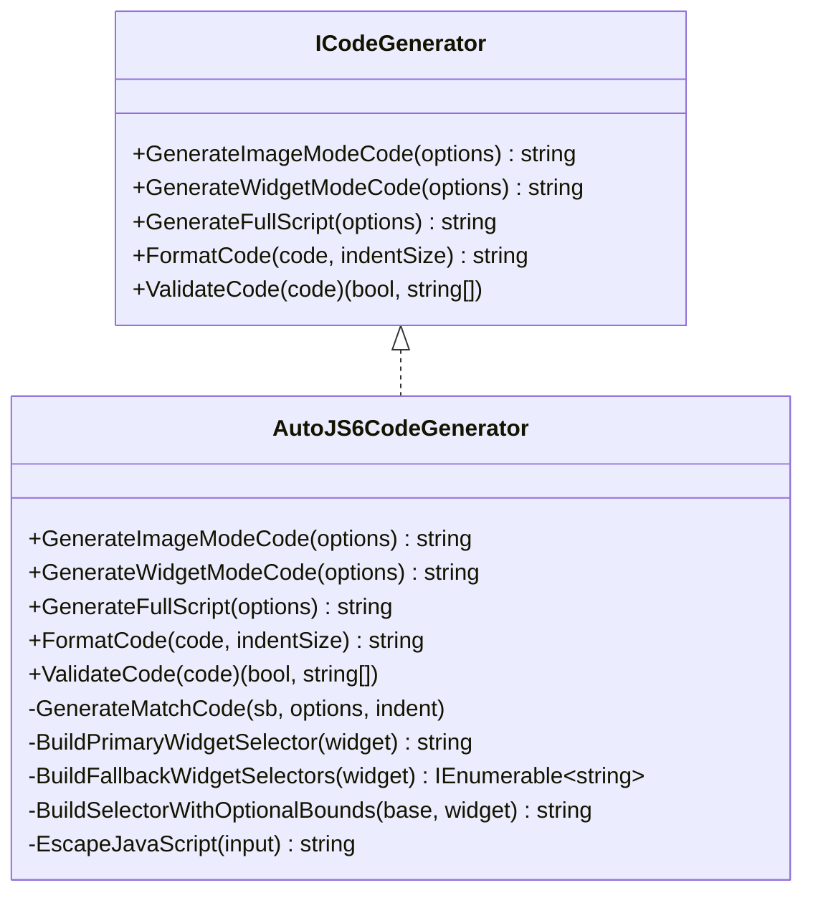
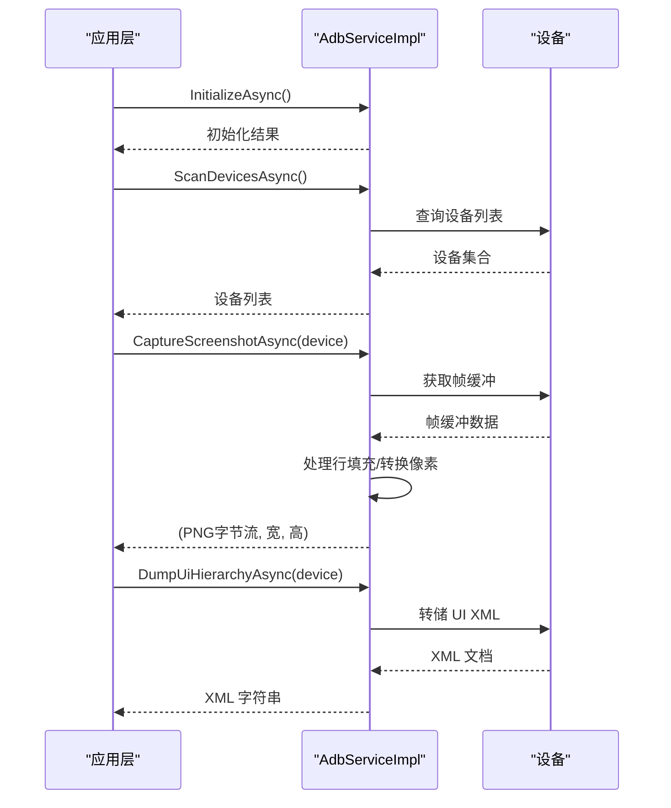
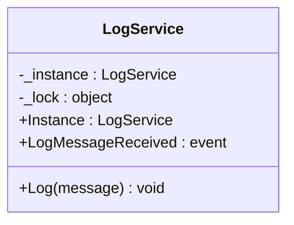
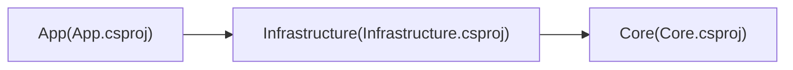

# 代码质量标准

<cite>
**本文引用的文件**
- [App.csproj](file://App/App.csproj)
- [Core.csproj](file://Core/Core.csproj)
- [Infrastructure.csproj](file://Infrastructure/Infrastructure.csproj)
- [App.xaml.cs](file://App/App.xaml.cs)
- [LogService.cs](file://App/Services/LogService.cs)
- [ICodeGenerator.cs](file://Core/Abstractions/ICodeGenerator.cs)
- [AutoJS6CodeGenerator.cs](file://Core/Services/AutoJS6CodeGenerator.cs)
- [AutoJS6CodeGeneratorTests.cs](file://Core.Tests/AutoJS6CodeGeneratorTests.cs)
- [AdbServiceImpl.cs](file://Infrastructure/Adb/AdbServiceImpl.cs)
- [AutoJS6CodeOptions.cs](file://Core/Models/AutoJS6CodeOptions.cs)
- [WidgetNode.cs](file://Core/Models/WidgetNode.cs)
- [README.md](file://README.md)
- [DEVELOPMENT.md](file://DEVELOPMENT.md)
</cite>

## 目录
1. [引言](#引言)
2. [项目结构](#项目结构)
3. [核心组件](#核心组件)
4. [架构总览](#架构总览)
5. [详细组件分析](#详细组件分析)
6. [依赖分析](#依赖分析)
7. [性能考虑](#性能考虑)
8. [故障排查指南](#故障排查指南)
9. [结论](#结论)
10. [附录](#附录)

## 引言
本文件为 AutoJS6 开发工具的代码质量标准文档，面向 C# 开发者，系统性地定义编程规范与命名约定、代码格式化标准、代码结构要求、Clean Architecture 实践、性能优化与内存管理最佳实践，并通过具体文件与测试用例展示正确与错误示例的对比路径，帮助团队在保持一致性的同时提升可维护性与稳定性。

## 项目结构
项目采用 Clean Architecture 分层组织，分为三层：
- Core：纯业务逻辑层，无 UI 依赖，独立可测试
- Infrastructure：外部依赖适配层（ADB、图像处理等）
- App：WinUI 3 应用层，负责 UI 与 MVVM

图表来源
- [App.xaml.cs:22-56](file://App/App.xaml.cs#L22-L56)
- [LogService.cs:9-50](file://App/Services/LogService.cs#L9-L50)
- [ICodeGenerator.cs:8-45](file://Core/Abstractions/ICodeGenerator.cs#L8-L45)
- [AutoJS6CodeGenerator.cs:11-356](file://Core/Services/AutoJS6CodeGenerator.cs#L11-L356)
- [AdbServiceImpl.cs:17-237](file://Infrastructure/Adb/AdbServiceImpl.cs#L17-L237)
- [AutoJS6CodeOptions.cs:6-88](file://Core/Models/AutoJS6CodeOptions.cs#L6-L88)
- [WidgetNode.cs:6-92](file://Core/Models/WidgetNode.cs#L6-L92)

章节来源
- [README.md:230-288](file://README.md#L230-L288)
- [App.csproj:1-84](file://App/App.csproj#L1-L84)
- [Core.csproj:1-10](file://Core/Core.csproj#L1-L10)
- [Infrastructure.csproj:1-19](file://Infrastructure/Infrastructure.csproj#L1-L19)

## 核心组件
- 接口与实现分离：通过接口约束实现解耦，便于替换与测试
- 选项驱动：以配置对象承载生成参数，保证行为可控且可测试
- 单一职责：各组件职责清晰，避免交叉耦合
- 异步优先：I/O 操作统一采用异步与取消令牌，保障 UI 响应

章节来源
- [ICodeGenerator.cs:8-45](file://Core/Abstractions/ICodeGenerator.cs#L8-L45)
- [AutoJS6CodeGenerator.cs:11-356](file://Core/Services/AutoJS6CodeGenerator.cs#L11-L356)
- [AutoJS6CodeOptions.cs:6-88](file://Core/Models/AutoJS6CodeOptions.cs#L6-L88)
- [WidgetNode.cs:6-92](file://Core/Models/WidgetNode.cs#L6-L92)
- [AdbServiceImpl.cs:17-237](file://Infrastructure/Adb/AdbServiceImpl.cs#L17-L237)

## 架构总览
Clean Architecture 分层与依赖方向如下：

图表来源
- [README.md:264-288](file://README.md#L264-L288)
- [App.xaml.cs:22-56](file://App/App.xaml.cs#L22-L56)
- [LogService.cs:9-50](file://App/Services/LogService.cs#L9-L50)
- [ICodeGenerator.cs:8-45](file://Core/Abstractions/ICodeGenerator.cs#L8-L45)
- [AutoJS6CodeGenerator.cs:11-356](file://Core/Services/AutoJS6CodeGenerator.cs#L11-L356)
- [AdbServiceImpl.cs:17-237](file://Infrastructure/Adb/AdbServiceImpl.cs#L17-L237)

## 详细组件分析

### 组件一：AutoJS6 代码生成器
- 职责：根据选项生成图像模式或控件模式的 AutoJS6 脚本；提供代码格式化与约束校验
- 关键点：
  - 严格遵守 Rhino 引擎限制：循环体内禁止使用 const/let，改用 var
  - 支持重试与超时控制、区域裁剪、模板回收
  - 控件选择器优先级：id > text > desc，并支持 boundsInside 限定范围
- 错误示例与正确示例对比参考：
  - 错误示例路径：[循环体内 const/let 使用:250-255](file://Core/Services/AutoJS6CodeGenerator.cs#L250-L255)
  - 正确示例路径：[单元测试断言不包含 const/let:37-38](file://Core.Tests/AutoJS6CodeGeneratorTests.cs#L37-L38)

图表来源
- [ICodeGenerator.cs:8-45](file://Core/Abstractions/ICodeGenerator.cs#L8-L45)
- [AutoJS6CodeGenerator.cs:11-356](file://Core/Services/AutoJS6CodeGenerator.cs#L11-L356)

章节来源
- [AutoJS6CodeGenerator.cs:11-356](file://Core/Services/AutoJS6CodeGenerator.cs#L11-L356)
- [AutoJS6CodeGeneratorTests.cs:10-79](file://Core.Tests/AutoJS6CodeGeneratorTests.cs#L10-L79)

### 组件二：ADB 服务实现
- 职责：封装 ADB 通信，提供设备扫描、截图捕获、UI 层次结构转储、设备连接与配对
- 关键点：
  - 异步操作与取消令牌支持
  - 帧缓冲区行填充检测与像素数据修正
  - 兼容多种 ADB 路径查找策略
- 错误示例与正确示例对比参考：
  - 错误示例路径：[未处理帧缓冲区行填充导致尺寸不一致:93-110](file://Infrastructure/Adb/AdbServiceImpl.cs#L93-L110)
  - 正确示例路径：[去填充后提取有效像素数据:99-109](file://Infrastructure/Adb/AdbServiceImpl.cs#L99-L109)

图表来源
- [AdbServiceImpl.cs:33-138](file://Infrastructure/Adb/AdbServiceImpl.cs#L33-L138)

章节来源
- [AdbServiceImpl.cs:17-237](file://Infrastructure/Adb/AdbServiceImpl.cs#L17-L237)

### 组件三：日志服务（单例）
- 职责：统一日志入口，线程安全，向调试输出与 UI 事件广播
- 关键点：
  - 双重检查锁定实现线程安全单例
  - 时间戳格式化与事件通知
- 错误示例与正确示例对比参考：
  - 错误示例路径：[多实例竞争导致事件丢失:11-27](file://App/Services/LogService.cs#L11-L27)
  - 正确示例路径：[统一通过静态属性访问实例:14-27](file://App/Services/LogService.cs#L14-L27)

图表来源
- [LogService.cs:9-50](file://App/Services/LogService.cs#L9-L50)

章节来源
- [LogService.cs:9-50](file://App/Services/LogService.cs#L9-L50)

### 组件四：模型与选项
- AutoJS6CodeOptions：集中管理代码生成的所有可配置项，含阈值、重试次数、超时、变量前缀、模板路径、裁剪区域、控件节点、开关项等
- WidgetNode：描述控件树节点的关键属性，支持 boundsInside 限定范围与降级选择器构建

章节来源
- [AutoJS6CodeOptions.cs:6-88](file://Core/Models/AutoJS6CodeOptions.cs#L6-L88)
- [WidgetNode.cs:6-92](file://Core/Models/WidgetNode.cs#L6-L92)

## 依赖分析
- 项目依赖关系：
  - App 依赖 Infrastructure
  - Infrastructure 依赖 Core
- 解决方案与项目文件体现：
  - App.csproj 引用 Infrastructure
  - Infrastructure.csproj 引用 Core
  - Core.csproj 无 UI 依赖

图表来源
- [App.csproj:67-68](file://App/App.csproj#L67-L68)
- [Infrastructure.csproj:9-11](file://Infrastructure/Infrastructure.csproj#L9-L11)
- [Core.csproj:1-10](file://Core/Core.csproj#L1-L10)

章节来源
- [App.csproj:67-68](file://App/App.csproj#L67-L68)
- [Infrastructure.csproj:9-11](file://Infrastructure/Infrastructure.csproj#L9-L11)
- [Core.csproj:1-10](file://Core/Core.csproj#L1-L10)

## 性能考虑
- 渲染与计算
  - 使用 Win2D 进行 GPU 加速渲染，避免阻塞 UI 线程
  - 控制帧率与交互响应，减少不必要的重绘
- I/O 与网络
  - ADB 操作统一异步，配合取消令牌，避免卡顿
  - 截图与图像处理尽量在后台线程执行
- 内存管理
  - 严格遵循 AutoJS6 约束：循环体内使用 var，避免 const/let 导致变量不更新
  - 及时回收 ImageWrapper 对象，防止 OOM
  - 限制每轮循环只抓取一次屏幕快照，缩小检测范围
- 代码生成
  - 优先使用 region 限定匹配范围
  - 合理设置阈值，避免无效匹配

章节来源
- [README.md:342-374](file://README.md#L342-L374)
- [AutoJS6CodeGenerator.cs:191-224](file://Core/Services/AutoJS6CodeGenerator.cs#L191-L224)
- [AdbServiceImpl.cs:93-118](file://Infrastructure/Adb/AdbServiceImpl.cs#L93-L118)

## 故障排查指南
- 构建与打包
  - 本地 Release 构建失败：检查平台目标、是否默认启用 Trim/R2R、MSIX 签名证书与发布者信息
  - MSIX 签名失败：确认证书主题与发布者一致，确保 signtool 可用并导入证书
  - EXE 安装器失败：确认 Inno Setup 6 可用、输出目录可写
- 功能验证
  - ADB 设备不可用：确认 ADB 路径、设备在线状态、连接方式（USB/TCP）
  - 截图异常：检查帧缓冲区行填充处理与像素格式转换
  - 代码生成不符合约束：检查循环体内是否使用 const/let，是否及时回收模板图像
- 测试流程
  - 使用手动打包测试工作流进行回归验证，必要时修复后再进入正式发布

章节来源
- [DEVELOPMENT.md:224-250](file://DEVELOPMENT.md#L224-L250)
- [AdbServiceImpl.cs:190-236](file://Infrastructure/Adb/AdbServiceImpl.cs#L190-L236)
- [AutoJS6CodeGenerator.cs:226-258](file://Core/Services/AutoJS6CodeGenerator.cs#L226-L258)

## 结论
本质量标准文档基于现有代码库提炼出 C# 编程规范、Clean Architecture 实践、性能与内存管理要点，并通过具体文件与测试用例路径给出正确与错误示例的对比参考。建议在后续开发中持续遵循这些规范，以确保代码一致性、可维护性与运行稳定性。

## 附录

### 编程规范与命名约定
- 类与接口
  - 类名：PascalCase，如 AutoJS6CodeGenerator
  - 接口：IPrefix + PascalCase，如 ICodeGenerator
- 方法
  - 方法名：PascalCase，动词短语，如 InitializeAsync、CaptureScreenshotAsync
- 变量与字段
  - 私有字段：下划线前缀 + camelCase，如 _adbClient
  - 参数：camelCase，如 device、cancellationToken
  - 常量：PascalCase，如 MaxRetryCount
- 命名空间
  - 与项目/目录结构一致，如 Core.Services、Infrastructure.Adb
- 枚举
  - 枚举名：PascalCase，成员：PascalCase，如 CodeGenerationMode.Image

章节来源
- [AutoJS6CodeGenerator.cs:11-356](file://Core/Services/AutoJS6CodeGenerator.cs#L11-L356)
- [ICodeGenerator.cs:8-45](file://Core/Abstractions/ICodeGenerator.cs#L8-L45)
- [AdbServiceImpl.cs:17-237](file://Infrastructure/Adb/AdbServiceImpl.cs#L17-L237)

### 代码格式化标准
- 缩进：4 个空格
- 空行：方法之间保留一个空行；逻辑块之间保留一个空行
- 注释：类与公共 API 使用 XML 注释；内部逻辑使用单行注释说明意图
- 行宽：不超过 120 列
- 括号：行尾风格，控制块与大括号在同一行
- 表达式：二元运算符两侧留空格，逗号后留空格

章节来源
- [AutoJS6CodeGenerator.cs:191-224](file://Core/Services/AutoJS6CodeGenerator.cs#L191-L224)

### 代码结构要求
- 文件组织
  - Core：Abstractions、Services、Models、Helpers
  - Infrastructure：对应外部适配模块（如 Adb、Imaging）
  - App：Views、ViewModels、Services、Models、Resources、CodeTemplates
- 类设计
  - 单一职责：每个类专注于一个功能域
  - 依赖倒置：上层依赖抽象而非实现
  - 可测试性：通过接口注入，便于单元测试
- 接口使用
  - 仅暴露必要的最小接口，避免过度设计
  - 接口方法命名清晰，参数与返回值语义明确

章节来源
- [README.md:230-288](file://README.md#L230-L288)
- [ICodeGenerator.cs:8-45](file://Core/Abstractions/ICodeGenerator.cs#L8-L45)

### Clean Architecture 实践
- 分层边界
  - Core 不依赖 UI 或外部库
  - Infrastructure 仅封装外部依赖，不包含业务逻辑
  - App 仅负责 UI 与绑定
- 依赖方向
  - App → Infrastructure → Core
  - 无反向依赖
- 依赖注入
  - 通过构造函数注入接口，便于替换与测试

章节来源
- [README.md:264-288](file://README.md#L264-L288)
- [App.csproj:67-68](file://App/App.csproj#L67-L68)
- [Infrastructure.csproj:9-11](file://Infrastructure/Infrastructure.csproj#L9-L11)

### 性能优化与内存管理最佳实践
- AutoJS6 约束
  - 循环体内使用 var，避免 const/let
  - 每轮循环仅抓取一次屏幕快照
  - 使用 region 限定匹配范围
  - 匹配完成后立即回收模板图像
- I/O 与并发
  - 异步 I/O + CancellationToken
  - 合理拆分任务，避免 UI 阻塞
- 图像处理
  - 去除帧缓冲区行填充，按需转换像素格式
  - 尽量减少中间对象创建与复制

章节来源
- [README.md:342-374](file://README.md#L342-L374)
- [AutoJS6CodeGenerator.cs:226-258](file://Core/Services/AutoJS6CodeGenerator.cs#L226-L258)
- [AdbServiceImpl.cs:93-118](file://Infrastructure/Adb/AdbServiceImpl.cs#L93-L118)