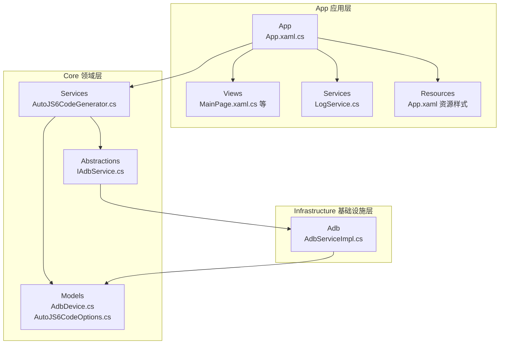
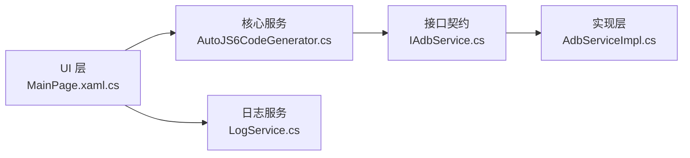
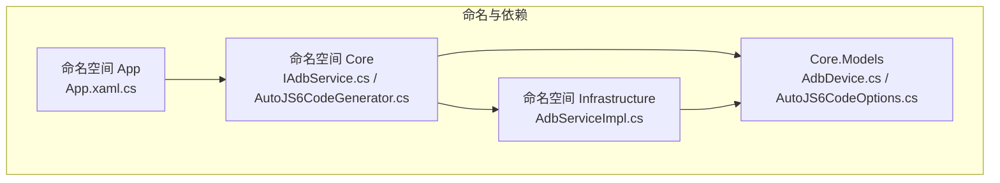

# 命名约定

<cite>
**本文引用的文件**
- [App.csproj](file://App/App.csproj)
- [Core.csproj](file://Core/Core.csproj)
- [Infrastructure.csproj](file://Infrastructure/Infrastructure.csproj)
- [App.xaml.cs](file://App/App.xaml.cs)
- [LogService.cs](file://App/Services/LogService.cs)
- [IAdbService.cs](file://Core/Abstractions/IAdbService.cs)
- [AutoJS6CodeGenerator.cs](file://Core/Services/AutoJS6CodeGenerator.cs)
- [AdbServiceImpl.cs](file://Infrastructure/Adb/AdbServiceImpl.cs)
- [MainPage.xaml.cs](file://App/Views/MainPage.xaml.cs)
- [AutoJS6CodeOptions.cs](file://Core/Models/AutoJS6CodeOptions.cs)
- [AdbDevice.cs](file://Core/Models/AdbDevice.cs)
- [launchSettings.json](file://App/Properties/launchSettings.json)
- [App.xaml](file://App/App.xaml)
</cite>

## 目录
1. [简介](#简介)
2. [项目结构](#项目结构)
3. [核心组件](#核心组件)
4. [架构总览](#架构总览)
5. [详细组件分析](#详细组件分析)
6. [依赖关系分析](#依赖关系分析)
7. [性能考量](#性能考量)
8. [故障排查指南](#故障排查指南)
9. [结论](#结论)
10. [附录](#附录)

## 简介
本文件为 AutoJS6 开发工具的命名约定文档，面向 C# 与 AutoJS6 脚本两类代码，给出统一、清晰且可落地的命名规范与示例，帮助团队在开发过程中保持一致性、提升可读性与可维护性。

## 项目结构
项目采用多项目分层结构，按关注点分离：
- App：应用层（UI、视图、服务、资源等）
- Core：领域层（抽象接口、模型、核心业务服务）
- Infrastructure：基础设施层（第三方集成、系统服务实现）

图表来源
- [App.xaml.cs:22-56](file://App/App.xaml.cs#L22-L56)
- [MainPage.xaml.cs:12-60](file://App/Views/MainPage.xaml.cs#L12-L60)
- [LogService.cs:3-50](file://App/Services/LogService.cs#L3-L50)
- [IAdbService.cs:3-56](file://Core/Abstractions/IAdbService.cs#L3-L56)
- [AutoJS6CodeGenerator.cs:5-11](file://Core/Services/AutoJS6CodeGenerator.cs#L5-L11)
- [AdbServiceImpl.cs:11-28](file://Infrastructure/Adb/AdbServiceImpl.cs#L11-L28)
- [AdbDevice.cs:1-37](file://Core/Models/AdbDevice.cs#L1-L37)
- [AutoJS6CodeOptions.cs:1-72](file://Core/Models/AutoJS6CodeOptions.cs#L1-L72)
- [App.xaml:7-76](file://App/App.xaml#L7-L76)

章节来源
- [App.csproj:1-84](file://App/App.csproj#L1-L84)
- [Core.csproj:1-10](file://Core/Core.csproj#L1-L10)
- [Infrastructure.csproj:1-19](file://Infrastructure/Infrastructure.csproj#L1-L19)

## 核心组件
- 命名约定总则
  - 类名与接口名：PascalCase
  - 方法名：PascalCase
  - 变量名：camelCase
  - 常量名：UPPER_SNAKE_CASE
  - 接口以大写 I 前缀命名（如 IAdbService）
  - 文件命名：项目文件与配置文件采用 PascalCase；资源文件采用语义化命名
  - 命名空间：按功能模块与层级划分，避免跨层引用
- AutoJS6 脚本命名
  - 变量命名：camelCase
  - 函数命名：camelCase
  - 模块命名：语义化、小驼峰，避免与内置 API 冲突
  - 脚本内避免在循环体内使用 const/let（Rhino 引擎限制），统一使用 var

章节来源
- [IAdbService.cs:8-56](file://Core/Abstractions/IAdbService.cs#L8-L56)
- [AutoJS6CodeGenerator.cs:226-258](file://Core/Services/AutoJS6CodeGenerator.cs#L226-L258)
- [MainPage.xaml.cs:37-39](file://App/Views/MainPage.xaml.cs#L37-L39)

## 架构总览
命名约定贯穿三层架构，确保接口契约清晰、实现稳定、调用一致。

图表来源
- [MainPage.xaml.cs:19-50](file://App/Views/MainPage.xaml.cs#L19-L50)
- [AutoJS6CodeGenerator.cs:11-11](file://Core/Services/AutoJS6CodeGenerator.cs#L11-L11)
- [IAdbService.cs:8-8](file://Core/Abstractions/IAdbService.cs#L8-L8)
- [AdbServiceImpl.cs:17-17](file://Infrastructure/Adb/AdbServiceImpl.cs#L17-L17)
- [LogService.cs:9-9](file://App/Services/LogService.cs#L9-L9)

## 详细组件分析

### 命名约定与示例对照
- 类与接口
  - 正例：IAdbService、AdbServiceImpl、AutoJS6CodeGenerator、LogService
  - 错例：不应出现 snake_case 或全小写类名
- 方法
  - 正例：ScanDevicesAsync、CaptureScreenshotAsync、GenerateImageModeCode
  - 错例：方法名应使用动词短语首字母大写
- 变量
  - 正例：_currentDevice、_selectedWidget、_templateFilePath
  - 错例：不应使用全大写或下划线风格
- 常量
  - 正例：MatchRegionPadding（在 MainPage 中定义为 const）
  - 错例：不应使用小驼峰或下划线
- 接口命名
  - 正例：IAdbService、ICodeGenerator、IOpenCVMatchService、IUiDumpParser
  - 错例：不以 I 前缀开头
- AutoJS6 脚本变量与函数
  - 正例：VariablePrefix、GenerateImageModeCode、GenerateWidgetModeCode
  - 错例：在循环体内使用 const/let（引擎限制）

章节来源
- [IAdbService.cs:8-56](file://Core/Abstractions/IAdbService.cs#L8-L56)
- [AdbServiceImpl.cs:17-17](file://Infrastructure/Adb/AdbServiceImpl.cs#L17-L17)
- [AutoJS6CodeGenerator.cs:11-11](file://Core/Services/AutoJS6CodeGenerator.cs#L11-L11)
- [LogService.cs:9-9](file://App/Services/LogService.cs#L9-L9)
- [MainPage.xaml.cs:41-41](file://App/Views/MainPage.xaml.cs#L41-L41)
- [AutoJS6CodeOptions.cs:31-31](file://Core/Models/AutoJS6CodeOptions.cs#L31-L31)

### 命名空间组织原则
- App：根命名空间为 App，子模块按 Views、Services、Models、Resources 划分
- Core：根命名空间为 Core，子模块按 Abstractions、Models、Services 划分
- Infrastructure：根命名空间为 Infrastructure，子模块按功能域划分（如 Adb、Imaging）
- 命名空间与项目/目录一一对应，避免跨层引用

章节来源
- [App.xaml.cs:22-27](file://App/App.xaml.cs#L22-L27)
- [Core.csproj:2-6](file://Core/Core.csproj#L2-L6)
- [Infrastructure.csproj:2-6](file://Infrastructure/Infrastructure.csproj#L2-L6)

### 文件命名规范
- 项目文件
  - 正例：App.csproj、Core.csproj、Infrastructure.csproj
  - 错例：不应使用下划线或全小写
- 配置文件
  - 正例：launchSettings.json（小写 json 合理）
  - 其他：.yaml/.md/.xml 等按文件类型语义命名
- 资源文件
  - 正例：App.xaml（XAML 资源字典）、样式键名语义化（如 WorkbenchCardBorderStyle）
  - 错例：避免无意义命名或与主题冲突

章节来源
- [App.csproj:1-84](file://App/App.csproj#L1-L84)
- [Core.csproj:1-10](file://Core/Core.csproj#L1-L10)
- [Infrastructure.csproj:1-19](file://Infrastructure/Infrastructure.csproj#L1-L19)
- [launchSettings.json:1-14](file://App/Properties/launchSettings.json#L1-L14)
- [App.xaml:7-76](file://App/App.xaml#L7-L76)

### AutoJS6 脚本命名约定
- 变量命名：camelCase（如 targetTemplate、targetFound）
- 函数命名：camelCase（如 GenerateImageModeCode、GenerateWidgetModeCode）
- 模块命名：语义化小驼峰（避免与内置 API 冲突）
- 循环体内限制：不得使用 const/let，统一使用 var（引擎限制）

章节来源
- [AutoJS6CodeGenerator.cs:13-166](file://Core/Services/AutoJS6CodeGenerator.cs#L13-L166)
- [AutoJS6CodeGenerator.cs:226-258](file://Core/Services/AutoJS6CodeGenerator.cs#L226-L258)

## 依赖关系分析
命名约定有助于降低耦合、增强可测试性与可维护性。

图表来源
- [App.xaml.cs:22-27](file://App/App.xaml.cs#L22-L27)
- [IAdbService.cs:3-8](file://Core/Abstractions/IAdbService.cs#L3-L8)
- [AutoJS6CodeGenerator.cs:5-11](file://Core/Services/AutoJS6CodeGenerator.cs#L5-L11)
- [AdbServiceImpl.cs:11-17](file://Infrastructure/Adb/AdbServiceImpl.cs#L11-L17)
- [AdbDevice.cs:1-6](file://Core/Models/AdbDevice.cs#L1-L6)
- [AutoJS6CodeOptions.cs:1-6](file://Core/Models/AutoJS6CodeOptions.cs#L1-L6)

章节来源
- [App.xaml.cs:22-56](file://App/App.xaml.cs#L22-L56)
- [IAdbService.cs:3-56](file://Core/Abstractions/IAdbService.cs#L3-L56)
- [AutoJS6CodeGenerator.cs:5-11](file://Core/Services/AutoJS6CodeGenerator.cs#L5-L11)
- [AdbServiceImpl.cs:11-28](file://Infrastructure/Adb/AdbServiceImpl.cs#L11-L28)
- [AdbDevice.cs:1-37](file://Core/Models/AdbDevice.cs#L1-L37)
- [AutoJS6CodeOptions.cs:1-72](file://Core/Models/AutoJS6CodeOptions.cs#L1-L72)

## 性能考量
- 命名本身不影响性能，但清晰的命名可减少理解成本，间接提升开发效率与质量
- 在 AutoJS6 脚本中避免在循环体内频繁声明变量（const/let），统一使用 var，有助于减少引擎开销

## 故障排查指南
- AutoJS6 脚本报错“循环体内禁止 const/let”
  - 现象：ValidateCode 返回错误，提示在循环体内使用了 const/let
  - 处理：将循环体内的 const/let 替换为 var
- 命名不一致导致的编译或运行问题
  - 现象：接口与实现命名不一致、命名空间不匹配
  - 处理：统一遵循 PascalCase/I 前缀、正确划分命名空间

章节来源
- [AutoJS6CodeGenerator.cs:226-258](file://Core/Services/AutoJS6CodeGenerator.cs#L226-L258)

## 结论
通过统一的命名约定，项目在 C# 与 AutoJS6 两方面实现了清晰、一致、可维护的代码风格。建议在团队内推广并纳入代码评审标准，持续保持一致性。

## 附录

### 命名约定速查表
- 类/接口：PascalCase；接口以 I 前缀
- 方法：PascalCase
- 变量：camelCase
- 常量：UPPER_SNAKE_CASE
- AutoJS6 变量/函数：camelCase；循环体内使用 var
- 文件：项目文件 PascalCase；配置/资源按类型语义命名
- 命名空间：按模块与层级划分，避免跨层引用

### 示例路径参考
- 接口与实现
  - [IAdbService.cs:8-56](file://Core/Abstractions/IAdbService.cs#L8-L56)
  - [AdbServiceImpl.cs:17-17](file://Infrastructure/Adb/AdbServiceImpl.cs#L17-L17)
- 核心服务与脚本生成
  - [AutoJS6CodeGenerator.cs:11-166](file://Core/Services/AutoJS6CodeGenerator.cs#L11-L166)
  - [AutoJS6CodeGenerator.cs:226-258](file://Core/Services/AutoJS6CodeGenerator.cs#L226-L258)
- UI 与日志
  - [MainPage.xaml.cs:19-50](file://App/Views/MainPage.xaml.cs#L19-L50)
  - [LogService.cs:9-9](file://App/Services/LogService.cs#L9-L9)
- 模型与选项
  - [AdbDevice.cs:6-37](file://Core/Models/AdbDevice.cs#L6-L37)
  - [AutoJS6CodeOptions.cs:6-72](file://Core/Models/AutoJS6CodeOptions.cs#L6-L72)
- 资源与配置
  - [App.xaml:7-76](file://App/App.xaml#L7-L76)
  - [launchSettings.json:1-14](file://App/Properties/launchSettings.json#L1-L14)