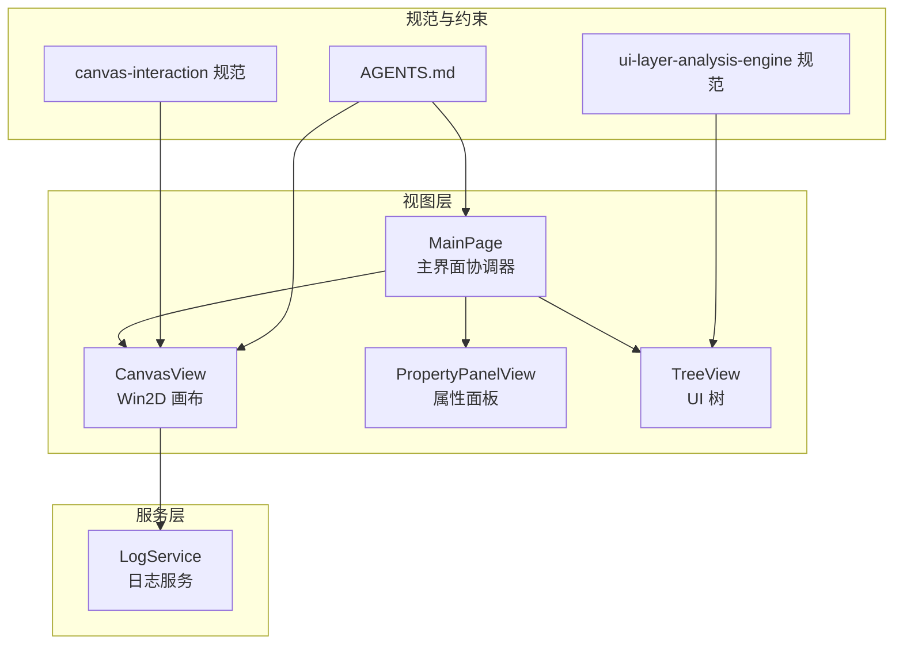
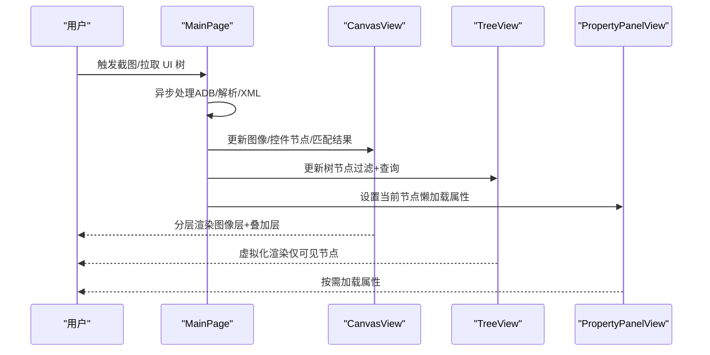
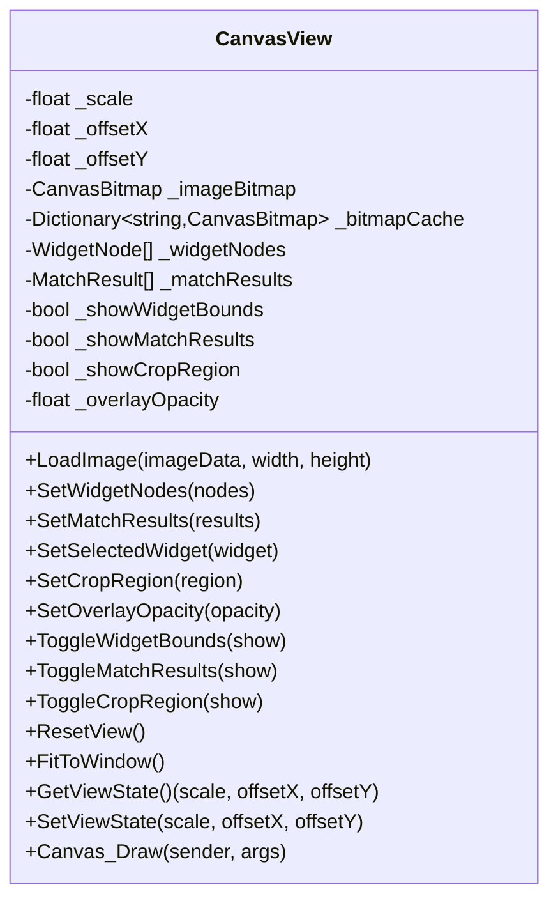
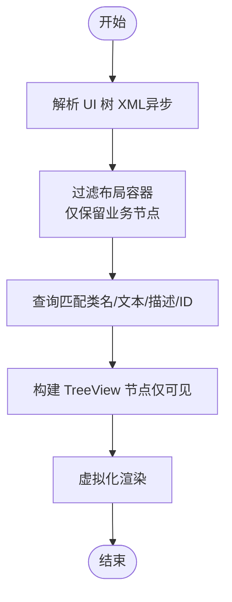
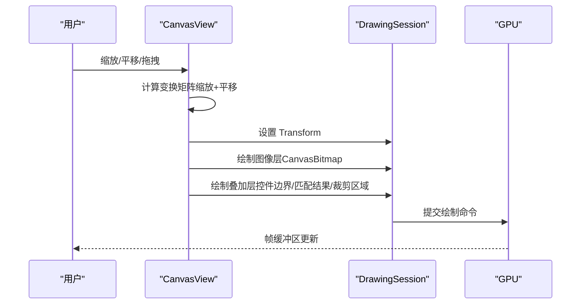
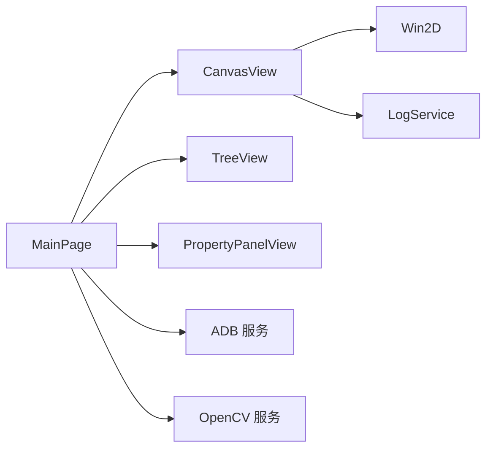

# UI 渲染性能优化

<cite>
**本文引用的文件**
- [CanvasView.xaml.cs](file://App/Views/CanvasView.xaml.cs)
- [CanvasView.xaml](file://App/Views/CanvasView.xaml)
- [MainPage.xaml.cs](file://App/Views/MainPage.xaml.cs)
- [MainPage.UiTree.cs](file://App/Views/MainPage.UiTree.cs)
- [PropertyPanelView.xaml.cs](file://App/Views/PropertyPanelView.xaml.cs)
- [LogService.cs](file://App/Services/LogService.cs)
- [canvas-interaction 规范](file://openspec/changes/winui3-visual-dev-toolkit/specs/canvas-interaction/spec.md)
- [ui-layer-analysis-engine 规范](file://openspec/changes/winui3-visual-dev-toolkit/specs/ui-layer-analysis-engine/spec.md)
- [AGENTS.md](file://AGENTS.md)
- [autojs6-image-match-helper.js](file://App/CodeTemplates/image/autojs6-image-match-helper.js)
</cite>

## 目录
1. [简介](#简介)
2. [项目结构](#项目结构)
3. [核心组件](#核心组件)
4. [架构总览](#架构总览)
5. [详细组件分析](#详细组件分析)
6. [依赖关系分析](#依赖关系分析)
7. [性能考量](#性能考量)
8. [故障排查指南](#故障排查指南)
9. [结论](#结论)
10. [附录](#附录)

## 简介
本指南面向 AutoJS6 开发工具的 UI 渲染性能优化，聚焦于 Canvas 渲染管线、分层渲染与状态管理、虚拟化技术（TreeView）、以及维持 60FPS 的策略与测试评估方法。文档结合现有实现与规范，提供可操作的优化建议与可视化图示，帮助在复杂 UI 场景下保持流畅体验。

## 项目结构
- 视图层
  - CanvasView：Win2D 画布，负责分层渲染（图像层 + 叠加层）、交互与状态管理
  - MainPage：主界面协调器，负责设备交互、UI 树解析与 Canvas 更新
  - PropertyPanelView：属性面板，按需加载当前节点属性
  - TreeView：UI 树展示，配合过滤与查询，支持大规模节点渲染
- 服务层
  - LogService：统一日志入口，便于性能观测与调试
- 规范与约束
  - canvas-interaction 规范：交互与渲染性能要求
  - ui-layer-analysis-engine 规范：虚拟化与异步解析要求
  - AGENTS.md：内存优化、渲染性能规则与工程约束

**图表来源**
- [CanvasView.xaml.cs:19-24](file://App/Views/CanvasView.xaml.cs#L19-L24)
- [MainPage.xaml.cs:14-21](file://App/Views/MainPage.xaml.cs#L14-L21)
- [PropertyPanelView.xaml.cs:9-12](file://App/Views/PropertyPanelView.xaml.cs#L9-L12)
- [canvas-interaction 规范:120-132](file://openspec/changes/winui3-visual-dev-toolkit/specs/canvas-interaction/spec.md#L120-L132)
- [ui-layer-analysis-engine 规范:117-134](file://openspec/changes/winui3-visual-dev-toolkit/specs/ui-layer-analysis-engine/spec.md#L117-L134)
- [AGENTS.md:229-248](file://AGENTS.md#L229-L248)

**章节来源**
- [CanvasView.xaml.cs:19-24](file://App/Views/CanvasView.xaml.cs#L19-L24)
- [MainPage.xaml.cs:14-21](file://App/Views/MainPage.xaml.cs#L14-L21)
- [PropertyPanelView.xaml.cs:9-12](file://App/Views/PropertyPanelView.xaml.cs#L9-L12)
- [canvas-interaction 规范:120-132](file://openspec/changes/winui3-visual-dev-toolkit/specs/canvas-interaction/spec.md#L120-L132)
- [ui-layer-analysis-engine 规范:117-134](file://openspec/changes/winui3-visual-dev-toolkit/specs/ui-layer-analysis-engine/spec.md#L117-L134)
- [AGENTS.md:229-248](file://AGENTS.md#L229-L248)

## 核心组件
- CanvasView（Win2D 画布）
  - 分层渲染：图像层（底层）+ 叠加层（上层），仅重绘变化图层
  - 状态管理：缩放、平移、旋转、裁剪区域、叠加层开关与透明度
  - 交互：滚轮缩放、拖拽平移、惯性滑动、裁剪模式
  - 缓存：CanvasBitmap 缓存池，避免重复纹理创建
- MainPage（主界面协调器）
  - 设备交互、截图与 UI 树拉取，异步处理避免阻塞
  - 与 CanvasView、PropertyPanelView、TreeView 协同
- PropertyPanelView（属性面板）
  - 懒加载：仅在选中节点时加载当前节点属性
- TreeView（UI 树）
  - 虚拟化：仅渲染可见节点，支持 5000+ 节点场景
  - 过滤：布局容器过滤，减少冗余节点
- LogService（日志服务）
  - 统一日志入口，便于性能观测与问题定位

**章节来源**
- [CanvasView.xaml.cs:35-116](file://App/Views/CanvasView.xaml.cs#L35-L116)
- [MainPage.xaml.cs:14-60](file://App/Views/MainPage.xaml.cs#L14-L60)
- [PropertyPanelView.xaml.cs:14-31](file://App/Views/PropertyPanelView.xaml.cs#L14-L31)
- [MainPage.UiTree.cs:116-140](file://App/Views/MainPage.UiTree.cs#L116-L140)
- [LogService.cs:9-33](file://App/Services/LogService.cs#L9-L33)

## 架构总览
AutoJS6 开发工具采用“主界面协调器 + 分层画布 + 虚拟化 UI 树”的架构，通过异步解析与缓存机制保证 60FPS 流畅渲染。

**图表来源**
- [MainPage.xaml.cs:147-248](file://App/Views/MainPage.xaml.cs#L147-L248)
- [CanvasView.xaml.cs:143-160](file://App/Views/CanvasView.xaml.cs#L143-L160)
- [MainPage.UiTree.cs:49-80](file://App/Views/MainPage.UiTree.cs#L49-L80)
- [PropertyPanelView.xaml.cs:24-28](file://App/Views/PropertyPanelView.xaml.cs#L24-L28)

## 详细组件分析

### CanvasView 组件分析（Win2D 分层渲染与状态管理）
- 分层渲染
  - 图像层：绘制 CanvasBitmap，应用缩放与平移变换
  - 叠加层：绘制控件边界框、匹配结果、裁剪区域，支持透明度与开关
- 状态管理
  - 缩放、平移、旋转、裁剪区域、叠加层开关、透明度
  - 视图状态持久化与恢复（缩放、偏移、旋转）
- 交互与惯性滑动
  - 滚轮缩放以光标为中心，缩放范围限制
  - 拖拽平移与惯性滑动，定时器驱动（约 60FPS）
- 缓存与性能
  - CanvasBitmap 缓存池，避免重复纹理创建
  - 仅在状态变化时调用 Invalidate 触发重绘

**图表来源**
- [CanvasView.xaml.cs:35-116](file://App/Views/CanvasView.xaml.cs#L35-L116)
- [CanvasView.xaml.cs:568-627](file://App/Views/CanvasView.xaml.cs#L568-L627)

**章节来源**
- [CanvasView.xaml.cs:35-116](file://App/Views/CanvasView.xaml.cs#L35-L116)
- [CanvasView.xaml.cs:358-426](file://App/Views/CanvasView.xaml.cs#L358-L426)
- [CanvasView.xaml.cs:568-627](file://App/Views/CanvasView.xaml.cs#L568-L627)
- [canvas-interaction 规范:120-132](file://openspec/changes/winui3-visual-dev-toolkit/specs/canvas-interaction/spec.md#L120-L132)

### TreeView 组件分析（UI 虚拟化与大数据集渲染）
- 虚拟化
  - 仅渲染可见节点，支持 5000+ 节点场景
- 过滤与查询
  - 布局容器过滤：仅保留具备业务特征的节点
  - 查询匹配：按类名、文本、内容描述、资源 ID 搜索
- 懒加载
  - 属性面板按需加载当前节点属性，避免预加载

**图表来源**
- [MainPage.UiTree.cs:82-114](file://App/Views/MainPage.UiTree.cs#L82-L114)
- [MainPage.UiTree.cs:116-140](file://App/Views/MainPage.UiTree.cs#L116-L140)
- [ui-layer-analysis-engine 规范:117-134](file://openspec/changes/winui3-visual-dev-toolkit/specs/ui-layer-analysis-engine/spec.md#L117-L134)

**章节来源**
- [MainPage.UiTree.cs:82-140](file://App/Views/MainPage.UiTree.cs#L82-L140)
- [PropertyPanelView.xaml.cs:24-28](file://App/Views/PropertyPanelView.xaml.cs#L24-L28)
- [ui-layer-analysis-engine 规范:117-134](file://openspec/changes/winui3-visual-dev-toolkit/specs/ui-layer-analysis-engine/spec.md#L117-L134)

### 交互与渲染流程（Canvas 绘制序列）

**图表来源**
- [CanvasView.xaml.cs:572-627](file://App/Views/CanvasView.xaml.cs#L572-L627)

**章节来源**
- [CanvasView.xaml.cs:572-627](file://App/Views/CanvasView.xaml.cs#L572-L627)

## 依赖关系分析
- 组件耦合
  - MainPage 作为协调器，依赖 CanvasView、TreeView、PropertyPanelView
  - CanvasView 依赖 Win2D（CanvasControl/CanvasBitmap）与日志服务
  - TreeView 依赖过滤与查询逻辑，支持虚拟化
- 外部依赖
  - Win2D：分层渲染与 GPU 加速
  - ADB/OpenCV：异步 I/O 与计算
  - 规范与约束：确保 60FPS 与虚拟化要求

**图表来源**
- [MainPage.xaml.cs:19-50](file://App/Views/MainPage.xaml.cs#L19-L50)
- [CanvasView.xaml.cs:1-16](file://App/Views/CanvasView.xaml.cs#L1-L16)
- [LogService.cs:9-33](file://App/Services/LogService.cs#L9-L33)

**章节来源**
- [MainPage.xaml.cs:19-50](file://App/Views/MainPage.xaml.cs#L19-L50)
- [CanvasView.xaml.cs:1-16](file://App/Views/CanvasView.xaml.cs#L1-L16)
- [LogService.cs:9-33](file://App/Services/LogService.cs#L9-L33)

## 性能考量
- 60FPS 保持策略
  - 分层渲染：图像层与叠加层分离，仅重绘变化图层
  - 定时器驱动惯性滑动（约 60FPS），衰减系数与速度阈值控制
  - 缓存机制：CanvasBitmap 缓存池，限制最大缓存数量
  - 异步架构：ADB 截图、OpenCV 匹配、UI 树解析均为异步
- 渲染循环优化
  - 仅在状态变化时调用 Invalidate，避免无效重绘
  - 叠加层绘制前应用相同变换矩阵，减少重复计算
- 帧率监控与调优
  - 使用日志服务记录绘制与状态变化，辅助性能观测
  - 通过规范约束（Win2D 分层渲染管线）确保交互流畅
- 虚拟化与大数据集
  - TreeView 启用虚拟化，仅渲染可见节点
  - 布局容器过滤减少冗余节点，提升渲染效率
- 测试与评估
  - 性能测试方法：在不同分辨率与节点规模下测量帧率与延迟
  - 评估指标：平均帧率、P95 帧率、CPU/GPU 占用、内存峰值、卡顿次数

**章节来源**
- [CanvasView.xaml.cs:95-138](file://App/Views/CanvasView.xaml.cs#L95-L138)
- [CanvasView.xaml.cs:448-456](file://App/Views/CanvasView.xaml.cs#L448-L456)
- [MainPage.xaml.cs:147-248](file://App/Views/MainPage.xaml.cs#L147-L248)
- [AGENTS.md:229-248](file://AGENTS.md#L229-L248)
- [canvas-interaction 规范:120-132](file://openspec/changes/winui3-visual-dev-toolkit/specs/canvas-interaction/spec.md#L120-L132)
- [ui-layer-analysis-engine 规范:117-134](file://openspec/changes/winui3-visual-dev-toolkit/specs/ui-layer-analysis-engine/spec.md#L117-L134)

## 故障排查指南
- 绘制异常
  - CanvasBitmap 被释放导致绘制失败：捕获 ObjectDisposedException 并跳过本次绘制
  - 叠加层绘制前重置变换矩阵，避免叠加错误
- 性能问题
  - 检查缓存池大小与命中率，避免频繁创建纹理
  - 确认仅在状态变化时调用 Invalidate
  - 使用日志服务观察绘制与状态变化频率
- 交互问题
  - 惯性滑动定时器间隔约为 60FPS，检查衰减系数与速度阈值
  - 缩放范围限制与滚轮缩放中心点逻辑
- 虚拟化问题
  - TreeView 节点过滤与查询逻辑是否正确
  - 属性面板懒加载是否生效

**章节来源**
- [CanvasView.xaml.cs:590-594](file://App/Views/CanvasView.xaml.cs#L590-L594)
- [CanvasView.xaml.cs:625-627](file://App/Views/CanvasView.xaml.cs#L625-L627)
- [CanvasView.xaml.cs:448-456](file://App/Views/CanvasView.xaml.cs#L448-L456)
- [MainPage.UiTree.cs:116-140](file://App/Views/MainPage.UiTree.cs#L116-L140)
- [PropertyPanelView.xaml.cs:24-28](file://App/Views/PropertyPanelView.xaml.cs#L24-L28)
- [LogService.cs:39-49](file://App/Services/LogService.cs#L39-L49)

## 结论
通过分层渲染、CanvasBitmap 缓存、虚拟化与懒加载等策略，AutoJS6 开发工具在复杂 UI 场景下实现了 60FPS 流畅渲染。结合异步架构与规范约束，系统在大数据集与高频交互场景中仍能保持稳定性能。建议持续利用日志与规范进行性能观测与优化迭代。

## 附录
- 相关实现与规范路径
  - CanvasView：[CanvasView.xaml.cs:568-627](file://App/Views/CanvasView.xaml.cs#L568-L627)
  - TreeView 虚拟化与过滤：[MainPage.UiTree.cs:82-140](file://App/Views/MainPage.UiTree.cs#L82-L140)
  - 属性面板懒加载：[PropertyPanelView.xaml.cs:24-28](file://App/Views/PropertyPanelView.xaml.cs#L24-L28)
  - 60FPS 与分层渲染要求：[canvas-interaction 规范:120-132](file://openspec/changes/winui3-visual-dev-toolkit/specs/canvas-interaction/spec.md#L120-L132)
  - 大规模节点渲染与异步解析：[ui-layer-analysis-engine 规范:117-134](file://openspec/changes/winui3-visual-dev-toolkit/specs/ui-layer-analysis-engine/spec.md#L117-L134)
  - 内存优化与渲染性能规则：[AGENTS.md:229-248](file://AGENTS.md#L229-L248)
  - 图像匹配辅助脚本（性能相关参考）：[autojs6-image-match-helper.js:333-368](file://App/CodeTemplates/image/autojs6-image-match-helper.js#L333-L368)