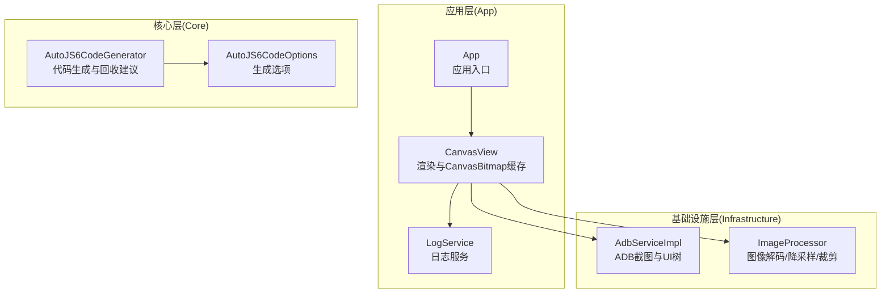
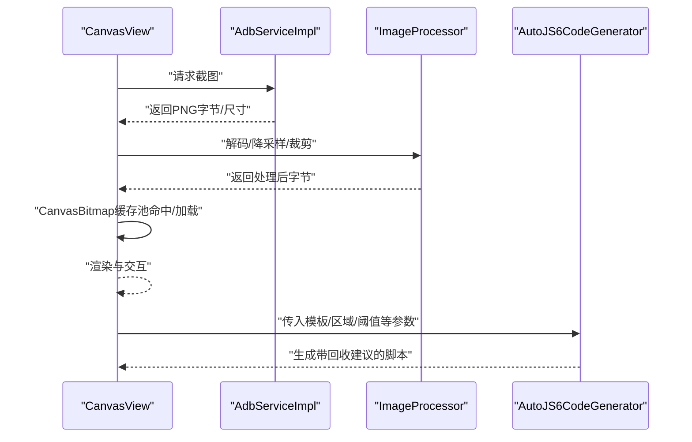
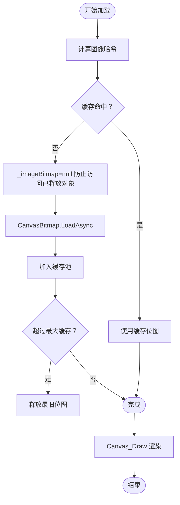
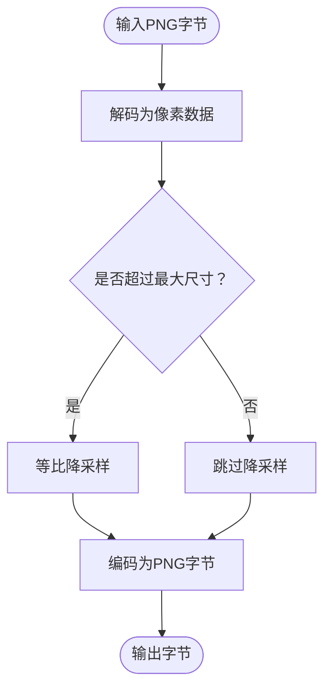
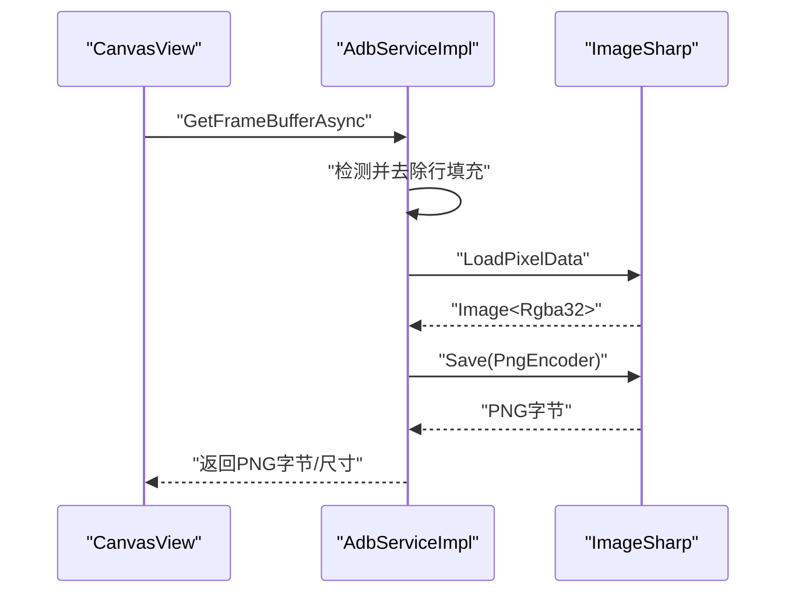
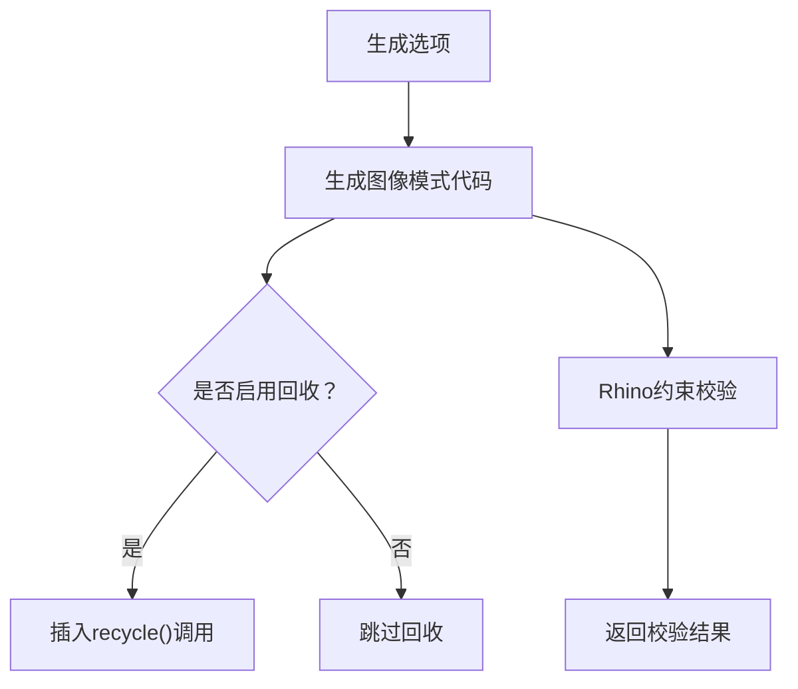
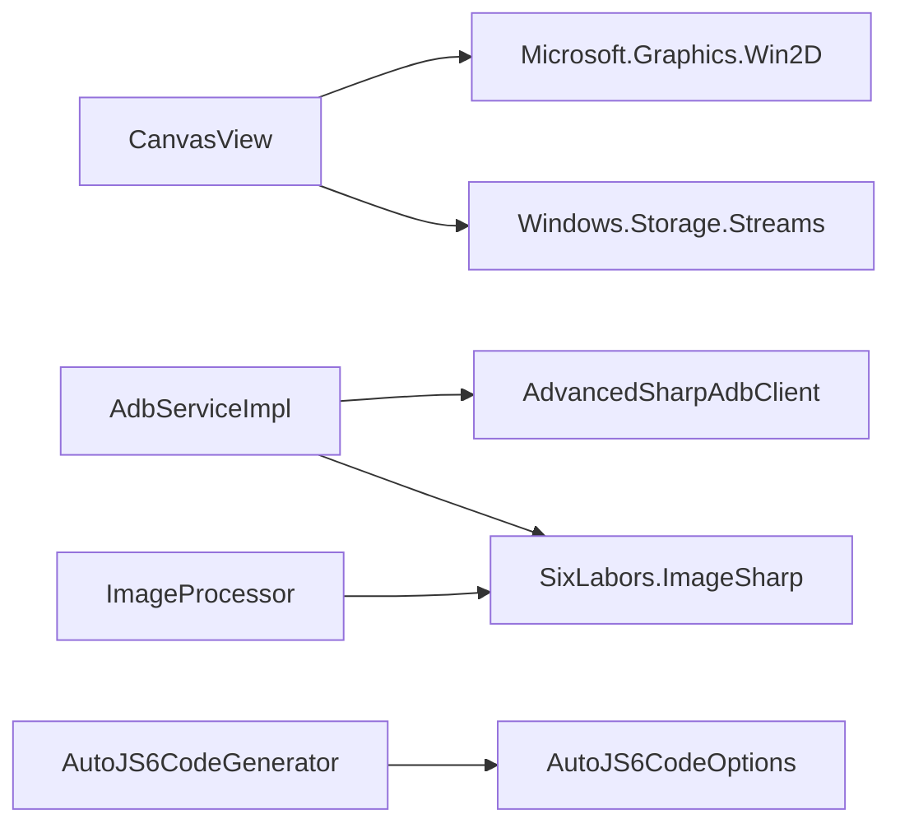

# 内存管理优化

<cite>
**本文档引用的文件**
- [App/Views/CanvasView.xaml.cs](file://App/Views/CanvasView.xaml.cs)
- [Infrastructure/Imaging/ImageProcessor.cs](file://Infrastructure/Imaging/ImageProcessor.cs)
- [Infrastructure/Adb/AdbServiceImpl.cs](file://Infrastructure/Adb/AdbServiceImpl.cs)
- [Core/Services/AutoJS6CodeGenerator.cs](file://Core/Services/AutoJS6CodeGenerator.cs)
- [Core/Models/AutoJS6CodeOptions.cs](file://Core/Models/AutoJS6CodeOptions.cs)
- [App/Services/LogService.cs](file://App/Services/LogService.cs)
- [App/App.xaml.cs](file://App/App.xaml.cs)
- [README.md](file://README.md)
</cite>

## 目录
1. [简介](#简介)
2. [项目结构](#项目结构)
3. [核心组件](#核心组件)
4. [架构总览](#架构总览)
5. [详细组件分析](#详细组件分析)
6. [依赖关系分析](#依赖关系分析)
7. [性能考量](#性能考量)
8. [故障排查指南](#故障排查指南)
9. [结论](#结论)
10. [附录](#附录)

## 简介
本指南聚焦于 AutoJS6 开发工具的内存管理优化，围绕以下主题展开：
- 对象生命周期管理策略：重点覆盖 CanvasBitmap 缓存池、图像纹理的重复创建避免与及时释放机制
- 垃圾回收优化技巧：大对象分配控制、弱引用使用与内存泄漏预防
- 内存监控与性能分析：结合现有日志体系与渲染管线，给出可落地的监控方法
- AutoJS6 脚本侧内存优化：OOM 预防规则、临时对象回收与资源管理最佳实践

## 项目结构
该工具采用 Clean Architecture 分层设计，核心关注点如下：
- App 层：WinUI 3 视图与交互，包含 CanvasView 的渲染与缓存逻辑
- Infrastructure 层：外部依赖适配（ADB、图像处理）
- Core 层：纯业务逻辑（代码生成、模型）

**图表来源**
- [App/Views/CanvasView.xaml.cs:1-1307](file://App/Views/CanvasView.xaml.cs#L1-L1307)
- [Infrastructure/Adb/AdbServiceImpl.cs:1-238](file://Infrastructure/Adb/AdbServiceImpl.cs#L1-L238)
- [Infrastructure/Imaging/ImageProcessor.cs:1-162](file://Infrastructure/Imaging/ImageProcessor.cs#L1-L162)
- [Core/Services/AutoJS6CodeGenerator.cs:1-357](file://Core/Services/AutoJS6CodeGenerator.cs#L1-L357)
- [Core/Models/AutoJS6CodeOptions.cs:1-89](file://Core/Models/AutoJS6CodeOptions.cs#L1-L89)
- [App/Services/LogService.cs:1-51](file://App/Services/LogService.cs#L1-L51)
- [App/App.xaml.cs:1-57](file://App/App.xaml.cs#L1-L57)

**章节来源**
- [README.md:230-300](file://README.md#L230-L300)

## 核心组件
- CanvasView：负责图像加载、CanvasBitmap 缓存池、渲染与交互；是内存优化的关键入口
- ImageProcessor：提供 PNG 解码、降采样、裁剪与元数据生成，涉及大对象内存分配
- AdbServiceImpl：通过 ADB 拉取帧缓冲，可能产生大尺寸像素数据
- AutoJS6CodeGenerator：生成 AutoJS6 脚本，内置图像回收建议与 Rhino 引擎约束校验
- LogService：统一日志入口，便于定位内存问题与性能瓶颈

**章节来源**
- [App/Views/CanvasView.xaml.cs:358-456](file://App/Views/CanvasView.xaml.cs#L358-L456)
- [Infrastructure/Imaging/ImageProcessor.cs:18-161](file://Infrastructure/Imaging/ImageProcessor.cs#L18-L161)
- [Infrastructure/Adb/AdbServiceImpl.cs:72-138](file://Infrastructure/Adb/AdbServiceImpl.cs#L72-L138)
- [Core/Services/AutoJS6CodeGenerator.cs:13-102](file://Core/Services/AutoJS6CodeGenerator.cs#L13-L102)
- [App/Services/LogService.cs:9-50](file://App/Services/LogService.cs#L9-L50)

## 架构总览
渲染与内存流程序列（从设备到脚本生成）：

**图表来源**
- [App/Views/CanvasView.xaml.cs:358-426](file://App/Views/CanvasView.xaml.cs#L358-L426)
- [Infrastructure/Adb/AdbServiceImpl.cs:72-118](file://Infrastructure/Adb/AdbServiceImpl.cs#L72-L118)
- [Infrastructure/Imaging/ImageProcessor.cs:18-100](file://Infrastructure/Imaging/ImageProcessor.cs#L18-L100)
- [Core/Services/AutoJS6CodeGenerator.cs:13-102](file://Core/Services/AutoJS6CodeGenerator.cs#L13-L102)

## 详细组件分析

### CanvasView：CanvasBitmap 缓存池与生命周期管理
- 缓存池设计
  - 使用字典维护 CanvasBitmap，键为图像哈希，值为位图对象
  - 最大缓存数量限制，超过上限时移除最旧项并显式释放
- 生命周期策略
  - 加载前清空当前位图引用，避免渲染阶段访问已释放对象
  - 成功加载后加入缓存；失败则清理数据
  - 渲染阶段捕获对象已释放异常，优雅跳过绘制
  - 提供显式清理接口，释放所有缓存位图
- 性能与内存
  - 避免重复创建纹理，显著降低 GPU 内存占用
  - 通过哈希键快速判断是否复用，减少 CPU 与 GPU 往返

**图表来源**
- [App/Views/CanvasView.xaml.cs:358-426](file://App/Views/CanvasView.xaml.cs#L358-L426)
- [App/Views/CanvasView.xaml.cs:572-627](file://App/Views/CanvasView.xaml.cs#L572-L627)

**章节来源**
- [App/Views/CanvasView.xaml.cs:358-456](file://App/Views/CanvasView.xaml.cs#L358-L456)
- [App/Views/CanvasView.xaml.cs:572-627](file://App/Views/CanvasView.xaml.cs#L572-L627)

### ImageProcessor：大对象分配与释放
- 关键路径
  - PNG 解码：将像素数据拷贝至托管数组，注意内存峰值
  - 降采样：根据最大尺寸等比缩放，减少后续处理与渲染开销
  - 裁剪：在内存中进行区域裁剪，生成新的 PNG 字节
- 内存优化要点
  - 使用流式写入与异步加载，避免长时间持有大数组
  - 优先进行降采样，降低后续 CanvasBitmap 创建成本
  - 裁剪后立即释放中间对象，减少峰值内存

**图表来源**
- [Infrastructure/Imaging/ImageProcessor.cs:18-100](file://Infrastructure/Imaging/ImageProcessor.cs#L18-L100)

**章节来源**
- [Infrastructure/Imaging/ImageProcessor.cs:18-161](file://Infrastructure/Imaging/ImageProcessor.cs#L18-L161)

### AdbServiceImpl：帧缓冲与像素数据处理
- 截图流程
  - 通过 ADB 获取帧缓冲，处理行填充与像素格式
  - 使用图像库转换为 PNG 字节，返回给上层
- 内存注意事项
  - 帧缓冲数据可能包含行填充，需去填充后提取有效像素
  - 大尺寸屏幕会产生巨大像素数组，应尽快转换为 PNG 或释放

**图表来源**
- [Infrastructure/Adb/AdbServiceImpl.cs:72-118](file://Infrastructure/Adb/AdbServiceImpl.cs#L72-L118)

**章节来源**
- [Infrastructure/Adb/AdbServiceImpl.cs:72-118](file://Infrastructure/Adb/AdbServiceImpl.cs#L72-L118)

### AutoJS6CodeGenerator：脚本侧内存回收与约束
- 回收建议
  - 生成脚本时插入图像回收调用，防止 OOM
- Rhino 引擎约束
  - 校验循环体内禁止使用 const/let，改用 var，避免变量绑定问题导致的隐性内存占用

**图表来源**
- [Core/Services/AutoJS6CodeGenerator.cs:13-102](file://Core/Services/AutoJS6CodeGenerator.cs#L13-L102)
- [Core/Services/AutoJS6CodeGenerator.cs:226-258](file://Core/Services/AutoJS6CodeGenerator.cs#L226-L258)

**章节来源**
- [Core/Services/AutoJS6CodeGenerator.cs:13-102](file://Core/Services/AutoJS6CodeGenerator.cs#L13-L102)
- [Core/Services/AutoJS6CodeGenerator.cs:226-258](file://Core/Services/AutoJS6CodeGenerator.cs#L226-L258)
- [Core/Models/AutoJS6CodeOptions.cs:64-66](file://Core/Models/AutoJS6CodeOptions.cs#L64-L66)

### 日志与监控：定位内存问题
- LogService 提供统一日志入口，可用于：
  - 记录 CanvasBitmap 加载/缓存命中/释放事件
  - 记录渲染阶段的异常（如对象已释放）以辅助诊断
  - 记录图像处理关键步骤的时间点，评估性能瓶颈

**章节来源**
- [App/Services/LogService.cs:9-50](file://App/Services/LogService.cs#L9-L50)
- [App/Views/CanvasView.xaml.cs:572-627](file://App/Views/CanvasView.xaml.cs#L572-L627)

## 依赖关系分析
- App/Views/CanvasView.xaml.cs 依赖：
  - Microsoft.Graphics.Canvas（Win2D）进行 GPU 加速渲染
  - Windows.Storage.Streams（InMemoryRandomAccessStream）进行像素数据处理
- Infrastructure/Adb/AdbServiceImpl.cs 依赖：
  - AdvancedSharpAdbClient（ADB 通信）
  - SixLabors.ImageSharp（像素数据转换）
- Infrastructure/Imaging/ImageProcessor.cs 依赖：
  - SixLabors.ImageSharp（图像处理）
- Core/Services/AutoJS6CodeGenerator.cs 依赖：
  - Core/Models/AutoJS6CodeOptions（生成配置）

**图表来源**
- [App/Views/CanvasView.xaml.cs:1-15](file://App/Views/CanvasView.xaml.cs#L1-L15)
- [Infrastructure/Adb/AdbServiceImpl.cs:1-10](file://Infrastructure/Adb/AdbServiceImpl.cs#L1-L10)
- [Infrastructure/Imaging/ImageProcessor.cs:1-6](file://Infrastructure/Imaging/ImageProcessor.cs#L1-L6)
- [Core/Services/AutoJS6CodeGenerator.cs:1-4](file://Core/Services/AutoJS6CodeGenerator.cs#L1-L4)
- [Core/Models/AutoJS6CodeOptions.cs:1-1](file://Core/Models/AutoJS6CodeOptions.cs#L1-L1)

**章节来源**
- [App/Views/CanvasView.xaml.cs:1-15](file://App/Views/CanvasView.xaml.cs#L1-L15)
- [Infrastructure/Adb/AdbServiceImpl.cs:1-10](file://Infrastructure/Adb/AdbServiceImpl.cs#L1-L10)
- [Infrastructure/Imaging/ImageProcessor.cs:1-6](file://Infrastructure/Imaging/ImageProcessor.cs#L1-L6)
- [Core/Services/AutoJS6CodeGenerator.cs:1-4](file://Core/Services/AutoJS6CodeGenerator.cs#L1-L4)
- [Core/Models/AutoJS6CodeOptions.cs:1-1](file://Core/Models/AutoJS6CodeOptions.cs#L1-L1)

## 性能考量
- 渲染性能
  - 使用双层渲染（图像层 + Overlay 层），减少不必要的重绘
  - 通过变换矩阵一次性应用缩放与平移，避免逐像素计算
- 内存效率
  - CanvasBitmap 缓存池限制数量，避免无限增长
  - 降采样优先，降低像素数据体积
  - 及时释放不再使用的位图与中间对象
- I/O 与异步
  - 所有外部 I/O（ADB、图像处理）均采用异步，避免阻塞 UI 线程

**章节来源**
- [App/Views/CanvasView.xaml.cs:568-627](file://App/Views/CanvasView.xaml.cs#L568-L627)
- [Infrastructure/Imaging/ImageProcessor.cs:47-72](file://Infrastructure/Imaging/ImageProcessor.cs#L47-L72)
- [README.md:282-287](file://README.md#L282-L287)

## 故障排查指南
- 现象：渲染时出现“对象已释放”异常
  - 排查：确认 Canvas_Draw 中对位图的访问是否在加载/释放过程中发生竞态
  - 处理：确保加载前将当前位图引用置空，并在缓存池中保留引用副本
- 现象：内存持续增长，最终 OOM
  - 排查：检查缓存池是否正确移除最旧项并释放
  - 处理：调用显式清理接口，或在切换图像时主动清空缓存
- 现象：图像处理耗时过长
  - 排查：确认是否进行了不必要的降采样或多次解码
  - 处理：在 UI 层面限制最大尺寸，或在生成脚本时启用区域匹配

**章节来源**
- [App/Views/CanvasView.xaml.cs:378-416](file://App/Views/CanvasView.xaml.cs#L378-L416)
- [App/Views/CanvasView.xaml.cs:589-594](file://App/Views/CanvasView.xaml.cs#L589-L594)

## 结论
通过在 CanvasView 中实施 CanvasBitmap 缓存池、在 ImageProcessor 中控制大对象分配、在 AdbServiceImpl 中高效处理像素数据，以及在 AutoJS6CodeGenerator 中提供脚本侧回收建议，本工具形成了从 UI 渲染到脚本执行的全链路内存优化方案。配合 LogService 的统一日志与 README 的 OOM 预防规则，开发者可以更稳健地构建高性能的 AutoJS6 自动化工作流。

## 附录

### AutoJS6 脚本内存优化建议（基于仓库约束）
- OOM 预防规则
  - 单次迭代只调用一次截图函数
  - 尽量缩小场景检测范围，避免全屏扫描
  - 优先使用区域匹配而非全屏匹配
  - 使用完图像对象后立即回收
- 临时对象与资源管理
  - 在循环体内使用 var 替代 const/let，避免变量绑定问题
  - 生成脚本时启用图像回收选项
  - 生成脚本时可选重试与超时逻辑，避免长时间占用资源

**章节来源**
- [README.md:362-368](file://README.md#L362-L368)
- [Core/Services/AutoJS6CodeGenerator.cs:226-258](file://Core/Services/AutoJS6CodeGenerator.cs#L226-L258)
- [Core/Models/AutoJS6CodeOptions.cs:64-66](file://Core/Models/AutoJS6CodeOptions.cs#L64-L66)