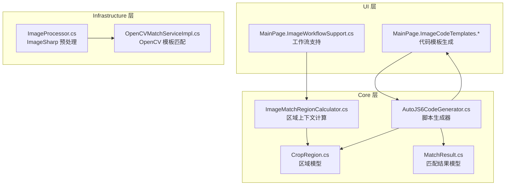
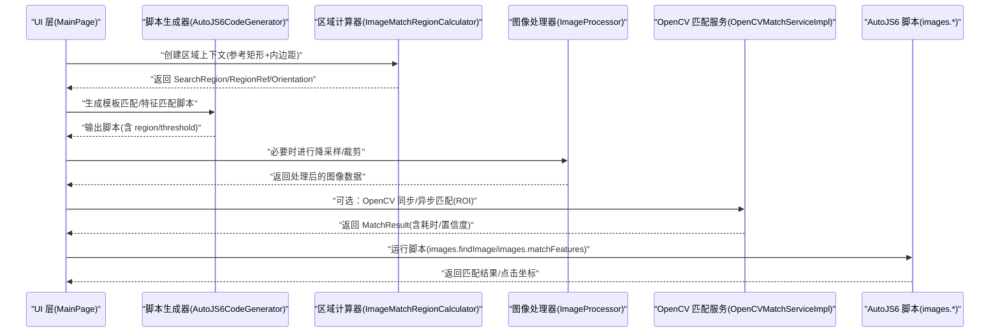
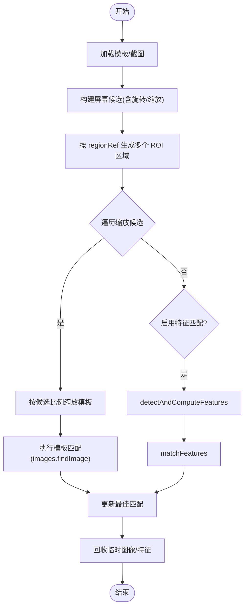
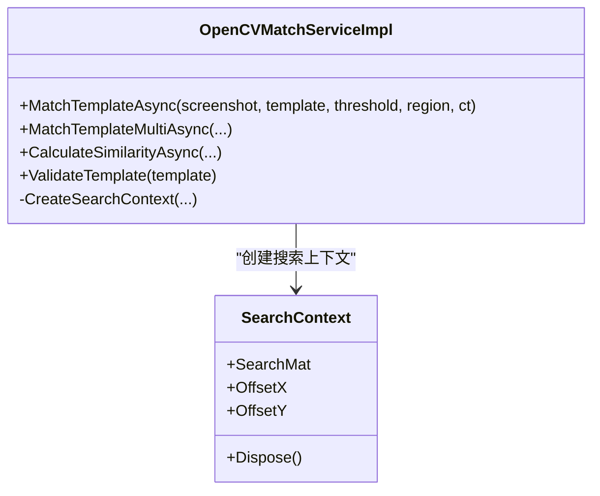
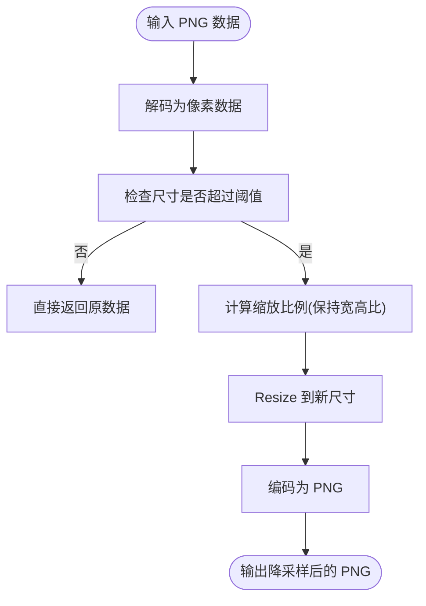
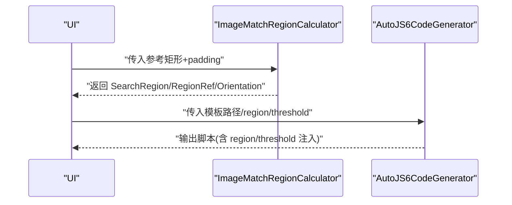
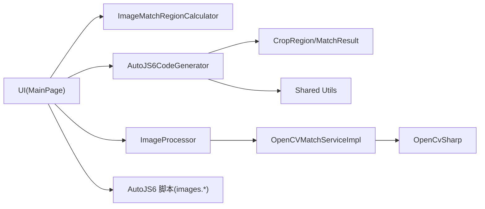

# 图像处理性能优化

<cite>
**本文引用的文件**
- [autojs6-image-match-helper.js](file://App/CodeTemplates/image/autojs6-image-match-helper.js)
- [OpenCVMatchServiceImpl.cs](file://Infrastructure/Imaging/OpenCVMatchServiceImpl.cs)
- [ImageProcessor.cs](file://Infrastructure/Imaging/ImageProcessor.cs)
- [AutoJS6CodeGenerator.cs](file://Core/Services/AutoJS6CodeGenerator.cs)
- [ImageMatchRegionCalculator.cs](file://Core/Helpers/ImageMatchRegionCalculator.cs)
- [CropRegion.cs](file://Core/Models/CropRegion.cs)
- [MatchResult.cs](file://Core/Models/MatchResult.cs)
- [MainPage.ImageCodeTemplates.NativeMatchTemplate.cs](file://App/Views/MainPage.ImageCodeTemplates.NativeMatchTemplate.cs)
- [MainPage.ImageCodeTemplates.NativeMatchFeature.cs](file://App/Views/MainPage.ImageCodeTemplates.NativeMatchFeature.cs)
- [MainPage.ImageCodeTemplates.Shared.cs](file://App/Views/MainPage.ImageCodeTemplates.Shared.cs)
- [MainPage.ImageWorkflowSupport.cs](file://App/Views/MainPage.ImageWorkflowSupport.cs)
</cite>

## 目录
1. [简介](#简介)
2. [项目结构](#项目结构)
3. [核心组件](#核心组件)
4. [架构总览](#架构总览)
5. [详细组件分析](#详细组件分析)
6. [依赖关系分析](#依赖关系分析)
7. [性能考量](#性能考量)
8. [故障排查指南](#故障排查指南)
9. [结论](#结论)
10. [附录](#附录)

## 简介
本文件面向 AutoJS6 开发工具的图像处理性能优化，系统性梳理了从模板匹配、图像预处理、ROI 区域处理到脚本生成与运行时优化的完整链路。重点涵盖：
- OpenCV 模板匹配算法的高效使用与参数调优
- 图像预处理加速与 ROI 区域处理策略
- 图像缓存与资源回收（纹理/特征）策略
- GPU 加速与并行处理思路（Win2D/硬件加速与线程池）
- 性能测试方法与瓶颈识别技巧
- AutoJS6 脚本中的图像识别优化实践

## 项目结构
该仓库采用分层架构：UI 层负责交互与代码模板生成；Core 层提供模型与辅助计算；Infrastructure 层承载图像处理与 OpenCV 匹配服务；App 层整合 UI 与模板。

**图表来源**
- [MainPage.ImageCodeTemplates.NativeMatchTemplate.cs:1-34](file://App/Views/MainPage.ImageCodeTemplates.NativeMatchTemplate.cs#L1-L34)
- [MainPage.ImageCodeTemplates.NativeMatchFeature.cs:1-29](file://App/Views/MainPage.ImageCodeTemplates.NativeMatchFeature.cs#L1-L29)
- [MainPage.ImageCodeTemplates.Shared.cs:1-86](file://App/Views/MainPage.ImageCodeTemplates.Shared.cs#L1-L86)
- [ImageMatchRegionCalculator.cs:1-99](file://Core/Helpers/ImageMatchRegionCalculator.cs#L1-L99)
- [CropRegion.cs:1-53](file://Core/Models/CropRegion.cs#L1-L53)
- [MatchResult.cs:1-63](file://Core/Models/MatchResult.cs#L1-L63)
- [AutoJS6CodeGenerator.cs:1-357](file://Core/Services/AutoJS6CodeGenerator.cs#L1-L357)
- [ImageProcessor.cs:1-162](file://Infrastructure/Imaging/ImageProcessor.cs#L1-L162)
- [OpenCVMatchServiceImpl.cs:1-204](file://Infrastructure/Imaging/OpenCVMatchServiceImpl.cs#L1-L204)

**章节来源**
- [MainPage.ImageCodeTemplates.NativeMatchTemplate.cs:1-34](file://App/Views/MainPage.ImageCodeTemplates.NativeMatchTemplate.cs#L1-L34)
- [MainPage.ImageCodeTemplates.NativeMatchFeature.cs:1-29](file://App/Views/MainPage.ImageCodeTemplates.NativeMatchFeature.cs#L1-L29)
- [MainPage.ImageCodeTemplates.Shared.cs:1-86](file://App/Views/MainPage.ImageCodeTemplates.Shared.cs#L1-L86)
- [ImageMatchRegionCalculator.cs:1-99](file://Core/Helpers/ImageMatchRegionCalculator.cs#L1-L99)
- [CropRegion.cs:1-53](file://Core/Models/CropRegion.cs#L1-L53)
- [MatchResult.cs:1-63](file://Core/Models/MatchResult.cs#L1-L63)
- [AutoJS6CodeGenerator.cs:1-357](file://Core/Services/AutoJS6CodeGenerator.cs#L1-L357)
- [ImageProcessor.cs:1-162](file://Infrastructure/Imaging/ImageProcessor.cs#L1-L162)
- [OpenCVMatchServiceImpl.cs:1-204](file://Infrastructure/Imaging/OpenCVMatchServiceImpl.cs#L1-L204)

## 核心组件
- 模板匹配与脚本生成：UI 层通过模板生成器输出 AutoJS6 脚本，支持“模板匹配”和“特征匹配”两种模式，并自动注入 ROI 区域与阈值参数。
- 区域上下文计算：根据参考矩形与内边距生成搜索区域与归一化 regionRef，确保跨设备适配。
- OpenCV 匹配服务：提供同步/异步模板匹配、多点匹配、相似度计算与模板校验，支持 ROI 切片与计时统计。
- 图像预处理：基于 ImageSharp 的 PNG 解码、降采样、裁剪与元数据生成，降低后续匹配成本。
- 资源回收：脚本侧显式回收图像与特征对象，避免内存泄漏。

**章节来源**
- [AutoJS6CodeGenerator.cs:1-357](file://Core/Services/AutoJS6CodeGenerator.cs#L1-L357)
- [ImageMatchRegionCalculator.cs:1-99](file://Core/Helpers/ImageMatchRegionCalculator.cs#L1-L99)
- [OpenCVMatchServiceImpl.cs:1-204](file://Infrastructure/Imaging/OpenCVMatchServiceImpl.cs#L1-L204)
- [ImageProcessor.cs:1-162](file://Infrastructure/Imaging/ImageProcessor.cs#L1-L162)
- [autojs6-image-match-helper.js:1-528](file://App/CodeTemplates/image/autojs6-image-match-helper.js#L1-L528)

## 架构总览
下图展示从 UI 交互到脚本生成与运行时匹配的整体流程，以及 OpenCV 与脚本侧模板匹配的协同关系。

**图表来源**
- [MainPage.ImageCodeTemplates.NativeMatchTemplate.cs:1-34](file://App/Views/MainPage.ImageCodeTemplates.NativeMatchTemplate.cs#L1-L34)
- [MainPage.ImageCodeTemplates.NativeMatchFeature.cs:1-29](file://App/Views/MainPage.ImageCodeTemplates.NativeMatchFeature.cs#L1-L29)
- [ImageMatchRegionCalculator.cs:1-99](file://Core/Helpers/ImageMatchRegionCalculator.cs#L1-L99)
- [ImageProcessor.cs:1-162](file://Infrastructure/Imaging/ImageProcessor.cs#L1-L162)
- [OpenCVMatchServiceImpl.cs:1-204](file://Infrastructure/Imaging/OpenCVMatchServiceImpl.cs#L1-L204)
- [autojs6-image-match-helper.js:1-528](file://App/CodeTemplates/image/autojs6-image-match-helper.js#L1-L528)

## 详细组件分析

### 组件 A：AutoJS6 模板匹配脚本与 ROI 优化
- 支持“模板匹配”和“特征匹配”两种模式，自动注入 region 与阈值参数，减少全局扫描范围。
- 提供多候选旋转与缩放策略，结合 regionRef 将不同方向屏幕映射到参考分辨率，提升鲁棒性。
- 显式回收图像与特征对象，避免长时间运行导致的内存压力。

**图表来源**
- [autojs6-image-match-helper.js:1-528](file://App/CodeTemplates/image/autojs6-image-match-helper.js#L1-L528)

**章节来源**
- [autojs6-image-match-helper.js:1-528](file://App/CodeTemplates/image/autojs6-image-match-helper.js#L1-L528)
- [MainPage.ImageCodeTemplates.NativeMatchTemplate.cs:1-34](file://App/Views/MainPage.ImageCodeTemplates.NativeMatchTemplate.cs#L1-L34)
- [MainPage.ImageCodeTemplates.NativeMatchFeature.cs:1-29](file://App/Views/MainPage.ImageCodeTemplates.NativeMatchFeature.cs#L1-L29)

### 组件 B：OpenCV 模板匹配服务
- 提供同步/异步模板匹配、多点匹配、相似度计算与模板校验。
- 支持 ROI 切片与偏移补偿，避免全图匹配带来的性能浪费。
- 使用计时器统计耗时，便于性能评估与瓶颈定位。

**图表来源**
- [OpenCVMatchServiceImpl.cs:1-204](file://Infrastructure/Imaging/OpenCVMatchServiceImpl.cs#L1-L204)

**章节来源**
- [OpenCVMatchServiceImpl.cs:1-204](file://Infrastructure/Imaging/OpenCVMatchServiceImpl.cs#L1-L204)
- [MatchResult.cs:1-63](file://Core/Models/MatchResult.cs#L1-L63)

### 组件 C：图像预处理与降采样
- 基于 ImageSharp 的 PNG 解码、降采样（最大 1920x1080，保持宽高比）、裁剪与元数据生成。
- 通过降采样降低后续匹配计算量，适合高分辨率设备或大模板场景。

**图表来源**
- [ImageProcessor.cs:1-162](file://Infrastructure/Imaging/ImageProcessor.cs#L1-L162)

**章节来源**
- [ImageProcessor.cs:1-162](file://Infrastructure/Imaging/ImageProcessor.cs#L1-L162)

### 组件 D：区域上下文与脚本生成
- 基于参考矩形与内边距生成搜索区域与归一化 regionRef，适配横竖屏与不同分辨率。
- 脚本生成器将阈值、region 与模板路径注入到最终脚本，保证运行时只在指定区域内匹配。

**图表来源**
- [ImageMatchRegionCalculator.cs:1-99](file://Core/Helpers/ImageMatchRegionCalculator.cs#L1-L99)
- [AutoJS6CodeGenerator.cs:1-357](file://Core/Services/AutoJS6CodeGenerator.cs#L1-L357)
- [MainPage.ImageCodeTemplates.Shared.cs:1-86](file://App/Views/MainPage.ImageCodeTemplates.Shared.cs#L1-L86)

**章节来源**
- [ImageMatchRegionCalculator.cs:1-99](file://Core/Helpers/ImageMatchRegionCalculator.cs#L1-L99)
- [CropRegion.cs:1-53](file://Core/Models/CropRegion.cs#L1-L53)
- [AutoJS6CodeGenerator.cs:1-357](file://Core/Services/AutoJS6CodeGenerator.cs#L1-L357)
- [MainPage.ImageCodeTemplates.Shared.cs:1-86](file://App/Views/MainPage.ImageCodeTemplates.Shared.cs#L1-L86)

## 依赖关系分析
- UI 层依赖 Core 的区域计算与模型，以及脚本生成器。
- 脚本生成器依赖模型与共享工具函数，输出 AutoJS6 脚本。
- OpenCV 匹配服务依赖 OpenCvSharp，提供高性能模板匹配。
- 图像处理器依赖 SixLabors.ImageSharp，提供预处理能力。
- 脚本侧模板匹配与特征匹配分别对应两种匹配策略，互为补充。

**图表来源**
- [MainPage.ImageCodeTemplates.NativeMatchTemplate.cs:1-34](file://App/Views/MainPage.ImageCodeTemplates.NativeMatchTemplate.cs#L1-L34)
- [MainPage.ImageCodeTemplates.NativeMatchFeature.cs:1-29](file://App/Views/MainPage.ImageCodeTemplates.NativeMatchFeature.cs#L1-L29)
- [ImageMatchRegionCalculator.cs:1-99](file://Core/Helpers/ImageMatchRegionCalculator.cs#L1-L99)
- [AutoJS6CodeGenerator.cs:1-357](file://Core/Services/AutoJS6CodeGenerator.cs#L1-L357)
- [ImageProcessor.cs:1-162](file://Infrastructure/Imaging/ImageProcessor.cs#L1-L162)
- [OpenCVMatchServiceImpl.cs:1-204](file://Infrastructure/Imaging/OpenCVMatchServiceImpl.cs#L1-L204)

**章节来源**
- [MainPage.ImageCodeTemplates.NativeMatchTemplate.cs:1-34](file://App/Views/MainPage.ImageCodeTemplates.NativeMatchTemplate.cs#L1-L34)
- [MainPage.ImageCodeTemplates.NativeMatchFeature.cs:1-29](file://App/Views/MainPage.ImageCodeTemplates.NativeMatchFeature.cs#L1-L29)
- [ImageMatchRegionCalculator.cs:1-99](file://Core/Helpers/ImageMatchRegionCalculator.cs#L1-L99)
- [AutoJS6CodeGenerator.cs:1-357](file://Core/Services/AutoJS6CodeGenerator.cs#L1-L357)
- [ImageProcessor.cs:1-162](file://Infrastructure/Imaging/ImageProcessor.cs#L1-L162)
- [OpenCVMatchServiceImpl.cs:1-204](file://Infrastructure/Imaging/OpenCVMatchServiceImpl.cs#L1-L204)

## 性能考量

### OpenCV 模板匹配算法优化
- 算法选择：使用归一化相关系数匹配（CCOEFF_NORMED），对光照变化更鲁棒。
- ROI 切片：优先在小范围内匹配，减少计算量；偏移补偿确保坐标正确。
- 多点匹配：在需要时启用多点匹配，但注意结果集规模与后续处理开销。
- 计时统计：利用耗时字段评估不同阈值与 ROI 对性能的影响。

**章节来源**
- [OpenCVMatchServiceImpl.cs:1-204](file://Infrastructure/Imaging/OpenCVMatchServiceImpl.cs#L1-L204)
- [MatchResult.cs:1-63](file://Core/Models/MatchResult.cs#L1-L63)

### 图像预处理加速与 ROI 区域处理
- 降采样：对高分辨率截图进行降采样，显著降低匹配复杂度；保持宽高比避免几何失真。
- 裁剪：仅对感兴趣区域进行裁剪，减少模板与截图尺寸。
- 区域映射：通过 regionRef 将参考分辨率下的区域映射到实际屏幕，避免全屏扫描。

**章节来源**
- [ImageProcessor.cs:1-162](file://Infrastructure/Imaging/ImageProcessor.cs#L1-L162)
- [ImageMatchRegionCalculator.cs:1-99](file://Core/Helpers/ImageMatchRegionCalculator.cs#L1-L99)
- [CropRegion.cs:1-53](file://Core/Models/CropRegion.cs#L1-L53)

### 图像缓存策略与资源回收
- 脚本侧：显式回收图像与特征对象，防止内存泄漏；在多次匹配间避免重复创建。
- 特征匹配：特征检测与匹配需成对回收，减少 GC 压力。
- 缩放缓存：对常用缩放比例的结果进行缓存，避免重复缩放与匹配。

**章节来源**
- [autojs6-image-match-helper.js:501-528](file://App/CodeTemplates/image/autojs6-image-match-helper.js#L501-L528)

### GPU 加速与并行处理
- GPU 加速：AutoJS6 脚本侧使用 images.* API，底层可能受益于平台硬件加速；OpenCV 侧可通过启用多线程与合适的匹配算法进一步提升吞吐。
- 并行策略：对多模板或多区域匹配任务，可拆分为多个任务并行执行（注意主线程限制与资源竞争）。
- 线程池：OpenCV 匹配服务使用后台线程执行，避免阻塞 UI；合理设置并发度以平衡 CPU/GPU 利用率。

**章节来源**
- [OpenCVMatchServiceImpl.cs:1-204](file://Infrastructure/Imaging/OpenCVMatchServiceImpl.cs#L1-L204)

### 性能测试与瓶颈识别
- 测试方法：固定场景下测量匹配耗时、置信度分布与误检率；对比不同阈值、ROI 与降采样策略。
- 瓶颈识别：关注 ROI 大小、模板尺寸、缩放比例与特征匹配开销；通过计时字段定位热点。
- 回归验证：在设备差异较大的环境中进行回归测试，确保阈值与区域参数稳定。

**章节来源**
- [MatchResult.cs:1-63](file://Core/Models/MatchResult.cs#L1-L63)
- [OpenCVMatchServiceImpl.cs:1-204](file://Infrastructure/Imaging/OpenCVMatchServiceImpl.cs#L1-L204)

### AutoJS6 脚本中的图像识别优化建议
- 优先使用 ROI 限定匹配范围，减少全屏扫描。
- 合理设置阈值，避免过低导致误检与过高导致漏检。
- 在“模板匹配”不满足时再切换到“特征匹配”，以降低计算成本。
- 使用脚本侧资源回收函数，及时释放图像与特征对象。
- 对高频匹配场景，考虑将模板与截图降采样至合适尺寸。

**章节来源**
- [MainPage.ImageCodeTemplates.NativeMatchTemplate.cs:1-34](file://App/Views/MainPage.ImageCodeTemplates.NativeMatchTemplate.cs#L1-L34)
- [MainPage.ImageCodeTemplates.NativeMatchFeature.cs:1-29](file://App/Views/MainPage.ImageCodeTemplates.NativeMatchFeature.cs#L1-L29)
- [autojs6-image-match-helper.js:1-528](file://App/CodeTemplates/image/autojs6-image-match-helper.js#L1-L528)

## 故障排查指南
- 模板为空或尺寸异常：使用模板校验接口，确保模板有效且尺寸大于零。
- 匹配结果为空：检查阈值设置、ROI 是否过大或过小、是否需要特征匹配回退。
- 内存泄漏：确认脚本侧是否调用了安全回收函数，避免长期运行后内存暴涨。
- 区域越界：裁剪与 ROI 生成时进行边界检查，防止异常坐标导致崩溃。
- 性能骤降：检查是否启用了过多缩放候选与特征匹配，适当收紧参数。

**章节来源**
- [OpenCVMatchServiceImpl.cs:150-161](file://Infrastructure/Imaging/OpenCVMatchServiceImpl.cs#L150-L161)
- [ImageProcessor.cs:87-91](file://Infrastructure/Imaging/ImageProcessor.cs#L87-L91)
- [autojs6-image-match-helper.js:501-528](file://App/CodeTemplates/image/autojs6-image-match-helper.js#L501-L528)

## 结论
通过 ROI 限定、降采样与区域映射，结合 OpenCV 的高效模板匹配与脚本侧资源回收，可在 AutoJS6 中实现稳定高效的图像识别。建议在实际应用中：
- 优先使用 ROI 与降采样
- 合理设置阈值与候选缩放
- 在“模板匹配”不满足时再启用“特征匹配”
- 建立性能测试与回归验证流程，持续优化参数与策略

## 附录
- 关键实现路径参考：
  - [模板匹配主流程:18-160](file://App/CodeTemplates/image/autojs6-image-match-helper.js#L18-L160)
  - [OpenCV 匹配服务:13-60](file://Infrastructure/Imaging/OpenCVMatchServiceImpl.cs#L13-L60)
  - [图像预处理:47-72](file://Infrastructure/Imaging/ImageProcessor.cs#L47-L72)
  - [区域上下文计算:40-97](file://Core/Helpers/ImageMatchRegionCalculator.cs#L40-L97)
  - [脚本生成模板:17-31](file://App/Views/MainPage.ImageCodeTemplates.NativeMatchTemplate.cs#L17-L31)