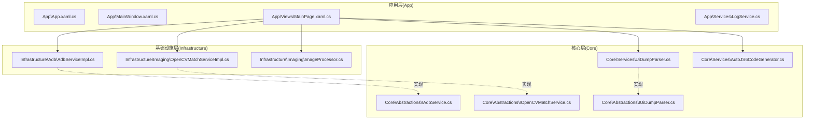
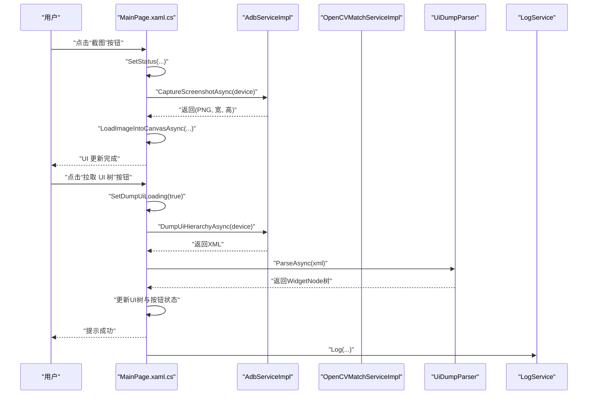
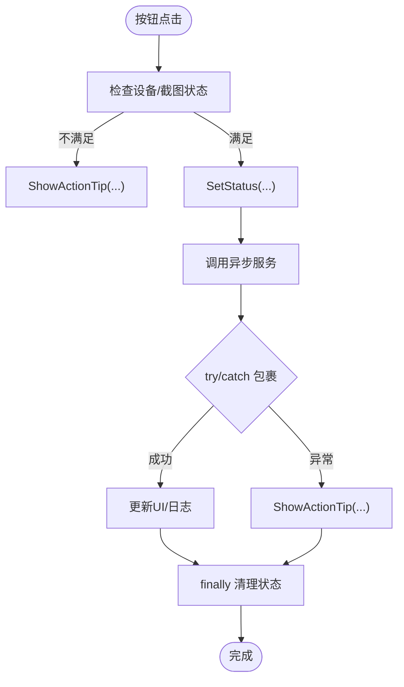
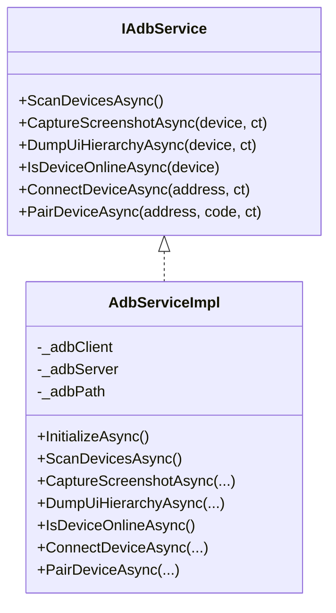
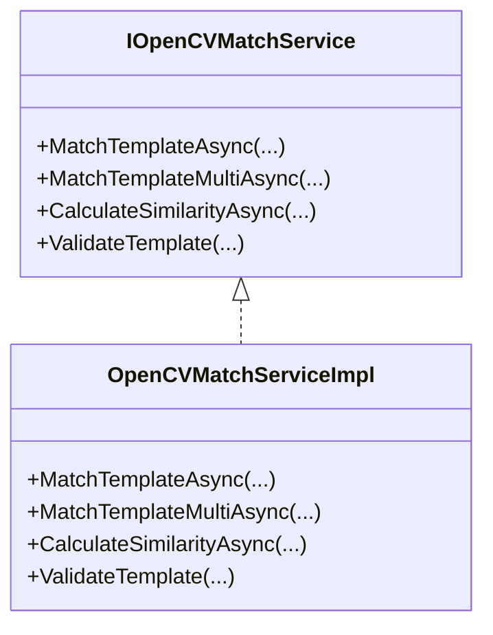
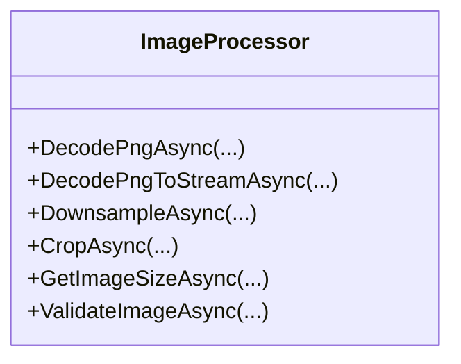
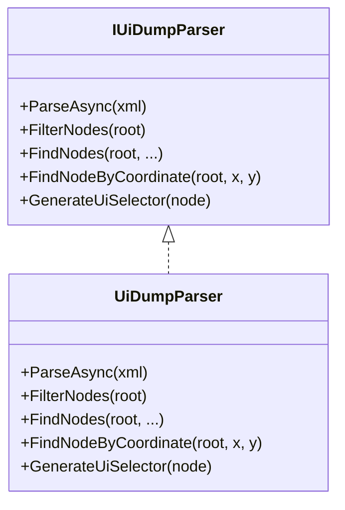
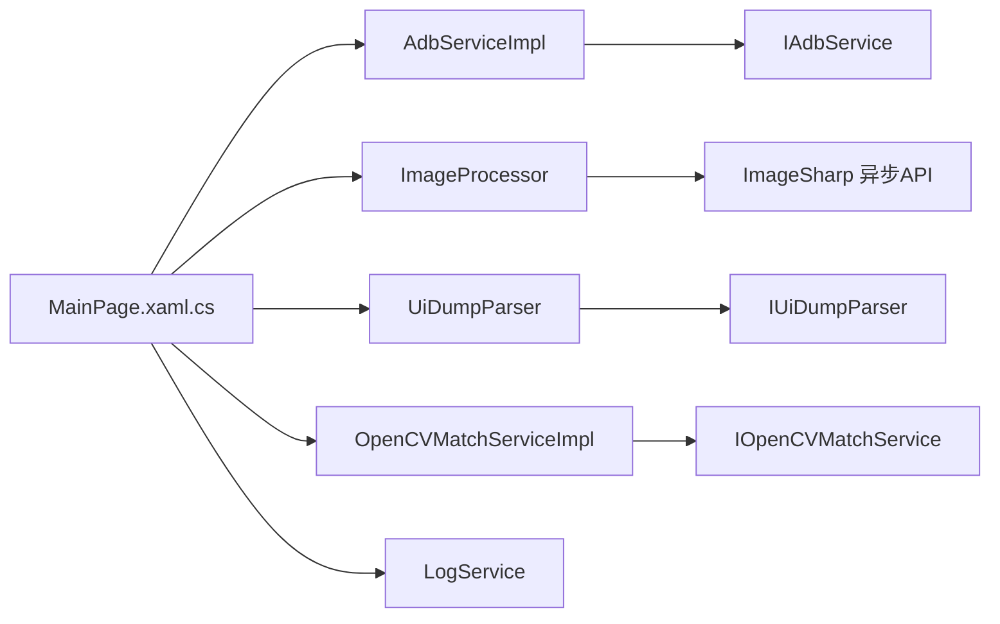

# 异步编程最佳实践

<cite>
**本文引用的文件**
- [App\App.xaml.cs](file://App\App.xaml.cs)
- [App\App.xaml](file://App\App.xaml)
- [App\MainWindow.xaml.cs](file://App\MainWindow.xaml.cs)
- [App\Views\MainPage.xaml.cs](file://App\Views\MainPage.xaml.cs)
- [App\Services\LogService.cs](file://App\Services\LogService.cs)
- [Infrastructure\Adb\AdbServiceImpl.cs](file://Infrastructure\Adb\AdbServiceImpl.cs)
- [Infrastructure\Imaging\OpenCVMatchServiceImpl.cs](file://Infrastructure\Imaging\OpenCVMatchServiceImpl.cs)
- [Infrastructure\Imaging\ImageProcessor.cs](file://Infrastructure\Imaging\ImageProcessor.cs)
- [Core\Services\UiDumpParser.cs](file://Core\Services\UiDumpParser.cs)
- [Core\Services\AutoJS6CodeGenerator.cs](file://Core\Services\AutoJS6CodeGenerator.cs)
- [Core\Abstractions\IAdbService.cs](file://Core\Abstractions\IAdbService.cs)
- [Core\Abstractions\IOpenCVMatchService.cs](file://Core\Abstractions\IOpenCVMatchService.cs)
- [Core\Abstractions\IUiDumpParser.cs](file://Core\Abstractions\IUiDumpParser.cs)
</cite>

## 目录
1. [简介](#简介)
2. [项目结构](#项目结构)
3. [核心组件](#核心组件)
4. [架构总览](#架构总览)
5. [详细组件分析](#详细组件分析)
6. [依赖关系分析](#依赖关系分析)
7. [性能考量](#性能考量)
8. [故障排查指南](#故障排查指南)
9. [结论](#结论)
10. [附录](#附录)

## 简介
本文件面向 AutoJS6 开发工具的异步编程最佳实践，围绕以下目标展开：
- 正确使用 async/await，明确何时采用 Task.Run 以及线程池管理策略
- 确保 UI 线程保护，所有 I/O 操作（ADB 拉取、OpenCV 计算、Dump 解析、纹理上传）均异步执行，避免 UI 冻结
- 提供可复用的异步方法模式、异常处理与取消令牌使用范式
- 结合项目现有实现进行性能对比与影响分析，帮助提升用户体验与系统响应性

## 项目结构
该项目采用分层架构：
- 应用层（App）：UI 页面、窗口、资源与日志服务
- 核心层（Core）：抽象接口与业务服务（代码生成、UI Dump 解析）
- 基础设施层（Infrastructure）：具体实现（ADB 服务、图像处理、OpenCV 匹配）

图表来源
- [App\Views\MainPage.xaml.cs:147-178](file://App\Views\MainPage.xaml.cs#L147-L178)
- [Infrastructure\Adb\AdbServiceImpl.cs:17-28](file://Infrastructure\Adb\AdbServiceImpl.cs#L17-L28)
- [Infrastructure\Imaging\OpenCVMatchServiceImpl.cs:11-20](file://Infrastructure\Imaging\OpenCVMatchServiceImpl.cs#L11-L20)
- [Infrastructure\Imaging\ImageProcessor.cs:13-21](file://Infrastructure\Imaging\ImageProcessor.cs#L13-L21)
- [Core\Services\UiDumpParser.cs:12-14](file://Core\Services\UiDumpParser.cs#L12-L14)
- [Core\Services\AutoJS6CodeGenerator.cs:11-12](file://Core\Services\AutoJS6CodeGenerator.cs#L11-L12)

章节来源
- [App\App.xaml.cs:27-54](file://App\App.xaml.cs#L27-L54)
- [App\MainWindow.xaml.cs:26-50](file://App\MainWindow.xaml.cs#L26-L50)
- [App\Views\MainPage.xaml.cs:43-60](file://App\Views\MainPage.xaml.cs#L43-L60)

## 核心组件
- UI 线程与事件驱动：主页面通过 async 事件处理器触发后台任务，避免阻塞 UI
- ADB 服务：提供异步截图、UI Dump、设备连接等能力，并在必要时使用 Task.Run 执行阻塞操作
- OpenCV 匹配服务：将 CPU 密集型计算放入线程池，避免占用 UI 线程
- 图像处理服务：封装 ImageSharp 的异步解码、降采样、裁剪等 I/O 密集操作
- UI Dump 解析器：将 XML 解析放入线程池，保证 UI 响应
- 日志服务：统一日志入口，支持 UI 订阅显示

章节来源
- [App\Views\MainPage.xaml.cs:147-248](file://App\Views\MainPage.xaml.cs#L147-L248)
- [Infrastructure\Adb\AdbServiceImpl.cs:33-161](file://Infrastructure\Adb\AdbServiceImpl.cs#L33-L161)
- [Infrastructure\Imaging\OpenCVMatchServiceImpl.cs:13-148](file://Infrastructure\Imaging\OpenCVMatchServiceImpl.cs#L13-L148)
- [Infrastructure\Imaging\ImageProcessor.cs:21-144](file://Infrastructure\Imaging\ImageProcessor.cs#L21-L144)
- [Core\Services\UiDumpParser.cs:14-35](file://Core\Services\UiDumpParser.cs#L14-L35)
- [App\Services\LogService.cs:9-49](file://App\Services\LogService.cs#L9-L49)

## 架构总览
下图展示了 UI 事件到各服务的异步调用链路，强调 UI 线程保护与后台任务分离。

图表来源
- [App\Views\MainPage.xaml.cs:147-248](file://App\Views\MainPage.xaml.cs#L147-L248)
- [Infrastructure\Adb\AdbServiceImpl.cs:72-138](file://Infrastructure\Adb\AdbServiceImpl.cs#L72-L138)
- [Core\Services\UiDumpParser.cs:14-35](file://Core\Services\UiDumpParser.cs#L14-L35)
- [App\Services\LogService.cs:39-49](file://App\Services\LogService.cs#L39-L49)

## 详细组件分析

### UI 线程保护策略
- 事件处理器使用 async void 并在内部调用异步服务，避免阻塞 UI
- 在长耗时操作前设置加载状态，完成后恢复
- 使用日志服务统一输出，避免直接在 UI 线程中进行 I/O

图表来源
- [App\Views\MainPage.xaml.cs:147-178](file://App\Views\MainPage.xaml.cs#L147-L178)
- [App\Views\MainPage.xaml.cs:180-248](file://App\Views\MainPage.xaml.cs#L180-L248)
- [App\Services\LogService.cs:39-49](file://App\Services\LogService.cs#L39-L49)

章节来源
- [App\Views\MainPage.xaml.cs:147-248](file://App\Views\MainPage.xaml.cs#L147-L248)
- [App\Services\LogService.cs:39-49](file://App\Services\LogService.cs#L39-L49)

### ADB 服务与 Task.Run 的合理使用
- 初始化与设备扫描：直接返回 Task.FromResult 或同步调用，避免不必要的线程切换
- 截图与 UI Dump：使用高级客户端异步 API，直接 await
- 连接/配对设备：使用 Task.Run 包裹可能阻塞的底层 API，同时传入取消令牌

图表来源
- [Core\Abstractions\IAdbService.cs:8-56](file://Core\Abstractions\IAdbService.cs#L8-L56)
- [Infrastructure\Adb\AdbServiceImpl.cs:17-238](file://Infrastructure\Adb\AdbServiceImpl.cs#L17-L238)

章节来源
- [Infrastructure\Adb\AdbServiceImpl.cs:33-161](file://Infrastructure\Adb\AdbServiceImpl.cs#L33-L161)

### OpenCV 模板匹配与线程池管理
- 将 CPU 密集型模板匹配放入线程池，避免占用 UI 线程
- 支持单匹配与多匹配两种模式，均通过 Task.Run 包裹
- 提供相似度计算与模板校验，便于前置验证

图表来源
- [Core\Abstractions\IOpenCVMatchService.cs:8-56](file://Core\Abstractions\IOpenCVMatchService.cs#L8-L56)
- [Infrastructure\Imaging\OpenCVMatchServiceImpl.cs:11-204](file://Infrastructure\Imaging\OpenCVMatchServiceImpl.cs#L11-L204)

章节来源
- [Infrastructure\Imaging\OpenCVMatchServiceImpl.cs:13-148](file://Infrastructure\Imaging\OpenCVMatchServiceImpl.cs#L13-L148)

### 图像处理与 I/O 异步
- PNG 解码、降采样、裁剪、尺寸查询、有效性校验均为异步方法
- 使用 ImageSharp 的异步 API，配合取消令牌中断长时间操作

图表来源
- [Infrastructure\Imaging\ImageProcessor.cs:13-162](file://Infrastructure\Imaging\ImageProcessor.cs#L13-L162)

章节来源
- [Infrastructure\Imaging\ImageProcessor.cs:21-144](file://Infrastructure\Imaging\ImageProcessor.cs#L21-L144)

### UI Dump 解析与线程池
- XML 解析与树构建放入线程池，避免阻塞 UI
- 提供节点过滤、查找、坐标定位与 UiSelector 生成

图表来源
- [Core\Abstractions\IUiDumpParser.cs:8-55](file://Core\Abstractions\IUiDumpParser.cs#L8-L55)
- [Core\Services\UiDumpParser.cs:12-263](file://Core\Services\UiDumpParser.cs#L12-L263)

章节来源
- [Core\Services\UiDumpParser.cs:14-35](file://Core\Services\UiDumpParser.cs#L14-L35)

### 代码生成与 UI 交互
- 代码生成器负责生成 AutoJS6 脚本，包含图像模式与控件模式
- 提供代码格式化与引擎约束校验，保障生成脚本可运行

章节来源
- [Core\Services\AutoJS6CodeGenerator.cs:11-357](file://Core\Services\AutoJS6CodeGenerator.cs#L11-L357)

## 依赖关系分析
- UI 事件依赖 ADB 服务与图像处理服务；UI Dump 解析器与 OpenCV 匹配服务作为中间层
- 日志服务被 UI 与各服务共享，统一输出与 UI 订阅

图表来源
- [App\Views\MainPage.xaml.cs:48-50](file://App\Views\MainPage.xaml.cs#L48-L50)
- [Infrastructure\Adb\AdbServiceImpl.cs:17-28](file://Infrastructure\Adb\AdbServiceImpl.cs#L17-L28)
- [Infrastructure\Imaging\OpenCVMatchServiceImpl.cs:11-20](file://Infrastructure\Imaging\OpenCVMatchServiceImpl.cs#L11-L20)
- [Infrastructure\Imaging\ImageProcessor.cs:13-21](file://Infrastructure\Imaging\ImageProcessor.cs#L13-L21)
- [Core\Services\UiDumpParser.cs:12-14](file://Core\Services\UiDumpParser.cs#L12-L14)
- [App\Services\LogService.cs:9-49](file://App\Services\LogService.cs#L9-L49)

章节来源
- [App\Views\MainPage.xaml.cs:48-60](file://App\Views\MainPage.xaml.cs#L48-L60)

## 性能考量
- UI 响应性：所有 I/O 与 CPU 密集型操作均通过异步与线程池执行，避免 UI 冻结
- 取消令牌：在 ADB 连接/配对与 OpenCV 匹配中传入取消令牌，支持用户中断
- 资源释放：OpenCV 与 ImageSharp 的 Mat/Image 对象在 using 中释放，降低内存压力
- 成本对比（概念性说明）：
  - 同步阻塞：UI 冻结，用户体验差，系统响应性低
  - 异步 + 线程池：UI 流畅，长任务后台执行，适合 I/O 与 CPU 密集场景
  - 合理使用 Task.Run：仅用于阻塞或 CPU 密集且无内置异步 API 的场景，避免滥用导致线程池抖动

[本节为通用性能讨论，不直接分析具体文件]

## 故障排查指南
- 截图失败：检查设备连接状态与权限；查看日志输出
- UI 树拉取失败：确认设备在线、XML 是否为空；解析失败会返回空树
- 匹配无结果：调整阈值、检查模板有效性与图像尺寸；必要时启用多匹配
- 取消无效：确保在调用链中传递取消令牌并在 UI 中及时响应

章节来源
- [App\Views\MainPage.xaml.cs:147-248](file://App\Views\MainPage.xaml.cs#L147-L248)
- [Infrastructure\Adb\AdbServiceImpl.cs:72-138](file://Infrastructure\Adb\AdbServiceImpl.cs#L72-L138)
- [Infrastructure\Imaging\OpenCVMatchServiceImpl.cs:13-148](file://Infrastructure\Imaging\OpenCVMatchServiceImpl.cs#L13-L148)
- [Core\Services\UiDumpParser.cs:14-35](file://Core\Services\UiDumpParser.cs#L14-L35)
- [App\Services\LogService.cs:39-49](file://App\Services\LogService.cs#L39-L49)

## 结论
- UI 线程必须保持非阻塞，所有 I/O 与计算密集型任务应异步执行
- 对于无内置异步 API 的阻塞调用，使用 Task.Run 并结合取消令牌
- 通过统一日志服务与状态管理，提升可观测性与用户体验
- 合理的线程池使用与资源释放是保障系统稳定性的关键

[本节为总结性内容，不直接分析具体文件]

## 附录

### 异步方法模式与最佳实践清单
- 使用 async/await 修饰符，返回 Task/Task<T>
- 对 I/O 密集操作（文件、网络、图像）使用异步 API
- 对 CPU 密集或阻塞操作使用 Task.Run，并传入 CancellationToken
- 在 UI 事件中包裹 try/catch，使用 SetStatus/ShowActionTip 提示
- 使用 using 或显式 Dispose 管理资源
- 通过日志服务统一输出，避免在 UI 线程做 I/O

[本节为通用指导，不直接分析具体文件]