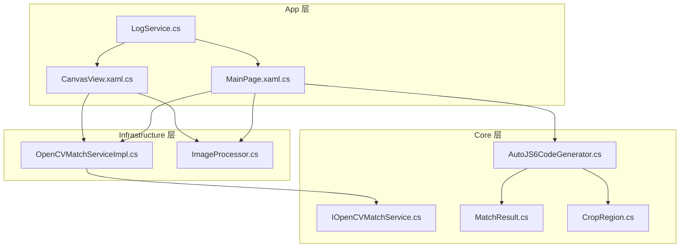
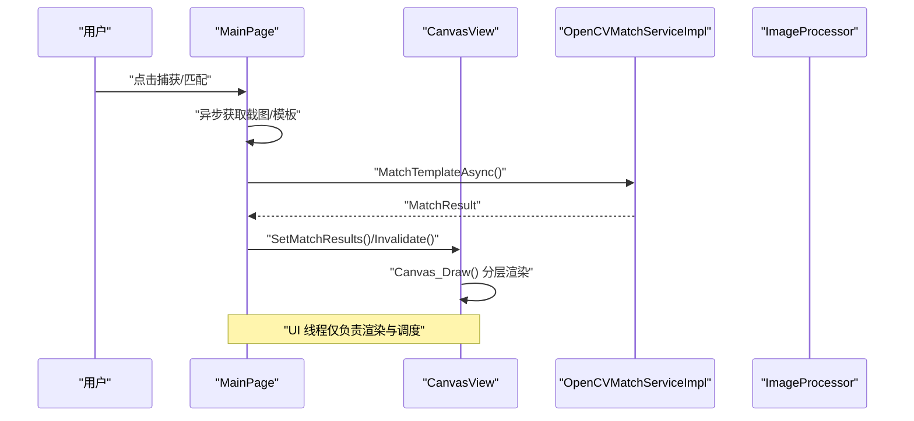
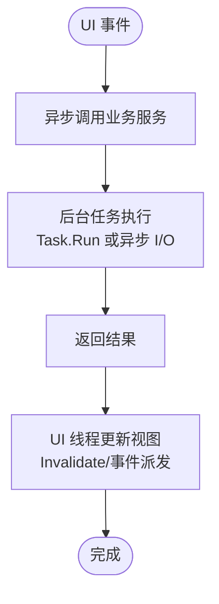
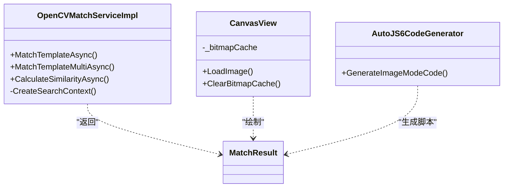
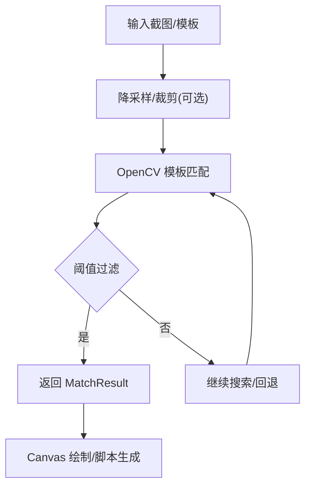
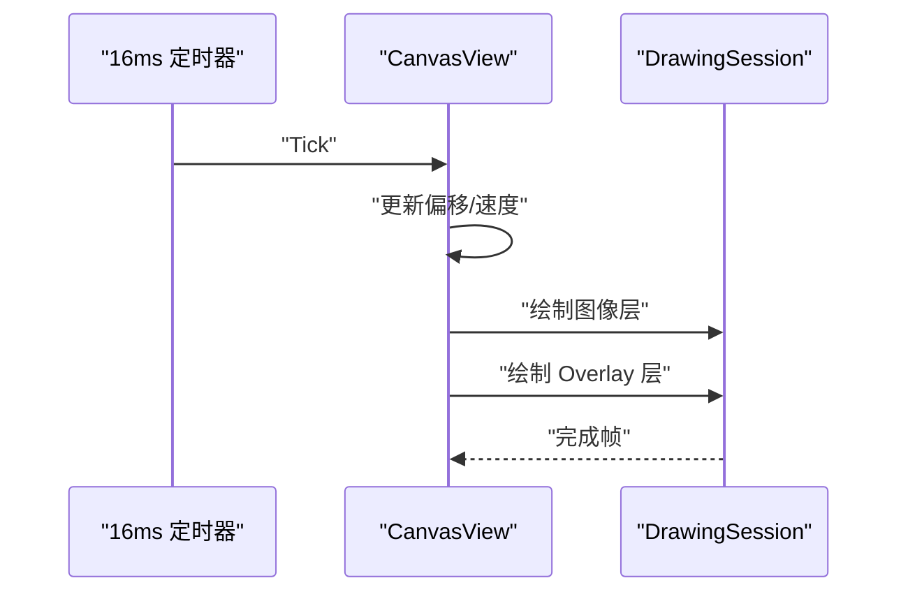
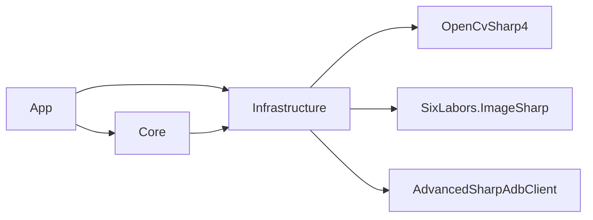

# 性能优化指南

<cite>
**本文引用的文件**   
- [App.csproj](file://App/App.csproj)
- [Infrastructure.csproj](file://Infrastructure/Infrastructure.csproj)
- [Core.csproj](file://Core/Core.csproj)
- [LogService.cs](file://App/Services/LogService.cs)
- [AutoJS6CodeGenerator.cs](file://Core/Services/AutoJS6CodeGenerator.cs)
- [IOpenCVMatchService.cs](file://Core/Abstractions/IOpenCVMatchService.cs)
- [OpenCVMatchServiceImpl.cs](file://Infrastructure/Imaging/OpenCVMatchServiceImpl.cs)
- [ImageProcessor.cs](file://Infrastructure/Imaging/ImageProcessor.cs)
- [MainPage.xaml.cs](file://App/Views/MainPage.xaml.cs)
- [CanvasView.xaml.cs](file://App/Views/CanvasView.xaml.cs)
- [MatchResult.cs](file://Core/Models/MatchResult.cs)
- [CropRegion.cs](file://Core/Models/CropRegion.cs)
- [autojs6-image-match-helper.js](file://App/CodeTemplates/image/autojs6-image-match-helper.js)
</cite>

## 目录
1. [简介](#简介)
2. [项目结构](#项目结构)
3. [核心组件](#核心组件)
4. [架构总览](#架构总览)
5. [详细组件分析](#详细组件分析)
6. [依赖关系分析](#依赖关系分析)
7. [性能考量](#性能考量)
8. [故障排查指南](#故障排查指南)
9. [结论](#结论)
10. [附录](#附录)

## 简介
本指南面向 AutoJS6 开发工具的性能优化，聚焦以下方面：
- 异步编程最佳实践：async/await 的正确使用、Task.Run 的合理应用、UI 线程保护策略
- 内存管理规范：对象生命周期管理、垃圾回收优化、内存泄漏预防
- 图像处理性能优化：OpenCV 操作高效使用、图像缓存策略、GPU 加速建议
- UI 渲染性能优化：Canvas 渲染优化、虚拟化技术、60FPS 保持策略
- 性能测试方法：基准测试编写、性能分析工具使用、瓶颈识别技巧
- AutoJS6 脚本性能优化：模板匹配优化、循环处理优化、资源管理最佳实践

## 项目结构
项目采用分层架构：
- App 层：UI 页面、视图模型、服务注册与事件绑定
- Core 层：抽象接口、领域模型、业务逻辑（代码生成、UI 解析）
- Infrastructure 层：基础设施实现（ADB、图像处理、OpenCV）

**图表来源**
- [MainPage.xaml.cs:43-60](file://App/Views/MainPage.xaml.cs#L43-L60)
- [CanvasView.xaml.cs:102-116](file://App/Views/CanvasView.xaml.cs#L102-L116)
- [LogService.cs:9-27](file://App/Services/LogService.cs#L9-L27)
- [AutoJS6CodeGenerator.cs:11-12](file://Core/Services/AutoJS6CodeGenerator.cs#L11-L12)
- [IOpenCVMatchService.cs:8-9](file://Core/Abstractions/IOpenCVMatchService.cs#L8-L9)
- [OpenCVMatchServiceImpl.cs:11-12](file://Infrastructure/Imaging/OpenCVMatchServiceImpl.cs#L11-L12)
- [ImageProcessor.cs:13-14](file://Infrastructure/Imaging/ImageProcessor.cs#L13-L14)
- [MatchResult.cs:6-7](file://Core/Models/MatchResult.cs#L6-L7)
- [CropRegion.cs:6-7](file://Core/Models/CropRegion.cs#L6-L7)

**章节来源**
- [App.csproj:1-84](file://App/App.csproj#L1-L84)
- [Infrastructure.csproj:1-19](file://Infrastructure/Infrastructure.csproj#L1-L19)
- [Core.csproj:1-10](file://Core/Core.csproj#L1-L10)

## 核心组件
- 日志服务（单例）：统一日志入口，避免 UI 线程阻塞
- 代码生成器：生成 AutoJS6 图像/控件模式脚本，含重试与回收逻辑
- OpenCV 匹配服务：异步模板匹配、多匹配、相似度计算
- 图像处理器：PNG 解码、降采样、裁剪、元数据生成
- UI 画布：Win2D 分层渲染、CanvasBitmap 缓存、惯性滚动、60FPS 定时器
- 页面控制器：设备截图、UI 树拉取、模板/截图源切换、阈值控制

**章节来源**
- [LogService.cs:9-50](file://App/Services/LogService.cs#L9-L50)
- [AutoJS6CodeGenerator.cs:11-102](file://Core/Services/AutoJS6CodeGenerator.cs#L11-L102)
- [OpenCVMatchServiceImpl.cs:11-60](file://Infrastructure/Imaging/OpenCVMatchServiceImpl.cs#L11-L60)
- [ImageProcessor.cs:13-72](file://Infrastructure/Imaging/ImageProcessor.cs#L13-L72)
- [CanvasView.xaml.cs:24-116](file://App/Views/CanvasView.xaml.cs#L24-L116)
- [MainPage.xaml.cs:17-60](file://App/Views/MainPage.xaml.cs#L17-L60)

## 架构总览
系统通过 App 层协调 Core 与 Infrastructure 层，实现“UI 事件 -> 业务服务 -> 图像引擎”的清晰调用链。

**图表来源**
- [MainPage.xaml.cs:147-178](file://App/Views/MainPage.xaml.cs#L147-L178)
- [OpenCVMatchServiceImpl.cs:13-60](file://Infrastructure/Imaging/OpenCVMatchServiceImpl.cs#L13-L60)
- [CanvasView.xaml.cs:572-627](file://App/Views/CanvasView.xaml.cs#L572-L627)

## 详细组件分析

### 异步与 UI 线程保护
- UI 事件处理均标记为异步，避免阻塞 UI 线程
- 日志服务通过事件向 UI 推送，不直接写 UI 控件
- Canvas 绘制在后台线程执行，UI 仅触发 Invalidate

**图表来源**
- [MainPage.xaml.cs:147-178](file://App/Views/MainPage.xaml.cs#L147-L178)
- [LogService.cs:39-49](file://App/Services/LogService.cs#L39-L49)
- [CanvasView.xaml.cs:572-627](file://App/Views/CanvasView.xaml.cs#L572-L627)

**章节来源**
- [MainPage.xaml.cs:147-178](file://App/Views/MainPage.xaml.cs#L147-L178)
- [LogService.cs:39-49](file://App/Services/LogService.cs#L39-L49)
- [CanvasView.xaml.cs:572-627](file://App/Views/CanvasView.xaml.cs#L572-L627)

### 内存管理与生命周期
- OpenCV 模板匹配：使用 using 语义确保 Mat 资源及时释放
- Canvas 位图缓存：按图像哈希缓存 CanvasBitmap，超限淘汰，避免重复纹理创建
- AutoJS6 脚本模板：显式回收模板图像，防止内存泄漏
- 图像处理：ImageSharp 使用异步加载与流式处理，避免大对象驻留

**图表来源**
- [OpenCVMatchServiceImpl.cs:11-60](file://Infrastructure/Imaging/OpenCVMatchServiceImpl.cs#L11-L60)
- [CanvasView.xaml.cs:358-426](file://App/Views/CanvasView.xaml.cs#L358-L426)
- [AutoJS6CodeGenerator.cs:13-102](file://Core/Services/AutoJS6CodeGenerator.cs#L13-L102)

**章节来源**
- [OpenCVMatchServiceImpl.cs:20-60](file://Infrastructure/Imaging/OpenCVMatchServiceImpl.cs#L20-L60)
- [CanvasView.xaml.cs:358-426](file://App/Views/CanvasView.xaml.cs#L358-L426)
- [AutoJS6CodeGenerator.cs:29-102](file://Core/Services/AutoJS6CodeGenerator.cs#L29-L102)

### 图像处理性能优化
- OpenCV 模板匹配：使用 CCoeffNormed 算法，支持区域裁剪与阈值过滤
- 图像降采样：最大分辨率限制与等比缩放，减少后续匹配开销
- Canvas 位图缓存：按哈希键缓存，避免重复创建纹理；淘汰最旧项
- 模板辅助脚本：支持透明遮罩、特征检测回退、多尺度候选

**图表来源**
- [ImageProcessor.cs:47-72](file://Infrastructure/Imaging/ImageProcessor.cs#L47-L72)
- [OpenCVMatchServiceImpl.cs:13-60](file://Infrastructure/Imaging/OpenCVMatchServiceImpl.cs#L13-L60)
- [CanvasView.xaml.cs:681-704](file://App/Views/CanvasView.xaml.cs#L681-L704)
- [autojs6-image-match-helper.js:18-160](file://App/CodeTemplates/image/autojs6-image-match-helper.js#L18-L160)

**章节来源**
- [ImageProcessor.cs:47-72](file://Infrastructure/Imaging/ImageProcessor.cs#L47-L72)
- [OpenCVMatchServiceImpl.cs:13-60](file://Infrastructure/Imaging/OpenCVMatchServiceImpl.cs#L13-L60)
- [autojs6-image-match-helper.js:18-160](file://App/CodeTemplates/image/autojs6-image-match-helper.js#L18-L160)

### UI 渲染性能优化
- 分层渲染：底层图像层 + 上层 Overlay（控件边界、匹配框、裁剪框）
- CanvasBitmap 缓存池：限制最大缓存数量，避免内存膨胀
- 惯性滚动：16ms 定时器驱动，衰减速度与最小速度阈值保证 60FPS
- 叠加透明度与条件绘制：仅在开启时绘制，减少绘制调用

**图表来源**
- [CanvasView.xaml.cs:107-138](file://App/Views/CanvasView.xaml.cs#L107-L138)
- [CanvasView.xaml.cs:572-627](file://App/Views/CanvasView.xaml.cs#L572-L627)

**章节来源**
- [CanvasView.xaml.cs:107-138](file://App/Views/CanvasView.xaml.cs#L107-L138)
- [CanvasView.xaml.cs:358-426](file://App/Views/CanvasView.xaml.cs#L358-L426)
- [CanvasView.xaml.cs:572-627](file://App/Views/CanvasView.xaml.cs#L572-L627)

### AutoJS6 脚本性能优化
- 重试与延迟：批量重试时加入等待，避免频繁截图
- 资源回收：模板图像与中间图像显式回收
- 代码校验：Rhino 引擎约束检查，避免循环体内使用 const/let
- 模板辅助函数：透明遮罩、特征检测回退、多尺度候选，提升鲁棒性

**章节来源**
- [AutoJS6CodeGenerator.cs:38-102](file://Core/Services/AutoJS6CodeGenerator.cs#L38-L102)
- [AutoJS6CodeGenerator.cs:226-258](file://Core/Services/AutoJS6CodeGenerator.cs#L226-L258)
- [autojs6-image-match-helper.js:18-160](file://App/CodeTemplates/image/autojs6-image-match-helper.js#L18-L160)

## 依赖关系分析
- App 依赖 Core 抽象与模型，依赖 Infrastructure 实现
- Core 依赖 Infrastructure 的图像服务
- Infrastructure 依赖第三方库（OpenCV、ImageSharp、ADB 客户端）

**图表来源**
- [App.csproj:67-68](file://App/App.csproj#L67-L68)
- [Infrastructure.csproj:9-17](file://Infrastructure/Infrastructure.csproj#L9-L17)
- [Core.csproj:1-10](file://Core/Core.csproj#L1-L10)

**章节来源**
- [App.csproj:67-68](file://App/App.csproj#L67-L68)
- [Infrastructure.csproj:9-17](file://Infrastructure/Infrastructure.csproj#L9-L17)
- [Core.csproj:1-10](file://Core/Core.csproj#L1-L10)

## 性能考量
- 异步与并发
  - 使用 async/await 与 Task.Run 执行 CPU 密集型任务，避免阻塞 UI
  - 对外暴露异步接口，内部使用 using 确保资源释放
- 内存与缓存
  - Canvas 位图缓存池限制大小，淘汰最旧项
  - OpenCV 使用 Mat 的作用域管理，避免泄漏
  - 图像处理采用流式与异步 API，降低峰值内存
- 图像处理
  - 优先使用区域裁剪与阈值过滤，缩小搜索空间
  - 降采样至最大分辨率以内，减少匹配复杂度
  - 多尺度候选与特征检测回退，平衡准确率与性能
- UI 渲染
  - 16ms 定时器驱动惯性滚动，衰减参数与最小速度阈值保证稳定帧率
  - 分层渲染与条件绘制，减少不必要的绘制调用
- 测试与分析
  - 使用 Stopwatch 记录关键路径耗时
  - 通过日志事件观察 UI 帧与匹配耗时
  - 结合系统性能分析器定位瓶颈

[本节为通用指导，无需列出具体文件来源]

## 故障排查指南
- UI 卡顿
  - 检查是否存在 UI 线程阻塞的同步调用
  - 确认 Canvas 绘制是否在 UI 线程触发，Overlay 绘制是否过多
- 匹配失败或慢
  - 检查阈值设置与区域裁剪是否合理
  - 确认模板图像是否过大，考虑降采样
- 内存增长
  - 检查 Canvas 位图缓存是否清理
  - 确认 OpenCV Mat 是否被正确释放
- 日志与调试
  - 使用日志服务事件查看关键阶段耗时
  - 在 UI 中启用调试日志面板，观察状态变化

**章节来源**
- [CanvasView.xaml.cs:572-627](file://App/Views/CanvasView.xaml.cs#L572-L627)
- [OpenCVMatchServiceImpl.cs:20-60](file://Infrastructure/Imaging/OpenCVMatchServiceImpl.cs#L20-L60)
- [LogService.cs:39-49](file://App/Services/LogService.cs#L39-L49)

## 结论
通过合理的异步设计、严格的资源管理、高效的图像处理与稳健的 UI 渲染策略，AutoJS6 开发工具可在复杂场景下保持流畅体验与高匹配精度。建议持续关注日志与性能指标，结合实际使用场景迭代优化。

[本节为总结，无需列出具体文件来源]

## 附录
- 关键模型与接口
  - 匹配结果：X/Y/Width/Height/Confidence/ElapsedMilliseconds/IsMatch/Algorithm/Threshold
  - 裁剪区域：X/Y/Width/Height/Name/OriginalWidth/OriginalHeight/ReferenceWidth/ReferenceHeight
  - OpenCV 接口：单匹配、多匹配、相似度计算、模板校验

**章节来源**
- [MatchResult.cs:6-62](file://Core/Models/MatchResult.cs#L6-L62)
- [CropRegion.cs:6-52](file://Core/Models/CropRegion.cs#L6-L52)
- [IOpenCVMatchService.cs:8-56](file://Core/Abstractions/IOpenCVMatchService.cs#L8-L56)