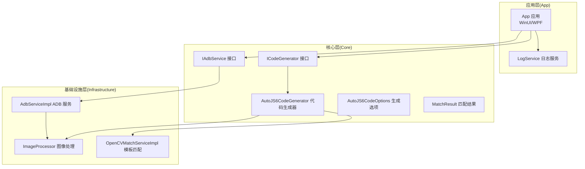
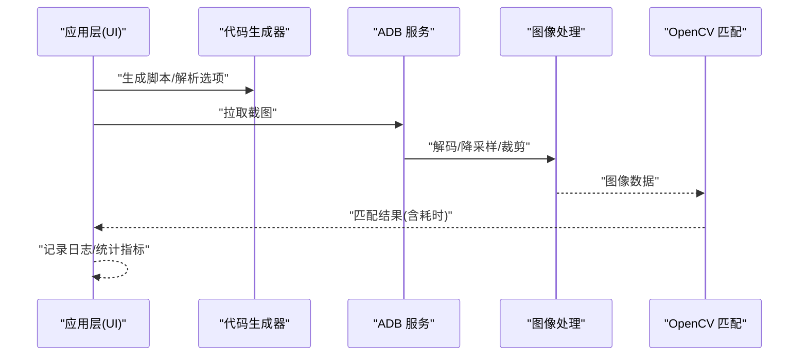
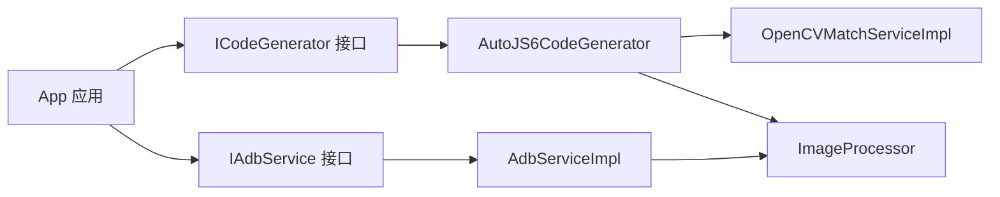

# 性能测试方法

<cite>
**本文引用的文件**
- [App/App.csproj](file://App/App.csproj)
- [Core/Core.csproj](file://Core/Core.csproj)
- [Infrastructure/Infrastructure.csproj](file://Infrastructure/Infrastructure.csproj)
- [App.Tests/App.Tests.csproj](file://App.Tests/App.Tests.csproj)
- [Core.Tests/Core.Tests.csproj](file://Core.Tests/Core.Tests.csproj)
- [Core/Services/AutoJS6CodeGenerator.cs](file://Core/Services/AutoJS6CodeGenerator.cs)
- [Infrastructure/Imaging/ImageProcessor.cs](file://Infrastructure/Imaging/ImageProcessor.cs)
- [Infrastructure/Imaging/OpenCVMatchServiceImpl.cs](file://Infrastructure/Imaging/OpenCVMatchServiceImpl.cs)
- [Infrastructure/Adb/AdbServiceImpl.cs](file://Infrastructure/Adb/AdbServiceImpl.cs)
- [App/Services/LogService.cs](file://App/Services/LogService.cs)
- [Core.Tests/AutoJS6CodeGeneratorTests.cs](file://Core.Tests/AutoJS6CodeGeneratorTests.cs)
- [Core/Models/AutoJS6CodeOptions.cs](file://Core/Models/AutoJS6CodeOptions.cs)
- [Core/Models/MatchResult.cs](file://Core/Models/MatchResult.cs)
- [Core/Abstractions/IAdbService.cs](file://Core/Abstractions/IAdbService.cs)
- [Core/Abstractions/ICodeGenerator.cs](file://Core/Abstractions/ICodeGenerator.cs)
</cite>

## 目录
1. [简介](#简介)
2. [项目结构](#项目结构)
3. [核心组件](#核心组件)
4. [架构总览](#架构总览)
5. [详细组件分析](#详细组件分析)
6. [依赖关系分析](#依赖关系分析)
7. [性能考虑](#性能考虑)
8. [故障排查指南](#故障排查指南)
9. [结论](#结论)
10. [附录](#附录)

## 简介
本文件面向 AutoJS6 开发工具的性能测试与优化，提供系统化的性能测试方法论，涵盖基准测试框架选择、测试用例设计、数据采集策略、性能分析工具使用、瓶颈识别技巧以及性能回归与持续监控方案。内容以仓库现有代码为依据，结合实际可落地的测试流程，帮助团队建立稳定高效的性能保障体系。

## 项目结构
AutoJS6 开发工具采用分层架构：
- 应用层（App）：WPF/WinUI 应用，负责用户交互与可视化展示。
- 核心层（Core）：业务逻辑与模型定义，包含代码生成器、UI Dump 解析等抽象与模型。
- 基础设施层（Infrastructure）：与外部系统交互，如 ADB 截图、OpenCV 模板匹配、ImageSharp 图像处理等。

图表来源
- [App/App.csproj:1-84](file://App/App.csproj#L1-L84)
- [Core/Core.csproj:1-10](file://Core/Core.csproj#L1-L10)
- [Infrastructure/Infrastructure.csproj:1-19](file://Infrastructure/Infrastructure.csproj#L1-L19)
- [Core/Services/AutoJS6CodeGenerator.cs:1-357](file://Core/Services/AutoJS6CodeGenerator.cs#L1-L357)
- [Infrastructure/Imaging/OpenCVMatchServiceImpl.cs:1-204](file://Infrastructure/Imaging/OpenCVMatchServiceImpl.cs#L1-L204)
- [Infrastructure/Imaging/ImageProcessor.cs:1-162](file://Infrastructure/Imaging/ImageProcessor.cs#L1-L162)
- [Infrastructure/Adb/AdbServiceImpl.cs:1-238](file://Infrastructure/Adb/AdbServiceImpl.cs#L1-L238)
- [App/Services/LogService.cs:1-51](file://App/Services/LogService.cs#L1-L51)
- [Core/Models/AutoJS6CodeOptions.cs:1-89](file://Core/Models/AutoJS6CodeOptions.cs#L1-L89)
- [Core/Models/MatchResult.cs:1-63](file://Core/Models/MatchResult.cs#L1-L63)
- [Core/Abstractions/ICodeGenerator.cs:1-46](file://Core/Abstractions/ICodeGenerator.cs#L1-L46)
- [Core/Abstractions/IAdbService.cs:1-57](file://Core/Abstractions/IAdbService.cs#L1-L57)

章节来源
- [App/App.csproj:1-84](file://App/App.csproj#L1-L84)
- [Core/Core.csproj:1-10](file://Core/Core.csproj#L1-L10)
- [Infrastructure/Infrastructure.csproj:1-19](file://Infrastructure/Infrastructure.csproj#L1-L19)

## 核心组件
- 代码生成器（AutoJS6CodeGenerator）：根据配置生成 AutoJS6 脚本，支持图像模式与控件模式，并内置 Rhino 引擎约束校验。
- ADB 服务（AdbServiceImpl）：负责设备发现、截图拉取、UI 层次结构导出，包含帧缓冲区处理与 PNG 编码。
- 图像处理（ImageProcessor）：提供 PNG 解码、降采样、裁剪、元数据生成与尺寸查询。
- OpenCV 模板匹配（OpenCVMatchServiceImpl）：提供模板匹配、多点匹配、相似度计算与模板有效性验证。
- 日志服务（LogService）：统一日志入口，便于性能观测与问题定位。

章节来源
- [Core/Services/AutoJS6CodeGenerator.cs:1-357](file://Core/Services/AutoJS6CodeGenerator.cs#L1-L357)
- [Infrastructure/Adb/AdbServiceImpl.cs:1-238](file://Infrastructure/Adb/AdbServiceImpl.cs#L1-L238)
- [Infrastructure/Imaging/ImageProcessor.cs:1-162](file://Infrastructure/Imaging/ImageProcessor.cs#L1-L162)
- [Infrastructure/Imaging/OpenCVMatchServiceImpl.cs:1-204](file://Infrastructure/Imaging/OpenCVMatchServiceImpl.cs#L1-L204)
- [App/Services/LogService.cs:1-51](file://App/Services/LogService.cs#L1-L51)

## 架构总览
下图展示了性能测试关注的关键路径：应用层发起任务 -> 核心层生成脚本或解析 UI -> 基础设施层进行图像处理与匹配 -> 返回结果并记录性能指标。

图表来源
- [Core/Services/AutoJS6CodeGenerator.cs:166-189](file://Core/Services/AutoJS6CodeGenerator.cs#L166-L189)
- [Infrastructure/Adb/AdbServiceImpl.cs:72-118](file://Infrastructure/Adb/AdbServiceImpl.cs#L72-L118)
- [Infrastructure/Imaging/ImageProcessor.cs:47-72](file://Infrastructure/Imaging/ImageProcessor.cs#L47-L72)
- [Infrastructure/Imaging/OpenCVMatchServiceImpl.cs:13-60](file://Infrastructure/Imaging/OpenCVMatchServiceImpl.cs#L13-L60)
- [App/Services/LogService.cs:39-49](file://App/Services/LogService.cs#L39-L49)

## 详细组件分析

### 代码生成器性能特性与测试要点
- 图像模式与控件模式分别对应不同的性能特征：图像模式涉及截图、模板匹配与坐标计算；控件模式依赖 UI Dump 解析与选择器匹配。
- 生成脚本包含重试与超时控制，影响整体响应时间与资源占用。
- Rhino 引擎约束校验避免在循环体内使用 const/let，有助于减少运行时开销。

建议测试维度
- 生成脚本长度与复杂度对 UI 渲染的影响。
- 不同阈值、重试次数、区域裁剪对匹配耗时的影响。
- 生成代码的可读性与可维护性对开发效率的影响。

章节来源
- [Core/Services/AutoJS6CodeGenerator.cs:13-102](file://Core/Services/AutoJS6CodeGenerator.cs#L13-L102)
- [Core/Services/AutoJS6CodeGenerator.cs:104-164](file://Core/Services/AutoJS6CodeGenerator.cs#L104-L164)
- [Core/Services/AutoJS6CodeGenerator.cs:226-258](file://Core/Services/AutoJS6CodeGenerator.cs#L226-L258)
- [Core/Models/AutoJS6CodeOptions.cs:6-72](file://Core/Models/AutoJS6CodeOptions.cs#L6-L72)

### ADB 截图与图像处理性能
- 截图流程包含帧缓冲区解析、行填充处理、像素格式转换与 PNG 编码，是典型的 CPU 密集型与内存密集型操作。
- 图像处理提供降采样与裁剪，直接影响后续匹配性能与内存占用。

建议测试维度
- 不同分辨率与帧缓冲区布局下的解码耗时与内存峰值。
- 降采样策略对匹配精度与速度的权衡。
- PNG 编码参数对 I/O 时间的影响。

章节来源
- [Infrastructure/Adb/AdbServiceImpl.cs:72-118](file://Infrastructure/Adb/AdbServiceImpl.cs#L72-L118)
- [Infrastructure/Imaging/ImageProcessor.cs:47-72](file://Infrastructure/Imaging/ImageProcessor.cs#L47-L72)
- [Infrastructure/Imaging/ImageProcessor.cs:77-100](file://Infrastructure/Imaging/ImageProcessor.cs#L77-L100)

### OpenCV 模板匹配性能
- 使用计时器记录匹配耗时，返回包含置信度、坐标与耗时的结果对象。
- 支持单点与多点匹配，阈值与搜索区域直接影响性能与准确性。

建议测试维度
- 不同阈值与区域裁剪对匹配耗时与命中率的影响。
- 多点匹配场景下的内存增长与处理时间。
- 算法稳定性与异常输入的容错表现。

章节来源
- [Infrastructure/Imaging/OpenCVMatchServiceImpl.cs:13-60](file://Infrastructure/Imaging/OpenCVMatchServiceImpl.cs#L13-L60)
- [Infrastructure/Imaging/OpenCVMatchServiceImpl.cs:62-122](file://Infrastructure/Imaging/OpenCVMatchServiceImpl.cs#L62-L122)
- [Core/Models/MatchResult.cs:6-62](file://Core/Models/MatchResult.cs#L6-L62)

### 日志与可观测性
- 统一日志入口，便于在性能测试中埋点与追踪。
- 建议在关键路径增加时间戳与耗时统计，形成性能基线。

章节来源
- [App/Services/LogService.cs:39-49](file://App/Services/LogService.cs#L39-L49)

## 依赖关系分析
- 应用层通过接口依赖核心层，核心层再依赖基础设施层，形成清晰的分层与解耦。
- 测试项目分别针对 App 与 Core 层，确保核心逻辑与界面层均可独立验证。

图表来源
- [Core/Abstractions/ICodeGenerator.cs:1-46](file://Core/Abstractions/ICodeGenerator.cs#L1-L46)
- [Core/Abstractions/IAdbService.cs:1-57](file://Core/Abstractions/IAdbService.cs#L1-L57)
- [Core/Services/AutoJS6CodeGenerator.cs:11](file://Core/Services/AutoJS6CodeGenerator.cs#L11)
- [Infrastructure/Adb/AdbServiceImpl.cs:17](file://Infrastructure/Adb/AdbServiceImpl.cs#L17)
- [Infrastructure/Imaging/OpenCVMatchServiceImpl.cs:11](file://Infrastructure/Imaging/OpenCVMatchServiceImpl.cs#L11)
- [Infrastructure/Imaging/ImageProcessor.cs:13](file://Infrastructure/Imaging/ImageProcessor.cs#L13)

章节来源
- [App.Tests/App.Tests.csproj:1-17](file://App.Tests/App.Tests.csproj#L1-L17)
- [Core.Tests/Core.Tests.csproj:1-21](file://Core.Tests/Core.Tests.csproj#L1-L21)

## 性能考虑
- CPU 使用率分析
  - 关注图像解码、降采样、模板匹配与 UI 渲染阶段的热点函数。
  - 在 OpenCV 匹配与图像处理中引入计时器，记录毫秒级耗时，用于对比不同阈值与区域设置的效果。
- 内存泄漏检测
  - 确保图像对象与 Mat 对象在使用后及时释放，避免在循环中重复分配大对象。
  - 对长生命周期集合（如匹配结果列表）进行容量与存活期管理。
- 渲染性能评估
  - 通过日志服务记录关键步骤耗时，观察 UI 更新频率与卡顿点。
  - 控制重试与超时参数，避免频繁触发 UI 刷新导致的抖动。

[本节为通用指导，不直接分析具体文件]

## 故障排查指南
- 截图失败或帧缓冲区异常
  - 检查设备连接状态与权限，确认帧缓冲区尺寸与行填充计算正确。
- 匹配结果为空或置信度过低
  - 调整阈值与搜索区域，检查模板图像质量与尺寸。
- 生成代码不符合引擎约束
  - 确保循环体内仅使用 var，避免 const/let 导致的运行时错误。

章节来源
- [Infrastructure/Adb/AdbServiceImpl.cs:140-144](file://Infrastructure/Adb/AdbServiceImpl.cs#L140-L144)
- [Infrastructure/Imaging/OpenCVMatchServiceImpl.cs:150-161](file://Infrastructure/Imaging/OpenCVMatchServiceImpl.cs#L150-L161)
- [Core/Services/AutoJS6CodeGenerator.cs:226-258](file://Core/Services/AutoJS6CodeGenerator.cs#L226-L258)

## 结论
通过对代码生成、ADB 截图、图像处理与 OpenCV 匹配等关键路径的性能测试与优化，可以显著提升 AutoJS6 开发工具的响应速度与稳定性。建议以本文件为纲，结合实际测试环境与业务场景，持续完善性能基线与回归策略。

[本节为总结性内容，不直接分析具体文件]

## 附录

### 基准测试框架与测试用例设计
- 框架选择
  - .NET 场景推荐使用 BenchmarkDotNet 或 MSTest + 自定义计时器组合，前者适合微基准，后者适合端到端场景。
- 测试用例设计
  - 输入规模：小/中/大三档分辨率图像，不同模板尺寸与阈值组合。
  - 并发场景：多线程调用匹配与处理，观察吞吐与延迟变化。
  - 边界条件：空图像、超大区域、无效模板等。
- 数据采集策略
  - 记录每轮执行的平均耗时、P95/P99 延迟、内存峰值与 GC 次数。
  - 将关键指标写入 CSV 或构建性能报告，便于趋势分析。

[本节为通用指导，不直接分析具体文件]

### 性能分析工具使用建议
- .NET 性能分析器
  - 使用 dotnet-trace/dotnet-counters 采集 CPU/内存/线程等指标，结合 PerfView/VS 性能分析器定位热点。
- 内存 profiler
  - 使用 dotMemory/dotTrace 或 Visual Studio 内存分析器，重点观察图像对象与匹配结果集合的生命周期。
- UI 性能监控
  - 在 UI 层埋点关键路径耗时，结合日志服务输出，形成 UI 响应时间基线。

[本节为通用指导，不直接分析具体文件]

### 瓶颈识别技巧
- CPU 使用率分析
  - 识别图像解码、降采样与模板匹配的热点函数，必要时引入并行化或缓存策略。
- 内存泄漏检测
  - 关注大对象分配与释放时机，确保 Mat 与图像对象在 using 块中正确释放。
- 渲染性能评估
  - 控制 UI 刷新频率，合并多次更新，避免在热路径中进行昂贵的 UI 操作。

[本节为通用指导，不直接分析具体文件]

### 性能回归测试与持续监控
- 回归测试策略
  - 将关键性能指标纳入 CI，设定阈值告警；对每次提交进行对比分析。
- 持续监控方案
  - 在生产或预生产环境采集性能数据，建立基线与告警阈值，定期复盘与优化。

[本节为通用指导，不直接分析具体文件]