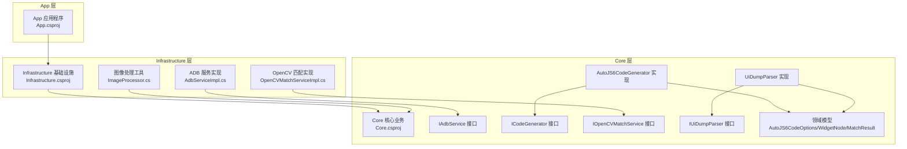
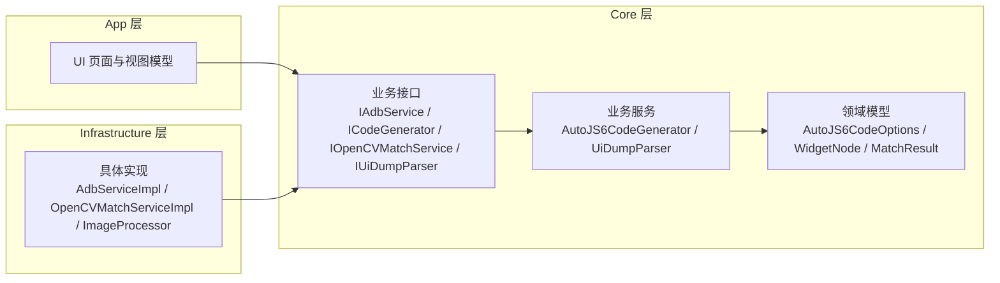
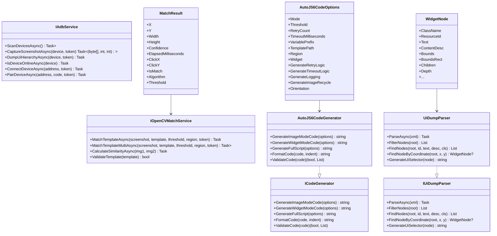
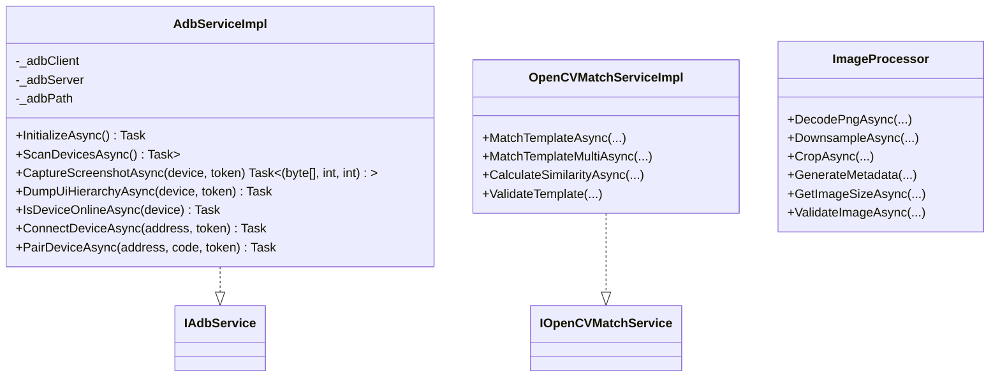
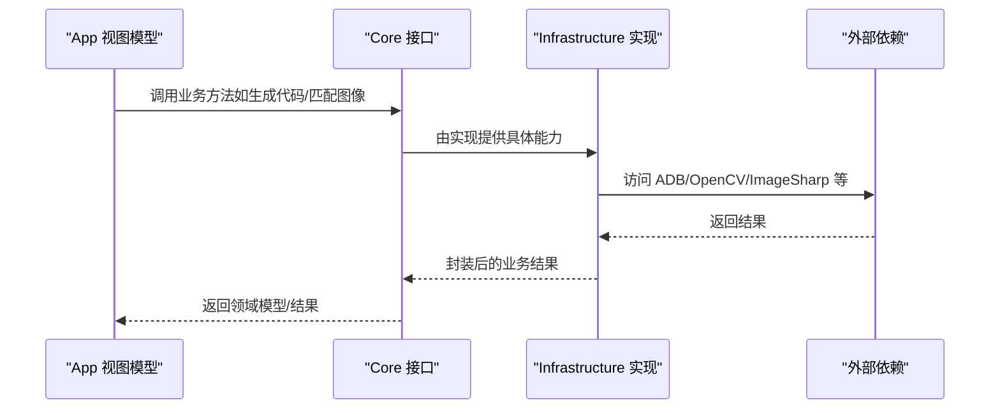
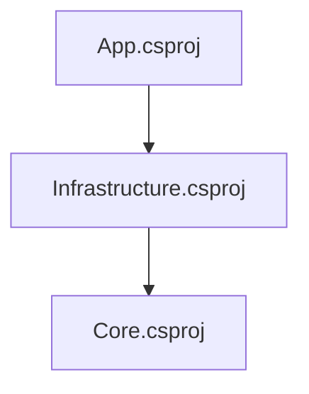

# Clean Architecture 实现

<cite>
**本文档引用的文件**
- [Core/Core.csproj](file://Core/Core.csproj)
- [Infrastructure/Infrastructure.csproj](file://Infrastructure/Infrastructure.csproj)
- [App/App.csproj](file://App/App.csproj)
- [Core/Abstractions/IAdbService.cs](file://Core/Abstractions/IAdbService.cs)
- [Core/Abstractions/ICodeGenerator.cs](file://Core/Abstractions/ICodeGenerator.cs)
- [Core/Abstractions/IOpenCVMatchService.cs](file://Core/Abstractions/IOpenCVMatchService.cs)
- [Core/Abstractions/IUiDumpParser.cs](file://Core/Abstractions/IUiDumpParser.cs)
- [Core/Services/AutoJS6CodeGenerator.cs](file://Core/Services/AutoJS6CodeGenerator.cs)
- [Core/Services/UiDumpParser.cs](file://Core/Services/UiDumpParser.cs)
- [Core/Models/AutoJS6CodeOptions.cs](file://Core/Models/AutoJS6CodeOptions.cs)
- [Core/Models/WidgetNode.cs](file://Core/Models/WidgetNode.cs)
- [Core/Models/MatchResult.cs](file://Core/Models/MatchResult.cs)
- [Infrastructure/Adb/AdbServiceImpl.cs](file://Infrastructure/Adb/AdbServiceImpl.cs)
- [Infrastructure/Imaging/OpenCVMatchServiceImpl.cs](file://Infrastructure/Imaging/OpenCVMatchServiceImpl.cs)
- [Infrastructure/Imaging/ImageProcessor.cs](file://Infrastructure/Imaging/ImageProcessor.cs)
</cite>

## 目录
1. [简介](#简介)
2. [项目结构](#项目结构)
3. [核心组件](#核心组件)
4. [架构总览](#架构总览)
5. [详细组件分析](#详细组件分析)
6. [依赖关系分析](#依赖关系分析)
7. [性能考虑](#性能考虑)
8. [故障排除指南](#故障排除指南)
9. [结论](#结论)

## 简介
本文件系统性阐述 AutoJS6 开发工具的 Clean Architecture 实现，重点覆盖三层架构在该项目中的落地方式：Core 层承载纯业务逻辑与领域模型，Infrastructure 层封装外部依赖（ADB、OpenCV、图像处理等），App 层负责 UI 与交互编排。文档严格遵循单向依赖约束（App → Infrastructure → Core），并强调 Core 层不依赖 UI 框架与外部库的设计原则。同时提供接口定义、依赖注入配置思路以及模块间通信机制的实现要点。

## 项目结构
项目采用典型的 Clean Architecture 分层组织，通过 .csproj 中的项目引用建立严格的依赖方向：
- App 层仅依赖 Infrastructure 层
- Infrastructure 层依赖 Core 层
- Core 层不依赖其他层

**图表来源**
- [App/App.csproj:67-67](file://App/App.csproj#L67-L67)
- [Infrastructure/Infrastructure.csproj:10-10](file://Infrastructure/Infrastructure.csproj#L10-L10)
- [Core/Core.csproj:1-10](file://Core/Core.csproj#L1-L10)

**章节来源**
- [App/App.csproj:67-67](file://App/App.csproj#L67-L67)
- [Infrastructure/Infrastructure.csproj:10-11](file://Infrastructure/Infrastructure.csproj#L10-L11)
- [Core/Core.csproj:1-10](file://Core/Core.csproj#L1-L10)

## 核心组件
本节概述三层架构的关键构件及其职责：

- Core 层
  - 抽象层：定义业务契约（接口），如 IAdbService、ICodeGenerator、IOpenCVMatchService、IUiDumpParser
  - 服务层：实现纯业务逻辑，如 AutoJS6CodeGenerator、UiDumpParser
  - 模型层：定义领域数据结构，如 AutoJS6CodeOptions、WidgetNode、MatchResult

- Infrastructure 层
  - 外部依赖封装：实现 Core 抽象接口，如 AdbServiceImpl、OpenCVMatchServiceImpl、ImageProcessor
  - 第三方库集成：ADB 客户端、OpenCV、ImageSharp 等

- App 层
  - UI 与交互：基于 WinUI/MVVM 的视图、视图模型与页面
  - 依赖注入与组合：在 App 启动阶段装配 Core/Infrastructure 组件，向 UI 暴露业务能力

**章节来源**
- [Core/Abstractions/IAdbService.cs:1-57](file://Core/Abstractions/IAdbService.cs#L1-L57)
- [Core/Abstractions/ICodeGenerator.cs:1-46](file://Core/Abstractions/ICodeGenerator.cs#L1-L46)
- [Core/Abstractions/IOpenCVMatchService.cs:1-57](file://Core/Abstractions/IOpenCVMatchService.cs#L1-L57)
- [Core/Abstractions/IUiDumpParser.cs:1-56](file://Core/Abstractions/IUiDumpParser.cs#L1-L56)
- [Core/Services/AutoJS6CodeGenerator.cs:1-357](file://Core/Services/AutoJS6CodeGenerator.cs#L1-L357)
- [Core/Services/UiDumpParser.cs:1-263](file://Core/Services/UiDumpParser.cs#L1-L263)
- [Core/Models/AutoJS6CodeOptions.cs:1-89](file://Core/Models/AutoJS6CodeOptions.cs#L1-L89)
- [Core/Models/WidgetNode.cs:1-93](file://Core/Models/WidgetNode.cs#L1-L93)
- [Core/Models/MatchResult.cs:1-63](file://Core/Models/MatchResult.cs#L1-L63)
- [Infrastructure/Adb/AdbServiceImpl.cs:1-238](file://Infrastructure/Adb/AdbServiceImpl.cs#L1-L238)
- [Infrastructure/Imaging/OpenCVMatchServiceImpl.cs:1-204](file://Infrastructure/Imaging/OpenCVMatchServiceImpl.cs#L1-L204)
- [Infrastructure/Imaging/ImageProcessor.cs:1-162](file://Infrastructure/Imaging/ImageProcessor.cs#L1-L162)

## 架构总览
Clean Architecture 在本项目中的体现：
- 核心业务逻辑集中在 Core 层，通过接口抽象对外提供能力
- Infrastructure 层负责具体实现与外部依赖对接，向上提供 Core 接口
- App 层只关注 UI 与用户交互，通过依赖注入获得 Core 能力，避免直接耦合外部库
- 依赖方向严格单向：App → Infrastructure → Core

**图表来源**
- [App/App.csproj:67-67](file://App/App.csproj#L67-L67)
- [Infrastructure/Infrastructure.csproj:10-11](file://Infrastructure/Infrastructure.csproj#L10-L11)
- [Core/Abstractions/IAdbService.cs:1-57](file://Core/Abstractions/IAdbService.cs#L1-L57)
- [Core/Abstractions/ICodeGenerator.cs:1-46](file://Core/Abstractions/ICodeGenerator.cs#L1-L46)
- [Core/Abstractions/IOpenCVMatchService.cs:1-57](file://Core/Abstractions/IOpenCVMatchService.cs#L1-L57)
- [Core/Abstractions/IUiDumpParser.cs:1-56](file://Core/Abstractions/IUiDumpParser.cs#L1-L56)
- [Core/Services/AutoJS6CodeGenerator.cs:1-357](file://Core/Services/AutoJS6CodeGenerator.cs#L1-L357)
- [Core/Services/UiDumpParser.cs:1-263](file://Core/Services/UiDumpParser.cs#L1-L263)
- [Infrastructure/Adb/AdbServiceImpl.cs:1-238](file://Infrastructure/Adb/AdbServiceImpl.cs#L1-L238)
- [Infrastructure/Imaging/OpenCVMatchServiceImpl.cs:1-204](file://Infrastructure/Imaging/OpenCVMatchServiceImpl.cs#L1-L204)
- [Infrastructure/Imaging/ImageProcessor.cs:1-162](file://Infrastructure/Imaging/ImageProcessor.cs#L1-L162)

## 详细组件分析

### Core 层：纯业务逻辑与接口抽象
Core 层承担“业务规则”与“领域模型”，不依赖任何 UI 或外部库，确保可测试性与可移植性。

- 接口设计
  - IAdbService：设备扫描、截图捕获、UI Dump、设备连接/配对等
  - ICodeGenerator：图像模式与控件模式代码生成、脚本拼装、代码校验与格式化
  - IOpenCVMatchService：模板匹配、多匹配、相似度计算、模板有效性验证
  - IUiDumpParser：UI Dump 解析、节点过滤、节点查找、坐标定位、UiSelector 生成

- 服务实现
  - AutoJS6CodeGenerator：严格遵循 AutoJS6 生态约束，生成兼容 Rhino 引擎的代码；内置循环体内变量声明校验
  - UiDumpParser：解析 Android UI Dump XML，构建 WidgetNode 树，支持布局容器过滤与坐标命中

- 领域模型
  - AutoJS6CodeOptions：代码生成参数集合
  - WidgetNode：控件节点树模型
  - MatchResult：模板匹配结果模型

**图表来源**
- [Core/Abstractions/IAdbService.cs:1-57](file://Core/Abstractions/IAdbService.cs#L1-L57)
- [Core/Abstractions/ICodeGenerator.cs:1-46](file://Core/Abstractions/ICodeGenerator.cs#L1-L46)
- [Core/Abstractions/IOpenCVMatchService.cs:1-57](file://Core/Abstractions/IOpenCVMatchService.cs#L1-L57)
- [Core/Abstractions/IUiDumpParser.cs:1-56](file://Core/Abstractions/IUiDumpParser.cs#L1-L56)
- [Core/Services/AutoJS6CodeGenerator.cs:1-357](file://Core/Services/AutoJS6CodeGenerator.cs#L1-L357)
- [Core/Services/UiDumpParser.cs:1-263](file://Core/Services/UiDumpParser.cs#L1-L263)
- [Core/Models/AutoJS6CodeOptions.cs:1-89](file://Core/Models/AutoJS6CodeOptions.cs#L1-L89)
- [Core/Models/WidgetNode.cs:1-93](file://Core/Models/WidgetNode.cs#L1-L93)
- [Core/Models/MatchResult.cs:1-63](file://Core/Models/MatchResult.cs#L1-L63)

**章节来源**
- [Core/Abstractions/IAdbService.cs:1-57](file://Core/Abstractions/IAdbService.cs#L1-L57)
- [Core/Abstractions/ICodeGenerator.cs:1-46](file://Core/Abstractions/ICodeGenerator.cs#L1-L46)
- [Core/Abstractions/IOpenCVMatchService.cs:1-57](file://Core/Abstractions/IOpenCVMatchService.cs#L1-L57)
- [Core/Abstractions/IUiDumpParser.cs:1-56](file://Core/Abstractions/IUiDumpParser.cs#L1-L56)
- [Core/Services/AutoJS6CodeGenerator.cs:1-357](file://Core/Services/AutoJS6CodeGenerator.cs#L1-L357)
- [Core/Services/UiDumpParser.cs:1-263](file://Core/Services/UiDumpParser.cs#L1-L263)
- [Core/Models/AutoJS6CodeOptions.cs:1-89](file://Core/Models/AutoJS6CodeOptions.cs#L1-L89)
- [Core/Models/WidgetNode.cs:1-93](file://Core/Models/WidgetNode.cs#L1-L93)
- [Core/Models/MatchResult.cs:1-63](file://Core/Models/MatchResult.cs#L1-L63)

### Infrastructure 层：外部依赖封装
Infrastructure 层负责对接真实世界（ADB 设备、OpenCV、图像处理库），向上提供 Core 层接口的具体实现。

- ADB 服务实现
  - AdbServiceImpl：封装 AdvancedSharpAdbClient，提供设备扫描、截图捕获（含帧缓冲区行填充处理）、UI Dump、设备连接/配对等能力
  - 适配不同平台与环境变量，自动发现 adb.exe 路径

- OpenCV 匹配实现
  - OpenCVMatchServiceImpl：基于 OpenCvSharp 执行模板匹配、多匹配、相似度计算与模板有效性校验
  - 支持区域裁剪搜索上下文，保证匹配结果坐标正确映射

- 图像处理工具
  - ImageProcessor：提供 PNG 解码、降采样（最大 1920x1080）、裁剪、元数据生成、尺寸查询与图像有效性校验

**图表来源**
- [Infrastructure/Adb/AdbServiceImpl.cs:1-238](file://Infrastructure/Adb/AdbServiceImpl.cs#L1-L238)
- [Infrastructure/Imaging/OpenCVMatchServiceImpl.cs:1-204](file://Infrastructure/Imaging/OpenCVMatchServiceImpl.cs#L1-L204)
- [Infrastructure/Imaging/ImageProcessor.cs:1-162](file://Infrastructure/Imaging/ImageProcessor.cs#L1-L162)
- [Core/Abstractions/IAdbService.cs:1-57](file://Core/Abstractions/IAdbService.cs#L1-L57)
- [Core/Abstractions/IOpenCVMatchService.cs:1-57](file://Core/Abstractions/IOpenCVMatchService.cs#L1-L57)

**章节来源**
- [Infrastructure/Adb/AdbServiceImpl.cs:1-238](file://Infrastructure/Adb/AdbServiceImpl.cs#L1-L238)
- [Infrastructure/Imaging/OpenCVMatchServiceImpl.cs:1-204](file://Infrastructure/Imaging/OpenCVMatchServiceImpl.cs#L1-L204)
- [Infrastructure/Imaging/ImageProcessor.cs:1-162](file://Infrastructure/Imaging/ImageProcessor.cs#L1-L162)

### App 层：UI 逻辑分离与依赖注入
App 层专注于 UI 与用户交互，通过依赖注入装配 Core/Infrastructure 组件，确保 UI 不直接依赖外部库或实现细节。

- 项目引用
  - App.csproj 显式引用 Infrastructure.csproj，从而间接获得 Core 能力
- MVVM 与页面
  - MainPage 及相关视图/视图模型承载 UI 逻辑，调用 Core 服务进行业务操作
- 依赖注入配置思路
  - 在 App 启动阶段注册 Core 接口到 Infrastructure 实现的映射
  - 通过构造函数注入或服务定位器模式向视图模型提供业务能力
  - 保持 Core 层对 UI 框架零依赖，便于单元测试与跨平台迁移

**图表来源**
- [App/App.csproj:67-67](file://App/App.csproj#L67-L67)
- [Infrastructure/Infrastructure.csproj:10-11](file://Infrastructure/Infrastructure.csproj#L10-L11)
- [Core/Abstractions/ICodeGenerator.cs:1-46](file://Core/Abstractions/ICodeGenerator.cs#L1-L46)
- [Core/Abstractions/IOpenCVMatchService.cs:1-57](file://Core/Abstractions/IOpenCVMatchService.cs#L1-L57)
- [Infrastructure/Adb/AdbServiceImpl.cs:1-238](file://Infrastructure/Adb/AdbServiceImpl.cs#L1-L238)
- [Infrastructure/Imaging/OpenCVMatchServiceImpl.cs:1-204](file://Infrastructure/Imaging/OpenCVMatchServiceImpl.cs#L1-L204)
- [Infrastructure/Imaging/ImageProcessor.cs:1-162](file://Infrastructure/Imaging/ImageProcessor.cs#L1-L162)

**章节来源**
- [App/App.csproj:67-67](file://App/App.csproj#L67-L67)
- [Infrastructure/Infrastructure.csproj:10-11](file://Infrastructure/Infrastructure.csproj#L10-L11)

## 依赖关系分析
Clean Architecture 的依赖规则在项目中通过 .csproj 的项目引用强制执行：
- App → Infrastructure：App 仅能引用 Infrastructure，以获得 Core 能力
- Infrastructure → Core：Infrastructure 实现 Core 接口，向下依赖 Core 的模型与抽象
- Core → 无外部引用：Core 保持纯净，不依赖 UI 或第三方库

**图表来源**
- [App/App.csproj:67-67](file://App/App.csproj#L67-L67)
- [Infrastructure/Infrastructure.csproj:10-11](file://Infrastructure/Infrastructure.csproj#L10-L11)
- [Core/Core.csproj:1-10](file://Core/Core.csproj#L1-L10)

**章节来源**
- [App/App.csproj:67-67](file://App/App.csproj#L67-L67)
- [Infrastructure/Infrastructure.csproj:10-11](file://Infrastructure/Infrastructure.csproj#L10-L11)
- [Core/Core.csproj:1-10](file://Core/Core.csproj#L1-L10)

## 性能考虑
- 模板匹配
  - OpenCVMatchServiceImpl 使用 CCoeffNormed 算法，支持区域裁剪搜索上下文，减少无效区域计算
  - 建议在 App 层对大图先做降采样，降低匹配开销
- 截图与图像处理
  - AdbServiceImpl 对帧缓冲区行填充进行检测与修正，避免无效像素处理
  - ImageProcessor 提供降采样与裁剪，建议在 UI 层限制预览尺寸
- 并发与异步
  - 所有 I/O 密集操作均采用异步方法，避免阻塞 UI 线程
- 代码生成
  - AutoJS6CodeGenerator 内置 Rhino 引擎约束校验，减少运行时错误与调试成本

[本节为通用性能指导，不直接分析具体文件]

## 故障排除指南
- ADB 连接失败
  - 检查 adb.exe 路径发现逻辑与环境变量设置
  - 确认设备在线状态与连接类型（USB/TCP）
- 模板匹配失败
  - 校验模板有效性与阈值设置
  - 确认截图尺寸与模板尺寸匹配，必要时进行降采样
- UI Dump 解析异常
  - 检查 XML 结构完整性与编码
  - 使用 UiDumpParser 的过滤规则剔除布局容器干扰
- 代码生成错误
  - 利用 ICodeGenerator.ValidateCode 校验循环体内变量声明
  - 确保生成脚本符合 AutoJS6 生态约束

**章节来源**
- [Infrastructure/Adb/AdbServiceImpl.cs:140-179](file://Infrastructure/Adb/AdbServiceImpl.cs#L140-L179)
- [Infrastructure/Imaging/OpenCVMatchServiceImpl.cs:124-161](file://Infrastructure/Imaging/OpenCVMatchServiceImpl.cs#L124-L161)
- [Core/Services/UiDumpParser.cs:14-35](file://Core/Services/UiDumpParser.cs#L14-L35)
- [Core/Services/AutoJS6CodeGenerator.cs:226-258](file://Core/Services/AutoJS6CodeGenerator.cs#L226-L258)

## 结论
本项目通过 Clean Architecture 将业务规则与外部依赖清晰分离，实现了高内聚、低耦合与强可测试性。App 层专注 UI，Infrastructure 层封装外部依赖，Core 层保持纯净业务逻辑。严格的单向依赖约束与接口抽象确保了系统的可维护性与演进空间。建议在后续开发中持续遵循该架构原则，完善依赖注入配置与测试覆盖，以支撑更复杂的业务场景。