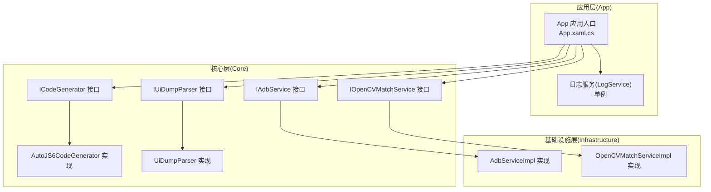
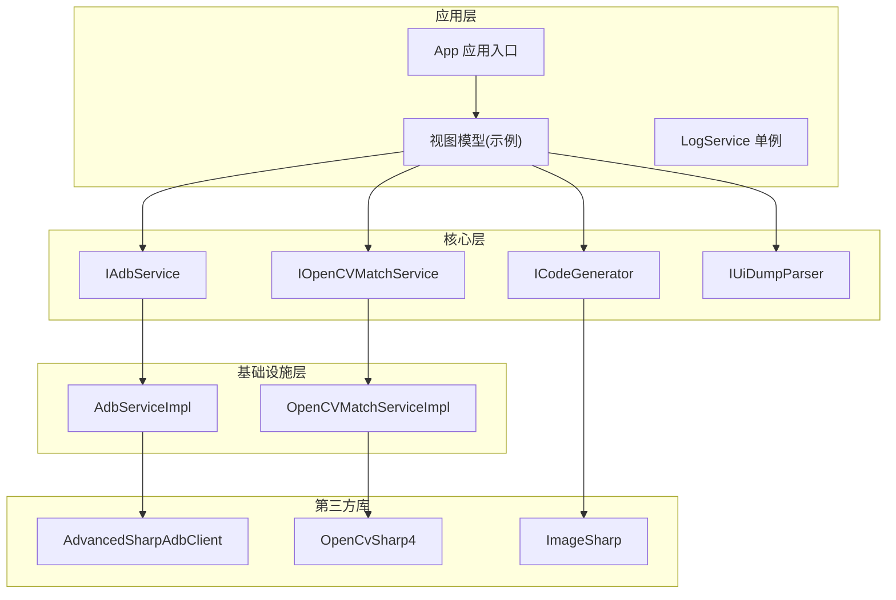
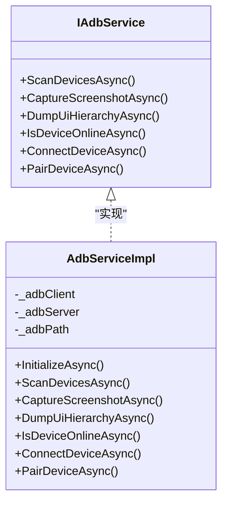
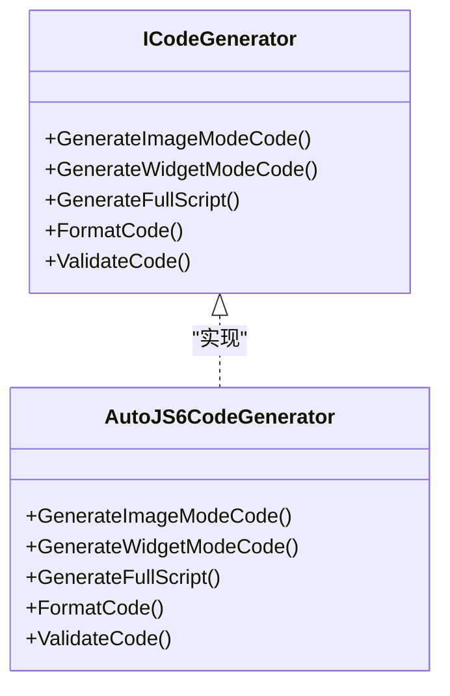
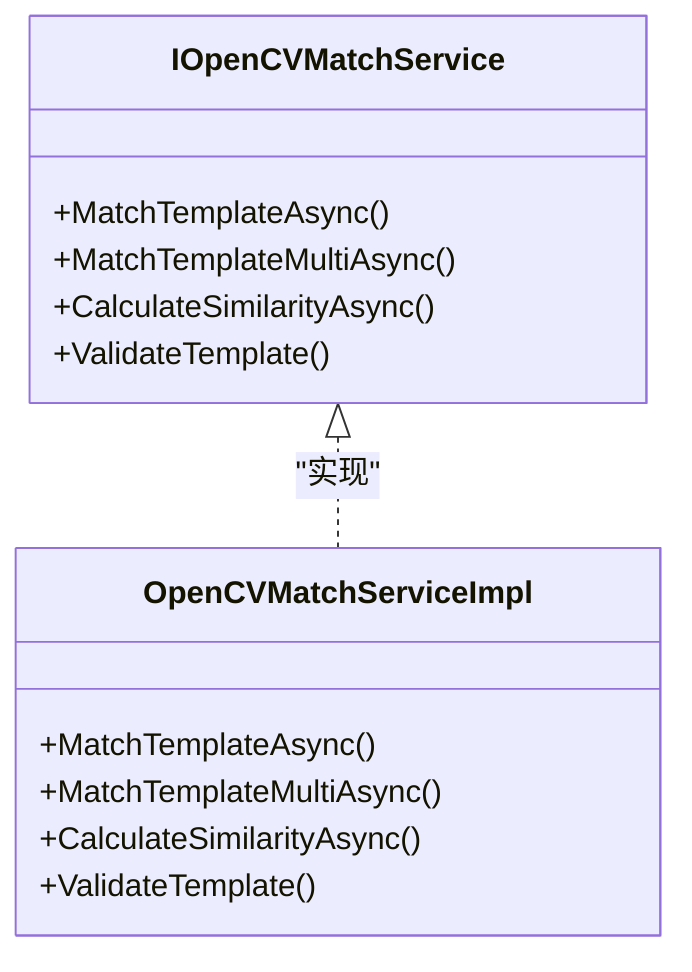
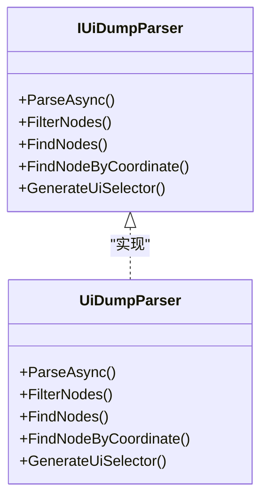
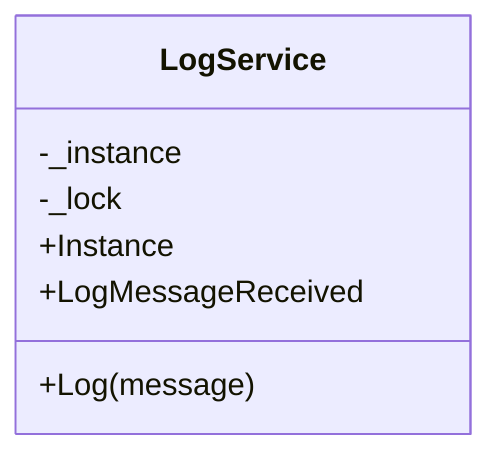
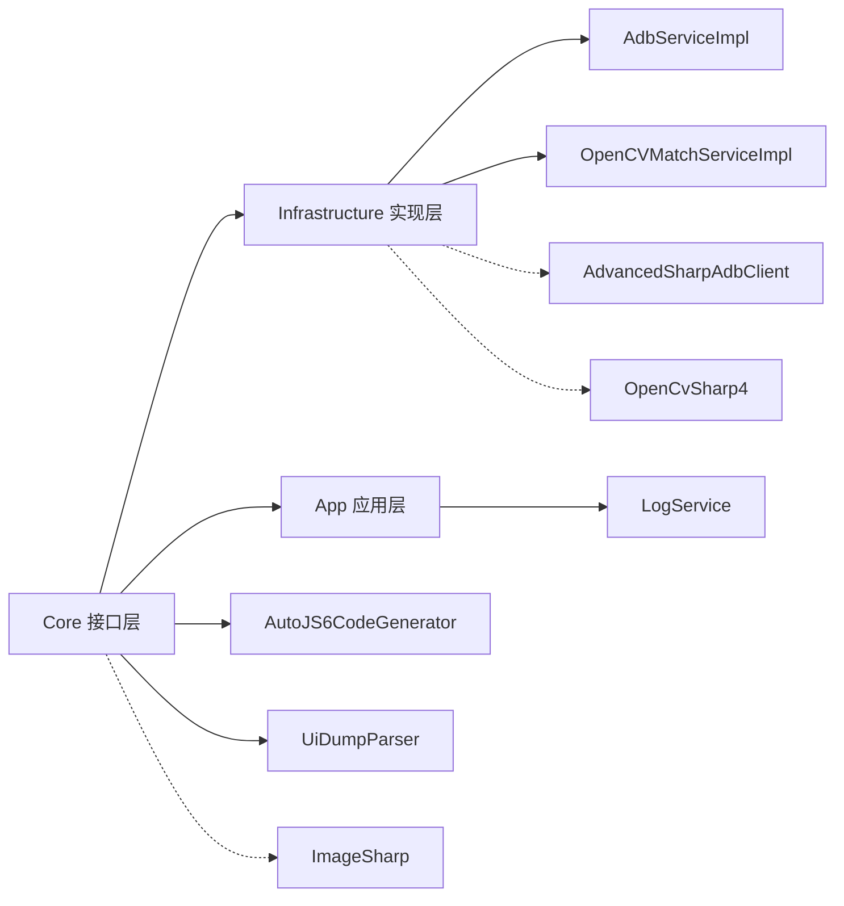

# 依赖注入模式

<cite>
**本文引用的文件**
- [App.xaml.cs](file://App/App.xaml.cs)
- [LogService.cs](file://App/Services/LogService.cs)
- [IAdbService.cs](file://Core/Abstractions/IAdbService.cs)
- [AdbServiceImpl.cs](file://Infrastructure/Adb/AdbServiceImpl.cs)
- [ICodeGenerator.cs](file://Core/Abstractions/ICodeGenerator.cs)
- [AutoJS6CodeGenerator.cs](file://Core/Services/AutoJS6CodeGenerator.cs)
- [IOpenCVMatchService.cs](file://Core/Abstractions/IOpenCVMatchService.cs)
- [OpenCVMatchServiceImpl.cs](file://Infrastructure/Imaging/OpenCVMatchServiceImpl.cs)
- [IUiDumpParser.cs](file://Core/Abstractions/IUiDumpParser.cs)
- [UiDumpParser.cs](file://Core/Services/UiDumpParser.cs)
- [Infrastructure.csproj](file://Infrastructure/Infrastructure.csproj)
- [Core.csproj](file://Core/Core.csproj)
</cite>

## 目录
1. [引言](#引言)
2. [项目结构](#项目结构)
3. [核心组件](#核心组件)
4. [架构总览](#架构总览)
5. [详细组件分析](#详细组件分析)
6. [依赖关系分析](#依赖关系分析)
7. [性能考量](#性能考量)
8. [故障排查指南](#故障排查指南)
9. [结论](#结论)
10. [附录](#附录)

## 引言
本文件系统性梳理 AutoJS6 开发工具中的依赖注入模式与依赖倒置实践，重点覆盖以下方面：
- 接口与实现分离：以 Core 抽象层定义接口，Infrastructure 与 Core 实现层分别提供具体实现。
- 构造函数注入最佳实践：通过构造函数接收依赖，确保对象创建即具备所需能力，便于测试与替换。
- 服务生命周期管理：明确单例、瞬态等生命周期策略，避免资源泄漏与状态污染。
- 依赖解析流程：从接口到实现的绑定与解析，以及在业务模块中的使用方式。
- 实际应用示例：展示如何在项目中正确注册接口、实现与依赖解析。

## 项目结构
项目采用分层架构，核心职责清晰分离：
- Core：定义领域抽象（接口）、模型与基础服务（如 UI Dump 解析器）。
- Infrastructure：实现 Core 接口的具体服务（ADB、OpenCV 匹配等），并引入第三方库。
- App：应用入口与 UI 层，负责展示与用户交互；日志服务在此层以单例形式提供统一输出入口。

图表来源
- [App.xaml.cs:1-57](file://App/App.xaml.cs#L1-L57)
- [LogService.cs:1-51](file://App/Services/LogService.cs#L1-L51)
- [IAdbService.cs:1-57](file://Core/Abstractions/IAdbService.cs#L1-L57)
- [AdbServiceImpl.cs:1-238](file://Infrastructure/Adb/AdbServiceImpl.cs#L1-L238)
- [ICodeGenerator.cs:1-46](file://Core/Abstractions/ICodeGenerator.cs#L1-L46)
- [AutoJS6CodeGenerator.cs:1-357](file://Core/Services/AutoJS6CodeGenerator.cs#L1-L357)
- [IOpenCVMatchService.cs:1-57](file://Core/Abstractions/IOpenCVMatchService.cs#L1-L57)
- [OpenCVMatchServiceImpl.cs:1-204](file://Infrastructure/Imaging/OpenCVMatchServiceImpl.cs#L1-L204)
- [IUiDumpParser.cs:1-56](file://Core/Abstractions/IUiDumpParser.cs#L1-L56)
- [UiDumpParser.cs:1-263](file://Core/Services/UiDumpParser.cs#L1-L263)

章节来源
- [App.xaml.cs:1-57](file://App/App.xaml.cs#L1-L57)
- [Infrastructure.csproj:1-19](file://Infrastructure/Infrastructure.csproj#L1-L19)
- [Core.csproj:1-10](file://Core/Core.csproj#L1-L10)

## 核心组件
本节聚焦于依赖注入相关的核心组件与接口设计，强调接口定义、实现与构造函数注入的使用方式。

- 抽象接口（Core/Abstractions）
  - ADB 服务接口：IAdbService，定义设备扫描、截图捕获、UI Dump 获取、设备连接与配对等方法。
  - 代码生成接口：ICodeGenerator，定义图像/控件模式代码生成、完整脚本生成、代码格式化与验证。
  - OpenCV 匹配接口：IOpenCVMatchService，定义模板匹配、多匹配、相似度计算与模板有效性校验。
  - UI Dump 解析接口：IUiDumpParser，定义 XML 解析、节点过滤、节点查找、坐标定位与 UiSelector 生成。

- 具体实现（Infrastructure/Core）
  - ADB 实现：AdbServiceImpl，基于 AdvancedSharpAdbClient 提供设备管理与截图、UI Dump 能力。
  - 代码生成实现：AutoJS6CodeGenerator，按 AutoJS6 引擎约束生成脚本与验证。
  - OpenCV 实现：OpenCVMatchServiceImpl，基于 OpenCvSharp 执行模板匹配与相似度计算。
  - UI Dump 解析实现：UiDumpParser，解析 XML 并构建控件树，支持多种查询与选择器生成。

- 日志服务（App/Services）
  - LogService：单例日志服务，统一输出日志并广播给 UI 订阅者。

章节来源
- [IAdbService.cs:1-57](file://Core/Abstractions/IAdbService.cs#L1-L57)
- [AdbServiceImpl.cs:1-238](file://Infrastructure/Adb/AdbServiceImpl.cs#L1-L238)
- [ICodeGenerator.cs:1-46](file://Core/Abstractions/ICodeGenerator.cs#L1-L46)
- [AutoJS6CodeGenerator.cs:1-357](file://Core/Services/AutoJS6CodeGenerator.cs#L1-L357)
- [IOpenCVMatchService.cs:1-57](file://Core/Abstractions/IOpenCVMatchService.cs#L1-L57)
- [OpenCVMatchServiceImpl.cs:1-204](file://Infrastructure/Imaging/OpenCVMatchServiceImpl.cs#L1-L204)
- [IUiDumpParser.cs:1-56](file://Core/Abstractions/IUiDumpParser.cs#L1-L56)
- [UiDumpParser.cs:1-263](file://Core/Services/UiDumpParser.cs#L1-L263)
- [LogService.cs:1-51](file://App/Services/LogService.cs#L1-L51)

## 架构总览
下图展示了依赖注入在项目中的整体流向：应用层通过接口消费服务，具体实现位于基础设施与核心实现层，第三方库由基础设施层引入。

图表来源
- [App.xaml.cs:1-57](file://App/App.xaml.cs#L1-L57)
- [IAdbService.cs:1-57](file://Core/Abstractions/IAdbService.cs#L1-L57)
- [AdbServiceImpl.cs:1-238](file://Infrastructure/Adb/AdbServiceImpl.cs#L1-L238)
- [ICodeGenerator.cs:1-46](file://Core/Abstractions/ICodeGenerator.cs#L1-L46)
- [AutoJS6CodeGenerator.cs:1-357](file://Core/Services/AutoJS6CodeGenerator.cs#L1-L357)
- [IOpenCVMatchService.cs:1-57](file://Core/Abstractions/IOpenCVMatchService.cs#L1-L57)
- [OpenCVMatchServiceImpl.cs:1-204](file://Infrastructure/Imaging/OpenCVMatchServiceImpl.cs#L1-L204)
- [Infrastructure.csproj:13-17](file://Infrastructure/Infrastructure.csproj#L13-L17)

## 详细组件分析

### ADB 服务：接口与实现
- 接口设计：IAdbService 明确设备管理与截图/UI Dump 能力，方法签名涵盖异步操作与取消令牌，便于在 UI 线程中安全调用。
- 实现注入：AdbServiceImpl 在构造函数中直接持有底层客户端与可选的 ADB 路径参数，适合通过构造函数注入外部依赖（例如 ADB 路径或配置对象）。
- 生命周期：实现类内部创建客户端与服务器实例，建议在应用启动阶段初始化并复用，避免频繁重启服务带来的开销。

图表来源
- [IAdbService.cs:1-57](file://Core/Abstractions/IAdbService.cs#L1-L57)
- [AdbServiceImpl.cs:1-238](file://Infrastructure/Adb/AdbServiceImpl.cs#L1-L238)

章节来源
- [IAdbService.cs:1-57](file://Core/Abstractions/IAdbService.cs#L1-L57)
- [AdbServiceImpl.cs:1-238](file://Infrastructure/Adb/AdbServiceImpl.cs#L1-L238)

### 代码生成器：接口与实现
- 接口设计：ICodeGenerator 定义图像/控件模式代码生成、完整脚本生成、代码格式化与验证，满足 AutoJS6 引擎约束。
- 实现注入：AutoJS6CodeGenerator 作为纯实现类，不依赖外部可注入依赖，适合直接实例化或通过工厂模式提供。
- 依赖扩展：若未来需要引入模板引擎或外部格式化工具，可在构造函数中注入相应依赖，保持接口契约不变。

图表来源
- [ICodeGenerator.cs:1-46](file://Core/Abstractions/ICodeGenerator.cs#L1-L46)
- [AutoJS6CodeGenerator.cs:1-357](file://Core/Services/AutoJS6CodeGenerator.cs#L1-L357)

章节来源
- [ICodeGenerator.cs:1-46](file://Core/Abstractions/ICodeGenerator.cs#L1-L46)
- [AutoJS6CodeGenerator.cs:1-357](file://Core/Services/AutoJS6CodeGenerator.cs#L1-L357)

### OpenCV 匹配服务：接口与实现
- 接口设计：IOpenCVMatchService 定义模板匹配、多匹配、相似度计算与模板校验，支持区域裁剪与取消令牌。
- 实现注入：OpenCVMatchServiceImpl 以同步任务包装的方式执行 OpenCV 操作，适合在后台线程运行，避免阻塞 UI。
- 生命周期：实现类为密封类，内部使用托管资源（Mat），通过 using 语句确保释放，建议以瞬态或作用域服务使用。

图表来源
- [IOpenCVMatchService.cs:1-57](file://Core/Abstractions/IOpenCVMatchService.cs#L1-L57)
- [OpenCVMatchServiceImpl.cs:1-204](file://Infrastructure/Imaging/OpenCVMatchServiceImpl.cs#L1-L204)

章节来源
- [IOpenCVMatchService.cs:1-57](file://Core/Abstractions/IOpenCVMatchService.cs#L1-L57)
- [OpenCVMatchServiceImpl.cs:1-204](file://Infrastructure/Imaging/OpenCVMatchServiceImpl.cs#L1-L204)

### UI Dump 解析器：接口与实现
- 接口设计：IUiDumpParser 定义 XML 解析、节点过滤、节点查找、坐标定位与 UiSelector 生成，支持多种查询条件。
- 实现注入：UiDumpParser 以纯实现类提供解析与查询能力，适合直接实例化或通过工厂模式提供。
- 依赖扩展：若未来需要引入缓存或更复杂的查询优化，可在构造函数中注入相应依赖。

图表来源
- [IUiDumpParser.cs:1-56](file://Core/Abstractions/IUiDumpParser.cs#L1-L56)
- [UiDumpParser.cs:1-263](file://Core/Services/UiDumpParser.cs#L1-L263)

章节来源
- [IUiDumpParser.cs:1-56](file://Core/Abstractions/IUiDumpParser.cs#L1-L56)
- [UiDumpParser.cs:1-263](file://Core/Services/UiDumpParser.cs#L1-L263)

### 日志服务：单例与事件发布
- 设计要点：LogService 采用线程安全的单例模式，统一输出日志并通过事件向 UI 发布，便于集中展示与调试。
- 使用建议：在应用启动时初始化一次，避免重复创建；在各层通过静态属性访问，保证一致性。

图表来源
- [LogService.cs:1-51](file://App/Services/LogService.cs#L1-L51)

章节来源
- [LogService.cs:1-51](file://App/Services/LogService.cs#L1-L51)

## 依赖关系分析
- 项目依赖关系
  - Infrastructure 项目引用 Core，引入第三方库（ADB、OpenCV、ImageSharp）。
  - App 层通过 Core 接口消费服务，不直接依赖具体实现，体现依赖倒置。
- 依赖注入容器配置建议
  - 服务注册：将 IAdbService 注册为 AdbServiceImpl，将 IOpenCVMatchService 注册为 OpenCVMatchServiceImpl，将 ICodeGenerator 注册为 AutoJS6CodeGenerator，将 IUiDumpParser 注册为 UiDumpParser。
  - 生命周期：
    - 单例：适用于无状态或轻量状态的服务（如日志服务 LogService）。
    - 瞬态：适用于每次使用都需要全新实例的服务（如 OpenCV 匹配服务）。
    - 作用域：适用于每个请求或 UI 会话内的服务（根据实际场景选择）。
  - 依赖解析：在视图模型或服务中通过构造函数注入所需接口，确保对象创建即具备依赖。

图表来源
- [Infrastructure.csproj:9-17](file://Infrastructure/Infrastructure.csproj#L9-L17)
- [Core.csproj:1-10](file://Core/Core.csproj#L1-L10)
- [AdbServiceImpl.cs:1-238](file://Infrastructure/Adb/AdbServiceImpl.cs#L1-L238)
- [OpenCVMatchServiceImpl.cs:1-204](file://Infrastructure/Imaging/OpenCVMatchServiceImpl.cs#L1-L204)
- [AutoJS6CodeGenerator.cs:1-357](file://Core/Services/AutoJS6CodeGenerator.cs#L1-L357)
- [UiDumpParser.cs:1-263](file://Core/Services/UiDumpParser.cs#L1-L263)
- [LogService.cs:1-51](file://App/Services/LogService.cs#L1-L51)

章节来源
- [Infrastructure.csproj:1-19](file://Infrastructure/Infrastructure.csproj#L1-L19)
- [Core.csproj:1-10](file://Core/Core.csproj#L1-L10)

## 性能考量
- I/O 密集与 CPU 密集分离
  - ADB 截图与 UI Dump：属于 I/O 密集，建议在后台线程执行，避免阻塞 UI。
  - OpenCV 匹配：属于 CPU 密集，建议在后台线程执行并限制并发，避免占用过多资源。
- 资源管理
  - OpenCVMatchServiceImpl 内部使用 Mat 等托管资源，确保及时释放，避免内存泄漏。
- 缓存与重用
  - 对于重复使用的模板或截图，可考虑在上层进行缓存，减少重复计算与 I/O。
- 取消与超时
  - 所有异步方法均支持取消令牌，应在 UI 层合理设置超时与取消逻辑，提升用户体验。

## 故障排查指南
- ADB 服务初始化失败
  - 症状：InitializeAsync 返回 false 或抛出异常。
  - 排查：确认 ADB 路径是否正确，环境变量 PATH 是否包含 ADB，Android SDK 是否安装。
  - 参考实现：AdbServiceImpl.FindAdbPath 与 InitializeAsync。
- 截图为空或尺寸异常
  - 症状：CaptureScreenshotAsync 返回空数据或尺寸不匹配。
  - 排查：检查设备状态、截图权限与帧缓冲区处理逻辑。
  - 参考实现：AdbServiceImpl.CaptureScreenshotAsync。
- UI Dump 解析失败
  - 症状：ParseAsync 返回空或解析异常。
  - 排查：确认 XML 内容完整性与编码格式，检查根节点是否存在。
  - 参考实现：UiDumpParser.ParseAsync。
- OpenCV 匹配结果为空
  - 症状：MatchTemplateAsync 返回 null 或空列表。
  - 排查：确认模板与截图尺寸一致、阈值设置合理、区域裁剪范围有效。
  - 参考实现：OpenCVMatchServiceImpl.MatchTemplateAsync。
- 日志未显示
  - 症状：LogService.Log 未在 UI 中显示。
  - 排查：确认 UI 已订阅 LogMessageReceived 事件，且在主线程更新 UI。

章节来源
- [AdbServiceImpl.cs:1-238](file://Infrastructure/Adb/AdbServiceImpl.cs#L1-L238)
- [UiDumpParser.cs:1-263](file://Core/Services/UiDumpParser.cs#L1-L263)
- [OpenCVMatchServiceImpl.cs:1-204](file://Infrastructure/Imaging/OpenCVMatchServiceImpl.cs#L1-L204)
- [LogService.cs:1-51](file://App/Services/LogService.cs#L1-L51)

## 结论
本项目通过清晰的分层与接口抽象，实现了良好的依赖倒置与可替换性。结合构造函数注入与合理的生命周期管理，能够有效提升系统的可维护性与可测试性。建议在现有基础上进一步引入依赖注入容器，统一注册与解析流程，使依赖关系更加透明可控。

## 附录

### 依赖注入容器配置示例（概念性说明）
- 服务注册（示例）
  - 单例：LogService.Instance
  - 瞬态：IAdbService -> AdbServiceImpl
  - 瞬态：IOpenCVMatchService -> OpenCVMatchServiceImpl
  - 瞬态：ICodeGenerator -> AutoJS6CodeGenerator
  - 瞬态：IUiDumpParser -> UiDumpParser
- 依赖解析（示例）
  - 在视图模型或服务中通过构造函数注入所需接口，确保对象创建即具备依赖。
- 生命周期管理（示例）
  - 单例：全局共享，适合无状态或轻量状态服务。
  - 瞬态：每次解析创建新实例，适合无共享状态的 CPU 密集服务。
  - 作用域：按请求或会话隔离，适合需要上下文隔离的服务。

### 代码示例路径（用于参考）
- ADB 服务接口定义：[IAdbService.cs:1-57](file://Core/Abstractions/IAdbService.cs#L1-L57)
- ADB 服务实现与构造函数注入：[AdbServiceImpl.cs:1-238](file://Infrastructure/Adb/AdbServiceImpl.cs#L1-L238)
- 代码生成器接口与实现：[ICodeGenerator.cs:1-46](file://Core/Abstractions/ICodeGenerator.cs#L1-L46), [AutoJS6CodeGenerator.cs:1-357](file://Core/Services/AutoJS6CodeGenerator.cs#L1-L357)
- OpenCV 匹配接口与实现：[IOpenCVMatchService.cs:1-57](file://Core/Abstractions/IOpenCVMatchService.cs#L1-L57), [OpenCVMatchServiceImpl.cs:1-204](file://Infrastructure/Imaging/OpenCVMatchServiceImpl.cs#L1-L204)
- UI Dump 解析接口与实现：[IUiDumpParser.cs:1-56](file://Core/Abstractions/IUiDumpParser.cs#L1-L56), [UiDumpParser.cs:1-263](file://Core/Services/UiDumpParser.cs#L1-L263)
- 日志服务单例与事件发布：[LogService.cs:1-51](file://App/Services/LogService.cs#L1-L51)