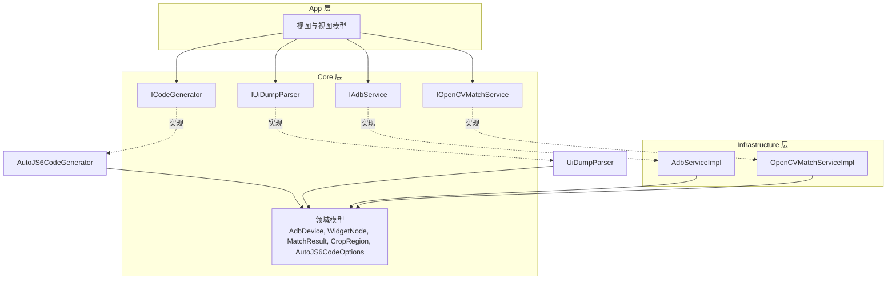
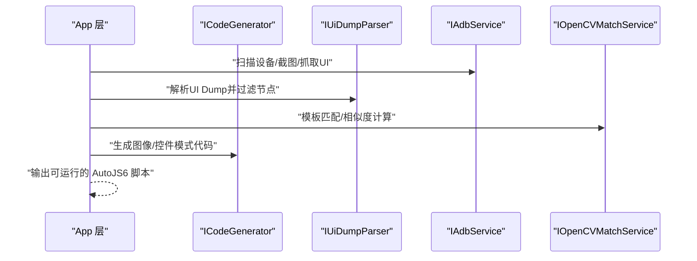
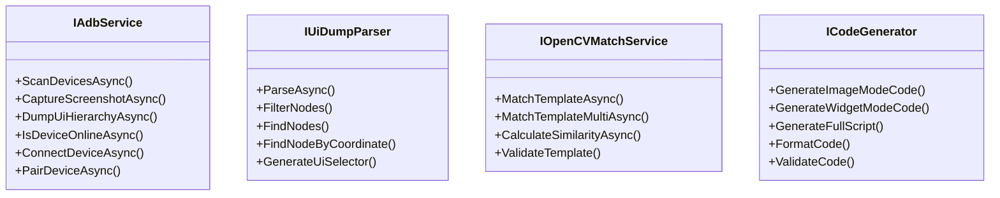
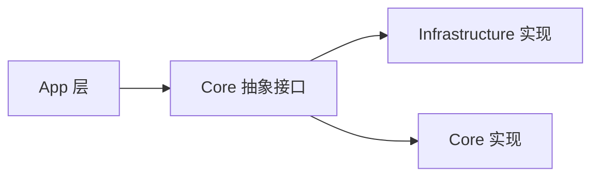
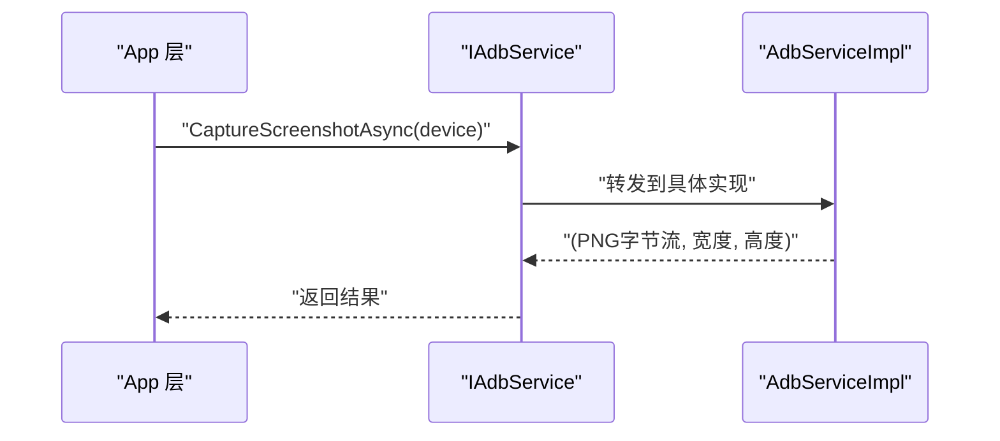
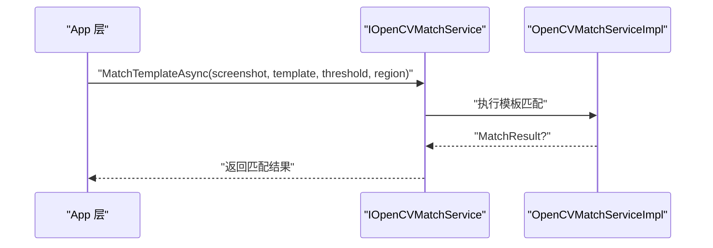
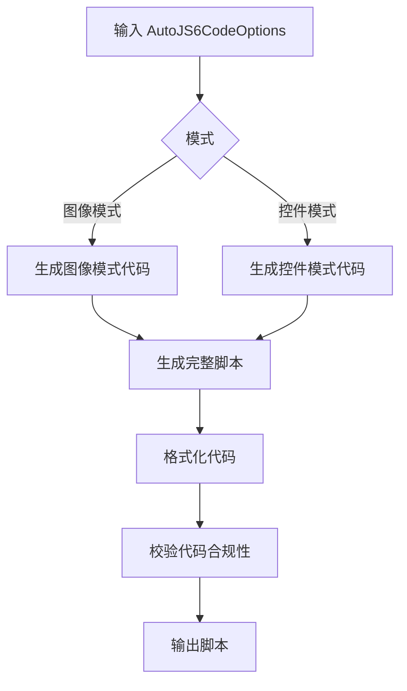
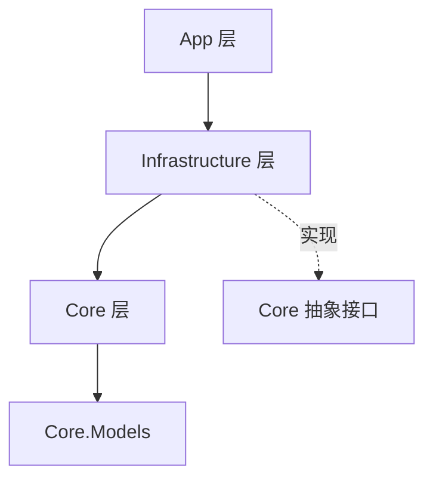

# 接口设计原则

<cite>
**本文引用的文件**
- [IAdbService.cs](file://Core/Abstractions/IAdbService.cs)
- [ICodeGenerator.cs](file://Core/Abstractions/ICodeGenerator.cs)
- [IOpenCVMatchService.cs](file://Core/Abstractions/IOpenCVMatchService.cs)
- [IUiDumpParser.cs](file://Core/Abstractions/IUiDumpParser.cs)
- [AdbServiceImpl.cs](file://Infrastructure/Adb/AdbServiceImpl.cs)
- [OpenCVMatchServiceImpl.cs](file://Infrastructure/Imaging/OpenCVMatchServiceImpl.cs)
- [AutoJS6CodeGenerator.cs](file://Core/Services/AutoJS6CodeGenerator.cs)
- [UiDumpParser.cs](file://Core/Services/UiDumpParser.cs)
- [AutoJS6CodeOptions.cs](file://Core/Models/AutoJS6CodeOptions.cs)
- [WidgetNode.cs](file://Core/Models/WidgetNode.cs)
- [MatchResult.cs](file://Core/Models/MatchResult.cs)
- [CropRegion.cs](file://Core/Models/CropRegion.cs)
- [AdbDevice.cs](file://Core/Models/AdbDevice.cs)
- [README.md](file://README.md)
- [AutoJS6CodeGeneratorTests.cs](file://Core.Tests/AutoJS6CodeGeneratorTests.cs)
- [UiDumpParserTests.cs](file://Core.Tests/UiDumpParserTests.cs)
- [ImageMatchRegionCalculatorTests.cs](file://Core.Tests/ImageMatchRegionCalculatorTests.cs)
</cite>

## 目录
1. [引言](#引言)
2. [项目结构](#项目结构)
3. [核心组件](#核心组件)
4. [架构总览](#架构总览)
5. [详细组件分析](#详细组件分析)
6. [依赖关系分析](#依赖关系分析)
7. [性能考量](#性能考量)
8. [故障排查指南](#故障排查指南)
9. [结论](#结论)
10. [附录](#附录)

## 引言
本文件围绕 AutoJS6 开发工具的接口设计原则展开，重点阐释以下主题：
- 接口隔离原则：如何设计小而专注的接口，避免接口污染与“胖接口”。
- 依赖倒置原则：高层模块不依赖低层模块，而是依赖抽象接口；具体实现注入到抽象之上。
- 面向接口编程的最佳实践：接口命名规范、方法设计、错误处理策略。
- 具体示例：Core 层抽象接口与实现层的松耦合设计。

本设计遵循 Clean Architecture 分层思想，确保 Core 层纯业务逻辑、无 UI 依赖，并通过抽象接口与实现解耦，使 App 与 Infrastructure 层仅依赖 Core 抽象。

## 项目结构
项目采用分层架构：
- App：UI 与 MVVM，不直接依赖外部库。
- Core：纯业务逻辑，定义抽象接口与领域模型。
- Infrastructure：外部依赖适配器（ADB、OpenCV 等），实现 Core 抽象。

图表来源
- [IAdbService.cs:8-56](file://Core/Abstractions/IAdbService.cs#L8-L56)
- [ICodeGenerator.cs:8-45](file://Core/Abstractions/ICodeGenerator.cs#L8-L45)
- [IUiDumpParser.cs:8-55](file://Core/Abstractions/IUiDumpParser.cs#L8-L55)
- [IOpenCVMatchService.cs:8-56](file://Core/Abstractions/IOpenCVMatchService.cs#L8-L56)
- [AdbServiceImpl.cs:17-237](file://Infrastructure/Adb/AdbServiceImpl.cs#L17-L237)
- [OpenCVMatchServiceImpl.cs:11-203](file://Infrastructure/Imaging/OpenCVMatchServiceImpl.cs#L11-L203)
- [AutoJS6CodeGenerator.cs:11-356](file://Core/Services/AutoJS6CodeGenerator.cs#L11-L356)
- [UiDumpParser.cs:12-262](file://Core/Services/UiDumpParser.cs#L12-L262)

章节来源
- [README.md:264-287](file://README.md#L264-L287)

## 核心组件
本节聚焦四个核心抽象接口及其职责边界，体现接口隔离原则：
- IAdbService：设备扫描、截图捕获、UI Dump、设备连接与配对等设备侧能力。
- ICodeGenerator：AutoJS6 代码生成（图像模式、控件模式、完整脚本）、代码格式化与校验。
- IUiDumpParser：UI Dump 解析、节点过滤、节点查询、坐标定位、UiSelector 生成。
- IOpenCVMatchService：模板匹配（单个/多个）、相似度计算、模板有效性验证。

这些接口均以单一职责为核心，避免“一个接口承担过多功能”，从而降低客户端对不相关方法的依赖与编译耦合。

章节来源
- [IAdbService.cs:8-56](file://Core/Abstractions/IAdbService.cs#L8-L56)
- [ICodeGenerator.cs:8-45](file://Core/Abstractions/ICodeGenerator.cs#L8-L45)
- [IUiDumpParser.cs:8-55](file://Core/Abstractions/IUiDumpParser.cs#L8-L55)
- [IOpenCVMatchService.cs:8-56](file://Core/Abstractions/IOpenCVMatchService.cs#L8-L56)

## 架构总览
下图展示 App 层如何通过抽象接口调用 Core 与 Infrastructure 实现，体现依赖倒置原则：高层模块（App）不依赖低层模块（具体实现），而是依赖抽象。

图表来源
- [IAdbService.cs:14-54](file://Core/Abstractions/IAdbService.cs#L14-L54)
- [IUiDumpParser.cs:15-54](file://Core/Abstractions/IUiDumpParser.cs#L15-L54)
- [IOpenCVMatchService.cs:19-55](file://Core/Abstractions/IOpenCVMatchService.cs#L19-L55)
- [ICodeGenerator.cs:15-44](file://Core/Abstractions/ICodeGenerator.cs#L15-L44)

## 详细组件分析

### 组件一：接口隔离原则的落地
- 小而专注的接口
  - IAdbService：聚焦设备生命周期与屏幕/UI 数据获取，方法数量少且职责明确。
  - IUiDumpParser：聚焦 UI Dump 的解析、过滤、查询与选择器生成。
  - IOpenCVMatchService：聚焦模板匹配与相似度计算，方法语义清晰。
  - ICodeGenerator：聚焦代码生成、格式化与校验，避免混入其他职责。
- 避免接口污染
  - 各接口均不互相继承或组合，避免“胖接口”。例如，UI 解析与设备控制、图像匹配与代码生成彼此独立。
  - 参数与返回值尽量使用 Core.Models 中的领域模型，减少跨层类型耦合。

图表来源
- [IAdbService.cs:8-56](file://Core/Abstractions/IAdbService.cs#L8-L56)
- [IUiDumpParser.cs:8-55](file://Core/Abstractions/IUiDumpParser.cs#L8-L55)
- [IOpenCVMatchService.cs:8-56](file://Core/Abstractions/IOpenCVMatchService.cs#L8-L56)
- [ICodeGenerator.cs:8-45](file://Core/Abstractions/ICodeGenerator.cs#L8-L45)

章节来源
- [IAdbService.cs:8-56](file://Core/Abstractions/IAdbService.cs#L8-L56)
- [IUiDumpParser.cs:8-55](file://Core/Abstractions/IUiDumpParser.cs#L8-L55)
- [IOpenCVMatchService.cs:8-56](file://Core/Abstractions/IOpenCVMatchService.cs#L8-L56)
- [ICodeGenerator.cs:8-45](file://Core/Abstractions/ICodeGenerator.cs#L8-L45)

### 组件二：依赖倒置原则的实现
- 高层模块（App）依赖抽象（Core 抽象接口），而非具体实现。
- 具体实现位于 Infrastructure 层，通过构造函数注入或依赖注入容器绑定到抽象。
- 示例：
  - App 层调用 ICodeGenerator、IUiDumpParser、IAdbService、IOpenCVMatchService。
  - 实际运行时由 IoC 容器绑定到 AutoJS6CodeGenerator、UiDumpParser、AdbServiceImpl、OpenCVMatchServiceImpl。

图表来源
- [AdbServiceImpl.cs:17-237](file://Infrastructure/Adb/AdbServiceImpl.cs#L17-L237)
- [OpenCVMatchServiceImpl.cs:11-203](file://Infrastructure/Imaging/OpenCVMatchServiceImpl.cs#L11-L203)
- [AutoJS6CodeGenerator.cs:11-356](file://Core/Services/AutoJS6CodeGenerator.cs#L11-L356)
- [UiDumpParser.cs:12-262](file://Core/Services/UiDumpParser.cs#L12-L262)

章节来源
- [README.md:272-287](file://README.md#L272-L287)

### 组件三：面向接口编程的最佳实践
- 命名规范
  - 接口以大写字母 I 前缀命名，语义清晰，如 IAdbService、ICodeGenerator、IUiDumpParser、IOpenCVMatchService。
- 方法设计
  - 方法职责单一，参数与返回值尽量使用 Core.Models 中的领域对象，避免跨层类型泄漏。
  - 支持异步与取消令牌，保证 UI 不阻塞与可中断。
- 错误处理策略
  - 对外抛出通用异常或返回空值/可选结果，内部捕获并记录，避免泄露实现细节。
  - 在实现层对输入进行校验（如模板有效性、设备存在性），并在异常时提供明确错误信息。

章节来源
- [IAdbService.cs:14-54](file://Core/Abstractions/IAdbService.cs#L14-L54)
- [IUiDumpParser.cs:15-54](file://Core/Abstractions/IUiDumpParser.cs#L15-L54)
- [IOpenCVMatchService.cs:19-55](file://Core/Abstractions/IOpenCVMatchService.cs#L19-L55)
- [ICodeGenerator.cs:15-44](file://Core/Abstractions/ICodeGenerator.cs#L15-L44)

### 组件四：Core 层抽象接口与实现示例

#### IAdbService：设备与截图/UI Dump 获取
- 关键方法
  - 扫描设备、截图捕获（返回 PNG 字节流与尺寸）、UI Dump 获取、设备在线状态检查、网络设备连接与配对。
- 设计要点
  - 返回值使用元组封装，避免额外包装类型。
  - 支持 CancellationToken，便于取消与超时控制。
  - 对设备不存在或操作失败进行异常化处理，便于上层统一捕获。

图表来源
- [IAdbService.cs:22-22](file://Core/Abstractions/IAdbService.cs#L22-L22)
- [AdbServiceImpl.cs:72-118](file://Infrastructure/Adb/AdbServiceImpl.cs#L72-L118)

章节来源
- [IAdbService.cs:14-54](file://Core/Abstractions/IAdbService.cs#L14-L54)
- [AdbServiceImpl.cs:51-179](file://Infrastructure/Adb/AdbServiceImpl.cs#L51-L179)

#### IUiDumpParser：UI Dump 解析与节点查询
- 关键方法
  - 异步解析 XML，过滤布局容器节点，按属性与坐标查找节点，生成 UiSelector。
- 设计要点
  - 递归遍历与过滤，保持树结构完整性。
  - 坐标查找优先返回最深层节点，提升交互准确性。
  - 生成的 UiSelector 优先使用 resource-id，其次 text/desc/className，最后 boundsInside。

```mermaid
flowchart TD
Start(["开始"]) --> Parse["解析 XML 为节点树"]
Parse --> Filter["过滤布局容器节点"]
Filter --> FindById["按资源ID查找"]
Filter --> FindByText["按文本查找"]
Filter --> FindByDesc["按内容描述查找"]
Filter --> FindByClass["按类名查找"]
Filter --> FindByCoord["按坐标查找最深节点"]
FindById --> GenSel["生成 UiSelector"]
FindByText --> GenSel
FindByDesc --> GenSel
FindByClass --> GenSel
FindByCoord --> GenSel
GenSel --> End(["结束"])
```

图表来源
- [IUiDumpParser.cs:15-54](file://Core/Abstractions/IUiDumpParser.cs#L15-L54)
- [UiDumpParser.cs:14-97](file://Core/Services/UiDumpParser.cs#L14-L97)

章节来源
- [IUiDumpParser.cs:15-54](file://Core/Abstractions/IUiDumpParser.cs#L15-L54)
- [UiDumpParser.cs:37-97](file://Core/Services/UiDumpParser.cs#L37-L97)

#### IOpenCVMatchService：模板匹配与相似度计算
- 关键方法
  - 单模板匹配（返回最佳结果）、多模板匹配（返回所有高于阈值的结果）、相似度计算、模板有效性验证。
- 设计要点
  - 使用 OpenCvSharp 进行模板匹配，返回 MatchResult 结果对象，包含置信度、坐标、耗时等。
  - 支持裁剪区域搜索，提高匹配精度与性能。
  - 对异常进行吞并与返回空值/空列表，保证调用方健壮性。

图表来源
- [IOpenCVMatchService.cs:19-40](file://Core/Abstractions/IOpenCVMatchService.cs#L19-L40)
- [OpenCVMatchServiceImpl.cs:13-59](file://Infrastructure/Imaging/OpenCVMatchServiceImpl.cs#L13-L59)

章节来源
- [IOpenCVMatchService.cs:19-55](file://Core/Abstractions/IOpenCVMatchService.cs#L19-L55)
- [OpenCVMatchServiceImpl.cs:13-161](file://Infrastructure/Imaging/OpenCVMatchServiceImpl.cs#L13-L161)

#### ICodeGenerator：AutoJS6 代码生成与校验
- 关键方法
  - 图像模式代码生成、控件模式代码生成、完整脚本生成、代码格式化、代码有效性校验。
- 设计要点
  - 严格遵守 AutoJS6 运行时约束（Rhino 引擎限制），避免在循环体内使用 const/let。
  - 提供重试与超时机制开关，支持模板回收，降低内存占用。
  - 生成的代码可直接复制到设备运行，减少人工拼写错误。

图表来源
- [ICodeGenerator.cs:15-44](file://Core/Abstractions/ICodeGenerator.cs#L15-L44)
- [AutoJS6CodeGenerator.cs:13-189](file://Core/Services/AutoJS6CodeGenerator.cs#L13-L189)

章节来源
- [ICodeGenerator.cs:15-44](file://Core/Abstractions/ICodeGenerator.cs#L15-L44)
- [AutoJS6CodeGenerator.cs:13-258](file://Core/Services/AutoJS6CodeGenerator.cs#L13-L258)

## 依赖关系分析
- 单向依赖：App → Infrastructure → Core ← Infrastructure
- Core 层不依赖 App 或 Infrastructure，仅定义抽象接口与领域模型，保证独立测试与复用。
- 实现层仅依赖 Core 抽象，不反向依赖 App。

图表来源
- [README.md:272-287](file://README.md#L272-L287)

章节来源
- [README.md:272-287](file://README.md#L272-L287)

## 性能考量
- 异步优先：所有 I/O 操作（ADB、OpenCV、XML 解析、图像编码）均采用 async/await，避免阻塞 UI 线程。
- 取消与超时：广泛使用 CancellationToken，结合超时配置，防止长时间阻塞。
- 区域裁剪：模板匹配支持裁剪区域，缩小搜索范围，提升性能与稳定性。
- 资源管理：及时回收图像资源（recycle），避免内存泄漏。

## 故障排查指南
- 设备连接问题
  - 确认 ADB 服务可用与设备在线状态。
  - 若连接/配对失败，查看异常消息并重试。
- UI Dump 解析失败
  - 检查 XML 是否完整，必要时重新抓取。
  - 使用过滤规则验证布局容器是否被正确剔除。
- 模板匹配失败
  - 调整阈值与裁剪区域，确保模板稳定且不含动态元素。
  - 验证模板有效性与尺寸。
- 代码生成不符合 AutoJS6 约束
  - 确保循环体内使用 var 而非 const/let。
  - 启用 ValidateCode 校验，修正返回的错误列表。

章节来源
- [AdbServiceImpl.cs:150-179](file://Infrastructure/Adb/AdbServiceImpl.cs#L150-L179)
- [UiDumpParser.cs:14-35](file://Core/Services/UiDumpParser.cs#L14-L35)
- [OpenCVMatchServiceImpl.cs:150-161](file://Infrastructure/Imaging/OpenCVMatchServiceImpl.cs#L150-L161)
- [AutoJS6CodeGenerator.cs:226-258](file://Core/Services/AutoJS6CodeGenerator.cs#L226-L258)

## 结论
本项目通过严格的接口隔离与依赖倒置设计，实现了 Core 层的纯净与可测试性，同时通过抽象接口与实现解耦，使 App 与 Infrastructure 层能够灵活演进。面向接口编程的最佳实践体现在命名规范、方法设计与错误处理策略上，配合异步与取消机制，确保了高性能与高可靠性。

## 附录
- 领域模型概览
  - AutoJS6CodeOptions：代码生成配置项（模式、阈值、重试次数、变量前缀、模板路径、区域、控件节点、开关等）。
  - WidgetNode：控件节点信息（类名、资源 ID、文本、内容描述、边界框、包名、可交互属性、深度、子节点）。
  - MatchResult：匹配结果（位置、尺寸、置信度、耗时、是否匹配、算法、阈值）。
  - CropRegion：裁剪区域（坐标、尺寸、名称、原图尺寸、参考分辨率）。
  - AdbDevice：设备信息（序列号、型号、状态、连接类型、产品、传输 ID）。

章节来源
- [AutoJS6CodeOptions.cs:6-88](file://Core/Models/AutoJS6CodeOptions.cs#L6-L88)
- [WidgetNode.cs:6-92](file://Core/Models/WidgetNode.cs#L6-L92)
- [MatchResult.cs:6-62](file://Core/Models/MatchResult.cs#L6-L62)
- [CropRegion.cs:6-52](file://Core/Models/CropRegion.cs#L6-L52)
- [AdbDevice.cs:6-37](file://Core/Models/AdbDevice.cs#L6-L37)