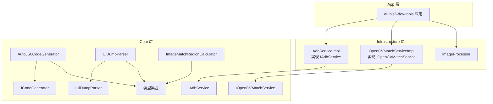
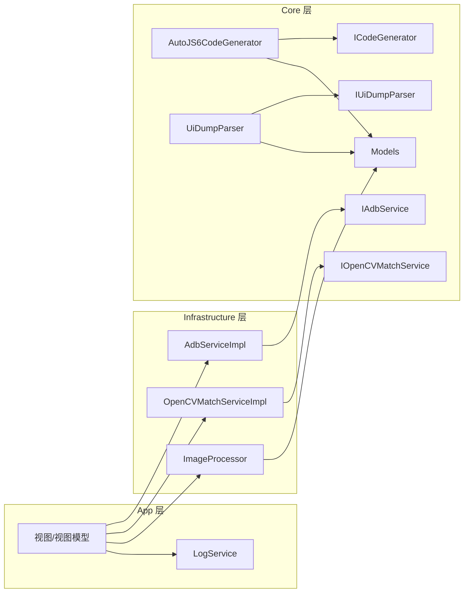
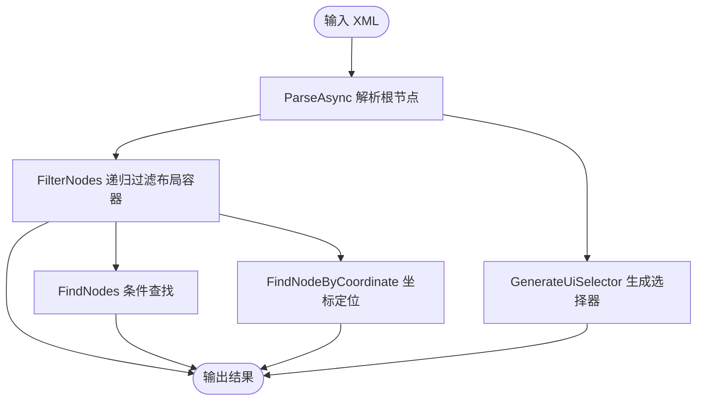
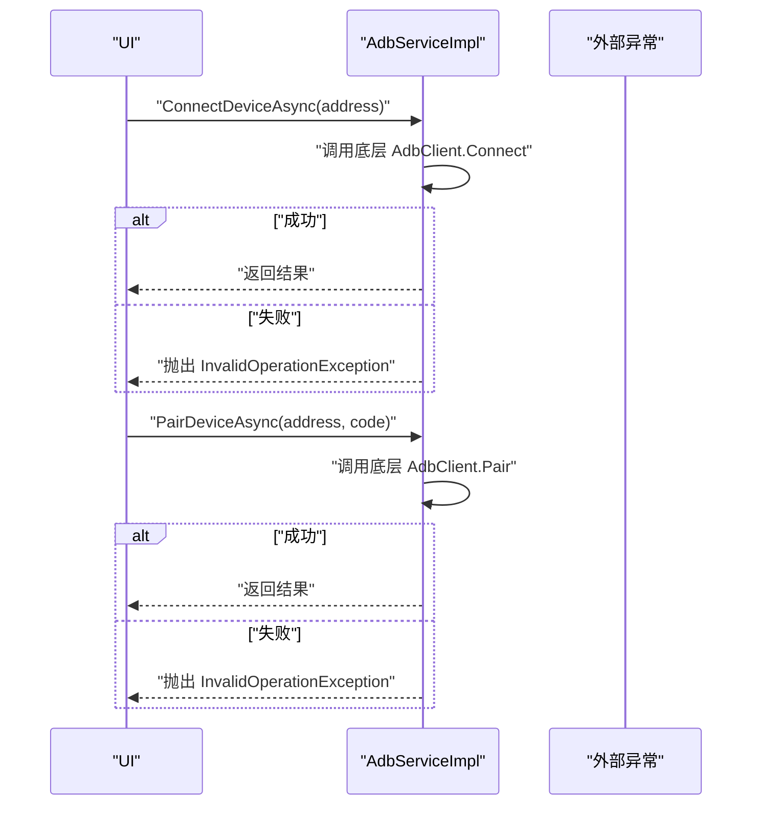
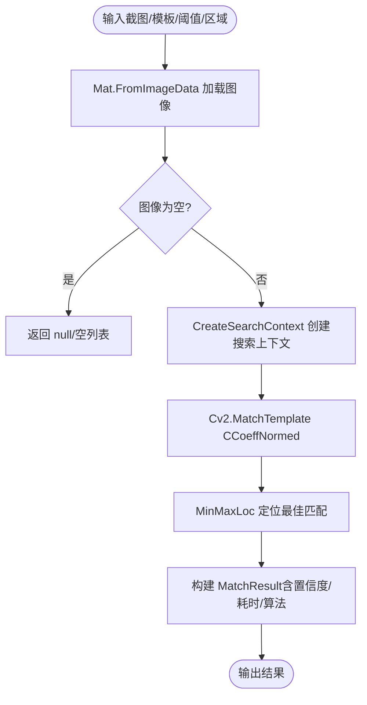
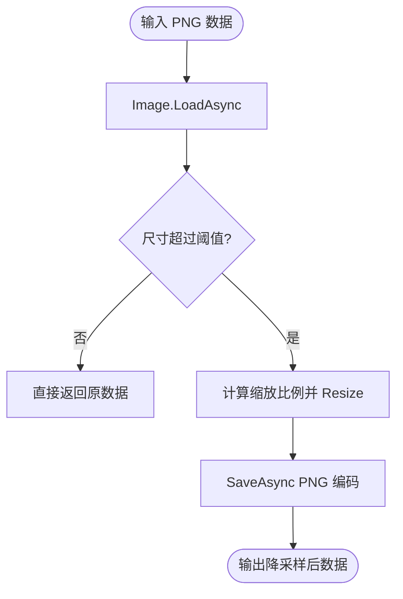
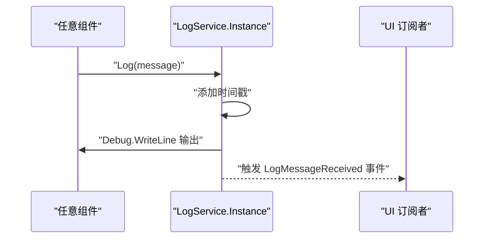
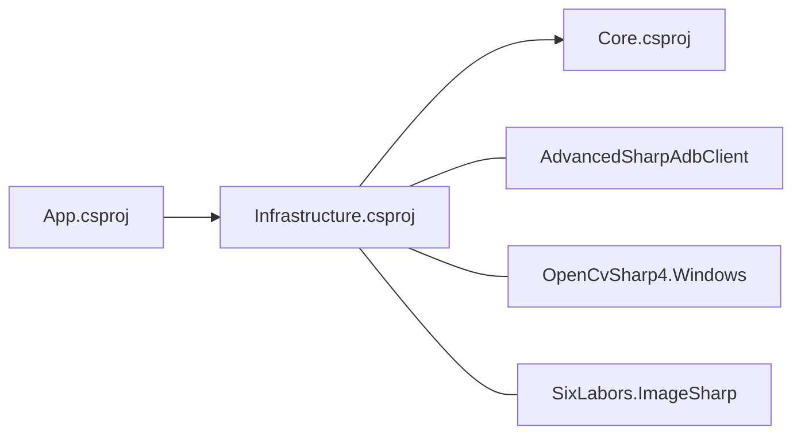

# 架构实践

<cite>
**本文引用的文件**
- [Core/Core.csproj](file://Core/Core.csproj)
- [Infrastructure/Infrastructure.csproj](file://Infrastructure/Infrastructure.csproj)
- [App/App.csproj](file://App/App.csproj)
- [Core/Abstractions/IAdbService.cs](file://Core/Abstractions/IAdbService.cs)
- [Core/Abstractions/ICodeGenerator.cs](file://Core/Abstractions/ICodeGenerator.cs)
- [Core/Abstractions/IOpenCVMatchService.cs](file://Core/Abstractions/IOpenCVMatchService.cs)
- [Core/Abstractions/IUiDumpParser.cs](file://Core/Abstractions/IUiDumpParser.cs)
- [Core/Services/AutoJS6CodeGenerator.cs](file://Core/Services/AutoJS6CodeGenerator.cs)
- [Core/Services/UiDumpParser.cs](file://Core/Services/UiDumpParser.cs)
- [Core/Helpers/ImageMatchRegionCalculator.cs](file://Core/Helpers/ImageMatchRegionCalculator.cs)
- [Core/Models/AutoJS6CodeOptions.cs](file://Core/Models/AutoJS6CodeOptions.cs)
- [Core/Models/WidgetNode.cs](file://Core/Models/WidgetNode.cs)
- [Core/Models/MatchResult.cs](file://Core/Models/MatchResult.cs)
- [Core/Models/CropRegion.cs](file://Core/Models/CropRegion.cs)
- [Infrastructure/Adb/AdbServiceImpl.cs](file://Infrastructure/Adb/AdbServiceImpl.cs)
- [Infrastructure/Imaging/OpenCVMatchServiceImpl.cs](file://Infrastructure/Imaging/OpenCVMatchServiceImpl.cs)
- [Infrastructure/Imaging/ImageProcessor.cs](file://Infrastructure/Imaging/ImageProcessor.cs)
- [App/Services/LogService.cs](file://App/Services/LogService.cs)
</cite>

## 目录
1. [引言](#引言)
2. [项目结构](#项目结构)
3. [核心组件](#核心组件)
4. [架构总览](#架构总览)
5. [详细组件分析](#详细组件分析)
6. [依赖分析](#依赖分析)
7. [性能考量](#性能考量)
8. [故障排查指南](#故障排查指南)
9. [结论](#结论)
10. [附录](#附录)

## 引言
本文件系统性梳理 AutoJS6 开发工具在 Clean Architecture 下的实践标准，围绕三层架构的职责划分与依赖关系展开，结合接口设计原则（接口隔离、依赖倒置、面向接口编程）、依赖注入使用规范（构造函数注入、接口注册、生命周期管理）、分层架构实现要求（Core 纯业务、Infrastructure 外部依赖封装、App UI 分离），并给出可落地的架构决策示例与错误处理/异常管理的架构级规范。

## 项目结构
项目采用多项目解决方案，按 Clean Architecture 分层组织：
- Core 层：纯业务逻辑与领域模型，不依赖任何外部框架或 UI。
- Infrastructure 层：外部依赖封装（ADB、图像处理、OpenCV），仅依赖 Core。
- App 层：UI 与宿主应用，仅依赖 Infrastructure，通过接口解耦。



图表来源
- [App/App.csproj:67-68](file://App/App.csproj#L67-L68)
- [Infrastructure/Infrastructure.csproj:9-11](file://Infrastructure/Infrastructure.csproj#L9-L11)
- [Core/Core.csproj:1-10](file://Core/Core.csproj#L1-L10)

章节来源
- [App/App.csproj:67-68](file://App/App.csproj#L67-L68)
- [Infrastructure/Infrastructure.csproj:9-11](file://Infrastructure/Infrastructure.csproj#L9-L11)
- [Core/Core.csproj:1-10](file://Core/Core.csproj#L1-L10)

## 核心组件
- 接口层（Core.Abstractions）：定义对外能力契约，确保依赖倒置与面向接口编程。
  - IAdbService：设备扫描、截图、UI Dump、连接/配对等。
  - ICodeGenerator：图像/控件模式代码生成、脚本拼装、格式化与校验。
  - IOpenCVMatchService：模板匹配、多匹配、相似度计算、模板有效性校验。
  - IUiDumpParser：UI Dump 解析、节点过滤、节点查找、坐标定位、UiSelector 生成。
- 服务实现（Infrastructure）：对接外部库与系统 API，实现 Core 接口。
  - AdbServiceImpl：基于 AdvancedSharpAdbClient 与 ImageSharp。
  - OpenCVMatchServiceImpl：基于 OpenCvSharp。
  - ImageProcessor：基于 SixLabors.ImageSharp。
- 业务服务（Core.Services）：纯业务逻辑，组合接口契约完成编排。
  - AutoJS6CodeGenerator：根据选项生成代码，含引擎约束校验。
  - UiDumpParser：XML 解析、过滤、查找、坐标定位、UiSelector 生成。
  - ImageMatchRegionCalculator：匹配区域上下文计算。
- 模型（Core.Models）：跨层共享的数据结构。
- 日志服务（App.Services.LogService）：统一日志入口，支持 UI 订阅。

章节来源
- [Core/Abstractions/IAdbService.cs:1-57](file://Core/Abstractions/IAdbService.cs#L1-L57)
- [Core/Abstractions/ICodeGenerator.cs:1-46](file://Core/Abstractions/ICodeGenerator.cs#L1-L46)
- [Core/Abstractions/IOpenCVMatchService.cs:1-57](file://Core/Abstractions/IOpenCVMatchService.cs#L1-L57)
- [Core/Abstractions/IUiDumpParser.cs:1-56](file://Core/Abstractions/IUiDumpParser.cs#L1-L56)
- [Infrastructure/Adb/AdbServiceImpl.cs:1-238](file://Infrastructure/Adb/AdbServiceImpl.cs#L1-L238)
- [Infrastructure/Imaging/OpenCVMatchServiceImpl.cs:1-204](file://Infrastructure/Imaging/OpenCVMatchServiceImpl.cs#L1-L204)
- [Infrastructure/Imaging/ImageProcessor.cs:1-162](file://Infrastructure/Imaging/ImageProcessor.cs#L1-L162)
- [Core/Services/AutoJS6CodeGenerator.cs:1-357](file://Core/Services/AutoJS6CodeGenerator.cs#L1-L357)
- [Core/Services/UiDumpParser.cs:1-263](file://Core/Services/UiDumpParser.cs#L1-L263)
- [Core/Helpers/ImageMatchRegionCalculator.cs:1-99](file://Core/Helpers/ImageMatchRegionCalculator.cs#L1-L99)
- [Core/Models/AutoJS6CodeOptions.cs:1-89](file://Core/Models/AutoJS6CodeOptions.cs#L1-L89)
- [Core/Models/WidgetNode.cs:1-93](file://Core/Models/WidgetNode.cs#L1-L93)
- [Core/Models/MatchResult.cs:1-63](file://Core/Models/MatchResult.cs#L1-L63)
- [Core/Models/CropRegion.cs:1-53](file://Core/Models/CropRegion.cs#L1-L53)
- [App/Services/LogService.cs:1-51](file://App/Services/LogService.cs#L1-L51)

## 架构总览
Clean Architecture 在本项目中的体现：
- 依赖方向：App -> Infrastructure -> Core；Core 不依赖下层。
- 接口定义在 Core，实现位于 Infrastructure，App 仅依赖接口。
- Core 专注业务规则与领域模型，不感知 UI 或外部库细节。
- Infrastructure 仅负责“如何做”，Core 决定“做什么”。



图表来源
- [App/App.csproj:67-68](file://App/App.csproj#L67-L68)
- [Infrastructure/Infrastructure.csproj:9-11](file://Infrastructure/Infrastructure.csproj#L9-L11)
- [Core/Abstractions/IAdbService.cs:1-57](file://Core/Abstractions/IAdbService.cs#L1-L57)
- [Core/Abstractions/ICodeGenerator.cs:1-46](file://Core/Abstractions/ICodeGenerator.cs#L1-L46)
- [Core/Abstractions/IOpenCVMatchService.cs:1-57](file://Core/Abstractions/IOpenCVMatchService.cs#L1-L57)
- [Core/Abstractions/IUiDumpParser.cs:1-56](file://Core/Abstractions/IUiDumpParser.cs#L1-L56)

## 详细组件分析

### 代码生成器（面向接口编程与依赖倒置）
- 设计要点
  - 通过 ICodeGenerator 抽象，Core 仅依赖接口，不关心实现。
  - App 通过构造函数注入具体实现，实现运行时替换。
  - 业务逻辑集中在 Core.Services.AutoJS6CodeGenerator，遵循 Rhino 引擎约束进行校验与格式化。
- 关键流程（生成完整脚本）

```mermaid
sequenceDiagram
participant UI as "UI"
participant Gen as "AutoJS6CodeGenerator"
participant Opt as "AutoJS6CodeOptions"
UI->>Gen : "GenerateFullScript(options)"
Gen->>Opt : "读取模式/阈值/重试等配置"
alt "图像模式"
Gen->>Gen : "GenerateImageModeCode(options)"
Gen-->>UI : "返回脚本"
else "控件模式"
Gen->>Gen : "GenerateWidgetModeCode(options)"
Gen-->>UI : "返回脚本"
end
```

图表来源
- [Core/Services/AutoJS6CodeGenerator.cs:166-189](file://Core/Services/AutoJS6CodeGenerator.cs#L166-L189)
- [Core/Models/AutoJS6CodeOptions.cs:6-89](file://Core/Models/AutoJS6CodeOptions.cs#L6-L89)

章节来源
- [Core/Services/AutoJS6CodeGenerator.cs:1-357](file://Core/Services/AutoJS6CodeGenerator.cs#L1-L357)
- [Core/Abstractions/ICodeGenerator.cs:1-46](file://Core/Abstractions/ICodeGenerator.cs#L1-L46)

### UI Dump 解析器（接口隔离与职责单一）
- 设计要点
  - IUiDumpParser 将解析、过滤、查找、坐标定位、UiSelector 生成拆分为多个方法，满足接口隔离。
  - Core.Services.UiDumpParser 实现所有方法，内部递归处理，保证可测试性与可维护性。
- 关键流程（解析并过滤节点）



图表来源
- [Core/Services/UiDumpParser.cs:14-97](file://Core/Services/UiDumpParser.cs#L14-L97)
- [Core/Abstractions/IUiDumpParser.cs:1-56](file://Core/Abstractions/IUiDumpParser.cs#L1-L56)

章节来源
- [Core/Services/UiDumpParser.cs:1-263](file://Core/Services/UiDumpParser.cs#L1-L263)
- [Core/Abstractions/IUiDumpParser.cs:1-56](file://Core/Abstractions/IUiDumpParser.cs#L1-L56)

### ADB 服务（外部依赖封装与错误传播）
- 设计要点
  - IAdbService 定义设备相关能力，Infrastructure.AdbServiceImpl 实现。
  - 对外抛出明确异常（如设备不存在、连接失败），由调用方决定处理策略。
  - 截图流程包含帧缓冲区行填充检测与 ImageSharp 转码。
- 关键流程（连接/配对设备）



图表来源
- [Infrastructure/Adb/AdbServiceImpl.cs:150-179](file://Infrastructure/Adb/AdbServiceImpl.cs#L150-L179)
- [Core/Abstractions/IAdbService.cs:45-54](file://Core/Abstractions/IAdbService.cs#L45-L54)

章节来源
- [Infrastructure/Adb/AdbServiceImpl.cs:1-238](file://Infrastructure/Adb/AdbServiceImpl.cs#L1-L238)
- [Core/Abstractions/IAdbService.cs:1-57](file://Core/Abstractions/IAdbService.cs#L1-L57)

### OpenCV 模板匹配（算法封装与上下文管理）
- 设计要点
  - IOpenCVMatchService 提供单/多匹配、相似度计算、模板校验。
  - Infrastructure.Imaging.OpenCVMatchServiceImpl 使用 OpenCvSharp，并以 SearchContext 管理搜索区域与偏移。
- 关键流程（单模板匹配）



图表来源
- [Infrastructure/Imaging/OpenCVMatchServiceImpl.cs:13-59](file://Infrastructure/Imaging/OpenCVMatchServiceImpl.cs#L13-L59)
- [Core/Abstractions/IOpenCVMatchService.cs:1-57](file://Core/Abstractions/IOpenCVMatchService.cs#L1-L57)

章节来源
- [Infrastructure/Imaging/OpenCVMatchServiceImpl.cs:1-204](file://Infrastructure/Imaging/OpenCVMatchServiceImpl.cs#L1-L204)
- [Core/Abstractions/IOpenCVMatchService.cs:1-57](file://Core/Abstractions/IOpenCVMatchService.cs#L1-L57)

### 图像处理与区域计算（辅助能力与数据结构）
- 设计要点
  - ImageProcessor 提供 PNG 解码、降采样、裁剪、元数据生成、尺寸查询、有效性校验。
  - ImageMatchRegionCalculator 基于参考矩形与 padding 计算搜索区域与归一化 regionRef，支持横竖屏方向。
- 关键流程（降采样）



图表来源
- [Infrastructure/Imaging/ImageProcessor.cs:47-72](file://Infrastructure/Imaging/ImageProcessor.cs#L47-L72)

章节来源
- [Infrastructure/Imaging/ImageProcessor.cs:1-162](file://Infrastructure/Imaging/ImageProcessor.cs#L1-L162)
- [Core/Helpers/ImageMatchRegionCalculator.cs:1-99](file://Core/Helpers/ImageMatchRegionCalculator.cs#L1-L99)

### 日志服务（统一入口与 UI 订阅）
- 设计要点
  - App.Services.LogService 采用线程安全的单例模式，集中输出日志并广播给 UI。
  - App 侧可在 ViewModel 中订阅 LogMessageReceived 事件，实现可视化日志面板。
- 关键流程（日志输出）



图表来源
- [App/Services/LogService.cs:39-49](file://App/Services/LogService.cs#L39-L49)

章节来源
- [App/Services/LogService.cs:1-51](file://App/Services/LogService.cs#L1-L51)

## 依赖分析
- 项目引用关系
  - App 依赖 Infrastructure（项目引用）。
  - Infrastructure 依赖 Core（项目引用）。
- 包依赖关系
  - Infrastructure 引入 AdvancedSharpAdbClient、OpenCvSharp4.Windows、SixLabors.ImageSharp。
  - App 引入 WindowsAppSDK、CommunityToolkit.Mvvm 等。
- 依赖方向与耦合
  - Core 无任何项目/包依赖，保持纯净。
  - Infrastructure 仅依赖 Core 与第三方库，避免反向依赖。
  - App 仅依赖 Infrastructure，不直接依赖 Core，确保 UI 与业务解耦。



图表来源
- [App/App.csproj:67-68](file://App/App.csproj#L67-L68)
- [Infrastructure/Infrastructure.csproj:9-17](file://Infrastructure/Infrastructure.csproj#L9-L17)
- [Core/Core.csproj:1-10](file://Core/Core.csproj#L1-L10)

章节来源
- [App/App.csproj:67-68](file://App/App.csproj#L67-L68)
- [Infrastructure/Infrastructure.csproj:9-17](file://Infrastructure/Infrastructure.csproj#L9-L17)
- [Core/Core.csproj:1-10](file://Core/Core.csproj#L1-L10)

## 性能考量
- I/O 密集与 CPU 密集分离
  - ADB 截图与 UI Dump 为 I/O 密集，应配合异步与取消令牌，避免阻塞 UI。
  - OpenCV 匹配为 CPU 密集，建议限制并发、使用 Task.Run 并设置合理超时。
- 图像处理优化
  - 降采样控制分辨率上限，减少后续匹配成本。
  - 裁剪区域尽量缩小搜索范围，降低模板匹配复杂度。
- 结果缓存与去抖
  - 对频繁查询的 UI Dump 可考虑缓存，但需注意 UI 层变化导致的失效。
- 超时与重试
  - 为网络操作设置超时，避免长时间等待。
  - 重试策略应指数退避或带抖动，避免雪崩效应。

## 故障排查指南
- 设备连接问题
  - 症状：ConnectDeviceAsync/PariDeviceAsync 抛出异常。
  - 排查：确认 ADB 路径、服务状态、设备授权；检查网络地址格式与配对码。
- 截图失败
  - 症状：CaptureScreenshotAsync 返回空数据或尺寸异常。
  - 排查：检查帧缓冲区行填充、像素格式、ImageSharp 编码；确认设备截图权限。
- 模板匹配无效
  - 症状：MatchTemplateAsync 返回 null 或置信度过低。
  - 排查：验证模板有效性、阈值设置、搜索区域合理性；尝试降采样与增强对比度。
- UI Dump 解析异常
  - 症状：ParseAsync 返回 null 或节点缺失。
  - 排查：确认 XML 格式正确、过滤规则是否误删有效节点。
- 日志不可见
  - 症状：调用 LogService.Log 无输出。
  - 排查：确认 UI 已订阅 LogMessageReceived 事件；检查事件广播链路。

章节来源
- [Infrastructure/Adb/AdbServiceImpl.cs:150-179](file://Infrastructure/Adb/AdbServiceImpl.cs#L150-L179)
- [Infrastructure/Adb/AdbServiceImpl.cs:112-118](file://Infrastructure/Adb/AdbServiceImpl.cs#L112-L118)
- [Infrastructure/Imaging/OpenCVMatchServiceImpl.cs:29-53](file://Infrastructure/Imaging/OpenCVMatchServiceImpl.cs#L29-L53)
- [Core/Services/UiDumpParser.cs:14-35](file://Core/Services/UiDumpParser.cs#L14-L35)
- [App/Services/LogService.cs:32-49](file://App/Services/LogService.cs#L32-L49)

## 结论
本项目在 Clean Architecture 指导下，实现了清晰的分层与职责分离：Core 专注于业务规则与模型，Infrastructure 封装外部依赖，App 仅承担 UI 与宿主职责。通过接口隔离、依赖倒置与面向接口编程，系统具备良好的可测试性与可演进性。建议在后续迭代中持续强化依赖注入的标准化配置与生命周期管理，完善异常传播与错误恢复策略，并在 UI 与业务之间建立更严格的契约与事件驱动机制。

## 附录

### 依赖注入使用规范（建议）
- 构造函数注入
  - 在 App 层通过构造函数接收 Core 接口，便于替换实现与单元测试。
- 接口注册
  - 在应用启动阶段注册接口到实现的映射，避免硬编码 new。
- 生命周期管理
  - 单例：全局只读服务（如日志服务）。
  - 作用域：每次交互或会话相关的服务。
  - 短生命周期：轻量、易创建的服务实例。

### 分层架构实现要求
- Core 层
  - 仅包含业务模型与接口，不包含 UI、数据库、HTTP、文件系统等外部依赖。
  - 业务规则必须可独立测试，不依赖具体实现。
- Infrastructure 层
  - 仅实现 Core 接口，封装外部库与系统 API。
  - 对外异常应明确、可诊断，便于上层统一处理。
- App 层
  - 仅负责 UI 与宿主集成，不包含业务逻辑。
  - 通过接口与 Infrastructure 通信，避免直接依赖具体实现。

### 错误处理与异常管理（架构级规范）
- 异常传播
  - Infrastructure 层将底层异常包装为领域可识别的异常，保留原始异常以便诊断。
- 错误恢复
  - 对可恢复场景（网络波动、设备离线）提供重试与退避策略。
- 日志记录
  - 使用统一日志服务，记录时间戳、上下文与级别，支持 UI 实时展示。
- 用户反馈
  - 在 UI 层以 Toast、对话框等方式反馈关键错误，避免静默失败。