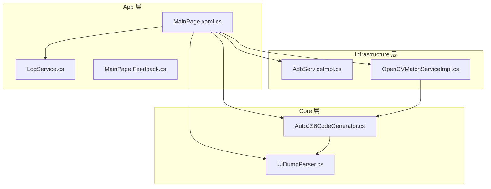
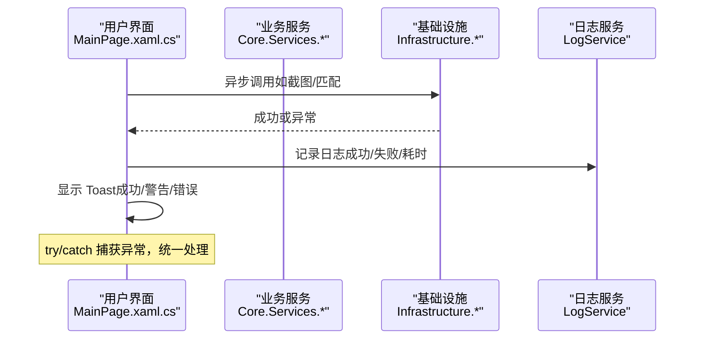
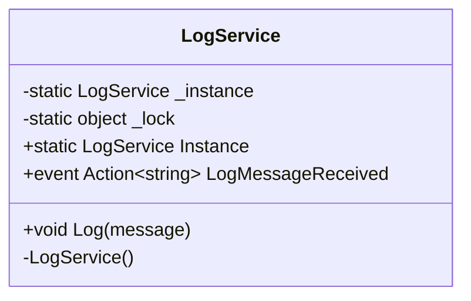
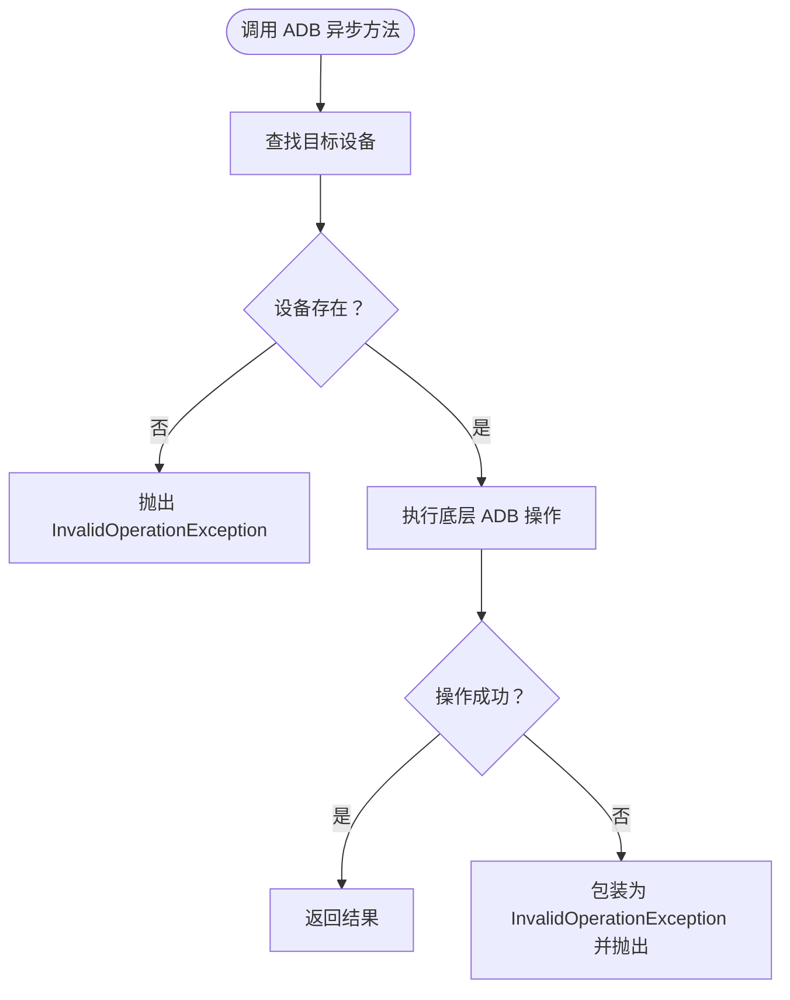
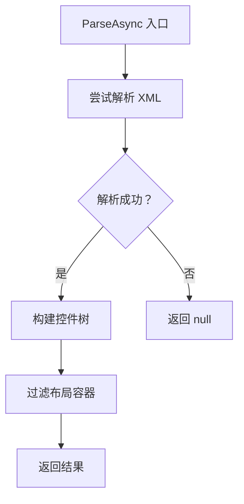
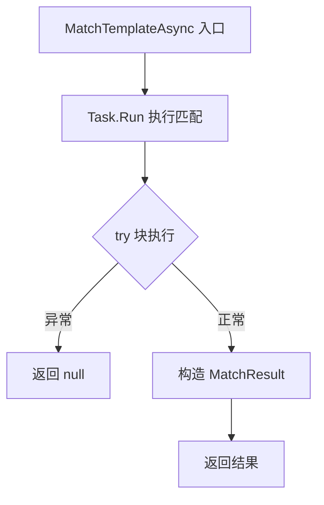
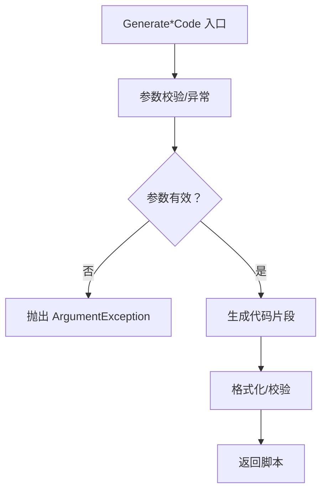
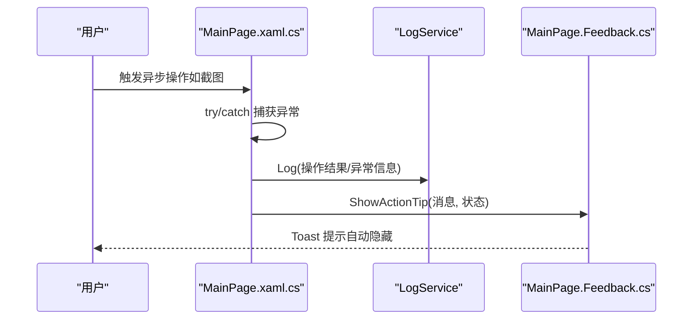
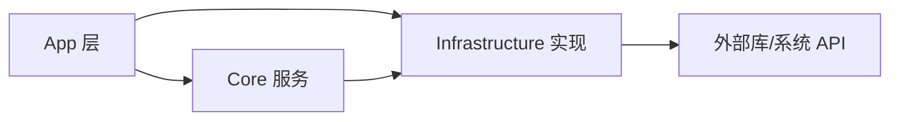

# 错误处理策略

<cite>
**本文引用的文件**   
- [App\Services\LogService.cs](file://App/Services/LogService.cs)
- [App\Views\MainPage.xaml.cs](file://App/Views/MainPage.xaml.cs)
- [App\Views\MainPage.Feedback.cs](file://App/Views/MainWindow.xaml.cs)
- [Infrastructure\Adb\AdbServiceImpl.cs](file://Infrastructure/Adb/AdbServiceImpl.cs)
- [Core\Services\AutoJS6CodeGenerator.cs](file://Core/Services/AutoJS6CodeGenerator.cs)
- [Core\Services\UiDumpParser.cs](file://Core/Services/UiDumpParser.cs)
- [Infrastructure\Imaging\OpenCVMatchServiceImpl.cs](file://Infrastructure/Imaging/OpenCVMatchServiceImpl.cs)
- [Core.Tests\AutoJS6CodeGeneratorTests.cs](file://Core.Tests/AutoJS6CodeGeneratorTests.cs)
- [Core.Tests\UiDumpParserTests.cs](file://Core.Tests/UiDumpParserTests.cs)
- [openspec\changes\winui3-visual-dev-toolkit\tasks.md](file://openspec/changes/winui3-visual-dev-toolkit/tasks.md)
- [openspec\changes\winui3-visual-dev-toolkit\specs\adb-device-management\spec.md](file://openspec/changes/winui3-visual-dev-toolkit/specs/adb-device-management/spec.md)
- [README.md](file://README.md)
</cite>

## 目录
1. [引言](#引言)
2. [项目结构](#项目结构)
3. [核心组件](#核心组件)
4. [架构总览](#架构总览)
5. [详细组件分析](#详细组件分析)
6. [依赖关系分析](#依赖关系分析)
7. [性能考量](#性能考量)
8. [故障排查指南](#故障排查指南)
9. [结论](#结论)
10. [附录](#附录)

## 引言
本文件面向 AutoJS6 开发工具的错误处理策略与异常管理，系统性阐述从应用层到基础设施层的异常传播机制、错误恢复策略、日志记录标准与实现、以及异步操作中的最佳实践。文档以实际代码为依据，结合需求规格与任务清单，给出跨层级（App、Infrastructure、Core）的错误处理范式，并提供可操作的用户友好反馈机制建议。

## 项目结构
AutoJS6 开发工具采用分层架构：
- App 层：UI 页面、用户反馈、日志订阅与展示
- Core 层：业务服务（代码生成、UI 树解析等），定义抽象接口
- Infrastructure 层：具体实现（ADB、图像处理、OpenCV 匹配）

图表来源
- [App\Views\MainPage.xaml.cs:1-409](file://App/Views/MainPage.xaml.cs#L1-L409)
- [App\Services\LogService.cs:1-51](file://App/Services/LogService.cs#L1-L51)
- [App\Views\MainPage.Feedback.cs:1-111](file://App/Views/MainWindow.xaml.cs#L1-L111)
- [Core\Services\AutoJS6CodeGenerator.cs:1-357](file://Core/Services/AutoJS6CodeGenerator.cs#L1-L357)
- [Core\Services\UiDumpParser.cs:1-263](file://Core/Services/UiDumpParser.cs#L1-L263)
- [Infrastructure\Adb\AdbServiceImpl.cs:1-238](file://Infrastructure/Adb/AdbServiceImpl.cs#L1-L238)
- [Infrastructure\Imaging\OpenCVMatchServiceImpl.cs:1-204](file://Infrastructure/Imaging/OpenCVMatchServiceImpl.cs#L1-L204)

章节来源
- [App\Views\MainPage.xaml.cs:1-409](file://App/Views/MainPage.xaml.cs#L1-L409)
- [App\Services\LogService.cs:1-51](file://App/Services/LogService.cs#L1-L51)
- [App\Views\MainPage.Feedback.cs:1-111](file://App/Views/MainWindow.xaml.cs#L1-L111)
- [Core\Services\AutoJS6CodeGenerator.cs:1-357](file://Core/Services/AutoJS6CodeGenerator.cs#L1-L357)
- [Core\Services\UiDumpParser.cs:1-263](file://Core/Services/UiDumpParser.cs#L1-L263)
- [Infrastructure\Adb\AdbServiceImpl.cs:1-238](file://Infrastructure/Adb/AdbServiceImpl.cs#L1-L238)
- [Infrastructure\Imaging\OpenCVMatchServiceImpl.cs:1-204](file://Infrastructure/Imaging/OpenCVMatchServiceImpl.cs#L1-L204)

## 核心组件
- 日志服务（LogService）：全局单例日志入口，统一输出到调试控制台与 UI 日志面板；提供事件驱动的消息发布能力，供 UI 订阅展示。
- ADB 服务（AdbServiceImpl）：封装 ADB 客户端，提供设备扫描、截图、UI Dump、连接/配对等异步操作；对底层异常进行包装与转换，便于上层统一处理。
- UI Dump 解析器（UiDumpParser）：解析 uiautomator XML，构建控件树；对解析异常进行容错处理，返回空值以降低级联崩溃风险。
- OpenCV 匹配服务（OpenCVMatchServiceImpl）：模板匹配与相似度计算；对异常进行捕获并返回安全默认值（null 或空集合），保证 UI 与业务流程稳定。
- 代码生成器（AutoJS6CodeGenerator）：生成 AutoJS6 脚本；对非法参数抛出明确异常；提供代码校验，识别引擎限制（如循环体内 const/let）。
- 主页面（MainPage.xaml.cs）：集中处理 UI 事件与异步操作，负责异常捕获、用户提示（Toast）、日志记录与状态更新。
- 用户反馈（MainPage.Feedback.cs）：统一的 Toast 提示与视觉样式，区分成功、警告、错误三类反馈，自动定时隐藏。

章节来源
- [App\Services\LogService.cs:1-51](file://App/Services/LogService.cs#L1-L51)
- [Infrastructure\Adb\AdbServiceImpl.cs:1-238](file://Infrastructure/Adb/AdbServiceImpl.cs#L1-L238)
- [Core\Services\UiDumpParser.cs:1-263](file://Core/Services/UiDumpParser.cs#L1-L263)
- [Infrastructure\Imaging\OpenCVMatchServiceImpl.cs:1-204](file://Infrastructure/Imaging/OpenCVMatchServiceImpl.cs#L1-L204)
- [Core\Services\AutoJS6CodeGenerator.cs:1-357](file://Core/Services/AutoJS6CodeGenerator.cs#L1-L357)
- [App\Views\MainPage.xaml.cs:1-409](file://App/Views/MainPage.xaml.cs#L1-L409)
- [App\Views\MainPage.Feedback.cs:1-111](file://App/Views/MainWindow.xaml.cs#L1-L111)

## 架构总览
错误处理贯穿三层：
- App 层：UI 事件 -> 异步调用 -> 异常捕获 -> 用户反馈 -> 日志记录
- Core 层：业务服务 -> 参数校验/异常 -> 返回安全结果/异常传播
- Infrastructure 层：外部 API/硬件 -> 异常包装/转换 -> 上层统一处理

图表来源
- [App\Views\MainPage.xaml.cs:147-178](file://App/Views/MainPage.xaml.cs#L147-L178)
- [Infrastructure\Adb\AdbServiceImpl.cs:72-118](file://Infrastructure/Adb/AdbServiceImpl.cs#L72-L118)
- [Infrastructure\Imaging\OpenCVMatchServiceImpl.cs:13-60](file://Infrastructure/Imaging/OpenCVMatchServiceImpl.cs#L13-L60)
- [App\Services\LogService.cs:39-49](file://App/Services/LogService.cs#L39-L49)

## 详细组件分析

### 日志服务（LogService）
- 单例模式，线程安全初始化
- 统一日志格式（带时间戳）
- 输出到调试控制台与 UI 事件订阅者
- UI 订阅日志事件，实时展示日志面板

图表来源
- [App\Services\LogService.cs:9-50](file://App/Services/LogService.cs#L9-L50)

章节来源
- [App\Services\LogService.cs:1-51](file://App/Services/LogService.cs#L1-L51)
- [App\Views\MainPage.xaml.cs:112-118](file://App/Views/MainPage.xaml.cs#L112-L118)

### ADB 服务（AdbServiceImpl）
- 异步 API：截图、UI Dump、设备扫描、连接/配对
- 对底层异常进行包装，抛出语义化异常（如连接失败）
- 设备查找失败时抛出明确异常
- 启动 ADB 服务时捕获异常并返回布尔结果

图表来源
- [Infrastructure\Adb\AdbServiceImpl.cs:72-118](file://Infrastructure/Adb/AdbServiceImpl.cs#L72-L118)
- [Infrastructure\Adb\AdbServiceImpl.cs:150-179](file://Infrastructure/Adb/AdbServiceImpl.cs#L150-L179)

章节来源
- [Infrastructure\Adb\AdbServiceImpl.cs:1-238](file://Infrastructure/Adb/AdbServiceImpl.cs#L1-L238)

### UI Dump 解析器（UiDumpParser）
- 解析 XML 为控件树；异常时返回空值
- 过滤布局容器，保留有效控件
- 坐标查找采用深度优先，优先返回最深匹配节点

图表来源
- [Core\Services\UiDumpParser.cs:14-35](file://Core/Services/UiDumpParser.cs#L14-L35)

章节来源
- [Core\Services\UiDumpParser.cs:1-263](file://Core/Services/UiDumpParser.cs#L1-L263)

### OpenCV 匹配服务（OpenCVMatchServiceImpl）
- 模板匹配与多点匹配：异常时返回空结果或 null
- 相似度计算：异常时返回 0.0
- 模板有效性校验：异常时返回 false

图表来源
- [Infrastructure\Imaging\OpenCVMatchServiceImpl.cs:13-60](file://Infrastructure/Imaging/OpenCVMatchServiceImpl.cs#L13-L60)

章节来源
- [Infrastructure\Imaging\OpenCVMatchServiceImpl.cs:1-204](file://Infrastructure/Imaging/OpenCVMatchServiceImpl.cs#L1-L204)

### 代码生成器（AutoJS6CodeGenerator）
- 图像模式/控件模式生成脚本
- 参数校验：控件模式缺少 Widget 抛出异常
- 代码校验：检测 Rhino 引擎限制（循环体内 const/let）

图表来源
- [Core\Services\AutoJS6CodeGenerator.cs:104-164](file://Core/Services/AutoJS6CodeGenerator.cs#L104-L164)
- [Core\Services\AutoJS6CodeGenerator.cs:226-258](file://Core/Services/AutoJS6CodeGenerator.cs#L226-L258)

章节来源
- [Core\Services\AutoJS6CodeGenerator.cs:1-357](file://Core/Services/AutoJS6CodeGenerator.cs#L1-L357)
- [README.md:346-360](file://README.md#L346-L360)

### 主页面（MainPage.xaml.cs）与用户反馈（MainPage.Feedback.cs）
- 截图/拉取 UI 树等异步操作集中于事件处理函数中
- 捕获异常并显示 Toast，记录日志
- 反馈时长按状态类型区分，自动定时隐藏
- 日志面板订阅 LogService 事件，实时追加日志

图表来源
- [App\Views\MainPage.xaml.cs:147-178](file://App/Views/MainPage.xaml.cs#L147-L178)
- [App\Views\MainPage.xaml.cs:180-248](file://App/Views/MainPage.xaml.cs#L180-L248)
- [App\Views\MainPage.Feedback.cs:23-91](file://App/Views/MainWindow.xaml.cs#L23-L91)
- [App\Services\LogService.cs:39-49](file://App/Services/LogService.cs#L39-L49)

章节来源
- [App\Views\MainPage.xaml.cs:1-409](file://App/Views/MainPage.xaml.cs#L1-L409)
- [App\Views\MainPage.Feedback.cs:1-111](file://App/Views/MainWindow.xaml.cs#L1-L111)

## 依赖关系分析
- App 层依赖 Core 与 Infrastructure 的具体实现，通过接口抽象解耦
- Core 层内部协作：代码生成器依赖 UI Dump 解析器生成选择器
- Infrastructure 层对外部库（ADB、OpenCV）进行封装，向上层暴露稳定的异常契约

图表来源
- [App\Views\MainPage.xaml.cs:19-50](file://App/Views/MainPage.xaml.cs#L19-L50)
- [Core\Services\AutoJS6CodeGenerator.cs:1-11](file://Core/Services/AutoJS6CodeGenerator.cs#L1-L11)
- [Infrastructure\Adb\AdbServiceImpl.cs:1-17](file://Infrastructure/Adb/AdbServiceImpl.cs#L1-L17)
- [Infrastructure\Imaging\OpenCVMatchServiceImpl.cs:1-11](file://Infrastructure/Imaging/OpenCVMatchServiceImpl.cs#L1-L11)

章节来源
- [App\Views\MainPage.xaml.cs:1-60](file://App/Views/MainPage.xaml.cs#L1-L60)
- [Core\Services\AutoJS6CodeGenerator.cs:1-11](file://Core/Services/AutoJS6CodeGenerator.cs#L1-L11)
- [Infrastructure\Adb\AdbServiceImpl.cs:1-28](file://Infrastructure/Adb/AdbServiceImpl.cs#L1-L28)
- [Infrastructure\Imaging\OpenCVMatchServiceImpl.cs:1-20](file://Infrastructure/Imaging/OpenCVMatchServiceImpl.cs#L1-L20)

## 性能考量
- 异步非阻塞：所有 ADB 操作均采用 async/await，避免 UI 阻塞
- 超时控制：通过 CancellationToken 实现超时取消，防止长时间无响应
- 重试机制：在 UI 层或业务层可配置有限次数重试，提升鲁棒性
- 资源回收：图像对象及时回收，减少内存占用
- 匹配范围优化：优先使用区域匹配，缩小搜索范围

章节来源
- [openspec\changes\winui3-visual-dev-toolkit\specs\adb-device-management\spec.md:76-89](file://openspec/changes/winui3-visual-dev-toolkit/specs/adb-device-management/spec.md#L76-L89)
- [openspec\changes\winui3-visual-dev-toolkit\tasks.md:226-235](file://openspec/changes/winui3-visual-dev-toolkit/tasks.md#L226-L235)
- [README.md:362-367](file://README.md#L362-L367)

## 故障排查指南
- ADB 连接失败
  - 现象：连接/配对抛出异常，Toast 提示“连接失败”
  - 排查：检查设备连接类型（USB/TCP/IP）、ADB 路径、设备状态
  - 处理：包装异常为语义化错误，记录日志，提示用户重试
- UI 树解析失败
  - 现象：解析返回 null，UI 树为空
  - 排查：确认 XML 内容完整性、编码问题
  - 处理：记录异常信息，回退到全量节点或提示用户重新拉取
- 匹配异常
  - 现象：匹配返回 null 或空列表
  - 排查：模板有效性、阈值设置、区域范围
  - 处理：返回空结果，记录耗时与置信度，引导用户调整参数
- 代码生成异常
  - 现象：缺少必要参数导致异常
  - 排查：核对 WidgetNode 是否为空、参数合法性
  - 处理：抛出明确异常，提示用户补充信息

章节来源
- [Infrastructure\Adb\AdbServiceImpl.cs:150-179](file://Infrastructure/Adb/AdbServiceImpl.cs#L150-L179)
- [Core\Services\UiDumpParser.cs:14-35](file://Core/Services/UiDumpParser.cs#L14-L35)
- [Infrastructure\Imaging\OpenCVMatchServiceImpl.cs:20-60](file://Infrastructure/Imaging/OpenCVMatchServiceImpl.cs#L20-L60)
- [Core\Services\AutoJS6CodeGenerator.cs:104-109](file://Core/Services/AutoJS6CodeGenerator.cs#L104-L109)

## 结论
本项目通过分层架构与清晰的异常契约，实现了从 UI 到基础设施的稳健错误处理。App 层统一捕获与反馈，Core 层进行参数校验与容错，Infrastructure 层对底层异常进行包装与转换。配合 LogService 的事件驱动日志与 Toast 的用户反馈，形成闭环的错误处理与恢复机制。建议在后续迭代中进一步完善超时与重试策略、增强日志上下文信息，并在单元测试中覆盖更多异常分支。

## 附录

### 异步操作中的异常捕获与错误传播最佳实践
- 在 UI 事件处理函数中使用 try/catch 捕获异常，统一记录日志并提示用户
- 对外暴露的异步方法应支持 CancellationToken，避免长时间阻塞
- 对底层异常进行语义化包装，保留原始异常以便诊断
- 对可能失败的操作返回安全默认值（null/空集合），避免级联崩溃

章节来源
- [App\Views\MainPage.xaml.cs:147-178](file://App/Views/MainPage.xaml.cs#L147-L178)
- [App\Views\MainPage.xaml.cs:180-248](file://App/Views/MainPage.xaml.cs#L180-L248)
- [Infrastructure\Adb\AdbServiceImpl.cs:150-179](file://Infrastructure/Adb/AdbServiceImpl.cs#L150-L179)
- [Infrastructure\Imaging\OpenCVMatchServiceImpl.cs:20-60](file://Infrastructure/Imaging/OpenCVMatchServiceImpl.cs#L20-L60)

### 日志记录标准与实现
- 日志格式：统一带时间戳的字符串
- 输出渠道：调试控制台 + UI 事件订阅
- 记录内容：操作结果、执行耗时、错误信息（不记录命令文本）
- 订阅方式：UI 订阅 LogService 的 LogMessageReceived 事件

章节来源
- [App\Services\LogService.cs:39-49](file://App/Services/LogService.cs#L39-L49)
- [App\Views\MainPage.xaml.cs:112-118](file://App/Views/MainPage.xaml.cs#L112-L118)
- [openspec\changes\winui3-visual-dev-toolkit\specs\adb-device-management\spec.md:39-44](file://openspec/changes/winui3-visual-dev-toolkit/specs/adb-device-management/spec.md#L39-L44)

### 用户友好错误反馈机制
- 成功/警告/错误三类反馈，分别使用不同颜色与图标
- 自动定时隐藏，避免遮挡用户操作
- 关键操作失败时，提供简洁明确的提示与建议

章节来源
- [App\Views\MainPage.Feedback.cs:23-91](file://App/Views/MainWindow.xaml.cs#L23-L91)
- [openspec\changes\winui3-visual-dev-toolkit\tasks.md:226-235](file://openspec/changes/winui3-visual-dev-toolkit/tasks.md#L226-L235)

### 测试与验证要点
- 单元测试覆盖：参数校验、解析异常、匹配异常、代码生成逻辑
- 行为验证：UI 树解析失败返回 null、匹配异常返回空集合、生成脚本符合引擎限制

章节来源
- [Core.Tests\AutoJS6CodeGeneratorTests.cs:1-80](file://Core.Tests/AutoJS6CodeGeneratorTests.cs#L1-L80)
- [Core.Tests\UiDumpParserTests.cs:1-74](file://Core.Tests/UiDumpParserTests.cs#L1-L74)