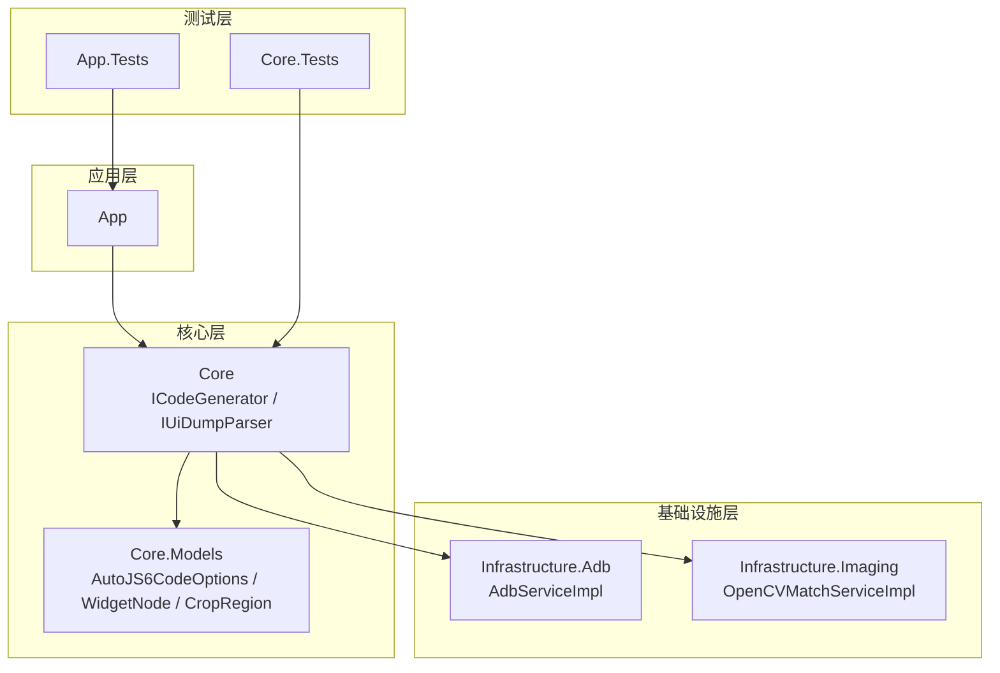
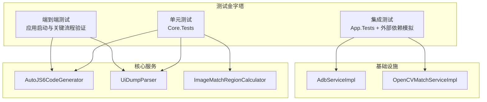
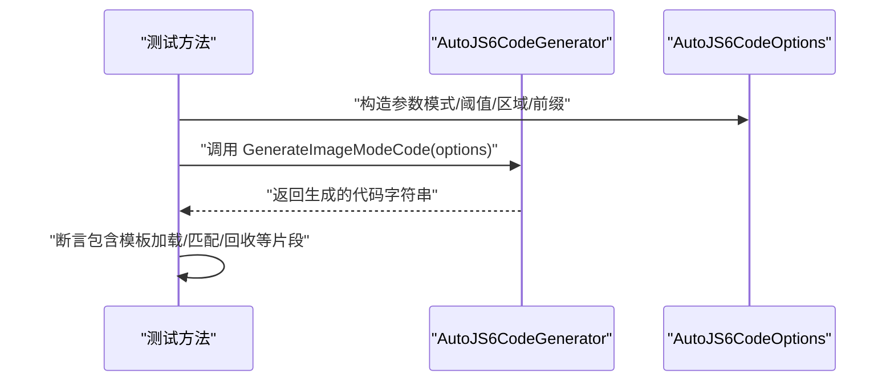
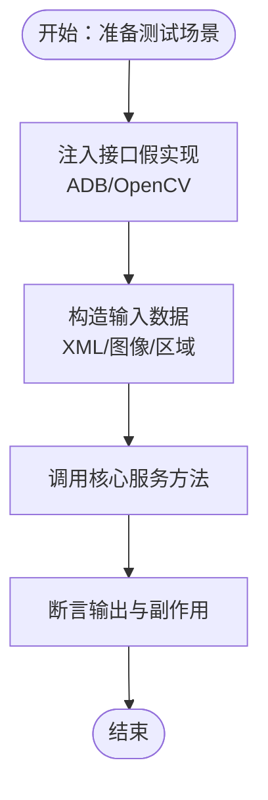
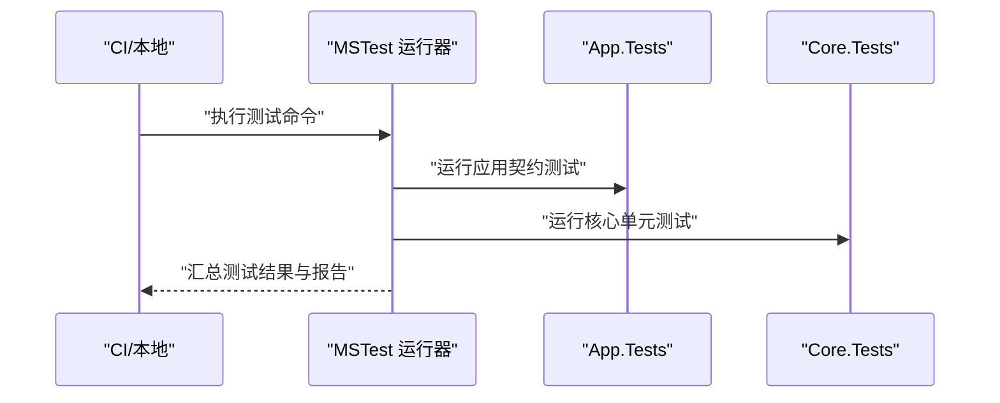
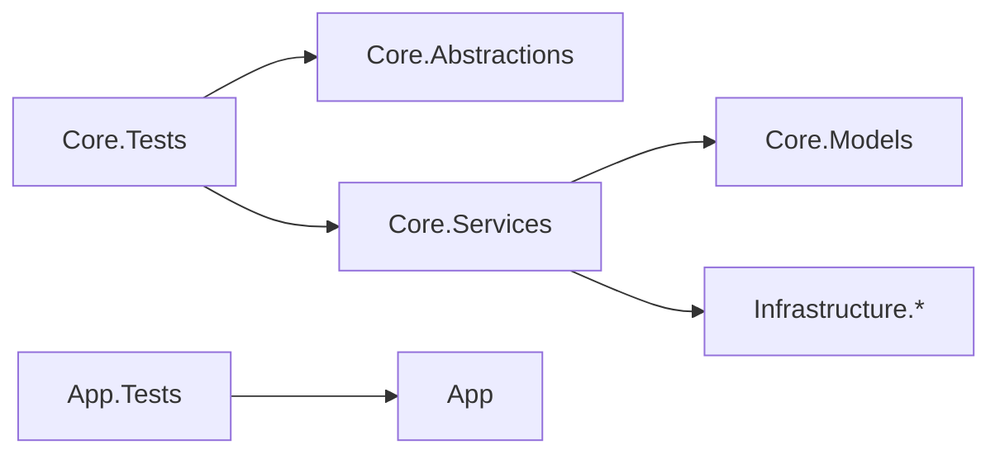

# 测试标准

<cite>
**本文引用的文件**
- [App.Tests/App.Tests.csproj](file://App.Tests/App.Tests.csproj)
- [App.Tests/UnitTests.cs](file://App.Tests/UnitTests.cs)
- [Core.Tests/Core.Tests.csproj](file://Core.Tests/Core.Tests.csproj)
- [Core.Tests/AutoJS6CodeGeneratorTests.cs](file://Core.Tests/AutoJS6CodeGeneratorTests.cs)
- [Core.Tests/UiDumpParserTests.cs](file://Core.Tests/UiDumpParserTests.cs)
- [Core.Tests/ImageMatchRegionCalculatorTests.cs](file://Core.Tests/ImageMatchRegionCalculatorTests.cs)
- [Core/Services/AutoJS6CodeGenerator.cs](file://Core/Services/AutoJS6CodeGenerator.cs)
- [Core/Services/UiDumpParser.cs](file://Core/Services/UiDumpParser.cs)
- [Core/Helpers/ImageMatchRegionCalculator.cs](file://Core/Helpers/ImageMatchRegionCalculator.cs)
- [Core/Abstractions/ICodeGenerator.cs](file://Core/Abstractions/ICodeGenerator.cs)
- [Core/Abstractions/IUiDumpParser.cs](file://Core/Abstractions/IUiDumpParser.cs)
- [Core/Models/AutoJS6CodeOptions.cs](file://Core/Models/AutoJS6CodeOptions.cs)
- [Core/Models/WidgetNode.cs](file://Core/Models/WidgetNode.cs)
- [Core/Models/CropRegion.cs](file://Core/Models/CropRegion.cs)
- [Infrastructure/Adb/AdbServiceImpl.cs](file://Infrastructure/Adb/AdbServiceImpl.cs)
- [Infrastructure/Imaging/OpenCVMatchServiceImpl.cs](file://Infrastructure/Imaging/OpenCVMatchServiceImpl.cs)
- [DEVELOPMENT.md](file://DEVELOPMENT.md)
</cite>

## 目录
1. [引言](#引言)
2. [项目结构](#项目结构)
3. [核心组件](#核心组件)
4. [架构总览](#架构总览)
5. [详细组件分析](#详细组件分析)
6. [依赖分析](#依赖分析)
7. [性能考虑](#性能考虑)
8. [故障排查指南](#故障排查指南)
9. [结论](#结论)
10. [附录](#附录)

## 引言
本测试标准文档面向 AutoJS6 开发工具，旨在建立系统化的测试规范与流程，覆盖单元测试、集成测试与端到端测试的编写与执行策略。文档基于仓库现有测试实现与核心业务组件，明确测试方法命名、断言使用、测试数据准备、覆盖率目标、外部依赖模拟、测试环境配置、测试金字塔比例与应用场景，并提供可操作的测试示例与持续集成配置建议。

## 项目结构
项目采用分层与功能模块结合的组织方式：
- Core：核心业务逻辑与模型，包含代码生成器、UI Dump 解析器、图像匹配区域计算器等。
- Infrastructure：对外部依赖（ADB、OpenCV）的实现封装。
- App：WPF 前端应用，包含视图、视图模型与服务。
- App.Tests：前端契约与构建产物的烟雾测试。
- Core.Tests：核心服务的单元测试。

图表来源
- [Core/Services/AutoJS6CodeGenerator.cs:11-102](file://Core/Services/AutoJS6CodeGenerator.cs#L11-L102)
- [Core/Services/UiDumpParser.cs:12-35](file://Core/Services/UiDumpParser.cs#L12-L35)
- [Core/Helpers/ImageMatchRegionCalculator.cs:35-97](file://Core/Helpers/ImageMatchRegionCalculator.cs#L35-L97)
- [Infrastructure/Adb/AdbServiceImpl.cs:17-49](file://Infrastructure/Adb/AdbServiceImpl.cs#L17-L49)
- [Infrastructure/Imaging/OpenCVMatchServiceImpl.cs:11-60](file://Infrastructure/Imaging/OpenCVMatchServiceImpl.cs#L11-L60)
- [App.Tests/UnitTests.cs:8-40](file://App.Tests/UnitTests.cs#L8-L40)

章节来源
- [App.Tests/App.Tests.csproj:1-17](file://App.Tests/App.Tests.csproj#L1-L17)
- [Core.Tests/Core.Tests.csproj:1-21](file://Core.Tests/Core.Tests.csproj#L1-L21)

## 核心组件
- 接口层
  - ICodeGenerator：定义图像模式与控件模式的代码生成、脚本生成、代码格式化与验证。
  - IUiDumpParser：定义 UI Dump 解析、节点过滤、坐标定位与 UiSelector 生成。
- 服务实现
  - AutoJS6CodeGenerator：实现两种模式的代码生成与验证，遵循 Rhino 引擎约束。
  - UiDumpParser：实现 XML 解析、布局容器过滤、坐标命中与选择器生成。
  - ImageMatchRegionCalculator：计算参考区域与搜索区域，支持横竖屏归一化。
  - AdbServiceImpl：封装 ADB 设备扫描、截图、UI 层次抓取与连接。
  - OpenCVMatchServiceImpl：封装模板匹配、多点匹配与相似度计算。
- 模型
  - AutoJS6CodeOptions：代码生成参数集合。
  - WidgetNode：控件节点属性与层次关系。
  - CropRegion：裁剪区域与参考分辨率。

章节来源
- [Core/Abstractions/ICodeGenerator.cs:8-45](file://Core/Abstractions/ICodeGenerator.cs#L8-L45)
- [Core/Abstractions/IUiDumpParser.cs:8-55](file://Core/Abstractions/IUiDumpParser.cs#L8-L55)
- [Core/Services/AutoJS6CodeGenerator.cs:11-357](file://Core/Services/AutoJS6CodeGenerator.cs#L11-L357)
- [Core/Services/UiDumpParser.cs:12-263](file://Core/Services/UiDumpParser.cs#L12-L263)
- [Core/Helpers/ImageMatchRegionCalculator.cs:9-97](file://Core/Helpers/ImageMatchRegionCalculator.cs#L9-L97)
- [Infrastructure/Adb/AdbServiceImpl.cs:17-238](file://Infrastructure/Adb/AdbServiceImpl.cs#L17-L238)
- [Infrastructure/Imaging/OpenCVMatchServiceImpl.cs:11-204](file://Infrastructure/Imaging/OpenCVMatchServiceImpl.cs#L11-L204)
- [Core/Models/AutoJS6CodeOptions.cs:6-89](file://Core/Models/AutoJS6CodeOptions.cs#L6-L89)
- [Core/Models/WidgetNode.cs:6-93](file://Core/Models/WidgetNode.cs#L6-L93)
- [Core/Models/CropRegion.cs:6-53](file://Core/Models/CropRegion.cs#L6-L53)

## 架构总览
下图展示了测试金字塔在本项目中的落地：以 Core.Tests 为核心进行单元测试，App.Tests 进行轻量的契约与构建产物验证，集成测试通过基础设施层的外部依赖模拟与真实环境结合进行。

图表来源
- [Core.Tests/AutoJS6CodeGeneratorTests.cs:8-79](file://Core.Tests/AutoJS6CodeGeneratorTests.cs#L8-L79)
- [Core.Tests/UiDumpParserTests.cs:7-73](file://Core.Tests/UiDumpParserTests.cs#L7-L73)
- [Core.Tests/ImageMatchRegionCalculatorTests.cs:8-59](file://Core.Tests/ImageMatchRegionCalculatorTests.cs#L8-L59)
- [App.Tests/UnitTests.cs:8-40](file://App.Tests/UnitTests.cs#L8-L40)
- [Infrastructure/Adb/AdbServiceImpl.cs:17-49](file://Infrastructure/Adb/AdbServiceImpl.cs#L17-L49)
- [Infrastructure/Imaging/OpenCVMatchServiceImpl.cs:11-60](file://Infrastructure/Imaging/OpenCVMatchServiceImpl.cs#L11-L60)

## 详细组件分析

### 单元测试规范与示例
- 测试方法命名
  - 使用动宾结构，清晰表达前置条件与期望结果；例如：[方法名应包含关键行为与输入条件]。
  - 示例参考：
    - [GenerateImageModeCode_ShouldUseVarRegionAndTemplateRecycle:10-39](file://Core.Tests/AutoJS6CodeGeneratorTests.cs#L10-L39)
    - [GenerateWidgetModeCode_ShouldKeepIdTextDescFallbackOrder:41-78](file://Core.Tests/AutoJS6CodeGeneratorTests.cs#L41-L78)
    - [ParseAsync_AndFilterNodes_ShouldSkipRedundantLayoutContainers:9-36](file://Core.Tests/UiDumpParserTests.cs#L9-L36)
    - [FindNodeByCoordinate_ShouldReturnDeepestMatchingNode:38-62](file://Core.Tests/UiDumpParserTests.cs#L38-L62)
    - [Create_LandscapeReference_ShouldClampAndGenerateRegionRef:10-35](file://Core.Tests/ImageMatchRegionCalculatorTests.cs#L10-L35)
- 断言使用
  - 字符串断言：使用包含断言验证生成代码片段的存在性，如 [StringAssert.Contains:33-38](file://Core.Tests/AutoJS6CodeGeneratorTests.cs#L33-L38)。
  - 数值与集合断言：使用 [Assert.AreEqual:28-35](file://Core.Tests/UiDumpParserTests.cs#L28-L35)、[CollectionAssert.AreEqual](file://Core.Tests/ImageMatchRegionCalculatorTests.cs#L34)。
  - 布尔与空值断言：使用 [Assert.IsTrue/Assert.IsFalse/Assert.IsNotNull/Assert.IsNull:37-38](file://Core.Tests/AutoJS6CodeGeneratorTests.cs#L37-L38)。
- 测试数据准备
  - 使用内联数据对象初始化模型，如 [AutoJS6CodeOptions 与 WidgetNode:14-29](file://Core.Tests/AutoJS6CodeGeneratorTests.cs#L14-L29)。
  - 使用三重引号字符串提供结构化 XML，如 [UiDumpParser 测试 XML:12-21](file://Core.Tests/UiDumpParserTests.cs#L12-L21)。
  - 使用常量阈值与区域参数，确保可重复性与可预测性。

图表来源
- [Core.Tests/AutoJS6CodeGeneratorTests.cs:10-39](file://Core.Tests/AutoJS6CodeGeneratorTests.cs#L10-L39)
- [Core/Services/AutoJS6CodeGenerator.cs:13-102](file://Core/Services/AutoJS6CodeGenerator.cs#L13-L102)
- [Core/Models/AutoJS6CodeOptions.cs:6-72](file://Core/Models/AutoJS6CodeOptions.cs#L6-L72)

章节来源
- [Core.Tests/AutoJS6CodeGeneratorTests.cs:8-79](file://Core.Tests/AutoJS6CodeGeneratorTests.cs#L8-L79)
- [Core.Tests/UiDumpParserTests.cs:7-73](file://Core.Tests/UiDumpParserTests.cs#L7-L73)
- [Core.Tests/ImageMatchRegionCalculatorTests.cs:8-59](file://Core.Tests/ImageMatchRegionCalculatorTests.cs#L8-L59)

### 集成测试设计原则
- 外部依赖模拟
  - 对 ADB 与 OpenCV 的调用通过接口抽象隔离，便于注入假实现或内存态模拟。
  - 参考接口定义：[IAdbService:17-49](file://Infrastructure/Adb/AdbServiceImpl.cs#L17-L49)、[IOpenCVMatchService:11-60](file://Infrastructure/Imaging/OpenCVMatchServiceImpl.cs#L11-L60)。
- 测试环境配置
  - 使用 MSTest 进行测试运行，项目文件中声明 SDK 与适配器包，见 [Core.Tests.csproj:11-19](file://Core.Tests/Core.Tests.csproj#L11-L19)。
- 测试数据管理
  - 使用内嵌 XML 与图像字节数据进行测试，避免对真实设备与文件系统的强耦合。
  - 示例：[UiDumpParserTests 中的 XML 片段:12-21](file://Core.Tests/UiDumpParserTests.cs#L12-L21)。

图表来源
- [Core.Tests/UiDumpParserTests.cs:9-36](file://Core.Tests/UiDumpParserTests.cs#L9-L36)
- [Infrastructure/Adb/AdbServiceImpl.cs:17-49](file://Infrastructure/Adb/AdbServiceImpl.cs#L17-L49)
- [Infrastructure/Imaging/OpenCVMatchServiceImpl.cs:11-60](file://Infrastructure/Imaging/OpenCVMatchServiceImpl.cs#L11-L60)

章节来源
- [Core.Tests/Core.Tests.csproj:11-19](file://Core.Tests/Core.Tests.csproj#L11-L19)
- [Infrastructure/Adb/AdbServiceImpl.cs:17-49](file://Infrastructure/Adb/AdbServiceImpl.cs#L17-L49)
- [Infrastructure/Imaging/OpenCVMatchServiceImpl.cs:11-60](file://Infrastructure/Imaging/OpenCVMatchServiceImpl.cs#L11-L60)

### 端到端测试与应用契约测试
- 应用契约测试
  - 验证 MainPage 构建产物与 XAML 合同一致性，确保关键控件存在且构造函数可用。
  - 参考：[MainPage_BuildOutputAndXamlContract_ShouldContainKeyWorkbenchControls:10-40](file://App.Tests/UnitTests.cs#L10-L40)。
- 端到端测试建议
  - 在 CI 中执行完整的 dotnet test 流程，确保构建与测试阶段一致。
  - 参考本地验证顺序中的测试步骤：[dotnet test 步骤](file://DEVELOPMENT.md#L53)。

图表来源
- [App.Tests/UnitTests.cs:8-40](file://App.Tests/UnitTests.cs#L8-L40)
- [Core.Tests/Core.Tests.csproj:11-19](file://Core.Tests/Core.Tests.csproj#L11-L19)
- [DEVELOPMENT.md](file://DEVELOPMENT.md#L53)

章节来源
- [App.Tests/UnitTests.cs:8-40](file://App.Tests/UnitTests.cs#L8-L40)
- [DEVELOPMENT.md](file://DEVELOPMENT.md#L53)

## 依赖分析
- 组件耦合
  - Core 通过接口解耦基础设施，降低对具体实现的依赖。
  - 测试层直接依赖 Core 接口与实现，便于独立验证。
- 外部依赖
  - ADB 与 OpenCV 通过接口抽象，可在测试中替换为假实现或内存态模拟。
- 循环依赖
  - 当前结构未发现循环依赖，接口与实现分离良好。

图表来源
- [Core.Tests/Core.Tests.csproj:18-19](file://Core.Tests/Core.Tests.csproj#L18-L19)
- [Core/Abstractions/ICodeGenerator.cs:8-45](file://Core/Abstractions/ICodeGenerator.cs#L8-L45)
- [Core/Abstractions/IUiDumpParser.cs:8-55](file://Core/Abstractions/IUiDumpParser.cs#L8-L55)
- [Core/Services/AutoJS6CodeGenerator.cs:11-35](file://Core/Services/AutoJS6CodeGenerator.cs#L11-L35)
- [Core/Services/UiDumpParser.cs:12-35](file://Core/Services/UiDumpParser.cs#L12-L35)
- [Infrastructure/Adb/AdbServiceImpl.cs:17-49](file://Infrastructure/Adb/AdbServiceImpl.cs#L17-L49)
- [Infrastructure/Imaging/OpenCVMatchServiceImpl.cs:11-60](file://Infrastructure/Imaging/OpenCVMatchServiceImpl.cs#L11-L60)

章节来源
- [Core.Tests/Core.Tests.csproj:18-19](file://Core.Tests/Core.Tests.csproj#L18-L19)

## 性能考虑
- 测试执行效率
  - 单元测试应避免 I/O 与外部依赖，保持快速反馈。
  - 对涉及图像处理与模板匹配的测试，建议使用小尺寸样本与固定阈值。
- 覆盖率目标（建议）
  - 语句覆盖率：≥ 85%
  - 分支覆盖率：≥ 75%
  - 行覆盖率：≥ 85%
  - 以上目标基于本项目核心服务的复杂度与关键路径设定，实际执行时以 CI 报告为准。

## 故障排查指南
- 测试失败常见原因
  - 生成代码不符合 Rhino 引擎约束（循环体内使用 const/let），需通过 [ValidateCode:226-258](file://Core/Services/AutoJS6CodeGenerator.cs#L226-L258) 校验。
  - UI Dump XML 不合法导致解析为空，参考 [ParseAsync_InvalidXml_ShouldReturnNull:65-72](file://Core.Tests/UiDumpParserTests.cs#L65-L72)。
  - ADB 设备不可用或截图为空，检查 [AdbServiceImpl.InitializeAsync:33-49](file://Infrastructure/Adb/AdbServiceImpl.cs#L33-L49) 与设备状态。
- 本地验证顺序
  - 参考 [推荐本地验证序列:47-61](file://DEVELOPMENT.md#L47-L61)，确保构建、测试、打包各环节可控。

章节来源
- [Core/Services/AutoJS6CodeGenerator.cs:226-258](file://Core/Services/AutoJS6CodeGenerator.cs#L226-L258)
- [Core.Tests/UiDumpParserTests.cs:65-72](file://Core.Tests/UiDumpParserTests.cs#L65-L72)
- [Infrastructure/Adb/AdbServiceImpl.cs:33-49](file://Infrastructure/Adb/AdbServiceImpl.cs#L33-L49)
- [DEVELOPMENT.md:47-61](file://DEVELOPMENT.md#L47-L61)

## 结论
本测试标准以现有测试实现为基础，明确了单元测试的命名与断言规范、测试数据准备方式、集成测试的外部依赖模拟与环境配置，并给出了测试金字塔的应用建议与覆盖率目标。建议在后续迭代中逐步完善覆盖率指标与自动化流程，确保核心业务逻辑的稳定性与可维护性。

## 附录

### 测试金字塔应用与比例建议
- 单元测试（Core.Tests）：占 70%~80%，重点验证核心算法与业务规则。
- 集成测试（App.Tests + 外部依赖模拟）：占 15%~25%，验证组件间协作与关键流程。
- 端到端测试：占 5%~10%，验证应用启动与关键用户路径。

### 测试自动化与持续集成配置
- 测试执行策略
  - 在 CI 中执行 [dotnet test](file://DEVELOPMENT.md#L53) 并生成测试报告。
- 失败处理
  - 将测试失败视为阻断构建的关键事件，需修复后再合并。
- 报告生成
  - 使用 MSTest 的默认报告格式，必要时接入第三方报告工具（如 JUnit 或 trx 报告）。

章节来源
- [DEVELOPMENT.md](file://DEVELOPMENT.md#L53)