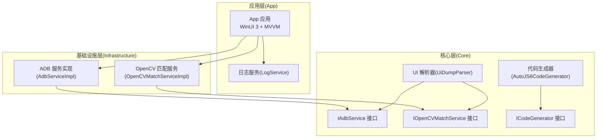
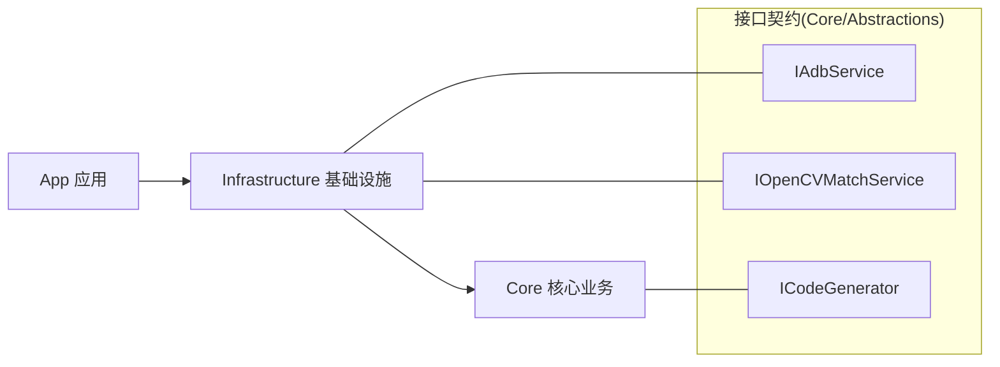
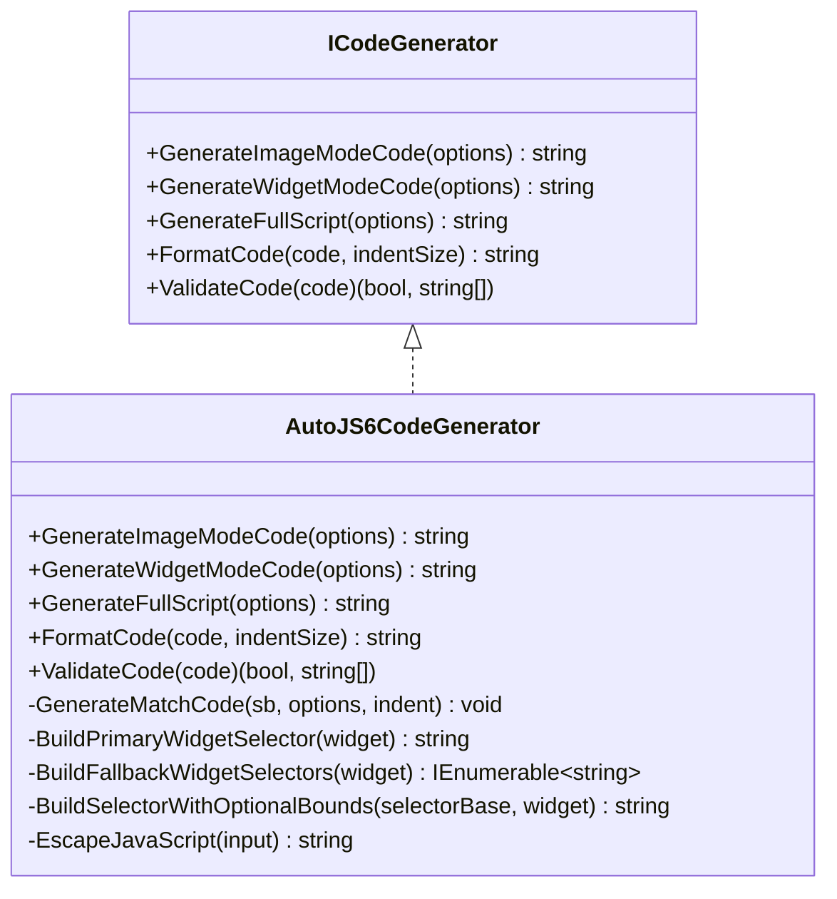
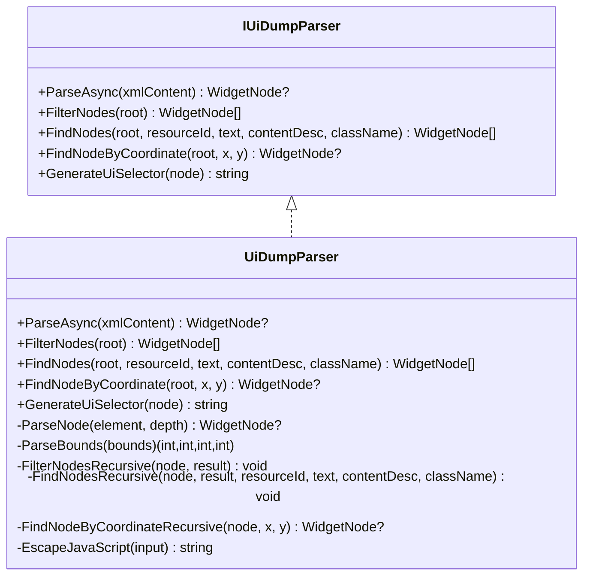
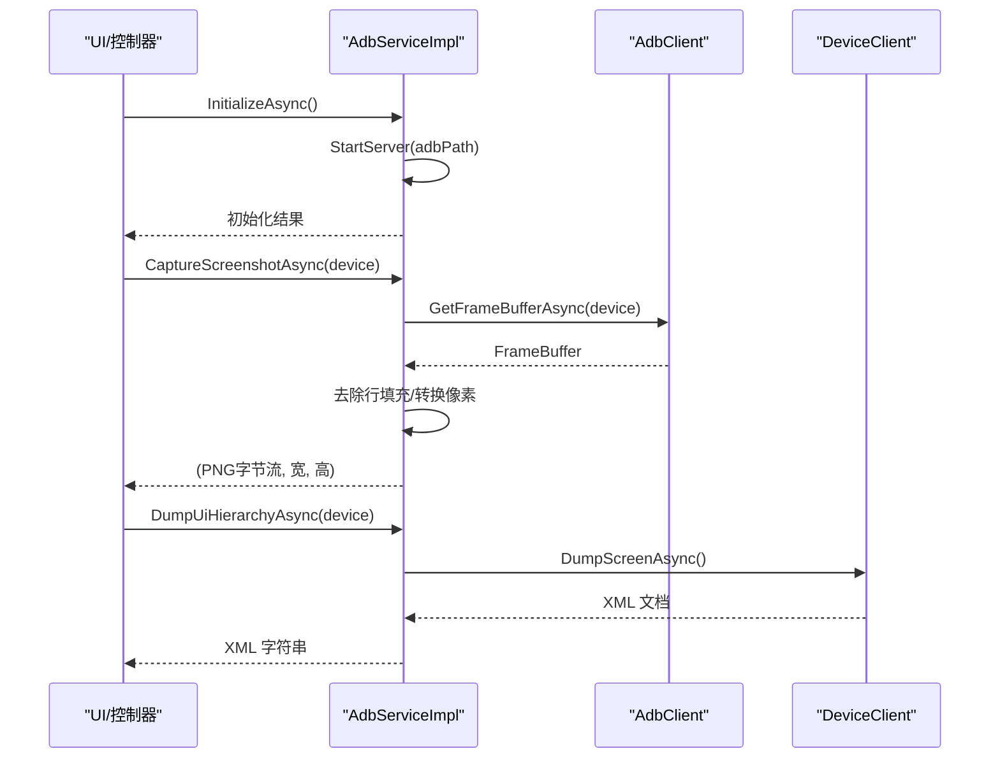
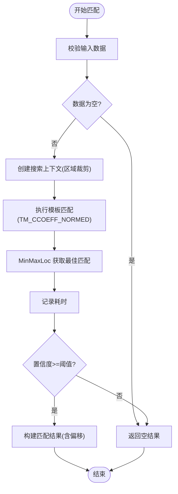
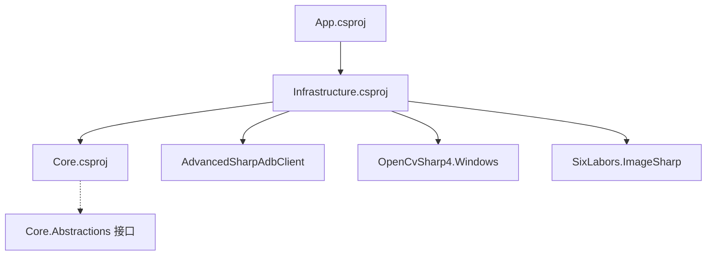

# 代码重构指导

<cite>
**本文引用的文件**
- [README.md](file://README.md)
- [DEVELOPMENT.md](file://DEVELOPMENT.md)
- [checklist.md](file://checklist.md)
- [manual.md](file://manual.md)
- [App.csproj](file://App/App.csproj)
- [Core.csproj](file://Core/Core.csproj)
- [Infrastructure.csproj](file://Infrastructure/Infrastructure.csproj)
- [AutoJS6CodeGenerator.cs](file://Core/Services/AutoJS6CodeGenerator.cs)
- [UiDumpParser.cs](file://Core/Services/UiDumpParser.cs)
- [AdbServiceImpl.cs](file://Infrastructure/Adb/AdbServiceImpl.cs)
- [OpenCVMatchServiceImpl.cs](file://Infrastructure/Imaging/OpenCVMatchServiceImpl.cs)
- [LogService.cs](file://App/Services/LogService.cs)
- [IAdbService.cs](file://Core/Abstractions/IAdbService.cs)
- [ICodeGenerator.cs](file://Core/Abstractions/ICodeGenerator.cs)
- [IOpenCVMatchService.cs](file://Core/Abstractions/IOpenCVMatchService.cs)
</cite>

## 目录
1. [引言](#引言)
2. [项目结构](#项目结构)
3. [核心组件](#核心组件)
4. [架构总览](#架构总览)
5. [详细组件分析](#详细组件分析)
6. [依赖关系分析](#依赖关系分析)
7. [性能考量](#性能考量)
8. [故障排查指南](#故障排查指南)
9. [结论](#结论)
10. [附录](#附录)

## 引言
本指导面向 AutoJS6 开发工具的代码重构，目标是在保持双引擎独立、单向依赖与异步优先的架构原则基础上，系统化地定义重构的时机、目标、方法与安全保障。文档结合项目现有实现与发布流程，提供可操作的重构策略、渐进式改进方法、质量检查清单与性能回归测试要求，帮助团队在稳定交付的同时持续提升代码质量与可维护性。

## 项目结构
项目采用 Clean Architecture 分层，分为三层：
- Core：纯业务逻辑，无 UI 依赖，独立可测试
- Infrastructure：外部依赖适配层（ADB、OpenCV、ImageSharp）
- App：UI 与 MVVM，负责编排与用户交互

图表来源
- [App.csproj:67-68](file://App/App.csproj#L67-L68)
- [Infrastructure.csproj:9-11](file://Infrastructure/Infrastructure.csproj#L9-L11)
- [Core.csproj:1-10](file://Core/Core.csproj#L1-L10)
- [AdbServiceImpl.cs:17-28](file://Infrastructure/Adb/AdbServiceImpl.cs#L17-L28)
- [OpenCVMatchServiceImpl.cs:11-18](file://Infrastructure/Imaging/OpenCVMatchServiceImpl.cs#L11-L18)
- [AutoJS6CodeGenerator.cs:11-12](file://Core/Services/AutoJS6CodeGenerator.cs#L11-L12)
- [UiDumpParser.cs:12-13](file://Core/Services/UiDumpParser.cs#L12-L13)

章节来源
- [README.md: 230-287:230-287](file://README.md#L230-L287)
- [App.csproj: 1-L84:1-84](file://App/App.csproj#L1-L84)
- [Infrastructure.csproj: 1-L19:1-19](file://Infrastructure/Infrastructure.csproj#L1-L19)
- [Core.csproj: 1-L10:1-10](file://Core/Core.csproj#L1-L10)

## 核心组件
- 代码生成器：负责生成 AutoJS6 图像模式与控件模式代码，支持重试逻辑、格式化与 Rhino 引擎约束校验。
- UI 解析器：解析 Android uiautomator XML，构建 WidgetNode 树，支持过滤、查询与坐标定位。
- ADB 服务：封装 ADB 服务器初始化、设备扫描、截图捕获、UI 层次结构导出、TCP/IP 连接与配对。
- OpenCV 匹配服务：基于 TM_CCOEFF_NORMED 的模板匹配，支持区域搜索、多结果匹配与相似度计算。
- 日志服务：统一日志入口，供 UI 订阅显示。

章节来源
- [AutoJS6CodeGenerator.cs: 11-L357:11-357](file://Core/Services/AutoJS6CodeGenerator.cs#L11-L357)
- [UiDumpParser.cs: 12-L263:12-263](file://Core/Services/UiDumpParser.cs#L12-L263)
- [AdbServiceImpl.cs: 17-L238:17-238](file://Infrastructure/Adb/AdbServiceImpl.cs#L17-L238)
- [OpenCVMatchServiceImpl.cs: 11-L204:11-204](file://Infrastructure/Imaging/OpenCVMatchServiceImpl.cs#L11-L204)
- [LogService.cs: 9-L51:9-51](file://App/Services/LogService.cs#L9-L51)

## 架构总览
- 双引擎独立：图像引擎与 UI 引擎的数据源、处理管线、渲染与代码生成完全解耦。
- 单向依赖：App → Infrastructure → Core，Core 无 UI 依赖。
- 异步优先：所有 I/O 操作均使用 async/await，UI 线程不阻塞。
- 清晰接口：通过 Core.Abstractions 定义服务契约，便于替换与测试。

图表来源
- [README.md: 264-287:264-287](file://README.md#L264-L287)
- [IAdbService.cs: 8-L57:8-57](file://Core/Abstractions/IAdbService.cs#L8-L57)
- [IOpenCVMatchService.cs: 8-L57:8-57](file://Core/Abstractions/IOpenCVMatchService.cs#L8-L57)
- [ICodeGenerator.cs: 8-L46:8-46](file://Core/Abstractions/ICodeGenerator.cs#L8-L46)

## 详细组件分析

### 代码生成器重构要点
- 目标：提升可测试性、可扩展性与可维护性；统一 Rhino 引擎约束校验；增强重试与回收逻辑。
- 关键重构方向
  - 将生成逻辑拆分为更细粒度的服务（如模板加载、匹配生成、点击生成），通过接口注入，便于单元测试。
  - 将格式化与校验逻辑抽取为独立服务，减少主流程复杂度。
  - 对重试与资源回收进行策略化封装，避免重复代码。
- 重构模式
  - 策略模式：针对不同模式（图像/控件）与不同重试策略，抽象为可插拔策略。
  - 工厂模式：根据 AutoJS6CodeOptions 动态生成不同变体的代码段。
  - 单元测试：围绕 ValidateCode 与 FormatCode 编写覆盖用例，确保约束与格式化稳定。

图表来源
- [ICodeGenerator.cs: 8-L46:8-46](file://Core/Abstractions/ICodeGenerator.cs#L8-L46)
- [AutoJS6CodeGenerator.cs: 11-L357:11-357](file://Core/Services/AutoJS6CodeGenerator.cs#L11-L357)

章节来源
- [AutoJS6CodeGenerator.cs: 13-L189:13-189](file://Core/Services/AutoJS6CodeGenerator.cs#L13-L189)
- [AutoJS6CodeGenerator.cs: 226-L258:226-258](file://Core/Services/AutoJS6CodeGenerator.cs#L226-L258)
- [AutoJS6CodeGenerator.cs: 260-L355:260-355](file://Core/Services/AutoJS6CodeGenerator.cs#L260-L355)

### UI 解析器重构要点
- 目标：优化节点过滤与查询性能，增强坐标定位准确性，提升可读性与可测试性。
- 关键重构方向
  - 将布局容器过滤规则抽取为策略，便于扩展与测试。
  - 将坐标定位算法模块化，支持多种命中策略（优先子节点、最近边界等）。
  - 将字符串转义逻辑集中管理，避免重复实现。
- 重构模式
  - 模板方法：ParseNode 作为骨架，子类可定制过滤与查询行为。
  - 策略模式：不同查询条件组合（resourceId/text/contentDesc/className）使用策略对象。
  - 单元测试：针对 ParseAsync、FilterNodes、FindNodes、GenerateUiSelector 编写用例。

图表来源
- [UiDumpParser.cs: 12-L97:12-97](file://Core/Services/UiDumpParser.cs#L12-L97)
- [UiDumpParser.cs: 103-L251:103-251](file://Core/Services/UiDumpParser.cs#L103-L251)

章节来源
- [UiDumpParser.cs: 14-L35:14-35](file://Core/Services/UiDumpParser.cs#L14-L35)
- [UiDumpParser.cs: 37-L54:37-54](file://Core/Services/UiDumpParser.cs#L37-L54)
- [UiDumpParser.cs: 56-L59:56-59](file://Core/Services/UiDumpParser.cs#L56-L59)
- [UiDumpParser.cs: 61-L97:61-97](file://Core/Services/UiDumpParser.cs#L61-L97)
- [UiDumpParser.cs: 103-L172:103-172](file://Core/Services/UiDumpParser.cs#L103-L172)
- [UiDumpParser.cs: 178-L251:178-251](file://Core/Services/UiDumpParser.cs#L178-L251)

### ADB 服务重构要点
- 目标：增强设备连接稳定性、提高截图解码效率、完善错误处理与可恢复性。
- 关键重构方向
  - 将 ADB 路径探测逻辑抽取为独立服务，支持自定义路径与多平台兼容。
  - 将帧缓冲解码与 PNG 编码分离，便于替换图像库或优化解码流程。
  - 将连接与配对流程抽象为可插拔策略，支持不同连接方式。
- 重构模式
  - 工厂模式：根据连接类型（USB/TCP/IP）创建不同的连接策略。
  - 适配器模式：将 ADB 原生 API 适配为统一接口，便于替换实现。
  - 单元测试：针对 InitializeAsync、CaptureScreenshotAsync、ConnectDeviceAsync 编写用例。

图表来源
- [AdbServiceImpl.cs: 33-L49:33-49](file://Infrastructure/Adb/AdbServiceImpl.cs#L33-L49)
- [AdbServiceImpl.cs: 72-L118:72-118](file://Infrastructure/Adb/AdbServiceImpl.cs#L72-L118)
- [AdbServiceImpl.cs: 120-L138:120-138](file://Infrastructure/Adb/AdbServiceImpl.cs#L120-L138)

章节来源
- [AdbServiceImpl.cs: 33-L49:33-49](file://Infrastructure/Adb/AdbServiceImpl.cs#L33-L49)
- [AdbServiceImpl.cs: 72-L118:72-118](file://Infrastructure/Adb/AdbServiceImpl.cs#L72-L118)
- [AdbServiceImpl.cs: 120-L138:120-138](file://Infrastructure/Adb/AdbServiceImpl.cs#L120-L138)
- [AdbServiceImpl.cs: 150-L179:150-179](file://Infrastructure/Adb/AdbServiceImpl.cs#L150-L179)
- [AdbServiceImpl.cs: 190-L236:190-236](file://Infrastructure/Adb/AdbServiceImpl.cs#L190-L236)

### OpenCV 匹配服务重构要点
- 目标：提升匹配性能与稳定性，支持多区域搜索与批量匹配，增强异常处理。
- 关键重构方向
  - 将搜索上下文封装为独立对象，支持区域裁剪与偏移计算。
  - 将模板匹配算法与阈值策略解耦，便于扩展其他匹配模式。
  - 将相似度计算与多结果匹配逻辑模块化，支持回调或流式处理。
- 重构模式
  - 模板方法：MatchTemplateAsync 作为骨架，子类可替换匹配算法。
  - 策略模式：阈值与区域策略可插拔。
  - 单元测试：针对 MatchTemplateAsync、MatchTemplateMultiAsync、CalculateSimilarityAsync 编写用例。

图表来源
- [OpenCVMatchServiceImpl.cs: 13-L60:13-60](file://Infrastructure/Imaging/OpenCVMatchServiceImpl.cs#L13-L60)
- [OpenCVMatchServiceImpl.cs: 163-L177:163-177](file://Infrastructure/Imaging/OpenCVMatchServiceImpl.cs#L163-L177)

章节来源
- [OpenCVMatchServiceImpl.cs: 13-L60:13-60](file://Infrastructure/Imaging/OpenCVMatchServiceImpl.cs#L13-L60)
- [OpenCVMatchServiceImpl.cs: 62-L122:62-122](file://Infrastructure/Imaging/OpenCVMatchServiceImpl.cs#L62-L122)
- [OpenCVMatchServiceImpl.cs: 124-L148:124-148](file://Infrastructure/Imaging/OpenCVMatchServiceImpl.cs#L124-L148)
- [OpenCVMatchServiceImpl.cs: 150-L161:150-161](file://Infrastructure/Imaging/OpenCVMatchServiceImpl.cs#L150-L161)
- [OpenCVMatchServiceImpl.cs: 163-L202:163-202](file://Infrastructure/Imaging/OpenCVMatchServiceImpl.cs#L163-L202)

### 日志服务重构要点
- 目标：统一日志入口，支持 UI 实时订阅与持久化，避免全局静态滥用。
- 关键重构方向
  - 将 LogService 改造为可注入服务，通过依赖注入容器管理生命周期。
  - 将日志事件改为异步通知，避免 UI 阻塞。
  - 增加日志级别与过滤器，便于生产环境控制输出。
- 重构模式
  - 观察者模式：UI 订阅 LogMessageReceived 事件。
  - 单元测试：验证日志事件触发与消息格式。

章节来源
- [LogService.cs: 9-L51:9-51](file://App/Services/LogService.cs#L9-L51)

## 依赖关系分析
- 项目依赖链
  - App 依赖 Infrastructure（项目引用）
  - Infrastructure 依赖 Core（项目引用）
  - Infrastructure 引用第三方库（ADB、OpenCV、ImageSharp）
  - Core 无 UI 依赖，仅定义接口契约
- 依赖方向
  - App → Infrastructure → Core
  - Core 仅通过接口与外部交互，避免直接依赖具体实现

图表来源
- [App.csproj: 67-L68:67-68](file://App/App.csproj#L67-L68)
- [Infrastructure.csproj: 9-L11:9-11](file://Infrastructure/Infrastructure.csproj#L9-L11)
- [Infrastructure.csproj: 13-L17:13-17](file://Infrastructure/Infrastructure.csproj#L13-L17)
- [Core.csproj: 1-L10:1-10](file://Core/Core.csproj#L1-L10)

章节来源
- [App.csproj: 67-L68:67-68](file://App/App.csproj#L67-L68)
- [Infrastructure.csproj: 9-L11:9-11](file://Infrastructure/Infrastructure.csproj#L9-L11)
- [Infrastructure.csproj: 13-L17:13-17](file://Infrastructure/Infrastructure.csproj#L13-L17)
- [Core.csproj: 1-L10:1-10](file://Core/Core.csproj#L1-L10)

## 性能考量
- 渲染与匹配
  - 图像引擎使用 Win2D 与 OpenCV，建议在匹配前限制搜索区域，避免全屏扫描。
  - 控件模式建议使用 boundsInside 精确限定查找范围。
- I/O 与异步
  - 所有 I/O 操作使用 async/await，避免阻塞 UI 线程。
  - ADB 截图与 UI Dump 使用流式读取与内存池化，减少 GC 压力。
- 内存管理
  - 模板与截图使用后及时回收，避免内存泄漏。
  - 控制循环内变量声明，遵循 Rhino 引擎约束，避免重复分配。

章节来源
- [README.md: 342-374:342-374](file://README.md#L342-L374)
- [OpenCVMatchServiceImpl.cs: 13-L60:13-60](file://Infrastructure/Imaging/OpenCVMatchServiceImpl.cs#L13-L60)
- [AdbServiceImpl.cs: 72-L118:72-118](file://Infrastructure/Adb/AdbServiceImpl.cs#L72-L118)

## 故障排查指南
- 发布与打包
  - 若本地 dotnet build -c Release 失败，检查平台目标与 Trim/ReadyToRun 设置。
  - MSIX 签名失败时，核对证书 Subject 与 Publisher 一致性及签名工具可用性。
  - EXE 安装器失败时，检查 Inno Setup 路径与输出目录可写。
- 验收测试
  - 使用 checklist.md 的 P0 项逐条验证安装、启动、ADB 连接、截图与匹配、控件模式主闭环与稳定性。
  - 通过 manual.md 的 manual-release-test 预演，确保打包链与上传链可用。
- 回滚策略
  - 生产包问题优先发布补丁版本，避免修改已发布标签。
  - 通过 release-please 与 manual-release-test 的组合验证，确保问题可追溯。

章节来源
- [DEVELOPMENT.md: 224-L250:224-250](file://DEVELOPMENT.md#L224-L250)
- [DEVELOPMENT.md: 232-L241:232-241](file://DEVELOPMENT.md#L232-L241)
- [DEVELOPMENT.md: 242-L249:242-249](file://DEVELOPMENT.md#L242-L249)
- [checklist.md: 29-L153:29-153](file://checklist.md#L29-L153)
- [manual.md: 430-L522:430-522](file://manual.md#L430-L522)

## 结论
通过坚持双引擎独立、单向依赖与异步优先的架构原则，结合接口契约与模块化重构，AutoJS6 开发工具可以在保持高稳定性的同时持续演进。建议以小步快跑的方式推进重构，每次变更聚焦单一职责，配套完善的单元测试与验收测试，确保发布前的质量与可回溯性。

## 附录

### 重构时机与目标
- 何时重构
  - 新功能引入前的架构准备期
  - 回归测试中发现的重复代码与脆弱点
  - 性能瓶颈出现时（匹配耗时、内存占用）
  - 用户反馈的交互与稳定性问题
- 重构目标
  - 提升可测试性与可维护性
  - 明确职责边界，降低耦合
  - 保持异步与解耦特性不变

### 重构技术方法
- 代码重构模式
  - 策略模式：将可变因素（匹配算法、连接方式、重试策略）抽象为策略
  - 工厂模式：根据配置动态创建对象
  - 模板方法：将通用流程固定，子类实现差异点
- 设计模式应用
  - 观察者模式：日志事件通知
  - 适配器模式：外部库适配
- 架构演进策略
  - 分层不变：Core 保持纯业务，App 仅编排
  - 接口先行：新增功能先定义接口，再实现
  - 渐进式改进：每次改动不超过 512 行，确保可审查

### 安全保障措施
- 版本控制
  - 使用分支策略与小步提交，每个提交聚焦单一改进
  - 发布前通过 release-please 与 manual-release-test 验证
- 回滚策略
  - 生产问题优先补丁版本，避免修改已发布标签
  - 保留 pre-release 用于快速验证修复
- 测试验证
  - 单元测试：Core 层必须有覆盖
  - 集成测试：App 与 Infrastructure 的端到端验证
  - 验收测试：checklist.md 的 P0 项与 manual.md 的打包链验证

### 重构案例与步骤指导
- 案例：将代码生成器中的重试逻辑策略化
  - 步骤
    1) 抽象 IRetryPolicy 接口，定义 Apply 方法
    2) 实现固定次数与指数退避策略
    3) 在 AutoJS6CodeGenerator 中注入 IRetryPolicy
    4) 编写单元测试覆盖不同策略
- 案例：将 UI 解析器的过滤规则模块化
  - 步骤
    1) 定义 INodeFilter 接口
    2) 实现布局容器过滤、可见性过滤等策略
    3) 在 FilterNodes 中组合多个策略
    4) 编写用例验证过滤效果

### 代码质量检查清单
- 架构合规
  - Core 无 UI 依赖
  - 依赖方向为 App → Infrastructure → Core
  - 双引擎独立，数据与处理管线解耦
- 性能与稳定性
  - 匹配区域限制，避免全屏扫描
  - 循环内变量声明遵循 Rhino 约束
  - 资源及时回收，内存占用稳定
- 测试覆盖
  - Core 层单元测试通过率达标
  - 关键流程（截图、匹配、解析、生成）有集成测试
  - 验收测试 checklist.md P0 项通过

### 性能回归测试要求
- 匹配性能
  - 单次匹配耗时与多结果匹配耗时在阈值内
  - 多设备截图与模板匹配并发稳定
- 内存与资源
  - 连续截图与匹配 10 次后内存无持续增长
  - 模板与截图对象回收及时
- 用户体验
  - UI 无明显卡顿，60FPS 渲染稳定
  - 失败场景提示明确，不伪造命中结果