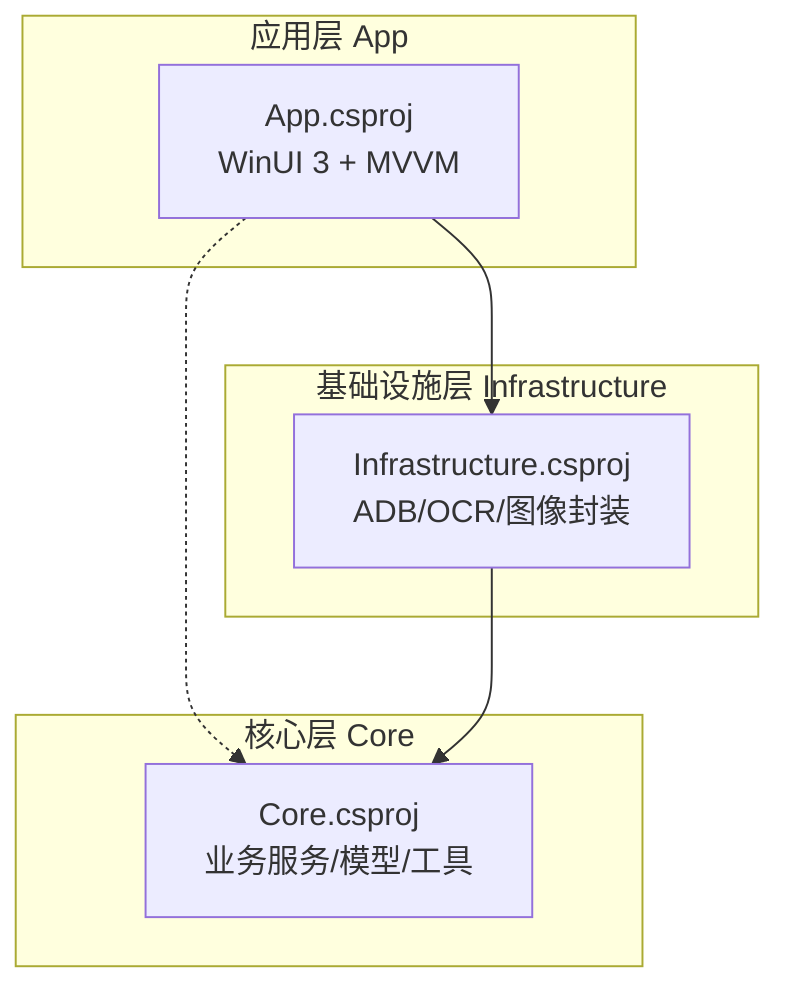
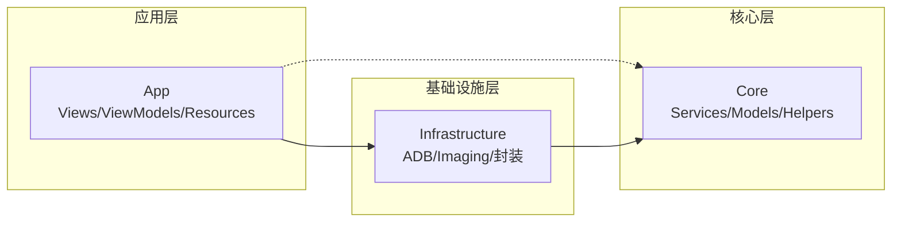
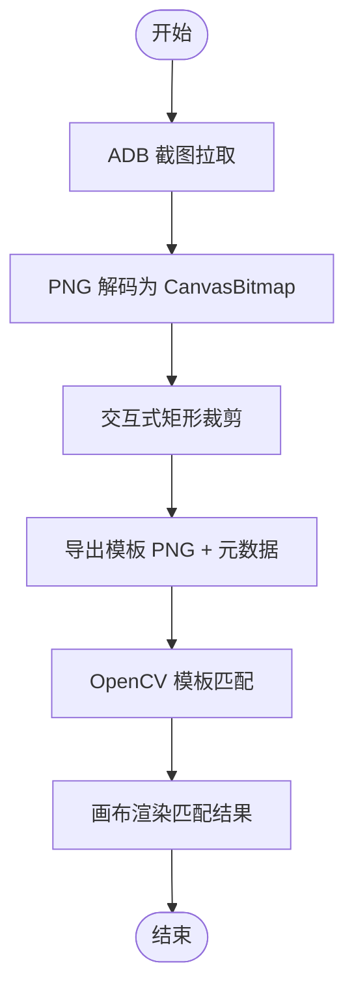
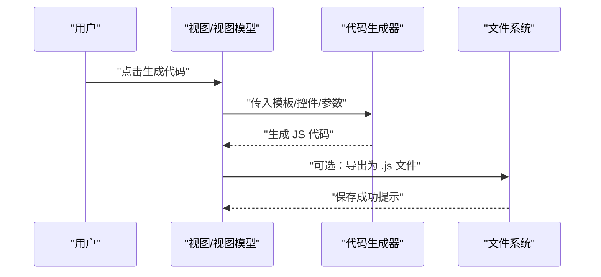
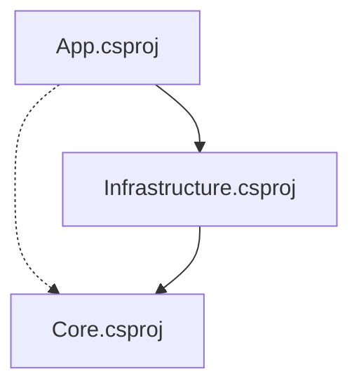

# 代码审查规范

<cite>
**本文引用的文件**
- [README.md](file://README.md)
- [AGENTS.md](file://AGENTS.md)
- [DEVELOPMENT.md](file://DEVELOPMENT.md)
- [manual.md](file://manual.md)
- [checklist.md](file://checklist.md)
- [openspec/project.md](file://openspec/project.md)
- [openspec/changes/winui3-visual-dev-toolkit/proposal.md](file://openspec/changes/winui3-visual-dev-toolkit/proposal.md)
- [openspec/changes/winui3-visual-dev-toolkit/design.md](file://openspec/changes/winui3-visual-dev-toolkit/design.md)
- [openspec/changes/winui3-visual-dev-toolkit/specs/autojs6-code-generator/spec.md](file://openspec/changes/winui3-visual-dev-toolkit/specs/autojs6-code-generator/spec.md)
- [openspec/changes/winui3-visual-dev-toolkit/specs/image-processing-engine/spec.md](file://openspec/changes/winui3-visual-dev-toolkit/specs/image-processing-engine/spec.md)
- [App/App.csproj](file://App/App.csproj)
- [Core/Core.csproj](file://Core/Core.csproj)
- [Infrastructure/Infrastructure.csproj](file://Infrastructure/Infrastructure.csproj)
</cite>

## 目录
1. [简介](#简介)
2. [项目结构](#项目结构)
3. [核心组件](#核心组件)
4. [架构总览](#架构总览)
5. [详细组件分析](#详细组件分析)
6. [依赖分析](#依赖分析)
7. [性能考量](#性能考量)
8. [故障排查指南](#故障排查指南)
9. [结论](#结论)
10. [附录](#附录)

## 简介
本规范旨在为 AutoJS6 开发工具建立系统化的代码审查流程与标准，覆盖代码质量、性能、安全与可维护性维度，明确提交前检查、审查者分配、反馈与修改跟踪机制，规范 GitHub Pull Request 流程与代码注释风格，并提供审查决策与并行审查策略，辅以可执行的审查清单与检查要点，确保审查的有效性与一致性。

## 项目结构
项目采用 Clean Architecture 分层与双引擎独立架构：
- 应用层 App：WinUI 3 桌面应用，MVVM 与 UI 交互
- 基础设施层 Infrastructure：封装外部依赖（ADB、OpenCV、ImageSharp）
- 核心层 Core：纯业务逻辑（服务接口与实现、模型与工具）

图表来源
- [App/App.csproj:1-84](file://App/App.csproj#L1-L84)
- [Infrastructure/Infrastructure.csproj:1-19](file://Infrastructure/Infrastructure.csproj#L1-L19)
- [Core/Core.csproj:1-10](file://Core/Core.csproj#L1-L10)

章节来源
- [README.md:230-280](file://README.md#L230-L280)
- [AGENTS.md:69-95](file://AGENTS.md#L69-L95)

## 核心组件
- 双引擎独立架构：图像处理引擎（像素/位图 + OpenCV）与 UI 分析引擎（控件树 + UiSelector）完全解耦，数据源、处理管线、渲染与代码生成路径分离。
- 分层依赖：App → Infrastructure → Core ← Infrastructure，Core 为纯业务逻辑，无 UI/外部库依赖。
- 异步非阻塞：所有 I/O（ADB、OpenCV、XML 解析、纹理上传）使用 async/await，UI 线程永不阻塞。
- 60FPS 渲染：分层渲染（CanvasImageLayer + CanvasOverlayLayer），仅重绘变化图层，启用 GPU 加速与 CanvasBitmap 缓存池。
- 代码生成约束：严格遵循 AutoJS6/Rhino 引擎约束（循环体内 var、单轮单截图、region 优先、模板回收），并复用现有 cmd 脚本的业务逻辑与算法。

章节来源
- [AGENTS.md:40-95](file://AGENTS.md#L40-L95)
- [AGENTS.md:229-253](file://AGENTS.md#L229-L253)
- [openspec/changes/winui3-visual-dev-toolkit/design.md:30-153](file://openspec/changes/winui3-visual-dev-toolkit/design.md#L30-L153)
- [openspec/changes/winui3-visual-dev-toolkit/specs/autojs6-code-generator/spec.md:1-136](file://openspec/changes/winui3-visual-dev-toolkit/specs/autojs6-code-generator/spec.md#L1-L136)

## 架构总览
双引擎独立与分层依赖的总体关系如下：

图表来源
- [README.md:264-287](file://README.md#L264-L287)
- [AGENTS.md:69-95](file://AGENTS.md#L69-L95)

## 详细组件分析

### 图像处理引擎（像素级）
- 能力要点：ADB 截图拉取、交互式裁剪、像素坐标拾取、OpenCV 模板匹配、导出模板与元数据、异步处理与缓存优化。
- 审查关注点：坐标系一致性（左上角原点）、阈值滑动仅重算匹配层、CanvasBitmap 缓存池使用、高分辨率降采样、错误处理与日志输出。

图表来源
- [openspec/changes/winui3-visual-dev-toolkit/specs/image-processing-engine/spec.md:1-121](file://openspec/changes/winui3-visual-dev-toolkit/specs/image-processing-engine/spec.md#L1-L121)

章节来源
- [openspec/changes/winui3-visual-dev-toolkit/specs/image-processing-engine/spec.md:1-121](file://openspec/changes/winui3-visual-dev-toolkit/specs/image-processing-engine/spec.md#L1-L121)
- [AGENTS.md:229-253](file://AGENTS.md#L229-L253)

### UI 图层分析引擎（控件级）
- 能力要点：UI 树解析、布局容器过滤（跳过 Layout 且无 clickable/text/content-desc）、控件边界框渲染、双向联动、属性面板、UiSelector 生成。
- 审查关注点：控件树解析容错、属性映射正确性、坐标映射（bounds → Rect）、TreeView 虚拟化与性能。

章节来源
- [openspec/project.md:217-239](file://openspec/project.md#L217-L239)
- [AGENTS.md:273-287](file://AGENTS.md#L273-L287)

### 代码生成器（AutoJS6）
- 能力要点：图像模式（images.findImage + click + recycle）、控件模式（id()/text()/desc()/boundsInside() + click/setText）、路径兼容（assets/相对/绝对）、格式化与注释、预览与导出。
- 审查关注点：Rhino 引擎约束（循环体内 var）、OOM 预防（单轮单截图、region 优先、及时回收）、与现有 cmd 脚本行为一致性。

图表来源
- [openspec/changes/winui3-visual-dev-toolkit/specs/autojs6-code-generator/spec.md:1-136](file://openspec/changes/winui3-visual-dev-toolkit/specs/autojs6-code-generator/spec.md#L1-L136)
- [AGENTS.md:152-227](file://AGENTS.md#L152-L227)

章节来源
- [openspec/changes/winui3-visual-dev-toolkit/specs/autojs6-code-generator/spec.md:1-136](file://openspec/changes/winui3-visual-dev-toolkit/specs/autojs6-code-generator/spec.md#L1-L136)
- [AGENTS.md:152-227](file://AGENTS.md#L152-L227)

### ADB 与设备管理
- 能力要点：设备扫描、连接管理、命令执行、日志输出。
- 审查关注点：异常处理（Toast 提示、最多 3 次重试、5 秒超时）、日志完整性、与现有脚本工作流一致性。

章节来源
- [openspec/changes/winui3-visual-dev-toolkit/proposal.md:16-36](file://openspec/changes/winui3-visual-dev-toolkit/proposal.md#L16-L36)
- [openspec/project.md:303-325](file://openspec/project.md#L303-L325)

## 依赖分析
- 项目层依赖关系：App → Infrastructure → Core ← Infrastructure，Core 为纯业务逻辑，Infrastructure 封装外部依赖，App 仅负责 UI/MVVM。
- 技术栈与版本：.NET 8、WinUI 3、Win2D、OpenCvSharp4、SharpAdbClient、CommunityToolkit.Mvvm。

图表来源
- [App/App.csproj:67-68](file://App/App.csproj#L67-L68)
- [Infrastructure/Infrastructure.csproj:9-11](file://Infrastructure/Infrastructure.csproj#L9-L11)
- [Core/Core.csproj:1-10](file://Core/Core.csproj#L1-L10)

章节来源
- [AGENTS.md:69-95](file://AGENTS.md#L69-L95)
- [App/App.csproj:1-84](file://App/App.csproj#L1-L84)
- [Infrastructure/Infrastructure.csproj:1-19](file://Infrastructure/Infrastructure.csproj#L1-L19)
- [Core/Core.csproj:1-10](file://Core/Core.csproj#L1-L10)

## 性能考量
- 异步架构：所有 I/O 操作使用 async/await，避免 UI 线程阻塞。
- 渲染性能：分层渲染仅重绘变化图层，CanvasBitmap 缓存池，GPU 加速，Win2D 60FPS。
- 内存优化：阈值滑动仅重算匹配层，及时回收临时对象，TreeView 虚拟化。
- 模块规模：运行时/feature/action 模块上限 255 行，硬上限 512 行，超限需拆分。

章节来源
- [AGENTS.md:229-253](file://AGENTS.md#L229-L253)
- [openspec/project.md:282-301](file://openspec/project.md#L282-L301)
- [openspec/project.md:327-336](file://openspec/project.md#L327-L336)

## 故障排查指南
- ADB 连接异常：捕获异常、Toast 提示、最多 3 次重试、5 秒超时。
- OpenCV 匹配异常：捕获异常、显示错误信息。
- UI 树解析异常：容错解析（跳过无效节点）、记录警告日志。
- 日志输出：完整输出 ADB 命令结果与错误信息。
- 发布前验证：先功能验证（checklist.md P0 通过），再 Actions 打包与上传链路验证，最后推进正式发版。

章节来源
- [openspec/project.md:303-325](file://openspec/project.md#L303-L325)
- [manual.md:330-406](file://manual.md#L330-L406)
- [DEVELOPMENT.md:182-250](file://DEVELOPMENT.md#L182-L250)

## 结论
本规范以双引擎独立架构与分层依赖为核心，结合异步非阻塞与 60FPS 渲染要求，明确了代码质量、性能、安全与可维护性的审查标准，并配套 GitHub Actions 发版前验证手册与功能验证清单，确保审查流程可执行、可追溯、可复用。

## 附录

### 代码审查流程
- 提交前检查：依据 openspec/project.md 与 checklist.md 的“每次提交前最少验证项”逐项核对。
- 审查者分配：按模块归属（图像/控件/基建/应用）与作者协商分配，避免重复审查。
- 审查反馈：使用 GitHub 评论与线程讨论，明确问题类型（P0/P1）、影响范围与修复建议。
- 修改跟踪：变更需在 PR 描述中列出验证清单完成情况与回归测试结果，确保阻塞性问题关闭后再合并。

章节来源
- [openspec/project.md:327-367](file://openspec/project.md#L327-L367)
- [checklist.md:1-186](file://checklist.md#L1-L186)

### 审查工具与注释规范
- GitHub Pull Request：使用标准 PR 模plate，关联 Issue/Spec，标注变更类型（功能/修复/性能/安全）。
- 代码注释：遵循 AGENTS.md 的“输出规则”，注释简洁明确，解释业务约束与 AutoJS6 API 限制。
- 日志与错误：统一使用 Toast/日志输出，错误信息包含上下文与建议操作。

章节来源
- [AGENTS.md:308-326](file://AGENTS.md#L308-L326)
- [openspec/project.md:317-325](file://openspec/project.md#L317-L325)

### 审查决策机制
- 批准标准：P0 项全部通过；P1 项可带已知问题进入内部版；阻塞性问题必须修复。
- 并行审查策略：同一模块由一名审查者主导，其他审查者提供补充意见；跨引擎变更需双引擎负责人共同确认。
- 合并策略：PR 必须通过 CI 与人工验证，阻塞性问题关闭后方可合并。

章节来源
- [checklist.md:7-16](file://checklist.md#L7-L16)
- [manual.md:447-522](file://manual.md#L447-L522)

### 审查清单与检查要点
- 核心功能模块：依赖关系、双引擎独立、异步架构、内存优化、渲染性能、模块规模。
- 代码生成逻辑：Rhino 引擎约束、OOM 预防、注释与格式化。
- 坐标系对齐：图像/控件/画布坐标系均为左上角原点，禁止坐标系转换。
- 控件树解析：布局容器过滤规则、属性解析、坐标映射、容错解析。
- 画布渲染：分层渲染、缓存池、GPU 加速、60FPS。
- 错误处理：ADB/OCV/UI 树异常处理、日志完整性。

章节来源
- [openspec/project.md:327-367](file://openspec/project.md#L327-L367)
- [AGENTS.md:256-287](file://AGENTS.md#L256-L287)